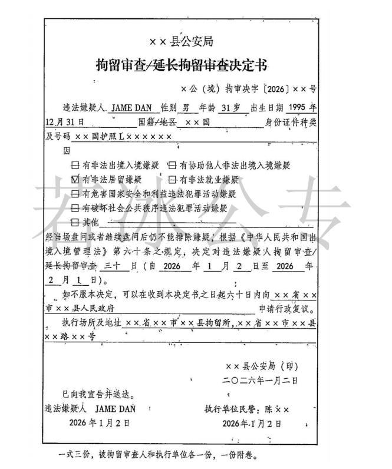
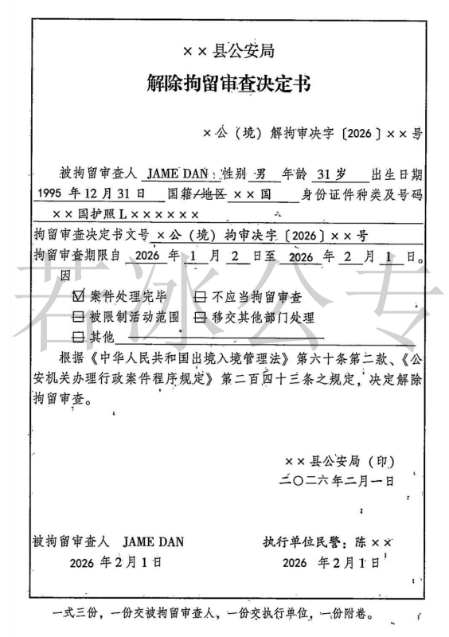
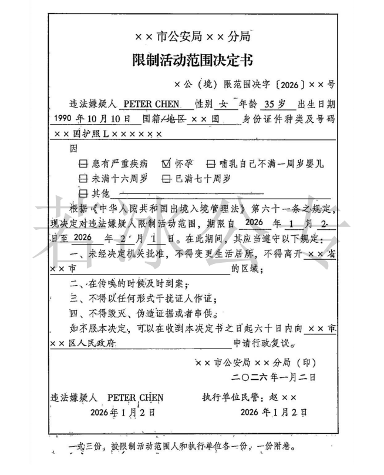
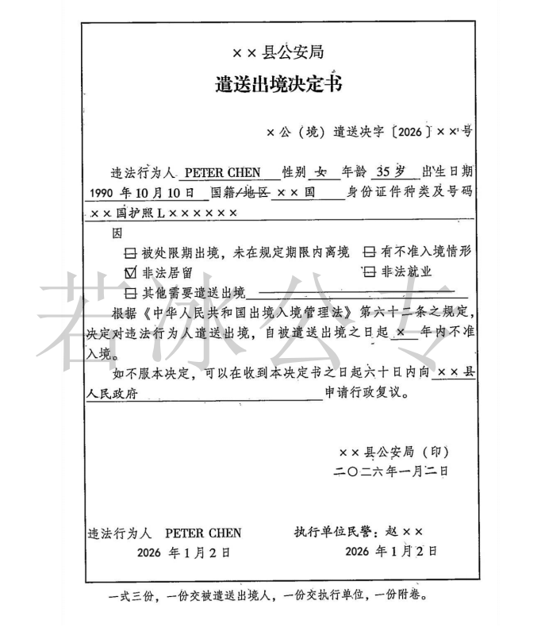
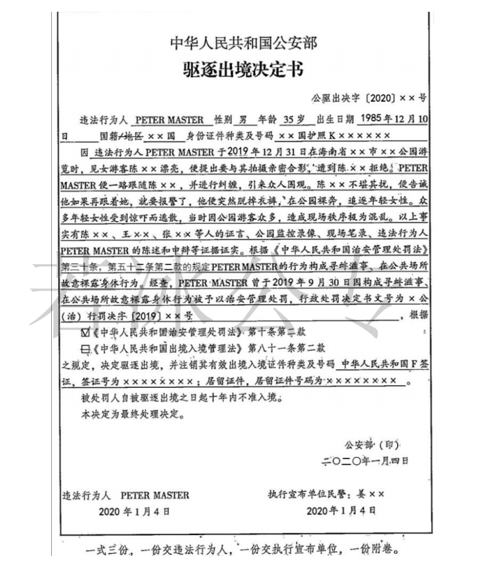

### **一、涉外案件办理的一般原则**

办理涉外行政案件，应当维护国家主权和利益，坚持平等互利原则。

### **二、强制措施**

#### （一）**拘留审查**

##### 1、**审批**

经==县级以上公安机关或者出入境边防检查机关负责人==批准，可以拘留审查。

##### 2、**条件**

经==当场盘问或者继续盘问后不能排除嫌疑=={.warning}，需要作进一步调查的，经==县级以上公安机关或者出入境边防检查机关负责人==批准，可以拘留审查：

（1）有非法出境入境嫌疑的；

（2）有协助他人非法出境入境嫌疑的；

（3）有非法居留、非法就业嫌疑的；

（4）有危害国家安全和利益，破坏社会公共秩序或者从事其他违法犯罪活动嫌疑的。

##### 3、**程序、期限和地点**

（1）**程序**

实施拘留审查，应当出示**拘留审查决定书**，并在==二十四小时==内进行询问。

::: tip

- 24小时笔录
	- 拘留审查
	- 拘留
	- 逮捕

:::
  
（2）**期限**

拘留审查的期限不得超过==三十日==；案情复杂的，经==上一级公安机关或者出入境边防检查机关==批准可以延长至==六十日==。

对国籍、身份不明的，拘留审查期限自查清其国籍、身份之日起计算。


::: tip 身份不明，时间不起算情形


- 拘留审查
- 限制活动范围
- 刑事案件中的逮捕

:::

（3）**地点**：可以在==拘留所==

::: note 法条

《拘留所条例实施办法》第5条第二款：被公安机关依法决定拘留审查的人，以及被依法决定、判处驱逐出境或者被依法决定遣送出境但不能立即执行的人，可以在拘留所拘押。

:::

::: tip 拘留所出现的三种人

拘留、司法拘留、拘留审查。

:::

##### 4、**救济**

可以依法申请行政复议，==该行政复议决定为最终决定==。

::: warning 行政复议一次决定为最终决定

- 拘留审查
- 限制活动范围
- 遣送出境
- 对老外采取继续盘问

==剩下的强制措施无论是对人身的，对财产的老外都可以复议，也可以诉讼=={.danger}。
:::

##### 5、**解除**

具有下列情形之一的，应当==解除拘留审查==：

（1）被决定遣送出境、限期出境或者驱逐出境的；

（2）不应当拘留审查的；

（3）被采取限制活动范围措施的；

（4）案件移交其他部门处理的；

（5）其他情形。

6、拘留审查可以折抵行政拘留，==一日折抵一日==。


::: tip 行政拘留时间折抵问题

- 刑事拘留==一日折抵一日==
- 逮捕==一日折抵一日==
- 指监居==两日折抵一日==

:::

::: card





:::


#### （二）**限制活动范围**

##### 1、**审批**

经==县级以上公安机关或者出入境边防检查机关负责人==批准。

##### 2、**条件**（==老幼孕乳病=={.warning}）

外国人具有下列情形之一的，不适用拘留审查，经县级以上公安机关或者出入境边防检查机关负责人批准，可以限制其活动范围：

（1）患有严重疾病的；

（2）怀孕或者哺乳自己的婴儿的；

（3）未满十六周岁或者已满七十周岁的；

（4）不宜适用拘留审查的其他情形。


::: warning

此处**自己婴儿**包括亲生包括收养。收养核心是要看有没有在民政局做登记。

:::

##### 3、**期限和地点**

（1）限制活动范围的期限==不得超过六十日==。

（2）对国籍、身份不明的，限制活动范围期限自查清其国籍、身份之日起计算。

（3）地点：非羁押场所和非办案场所。

##### 4、**应遵守的规定**

被限制活动范围的外国人，应当按照要求接受审查，未经公安机关批准，不得离开限定的区域。

被限制活动范围的外国人应当遵守下列规定：

（1）未经决定机关批准，不得变更生活居所，超出指定的活动区域；

（2）在传唤的时候及时到案；

（3）不得以任何形式干扰证人作证；

（4）不得毁灭、伪造证据或者串供。

##### 5、**救济**：可以依法申请行政复议，==该行政复议决定为最终决定==。

::: warning 行政复议一次决定为最终决定

- 拘留审查
- 限制活动范围
- 遣送出境
- 对老外采取继续盘问

==剩下的强制措施无论是对人身的，对财产的老外都可以复议，也可以诉讼=={.danger}。
:::


::: card



:::


### **三、处理措施**

#### （一）**遣送出境**

##### 1、**审批**

经==县级以上公安机关或者出入境边防检查机关负责人==批准，可以遣送出境。

##### 2、**条件**

==外国人或港澳台同胞=={.important}具有下列情形之一的，可以依法遣送出境：

::: tip 港澳台同胞

本章==其余的都不能对港澳台同胞使用==。

:::

（一）被处限期出境，未在规定期限内离境的；

（二）有不准入境情形的；

（三）非法居留、非法就业的；

（四）违反法律、行政法规需要遣送出境的。

##### 3、**遣送到哪?**

被遣送出境的外国人可以被遣送至下列国家或者地区：

（1）国籍国；

（2）出生地国或地区；

（3）入境前的居住国或者地区；

（4）入境前的出境口岸的所属国或者地区；

（5）其他允许被遣送出境的外国人入境的国家或者地区。

##### 4、**如何执行?**

一般由警察押送至边境或者出入境口岸，交至接受国官员或将其送上出境交通工具即可。

##### 5、**如何救济?**

可以依法申请行政复议，该行政复议决定为最终决定。

::: warning 行政复议一次决定为最终决定

- 拘留审查
- 限制活动范围
- 遣送出境
- 对老外采取继续盘问

==剩下的强制措施无论是对人身的，对财产的老外都可以复议，也可以诉讼=={.danger}。
:::

##### 6、**不准入境期限**

自被遣送出境之日起==一至五年内==不准入境。

##### 7、**暂时不具备遣送出境条件时的羁押地**

==应当羁押在拘留所或者遣返场所==：被决定遣送出境或者驱逐出境但因天气、交通运输工具班期、当事人健康状况等客观原因或者国籍、身份不明，不能立即执行的。

##### 8、**性质**

不属于行政处罚。

::: card



:::


#### （二）**限期出境**

##### 1、**审批**

==县级以上公安机关或者出入境边防检查机关==决定，可以限期出境。

##### 2、**条件**

（1）违反治安管理的；

（2）从事与停留居留事由不相符的活动的；

（3）违反中国法律、法规规定，不适宜在中国境内继续停留居留的。

##### 3、**期限**
  
对外国人决定限期出境的，应当规定外国人离境的期限，注销其有效签证或者停留居留证件。限期出境的期限==不得超过三十日==。

##### 4、**救济**

可以申请行政复议或行政诉讼。

::: warning

- 限期出境两可（==可复议可诉讼==）

- 驱逐出境两不可（==不可复议不可诉讼==）

:::


##### 5、**性质**

==行政处罚==。

#### （三）**驱逐出境**

##### 1、**审批主体**

公安部——承办的公安机关层报公安部处以驱逐出境；

##### 2、**宣布和执行主体**

==承办案件的公安机关==；

##### 3、**对象**

外国人违反治安管理或者出境入境管理，情节严重，尚不构成犯罪的；

##### 4、**期限**

被驱逐出境的外国人，自被驱逐出境之日起==十年内==不准入境；

##### 5、**救济**

无救济路径；

::: warning

- 限期出境两可（==可复议可诉讼==）

- 驱逐出境两不可（==不可复议不可诉讼==）

:::

##### 6、**性质**

行政处罚。

::: card



:::


### **处理措施辨析**

| 处理措施 | 审批                               | 期限                               | 救济                 | 性质      |
| ---- | -------------------------------- | -------------------------------- | ------------------ | ------- |
| 遣送出境 | ==县级以上==公安机关负责人或出入境边防检查机关负责人批准   | 无明确期限规定，自被遣送出境之日起 `1 年至 5 年`不准入境 | 只能申请行政复议，复议决定为最终决定 | 不属于行政处罚 |
| 限期出境 | ==县级以上==公安机关负责人或出入境边防检查机关负责人批准   | 不得超过`30日`                        | 可申请行政复议或行政诉讼       | 属于行政处罚  |
| 驱逐出境 | ==公安部=={.danger}（承办的公安机关层报公安部处以） | 无明确期限规定，自被驱逐出境之日起`10 年内`不准入境     | 无救济途径              | 不属于行政处罚 |


### **四、特殊制度**——报告通报通知探视制度(==仅适用于限制或剥夺人身自由==)

#### （一）**一般规定**

办理涉外行政案件，应当按照国家有关办理涉外案件的规定，严格执行请示报告、内部通报、对外通知等各项制度。

#### （二）**对外国人作出行政拘留、拘留审查或者其他限制人身自由以及限制活动范围的决定**。

1、**请示报告**：决定机关==48小时内==将情况报告省级公安机关；

2、**内部通报**：省级公安机关通报同级外事部门；

3、**对外通知**：省级公安机关通知该外国人所属的国家驻华使馆、领馆。

::: warning

当事人要求不通知使馆、领馆，且我国与当事人国籍国==未签署双边协议规定必须通知的==，可以不通知，但应当由其本人==提出书面请求==。

:::

#### （三）**外国人在被行政拘留、拘留审查或者其他限制人身自由以及限制活动范围期间死亡的**。

1、**请示报告**：办案部门——省级公安机关——公安部；

2、**内部通报**：省级公安机关——省外事部门；公安部——国家外事部门；

3、**对外通知**：省级公安机关——该外国人所属国家驻华使馆、领馆。

#### （四）**驻华外交、领事官员探视被限制自由的本国公民**

1、应当及时安排：所属国家驻华外交、领事官员要求探视的，决定机关应当及时 安排。

2、可以不予安排：该外国人==拒绝探视==并==出具书面声明==。

### **五** **、其他规定**

#### （一）**国籍问题**(看证——协查——自报或无国籍)

1、**看入境证件**：以其==入境时有效证件上所标明的国籍==为准；

2、**出入境管理部门协助查明**：国籍有疑问或者国籍不明的，由==公安机关出入境管理部门协助查明==；

3、**自报或无国籍处理**：对无法查明国籍、身份不明的外国人，按照==其自报的国籍或者无国籍人==对待。

#### （二）**外交特权和豁免权问题**（==证据——省级协调——不强制==）

1、==证据要扎实==。

2、报告省级公安机关，==省级公安机关商请同级外事部门通过外交途径解决==。

3、==不得限制其人身自由和财产自由=={.danger}。

::: note 关联法条

《公安机关办理行政案件程序规定》第240条：违法行为人为享有外交特权和豁免权的外国人的，办案公安机关应当将其身份、证件及违法行为等基本情况记录在案，保存有关证据，并尽快将有关情况层报省级公安机关，由省级公安机关商请同级人民政府外事部门通过外交途径处理。对享有外交特权和豁免权的外国人，不得采取限制人身自由和查封、扣押的强制措施。

:::
  

#### （三）**语言问题**

##### 1、**找翻译**

（1）**公安找**——公安出钱；

（2）自**己找**——==县级以上公安机关负责人==批准——自己出钱。

##### 2、**自己说**——书面声明。


### **六、思维导图**

```markmap
---
markmap:
  colorFreezeLevel: 2
---
# 当场查问与涉外行政案件办理

## 当场查问/继续盘问
- 前提
- 批准及期限
  - 县级以上公安机关或出入境边防检查机关负责人批准：30日
  - 上一级公安机关或出入境边防检查机关批准：30日
- 24小时记录
- 身份不明时，时间不计

## 拘留审查
- 行政强制措施
- 地点：拘留所或遣返场所
- 前提：不适用当场/继续盘问
  - 不满16周岁
  - 已满70周岁
  - 孕妇
  - 严重疾病
- 批准：县级以上公安机关或出入境边防检查机关

## 限制活动范围
- 批准：县级以上公安机关或出入境边防检查机关负责人
- 期限：不超过60日
- 身份不明时，时间不计

## 限期出境
- 期限：30日内主动离开
  - 否则转为遣送出境
- 后果：1–5年内不准再入境
- 行政处罚决定
- 批准：公安部

## 驱逐出境
- 期限：10年内不准入境
- 执行：承办机关宣布并执行

## 救济措施
- 可复议、可诉讼
  - 继续盘问
  - 拘留审查
  - 限制活动范围
  - 遣送出境
- 可复议、可诉讼
  - 限期出境
- 不可复议、不可诉讼
  - 驱逐出境

## 涉外行政案件办理
- 报告：公安厅或公安部
- 通报：外事部门
- 加：使领馆
- 特殊规定
  - 拘留处罚 + 限期出境等
    - 先执行拘留处罚
    - 再限期出境等

## 证件与语言
- 人请时的有效证件
- 出入境管理部门协查
- 国籍
  - 自报
  - 无国籍
- 翻译
  - 公安请用译
  - 自己请翻译（自付费用，局长批准）
  - 自己说（须书面声明）

## 探视
- 驻华使领馆要求探视
  - 决定机关应及时安排
- 外国人拒绝探视
  - 公安机关可不安排
  - 须本人出具书面声明

```

 [+行政复议]:
	  **只能复议一次**，为最终决定的
		 - 拘留审查
		 - 限制活动范围
		 - 继续盘问
		 - 遣送出境

	 **复议+诉讼**
		- 强制传唤
		- 保护性约束措施
		- 约束、冻结
		- 查封、扣押

 [+行政复议]:
	 **复议一次为最终决定**
		 - 拘留审查
		 - 限制活动范围
		 - 遣送出境
	**可行政复议可行政诉讼**
		 - 限期出境
		 - 对处罚和不予处罚不服地
	**不可复议**
		 - 驱逐出境 