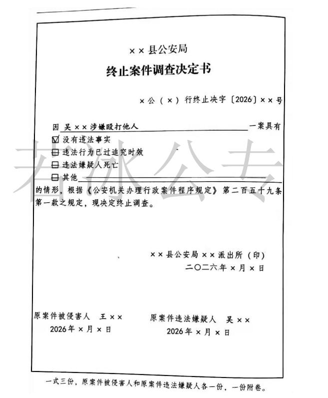

::: warning

行政案件中只有结案和终止调查，不存在撤案。

:::

### **一、结案的情形**

行政案件具有下列情形之一的，应当予以结案：

（一）作出不予行政处罚决定的；

（二）按照规定达成==调解、和解协议==并已履行的；

（三）作出行政处罚等处理决定，且已执行的；

（四）违法行为涉嫌构成犯罪，转为刑事案件办理的；

（五）作出处理决定后，因执行对象灭失、死亡等客观原因导致无法执行或者无需执行的。

::: warning 总结

==处罚不处罚；一轻一重==。

对不予处罚不服的，可以申请行政复议或提起行政诉讼。

:::

### **二、终止调查的情形**

#### （一）**审批**

经==公安派出所、县级公安机关办案部门或者出入境边防检查机关以上负责人==批准，终止调查。

#### （二）**情形**

1、==没有违法事实==的；

2、违法行为已过追究时效的；

3、违法嫌疑人死亡的；（==作出处罚决定之前==）

4、其他需要终止调查的情形。

::: warning 总结

作出处罚决定之前==无事实、已过时、人已死==。

:::

#### （三）**法律后果**

终止调查时，违法嫌疑人已被采取行政强制措施的，应当立即解除。

  

#### （四）**区分没有违法事实和违法事实不成立**

1、**没有违法事实**：有证据证明违法事实根本就不存在，作出终止调查的决定。

2、**违法事实不成立**：证据不足，无法证明违法事实成立，作出不予行政处罚决定。

::: card



:::


### **三、期间和送达**

#### （一）**期间计算**

1、时，开始之时不计算在期间内，从==次时==开始计算。

2、日，开始之日不计算在期间内，从==次日零时==开始计算。

3、月，从当日开始计算，如1月1日-3月1日。

4、年，从当年开始计算，如2019年1月1日—2020年1月1日。

5、法律文书送达的期间==不包括路途上的时间==。

6、涉及人身自由的，==不得因节假日而延长==。

#### （二）**送达一处理决定**

##### 1、**当场送达**

（1）人民警察依照简易程序作出当场处罚决定的，当场交付被处罚人。

（2）人民警察依照其它程序作出处理决定的，当场交付被处理人。

##### 2、**直接送达**

公安机关应当依法在作出处理决定的==7日内==送达被处理人，治安管理处罚决定书应当在==2日内==送达被处罚人。

（1）直接交给受送达人本人。

（2）==如不在，交给其成年家属、所在单位负责人、居委会、村委会等=={.warning}。

##### 3、**留置送达**

（1）**适用前提**：无法直接送达；

（2）**如何送达**：送达人可以邀请其邻居或其他见证人到场，说明情况，也可以对拒收情况进行==录音录像==，把文书留在受送达人处。

（3）同时==在附卷的法律文书上注明拒绝的事由、送达日期==，并由==送达人、见证人签名或者捺指印==，即视为送达。

##### 4、**委托送达**

（1）**适用前提**：无法直接送达；

（2）**程序**：送达机关可以委托==受送达人所在地的公安机关==代为送达。委托机关应出具委托函，并附有需要送达的法律文书；

（3）**送达日期**：委托送达的日期以受送达人在附卷法律文书上的签收日期为准。

##### 5、**邮寄送达**

（1）**前提**：无法直接直达送达；

（2）**方式**：公安机关挂号邮寄；

（3）**送达日期**：以==挂号信回执上注明的收件日期==为送达日期。

##### 6、**电子送达**——受送达人同意

（1）**前提**

第一、无法直接送达；第二、受送达人同意；第三、送达的方式要确认受送达人收悉 。

（2）**方式**：传真、电子邮件、移动通信等即时==收悉==的特定系统作为送达媒介。

（3）**送达日期**：到达受送达人特定系统的日期。

##### 7、**公告送达**——兜底方式

（1）**前提**：其它手段都无法送达，==兜底方式==。

（2）通过张贴公告、登报等方式告知社会，公告送达自发出之日起，经过60日，视为送达 。


### **思维导图**

```markmap

---
markmap:
  colorFreezeLevel: 2
---

# 案件终结
## 结案 
### 1. 不予处罚决定
### 2. 处罚决定
- 已执行
	- 开始执行：已送到拘留所 / 暂缓执行行政拘留
	- 执行完毕
	  - 警告
	  - 罚款
	  - 吊销许可证等
- 因执行对象死亡、灭失等客观原因无法或无需执行
 


## 终止调查
### 1、没有违法事实
### 2、违法行为已过追究时效
### 3. 违法嫌疑人死亡

## 期间和送达
### 期间

- 时
  - ==从次时开始计算==
- 日
  - ==从次日开始计算==


### 送达
- 决定类文书
	- 1. 当场送达
			- 本人
	- 2. 直接送达
		  - 本人+家属+单位+居委 / 村委
	- 3. 留置送达
		  - 见证人或录音录像
	- 4. 委托 / 邮寄 / 电子送达
		  - 电子送达需受送达人同意
	- 5. 公告送达
		  - 不少于60日
```


 [+执行对象灭失、死亡]:
   **执行标的灭失（无法执行）**

   **案例**：甲公司起诉乙公司要求返还一台精密仪器，法院判决乙公司返还。但执行前，仪器因乙公司仓库火灾完全损毁（灭失）。
     
   **结果**：因标的物已物理灭失，无法实际返还，法院裁定**终结执行**（甲公司可另行起诉要求赔偿损失）。

 [+执行对象灭失、死亡]:
   **被执行人死亡且无遗产（无需执行）**

  **案例**：张三因交通事故被判决赔偿李四10万元，执行前张三突发疾病死亡，经查其名下无存款、房产、车辆等任何遗产，且无人继承债务。  
  
  **结果**：因无财产可供执行，且债务无继受人，法院裁定**终结执行**。


 [+执行对象灭失、死亡]:
   **特定行为义务因对象灭失无法履行**

   **案例**：法院判决王五需将登记在赵六名下的某古董花瓶返还给赵六，但花瓶被王五的债权人（不知情）以市场价购得并摔碎。  
   
   **结果**：因标的物灭失且无法恢复原状，执行不能，法院终结执行（赵六可另行起诉要求赔偿）。


 [+执行对象灭失、死亡]:
   **行政执行中的对象灭失**

  **案例**：环保局对某化工厂罚款50万元，并责令限期拆除违法排污设备。化工厂因爆炸事故彻底损毁（法人已注销）。  
  
  **结果**：因处罚对象（工厂主体及设备）已灭失，行政机关终止执行程序。

 [+执行对象灭失、死亡]:
  **执行对象死亡但存在遗产（需变更执行）**

   **案例**：借款人陈某被判决偿还银行贷款100万元，执行期间陈某死亡，但其名下有房产一套。  
   
   **结果**：**不终结执行**，法院裁定变更被执行人为陈某的继承人（继承人在遗产范围内承担债务）。

 [+执行对象灭失、死亡]:
  **关键**

	- **无需执行**：灭失/死亡导致义务彻底无法履行且无替代责任（如遗产）。
	- **需变更执行**：虽对象灭失/死亡，但有遗产或义务承受人（如继承人、保险公司）。