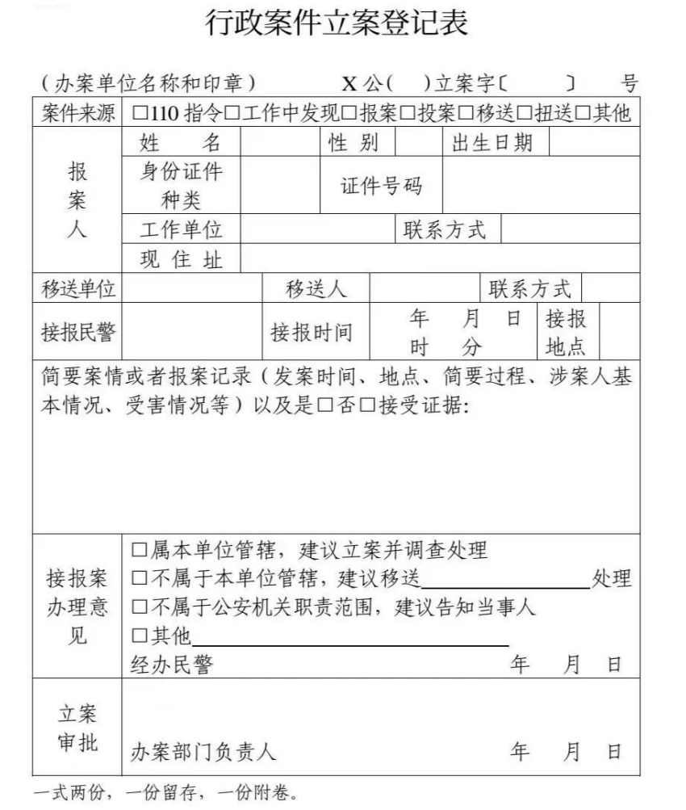
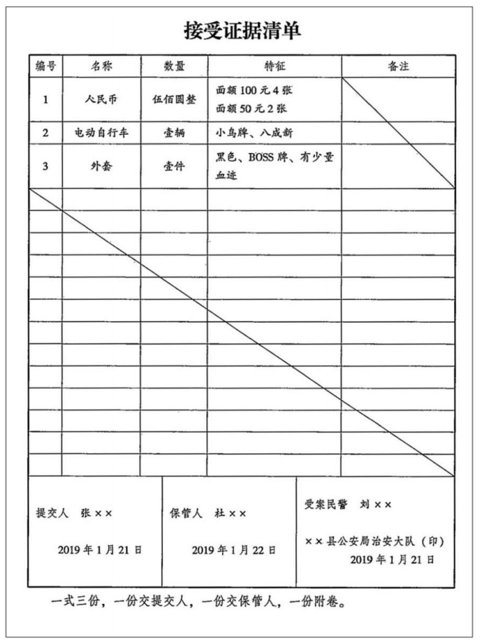
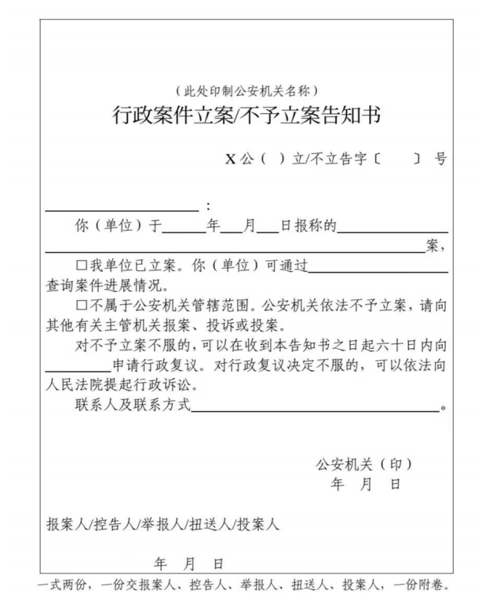
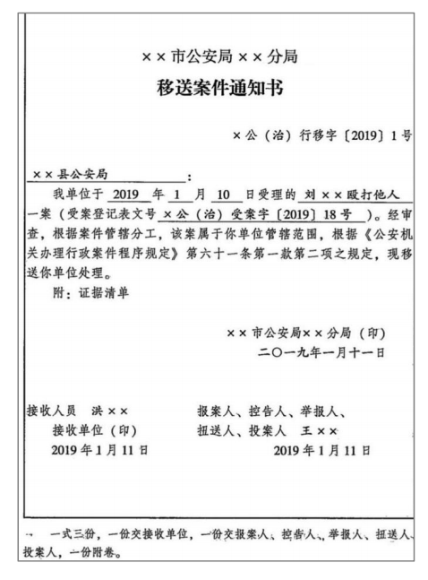

立案流程图

::: timeline horizontal

- 立案
  type=success

  

- 接报案
  type=important
	- 来源
		- 主动发现+被动发现
	- 手续
		- 《**立案**登记表》《接受证据清单》网上登记
	- 紧急状态处理
		- 控人救人固定证据

- 审查
  type=danger
	- 管辖问题
		- 一般管辖
		- 特殊管辖
		- 管辖争议


- 决定
  type=warning
  - 属于公安机关管辖
	  - 本单位管辖
	  - 其他公安机关管辖
  - 不属于公安机关管辖
	  - 口头告知
	  - 书面告知
  

:::


### **一、接报案**

- **被动发现**：报案、举报、控告、扭送、投案、移送；
- **主动发现**：盘查、巡逻、调查、侦查、搜查等。


| 报案         | 控告        | 举报        |
| ---------- | --------- | --------- |
| 所有人        | 被侵害人      | 非被侵害人     |
| 不知道违法行为人是谁 | 知道违法行为人是谁 | 知道违法行为人是谁 |


### **二、受理**


#### （一）填写《==立案==登记表》

::: warning
原《受案登记表》

注意：刑事中仍是《受案登记表》
:::


::: card



:::

::: tip
- 文书要点：
    - 文号构成：公安机关简称+部门简称+年度+顺序号（如"博公(治)立字[2025]1号"）
	    - `X公（ ）立案字〔    〕 号`
			- `X公`——公安机关简称
			- `（ ）立案`——办案部门简称
			- `〔    〕 号`——`〔2025〕1号`——案件顺序号
    - 填写规则：法律文书==不留空白==，无关项划横杠/斜杠
    - 保密要求：报案人要求保密时需在"报案人"栏注明，且保密义务终身有效
    - 审批权限：==行政案件由办案部门负责人（所队长）审批，刑事案件需局长审批==
:::

::: warning

1. 所有的案件都==必须==填写《立案登记表》，包括其他部门移送的案件；
2. 无论有效警、无效警均需填写《立案登记表》；
3. 《立案登记表》的意思是“这个事情我知道了”，而不是“这个事情我管了”；
4. 《立案登记表》不给当事人。（==一份留存，一份附卷=={.warning}）

:::


#### （二）出具接受证据清单


::: card



:::


::: tip
- 文书要点：
	- 数量书写：必须使用==汉字大写==（如"伍佰圆整"）
	- 特征描述：需体现==唯一性==（如人民币应记录编号，衣物可让持有人签名）
	- 移交时限：受案民警==24小时内==将证据移交保管人（办案与保管人员分离）
	- 文书份数：一式==三份==（提交人、保管人、附卷各一份）
:::


::: warning

1. 《接受证据清单》中的“数量”是==汉字大写==；（防止早假，添数字）
2. 《接受证据清单》中的“特征”要描述清楚该证据的==唯一性==；
3. 《接受证据清单》一式三份，受案民警应当在==24小时==内将证据送给保管人。
:::


#### （三）网上接报案登记：

涉及国家秘密的案件、重复报案、正在办理中或已经办结的不再登记。

::: warning

1. 涉及国家秘密的案件包括名称涉密和内容涉密，同学们要注意内容涉密，多以“组织考试作弊罪”“非法出售、提供试题、答案罪”“代替考试罪”等出现，因为==考试内容涉密==；
2. 重复报案、正在办理中或已经办结的不再登记，本质就是“==一个案件只登记一次=={.info}”。
:::

#### （四）紧急情况处置

**前提**：属于公安管辖但不属于本公安机关管辖。
1. 违法嫌疑人正在实施危害行为；`控制坏人`
2. 正在实施违法行为或者违法后即时被发现的现行犯被扭送至公安机关的；`控制坏人`
3. 在逃的违法嫌疑人已被抓获或者被发现的；`控制坏人`
4. 有人员伤亡，需要立即采取救治措施的；`救人`
5. 其他应当采取紧急措施的情形。（核心是`证据固定`）


::: info 典型案例

- 典型案例：以马路为界的A/B派出所辖区案例
	- A派出所接警后发现实际案发地在B派出所辖区
	- 处置步骤：
		- 立即越界进行先期处置（如制止斗殴）
		- 同步向指挥中心报告真实管辖单位（拨打110）
		- 待管辖单位民警到达后移交案件
		- 返回原单位待命

:::

### **三、审查-管辖**

> 成本&效率 问题

- 宏观框架
	- 地域管辖
	- 级别管辖
	- 管辖争议解决
	- 直接办理和共同管辖
	- 特殊案件管辖

::: tip

刑事中立案审查
- 有犯罪事实
- 追究刑事责任
- 归本单位管辖

:::


#### **（一）地域管辖**（又称横向管辖）

1. 行政案件由违法行为地的公安机关管辖`主要原则`，由违法行为人居住地更为适宜，可以由居住地公安机关管辖`补充原则`。
	- （1）**违法行为地**包括违法行为**发生地**和**结果地**。
		- **发生地**包括实施地、开始地、途径地、结束地等；
		- **结果地**包括违法对象被侵害地、违法所得的实际取得地、藏匿地、转移地、销售地等。
	- （2）**居住地**包括**户籍所在地**、**经常居住地**。
		- **经常居住地**，是指公民离开户籍所在地最后连续居住一年以上的地方，但在医院住院就医的除外。
		::: warning 与办理居住证条件辨析
		公民离开常住户口所在地，到其他城市居住==半年以上==，符合有==合法稳定就业、各发稳定住所、连续就读==条件之一的，可以申请居住证。居住证的目的之一是强化流动人口管理，而设置经常居住地制度是为了解决案件管辖问题。
		:::

2. 涉及==卖淫、嫖娼、赌博、毒品=={.danger}案件只能由**违法行为地**公安机关管辖。
	- **卖淫4种**——卖淫、嫖娼、在公共场所拉客招嫖（鸡站街拉人）和引诱、容留、介绍他人卖淫（大妈找人介绍）
	- **赌博2种**——赌博、为赌博提供条件
	- **毒品8种**——全部涉毒案件

::: tip

《公安机关关于对查获异地吸毒人员处理问题的批复》(2008年5月4日公复字【2008】3号):“上海市公安局:你局《关于提请明确异地吸毒人员处理办法的请示》(沪公【2008】134号)收悉。现批复如下:……而吸毒行为，就其行为特征而言，是一种持续状态，==发现地可以按照违法行为发生地原则予以管辖==。但是，如果吸毒行为实际发生地的公安机关已对公安机关吸毒人员依法处理的，发现地公安机关则不得对同一行为作出处理决定。
:::


| 案件       | 违法行为地 | 违法行为人居住地 |
| -------- | ----- | -------- |
| 一般案件     | ✔     | ✔        |
| 卖淫嫖娼赌博毒品 | ✔     | ×        |

::: warning

1. 卖淫、嫖娼案件包括卖淫、嫖娼、在公共场所拉客招嫖（鸡站街拉人）和引诱、容留、介绍他人卖淫（大妈找人介绍）；不能称为黄，因为黄包含9种案件（还包括==淫秽信息、淫秽物品、淫秽表演、聚众淫乱等=={.info}）；
2. 吸毒行为**违法行为地**和**发现地**的公安机关均有管辖权；
	- 双重管辖依据：吸毒行为具有==持续性特征==
        - 管辖机关：
            - 违法行为地（实际吸毒地点）
            - 发现地（如尿检阳性地）
        - 处理原则：先处罚机关优先，避免重复处罚
        - 典型案例：A地吸毒后到B地被查获，B地公安机关可直接处罚
3. 违法行为地在国外的，中国放弃管辖权。
	- 中国游客在泰国打架，回国后报案不予受理

:::                                                                

#### **（二）级别管辖**（又称纵向管辖）

1. **内设机构**：
	- 派出所——警告，==1000元==以下罚款（新治安管理处罚法。原法为500元以下罚款）；
	- 交警大队——警告、罚款、暂扣驾驶证；
	- 出入境管理部门——警告、==5000元==以下罚款等。
	::: warning 罚款
	- 派出所能作出的警告、==1000元以下==的罚款只能是针对违反==治安管理行为==；
		- 单一行为罚款≤1000元（含本数）
        - 多个违法行为可分别处罚（非累计限制）
	- 派出所、交警队、出入境部门作出的处罚都是对==单一行为=={.warning}的处罚。

	:::
2. **县局**：
	- ==拘留==，对旅游业、公章刻制业颁发==特种行业许可证==等。
	
	::: warning 拘留
	==拘留==专属公安、国安、海警系统
	:::
	::: warning 特种行业
	- **特种行业**认定标准
		- 业务性质易被犯罪分子利用
		- 现行政策：拍卖、典当等取消办证要求，但仍是特种行业
	- **放管服改革**
		- 部分行业取消入口许可，加强事中事后监管 
	:::
3. **市局**：
	- 市局交警支队吊销驾驶证；
	
	::: warning
	- 驾驶证管理原则："谁发证谁吊销"
		- 市局交警支队：负责驾驶证发放和吊销
		- 异地吊销特例：违法行为地交警支队可吊销，但需15日内通报发证机关
    - 机构层级关系：
		- 省厅：交警总队
		- 市局：交警支队
		- 县局：交警大队（下设中队）
	:::
	
4. **公安部**：
	- 驱逐出境。
	
	::: danger 刑罚中驱逐出境辨析
	- ==行政==案件驱逐出境——公安部决定

	- ==刑罚==中驱逐出境——法院决定
	:::


::: tip
行政案件由县级公安机关及其部门办理，但法律、行政法规、规章规定由==设区的市级以上==公安机关办理的除外。
- 比如根据《境外非政府组织境内活动管理法》第四十七条境外非政府组织、境外非政府组织代表机构有下列情形之一的，由登记管理机关吊销登记证书或者取缔临时活动;尚不构成犯罪的，由设区的市级以上人民政府公安机关对直接责任人员处十五日以下拘留:(一)煽动抗拒法律、法规实施的:)非法获取国家秘密的:……

:::


#### **（三）管辖争议解决**

1. 协商管辖。因管辖发生争议，争议双方自行协商解决。
2. 指定管辖。对管辖发生争议，首先由争议双方协商解决；协商不成的，报请共同的上级公安机关指定管辖。

::: note 上位法

《行政处罚法》第25条：两个以上行政机关都有管辖权的，由==最先立案的行政机关==管辖。对管辖发生争议的，应当协商解决，协商不成的，报请共同的==上一级行政机关==指定管辖；也可以直接由共同的==上一级行政机关==指定管辖。
:::


#### **（四）直接办理和共同管辖**

1. 直接办理。对于重大、复杂的案件，上级公安机关可以==直接办理或者指定管辖=={.danger}。
2. 共同管辖。几个公安机关都有权管辖的行政案件，由==最初受理==的公安机关管辖。必要时，可以由==主要违法行为地==公安机关管辖。（如果谁先最初受理有争议等，先协商后指定）

#### **（五）特殊案件管辖**

1. **网络案件管辖**（==沾边就可以管==）
	 - 服务器所在地
	 - 网络接入地
	 - 网络建立者
	 - 管理者所在地
	 - 被侵害的网络及其运营者所在地
	 - 违法过程中违法行为人、被侵害人使用的网络及其运营者所在地
	 - 被侵害人被侵害时所在地
	 - 被侵害人财产遭受损失地公安机关

::: note

1. 网络案件指的是针对互联网实施的违法行为和利用互联网实施的违法行为；
2. 违法行为人居住地也有管辖权

:::

2. **行使中的客车上发生的案件管辖**

- 由案发后客车==最初停靠地==公安机关管辖；
- 必要时，始发地、==途经地==、到达地公安机关也可以管辖。

::: note

如果违法行为地确定，就由==违法行为地和违法行为人居住地管辖==

:::

3. **和铁路相关案件管辖**

火车票案件：倒卖、伪造、变造火车票案件，由==最初受理的铁路或地方公安机关管辖==。必要时，可以移送主要违法行为发生地的铁路公安或地方公安机关管辖。

::: tip 倒卖、伪造、变造辨析

1. ==倒卖的必须是真票，才会构成倒卖==。违反《治安管理处罚法》第五十二条有下列行为之一的，处十日以上十五日以下拘留，可以并处一千元以下罚款；情节较轻的，处五日以上十日以下拘留，可以并处五百元以下罚款：……（三）伪造、变造、倒卖车票、船票、航空客票、文艺演出票、体育比赛入场券或者其他有价票证、凭证的；……
2. ==伪造是完全假；变造是在真的基础上造假。==

:::

::: warning

电子伪造、倒卖、变造车票等场景，考虑铁路公安不方便管辖，由地方公安机关管辖。

:::

### **四、决定**

#### **（一）属于公安机关管辖**

1. 属于==本单位==管辖的==行政案件==——出具《行政案件立案告知书》
	- 审批：==办案部门负责人==

::: card



:::

::: note

1. 公安机关决定立案/不予立案的时间是==当场-24小时-3日==；
2. 对于不予立案不服的救济是==复议前置==。

:::

2. 属于其他公安机关管辖的==行政案件==——《移送案件通知书》。24小时内移送到有管辖权的单位处理，并告知报案人、举报人、扭送人、投案人，移送管辖的，询问查证的时间和扣押等措施的期限重新计算。

::: card



:::


::: note

1. 跨==县、区=={.warning}移送案件才需要制作《移送案件通知书》；
2. 移送单位单方决定即可移送；次数仅限一次；
	- “次数仅限一次” 是指移送单位只能将案件移送一次，受移送的单位不得再自行移送。
	- 根据相关法律规定和行政处罚程序的要求，当一个单位发现所查处的案件不属于本部门管辖时，应当将案件移送有管辖权的部门。==受移送的部门对管辖权有异议的，应当报请共同的上一级部门指定管辖，而不能再自行移送其他单位==。例如，市场监督管理部门发现案件不属于本部门管辖，将其移送给另一个市场监督管理部门或其他行政管理部门后，接收案件的部门即使认为自己无管辖权，也不能再次移送，而应报请共同的上级市场监督管理部门或上级行政管理部门指定管辖
3. 接受范围如果不服，先协商后指定管辖；
4. ==24小时==内移送，移送后，时间重新计算。

:::

3. 属于刑事案件——==立案决定书==
4. 分不清行政还是刑事案件——先受理为行政案件
	- 之后转刑事
		- **无需撤销**：行政案件转为刑事案件时，原行政案件无需撤销程序
        - **结案**：转为刑事案件后，行政案件阶段自动结案
        - **证据转化**：好人坏人加证人，三类言词不转化

#### **（二）不属于公安机关管辖**

1. 当场能判断的——立即口头告知。
2. 当场不能判断或报案人等对口头告知有异议——书面告知——《行政案件不予立案告知书》。联系不上、身份不明无法告知的除外。


### **五、真题回顾**


:::: card-grid  
::: card title="真题1" icon="svg-spinners:blocks-shuffle-3"
<Badge type="warning" text="单选"/>孙某案件管辖权判定  
孙某住桥西区朝阳派出所辖区，因在桥东区销赃被桥东公安分局光明派出所发现，其盗窃（桥西区）、嫖娼（桥东光明派出所辖区），对两案管辖说法正确的是（ ）。(2019年公安联考第30题)  

**选项**：  
A、桥东光明派出所对两案都有管辖权  
B、桥东光明派出所对嫖娼案有管辖权，对盗窃案无管辖权  
C、桥西朝阳派出所对两案都有管辖权  
D、桥西朝阳派出所对嫖娼案有管辖权，对盗窃案无管辖权  

**答案**：!!A!!  

::: collapse  
- **解析**  
    - 盗窃案中，桥西区是违法行为地，桥东光明派出所发现销赃也关联案件；嫖娼案发生在桥东光明派出所辖区（违法行为地），故桥东光明派出所对两案都有管辖权，选A 。  
:::
::: card title="真题2" icon="svg-spinners:blocks-shuffle-3"
<Badge type="warning" text="单选"/>工地纠纷案件管辖权判定  
工地地处A区与B区交界处，工人因劳资纠纷打架，从A区打到B区致多人轻微伤，此案管辖正确的是（ ）。(2018年公安联考第22题)  

**选项**：  
A、应由A区公安机关管辖  
B、应由B区公安机关管辖  
C、应由最初受理地公安机关管辖  
D、无论谁先受理，均由上级公安机关指定管辖  

**答案**：!!C!!  

::: collapse  
- **解析**  
    - 案件涉及多个辖区，依规定应由最初受理地公安机关管辖，选C 。  
:::
::: card title="真题3" icon="svg-spinners:blocks-shuffle-3"
<Badge type="warning" text="单选"/>李某嫖娼案件管辖权判定  
李某住甲区，在乙区嫖娼后深夜步行回家，途经丙区时因神色可疑被盘查并交代嫖娼事实，说法正确的是（ ）。(2017年公安联考第26题)  

**选项**：  
A、只有甲、乙区公安机关可以管辖  
B、只有乙区公安机关可以管辖  
C、甲、乙、丙区公安机关都可以管辖  
D、应由先受理的丙区公安机关管辖  

**答案**：!!B!!  

::: collapse  
- **解析**  
    - 嫖娼行为发生在乙区（违法行为地），仅乙区公安机关有管辖权，选B 。  
:::
::::


---

### **六、思维导图**

```markmap
---
markmap:
  colorFreezeLevel: 3
---
# 行政案件立案

- 案件来源
    - 主动发现
    - 被动发现
- 接报案
    - 受理
        1. 填写《立案登记表》
        2. 上网一涉密不填、重复不填
        3. 出具《接受证据清单》一式三份
        4. 紧急状况处理
            - 前提：归公安机关管辖，但不归本公安机关管辖
            - 情形：抓人、救人、固定证据
- 地域管辖
    - 普通案件
        - 违法行为地
            - 发生地
            - 结果地
        - 违法行为人居住地
            - 户籍地
            - 经常居住地
    - 特殊案件
        - 卖淫嫖娼赌博毒品案件
            - 违法行为地专属管辖
        - 例外：吸毒行为
            - 发生地
            - 发现地
- 级别管辖
    - 派出所：警告、1000元以下的罚款（==特指违反治安管理的行为，其他行为需要经过县局批准==）
    - 交警大队：警告、罚款、暂扣驾驶证
    - 公安部：驱逐出境
- 审查
    - 管辖争议的解决
        1. 协商解决
            - 积极争议或消极争议
            - A单位和B单位
        2. 指定管辖
            - 共同上级公安机关
            - 有争议：协商无果
                - 指定A单位或B单位管辖
                - 指定除A、B单位之外的其他下级单位
            - 无争议：不放心：指定其他单位管辖
    - 直接办理：没有争议，出于对下级公安机关的不放心而直接自己办理
    - 共同管辖：A、B、C都有管辖权
        - 原则：最初受理的公安机关
        - 必要时：主要违法行为地公安机关
    - 特殊案件的管辖
        - 网络违法案件
            - 发生地(与违法行为沾边就管)
            - 违法人居住地
        - 客车案件
            - 违法行为地不确定：最初停靠点、始发站、途径站、终点站
        - 倒卖伪造变造火车票案件
            - 违法行为人居住地
            - 最初受理的地方公安和铁路公安，必要时，主要违法行为地
- 决定
    - 审查时间：当场—24小时—3日
    - 属于公安机关管辖
        - 归本单位管辖
            - 行政案件立案告知书
            - 审批：办案部门负责人
        - 归其他公安机关管辖
            - 24小时内移送
            - 审批：县级以上公安机关负责人
                - 要求：必须跨县（区）
                - 期限：重新计算期限
            - 移送案件：不需要征求被移送单位的同意
                - 如有异议，先协商后指定
                - 次数：移送案件只能一次
    - 不属于公安机关管辖
        - 现场：口头告知
        - 非现场
            - 对口头告知有异议，民警无法当场答复：书面告知《行政案件不予立案告知书》—不服，复议前置

```
