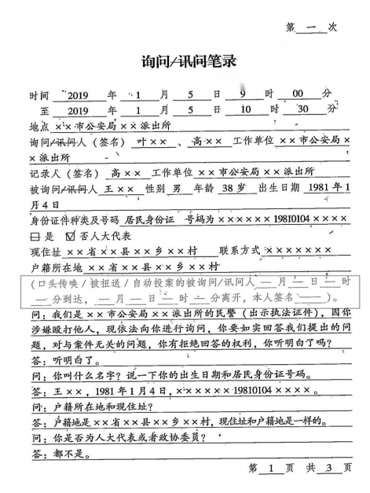
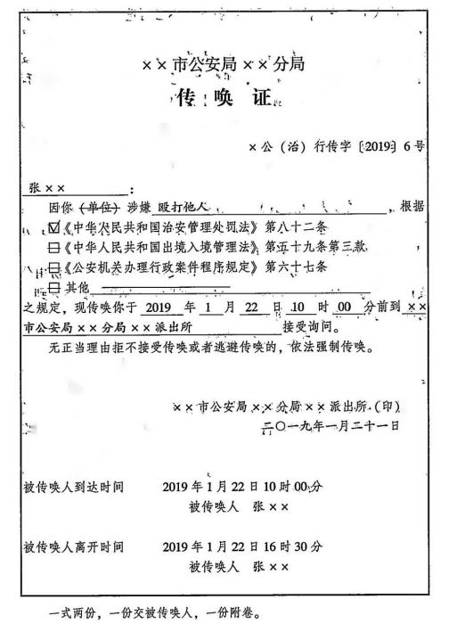

## 课程笔记：公安机关五大调查手段之行政传唤


### **一、传唤主体**

（一）审批主体：==办案部门负责人==。

（二）执行主体：==两名以上==人民警察。

::: tip

这里的审批特指**书面传唤**和**强制传唤**，口头传唤无需审批

由于传唤的适用多，因此找办案部门负责人即可

:::


### **二、传唤对象**

需要接受调查的==违法嫌疑人=={.warning}。对于证人和被侵害人==不得适用传唤=={.danger}。

::: note 法院传唤

法院阶段：对原被告**统一**使用传票（体现==无罪推定原则==）

:::

### **三、传唤的地点**

（一）公安机关；

（二）居委会、村委会。


### **四、传唤期限**

（一）对被传唤的违法嫌疑人，==应当及时=={.warning}询问查证，询问查证的时间不得超过==8小时==；

（二）==新法=={.danger}：涉案人数众多、违反治安管理行为人身份不明的。询问查证时间不得超过==12小时==；

（三）案情复杂，（+）违法行为**可能**适用行政拘留的，询问查证的时间不得超过==24小时==；


| 传唤种类 | 审批              | 时限          | 备注      |
| ---- | --------------- | ----------- | ------- |
| 行政   | 无+口头或书面经办案部门负责人 | 8-24        | 通知家属    |
| 治安   | 无+口头或书面经办案部门负责人 | 8-==12==-24 | 通知家属    |
| 刑事   | 无+书面办案部门负责人     | 12-24       | 可以不通知家属 |


::: note 《治安管理处罚法》中不得延长到`24小时`的情形

《治安管理处罚法》中不得延长到`24小时`的情形：
- **一是**，第42条：擅自进入铁路、城市轨道交通防护网或者火车、城市轨道交通列车来临时在铁路、城市轨道交通线路上行走坐卧，抢越铁路、城市轨道，影响行车安全的，处警告或者五百元以下罚款。
- **二是**，第67条：从事旅馆业经营活动不按规定登记住宿人员姓名、有效身份证件种类和号码等信息的，或者为身份不明、拒绝登记身份信息的人提供住宿服务的，对其直接负责的主管人员和其他直接责任人员处五百元以上一千元以下罚款；情节较轻的，处警告或者五百元以下罚款。
- **三是**，第68条：房屋出租人将房屋出租给身份不明、拒绝登记身份信息的人的，或者不按规定登记承租人姓名、有效身份证件种类和号码等信息的，处五百元以上一千元以下罚款；情节较轻的，处警告或者五百元以下罚款。
- **四是**，第89条：饲养动物，干扰他人正常生活的，处警告；警告后不改正的，或者放任动物恐吓他人的， 处一千元以下罚款。

:::


::: warning 可能

这里**可能**代表是法律法条规定当中有没有拘留，不看最终结果，因为目前不明确程度

:::


- 1.**审批**：口头或书面报经==办案部门负责人==批准；
- 2.**前提**：案情复杂（警察自由裁量）+ 可能适用行政拘留（根据现行法律规定，违法嫌疑人存在被依法处以行政拘留的可能性，而不是最终的处理结果）；
- 3.不得连续传唤，不得**异地传唤**，应当==异地执行传唤==（嫌疑人在哪里就在哪里==执行==）。


::: warning 传唤审批

因此，传唤的审批包括书面、强制、延长期限都不经过局长，都是==办案部门负责人==。

:::

::: card

:::

### **五、传唤形式**

#### **（一）口头传唤**：

是指人民警察对==现场发现的=={.warning}违反治安管理行为人，口头责令违反治安管理行为人到指定地点接受调查的行为。==在询问笔录中注明到案方式、到案时间和离开时间==。

- 1. **现场发现**：是指所有发现违法嫌疑人的现场，而不仅仅是案件发生的现场。
- 2. **到达时间**：是指被传唤人到达公安机关或者公安机关指定的询问地点的时间。既不能从公安机关传唤违法嫌疑人时起算，也不能从开始询问地点的时间。
- 3. **离开时间**：是指公安机关允许当事人自由离开询问地点的时间。
- 4. **口头传唤**：==不=={.danger}需要审批，回到单位==无需=={.warning}补办传唤证，也无需补办手续。
- 5. 口头传唤不具有==强制性==。

#### **（二）书面传唤**：

违法嫌疑人在传唤证上填写==到案和离开时间==并签名，拒绝填写或者签名的，办案警察应当在传唤证上注明。


::: card


::: 


#### **（三）强制传唤**


##### **1. 适用前提**

（1）==无正当理由不接受传唤==。即无特殊原因，在被传唤后未能在公安机关限定的时间到指定地点接受调查。

（2）==逃避传唤==。即采用躲避、逃跑等方法有意拒绝接受调查的行为。

::: note 强制传唤适用范围

适用范围：仅适用于违反《治安管理处罚法》和《出境入境管理法》的行为。

:::

##### **2. 限度**

其强制的方式应当以将被传唤人传唤到案接受调查为限度，必要时可以根据需要使用手铐、警绳等约束型警械。==一旦被传唤人到案，且配合调查的，不得再继续使用警械==。


##### **3. 补批手续**

回到单位后，立即找办案部门补批手续

::: note 审批


| 情形      | 审批     |
| ------- | ------ |
| 口头+强制传唤 | 所长审批一次 |
| 书面+强制传唤 | 所长审批两次 |


:::


##### **4. 救济**

强制传唤属于限制人身自由的行政强制措施，违法嫌疑人如不服，可提起==行政复议或行政诉讼==。

::: tip

被传唤人可申请行政复议（60日内）或行政诉讼（6个月内）。

:::


### **六、执行要求**

#### **（一）告知本人——原因和依据**

为了保障被传唤人的**知情权**，保护公民的合法权益，公安机关应将传唤的原因和依据告知被传唤人。这是公安机关的法定义务。

#### **（二）通知家属——公安机关、理由、地点和期限**

1. **当场告知**——电话短信传真告知——无法通知则不予通知（无法通知包括身份不明、拒不提供、不可抗力）。
2. 告知、通知和无法通知家属的原因应当在**询问笔录**中注明。


#### **（三）禁止游街示众**

禁止对被传唤人游街示众或者变相游街示众，或者采取其他方式侮辱被传唤人的人格尊
严。

::: tip

法理原则：==体现"士可杀不可辱"的法治精神，即使判处死刑也不得侮辱人格==

:::


### **七、结束**


（一）关人。即羁押于拘留所、看守所、戒毒所等。

（二）放人。即现已排除或者证据不足。


::: note 小测

【判断】 传唤是询问的必经前提。

【答案】 !!错误，传唤和询问之间没有必然的先后关系，传唤之后可以进行询问，也可以进行检查、辨认等调查活动，询问之前不一定必须传唤。比如，办案民警可以直接到违法嫌疑人家里、单位或者其他地方开展询问工作。!!


:::


### **八、总结**

| **项目**   | **传唤类型** | **审批**              | **地点**    | **期限**                                      |
| -------- | -------- | ------------------- | --------- | ------------------------------------------- |
| **口头传唤** | 现场发现嫌疑人  | 无需审批                | 现场或公安机关   | ≤8小时                                        |
| **书面传唤** | 非紧急情况    | 办案部门负责人审批           | 公安机关、村委会等 | ≤8小时                                        |
| **强制传唤** | 逃避或抗拒传唤  | 办案部门负责人审批（==补批手续==） | 公安机关或安全场所 | ≤8小时（涉案人数众多、违反治安管理行为人身份不明的≤12小时; 复杂案件≤24小时） |

### **九、思维导图**

```markmap
---
markmap:
  colorFreezeLevel: 2
---
# 传唤

## 对象
- 违法嫌疑人
- 法院
    - 原告
    - 被告

## 方式
- 口头传唤
    - 现场发现：案发现场或其他现场
        - 无需审批：出示警察证即可
        - 在询问笔录中注明到案方式、到案时间和离开时间
- 书面传唤
    - 有意传唤
        - 办案部门负责人审批
        - 在传唤证上注明到案时间和离开时间
- 强制传唤
    - 口头/书面传唤+无正当理由拒绝
        - 事后立即找办案部门负责人补批
        - 可行政复议可行政诉讼

## 期限
- 办案部门负责人
    - 8小时—复杂+可能使用拘留的—24小时
    - 《治安管理处罚法》中规定了5类情形只有警告或罚款的处罚种类，不可以延长拘留到24小时

## 通知家属
- 情形：当场、事后、无法
- 内容：公安机关、理由、地点、期限
    - 在询问笔录中注明
```


### **十、真题回顾**

:::: card-grid
::: card title="题目 1" icon="svg-spinners:blocks-shuffle-3"

<Badge type="warning" text="单选" />甲县公安局治安大队的民警贾某、李某正在办理一起治安案件，需要传唤违法嫌疑人赵某到县局办案中心接受调查。下列编号内容是办案民警在传唤中的有关做法：

①出示人民警察证；

②将传唤的原因和依据告知赵某；

③赵某拒绝在传唤证上签名，民警李某代为签字；

④因赵某无正当理由不接受传唤故使用手铐强制传唤；

⑤询问笔录中注明赵某到案经过和到案时间；

⑥通知赵某家属。

依据《公安机关办理行政案件程序规定》，民警在传唤中的做法正确的是：（ ）（2019 年公安联考第 15 题）

选项：

A、①②③④  

B、①②③⑤  

C、①②④⑥  

D、①③④⑤  

**答案：!!C!!**

:::

::: card title="题目 2" icon="svg-spinners:blocks-shuffle-3"


<Badge type="warning" text="单选" />2017 年 6 月 8 日，龙山乡派出所接到曾某报警，称其在村委会活动室因琐事与马某发生争执，遭到马某殴打，派出所民警赶到现场，行为人马某已离开。6 月 9 日，办案民警以涉嫌殴打他人传唤马某，以下对马某传唤说法正确的是：（ ）（2018 年公安联考第 32 题）

选项：

A.可以口头传唤  

B.可以强制传唤  

C.应当口头传唤  

D.应当制作传唤证传唤 

**答案：!!D!!**

:::


::: card title="题目 3" icon="svg-spinners:blocks-shuffle-3"

<Badge type="warning" text="多选" />以下为鼓楼区公安分局民警马某针对钱某某涉嫌饲养动物干扰正常生活一案制作的传唤证影印件。


民警马某填写的文书中存在的执法问题是：（ ）（2017 年公安联考 69 题）

选项：

A、被传唤人到达地点

B、被传唤人查证方式

C、被传唤人到达时间

D、被传唤人结束时间


**答案：!!BD!!**

:::

::::