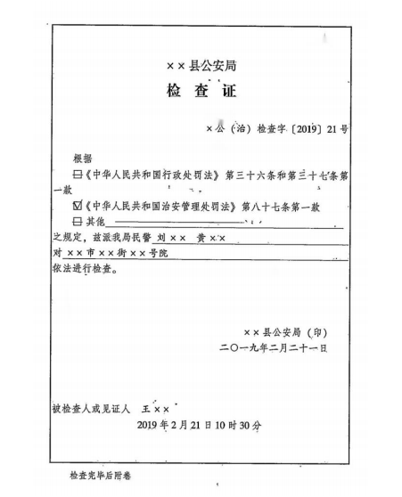
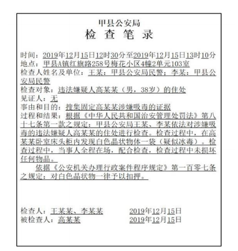

## 勘验、检查

### **一、勘验**
- 必要时应当**勘验**
- 地点
	- 违法行为实施地点
    - 遗留与违法行为有关痕迹或其他物品的场所（如逃窜时丢弃作案工具的场所）

见刑事部分

<LinkCard icon="twemoji:astonished-face" title="勘验检查" href="/ncsec/odve2wtn/" />

### **二、检查**


#### （一）**目的**：查获嫌疑人和违法证据
#### （二）**检查主体**

- **两名**以上警察
- 检查妇女身体：应当由女性工作人员或者医生

::: warning

==女性工作人员=={.info}指的时==公安机关内部工作的女户籍民警、女内勤以及女辅警==，不包括保洁、保安、厨师、司机等。

:::

::: danger

依法对卖淫、嫖娼人员进行==性病检查==，应当由==医生==进行。

:::

#### （三）**审批主体**

- ==县级以上==公安机关负责人批准后制作《检查证》

::: note

五大调查手段当中，只有==检查==是经过==县级以上公安机关负责人=={.warning}批准的

:::

#### （四）**检查对象**

##### 1.**场所**

- 原则上两警两证（==警察证=={.info}、==检查证=={.info}）,两警单证（==警察证=={.info}）例外可以，==事后无需补办检查证=={.danger}
	- **商用场所**：必要时没有检查证也可当场检查。
		- 必要时指的是==不立即检查导致证据灭失和违法人逃脱=={.info}
	- **住宅场所**：住宅必须出示**警察证+检查证**。
		- 例外：必须==有证据表明=={.info}或者==有群众报警=={.info}公民住所正在发生==危害公共安全==或者==公民人身安全==的案（事）件或者==违法存放危险物质==，不立即检查可能会对公共安全或公民人身、财产造成重大危害。
	- **商住两用场所**：违法嫌疑人的居住场所与市场监督管理局注册登记的经营场所合一的
		- 经营时-检查经营场所；
		- 非经营时间-检查公民住所。


| 检查场所类型 | 检查条件                                      | 检查目的与限制                    |
| ------ | ----------------------------------------- | -------------------------- |
| 商用场所   | 两警两证, 两警单证（警察证）事后无需补办检查证                  | 必要时无证，不立即检查可能导致证据灭失和违法人逃脱  |
| 住宅场所   | 两警两证。有证据表明或者有群众报警，危害公共安全、公民人身安全或者违法存放危险物质 | 严格限制,如果发生的是危害到公共安全或者公民人身安全 |
| 商住两用场所 | 经营时间检查经营场所；非经营时间检查公民住所                    | 根据使用性质和时间来确定检查方式           |


##### 2.**物品**

用于实施违法行为的工具、赃物、现场遗留物、随身携带的物品；==避免对物品造成不必要损坏==

##### 3.**人身**

- **体外**：查违禁品、枪支、凶器、赃款、赃物以及作案工具等。
- **体表**：违法行为相关身体特征、伤害情况、生理状态
- **体内**：依法提取收集人体生物识别信息和生物样本（指纹、掌纹、虹膜）

::: warning

无证检查==在紧急情况下适用于场所、物品、人身=={.danger}

:::


#### （五）**检查过程中应当有见证人**


::: note 见证人

关于检查是否应当有见证人，存在法条打架情况，==上位法原则==。

- **《治安管理处罚法》第88条**:检查的情况应当制作检查笔录，由检查人、被检查人**和**见证人签名或者盖章;被检查人拒绝签名的，人民警察应当在笔录上注明。
- **《公安机关办理行政案件程序规定》第85条第二款**: 检查场所时，应当有被检查人或者见证人在场: 第86条第一款: 检查情况应当制作检查笔录。检查笔录由检查人员、被检查人**或者**见证人签名: 被检查人不在场或拒绝签名的，办案人民警察应当在检查笔录中注明。见证人，如路人邻居或者所在地基层群众组织。

见证人是指临时被邀请到现场亲身经历检查的与本案无任何牵连的在场人，如路人、邻居还或者所在地基层群众组织。（==中立==）

:::

#### （六）**强制检查无需审批**

在实践中，违法嫌疑人无正当理由无权拒绝检查，如果出现拒绝检查的情况，==办案人民警察==可视案件调查工作需要，在必要时进行强制检查。（无需审批）


#### （七）**制作《检查笔录》**

- ==应当制作检查笔录==
	- 检查的情况==应当制作检查笔录==，由**检查人员、被检查人员和见证人**签名或盖章；被检查人不在场或者拒绝签名的，办案民警应当在笔录上注明。
	- 检查笔录应当载明检查的起止时间、检查人员及其检查单位、被检查对象、检查过程、情况、查获的证据、可疑物品等。
- ==全程录音录像可以代替书面检查笔录==
	- 检查时的录音录像可以代替书面检查笔录，但应当对视听资料的关键内容和相应时间段等作文字说明。==“关键内容”主要包括出示检查证的过程、进行检查的过程、查获的证据等=={.warning}；相应时间段是几分几秒到几分几秒。


::: card 



:::


### **三、思维导图**

```markmap
---
markmap:
  colorFreezeLevel: 2
---
# 勘验检查

## 勘验
- 目的
  - 收集证据
  - 判断案件性质
  - 确定调查方向和范围
- 对象：现场
  - 案发现场
  - 关联现场
- 非必经程序
- 记录
  - 勘验笔录
  - 现场图
  - 现场照片

## 检查
- 审批——县级以上公安机关批准——制作《检查证》
  - 对象——场所、物品和人身
- 场所
  - 原则上：两警两证
  - 例外：两警单证（无需检查证）
- 物品
  - 避免对物品造成不必要的损坏
- 人身(妇女身体--==女性工作人员==)
  - 体外——针对违法嫌疑人
  - 体表——针对违法嫌疑人或被侵害人
  - 体内——针对违法嫌疑人或被侵害人
    - 过程——应当有见证人在场。
- 检查过程和结果
  - 结果
    - 制作书面的检查笔录
    - 也可以用全程录音录像代替
```

### **四、真题回顾**

:::: card-grid
::: card title="题目 1" icon="svg-spinners:blocks-shuffle-3"

<Badge type="warning" text="单选" />某县公安局民警小赵、小刘和警务辅助人员小王，持《检查证》到辖区某村违法嫌疑人张某家检查时，张某不在，只有其上小学二年级的儿子。此时，民警正确的做法是：（ ）（2019 年公安联考第 32 题）

选项：

A、由张某儿子在《检查证》上签字确认后，进行检查  
B、直接进行检查，由警务辅助人员小王作为见证人  
C、直接进行检查，在检查笔录中注明张某不在场的情况  
D、请该村村委会主任作为空证人，进行检查  

**答案：!!D!!**


:::

::: card title="题目 1" icon="svg-spinners:blocks-shuffle-3"

<Badge type="warning" text="多选" />检查笔录是公安机关人民警察对与违法行为有关的场所、物品、人身进行检查，为记录检查过程而制作的笔录。下图是对违法嫌疑人高某某住宅进行检查时制作的检查笔录。根据有关法律规定，结合该笔录，下列做法中不恰当的有：（ ）



选项：

A、由王某与李某在高某某住宅进行检查  
B、检查过程中无见证人在场，检查笔录无见证人签名  
C、依据《公安机关办理行政案件程序规定》扣押晶状物体  
D、依据《中华人民共和国治安管理处罚法》对高某某住宅进行检查  

**答案：!!ABC!!**


:::

::::

