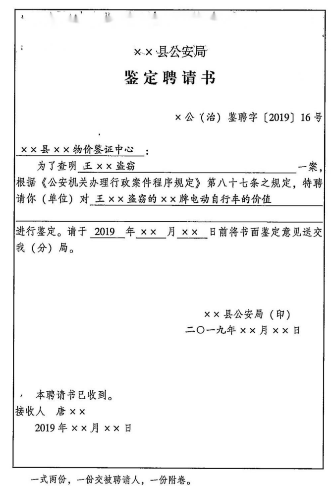

## 课程笔记：公安机关五大调查手段之鉴定

### **一、鉴定目的**  


为了查明案情，需要对专门性技术问题进行鉴定

::: warning

  ==鉴定不解决法律问题。=={.danger}

:::


### **二、审批主体**  

#### （一）公安机关内部的鉴定人员

- **审批**：公安机关办案部门负责人；
- 制作鉴定委托书。

#### （二）公安机关外部的鉴定人员

- **审批**：公安机关办案部门负责人；
- 制作鉴定聘请书。 


#### （三）鉴定费用

- **原则**：公安机关承担；
- 例外：当事人自行鉴定的，费用自己承担。

::: note 效力认定

- 自行鉴定结果无强制约束力（公安机关可不采信）
- 采信标准：仅认可公安机关委托/聘请的鉴定结果（防止利益关联）

:::

### **三、公安机关提供必要条件的义务**

#### （一）做好检材的保管工作；

#### （二）做好送检工作，注明送检环节的==责任人==，确保检材在流转环节的==同一性和不被污染=={.warning}；

#### （三）及时送交有关检材材料和比对样本等原始材料，介绍与鉴定有关的情况，并且明确提出要求鉴定解决的问题；

#### （四）==禁止强迫或暗示=={.danger}鉴定人作出某种鉴定意见。

- **审批**：公安机关办案部门负责人；
- 制作鉴定委托书。

### **四、鉴定结果**


#### （一）**鉴定人出具鉴定意见**；

1. 应当出具鉴定意见。
2. 鉴定意见内容：
	- 载明委托人，委托鉴定的事项、提交鉴定的材料、实践、依据、结论性的意见等。
	- ==多人参加的鉴定，对鉴定意见有不同意见，应当注明=={.info}。
3. 鉴定意见的形式：鉴定人==签名或盖章==；应当附鉴定机构和鉴定人的资质证明或其他证明文件。

#### （二）**公安机关经过审查后告知当事人**；（==533时间==）

1. **应当进行审查**：办案人民警察应当对鉴定意见进行审查；
2. **五日内告知**：经过审查后，公安机关应当在==收到鉴定意见之日=={.info} 起==五日==内将鉴定意见复印件送达违法嫌疑人和被侵害人；
3. **三日内申请**：违法嫌疑人和被侵害人如有异议，可以在==收到鉴定意见复印件之日=={.info}起==三日==内提出重新鉴定的申请；
4. **三日内告知**：==县级以上公安机关负责人=={.warning}做出决定(此时间不做限制)后==3日==内书面通知申请人
5. 申请重新鉴定**不影响**案件的正常办理。


### **五、重新鉴定**

#### （一）**情形**

::: note 法条

《公安机关办理行政案件程序规定》第98条: 具有下列情形之一的，应当进行重新鉴定:
- (一)鉴定程序违法或违反相关技术要求，可能影响鉴定意见正确性的;
- (二)鉴定机构、鉴定人不具备鉴定资质和条件的;
- (三)鉴定意见明显依据不足的;
- (四)鉴定人故意作虚假鉴定的;
- (五)鉴定人应当回避而没有回避的;
- (六)检材虚假或者被损坏的;
- (七)其他应当重新鉴定的。

不符合前款规定情形的，经==县级以上公安机关负责人==批准，作出不准予重新鉴定的决定，并在作出决定之日起的==三日==以内书面通知申请人。

:::

1. **主体问题**：==无资质、不回避、故意作虚假鉴定==；
	- 鉴定机构、鉴定人不具备鉴定资质和条件的；
	- 鉴定人应当回避而没有回避的；
	- 鉴定人故意作虚假鉴定的。
2. **检材问题**：虚假或者被损坏的；
3. **依据问题**：鉴定意见明显依据不足；
4. **程序问题**：程序违法或违反相关专业技术要求，可能影响鉴定意见的正确性。

#### （二）**如何启动**

1. 依申请

当事人申请，经==县级以上公安机关负责人==审批。

2. 依职权

公安机关认为有必要，经==县级以上公安机关负责人==批准，也可以直接决定重新鉴定。

#### （三）**重新鉴定的主体、次数**

1. 谁鉴定：公安机关应当另行指派或者聘请鉴定人。
2. 次数：同一行政案件的同一事项重新鉴定为一次为限。

::: tip

吸毒检测是例外，2次；

行政案件没有补充案件，补充案件在刑事案件中。

:::

### **六、常见的鉴定类型** 

#### **（一）人身伤害鉴定**

##### **1. 法医与医生**
- **法医**：出具《鉴定意见》（作为法律证据）；  

- **医生**：出具《诊断证明》（可作为公安机关认定人身伤害程度的办案==依据==，非证据）；  
	- 卫生行政主管部门==许可==的医疗机构具有==执业资格==的医生。（==双证=={.warning}）
	- 非应当鉴定的情形。


##### **2. 应当进行伤情鉴定的情形**

- 受伤程度较重，可能构成轻伤以上伤害程度的。
- 被侵害人要求作伤情鉴定的。
- 被侵害人、违法嫌疑人对==伤情程度==有争议的。

::: note 伤情程度

**伤情程度**争议，而非**致伤原因**（如对牙齿松动是否由殴打导致属于致伤原因争议，不在此列）。

这里没有违法嫌疑人和被侵害人的亲属。

:::

##### **3. 被侵害人拒绝鉴定的处理**

  - **拒绝鉴定**：无正当理由未在公安机关确定的时间内做伤情鉴定；  
  - **结果**：公安机关可以根据**已认定的事实**作出处理决定。

#### **（二）电子数据鉴定**

- 司法鉴定机构出具鉴定意见。
- 由公安部指定的机构出具报告。

::: note 公安部指定的机构

目前，国内具有电子数据鉴定资质的机构较少，难以满足办案实践需要，而公安机关内部有些机构实质上具备出具专业性意见的能力。因此，本条规定确定了电子数据专门性技术问题“鉴定与检验两条腿走路”原则，既可以“由司法鉴定机构出具鉴定意见”，也可以“由公安部指定的机构出具报告”。这里的“公安部指定的机构”公安部会定期公布名单，办案部门可以从中选择。

来源:《公安机关办理行政案件程序规定释义与实务指南》(2021年版)第220页。

:::


#### **（三）涉案财物价格鉴定**


- 应当委托价格鉴定机构估价：涉案物品==价值不明或者难以确定==。
- 可以不委托价格鉴定机构估价：
	- 根据当事人提供的购买==发票等票据==能够==认定价值==的涉案物品；
	- 价值明显==不够刑事立案标准==的涉案物品。


#### **（四）吸毒检测**

- **对象**
	- 涉嫌吸毒的人员，被决定执行强制隔离戒毒的人员，被公安机关责令接受设区戒毒和社区康复的人员，以及戒毒康复场所内的戒毒康复人员。
- **拒绝接受检测**
	- 经==县级以上公安机关==或者==其派出机构负责人==批准，可以强制检测。
- **采集女性检测样本**
	- 应当由==女性工作人员==进行。

::: tip
- **样本保存与复检**：  
  - 血液样本分A、B两份，保存不少于==6个月==；  
  - **复检流程**：  
    1. 现场检测→实验室检测（用A样本）→实验室复检（用B样本）；  
    2. 被检测人有==两次==重新鉴定机会。
:::

#### **（五）酒驾检验**

- **呼气酒精含量测试**：  
     - **对象**：对有酒后驾驶机动车嫌疑的人，应当及进行==呼气酒精测试==。
     - 当事人对呼气酒精测试结果无异议，应当签字确认，事后提出异议的，==不予采纳=={.warning}。
- **血液酒精含量检验**：  
     - 当事人拒绝配合呼气酒精测试的；
     - 当事人对呼气酒精测试结果有异议；
     - 涉嫌醉酒驾驶机动车的；
     - 涉嫌饮酒后驾驶机动车发生交通事故的。


::: card




:::


### **五、思维导图**

```markmap
---
markmap:
  colorFreezeLevel: 2
---

# 鉴定

## 目的
- 解决某些专门性问题

## 主体
- 指派
  - 审批：县级以上公安机关负责人
  - 制作《鉴定聘请书》
- 聘请
  - 审批：县级以上公安机关负责人

## 公安机关
- 检材的保管
- 检材的流转
  - 明确送检环节责任人
- 介绍情况，明确解决的问题
- 禁止暗示或强迫鉴定人作出某种意见

## 鉴定意见
- 出具鉴定意见、签名
  - 多个鉴定人意见不一，应当注明
- 附资质证文件
  - 鉴定人和鉴定机构

## 对鉴定意见有异议
- 询问鉴定人并制作笔录附卷
- 送交有专门知识的人提出意见
- 补充鉴定
- 重新鉴定
  - 主体、检材、依据、程序
  - 更换鉴定人

## 鉴定人出庭和虚假鉴定
- 出庭
  - 条件：公诉人、当事人等提出异议，法院认为有必要
- 不出庭后果：不得作为定案根据
- 虚假鉴定：伪证罪

## 对犯罪嫌疑人的精神病鉴定不计入办案期限

## 人身伤情鉴定
- 一般：由县级以上公安机关鉴定机构二名以上鉴定人负责实施
- 复核：对鉴定意见可能引发争议或者鉴定委托主体有明确要求的，应当由三名以上主检法医师或者四级鉴定机构负责实施

## 医疗事故鉴定
- 首次鉴定：委托设区的市一级地方、自治区、直辖市直接管辖的县（市）级地方医学会组织专家鉴定

## 仿制的警服及其标志的鉴定
- 由省级公安机关装备财物部门负责实施
- 存在争议的，由公安部装备财务局负责实施
```

---

### **六、真题回顾**

:::: card-grid
::: card title="题目 1" icon="svg-spinners:blocks-shuffle-3"


<Badge type="warning" text="单选" />李某承包一鱼塘，发现常有麻雀飞到鱼塘边吃鱼饲料。李某与妻子陈某商量张网捕鸟，既能防止麻雀偷吃饲料，又能抓住麻雀换钱。二人遂在鱼塘四周张上捕鸟网，时有麻雀被网缠住。李某将捕到的麻雀拿到镇上出售，收购者周某询问麻雀来源，李某如实相告，周某遂以每只 5 元的价格购买 200 余只麻雀。某日，辖区民警巡逻发现捕鸟网，遂通知相关行政主管部门到场共同处理。后经鉴定，李某、陈某捕获的麻雀属于“三有”（有重要生态价值、科学价值、社会价值）保护动物，使用的捕鸟网属于禁用的狩猎工具。周某对麻雀属于“三有”保护动物的鉴定意见持有异议，向公安机关提出重新鉴定的申请。下列说法正确的是：（ ）（2020 年公安联考第 88 题）

选项：

A.重新鉴定是周某的权利，公安机关应当同意  
B.若公安机关同意重新鉴定，可以另行聘请鉴定人  
C.若公安机关同意重新鉴定，应当经办案部门负责人批准  
D.若公安机关不同意重新鉴定，应当经县级以上公安机关负责人批准  

**答案：!!D!!**


:::
::::


## 课程笔记：公安机关五大调查手段之辨认

见刑事部分

<LinkCard icon="twemoji:astonished-face" title="辨认" href="/ncsec/wntv1sjq/" />