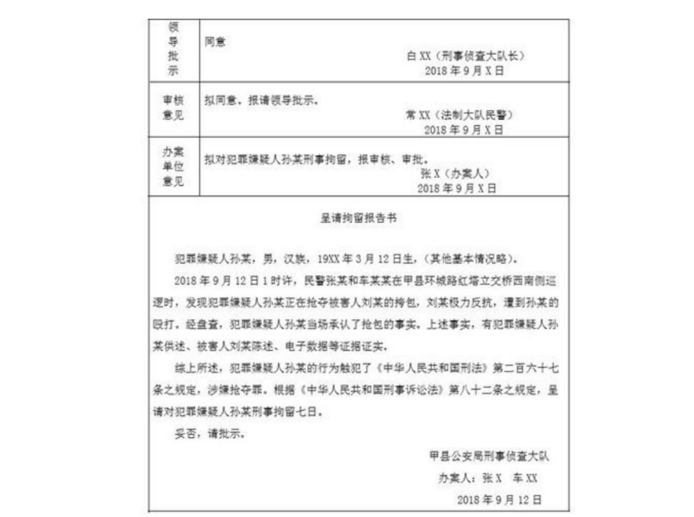
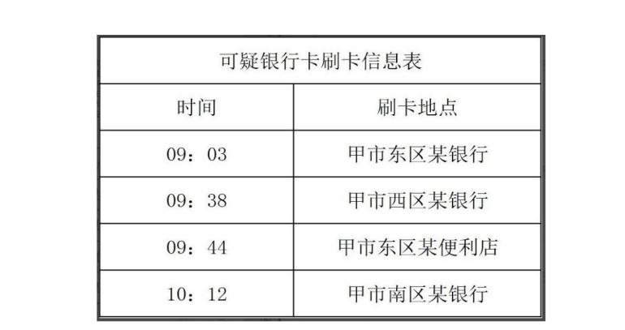

### **一、侦查制度全景图**

#### **2.1 侦查概念**
- **定义**：公安机关、检察院对刑事案件，依照法律进行的收集证据、查明案情的工作和有关的强制性措施（将之前的“专门调查工作”改为“收集证据、查明案情的工作”）。
- **与“调查”区别**：监委用“调查”，公安机关用“侦查”。

---

#### **2.2 侦查一般规定**

| 规定内容 | 课堂逐字稿要点 |
|---|---|
| **立案后及时侦查取证** | 全面、客观收集证据，有罪无罪、罪轻罪重都要查 |
| **预审** | 对有证据证明有犯罪事实的案件进行预审，核实证据的真实性、合法性、关联性 |
| **强制措施和侦查措施要求** | 严禁仅凭怀疑采取强制措施和侦查措施，必须有证据支持 |
| **见证人** | 侦查活动应邀请见证人，但与案件有利害关系的人员、公安机关工作人员及其聘用人员不得担任见证人 |
| **全程录音录像代替见证人** | 无法找到符合条件的见证人时，全程录音录像并在笔录中注明 |
| **侦查工作保密** | 涉及国家秘密、商业秘密、个人隐私的，应当保密 |
| **执法相对人申诉控告** | 当事人、辩护人、诉讼代理人、利害关系人可申诉控告，受理机关为被申诉控告的公安机关或同级检察院 |
| **上级监督** | 上级公安机关可责令下级限期改正违法行为或申诉控告事项，必要时直接作出处理决定 |

---

### **二、十大侦查手段详解**

#### **1. 讯问犯罪嫌疑人**
- **与询问区别**：行政案件中无“讯问”，只有“询问”；刑事案件中“讯问”针对犯罪嫌疑人，更严肃。
<LinkCard icon="twemoji:astonished-face" title="刑事讯问" href="/ncsec/6tyfexwd/" />

#### **2. 询问证人、被害人**
- **注意**：行政案件中无“被害人”，只有“被侵害人”；刑事案件中“被害人”是专有称谓。
<LinkCard icon="twemoji:astonished-face" title="询问证人、被害人" href="/ncsec/6tyfexwd/" />

#### **3. 勘验检查**
- **内容**：与行政案件类似，但刑事案件中更注重现场证据的固定和提取。

<LinkCard icon="twemoji:astonished-face" title="勘验检查" href="/ncsec/odve2wtn/" />

#### **4. 搜查**
- **特点**：刑事案件独有，针对犯罪嫌疑人住所、物品等进行搜查，需严格审批。

<LinkCard icon="twemoji:astonished-face" title="搜查" href="/ncsec/odve2wtn/" />

#### **5. 查封、扣押**
- **区别**：行政案件中属于行政强制措施，刑事案件中属于侦查手段。

<LinkCard icon="twemoji:astonished-face" title="查封、扣押" href="/ncsec/3qukg9w5/" />

#### **6. 查询、冻结**
- **适用**：刑事案件中用于控制嫌疑人财产，防止转移。

<LinkCard icon="twemoji:astonished-face" title="查询、冻结" href="/ncsec/3qukg9w5/" />

#### **7. 鉴定**
- **内容**：与行政案件类似，但刑事案件中鉴定结果对定罪量刑影响更大。

<LinkCard icon="twemoji:astonished-face" title="鉴定" href="/ncsec/xh2rzt69/" />

#### **8. 辨认**
- **特点**：刑事案件中用于确认嫌疑人、物品或场所，需严格程序。

<LinkCard icon="twemoji:astonished-face" title="辨认" href="/ncsec/wntv1sjq/" />

#### **9. 技术侦查措施**
- **适用条件**：针对严重刑事犯罪（可能判七年以上），需严格审批。
- **课堂金句**：技术侦查措施是“大招”，不是随便能用的。

<LinkCard icon="twemoji:astonished-face" title="技术侦查措施" href="/ncsec/wntv1sjq/" />

#### **10. 通缉**
- **适用对象**：应当逮捕而在逃的犯罪嫌疑人。
- **课堂金句**：通缉是“追捕令”，专门针对在逃嫌疑人。

<LinkCard icon="twemoji:astonished-face" title="通缉" href="/ncsec/wntv1sjq/" />

---

### 四、真题题库（原题呈现）

:::: card-grid

::: card title="真题1" icon="svg-spinners:blocks-shuffle-3"
<Badge type="warning" text="单选" />甲县公安局刑警大队民警小张在办理一起故意伤害案件时，对双耳失聪的受害人李某进行询问。下列说法符合法律规定的是：（ ）（2019年公安联考第18题）

A. 小张带领一名辅警辅助人员进行询问  
B. 小张通知李某的手语老师参加询问，进行翻译  
C. 询问时，小张问手语老师阐述了自己对案件的看法  
D. 询问结束时，小张让手语老师代替李某在《询问笔录》上签字  

**答案：!!B!!**  

::: collapse 

- **解析**
	- 辅警无询问权；
	- 手语老师可参与翻译但不能代签；
	- 询问中不能让翻译人员发表案件看法。

:::

::: card title="真题2" icon="svg-spinners:blocks-shuffle-3"
<Badge type="warning" text="单选" />某县公安机关侦查人员在侦办一起强奸案件时，准备对犯罪嫌疑人贾某进行人身检查，贾某拒不配合。对此情况，民警做法正确的是：（ ）（2019年公安联考第27题）

A. 未经贾某同意不得对其进行强制检查  
B. 请示办案部门负责人批准后进行强制检查  
C. 请示县公安局长批准后进行强制检查  
D. 在紧急情况下可以先强制检查后请示领导  

**答案：!!B!!**  
::: collapse 

- **解析**

	- 刑事案件中，侦查人员在必要时可对犯罪嫌疑人进行强制检查，但需经办案部门负责人批准。
	- 未经批准，不得擅自进行强制检查；紧急情况下，需先采取必要措施，但仍需及时补办手续。
:::

::: card title="真题3" icon="svg-spinners:blocks-shuffle-3"
<Badge type="warning" text="多选" />现场某一具体情节的形成过程、条件和原因，现场勘验时可以进行侦查实验。下列说法正确的有：（ ）（2017年公安联考第53题）

A. 侦查实验的情况应当写成笔录，由侦查人员签名或者盖章  
B. 模拟爆炸案件是侦查实验的一种常见形式  
C. 对有伤风化的行为不适用侦查实验  
D. 侦查实验须经公安机关负责人批准  

**答案：!!BCD!!**  

::: collapse 

- **解析**

	- 侦查实验是为查明案情，在必要时进行的模拟实验，需经公安机关负责人批准；
	- 爆炸案件模拟是常见形式；
	- 对涉及伤风化的行为不适用；
	- 必须制作笔录，由所有参与人员签名或盖章。

:::

::: card title="真题4" icon="svg-spinners:blocks-shuffle-3"
<Badge type="warning" text="单选" />公安机关在办理一起故意伤害刑事案件过程中，被害人对伤情鉴定提出异议，经县级以上公安机关负责人批准，应当补充鉴定的是（ ）（2020年公安联考第27题）

A. 鉴定机构缺少鉴定资质  
B. 伤情鉴定中显示被害人血型有误  
C. 鉴定人员是犯罪嫌疑人近亲属  
D. 公安机关在现场发现新的作案工具  

**答案：!!D!!**  

::: collapse 
- **解析**
	- 新发现的作案工具可作为补充鉴定依据。
:::

::: card title="真题5" icon="svg-spinners:blocks-shuffle-3"
<Badge type="warning" text="单选" />某市公安局刑侦大队民警抓获了涉嫌诈骗的犯罪嫌疑人周某。经查，周某与他人合伙经营一家服装店。为深挖周某涉案信息，公安机关采取了多种措施，但不宜采取的是（ ）（2020年公安联考第32题）

A. 查询、分析周某活动轨迹，研判挖掘潜藏的同案犯  
B. 调取周某的银行交易流水明细  
C. 冻结周某门店合伙人的账户资金  
D. 对近期未破的同类案件进行串并案分析  

**答案：!!C!!**  

::: collapse 
- **解析**
	- 冻结合伙人账户资金超出了直接关联范围。==无关不冻结==
:::

::: card title="真题6" icon="svg-spinners:blocks-shuffle-3"
<Badge type="warning" text="多选" />甲县公安局刑警大队民警张某、车某某在办理一起刑事案件。下图是办案民警张某制作的《呈请拘留报告书》。依据相关法律规定，该法律文书存在的问题是：（ ）（2020年公安联考第68题）

A. 呈请刑事拘留七日，程序法适用不当  
B. 认定涉嫌抢夺罪，实体法适用不当  
C. 未说明案件来源和到案经过  
D. 刑事拘留审批程序不当  

**答案：!!ABD!!**  

::: collapse 
- **解析**
	- 刑事拘留最长期限为`30日`；
	- 罪名适用错误；
	- 拘留审批需==县级以上负责人批准==。
:::

::: card title="真题7" icon="svg-spinners:blocks-shuffle-3"
<Badge type="warning" text="单选" />某年7月，甲县公安局机关某派出所民警小刘在社区走访时，居民张大妈、李大伯向其反映他们投资了一个回报率高的项目。民警小刘在后续走访中发现，该社区内已有20余人投资了此项目。民警小刘怀疑此为新型电信网络诈骗，一方面劝告居民停止投资，一方面立即向上级部门汇报。后经甲县公安机关调查发现这是一起以投资解冻巨额“民族资产”获取高额回报为诱饵的新型电信网络诈骗，全县已有400余人共投资了3200余万元。经查，以上资金已流入魏某的银行账户。甲县公安局随即对魏某开展调查，在乙县发现魏某，办案民警以下做法正确的是：（ ）（2020年刑事诉讼法联考第78题）

A. 将其就近传唤至乙县某派出所内，并依法通知其家属  
B. 在办案过程中提出回避，需经办案单位负责人批准  
C. 对犯罪嫌疑人魏某随身携带的银行卡、手机等物品全部予以扣押  
D. 在扣押现场让协助办案的辅警担任扣押见证人  

**答案：!!A!!**  

::: collapse 
- **解析**
	- 扣押需符合条件的见证人；
	- 辅警不能担任见证人；
	- 传唤需依法通知家属。
:::

::: card title="真题8" icon="svg-spinners:blocks-shuffle-3"
<Badge type="warning" text="单选" />自2016年以来,甲县王某网罗社会闲散人员,组成“黑龙帮”,制定帮规,开设赌场,向甲县农贸市场收取保护费。2017年起,王某等人插手当地旅游市场,通过暴力、威胁、欺骗等手段,强迫游客购买商品,非法获取巨额经济利益。2019年11月,“黑龙帮“以年利率40%～60%不等的利息,向社会上多人发放货款达50余次,累计金额上千万元;为从事非法放贷活动,实施套取银行资金高利转贷、骗取贷款、非法吸收公众存款等行为;为强行索要债务,实施故意伤害、非法拘禁等行为社会影响极其恶劣。2019年12月中旬案发,王某等20余人被公安机关抓获。在本案办理过程中,根据犯罪侦查的需要,相关部门采取了技术侦查措施。对于技术侦查措施的使用,下列做法不恰当的是: ( )（2020年公安联考第71题）

A. 本案经批准可采取技术侦查措施  
B. 只能在对王某立案后，采取技术侦查措施  
C. 对王某采取技术侦查的期限不得超过6个月  
D. 采取技术侦查措施收集的材料可以作为证据使用  

**答案：!!C!!**  
::: collapse 
- **解析**
	- 技术侦查期限为`3+3*N`
:::

::: card title="真题9" icon="svg-spinners:blocks-shuffle-3"
<Badge type="warning" text="单选" />自2016年以来,甲县王某网罗社会闲散人员,组成“黑龙帮”,制定帮规,开设赌场,向甲县农贸市场收取保护费。2017年起,王某等人插手当地旅游市场,通过暴力、威胁、欺骗等手段,强迫游客购买商品,非法获取巨额经济利益。2019年11月,“黑龙帮“以年利率40%～60%不等的利息,向社会上多人发放货款达50余次,累计金额上千万元;为从事非法放贷活动,实施套取银行资金高利转贷、骗取贷款、非法吸收公众存款等行为;为强行索要债务,实施故意伤害、非法拘禁等行为社会影响极其恶劣。2019年12月中旬案发,王某等20余人被公安机关抓获。侦查终结后,公安机天将土某等人的案件移运人民检蔡院审查起诉。人民检察院认为需要补充侦查的,某市公安机关在侦办“黑龙帮”案时采取了技术侦查措施。下列做法不恰当的是：（ ）（2020年公安联考第71题）

A. 人民检察院决定自行侦查的, 应当在审查起诉期限内侦查完毕

B. 对于本案的补充侦查, 应当在二个月内补充侦查完毕

C. 对于本案的补充侦查以三次为限

D. 对于需要补充侦查的，一律退回公安机关补充侦查

**答案：!!C!!**  
::: collapse 
- **解析**
	- **补充侦查**
		- 退回公安机关--==2次，一次一月==
		- 自行侦查--==一个月+15日==
:::

::: card title="真题10" icon="svg-spinners:blocks-shuffle-3"
<Badge type="warning" text="单选" />某铁路公安处侦办的一起运输假币犯罪案件已经符合侦查终结条件,根据程序规定,下列说法错误的: ( )（2019年公安联考第29题)

A. 由该公安机关负责人组织集体讨论后,作出批准决定

B. 该案系共同犯罪,移送起诉意见书应当对犯罪嫌疑人分别提出处理意见

C. 案件中扣押的假币应作为证据,随案移送检察机关

D. 因保密,公安机关不得告知犯罪嫌疑人及其辩护律师案件移送情况

**答案：!!D!!**  
::: collapse 
- **解析**
	- 移送审查起诉时，将案件移送情况告知犯罪嫌疑人及其辩护律师，从而保证其了解案件的进展情况，及时行驶法律规定的诉讼权利
:::

::: card title="真题11" icon="svg-spinners:blocks-shuffle-3"
<Badge type="warning" text="多选" />根据《中华人民共和国刑事诉讼法》的规定,公安机关侦查终结的案件在移送同级人民检察院时,下列说法正确的有: ( )（2017年公安联考第61题）

A. 仅移送诉讼卷,侦查卷由公安机关存档备查

B. 不宜移送的实物,应将其清单、照片或者其他证明文件随案移送

C. 仅移送定罪证据,量刑证据附侦查卷由公安机关存档备查

D. 被公安机关依法排除的证据据,仍需随案移送检察机关

**答案：!!AB!!**  
::: collapse 
- **解析**
	- 移送审查起诉流程
		- 移送诉讼卷（侦察卷存档备查）
		- 移送实物证据
		- 制作起诉意见书
		- 换押证
		- 告知律师
:::

::: card title="真题12" icon="svg-spinners:blocks-shuffle-3"
<Badge type="warning" text="多选" />在扫黑除恶专项斗争中,某市公安局一举抓获了涉恶犯罪团伙李某等主要成员。为进一步向社会公开征集李某等人的违法犯罪线索,公安机关下列做法正确的有:（ ）

A. 通过广播电视台发布线索征集通告

B. 通过市公安局官万微博发布线索征集通告

C. 通过张贴海报的形式发布线索征集通告

D. 通过打电话的形式向市民发布线索征集通告

**答案：!!ABC!!**  

:::

::: card title="真题13" icon="svg-spinners:blocks-shuffle-3"
<Badge type="warning" text="多选" />甲市公安机关在侦办一起电信诈骗案件时,获取了犯罪嫌疑人在本市三个相邻区使用过的一张银行卡。下表是该银行卡某日上午在甲市刷卡的时间和地点的信息。据此信息,公安机关可以采取的侦查措施有:（ ）（2020年公安联考第
69题）

A. 寻找与刷卡信息轨迹相符的车辆  
B. 寻找与刷卡信息轨迹相符的手机号码  
C. 调取刷卡银行的监控录像  
D. 询问甲市西区某便利店的店主

**答案：!!ABC!!**  

::::