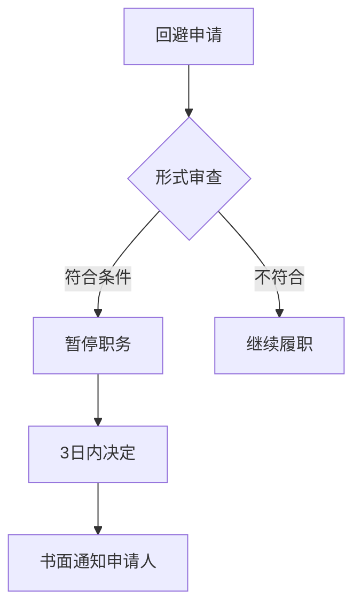

[Day1回放](https://n.dingtalk.com/dingding/live-room/index.html?roomId=yUjpdQsXXc&liveUuid=f366b44c-cd10-4705-93dd-402f111a1733)

回放密码：778899

## **公安机关办理行政案件程序规定**

——**重点一：立案和案件终结**

### **一、审批**

1. **立案**：==办案部门负责人==。
2. **结案**：无需审批。情形如下：

- （1）作出行政处罚等处理决定，且已执行的；
- （2）作出处理决定后，因执行对象灭失、死亡等客观原因导致无法执行或者无需执行的；
- （3）作出不予行政处罚决定的；
- （4）按照本规定第十章规定达成==调解、和解协议并已履行==的；
- （5）违法行为涉嫌构成犯罪，转为刑事案件办理的。

::: warning 总结

==处罚不处罚；一轻一重==。

对不予处罚不服的，可以申请行政复议或提起行政诉讼。

:::

3. **终止调查**：公安派出所、县级公安机关办案部门或者出入境边防检查机关以上负责人审批。情形如下：
- （1）没有违法事实的；
- （2）违法行为已过追究时效的；
- （3）违法嫌疑人死亡的；（==作出处罚决定之前==）
- （4）其他需要终止调查的情形。

::: warning 总结

==无事实、已过时、人已死==。

:::
### **二、期限**

1. 立案审批时间：==当场-24小时-3日内==。
2. 办案期限：治安案件`30+30+30`日；其他行政案件不超过`90`日。

::: note 新法

《治安管理处罚法》（2026 年 1 月 1 日实施）118 条：公安机关办理治安案件的期限，自立案之日起不得超过三十日；案情重大、复杂的，经上一级公安机关批准，可以延长三十日。期限延长==以二次为限==。公安派出所办理的案件需要延长期限的，由所属公安机关批准。**为了查明案情进行鉴定的期间、听证的期间，不计入办理治安案件的期限**。

:::
### **三、救济**

1. **不予立案**：复议前置。
2. **结案**：对于处罚和不予处罚不服的，可申请行政复议或者提起行政诉讼，==对于通过简易程序作出的处罚，复议前置==。

::: info Q&A

问：对于警告的处罚不服，都是复议前置。

答：错误，==因为并不是所有警告处罚都是通过简易程序作出的=={.danger}。

:::


3. **终止调查**：无救济路径。


### **四、其他问题**

1. **性质无法确定的案件处理**：对发现或受理的案件暂时无法确定为刑事案件或行政案件的，==可以按照行政案件的程序办理==；
2. 无论有效警、无效警，均需填写 ==《行政案件立案登记表》== ；
3. **接受证据清单**：==一式三份==；（提交人->办案民警->保管人，提交人一份、办案民警附卷一份、保管人一份）
4. **网上接报案登记**：涉及国家秘密【名称涉密+内容涉密（如考试类）】的案件、重复报案、正在办理中或已经办结的不再登记。

## **重点二：管辖**

### **一、地域管辖**

1. **行政案件的管辖权**：行政案件由违法行为地公安机关和违法行为人居住地公安机关管辖。
2. **违法行为地专属管辖案件**：卖淫、嫖娼、赌博、毒品。

::: warning

第一、卖淫、嫖娼包含==四类案件==，分别是卖淫、嫖娼、在公共场所拉客招嫖以及引诱、容留、介绍他人卖淫。

第二、对于吸毒行为，==行为发生地和发现地都有管辖权==。

:::

### **二、级别管辖**

1. 派出所：对==违反治安==的行为，可以处==警告、1000元以下==的罚款；
2. 决定行政拘留：公安、国安和海警局。
3. 决定驱逐出境：公安部。
4. 决定暂扣驾驶证：交警大队。
5. 决定吊销驾驶证：交警支队。

::: info Q&A

问：张某违反《居民身份法》相关规定，某县公安局派出所作出了警告的处罚，正确吗？

答：错误，应当由县公安局作出处罚决定。因此该行为违反的是《居民身份证法》，而不是《治安管理处罚法》。

:::


### **三、境外管辖**

1. **原则**：==行政案件==如果发生在国外，中国放弃管辖权；
2. **例外**：在外国船舶和航空器内发生的违反治安管理行为，依照中华人民共和国缔结或者参加的**国际条约**，中华人民共和国行使管辖权的，适用《治安管理处罚法》。

### **四、管辖争议：**

对管辖权发生争议的案件，先协商管辖，如达不成一致意见，报请==共同的上级公安机关指定管辖==。

### **五、共同管辖：**

几个公安机关都有管辖权的行政案件，由==最初受理地公安机关管辖==，必要时，可以由主要违法行为地公安机关管辖。

### **六、直接办理：**

对于重大、复杂的案件，上级公安机关可以直接办理或者指定管辖。

### **七、特殊案件管辖**

1. 针对或者利用==网络==实施的违法行为案件的管辖：和违法行为沾边的地方以及违法行为人居住地公安机关。
2. 行驶中的客车上发生案件的管辖：由案发后==客车最初停靠地==公安机关管辖,必要时，==始发地、途经地、到达地==都有管辖权。
3. 倒卖、伪造、变造火车票案件，由最初受理地的铁路或地方公安机关管辖，必要时，可以==移送主要违法行为发生地的铁路或者地方公安机关==管辖。

## **重点三：回避**

### **一、谁需要回避**

公安机关负责人、办案人员、鉴定人员、翻译人员。

### **二、为什么要回避**

近亲属血缘；利害关系；其他关系+影响案件公正处理的。

### **三、回避的方式**

自行回避、申请回避、指定回避。

### **四、申请回避的主体**

当事人及其法定代理人。

### **五、回避决定权限：**

办案民警的回避，由其所属的公安机关决定；公安机关负责人的回避，由上一级公安机关决定。

### **六、公安机关做出回避决定的时限**

公安机关应当在收到申请之日起==二日==内做出决定并通知申请人。

### **七、回避决定作出前**

办案人民警察不得停止对行政案件的调查。

### **八、回避决定作出后**

公安机关负责人、办案人民警察不得再参与该行政案件的调查和审核、审批工作。（注意：可以参与执行工作）

### **九、被决定回避的人员在回避决定做出以前所进行的与案件有关的活动是否有效**

由做出回避决定的公安机关根据是否影响案件依法公正处理等情况决定。（不一定有效，也不一定无效）


### **十、流程图**



## **重点四：调查取证的一般规定**

### **一、调查主体**

（一）原则上：两名以上人民警察。

（二）例外（10种情节）

1. ==1警+辅警+全程录音录像==

调查辅助工作主体：可以由一名人民警察带领警务辅助人员进行，但应当全程录音录像，范围包括：接报案、立案登记、接受证据、信息采集、调解、送达文书等工作。

2. ==1警+执法办案场所+应当全程录音录像==（办理治安案件中）

（1）应当在==规范设置、严格管理=={.info}的执法办案场所；

（2）仅局限于==询问、扣押、辨认==，或者进行==调解==四种活动；

（3）应当全程同步录音录像，否则相关证据排除。

### **二、三个制度规定**

#### **（一）继续盘问**

1. **对象**：“一个前提、四种对象”

（1）“一个前提”指的是“经当场盘问、检查”；

（2）“四种对象”包括：被指控有==犯罪行为==的；有现场作案嫌疑的；有作案嫌疑身份不明的；携带的物品有可能是赃物的。

不可继续盘问的对象（包括但不限于）：

涉嫌违反治安管理行为的法定最高处罚为警告、罚款或者其他非限制人身自由的行政处罚的；患有精神病、急性传染病或者其他严重疾病的;

2. **地点**

- ==派出所==；
- ==出入境边防检查机关询问室==。 

3. **时限审批**

- 所长——决定继续盘问==12个小时==；
- 1670 孕乳人员 4 小时。
- 县级公安机关值班负责人——决定将继续盘问延长至 24 小时。（无法证实或排除嫌疑）
- 县级公安机关主管负责人——决定将继续盘问延长至 48 小时。（身份不明+无法证实或排除嫌疑） 

4. **不服救济**

（1）**中国人不服**：可以申请行政复议或者提起行政诉讼；

（2）**外国人不服**：==只可申请复议一次，为最终决定==。

#### **（二）对醉酒的违法嫌疑人的约束**

1. **适用对象**：醉酒+违法嫌疑+举止失控可能对本人、他人、公共安全有威胁，只有同时符合上述==三个条件==，才可采取保护性约束措施。

2. **时限**：约束过程中，应当指定专人严加看护。确认醉酒人酒醒后，应当立即解除约束，并进行询问。约束时间不计算在询问查证的时间内。

3. **去处安排**：公安机关可以通知其家属、亲友或所属单位将其领回看管；必要时，应当送医院醒酒；公安机关。

4. **约束措施**：公安机关可以使用警绳、约束带等对其进行约束，不可使用手铐、脚镣。

::: tip 对比

对比：《人民警察法》第十四条：公安机关的人民警察对==严重危害公共安全或者他人人身安全的===={.danger}精神病人，可以==采取保护性约束措施==。

需要送往指定的单位、场所加以监护的，应当报请县级以上人民府公安机关批准，并及时通知其监护人。

- 第一 对象：涉嫌==犯罪==的疑似精神病人；
- 第二 审批：县级以上公安机关；
- 第三 措施：可以适用手铐、脚镣等；
- 第四 约束处所：看守所，或者精神病院；
- 第五 处置：由法院作出强制医疗的决定。

:::


#### **（三）对恐怖活动嫌疑人实施人身约束和冻结措施的程序性规定**

1. **人身约束**

（1）**审批**：==县级以上公安机关负责人==批准；

（2）**期限**：不得超过`三个月`，不得延期；

（3）**监督**：公安机关可以采取电子监控、不定期检查等方式对被约束人遵守约束措施的情况进行监督。

::: warning

可以责令其将身份证交公安机关保存。

:::


2. **财产的冻结**

（1）**审批**：==县级以上公安机关负责人==批准；

（2）**期限**：不得超过`2个月`，经过==上一级公安机关负责人==批准，可以延长`一个月`。


## **重点五：传唤和询问**

### **一、传唤方式**

1. 口头传唤→现场发现违法嫌疑人→在询问笔录中注明到案方式、到案时间和离开的时间。

2. 书面传唤→非现场发现违法嫌疑人→在传唤证上由其注明到案和离开时间并签名，拒绝填写或签名的，办案警察应当在传唤证上注明。

3. 强制传唤→只能间接适用→可以使用手铐、警绳等约束性警械。
::: tip 注意

刑事案件没有强制传唤

:::


### **二、传唤的审批和时限**

1. 审批：办案部门负责人。

2. 时限：
	- `8-24小时`，延长至`24小时`的条件是—案件复杂+可能适用行政拘留。
	- 治安案件的传唤是 `8-12-24`，延长至`12小时`的条件是—涉案人数众多或者身份不明。

3. 《治安管理处罚法》中不得延长到`24小时`的情形：
	- 一是，第42条：擅自进入铁路、城市轨道交通防护网或者火车、城市轨道交通列车来临时在铁路、城市轨道交通线路上行走坐卧，抢越铁路、城市轨道，影响行车安全的，处警告或者五百元以下罚款。
	- 二是，第67条：从事旅馆业经营活动不按规定登记住宿人员姓名、有效身份证件种类和号码等信息的，或者为身份不明、拒绝登记身份信息的人提供住宿服务的，对其直接负责的主管人员和其他直接责任人员处五百元以上一千元以下罚款；情节较轻的，处警告或者五百元以下罚款。
	- 三是，第68条：房屋出租人将房屋出租给身份不明、拒绝登记身份信息的人的，或者不按规定登记承租人姓名、有效身份证件种类和号码等信息的，处五百元以上一千元以下罚款；情节较轻的，处警告或者五百元以下罚款。
	- 四是，第89条：饲养动物，干扰他人正常生活的，处警告；警告后不改正的，或者放任动物恐吓他人的， 处一千元以下罚款。

### **三、询问地点**

1. 询问违法嫌疑人→住处、单位、所在市县内的指定地点。

2. 询问被害人证人→住处、单位、学校、现场、其提出的地点、村委会、居委会、公安机关。

### **四、询问特殊对象**

1. 未成年人→合适成年人到场制度。
具体：父母或其他监护人→其他成年亲属、单位代表（学校、单位、基层组织、未成年人保护组织）→==如未到场，在询问笔录中注明==。

2. 询问聋哑人→应当由通晓手语的人在场→在询问笔录中注明被询问人的聋哑情况以及翻译人员的姓名、住址、工作单位和联系方式。==无翻译直接排除=={.danger}

3. 询问不通晓当地通用语言文字的人→应当为其配备翻译人员→在笔录中注明翻译人员的姓名、住址、工作单位和联系方式。

 
### **五、核对询问笔录**

1. 记录有误→更正+捺指印；

2. 记录遗漏→补充+捺指印；

3. 记录正确→逐页签名或捺指印→在结尾处书写“以上笔录我看过（或已向我宣读过），与我说的相符”。


## **习题**

793763596787732480
### **分布情况**

::: chartjs 分布情况
```json
{
  "type": "bar",
  "data": {
    "labels": ["0-59", "60-65", "66-70", "71-75", "76-80", "81-85", "86-90", "91-95", "96-100", "满分100"],
    "datasets": [
      {
        "label": "系列1",
        "data": [144, 117, 206, 212, 221, 92, 41, 5, 1, 0],
        "backgroundColor": "rgba(255, 99, 132, 0.7)"
      },
      {
        "label": "系列2",
        "data": [14, 11, 20, 20, 21, 9, 4, 0, 0, 0],
        "backgroundColor": "rgba(54, 162, 235, 0.7)"
      }
    ]
  }
}
```
:::


### **错题难题回顾**

:::: card-grid 

::: card title="错题1" icon="svg-spinners:blocks-shuffle-3" 

<Badge type="warning" text="多选" />在办理行政案件过程中，需要终止调查，审批主体是（ ）（4分）

**选项**：

A. 公安派出所所长

B. 交警大队大队长

C. 治安大队大队长

D. 出入境边防检查机关负责人

**答案**：!!ABCD!! 

::: collapse 
- **解析**： 
    - 根据《公安机关办理行政案件程序规定》第二百五十九条，经调查发现行政案件具有以下情形之一的，需经以下负责人批准终止调查：
        - （一）没有违法事实的；
        - （二）违法行为已过追究时效的；
        - （三）违法嫌疑人死亡的；
        - （四）其他需要终止调查的情形。
    - 终止调查时，若违法嫌疑人已被采取行政强制措施，应立即解除。
    - **误区**：考生仅选择了ABD，忽略了治安大队大队长（C选项）也具有审批权限。

:::

::: card title="错题2" icon="svg-spinners:blocks-shuffle-3" 

<Badge type="warning" text="多选" />继续盘问的时限审批权涉及哪些人员？（ ）（4分）

**选项**：

A. 执勤民警

B. 所长

C. 县级公安机关值班负责人

D. 县级公安机关主要负责人

**答案**：!!BC!! 

::: collapse 
- **解析**： 
    - 继续盘问的时限审批权限依次为：
        - 所长（12小时）
        - 县级公安机关值班负责人（24小时）
        - 县级公安机关主管负责人（48小时）
    - **误区**：考生选择了BCD，误将“主要负责人”与“主管负责人”混淆，实际上主管负责人负责48小时的审批，而主要负责人并不直接参与时限审批。

:::

::: card title="错题3" icon="svg-spinners:blocks-shuffle-3" 

<Badge type="warning" text="多选" />在办理行政案件过程中，结案的条件是（ ）（4分）

**选项**：

A. 当事人达成和解协议且履行到位

B. 作出处罚决定后，因执行对象不服导致无法执行的

C. 违法行为涉嫌犯罪，转为刑事案件办理的

D. 作出不予行政处罚决定的

**答案**：!!CD!! 

::: collapse 
- **解析**： 
    - 结案的条件包括：
        - 违法行为涉嫌犯罪，转为刑事案件办理（C选项）
        - 作出不予行政处罚决定（D选项）
    - **误区**：
        - A选项错误：达成和解协议且履行到位后，公安机关仍需根据具体情况决定是否处罚，需双方书面申请且公安机关尚未作出处理决定时才可能结案。
        - B选项错误：执行对象不服导致无法执行属于主观原因，只有因客观原因（如执行对象灭失、死亡）无法执行时才可结案。

:::

::: card title="错题4" icon="svg-spinners:blocks-shuffle-3" 

<Badge type="warning" text="多选" />申请回避的方式有哪些？（ ）（4分）

**选项**：

A. 口头

B. 书面

C. 电话

D. 邮件

**答案**：!!AB!! 

::: collapse 
- **解析**： 
    - 根据《公安机关办理行政案件程序规定》，申请回避的方式包括：
        - 口头申请（需记录在案）
        - 书面申请
    - **误区**：考生选择了ABCD，误以为电话和邮件也是合法的申请方式，但实际上电话和邮件不属于法定的申请回避方式。

:::

::: card title="错题5" icon="svg-spinners:blocks-shuffle-3" 

<Badge type="success" text="判断" />在办理行政案件过程中，回避决定作出后，公安机关负责人、办案人民警察不得再参与该案件的执行工作。（3分）

**选项**：

A. 正确

B. 错误

**答案**：!!B!! 

::: collapse 
- **解析**： 
    - 回避决定作出后：
        - 公安机关负责人、办案人民警察不得再参与该行政案件的调查、审核、审批工作
        - 但可以参与执行工作，因为执行工作在处罚决定作出后进行，不会影响处罚决定的正确性
    - **误区**：考生选择了B（正确），但实际正确选项为B（错误），即该说法错误，负责人和办案民警可以参与执行工作。

:::

::: card title="错题6" icon="svg-spinners:blocks-shuffle-3" 

<Badge type="success" text="判断" />公安机关在办理治安案件过程中，一名人民警察在执法办案场所可以采取辨认措施，但应当全程录音录像。（3分）

**选项**：

A. 正确

B. 错误

**答案**：!!B!! 

::: collapse 
- **解析**： 
    - 在规范设置、严格管理的执法办案场所，可以由一名人民警察采取以下措施：
        - 询问
        - 扣押
        - 辨认
        - 调解
    - 但必须全程录音录像
    - **误区**：考生选择了A（正确），但实际正确选项为B（错误），即该说法错误，必须在规范设置的场所才能采取辨认措施。

:::

::: card title="错题7" icon="svg-spinners:blocks-shuffle-3" 

<Badge type="success" text="判断" />在办理行政案件过程中，公安机关出具了《行政案件不予立案告知书》，如果控告人不服，即可申请行政复议，也可提起行政诉讼。（3分）

**选项**：

A. 正确

B. 错误

**答案**：!!B!! 

::: collapse 
- **解析**： 
    - 根据《行政复议法》规定：
        - 对公安机关作出的不予立案决定不服的，控告人必须先申请行政复议
        - 对复议结果不服的，才能提起行政诉讼
    - **误区**：考生选择了A（正确），但实际正确选项为B（错误），即该说法错误，复议是前置程序。

:::

::: card title="错题8" icon="svg-spinners:blocks-shuffle-3" 

<Badge type="success" text="判断" />卖淫、嫖娼案件由违法行为地公安机关管辖，违法行为人居住地没有管辖权。（3分）

**选项**：

A. 正确

B. 错误

**答案**：!!A!! 

::: collapse 
- **解析**： 
    - 根据《公安机关办理行政案件程序规定》：
        - 卖淫、嫖娼案件由违法行为地公安机关专属管辖
        - 赌博和毒品案件同样适用此规定
    - **误区**：考生选择了B（错误），但实际正确选项为A（正确），即该说法正确，居住地无管辖权。

:::

::: card title="错题11" icon="svg-spinners:blocks-shuffle-3" 

<Badge type="success" text="判断" />询问不通晓当地通用语言文字的人时，必须配备翻译人员，翻译人员应当在询问笔录的结尾处签名或捺指印。（3分）

**选项**：

A. 正确

B. 错误

**答案**：!!B!! 

::: collapse 
- **解析**： 
    - 根据《公安机关办理行政案件程序规定》第77条：
        - 翻译人员只需在询问笔录结尾处签名
        - 无需捺指印
    - **误区**：考生选择了A（正确），但实际正确选项为B（错误），即该说法错误，无需捺指印。

:::

::: card title="错题15" icon="svg-spinners:blocks-shuffle-3" 

<Badge type="success" text="判断" />传唤违法嫌疑人时，如果是书面传唤，应当在询问笔录中注明到达和离开的时间。（3分）

**选项**：

A. 正确

B. 错误

**答案**：!!B!! 

::: collapse 
- **解析**： 
    - 根据《公安机关办理行政案件程序规定》：
        - 口头传唤：在询问笔录中注明到案经过、到案时间和离开时间
        - 书面传唤：在传唤证上注明到案时间和离开时间
    - **误区**：考生选择了A（正确），但实际正确选项为B（错误），即该说法错误，书面传唤需在传唤证而非询问笔录中注明。

:::