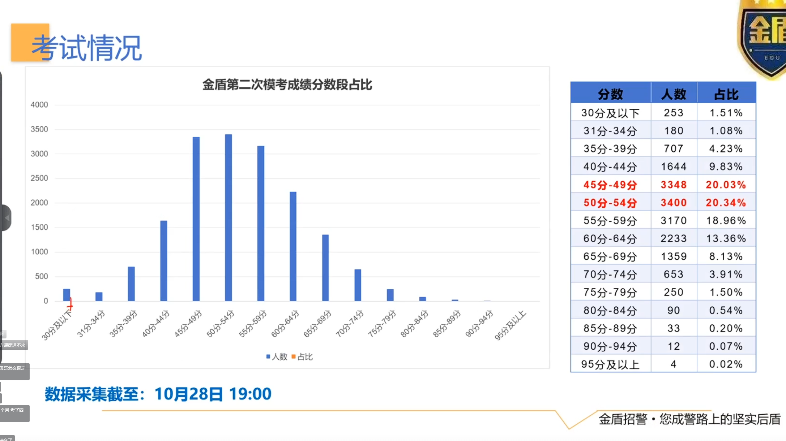
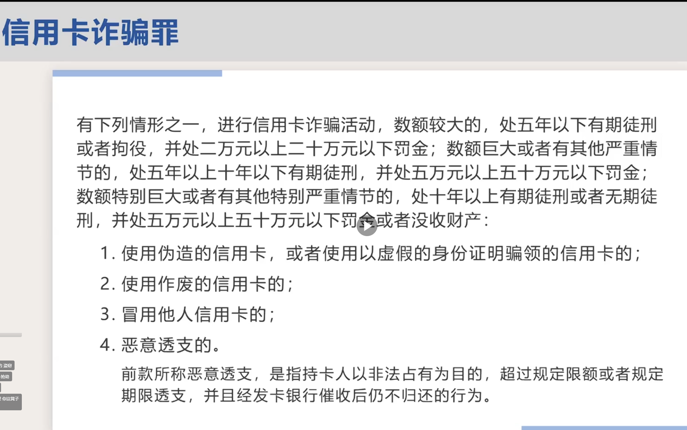
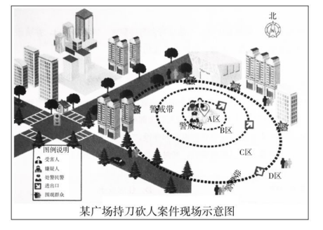
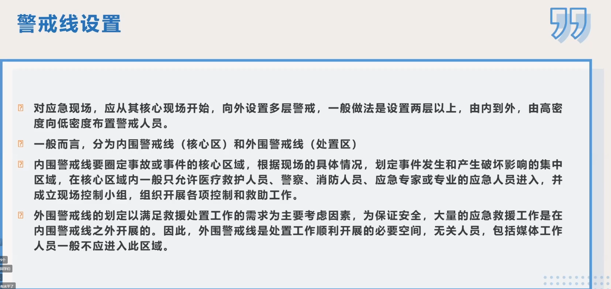
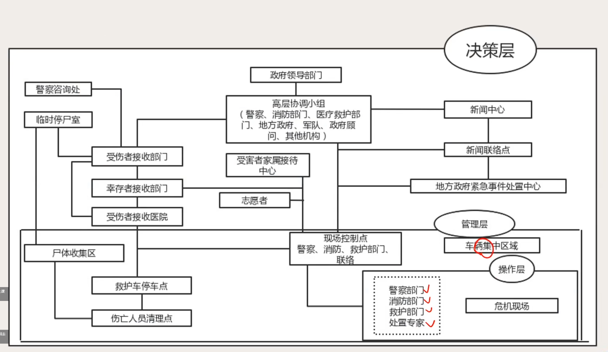
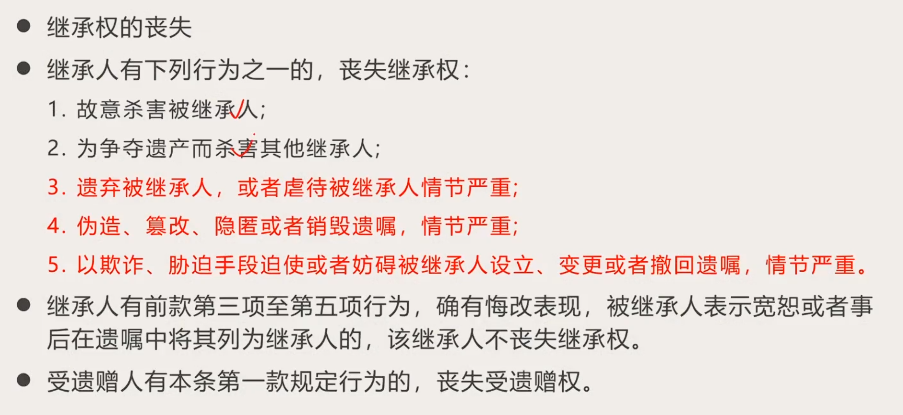
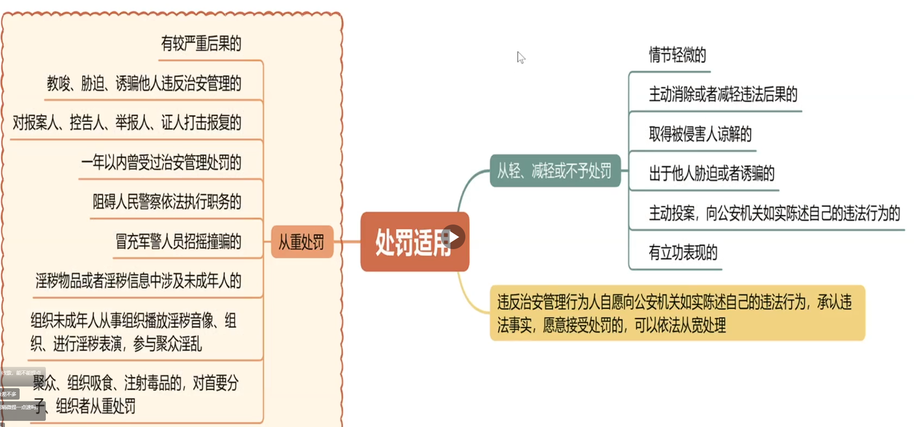
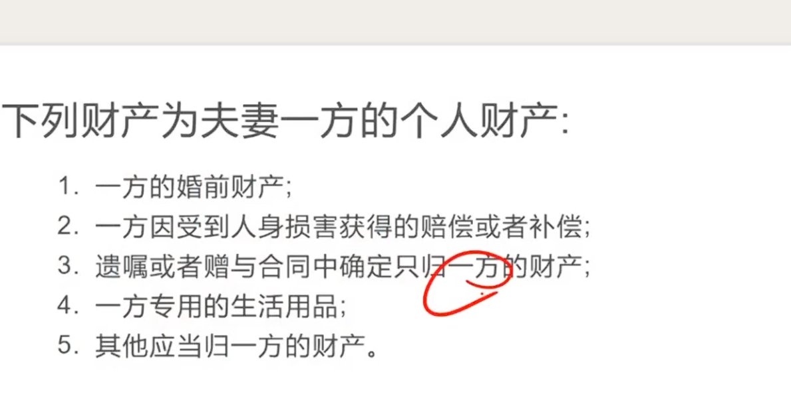

# 2026年公安第二次模考大赛

用时：76分28秒

[第183-184节 模考二 讲解](https://www.plaso.cn/livevideo/?appId=plaso&sfId=6904787b82ccab737ab313cd&oemName=jdzj&live=true#/)

### 题目1 错题<Badge type="danger" text="错题"/>
::: card title="题目 1." icon="svg-spinners:blocks-shuffle-3"

<Badge type="warning" text="单选"/>
**题干**：中国共产党第二十届中央委员会第四次全体会议，于2025年10月20日至23日在北京举行。全会审议通过了《中共中央关于制定国民经济和社会发展第十五个五年规划的建议》。全会指出，实现社会主义现代化是一个阶梯式递进、不断发展进步的历史过程，需要不懈努力、接续奋斗。全党要深刻领悟（  ）的决定性意义，保持战略定力，增强必胜信心，积极识变应变求变，敢于斗争、善于斗争，勇于面对风高浪急甚至惊涛骇浪的重大考验，以历史主动精神克难关、战风险、迎挑战，集中力量办好自己的事，续写经济快速发展和社会长期稳定两大奇迹新篇章，奋力开创中国式现代化建设新局面。

**选项**：

A， 两个确立

B， 两个维护

C， 四个全面

D， 两个大局

**参考答案**：!!A!!

**我的答案**：C

<Badge type="danger" text="答错"/>

::: collapse title="查看解析"
- **解析内容**：暂无解析
:::

### 题目2
::: card title="题目 2." icon="svg-spinners:blocks-shuffle-3"

<Badge type="warning" text="单选"/>
**题干**：全国公安厅局长座谈会2024年10月16日至17日在天津召开，中共中央书记处书记、公安部部长王小洪指出，要坚持以习近平新时代中国特色社会主义思想为指导，按照全国公安工作会议部署，以（  ）为先导，提升公安机关新质战斗力，高水平推进公安工作现代化，为推进中国式现代化提供坚强安全保障。

**选项**：

A， 新警务理念

B， 新运行模式

C， 新技术装备

D， 新管理体系

**参考答案**：!!A!!

::: collapse title="查看解析"
- **解析内容**：暂无解析
:::

### 题目3
::: card title="题目 3." icon="svg-spinners:blocks-shuffle-3"

<Badge type="warning" text="单选"/>
**题干**：王小洪部长在《人民日报》署名文章：推进国家安全体系和能力现代化指出，推进国家安全体系和能力现代化，是积极应对各类风险挑战，服务保障强国建设、民族复兴伟业的内在要求，是续写两大奇迹新篇章、有效满足人民日益增长的美好生活需要的必然举措，也是主动适应世界之变、时代之变、历史之变，完善全球安全治理的客观需要。并提出坚持把（  ）放在首要位置是总体国家安全观的核心要义

**选项**：

A， 人民安全

B， 政治安全

C， 经济安全

D， 社会安全

**参考答案**：!!B!!

::: collapse title="查看解析"
- **解析内容**：暂无解析
:::

### 题目4 错题<Badge type="danger" text="错题"/>
::: card title="题目 4." icon="svg-spinners:blocks-shuffle-3"

<Badge type="warning" text="单选"/>
**题干**：某公安机关组织召开专题学习活动，重点讨论依法治国。下列说法不正确的是（  ）

**选项**：

A， 民警甲说：“全面推进依法治国，总目标是建设中国特色社会主义法律体系，建设社会主义法治国家”

B， 民警乙说：“党的领导是社会主义法治最根本的保证，必须要把党的领导贯彻到全面依法治国全过程”

C， 民警丙说：“依法治国就是要实现科学立法、严格执法、公正司法、全民守法，促进国家治理体系和治理能力现代化。”

D， 民警丁说：“法律的权威源自人民的内心拥护和真诚信仰。公安机关作为国家治安行政力量和刑事司法力量，必须牢固树立法治信仰，做维护国家法律权威的表率”

**参考答案**：!!A!!

**我的答案**：D

<Badge type="danger" text="答错"/>

::: collapse title="查看解析"
- **解析内容**：暂无解析
:::

### 题目5
::: card title="题目 5." icon="svg-spinners:blocks-shuffle-3"

<Badge type="warning" text="单选"/>
**题干**：5．2025年是习近平法治思想提出5周年，习近平法治思想是全面依法治国的根本遵循和行动指南，下列选项不属于全面依法治国工作的“十一个坚持”的是（）

**选项**：

A， 坚持在法治轨道上推进国家治理体系和治理能力现代化

B， 坚持统筹推进国内法治和涉外法治

C， 坚持建设德才兼备的高素质法治工作队伍

D， 坚持抓住政法队伍这个“关键少数”

**参考答案**：!!D!!

::: collapse title="查看解析"
- **解析内容**：暂无解析
:::

### 题目6
::: card title="题目 6." icon="svg-spinners:blocks-shuffle-3"

<Badge type="warning" text="单选"/>
**题干**：A市公安机关在执法过程中，发现张某以营利为目的，为他人赌博提供条件，情节严重，经过调查，欲对张某作出拘留10日并处罚款5000元的行政处罚，张某要求公安机关举行听证，关于听证，下列说法正确的是（  ）

**选项**：

A， 听证由公安机关督察部门组织实施

B， 当事人要求听证的，应当在行政机关告知后七日内提出

C， 应当设两名听证员

D， 当事人可以亲自参加听证，也可以委托一至二人代理

**参考答案**：!!D!!

::: collapse title="查看解析"
- **解析内容**：暂无解析
:::

### 题目7 错题<Badge type="danger" text="错题"/>
::: card title="题目 7." icon="svg-spinners:blocks-shuffle-3"

<Badge type="warning" text="单选"/>
**题干**：《新时代政法干警“十个严禁”》划定了政法干警的思想“红线”和行为“底线”，是全国政法队伍教育整顿的重要制度成果。下列不属于“十个严禁”的内容的是（ ）

**选项**：

A， 严禁不当交往、干预执法司法

B， 严禁胡作为蛮作为、收受贿赂

C， 严禁搞两面派、做两面人

D， 严禁不作为乱作为、耍特权抖威风

**参考答案**：!!B!!

**我的答案**：C

<Badge type="danger" text="答错"/>

::: collapse title="查看解析"
- **解析内容**：暂无解析
:::

### 题目8 错题<Badge type="danger" text="错题"/>
::: card title="题目 8." icon="svg-spinners:blocks-shuffle-3"

<Badge type="warning" text="单选"/>
**题干**：为加强队伍正规化建设、提升队伍管理水平，江丰县公安局古乐派出所改扩建过程中，升级视频监控系统，加强执法监督。民警张某负责视频资料的收集与保管，按规定对所内不同区域的视频监控资料设置不同保存时间。以下地点的视频监控资料保存时间不少于九十日的是：（  ）

**选项**：

A， 值班室

B， 户籍室

C， 档案室

D， 办公室

**参考答案**：!!A!!

**我的答案**：C

<Badge type="danger" text="答错"/>

::: collapse title="查看解析"
- **解析内容**：暂无解析
:::

### 题目9
::: card title="题目 9." icon="svg-spinners:blocks-shuffle-3"

<Badge type="warning" text="单选"/>
**题干**：在一起案件中，主审法官认为，生产假化肥案件中的“假化肥”不属于《刑法》第140条规定的“生产者、销售者在产品中掺杂、掺假，以假充真，以次充好或者以不合格产品冒充合格产品”中的“产品”范畴，因为《刑法》第147条对“生产假农药、假兽药、假化肥”有专门规定。关于该案，法官采用的法律解释方法属于下列哪一种？（  ）

**选项**：

A， 比较解释

B， 历史解释

C， 体系解释

D， 目的解释

**参考答案**：!!C!!

::: collapse title="查看解析"
- **解析内容**：暂无解析
:::

### 题目10
::: card title="题目 10." icon="svg-spinners:blocks-shuffle-3"

<Badge type="warning" text="单选"/>
**题干**：近期，无人驾驶汽车在公共交通道路行驶引起了热议，公众围绕无人驾驶汽车是否违法、事故后是否担责、如何加强立法进行规范展开讨论，下列说法正确的是（  ）

**选项**：

A， 若无人驾驶汽车上路行驶引发民事纠纷诉至法院，因法无明文规定，法院不得裁判

B， 科技发展引发的问题只能通过法律解决

C， 现行交通法规对无人驾驶汽车上路行驶尚无规定，这反映了法律的局限性

D， 只有当科技发展造成了实际危害后果时，才能动用法律手段干预

**参考答案**：!!C!!

::: collapse title="查看解析"
- **解析内容**：暂无解析
:::

### 题目11
::: card title="题目 11." icon="svg-spinners:blocks-shuffle-3"

<Badge type="warning" text="单选"/>
**题干**：证人的角色至关重要，他们提供的信息和证言能够影响案件的结果。证人往往面临来自被告或其他相关人员的威胁、报复或骚扰。下列案件中公安机关应当依职权主动提供人身保护的是（ ）。

**选项**：

A， 故意伤害案中犯罪嫌疑人不断叫嚣报复受害人

B， 黑社会性质犯罪案件中被判死刑的犯罪嫌疑人家属声称要对受害人女友报复

C， 毒贩张某听说李某准备要举报自己，让人传话若李某举报则对其下手

D， 毒贩王某被抓住后让律师告知小弟将证人赵某杀死

**参考答案**：!!D!!

::: collapse title="查看解析"
- **解析内容**：暂无解析
:::

### 题目12
::: card title="题目 12." icon="svg-spinners:blocks-shuffle-3"

<Badge type="warning" text="单选"/>
**题干**：《中华人民共和国香港特别行政区基本法》规定，香港特别行政区应自行立法禁止危害国家安全的行为。香港特别行政区政府从2024年1月30日起，开始为期一个月的“香港基本法第二十三条”立法公众咨询。根据我国《宪法》及其他相关法律规定，下列选项不正确的是（ ）

**选项**：

A， 宪法和香港特别行政区基本法共同构成香港特别行政区的宪制基础，赋予中央对香港特别行政区全面管治权

B， 维护国家主权、统一和领土完整是香港特别行政区的宪制责任

C， 香港特别行政区基本法赋予香港特别行政区高度自治权

D， 香港特别行政区本地法律规定与《中华人民共和国香港特别行政区维护国家安全法》不一致的，适用本地法律规定

**参考答案**：!!D!!

::: collapse title="查看解析"
- **解析内容**：暂无解析
:::

### 题目13
::: card title="题目 13." icon="svg-spinners:blocks-shuffle-3"

<Badge type="warning" text="单选"/>
**题干**：我国《宪法》规定，国务院是最高国家权力机关的执行机关，是最高国家行政机关，应在法律规定的范围内行使职权。下列选项中属于国务院职权的是（ ）

**选项**：

A， 宣布进入紧急状态

B， 规定行政措施

C， 任免国务院的组成人员

D， 授予国家的勋章和荣誉称号

**参考答案**：!!B!!

::: collapse title="查看解析"
- **解析内容**：暂无解析
:::

### 题目14 错题<Badge type="danger" text="错题"/>
::: card title="题目 14." icon="svg-spinners:blocks-shuffle-3"

<Badge type="warning" text="单选"/>
**题干**：某派出所民警接到举报，发现某小区居民张某为某卖淫女刘某提供场地供其卖淫，民警经过调查取证后决定对其进行治安管理处罚，张某辩称其并未营利不应处罚。公安机关依旧对其实施处罚。这体现了公安机关权力的（  ）

**选项**：

A， 强制性

B， 有限性

C， 单向性

D， 责任性

**参考答案**：!!C!!

**我的答案**：A

<Badge type="danger" text="答错"/>

::: collapse title="查看解析"
- **解析内容**：暂无解析
:::

### 题目15 错题<Badge type="danger" text="错题"/>
::: card title="题目 15." icon="svg-spinners:blocks-shuffle-3"

<Badge type="warning" text="单选"/>
**题干**：依据《公安机关处置群体性事件规定》，对于处理群体性事件的总体原则，下列说法不正确的是（  ）

**选项**：

A， 公安机关统一领导的原则

B， 防止矛盾激化的原则

C， 预防为主的原则

D， 慎用警力、慎用强制措施和慎用武器警械的原则

**参考答案**：!!A!!

**我的答案**：C

<Badge type="danger" text="答错"/>

::: collapse title="查看解析"
- **解析内容**：暂无解析
:::

### 题目16
::: card title="题目 16." icon="svg-spinners:blocks-shuffle-3"

<Badge type="warning" text="单选"/>
**题干**：高空抛物危害性大，社会关注度高，《刑法》和《民法典》均对高空抛物的有关法律责任作出规定。下列说法不正确的是（ ）

**选项**：

A， 公安等机关应当依法及时调查，查清责任人

B， 未能查明具体侵权人时，由全楼居民共同补偿被侵权人

C， 从建筑物中抛掷物品造成他人损害的，侵权人依法承担责任

D， 物业未采取必要安全保障措施防止高空抛物，应承担相关的侵权责任

**参考答案**：!!B!!

::: collapse title="查看解析"
- **解析内容**：暂无解析
:::

### 题目17
::: card title="题目 17." icon="svg-spinners:blocks-shuffle-3"

<Badge type="warning" text="单选"/>
**题干**：小张从小天赋异禀，聪明伶俐。爷爷老张对孙子甚是喜爱。在小张6岁时，爷爷将家中祖传的一幅价值200万元的名画赠与小张。母亲刘某得知此事后，坚决表示反对。在小张8岁那年，爷爷又将自己价值27500元的欧米茄手表赠与小张。母亲刘某亦明确表示反对。关于本案，下列哪一说法是正确的？（  ）

**选项**：

A， 爷爷将名画赠与小张的行为因纯获利益而有效

B， 爷爷将名画赠与小张的行为因母亲刘某反对而无效

C， 爷爷将手表赠与小张的行为因纯获利益而有效

D， 爷爷将手表赠与小张的行为因母亲刘某反对而无效

**参考答案**：!!C!!

::: collapse title="查看解析"
- **解析内容**：暂无解析
:::

### 题目18 错题<Badge type="danger" text="错题"/>
::: card title="题目 18." icon="svg-spinners:blocks-shuffle-3"

<Badge type="warning" text="单选"/>
**题干**：公安局依法对涉嫌扰乱单位秩序的行为人甲某作出罚款200元的治安管理处罚并作出处罚决定书，向甲某送达，甲某拒绝接受。下列说法不正确的是（  ）

**选项**：

A， 应当在处罚决定宣告后当场交付甲某

B， 甲某拒绝接受的，公安机关应当在作出治安管理处罚决定的7日内送达

C， 送达法律文书可以直接交给受送达人本人，也可以间接送达

D， 无法直接送达的，邮寄送达，或者公告送达

**参考答案**：!!B!!

**我的答案**：C

<Badge type="danger" text="答错"/>

::: collapse title="查看解析"
- **解析内容**：暂无解析
:::

### 题目19
::: card title="题目 19." icon="svg-spinners:blocks-shuffle-3"

<Badge type="warning" text="单选"/>
**题干**：甲县公安局某派出所民警钱某在办理一起治安案件时，隐匿了与一方当事人的亲属关系，并作出了不公正的处罚决定，下列说法错误的是：

**选项**：

A， 另一方当事人或者其法定代理人有权要求钱某回避

B， 当事人对处罚结果不服的，可以向甲县人民政府申请行政复议

C， 上级公安机关发现本案处罚决定有错误的，有权予以撤销或者变更

D， 应当由督查部门对执法民警进行执法过错责任认定

**参考答案**：!!D!!

::: collapse title="查看解析"
- **解析内容**：暂无解析
:::

### 题目20
::: card title="题目 20." icon="svg-spinners:blocks-shuffle-3"

<Badge type="warning" text="单选"/>
**题干**：某国驻华武官杰克酒后殴打陈某，办案公安机关应当将其身份证件及违法行为等基本情况记录在案，保存好有关证据，并尽快将有关情况层报（  ）

**选项**：

A， 公安部

B， 省级公安机关

C， 市级公安机关

D， 省级人民政府

**参考答案**：!!B!!

::: collapse title="查看解析"
- **解析内容**：暂无解析
:::

### 题目21 错题<Badge type="danger" text="错题"/>
::: card title="题目 21." icon="svg-spinners:blocks-shuffle-3"

<Badge type="warning" text="单选"/>
**题干**：9月23日22时18分，美好社区第四网格的居民在“微邻里”实名认证网格群反映，有电动车报警器未关，影响大家休息！有居民不耐烦地说：“这人这么没公德心，一脚踢烂算了。”更有居民往楼下扔东西表达不满，险些伤到人。收到消息，网格员第一时间报警。民警采取处理措施顺序最恰当的是（ ）。 ①积极沟通此区域的门栋长，请他帮助进行处理 ②请网格员安抚居民因被打扰而产生的不满情绪 ③及时联系车主，要求车主关掉电动车的报警器 ④张贴告示对往楼下扔东西的行为进行批评教育 ⑤把处理电动车报警器扰民结果反馈到“微邻里”

**选项**：

A， ②①③⑤④

B， ②③①④⑤

C， ④③①⑤②

D， ④①②③⑤

**参考答案**：!!A!!

**我的答案**：B

<Badge type="danger" text="答错"/>

::: collapse title="查看解析"
- **解析内容**：暂无解析
:::

### 题目22
::: card title="题目 22." icon="svg-spinners:blocks-shuffle-3"

<Badge type="warning" text="单选"/>
**题干**：情报流程/循环是情报工作的映射，实质是情报工作环节，下列关于情报流程环节正确的排序是（ ）。

**选项**：

A， 规划指导→情报收集→情报传递→情报整理→情报分析→评估反馈

B， 规划指导→情报收集→情报整理→情报分析→情报传递→评估反馈

C， 规划指导→情报收集→情报分析→情报整理→情报传递→评估反馈

D， 情报收集→情报分析→情报整理→规划指导→情报传递→评估反馈

**参考答案**：!!B!!

::: collapse title="查看解析"
- **解析内容**：暂无解析
:::

### 题目23 错题<Badge type="danger" text="错题"/>
::: card title="题目 23." icon="svg-spinners:blocks-shuffle-3"

<Badge type="warning" text="单选"/>
**题干**：依据《中共中央关于全面推进依法治国若干重大问题的决定》，要增强全民法治观念，推进法治社会建设，引导全民自觉守法、遇事找法、解决问题靠法。推动全社会树立法治意识的关键，下列选项正确的是（  ）

**选项**：

A， 完善国家工作人员学法用法制度

B， 完善中国特色社会主义法律体系

C， 把法治教育纳入国民教育体系

D， 领导干部带头学法、模范守法

**参考答案**：!!D!!

**我的答案**：B

<Badge type="danger" text="答错"/>

::: collapse title="查看解析"
- **解析内容**：暂无解析
:::

### 题目24
::: card title="题目 24." icon="svg-spinners:blocks-shuffle-3"

<Badge type="warning" text="单选"/>
**题干**：小王向刚入警的张某借穿警服，在闹市区招摇、炫耀一番，还敞怀摆拍留念，然后把警服还给了张某。小王把这些照片发布在微博上，引来网友大量转发和议论，损害了人民警察的形象。对此，可给予张某的处分是（  ）

**选项**：

A， 警告或记过处分

B， 记大过处分

C， 降级处分

D， 撤职处分

**参考答案**：!!A!!

::: collapse title="查看解析"
- **解析内容**：暂无解析
:::

### 题目25
::: card title="题目 25." icon="svg-spinners:blocks-shuffle-3"

<Badge type="warning" text="单选"/>
**题干**：甲明知乙意图杀人，仍为乙提供了足以致死的毒药。但是第二天，甲有些后悔，便向乙索回毒药，遭到乙的拒绝，乙于当天晚上投毒杀人得逞。甲的行为应当认定为（  ）

**选项**：

A， 犯罪预备

B， 犯罪未遂

C， 犯罪中止

D， 犯罪既遂

**参考答案**：!!D!!

::: collapse title="查看解析"
- **解析内容**：暂无解析
:::

### 题目26
::: card title="题目 26." icon="svg-spinners:blocks-shuffle-3"

<Badge type="warning" text="单选"/>
**题干**：甲盗取李某的身份证及一张信用卡，对妻子乙谎称是在路上拾得的。甲与乙根据身份证号码试出了信用卡密码，持该卡共消费4万元。下列选项中，说法正确的是（  ）

**选项**：

A， 甲与乙构成盗窃罪

B， 甲与乙构成信用卡诈骗罪

C， 甲构成盗窃罪，乙构成信用卡诈骗罪

D， 甲构成信用卡诈骗罪，乙属于不当得利

**参考答案**：!!C!!

::: collapse title="查看解析"
- **解析内容**：暂无解析

:::

### 题目27 错题<Badge type="danger" text="错题"/>
::: card title="题目 27." icon="svg-spinners:blocks-shuffle-3"

<Badge type="warning" text="单选"/>
**题干**：2022年7月18日上午，张某（男，20岁）与赵某（男，22岁）在观看某大学篮球比赛时就一球员是否犯规的问题产生争执。张某怀恨在心，下午入场观看比赛时违反规定，在场内燃放烟花爆竹，故意扰乱体育比赛秩序，围观群众纷纷报警，甲县公安局民警迅速赶到现场，但违法行为人张某已趁乱离开。下列民警对张某进行传唤时，做法正确的是（ ）

**选项**：

A， 至张某家中，口头传唤其到甲县公安局接受调查

B， 为获取案件相关证言，经公安机关办案部门负责人批准，使用传唤证将赵某传唤至公安机关询问

C， 将传唤张某的原因和处所通知其家属

D， 若张某无正当理由拒不接受传唤，公安机关应当直接将其拘传到案

**参考答案**：!!C!!

**我的答案**：B

<Badge type="danger" text="答错"/>

::: collapse title="查看解析"
- **解析内容**：暂无解析
:::

### 题目28 错题<Badge type="danger" text="错题"/>
::: card title="题目 28." icon="svg-spinners:blocks-shuffle-3"

<Badge type="warning" text="单选"/>
**题干**：公安机关是政府的一个职能部门，依法管理社会治安，行使国家的行政权，同时公安机关又依法侦查刑事案件，行使国家的司法权。下列属于公安机关职责的是（  ）

**选项**：

A， 民警接到家暴案件，及时出警制止，并对于严重家暴者可以出具《人身安全保护令》

B， 张某因犯罪被判处一年的管制，公安机关负责执行该刑罚

C， 公安民警对不能辨认和控制自己行为的暴力精神病人进行保护性约束后决定强制医疗

D， 对家庭暴力情节较轻，依法不给予治安管理处罚的进行批评教育或者出具告诫书

**参考答案**：!!D!!

**我的答案**：B

<Badge type="danger" text="答错"/>

::: collapse title="查看解析"
- **解析内容**：暂无解析
:::

### 题目29
::: card title="题目 29." icon="svg-spinners:blocks-shuffle-3"

<Badge type="warning" text="单选"/>
**题干**：在全面推进依法治国，建设社会主义法治国家，促进国家治理体系和治理能力现代化的过程中，我们应当坚持的是（ ）

**选项**：

A， 法治国家、法治政府、法治社会一体建设

B， 法治政府、法治社区、法治公民一体建设

C， 法治国家、法治社会、法治公民一体建设

D， 法治政府、法治社会、法治公民一体建设

**参考答案**：!!A!!

::: collapse title="查看解析"
- **解析内容**：暂无解析
:::

### 题目30
::: card title="题目 30." icon="svg-spinners:blocks-shuffle-3"

<Badge type="warning" text="单选"/>
**题干**：公安机关侦查犯罪应当严格依照法律规定的条件和程序采取强制措施和侦查措施。下列关于侦查工作的说法正确的是（ ）

**选项**：

A， 某县公安局刑警大队办理贾某强奸案时，由于贾某拒绝采集血液、尿液等生物样本，经刑警大队长批准，可以强制采集

B， 某县公安局对某凶杀现场进行勘验后，该县检察院要求复验的，应当会同检察院进行复验

C， 某县公安局在办理刘某死亡案件时，由于刘某死因不明，决定对其身体进行解剖检验，应当经刘某家属同意

D， 某县公安局办理徐某故意杀人案，因徐某在逃，可以在该县范围内直接发布通缉令，并决定采取必要的技术侦查措施

**参考答案**：!!A!!

::: collapse title="查看解析"
- **解析内容**：暂无解析
:::

### 题目31
::: card title="题目 31." icon="svg-spinners:blocks-shuffle-3"

<Badge type="warning" text="单选"/>
**题干**：法律是社会秩序的基石。治安管理处罚法的修订，进一步完善处罚措施和幅度，适应治安管理新形势新要求，应对治安管理新情况新问题，补充一些治安管理领域的违法行为，将治安管理工作中一些好的理念、机制和做法通过法律形式予以确认和固定，与时俱进完善相关制度。下列关于治安管理处罚说法正确的是（  ）

**选项**：

A， 尚未完全丧失辨认或者控制自己行为能力的精神病人、智力残疾人违反治安管理的，应当从轻或者减轻处罚。

B， 违反治安管理行为人自愿向公安机关如实陈述自己的违法行为，承认违法事实，愿意接受处罚的，应当依法从宽处理

C， 公安机关对与违反治安管理行为有关的场所或者违反治安管理行为人的人身、物品可以进行检查。检查时，人民警察不得少于二人，检查妇女的身体，应当由女性工作人员或者医师进行

D， 被处罚人、被侵害人对公安机关依法做出的收缴、追缴决定，不服的，可以提出复议，并对复议决定不服的，向上一级公安机关申请复核

**参考答案**：!!C!!

::: collapse title="查看解析"
- **解析内容**：暂无解析
:::

### 题目32 错题<Badge type="danger" text="错题"/>
::: card title="题目 32." icon="svg-spinners:blocks-shuffle-3"

<Badge type="warning" text="单选"/>
**题干**：习近平总书记强调公安机关要推行扁平化管理，把机关做精、把警种做优、把基层做强、把基础做实，加快构建职能科学、事权清晰、指挥顺畅、运行高效的公安机关机构职能体系。根据公安工作特点，公安工作在战略战役部署与实施、法制与政策的结合、多部门横向协同等方面，应（  ）。

**选项**：

A， 集中与分散相结合

B， 强调分散

C， 强调高度统一

D， 根据具体情况决定集中或分散

**参考答案**：!!C!!

**我的答案**：A

<Badge type="danger" text="答错"/>

::: collapse title="查看解析"
- **解析内容**：暂无解析
:::

### 题目33
::: card title="题目 33." icon="svg-spinners:blocks-shuffle-3"

<Badge type="warning" text="单选"/>
**题干**：现代科学技术为公安工作注入了新的发展动力，但专门机关与广大群众相结合仍然是公安机关必须始终坚持的基本方针。公安机关的下列举措中，能体现这一基本方针的是（ ）

**选项**：

A， 在加强智慧警务建设的同时大力发展平安类志愿组织

B， 以智能安防为依托，推行“封闭式”小区建设

C， 加强与检法部门协同快侦快破快审电信网络诈骗案件

D， 推行“跑零次”改革，努力实现群众关心的“一网通办”事项

**参考答案**：!!A!!

::: collapse title="查看解析"
- **解析内容**：暂无解析
:::

### 题目34 错题<Badge type="danger" text="错题"/>
::: card title="题目 34." icon="svg-spinners:blocks-shuffle-3"

<Badge type="warning" text="单选"/>
**题干**：某日，东水市某公安检查站民警小张在巡查时发现安检通道内一名男子形迹可疑，上前盘查时该名男子转身欲逃离，小张遂与同事将该男子控制。经查，该男子为某盗窃案网上在逃人员。对于该信息的上报，下列选项不正确的是（ ）

**选项**：

A， 向检查站值班领导报告

B， 向当地的情指中心报告

C， 向检查站综合指挥室报告

D， 向侦办该案的公安机关报告

**参考答案**：!!D!!

**我的答案**：A

<Badge type="danger" text="答错"/>

::: collapse title="查看解析"
- **解析内容**：暂无解析
:::

### 题目35 错题<Badge type="danger" text="错题"/>
::: card title="题目 35." icon="svg-spinners:blocks-shuffle-3"

<Badge type="warning" text="单选"/>
**题干**：某日傍晚，胡某与朋友聚会饮酒后驾车回家，路遇民警检查酒驾，胡某心虚，拒不配合民警进行酒精测试，并与执勤民警发生言语冲突，引起大量群众围观。为尽快脱身，胡某从车辆后备箱拿出状似炸药包的物体并扬言如不放其离去就引爆炸药，围观群众恐慌逃离，所幸执勤民警迅速控制胡某，未造成人员伤亡。此时胡某逐渐清醒，主动交代其手中为形状相似的电子玩具，现民警欲依照《治安管理处罚法》对胡某作出处罚，其行为构成（ ）

**选项**：

A， 扰乱公共秩序的违法行为

B， 妨害公共安全的违法行为

C， 妨害社会管理的违法行为

D， 寻衅滋事违法行为

**参考答案**：!!A!!

**我的答案**：D

<Badge type="danger" text="答错"/>

::: collapse title="查看解析"
- **解析内容**：暂无解析
:::

### 题目36 错题<Badge type="danger" text="错题"/>
::: card title="题目 36." icon="svg-spinners:blocks-shuffle-3"

<Badge type="warning" text="单选"/>
**题干**：某县居民周某因邻居李某在楼道乱扔垃圾发送口角，在争执中周某将李某鼻梁骨打断，报警后经鉴定为轻伤。公安机关在考虑到双方系邻居且和解意愿明显，组织双方进行和解，下列关于公安机关处理该案件表述不正确的是（  ）

**选项**：

A， 公安机关组织双方和解时可以听取双方当事人亲属、当地居民委员会以及其他了解案件情况的相关人员的意见

B， 双方达成和解的，公安机关应当主持制作和解协议书，并由双方当事人及其他参加人员签名

C， 对达成和解协议的案件，经县公安局局长批准，公安机关将案件移送人民检察院审查起诉时，应当提出从宽处理的建议

D， 如果双方达成和解协议的情况下，李某提起附带民事诉讼的，应当由李某撤回附带民事诉讼

**参考答案**：!!C!!

**我的答案**：D

<Badge type="danger" text="答错"/>

::: collapse title="查看解析"
- **解析内容**：暂无解析
:::

### 题目37
::: card title="题目 37." icon="svg-spinners:blocks-shuffle-3"

<Badge type="warning" text="单选"/>
**题干**：法治是中国式现代化的重要保障，法律是治国理政最大最重要的规矩。法具有与道德、纪律、宗教等其他社会规范的共性是(   　 )

**选项**：

A， 国家意志性

B， 国家强制性

C， 规范性

D， 普遍性

**参考答案**：!!C!!

::: collapse title="查看解析"
- **解析内容**：暂无解析
:::

### 题目38 错题<Badge type="danger" text="错题"/>
::: card title="题目 38." icon="svg-spinners:blocks-shuffle-3"

<Badge type="warning" text="单选"/>
**题干**：为进一步加大对酒驾醉驾等重点交通违法行为的严管高压态势，切实保障人民群众生命财产安全，近日A县公安局交警大队在辖区全面开展冬季交通秩序整治“夜查”统一行动。1月25日晚，交警小孙、小马等六人在胜利路附近设卡时，拦停了一辆白色面包车，拟对车辆和车内人员进行检查，则下列做法正确的是（ ）

**选项**：

A， 从白色面包车车头正前方接近车辆

B， 责令司机熄火拉手刹，双手平放在大腿上

C， 让车上人员逐一下车接受盘查

D， 在发现车内人员丁某系一起诈骗案逃犯后，立即控制丁某并扣押车上所有人的随身物品

**参考答案**：!!C!!

**我的答案**：B

<Badge type="danger" text="答错"/>

::: collapse title="查看解析"
- **解析内容**：暂无解析
:::

### 题目39
::: card title="题目 39." icon="svg-spinners:blocks-shuffle-3"

<Badge type="warning" text="单选"/>
**题干**：卢某因违反《中华人民共和国治安管理处罚法》被甲市乙区丙派出所当场作出罚款200元的治安处罚。作为行政相对人，卢某为维护合法权益，应当采取的合法途径是（ ）

**选项**：

A， 卢某先向乙区公安局申请行政复议，对复议决定不服的，再向市公安局复核

B， 卢某可以直接向区人民法院提起行政诉讼

C， 卢某可以向区人民法院提起行政诉讼，对诉讼结果不服的，再提起行政复议

D， 卢某应先向区人民政府提起行政复议，对复议决定不服的，再提起行政诉讼

**参考答案**：!!D!!

::: collapse title="查看解析"
- **解析内容**：暂无解析
:::

### 题目40
::: card title="题目 40." icon="svg-spinners:blocks-shuffle-3"

<Badge type="warning" text="单选"/>
**题干**：孙某欲开办旅馆，向县公安局申请《旅馆业特种行业许可证》，民警在审查材料时发现孙某提供虚假材料。根据《中华人民共和国行政许可法》规定，公安机关的下列做法正确的是：（  ）

**选项**：

A， 不予受理孙某申请

B， 对孙某作出在一年内不得再次申请该行政许可的决定

C， 不予行政许可并对孙某给予警告

D， 对孙某给予警告

**参考答案**：!!C!!

::: collapse title="查看解析"
- **解析内容**：暂无解析
:::

### 题目41
::: card title="题目 41." icon="svg-spinners:blocks-shuffle-3"

<Badge type="warning" text="单选"/>
**题干**：民警马某在巡逻时，遇甲乙二人因交通事故发生激烈争执，即前往处置。在处置过程中，甲对民警的处理不服，见民警身材瘦弱，遂摘下头盔击打了民警头部，民警最佳的应对方法是（ ）

**选项**：

A， 迅速近身搂摔甲，不让其有再次击打距离

B， 迅速用腿蹬踹甲，发挥腿长优势防备挨打

C， 迅速后撤离开甲，保持距离使用警械具震慑

D， 迅速组织周边人，求助群众合作制服违法者

**参考答案**：!!C!!

::: collapse title="查看解析"
- **解析内容**：暂无解析
:::

### 题目42 错题<Badge type="danger" text="错题"/>
::: card title="题目 42." icon="svg-spinners:blocks-shuffle-3"

<Badge type="warning" text="单选"/>
**题干**：胡某因违法被甲市公安局乙分局依法处5日治安拘留。胡某不服，向甲市公安局申请行政复议，甲市公安局维持原决定。胡某向人民法院提起行政诉讼的同时附带提起国家赔偿诉讼，人民法院依法撤销治安拘留决定。赔偿义务机关是（ ）

**选项**：

A， 甲市公安局

B， 甲市公安局乙分局

C， 甲市公安局和甲市公安局乙分局

D， 人民法院

**参考答案**：!!B!!

**我的答案**：A

<Badge type="danger" text="答错"/>

::: collapse title="查看解析"
- **解析内容**：暂无解析
:::

### 题目43 错题<Badge type="danger" text="错题"/>
::: card title="题目 43." icon="svg-spinners:blocks-shuffle-3"

<Badge type="warning" text="单选"/>
**题干**：根据《宪法》和法律的规定，下列表述错误的是（  ）

**选项**：

A， 全国人大代表在全国人民代表大会和全国人民代表大会常务委员会各种会议上的发言和表决，不受法律追究。

B， 在全国人大闭会期间，全国人大代表未经选举单位人大常委会批准，不受逮捕

C， 全国人大代表受原选举单位的监督

D， 全国人大代表在全国人民代表大会开会期间，有权提出对国务院或者国务院各部、各委员会的质询案

**参考答案**：!!B!!

**我的答案**：A

<Badge type="danger" text="答错"/>

::: collapse title="查看解析"
- **解析内容**：暂无解析
:::

### 题目44 错题<Badge type="danger" text="错题"/>
::: card title="题目 44." icon="svg-spinners:blocks-shuffle-3"

<Badge type="warning" text="单选"/>
**题干**：下图为某传销组织人员结构示意图。从该图可以分析出此传销组织中最核心的人物是（    ）

**选项**：

A， 张一

B， 王二

C， 孙一

D， 秦九

**参考答案**：!!D!!

**我的答案**：B

<Badge type="danger" text="答错"/>

::: collapse title="查看解析"
- **解析内容**：暂无解析
:::

### 题目45
::: card title="题目 45." icon="svg-spinners:blocks-shuffle-3"

<Badge type="warning" text="单选"/>
**题干**：某县公安局经侦大队侦办光X公司涉嫌非法吸收公众存款案，案件侦查终结移送审查起诉时需要确定光X公司的住所地，光X公司主要办事机构和主要业务范围所在地分别为潘东县和丹华县，法定代表人户籍所地在和实际居住地分别为米丹县和居华县。下列选项中，应当作为光X公司住所地的是（ ）

**选项**：

A， 潘东县

B， 丹华县

C， 米丹县

D， 居华县

**参考答案**：!!A!!

::: collapse title="查看解析"
- **解析内容**：暂无解析
:::

### 题目46
::: card title="题目 46." icon="svg-spinners:blocks-shuffle-3"

<Badge type="warning" text="单选"/>
**题干**：根据我国《反有组织犯罪法》的规定，公安机关核查黑社会性质组织犯罪线索，发现涉案财产有灭失、转移的紧急风险的，经设区的市级以上公安机关负责人批准后，可以对有关涉案财产采取（ ）的紧急措施，期限不得超过四十八小时。

**选项**：

A， 冻结

B， 紧急止付

C， 扣押

D， 查封

**参考答案**：!!B!!

::: collapse title="查看解析"
- **解析内容**：暂无解析
:::

### 题目47 错题<Badge type="danger" text="错题"/>
::: card title="题目 47." icon="svg-spinners:blocks-shuffle-3"

<Badge type="warning" text="单选"/>
**题干**：某日，东方派出所收到群众匿名举报线索，该辖区阳光家园小区居民因冬季屋内取暖温度低，私下聚集40余人要到热电公司“送锦旗、讨说法”，东方派出所迅速汇报上级，指令精干警力到居民家中做思想工作，经过良性沟通，小区居民取消了讨说法活动。通过此事件，反映出公安机关处理群体性事件的哪项原则？（ ）

**选项**：

A， 慎用警力

B， 教育疏导

C， 预防为主

D， 依法果断处置

**参考答案**：!!C!!

**我的答案**：B

<Badge type="danger" text="答错"/>

::: collapse title="查看解析"
- **解析内容**：暂无解析
:::

### 题目48
::: card title="题目 48." icon="svg-spinners:blocks-shuffle-3"

<Badge type="warning" text="单选"/>
**题干**：2023年11月，张某回到家中发现家里被盗，便向公安机关报案。经公安机关初步侦查，发现赵某有重大作案嫌疑。11月9日，公安机关对赵某进行传唤，11月15日公安机关向赵某送达监视居住决定书，11月25日公安机关口头宣布解除监视居住并未做任何结论。赵某不服，向人民法院提起行政诉讼，人民法院应（  ）

**选项**：

A， 判决赵某无罪

B， 裁定不予受理

C， 移交公安机关法制部门

D， 移送刑庭处理

**参考答案**：!!B!!

::: collapse title="查看解析"
- **解析内容**：暂无解析
:::

### 题目49
::: card title="题目 49." icon="svg-spinners:blocks-shuffle-3"

<Badge type="warning" text="单选"/>
**题干**：下面是河西市公安局甲、乙派出所2022年4月的日立案频次分布图，依据图中信息，下列说法不正确的是（  ）

**选项**：

A， 甲派出所4月份的立案总数比乙派出所多

B， 乙派出所4月份日立案数为3起的天数是10天

C， 甲派出所4月份共有10天日立案数是6起

D， 乙派出所4月份日立案数大于3起的天数比甲派出所多

**参考答案**：!!D!!

::: collapse title="查看解析"
- **解析内容**：暂无解析
:::

### 题目50 错题<Badge type="danger" text="错题"/>
::: card title="题目 50." icon="svg-spinners:blocks-shuffle-3"

<Badge type="warning" text="单选"/>
**题干**：某广场发生一起持刀砍人案件，现场有人重伤，民警警告无效后开枪射击，击中嫌疑人，并上铐控制住嫌疑人，同时迅速用三条警戒带设置了三重警戒区域，分别为A、B和C三个区域。为了保护现场，结合下图，选项正确的是（ ）

**选项**：

A， 将现场指挥部设在C区

B， 将救护车辆停在B区

C， 若接受采访，将新闻媒体接待点设在D区

D， 将技术勘查车辆停在A区

**参考答案**：!!B!!

**我的答案**：D

<Badge type="danger" text="答错"/>

::: collapse title="查看解析"
- **解析内容**：暂无解析
- 
- 
:::

### 题目51 错题<Badge type="danger" text="错题"/>
::: card title="题目 51." icon="svg-spinners:blocks-shuffle-3"

<Badge type="warning" text="单选"/>
**题干**：王小洪要求，要深化政治建警，筑牢政治忠诚，在任何时候任何情况下都要坚决听从习近平总书记命令、服从党中央指挥。要锲而不舍落实中央八项规定精神，深入纠治群众身边的不正之风。要切实把纪律建设摆在更加突出位置，让每一名民警都感受到纪律无处不在、监督就在身边。下列选项不属于违反公安民警政治纪律的是（  ）

**选项**：

A， 民警参加派性活动，对抗组织安排，不接受组织领导

B， 某民警因对单位未能按时发放相关补贴，组织单位部分民警罢工

C， 某公安局领导在单位的关键岗位安插亲信，任人唯亲

D， 某民警收受他人贿赂，为犯罪嫌疑人违规办理取保候审

**参考答案**：!!A C D!!

**我的答案**：C D

<Badge type="danger" text="答错"/>

::: collapse title="查看解析"
- **解析内容**：暂无解析
:::

### 题目52
::: card title="题目 52." icon="svg-spinners:blocks-shuffle-3"

<Badge type="warning" text="单选"/>
**题干**：某市公安局交警支队打算在互联网开展一起关于驾驶机动车犯罪的普法宣传。在搜集相关案例时，民警对下列关于驾驶机动车行为定性不正确的是（  ）

**选项**：

A， 张某在道路上飙车，闯红灯时撞死2名行人，构成危险驾驶罪

B， 王某驾驶私家车，严重超过规定时速行驶并超载，其行为构成危险驾驶罪

C， 许某吸食毒品后驾驶机动车，其行为构成危险驾驶罪

D， 刘某驾车走非机动车道，将1名骑自行车的人撞倒，为逃避法律责任，开车将该人带至郊区抛弃，致使其因治疗不及时死亡，刘某构成交通肇事罪

**参考答案**：!!A B C D!!

::: collapse title="查看解析"
- **解析内容**：暂无解析
:::

### 题目53 错题<Badge type="danger" text="错题"/>
::: card title="题目 53." icon="svg-spinners:blocks-shuffle-3"

<Badge type="warning" text="单选"/>
**题干**：陈某与黄某原系夫妻，2019年1月因家庭矛盾离婚，儿子小宝（三岁）由黄某抚养。后黄某搬离原居住地至某市居住，并对陈某隐瞒行踪且更换了手机号码。陈某数月无法探望儿子，后经多方打听得知黄某在某市购买了住房并将户籍迁移至此，但仍未寻得其具体下落。陈某因此向某市公安机关申请公开黄某的详细户籍地址。下列说法正确的有（ ）

**选项**：

A， 黄某的户籍信息属于我国民法中人格权的保护客体

B， 我国民法保护各类民事主体的个人信息权

C， 取得个人信息应当遵循合法、正当、必要原则

D， 某市公安机关可以向陈某公开黄某的详细户籍地址

**参考答案**：!!A C D!!

**我的答案**：B C

<Badge type="danger" text="答错"/>

::: collapse title="查看解析"
- **解析内容**：暂无解析
:::

### 题目54
::: card title="题目 54." icon="svg-spinners:blocks-shuffle-3"

<Badge type="warning" text="单选"/>
**题干**：“时代楷模”马善祥三十多年如一日从事人民调解工作，探索出颇有成效服务群众的“老马工作法”，他的做法 在公安工作中被广泛应用。公安机关下列做法中，体现组织动员群众的工作方法有（ ）

**选项**：

A， 党建引领，创建社区党员民警示范岗，服务群众提质增效

B， 协同联动，共同开展多种形式的活动，形成良好治安环境

C， 警民同行，转变角色主动引导和参与，实现社区安全目标

D， 开门评警，主动接受群众监督和批评，构建和谐警民关系

**参考答案**：!!B C!!

::: collapse title="查看解析"
- **解析内容**：暂无解析
:::

### 题目55
::: card title="题目 55." icon="svg-spinners:blocks-shuffle-3"

<Badge type="warning" text="单选"/>
**题干**：崔某听说赵某能够搞到毒品，便打起通过毒品赚钱的主意，崔某多次给赵某打电话求购毒品，赵某均以此事违法为由拒绝。2020年6月8日，崔某再次给赵某打电话求购毒品时，赵某不堪其扰，于是从超市购买了200克冰糖，粉碎后分装成10小袋交给崔某并告知这批货纯度很高，收取了崔某3万元人民币。6月9日，崔某将其中一袋（净重20克）卖给钱某时被公安机关抓获。下列说法正确的有（ ）。

**选项**：

A， 崔某的行为不构成犯罪

B， 崔某的行为构成贩卖毒品罪

C， 赵某的行为不构成犯罪

D， 赵某的行为构成诈骗罪

**参考答案**：!!B D!!

::: collapse title="查看解析"
- **解析内容**：暂无解析
:::

### 题目56 错题<Badge type="danger" text="错题"/>
::: card title="题目 56." icon="svg-spinners:blocks-shuffle-3"

<Badge type="warning" text="单选"/>
**题干**：近日，某理财公司因出现经营危机，致使到期理财产品无法兑付，上百名投资者聚集在公司门口讨要说法，引发大规模骚乱。公安机关在现场处置时不可采取的措施有（ ）

**选项**：

A， 发布通告责令聚集的人员在限定时间内迅速离场

B， 使用武器驱散强行冲越警戒线的人员

C， 追缴用于非法宣传、煽动的工具、标语、传单等物品

D， 删除在微博、微信等平台传播的相关文字、视频信息

**参考答案**：!!B C D!!

**我的答案**：B D

<Badge type="danger" text="答错"/>

::: collapse title="查看解析"
- **解析内容**：暂无解析
:::

### 题目57
::: card title="题目 57." icon="svg-spinners:blocks-shuffle-3"

<Badge type="warning" text="单选"/>
**题干**：公安机关、检察机关、审判机关在办理刑事案件中，在解决被告人刑事责任的同时，附带也应解决被告人的犯罪行为所造成的物质损失。下列关于附带民事诉讼说法不正确的是（  ）

**选项**：

A， 因被告人的犯罪行为导致其精神损害的，可以提起附带民事诉讼

B， 因公安机关在侦查过程中刑讯逼供导致犯罪嫌疑人身体受到伤害的，可以提起附带民事诉讼

C， 侦查期间，公安机关经调解，当事人双方已经达成协议并全部履行，被害人或者其法定代理人、近亲属又提起附带民事诉讼的，人民法院应当予以受理

D， 在刑事案件中国家财产遭受损失，公安机关应当依法提起附带民事诉讼

**参考答案**：!!A B C D!!

::: collapse title="查看解析"
- **解析内容**：暂无解析
:::

### 题目58 错题<Badge type="danger" text="错题"/>
::: card title="题目 58." icon="svg-spinners:blocks-shuffle-3"

<Badge type="warning" text="单选"/>
**题干**：继承权是一项重要的民事权利，是继承人依法享有的、能够无偿取得被继承人遗产的权利。下列属于《民法典》规定丧失继承权的情形的是（  ）

**选项**：

A， 故意杀害被继承人

B， 故意杀害其他继承人

C， 虐待被继承人情节严重

D， 伪造遗嘱情节严重

**参考答案**：!!A C D!!

**我的答案**：A B C D

<Badge type="danger" text="答错"/>

::: collapse title="查看解析"
- **解析内容**：
- 
:::

### 题目59 错题<Badge type="danger" text="错题"/>
::: card title="题目 59." icon="svg-spinners:blocks-shuffle-3"

<Badge type="warning" text="单选"/>
**题干**：民警小马值班期间参加前女友孩子的“百日宴”，宴会前特意将左轮手枪挂在腰间（无子弹）开警车到会场，宴会中当众使用手机查询孩子的同名人数，喝了三杯白酒后向前女友爆料自己调查过的孩子父亲曾有诈骗行为的详细案件情况，遂返回单位继续值班。小马行为中属于违反纪律的有（ ）

**选项**：

A， 携带枪支饮酒

B， 警车公车私用

C， 查询同名人数

D， 爆料孩子父亲诈骗前科

**参考答案**：!!A B D!!

**我的答案**：A B C D

<Badge type="danger" text="答错"/>

::: collapse title="查看解析"
- **解析内容**：暂无解析
:::

### 题目60 错题<Badge type="danger" text="错题"/>
::: card title="题目 60." icon="svg-spinners:blocks-shuffle-3"

<Badge type="warning" text="单选"/>
**题干**：为推动新时代公安工作高质量发展，公安机关始终坚持改革创新，采取一系列改革举措、不断提升公安工作的整体效能和核心战斗力，下列选项中体现“改革强警”的有（ ）

**选项**：

A， 优化招录培养机制，拓宽人才引进渠道，提升人才质量

B， 建立健全内外部监督机制，保证公安队伍的纯洁性和战斗力

C， 实施大数据战略，推进数据基础设施建设，提高警务工作效能

D， 在警力较多的派出所设综合指挥室、社区警务队、案件办理队

**参考答案**：!!A D!!

**我的答案**：A B C D

<Badge type="danger" text="答错"/>

::: collapse title="查看解析"
- **解析内容**：暂无解析
:::

### 题目61
::: card title="题目 61." icon="svg-spinners:blocks-shuffle-3"

<Badge type="warning" text="单选"/>
**题干**：2020年9月11日，朱某联络杨某将5000克甲基苯丙胺出售给甲县数个村的村民，9月12日杨某被公安机关抓获并拘留，朱某闻讯潜逃。下列关于本案的侦办过程说法正确的是（  ）

**选项**：

A， 公安机关在拘留杨某后应当责令其在拘留证上填写到案时间和结束时间

B， 公安机关抓获杨某时，若情况紧急，可以在案发现场进行讯问

C， 经设区的市公安机关负责人批准，公安机关可以对朱某手机进行监听

D， 2020年10月10日，公安机关报请检察院审查批准逮捕杨某

**参考答案**：!!B C D!!

::: collapse title="查看解析"
- **解析内容**：暂无解析
:::

### 题目62
::: card title="题目 62." icon="svg-spinners:blocks-shuffle-3"

<Badge type="warning" text="单选"/>
**题干**：下列治安案件中依法应终止调查的是（  ）

**选项**：

A， 李某寻衅滋事案件办理过程中，违法嫌疑人李某死亡

B， 张某殴打他人案件中，被害人经伤情鉴定后为轻伤转为刑事案件办理

C， 秦某嫖娼案件中，对其处以十日拘留并处罚款2000元已执行完毕

D， 孙某组织播放淫秽音像一案，办理中发现已过追究时效

**参考答案**：!!A D!!

::: collapse title="查看解析"
- **解析内容**：暂无解析
:::

### 题目63 错题<Badge type="danger" text="错题"/>
::: card title="题目 63." icon="svg-spinners:blocks-shuffle-3"

<Badge type="warning" text="单选"/>
**题干**：2023年3月，湖山县周某和邻居郑某发生纠纷，郑某将周某打伤，后经鉴定为重伤。同年9月，湖山县人民检察院提起公诉，指控被告人郑某故意伤害他人身体，致人重伤，应当以故意伤害罪追究其刑事责任，在案件的处理过程中，根据刑事诉讼法的规定，下列做法正确的有（ ）

**选项**：

A， 为了查明案情，解决案件中的专门性问题，指派了有专门知识的人进行鉴定

B， 鉴定人鉴定周某伤情后，应当写出鉴定意见，并且由鉴定单位领导签名、盖章

C， 鉴定人收受周某家属红包，并在鉴定中故意作虚假鉴定，对此应当承担法律责任

D， 若郑某家属主张其有精神问题，应对郑某作精神病鉴定，精神病鉴定的期间不计入办案期限

**参考答案**：!!A C D!!

**我的答案**：A B C D

<Badge type="danger" text="答错"/>

::: collapse title="查看解析"
- **解析内容**：暂无解析
:::

### 题目64 错题<Badge type="danger" text="错题"/>
::: card title="题目 64." icon="svg-spinners:blocks-shuffle-3"

<Badge type="warning" text="单选"/>
**题干**：陈某（女）到偏僻山区旅游，夜宿王某家，王某想起其堂弟万某没有媳妇，于是第二天对陈某谎称带其坐公交车去观光，将陈某带至万某家。王某对万某讲，让陈某做万某的老婆，然后收取万某10块钱作为车费，坐公交车离去。万某扣留陈某，要求其当自己的老婆。陈某不同意，表示愿意给2万元钱，称“够你买个老婆了”。万某不同意，索要3万元，否则就要对其殴打，陈某由于害怕被迫同意并给钱。万某释放陈某。下列说法正确的有？

**选项**：

A， 王某将陈某骗至万某家的行为，不属于非法拘禁行为

B， 王某将陈某留至万某家的行为不构成拐卖妇女罪，万某扣押陈某的行为也不构成收买被拐卖的妇女罪

C， 陈某给万某2万元，并称“够买老婆了”，属于教唆万某实施收买被拐卖的妇女罪的教唆犯

D， 万某取得陈某的3万元，构成抢劫罪

**参考答案**：!!A B D!!

**我的答案**：B D

<Badge type="danger" text="答错"/>

::: collapse title="查看解析"
- **解析内容**：暂无解析
:::

### 题目65 错题<Badge type="danger" text="错题"/>
::: card title="题目 65." icon="svg-spinners:blocks-shuffle-3"

<Badge type="warning" text="单选"/>
**题干**：2025年6月27日，治安管理处罚法在历时两年讨论后终于修订完成，新修订的法律也将于2026年1月1日起开始施行。有学者曾做过相关统计，治安管理处罚法中有近70%以上的应罚行为均和犯罪行为样态一致，所区别的只是违法情节的轻重不同，故这部法律也被称为“小刑法”，所针对的也是违法情节轻微尚不构成犯罪的行为。下列属于治安管理处罚法规定的应当从重的情形的是（  ）

**选项**：

A， 一年以内曾受过治安管理处罚的

B， 教唆、胁迫、引诱他人违反治安管理的

C， 向未成年人传输、出售淫秽物品信息的

D， 组织未成年人从事组织播放淫秽音像的

**参考答案**：!!A D!!

**我的答案**：A B

<Badge type="danger" text="答错"/>

::: collapse title="查看解析"
- **解析内容**：
- 
:::

### 题目66
::: card title="题目 66." icon="svg-spinners:blocks-shuffle-3"

<Badge type="warning" text="单选"/>
**题干**：小刚和小丽是男女朋友，因性格不合分手。分手后小刚多次纠缠小丽想要复合，小丽不同意并告诉了自己的表哥，让表哥“警告”一下小刚。表哥找来朋友周某一同将小刚约了出来并殴打了小刚。小刚报警，城西区公安分局对本案开展了调查工作，经伤情鉴定小刚构成轻微伤，小刚对鉴定结果有异议申请了重新鉴定。对此，以下说法不正确的是（    ）

**选项**：

A， 对小刚伤情的重新鉴定最多两次

B， 伤情鉴定的期间，不计入办案期限

C， 可以由原鉴定人开展重新鉴定工作

D， 重新鉴定的费用由小刚自行承担

**参考答案**：!!A C D!!

::: collapse title="查看解析"
- **解析内容**：暂无解析
:::

### 题目67 错题<Badge type="danger" text="错题"/>
::: card title="题目 67." icon="svg-spinners:blocks-shuffle-3"

<Badge type="warning" text="单选"/>
**题干**：民警王某在处警过程中，驾驶的车辆与张某的车辆发生剐蹭。王某处理完警情后，与张某商议解决车辆事故时，两人发生争执，王某将张某推倒致其轻微伤。张某向公安机关投诉王某，公安机关经调查决定对王某作出警告处分，并停止执行职务。以下说法不正确的是(  )

**选项**：

A， 王某对警告处分不服，可以申请行政复议

B， 警务督察部门可以对王某作出停止执行职务7天的决定

C， 王某对停止执行职务的决定不服提出申诉的，该决定暂停执行

D， 王某对公安机关对其处分不服的，可以向上一级公安机关申请复核

**参考答案**：!!A B C D!!

**我的答案**：A B C

<Badge type="danger" text="答错"/>

::: collapse title="查看解析"
- **解析内容**：暂无解析
:::

### 题目68 错题<Badge type="danger" text="错题"/>
::: card title="题目 68." icon="svg-spinners:blocks-shuffle-3"

<Badge type="warning" text="单选"/>
**题干**：根据《国家赔偿法》的规定，公安机关及其人民警察在行使职权过程中因为（  ）造成损害结果的，国家不负赔偿责任

**选项**：

A， 主观无过错的违法职权行为

B， 非职权个人行为

C， 合法职务行为

D， 公民的自杀、自残行为

**参考答案**：!!B C D!!

**我的答案**：A B C D

<Badge type="danger" text="答错"/>

::: collapse title="查看解析"
- **解析内容**：暂无解析
:::

### 题目69 错题<Badge type="danger" text="错题"/>
::: card title="题目 69." icon="svg-spinners:blocks-shuffle-3"

<Badge type="warning" text="单选"/>
**题干**：2021年2月以来，公安机关接报5起盗窃计价器实施敲诈勒索警情信息如下表。 对上述警情的分析判断，正确的有（ ）

**选项**：

A， 作案目标多为停在小区门口的出租车

B， 此案重要突破口是现场遗留银行卡号

C， 重点盘查对象为22时至24时路面可疑人员

D， 不能断定第2起案件与其他4起是同一人或同一团伙所为

**参考答案**：!!B D!!

**我的答案**：A B D

<Badge type="danger" text="答错"/>

::: collapse title="查看解析"
- **解析内容**：暂无解析
:::

### 题目70
::: card title="题目 70." icon="svg-spinners:blocks-shuffle-3"

<Badge type="warning" text="单选"/>
**题干**：为强化社会治安建设，彻底铲除辖区内“黄赌毒”治安风险隐患，还社会风正气清，临海市公安局展开为期百天的“黄赌毒”百日攻坚工作。在工作中治安大队发现一起辖区内一条涉黄线索，经数月侦查工作发现，该涉黄团伙组织架构清晰、涉黄链条紧密、团伙内分工明确，团伙内卖淫女数量已达到50余人。经梳理得出下图，根据该结构图可以得到以下哪些信息（ ）

**选项**：

A， 应对王立白进行重点侦查布控

B， 赵某等人和卖淫女相识

C， 卖淫女在嫖客住所内与其发生违法行为

D， 王立白的行为构成组织他人卖淫

**参考答案**：!!A D!!

::: collapse title="查看解析"
- **解析内容**：暂无解析
:::

### 题目71
::: card title="题目 71." icon="svg-spinners:blocks-shuffle-3"

<Badge type="warning" text="单选"/>
**题干**：（ 一 ）根据以下情境材料，回答 7 1 ～ 74 题。 某公安分局接到群众举报，位于步行街中心地段的怡人足疗店存在卖淫嫖娼活动，公安民警小周和小王赶到足疗店进行治安检查，发现该足疗店的确存在卖淫嫖娼活动，遂对涉案足疗店老板孙某以及部分足疗技师带至公安机关进行询问，并现场抓获涉嫌卖淫嫖娼的卖淫女陆某和张某。

**选项**：

A， 经调查，陆某系被该足疗店老板胁迫后才从事卖淫行为，对陆某可以从轻或者减轻处罚

B， 对陆某进行性病检查，应当由医生进行

C， 对陆某的询问查证时间不得超过十二小时，案情复杂，询问查证的时间不得超过二十四小时

D， 对陆某所收取的嫖资600元应当由派出所进行追缴

**参考答案**：!!A C D!!

::: collapse title="查看解析"
- **解析内容**：暂无解析
:::

### 题目72
::: card title="题目 72." icon="svg-spinners:blocks-shuffle-3"

<Badge type="warning" text="单选"/>
**题干**：（ 一 ）根据以下情境材料，回答 7 1 ～ 74 题。 某公安分局接到群众举报，位于步行街中心地段的怡人足疗店存在卖淫嫖娼活动，公安民警小周和小王赶到足疗店进行治安检查，发现该足疗店的确存在卖淫嫖娼活动，遂对涉案足疗店老板孙某以及部分足疗技师带至公安机关进行询问，并现场抓获涉嫌卖淫嫖娼的卖淫女陆某和张某。

**选项**：

A， 案件情况

B， 处罚情况

C， 执行场所

D， 办案人信息

**参考答案**：!!B C!!

::: collapse title="查看解析"
- **解析内容**：暂无解析
:::

### 题目73
::: card title="题目 73." icon="svg-spinners:blocks-shuffle-3"

<Badge type="warning" text="单选"/>
**题干**：（ 一 ）根据以下情境材料，回答 7 1 ～ 74 题。 某公安分局接到群众举报，位于步行街中心地段的怡人足疗店存在卖淫嫖娼活动，公安民警小周和小王赶到足疗店进行治安检查，发现该足疗店的确存在卖淫嫖娼活动，遂对涉案足疗店老板孙某以及部分足疗技师带至公安机关进行询问，并现场抓获涉嫌卖淫嫖娼的卖淫女陆某和张某。

**选项**：

A， 公安机关决定对孙某监视居住，监视居住期限12个月

B， 公安机关如果决定对孙某拘留，应当出示拘留证，由孙某在拘留证上填写到案时间和结束时间

C， 公安机关在第一次讯问时应当告知其有聘请律师的权利

D， 公安机关对涉案场所淫秽成人用品进行扣押需经过县级以上公安机关负责人批准

**参考答案**：!!A B D!!

::: collapse title="查看解析"
- **解析内容**：暂无解析
:::

### 题目74
::: card title="题目 74." icon="svg-spinners:blocks-shuffle-3"

<Badge type="warning" text="单选"/>
**题干**：（ 一 ）根据以下情境材料，回答 7 1 ～ 74 题。 某公安分局接到群众举报，位于步行街中心地段的怡人足疗店存在卖淫嫖娼活动，公安民警小周和小王赶到足疗店进行治安检查，发现该足疗店的确存在卖淫嫖娼活动，遂对涉案足疗店老板孙某以及部分足疗技师带至公安机关进行询问，并现场抓获涉嫌卖淫嫖娼的卖淫女陆某和张某。

**选项**：

A， 扰乱公共秩序

B， 妨害公共安全

C， 侵犯公民人身、民主权利

D， 妨害社会管理

**参考答案**：!!D!!

::: collapse title="查看解析"
- **解析内容**：暂无解析
:::

### 题目75 错题<Badge type="danger" text="错题"/>
::: card title="题目 75." icon="svg-spinners:blocks-shuffle-3"

<Badge type="warning" text="单选"/>
**题干**：（ 二 ） 根据以下情境材料，回答 7 5 ～ 7 7 题 全国公安机关要按照全国扫黑除恶专项斗争总体部署和公安部 “云剑”行动具体要求，继续加大对“套路贷”违法犯罪的打击力度，全部落地“套路贷”团伙线索、铲除窝点，打掉“套路贷”团伙开发使用的非法放贷APP、非法网络借贷平台，查扣银行账户及第三方支付平台的涉案资金、依法追缴，打掉专门从事非法催收业务的职业催讨团伙、依法处理。上海市J区 公安机关的某起典型案例中， 被害人许某向犯罪嫌疑人陈某某、韩某等开设的高利贷公司借钱 20万元，取得借款当天，犯罪嫌疑人陈某某等六人即跟随许某确保其还钱，在发现许某无法当日还款的情况下，将许某带至某宾馆拘禁，并进行 辱骂 ，直至次日许某家人筹款 20.5万元。

**选项**：

A， 敲诈勒索罪

B， 绑架罪

C， 抢劫罪

D， 非法拘禁罪

**参考答案**：!!D!!

**我的答案**：B

<Badge type="danger" text="答错"/>

::: collapse title="查看解析"
- **解析内容**：暂无解析
:::

### 题目76
::: card title="题目 76." icon="svg-spinners:blocks-shuffle-3"

<Badge type="warning" text="单选"/>
**题干**：（ 二 ） 根据以下情境材料，回答 7 5 ～ 7 7 题 全国公安机关要按照全国扫黑除恶专项斗争总体部署和公安部 “云剑”行动具体要求，继续加大对“套路贷”违法犯罪的打击力度，全部落地“套路贷”团伙线索、铲除窝点，打掉“套路贷”团伙开发使用的非法放贷APP、非法网络借贷平台，查扣银行账户及第三方支付平台的涉案资金、依法追缴，打掉专门从事非法催收业务的职业催讨团伙、依法处理。上海市J区 公安机关的某起典型案例中， 被害人许某向犯罪嫌疑人陈某某、韩某等开设的高利贷公司借钱 20万元，取得借款当天，犯罪嫌疑人陈某某等六人即跟随许某确保其还钱，在发现许某无法当日还款的情况下，将许某带至某宾馆拘禁，并进行 辱骂 ，直至次日许某家人筹款 20.5万元。

**选项**：

A， 经办案部门负责人批准，可以对陈某某等犯罪嫌疑人的银行账户进行查询

B， 公安机关欲对涉案账户的存款进行冻结，期限是二年

C， 陈某某的银行账户因涉嫌另一起犯罪被其他公安机关予以冻结，经共同上级机关批准，可以重复冻结

D， 陈某某的银行账户因涉嫌另一起犯罪被其他公安机关予以冻结，可以轮候冻结

**参考答案**：!!A B C!!

::: collapse title="查看解析"
- **解析内容**：暂无解析
:::

### 题目77 错题<Badge type="danger" text="错题"/>
::: card title="题目 77." icon="svg-spinners:blocks-shuffle-3"

<Badge type="warning" text="单选"/>
**题干**：（ 二 ） 根据以下情境材料，回答 7 5 ～ 7 7 题 全国公安机关要按照全国扫黑除恶专项斗争总体部署和公安部 “云剑”行动具体要求，继续加大对“套路贷”违法犯罪的打击力度，全部落地“套路贷”团伙线索、铲除窝点，打掉“套路贷”团伙开发使用的非法放贷APP、非法网络借贷平台，查扣银行账户及第三方支付平台的涉案资金、依法追缴，打掉专门从事非法催收业务的职业催讨团伙、依法处理。上海市J区 公安机关的某起典型案例中， 被害人许某向犯罪嫌疑人陈某某、韩某等开设的高利贷公司借钱 20万元，取得借款当天，犯罪嫌疑人陈某某等六人即跟随许某确保其还钱，在发现许某无法当日还款的情况下，将许某带至某宾馆拘禁，并进行 辱骂 ，直至次日许某家人筹款 20.5万元。

**选项**：

A， 侦查终结案件的处理，由县级以上公安机关负责人批准

B， 向人民检察院移送案件时，移送侦查卷和诉讼卷

C， 对侦查终结的案件，应当制作起诉书，同时将案件移送情况告知犯罪嫌疑人及其辩护律师

D， 侦查终结，移送人民检察院审查起诉的案件，人民检察院退回公安机关补充侦查的，公安机关接到人民检察院退回补充侦查的法律文书后，应当按照补充侦查提纲在一个月以内补充侦查完毕

**参考答案**：!!A D!!

**我的答案**：A C D

<Badge type="danger" text="答错"/>

::: collapse title="查看解析"
- **解析内容**：暂无解析
:::

### 题目78
::: card title="题目 78." icon="svg-spinners:blocks-shuffle-3"

<Badge type="warning" text="单选"/>
**题干**：（ 三）根据以下情境材料，回答 78～80题 桥西区萧山派出所辖区内的珠宝店经常在夜间被盗。某日，民警张泰、李峰、王天等五人在街面进行巡逻时发 现，停在爱喜珠宝店门口的一辆黑色轿车内的两男子正在东张西望、神情鬼鬼祟祟。车内两男子看到民警后立刻发动车辆，准备驶离。民警立刻接近车辆进行拦截并对车辆进行检查。民警在车辆内发现了钳子、扳手等工具。

**选项**：

A， 为方便，可以让两人站在一起共同接受盘问

B， 由于街面吵闹，民警为保证听清两人所述，应与两人保持尽量近的距离

C， 对任何一人进行盘查时，都应有警戒民警

D， 为防止两人转身逃跑，应责令两人面对开阔场地

**参考答案**：!!A B D!!

::: collapse title="查看解析"
- **解析内容**：暂无解析
:::

### 题目79
::: card title="题目 79." icon="svg-spinners:blocks-shuffle-3"

<Badge type="warning" text="单选"/>
**题干**：（ 三）根据以下情境材料，回答 78～80题 桥西区萧山派出所辖区内的珠宝店经常在夜间被盗。某日，民警张泰、李峰、王天等五人在街面进行巡逻时发 现，停在爱喜珠宝店门口的一辆黑色轿车内的两男子正在东张西望、神情鬼鬼祟祟。车内两男子看到民警后立刻发动车辆，准备驶离。民警立刻接近车辆进行拦截并对车辆进行检查。民警在车辆内发现了钳子、扳手等工具。

**选项**：

A， 其中一男子拒绝接受检查，民警可以对其进行口头传唤

B， 应按从下到上、从左到右的顺序对两人进行检查

C， 应特别注意检查两人衣领、腋下、腰部等重点部位

D， 若怀疑两人衣服口袋内有物品，民警应在保证安全的前提下将手伸进其衣服口袋触摸

**参考答案**：!!A B D!!

::: collapse title="查看解析"
- **解析内容**：暂无解析
:::

### 题目80
::: card title="题目 80." icon="svg-spinners:blocks-shuffle-3"

<Badge type="warning" text="单选"/>
**题干**：（ 三）根据以下情境材料，回答 78～80题 桥西区萧山派出所辖区内的珠宝店经常在夜间被盗。某日，民警张泰、李峰、王天等五人在街面进行巡逻时发 现，停在爱喜珠宝店门口的一辆黑色轿车内的两男子正在东张西望、神情鬼鬼祟祟。车内两男子看到民警后立刻发动车辆，准备驶离。民警立刻接近车辆进行拦截并对车辆进行检查。民警在车辆内发现了钳子、扳手等工具。

**选项**：

A， ①是民警将两人带至派出所的时间

B， 对两人的继续盘问一般在②之前结束

C， 对两人的继续盘问若想延长至④结束，应报萧山派出所所长审批

D， 对两人的继续盘问若想延长至⑤结束，应报桥西分局值班负责人审批

**参考答案**：!!B C D!!

::: collapse title="查看解析"
- **解析内容**：暂无解析
:::

### 题目81 错题<Badge type="danger" text="错题"/>
::: card title="题目 81." icon="svg-spinners:blocks-shuffle-3"

<Badge type="warning" text="单选"/>
**题干**：（四） 根据以下情境材料，回答 81～84题 2024年1月10日是第四个人民警察节，花都市公安局举行警营开放日活动。此次活动邀请了辖区学校师生、社会各界人士参加，让大家能够沉浸式体验，零距离观摩、感受公安工作，体验警营生活。市公安局组织市民进入新打造的警史馆参观，市民们不仅可以近距离接触，大家还纷纷打卡拍照留念，在精彩纷呈的活动内容中享受了一把警察日常带来的快乐，同时也充分了解了警察工作的艰辛与付出。

**选项**：

A， 为了满足小学生对于警察作战的好奇心，讲解警务活动中使用的密语、代号和通信联络方法

B， 向市民讲解近期发生的重大案件的详细的作案手段

C， 为增强群众保密意识，讲解公安系统公安机关内部计算机网络使用和安全防范措施情况

D， 近年来公安机关的改革创新举措和便民利民措施

**参考答案**：!!A B C!!

**我的答案**：A B

<Badge type="danger" text="答错"/>

::: collapse title="查看解析"
- **解析内容**：暂无解析
:::

### 题目82
::: card title="题目 82." icon="svg-spinners:blocks-shuffle-3"

<Badge type="warning" text="单选"/>
**题干**：（四） 根据以下情境材料，回答 81～84题 2024年1月10日是第四个人民警察节，花都市公安局举行警营开放日活动。此次活动邀请了辖区学校师生、社会各界人士参加，让大家能够沉浸式体验，零距离观摩、感受公安工作，体验警营生活。市公安局组织市民进入新打造的警史馆参观，市民们不仅可以近距离接触，大家还纷纷打卡拍照留念，在精彩纷呈的活动内容中享受了一把警察日常带来的快乐，同时也充分了解了警察工作的艰辛与付出。

**选项**：

A， 守护国家安全

B， 捍卫政治安全

C， 维护社会安定

D， 保障人民安宁

**参考答案**：!!B C D!!

::: collapse title="查看解析"
- **解析内容**：暂无解析
:::

### 题目83
::: card title="题目 83." icon="svg-spinners:blocks-shuffle-3"

<Badge type="warning" text="单选"/>
**题干**：（四） 根据以下情境材料，回答 81～84题 2024年1月10日是第四个人民警察节，花都市公安局举行警营开放日活动。此次活动邀请了辖区学校师生、社会各界人士参加，让大家能够沉浸式体验，零距离观摩、感受公安工作，体验警营生活。市公安局组织市民进入新打造的警史馆参观，市民们不仅可以近距离接触，大家还纷纷打卡拍照留念，在精彩纷呈的活动内容中享受了一把警察日常带来的快乐，同时也充分了解了警察工作的艰辛与付出。

**选项**：

A， 行政复议机关办理行政复议案件，可以进行调解

B， 有权申请行政复议的公民死亡的，其近亲属可以申请行政复议

C， 适用简易程序审理的行政复议案件，行政复议机关应当自受理申请之日起六十日内作出行政复议决定

D， 行政复议期间，被申请人不得自行向申请人和其他有关单位或者个人收集证据

**参考答案**：!!A B D!!

::: collapse title="查看解析"
- **解析内容**：暂无解析
:::

### 题目84
::: card title="题目 84." icon="svg-spinners:blocks-shuffle-3"

<Badge type="warning" text="单选"/>
**题干**：（四） 根据以下情境材料，回答 81～84题 2024年1月10日是第四个人民警察节，花都市公安局举行警营开放日活动。此次活动邀请了辖区学校师生、社会各界人士参加，让大家能够沉浸式体验，零距离观摩、感受公安工作，体验警营生活。市公安局组织市民进入新打造的警史馆参观，市民们不仅可以近距离接触，大家还纷纷打卡拍照留念，在精彩纷呈的活动内容中享受了一把警察日常带来的快乐，同时也充分了解了警察工作的艰辛与付出。

**选项**：

A， 由物业服务企业承担该损失

B， 公安机关应当及时调查该事件的责任人

C， 经调查难以确定具体侵权人的，由该单元全体住户赔偿

D， 此案的民事赔偿的诉讼时效为二年

**参考答案**：!!B!!

::: collapse title="查看解析"
- **解析内容**：暂无解析
:::

### 题目85
::: card title="题目 85." icon="svg-spinners:blocks-shuffle-3"

<Badge type="warning" text="单选"/>
**题干**：（五）根据以下情境材料，回答 85～88题 2023年11月5日凌晨3点，腾达市江北区某小区一女子李某遭受家庭暴力，其丈夫刘某在喝多酒之后对李某多次殴打，李某在其丈夫上卫生间之际报警，指挥中心接到报警后指令江腾街派出所出警。

**选项**：

A， 处置时尽量使用口头制止，遵循最小伤害原则

B， 公安机关接到家庭暴力报案后应当及时出警，制止家庭暴力，并依法调查取证，协助受害人就医、鉴定伤情

C， 可以视情形报告指挥中心通知妇联、居（村）民委员会派员到场协助处置

D， 对因遭受家庭暴力或者面临家庭暴力现实危险的受害人，告知其可以向居住地、家庭暴力发生地的公安机关申请人身安全保护令

**参考答案**：!!A B C!!

::: collapse title="查看解析"
- **解析内容**：暂无解析
:::

### 题目86
::: card title="题目 86." icon="svg-spinners:blocks-shuffle-3"

<Badge type="warning" text="单选"/>
**题干**：（五）根据以下情境材料，回答 85～88题 2023年11月5日凌晨3点，腾达市江北区某小区一女子李某遭受家庭暴力，其丈夫刘某在喝多酒之后对李某多次殴打，李某在其丈夫上卫生间之际报警，指挥中心接到报警后指令江腾街派出所出警。

**选项**：

A， 李某家中的监控摄像头记录了殴打的全过程，属于直接证据

B， 刘某殴打李某使用的晾衣杆上面具有刘某的指纹，该指纹属于间接证据、实物证据

C， 刘某砸伤李某的热水壶属于物证，间接证据

D， 邻居关于李某和刘某平时夫妻感情不好，经常吵架的证言属于直接证据

**参考答案**：!!D!!

::: collapse title="查看解析"
- **解析内容**：暂无解析
:::

### 题目87
::: card title="题目 87." icon="svg-spinners:blocks-shuffle-3"

<Badge type="warning" text="单选"/>
**题干**：（五）根据以下情境材料，回答 85～88题 2023年11月5日凌晨3点，腾达市江北区某小区一女子李某遭受家庭暴力，其丈夫刘某在喝多酒之后对李某多次殴打，李某在其丈夫上卫生间之际报警，指挥中心接到报警后指令江腾街派出所出警。

**选项**：

A， 李某和刘某可以去民政局进行协议离婚，自婚姻登记机关收到离婚登记申请之日起一个月内,任何一方不愿意离婚的,可以向婚姻登记机关撤回离婚登记申请

B， 李某婚后一直在家主要负担照顾公婆和孩子，离婚时有权向另一方请求补偿,另一方应当给予补偿

C， 刘某在婚姻存续期间所继承或者受赠的全部财产应当属于夫妻共同财产，李某在离婚时可以申请分割

D， 对刘某经常家庭暴力导致离婚的，李某有权请求损害赔偿

**参考答案**：!!A C!!

::: collapse title="查看解析"
- **解析内容**：暂无解析
- 
:::

### 题目88
::: card title="题目 88." icon="svg-spinners:blocks-shuffle-3"

<Badge type="warning" text="单选"/>
**题干**：（五）根据以下情境材料，回答 85～88题 2023年11月5日凌晨3点，腾达市江北区某小区一女子李某遭受家庭暴力，其丈夫刘某在喝多酒之后对李某多次殴打，李某在其丈夫上卫生间之际报警，指挥中心接到报警后指令江腾街派出所出警。

**选项**：

A， 诈骗罪

B， 妨害信用卡管理罪

C， 信用卡诈骗罪

D， 帮助信息网络犯罪活动罪

**参考答案**：!!C!!

::: collapse title="查看解析"
- **解析内容**：暂无解析
:::

### 题目89 错题<Badge type="danger" text="错题"/>
::: card title="题目 89." icon="svg-spinners:blocks-shuffle-3"

<Badge type="warning" text="单选"/>
**题干**：（ 六 ）根据以下情境材料，回答 8 9 ～ 92 题 张某经朋友王某介绍，下载了一款港股投资软件进行投资，后两人发现被骗。张某认为是王某的误导致使自己损失了三万元，便找王某理论。两人争论之下，张某开始对王某拳打脚踢，王某妻子赶紧报了警。经鉴定，王某受轻微伤。一日以后，广综县公安局台南派出所对两人进行治安调解。

**选项**：

A， 须征得张某和王某的一致同意

B， 民警用执法记录仪记录了调解全程，可不制作调解协议书

C， 调解过程中，王某一气之下打了张某几拳，民警应终止调解

D， 此次调解未成，在双方申请之下，台南派出所可另行安排一次调解

**参考答案**：!!A C D!!

**我的答案**：A B C D

<Badge type="danger" text="答错"/>

::: collapse title="查看解析"
- **解析内容**：暂无解析
:::

### 题目90
::: card title="题目 90." icon="svg-spinners:blocks-shuffle-3"

<Badge type="warning" text="单选"/>
**题干**：（ 六 ）根据以下情境材料，回答 8 9 ～ 92 题 张某经朋友王某介绍，下载了一款港股投资软件进行投资，后两人发现被骗。张某认为是王某的误导致使自己损失了三万元，便找王某理论。两人争论之下，张某开始对王某拳打脚踢，王某妻子赶紧报了警。经鉴定，王某受轻微伤。一日以后，广综县公安局台南派出所对两人进行治安调解。

**选项**：

A， 张某可以去广综县人民政府或者广综县公安局提起行政复议

B， 张某已提起行政复议后，行政复议机关已经依法受理的，在行政复议期间不得向人民法院提起行政诉讼

C， 张某必须先提起行政复议，然后对复议决定不服再提起行政诉讼

D， 张某在收到行政复议决定书后后不满意，应当在收到复议决定书三十日向人民法院起诉

**参考答案**：!!B!!

::: collapse title="查看解析"
- **解析内容**：暂无解析
:::

### 题目91
::: card title="题目 91." icon="svg-spinners:blocks-shuffle-3"

<Badge type="warning" text="单选"/>
**题干**：（ 六 ）根据以下情境材料，回答 8 9 ～ 92 题 张某经朋友王某介绍，下载了一款港股投资软件进行投资，后两人发现被骗。张某认为是王某的误导致使自己损失了三万元，便找王某理论。两人争论之下，张某开始对王某拳打脚踢，王某妻子赶紧报了警。经鉴定，王某受轻微伤。一日以后，广综县公安局台南派出所对两人进行治安调解。

**选项**：

A， 回避应由刑警大队大队长决定

B， 回避应由广综县公安局局长决定

C， 回避决定作出前，老李应暂时停止对案件的侦查

D， 老李可口头提出回避申请

**参考答案**：!!B D!!

::: collapse title="查看解析"
- **解析内容**：暂无解析
:::

### 题目92
::: card title="题目 92." icon="svg-spinners:blocks-shuffle-3"

<Badge type="warning" text="单选"/>
**题干**：（ 六 ）根据以下情境材料，回答 8 9 ～ 92 题 张某经朋友王某介绍，下载了一款港股投资软件进行投资，后两人发现被骗。张某认为是王某的误导致使自己损失了三万元，便找王某理论。两人争论之下，张某开始对王某拳打脚踢，王某妻子赶紧报了警。经鉴定，王某受轻微伤。一日以后，广综县公安局台南派出所对两人进行治安调解。

**选项**：

A， 手机卡

B， 购物卡

C， 银行卡

D， 社保卡

**参考答案**：!!A C!!

::: collapse title="查看解析"
- **解析内容**：暂无解析
:::

### 题目93 错题<Badge type="danger" text="错题"/>
::: card title="题目 93." icon="svg-spinners:blocks-shuffle-3"

<Badge type="warning" text="单选"/>
**题干**：（ 七 ）根据以下情境材料，回答 93 ～ 9 6 题 宫灯是高程市的城市名片，一年一度的大型 “宫灯博览会”在高程市人民广场盛大开幕，举办为期三天。为确保本次博览会的顺利开展，高程市公安局在人民广场场内外均安排充足警力。

**选项**：

A， 开幕前检查博览会消防器材配备情况

B， 开幕前指导对博览会安全工作人员的教育培训

C， 开幕后对场外小贩占道摆摊行为进行处罚

D， 开幕后维护广场周边交通秩序，安排充足停车场地

**参考答案**：!!A B!!

**我的答案**：A B C D

<Badge type="danger" text="答错"/>

::: collapse title="查看解析"
- **解析内容**：暂无解析
:::

### 题目94
::: card title="题目 94." icon="svg-spinners:blocks-shuffle-3"

<Badge type="warning" text="单选"/>
**题干**：（ 七 ）根据以下情境材料，回答 93 ～ 9 6 题 宫灯是高程市的城市名片，一年一度的大型 “宫灯博览会”在高程市人民广场盛大开幕，举办为期三天。为确保本次博览会的顺利开展，高程市公安局在人民广场场内外均安排充足警力。

**选项**：

A， 负责盘查的民警从车辆驾驶员一侧接近车辆

B， 为了控制车内人员及车辆，责令驾驶员将双手放在方向盘上

C， 将黑色布袋内物品倒出后仔细翻看

D， 经当场盘查两人携带物品疑似赃物，可将两人带至公安机关继续盘问

**参考答案**：!!A B D!!

::: collapse title="查看解析"
- **解析内容**：暂无解析
:::

### 题目95
::: card title="题目 95." icon="svg-spinners:blocks-shuffle-3"

<Badge type="warning" text="单选"/>
**题干**：（ 七 ）根据以下情境材料，回答 93 ～ 9 6 题 宫灯是高程市的城市名片，一年一度的大型 “宫灯博览会”在高程市人民广场盛大开幕，举办为期三天。为确保本次博览会的顺利开展，高程市公安局在人民广场场内外均安排充足警力。

**选项**：

A， 当场予以纠正

B， 扣留警察证

C， 带离现场

D， 现场给予警告处分

**参考答案**：!!A!!

::: collapse title="查看解析"
- **解析内容**：暂无解析
:::

### 题目96 错题<Badge type="danger" text="错题"/>
::: card title="题目 96." icon="svg-spinners:blocks-shuffle-3"

<Badge type="warning" text="单选"/>
**题干**：（ 七 ）根据以下情境材料，回答 93 ～ 9 6 题 宫灯是高程市的城市名片，一年一度的大型 “宫灯博览会”在高程市人民广场盛大开幕，举办为期三天。为确保本次博览会的顺利开展，高程市公安局在人民广场场内外均安排充足警力。

**选项**：

A， 14:00-19:00，A区域的执勤民警数量先升高再减少

B， 14:00-19:00，在B区域安排的执勤民警数量始终为四个区域最少

C， 16:00-17:00，在C区域安排的执勤民警数量为四个区域最多

D， 18:00-19:00，在C区域和D区域安排的执勤民警数量相仿

**参考答案**：!!A C D!!

**我的答案**：A D

<Badge type="danger" text="答错"/>

::: collapse title="查看解析"
- **解析内容**：暂无解析
:::

### 题目97
::: card title="题目 97." icon="svg-spinners:blocks-shuffle-3"

<Badge type="warning" text="单选"/>
**题干**：（八） 根据以下情境材料，回答 9 7 ～ 100 题 河东派出所辖区内有一条繁华商业街和数个老旧小区，治安环境复杂。老旧小区经常发生电动车被盗案件，图一为几个老旧小区从 2015 年至 2017 年被盗电动车数量的统计曲线图。繁华商业街内商店、饭店、娱乐场所众多，河东派出所经常接到各种各样的警情，图二表格中包含近两周两种警情的数量、多发时间段。

**选项**：

A， 定期入户走访

B， 物建治安耳目

C， 日常治安管理

D， 采取技术侦查

**参考答案**：!!D!!

::: collapse title="查看解析"
- **解析内容**：暂无解析
:::

### 题目98
::: card title="题目 98." icon="svg-spinners:blocks-shuffle-3"

<Badge type="warning" text="单选"/>
**题干**：（八） 根据以下情境材料，回答 9 7 ～ 100 题 河东派出所辖区内有一条繁华商业街和数个老旧小区，治安环境复杂。老旧小区经常发生电动车被盗案件，图一为几个老旧小区从 2015 年至 2017 年被盗电动车数量的统计曲线图。繁华商业街内商店、饭店、娱乐场所众多，河东派出所经常接到各种各样的警情，图二表格中包含近两周两种警情的数量、多发时间段。

**选项**：

A， 1月-3月

B， 4月-6月

C， 7月-9月

D， 10月-12月

**参考答案**：!!C!!

::: collapse title="查看解析"
- **解析内容**：暂无解析
:::

### 题目99 错题<Badge type="danger" text="错题"/>
::: card title="题目 99." icon="svg-spinners:blocks-shuffle-3"

<Badge type="warning" text="单选"/>
**题干**：（八） 根据以下情境材料，回答 9 7 ～ 100 题 河东派出所辖区内有一条繁华商业街和数个老旧小区，治安环境复杂。老旧小区经常发生电动车被盗案件，图一为几个老旧小区从 2015 年至 2017 年被盗电动车数量的统计曲线图。繁华商业街内商店、饭店、娱乐场所众多，河东派出所经常接到各种各样的警情，图二表格中包含近两周两种警情的数量、多发时间段。

**选项**：

A， 河东派出所民警应在下午14:00-18:00时段加强对商业街的巡逻

B， 河东派出所民警应重点防范打架斗殴的发生

C， 本周财物被扒窃的警情数量较上周上升了28.5%

D， 无法断定下周打架斗殴的警情数量会小于本周

**参考答案**：!!A D!!

**我的答案**：A B D

<Badge type="danger" text="答错"/>

::: collapse title="查看解析"
- **解析内容**：暂无解析
:::

### 题目100
::: card title="题目 100." icon="svg-spinners:blocks-shuffle-3"

<Badge type="warning" text="单选"/>
**题干**：（八） 根据以下情境材料，回答 9 7 ～ 100 题 河东派出所辖区内有一条繁华商业街和数个老旧小区，治安环境复杂。老旧小区经常发生电动车被盗案件，图一为几个老旧小区从 2015 年至 2017 年被盗电动车数量的统计曲线图。繁华商业街内商店、饭店、娱乐场所众多，河东派出所经常接到各种各样的警情，图二表格中包含近两周两种警情的数量、多发时间段。

**选项**：

A， 立刻打电话请求警力支援

B， 疏散围观群众

C， 直接将带头者上手铐带走

D， 先行回到派出所请示领导处置方案

**参考答案**：!!A B!!

::: collapse title="查看解析"
- **解析内容**：暂无解析
:::

