### **小题 1**

6/10

::noto:banana::概括题

:::: card-grid
::: card title="答题" icon="twemoji:astonished-face"

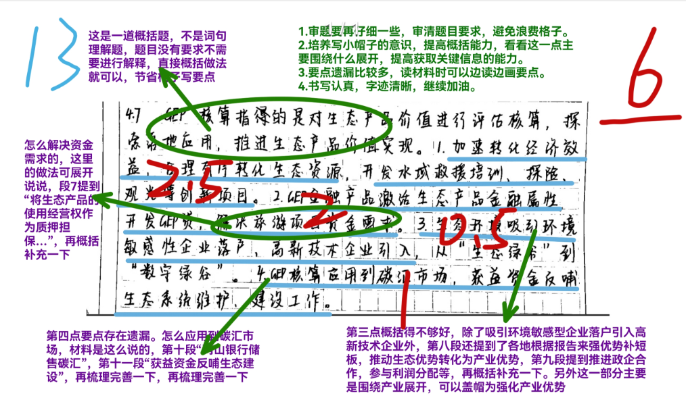

:::

::: card title="答案" icon="typcn:tick-outline"

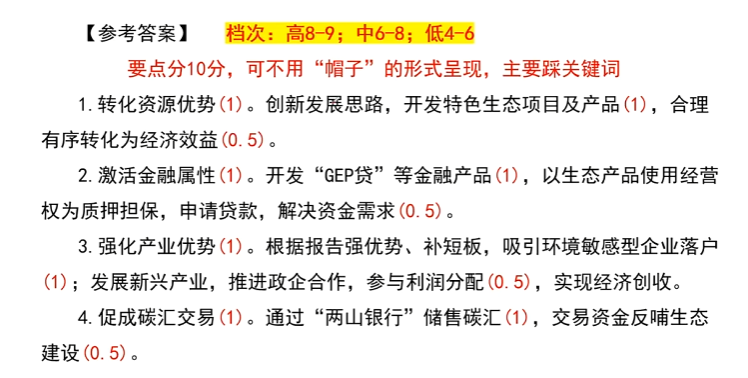

:::
::::

::: card title="总结回顾" icon="noto:backhand-index-pointing-right-dark-skin-tone"

1. ==转化资源优势=={.info}。创新发展思路，==开发特色生态项目及产品=={.info}，合理有序转化为经济效益
2. ==激活金融属性=={.info}。开发“GEP 贷”等金融产品，以生态产品使用经营权为质押担保，申请贷款，==解决资金需求==
3. ==强化产业优势=={.info}。根据报告==强优势，补短板==，吸引环境敏感型企业落户；发展新兴产业，推进政企合作，参与利润分配，实现经济创收
4. ==促成碳汇交易=={.info}。通过“两山银行”储售碳汇，交易资金反哺生态建设。

:::

### **小题 2**

6.5/10

::noto:banana::概括题

:::: card-grid
::: card title="答题" icon="twemoji:astonished-face"

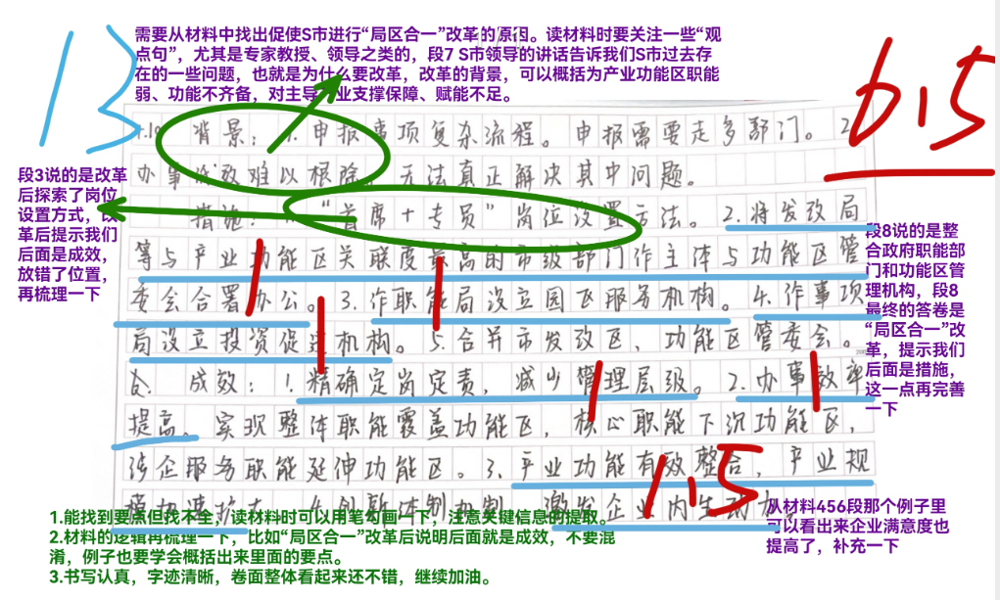

:::

::: card title="答案" icon="typcn:tick-outline"

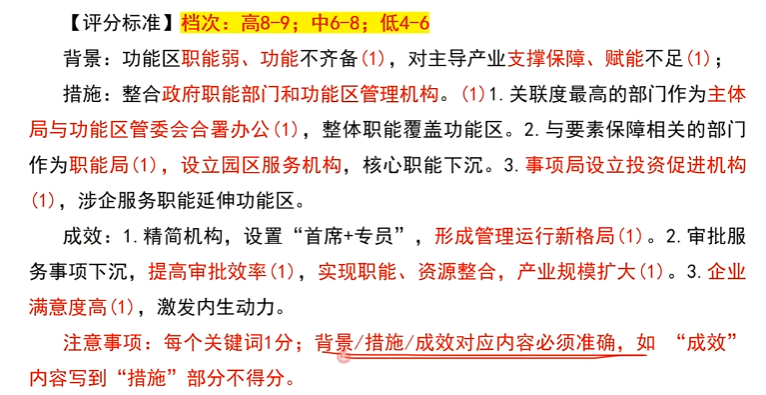

:::
::::

::: card title="总结回顾" icon="noto:backhand-index-pointing-right-dark-skin-tone"

==背景==：功能区职能弱，功能不齐备；对主导产业支撑保障、==赋能不足=={.info}

==措施==：
整合市政府职能部门和产业功能区管理机构。

1. 关联度最高部门合署办公，整体职能覆盖功能区。
2. 与要素保障相关的部门作为职能局，设立园区服务机构，核心职能下沉。
3. 事项局设立投资促进机构，涉企服务职能延伸功能区。

==成效==

1.  精简机构，设置“首席+专员”，形成管理运行新格局，
2.  审批服务事项下沉，提高审批效率，实现职能、资源整合，产业规模扩大。
3.  企业满意度高，激发企业内生动力

==注意这里措施和成效一定是对应的=={.danger}

:::

### **小题 3**

6/10

::noto:banana::概括题

:::: card-grid
::: card title="答题" icon="twemoji:astonished-face"

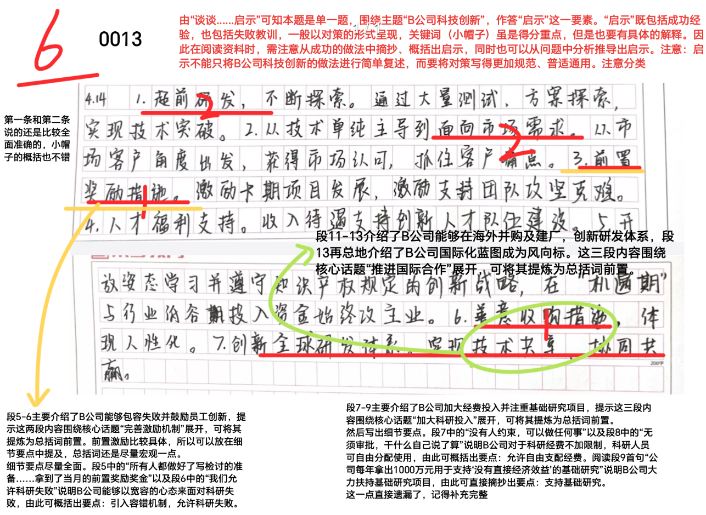
:::

::: card title="答案" icon="typcn:tick-outline"

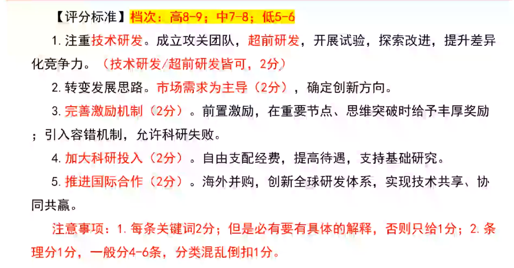

:::
::::

::: card title="总结回顾" icon="noto:backhand-index-pointing-right-dark-skin-tone"

==启示==：

1. ==注重技术研发=={.info}，成立攻关团队，超前研发，开展实验，探索改进，提升差异化竞争力。
2. 转变发展思路，==市场需求为主导=={.info}，确定创新方向。
3. ==完善激励机制=={.info}。前置激励，在重要节点，思维突破时给予丰厚奖励，引入容错机制，允许科研失败。
4. ==加大科研投入=={.info}。自由支配经费，提高待遇，支持基础研究。
5. ==推进国际合作=={.info}。海外并购，==创新全球研发体系==，实现技术共享，协同共赢。

==少用否定，改为正向肯定，如“~~不以技术为主导~~”改为“以市场需求为主导”。=={.danger}

:::

### **小题 4**

4.5/15

::noto:banana::概括题

:::: card-grid
::: card title="答题" icon="twemoji:astonished-face"

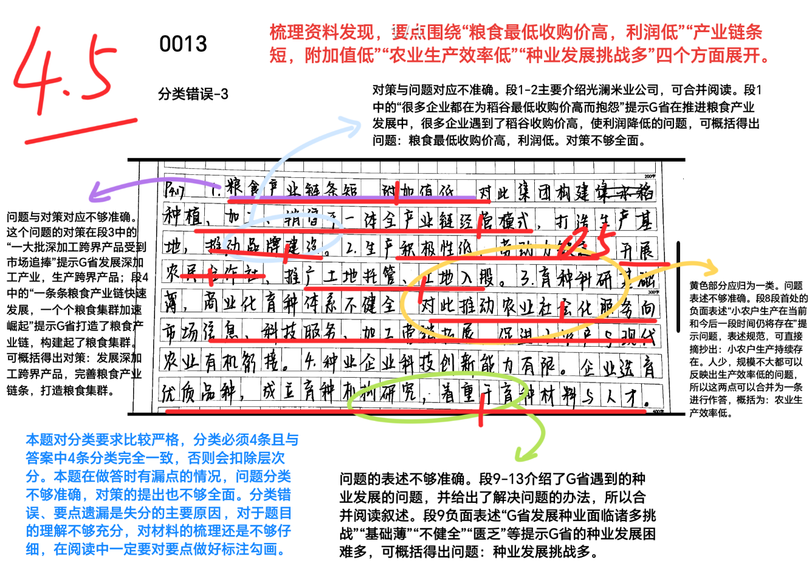

:::

::: card title="答案" icon="typcn:tick-outline"

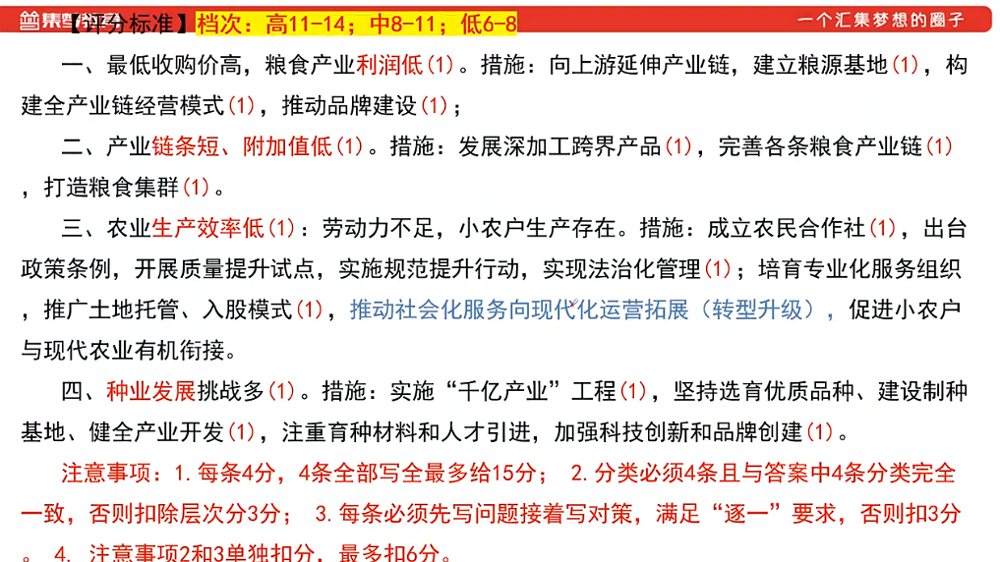

:::
::::

::: card title="总结回顾" icon="noto:backhand-index-pointing-right-dark-skin-tone"

1. 最低收购价格高，粮食产业==利润低=={.info}。措施：向上游延伸产业链，建立粮源基地，构建全产业链经营模式，推动品牌建设；
2. 产业==链条短、附加值低=={.info}。措施：发展深加工跨界产品，完善各条粮食产业链，打造粮食集群。
3. 农业==生产效率低=={.info}：劳动力不足，小农户生产存在。措施：成立农民合作社，出台政策条例，开展质量提升试点，实施规范提升行动，实现法治化管理；培育专业化服务组织，推广土地托管、入股模式，推动社会化服务向现代化运营拓展（转型升级），促进小农户与现代农业有机衔接。
4. ==种业发展=={.info}挑战多。措施：实施“千亿产业”工程，坚持培育优质品种、建设制种基地、健全产业开发，==注重育种材料和人才引进，加强科技创新和品牌创建==。

=="逐一"，限制一定要一条中先写问题接着写对策=={.danger}

:::

### **小题 5**

7/20

::noto:banana::综合分析题

:::: card-grid
::: card title="答题" icon="twemoji:astonished-face"

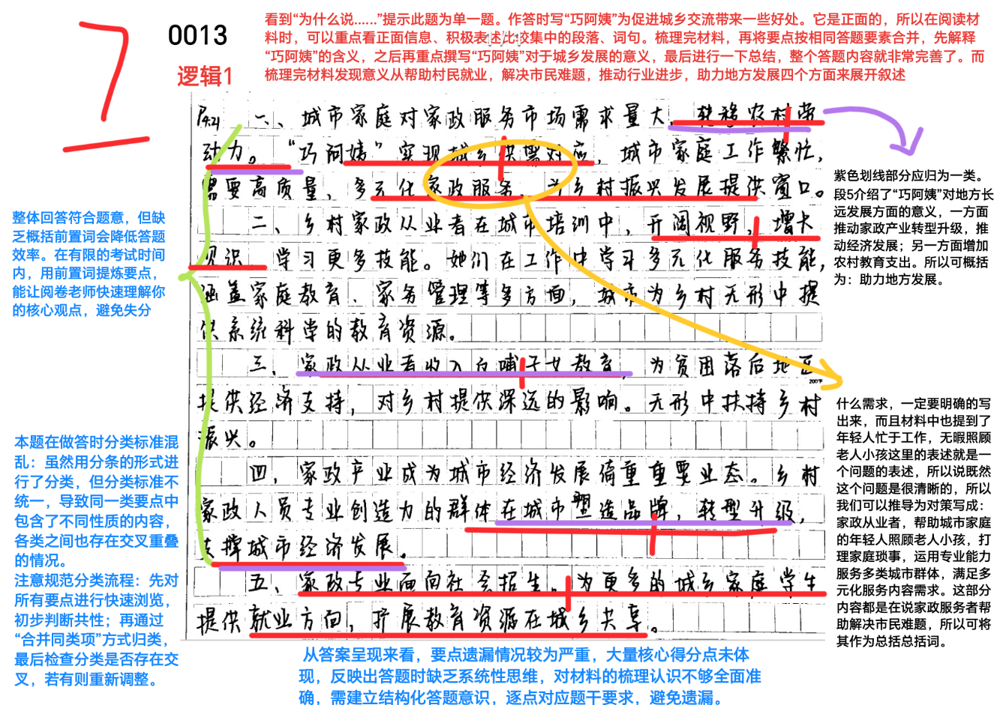

:::

::: card title="答案" icon="typcn:tick-outline"

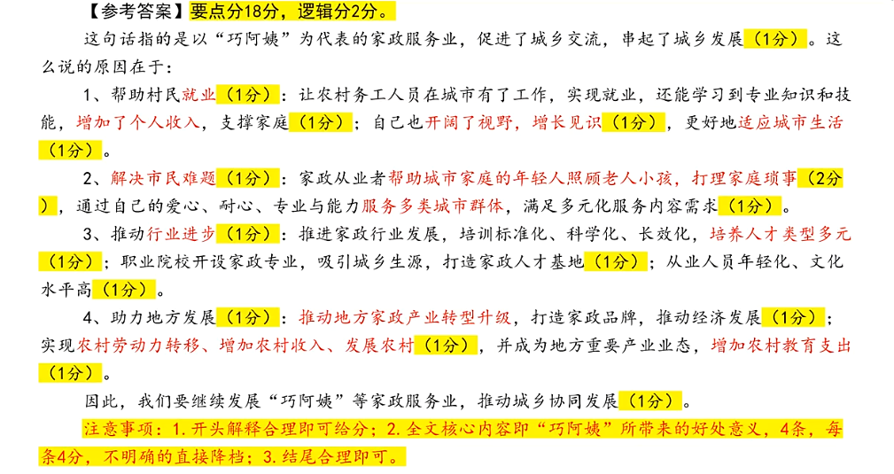
:::
::::

::: card title="总结回顾" icon="noto:backhand-index-pointing-right-dark-skin-tone"

这句话指的是以”巧阿姨“促进了城乡交流，串起了城乡交流。

1. ==帮助村民就业==：让农村务工人员在城市有了工作，实现就业，还能学习到专业知识和技能，增加了个人收入，支撑家庭；自己也开阔了视野，增长见识，更好地适应城市生活。

2. ==解决市民难题==：家政从业者帮助城市家庭的年轻人照顾老人小孩，打理家庭琐事，通过自己的爱心、耐心、专业与能力服务多类城市群体，满足多元化服务内容需求。

3. ==推动行业进步==：推进家政行业发展，培训标准化、科学化、长效化，培养人才类型多元；职业院校开设家政专业，吸引城乡生源，打造家政人才基地；从业人员年轻化、文化水平高。

4. ==助力地方发展==：推动地方家政产业转型升级，打造家政品牌，推动经济发展；实现农村劳动力转移、增加农村收入、发展农村，并成为地方重要产业业态，增加农村教育支出。

因此，我们要继续发展“巧阿姨”等家政服务业，推动城乡协同发展

==注意：开头、结尾各1分；从个体到群体的文章结构要理解=={.danger}
:::

### **小题 6**

6.5/20

::noto:banana::综合分析题

:::: card-grid
::: card title="答题" icon="twemoji:astonished-face"

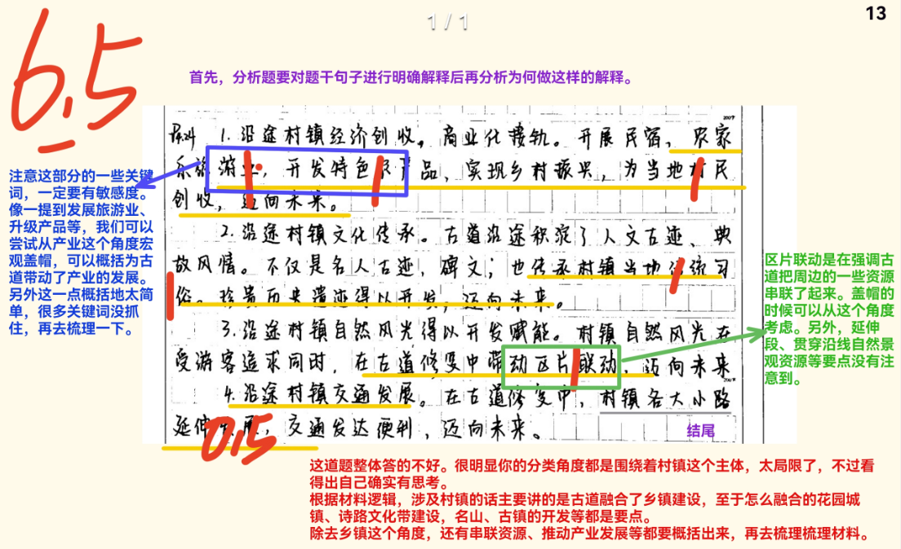

:::

::: card title="答案" icon="typcn:tick-outline"

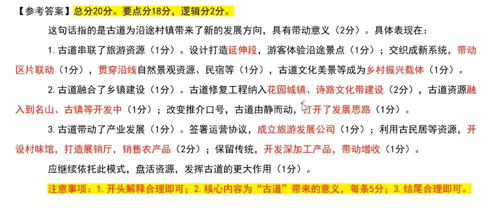

:::
::::

::: card title="总结回顾" icon="noto:backhand-index-pointing-right-dark-skin-tone"

这句话指的是古道为沿途村镇带来了新的发展方向，具有带动意义。

1. ==古道串联了旅游资源=={.info}。设计打造==延伸段==，游客体验沿途景点；交织成新系统，==带动区片联动==，==贯穿沿线==自然景观、民宿等，古道文化美景等成为==乡村振兴载体==。
2. ==古道融合了乡镇建设=={.info}。古道修复工程纳入==花园城镇、诗路文化带建设==，古道资源==融入到名山、古镇等开发中==；改变推介口号，古道由静而动，==打开了发展思路==。
3. ==古道带动了产业发展=={.info}。签署运营协议，==成立旅游发展公司==；利用古民宿等资源，==开设村味馆，打造展销厅，销售农产品==；保留传统，==开发深加工产品，带动增收==。

应继续依托此模式，盘活资源，发挥古道的更大作用

==注意：排比句学习，一提到发展旅游业、升级产品可以联想带动产业发展；本次材料分段隐晦，一定要冷静分析，这里主要是一个“更加”的递进关系整理出三点=={.danger}
::::

### **小题 7**

6.5/20

::noto:banana::综合分析题

:::: card-grid
::: card title="答题" icon="twemoji:astonished-face"

:::

::: card title="答案" icon="typcn:tick-outline"

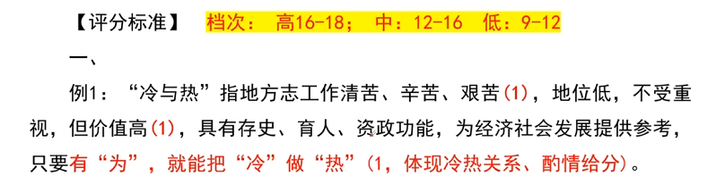

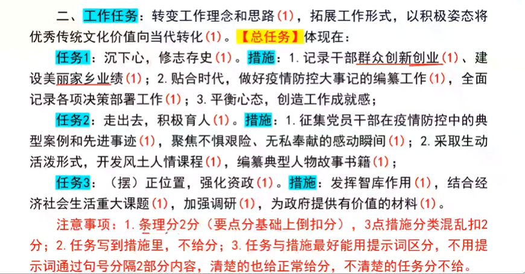

:::
::::

::: card title="总结回顾" icon="noto:backhand-index-pointing-right-dark-skin-tone"

一、

“冷与热”指地方志工作清苦、辛苦、艰苦，地位低，不受重视，但价值高，具有存史、育人、资政功能，为经济社会发展提供参考，只要有“为”，就能把“冷”做“热”（==体现冷热关系==）

二、（==总分结构=={.info}）

工作任务：转变工作理念和思路，拓展工作形式，以积极姿态将优秀传统文化价值向当代转化。

==任务1=={.info}：沉下心，==修志存史==。
==措施=={.info}：1. 记录干部群众创新创业、建设美丽家乡业绩；2. 贴合时代，做好疫情防空大事记的编篡工作，全面记录各项决策部署工作；3. 平衡心态，创造工作成就感；

==任务2=={.info}：走出去，==积极育人==。
==措施=={.info}：1. 征集党员干部在疫情防控在疫情防控中的典型案例和先进示例，聚焦不惧艰险、无私奉献的感动瞬间；2.采取生动活泼形式，开发风土人情课程，编篡典型任务故事书籍；

==任务3=={.info}：正位置，==强化资政==。
==措施=={.info}：发挥智库作用，结合经济社会生活重大课题，加强调研，为政府提供有价值的材料。

==注意：此次题库是一个谈话记录，可以剖析引出各个话题的问句，领导的总结语，找出文章结构=={.danger}

::::

### **小题 8**

11/20

::noto:banana::公文写作题

:::: card-grid
::: card title="答题" icon="twemoji:astonished-face"

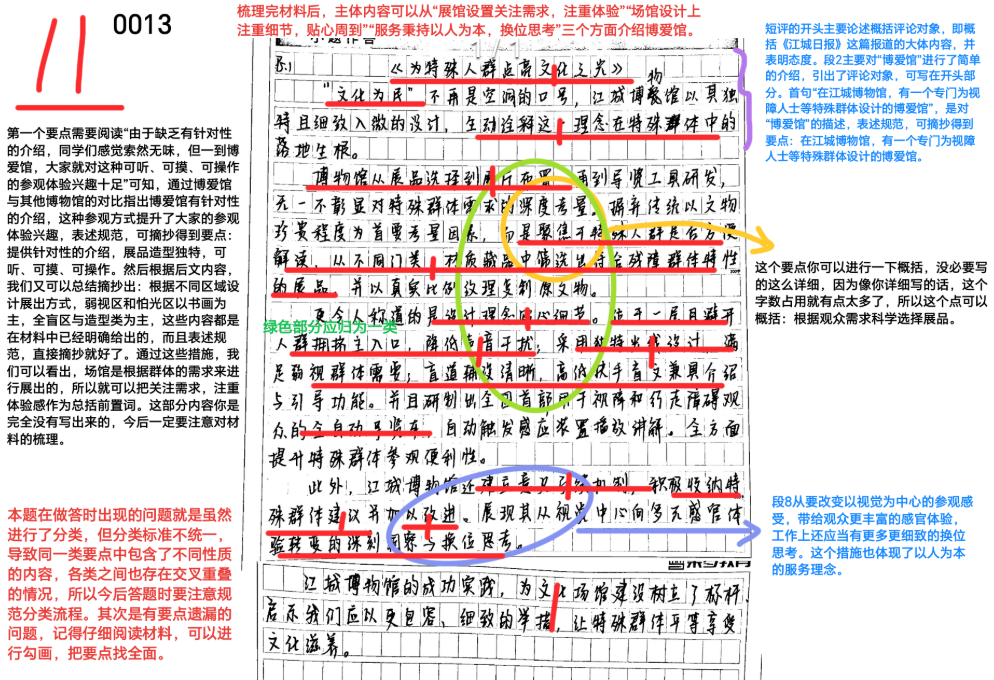

:::

::: card title="答案" icon="typcn:tick-outline"

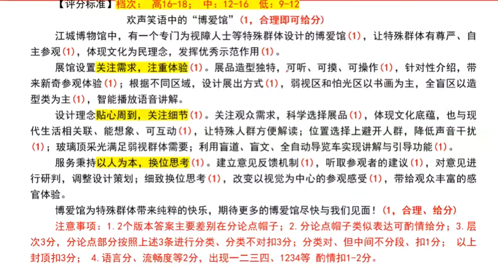

:::
::::

::::

::: card title="总结回顾" icon="noto:backhand-index-pointing-right-dark-skin-tone"

欢声笑语中的“博爱馆”（==1=={.info}）

江城博物馆中，有一个专门为视障人士等特殊群体设计的博爱馆，让特殊群体有尊严、自主参观，体现文化为民理念，发挥优秀示范作用。（==总起，包括三个分论点=={.important}）

展馆设置==关注需求，注重体验==。展品造型独特，可听、可摸、可操作，针对性介绍，带来新奇参观体验；根据不同区域，设计展出方式，弱视区和怕光区以书画为主，全盲区以造型类为主，智能播放语音讲解

设计理念==贴心周到，关注细节==。关注观众需求，科学选择展品，体现文化底蕴，也于现代生活相关联、能想象、可互动，让特殊人群方便解读；位置选择上避开人群，降低声音干扰；玻璃顶采光满足弱视群体需要；利用盲道、盲文、全自动导览车实现讲解与引导功能。

服务秉持==以人为本，换位思考==。建立意见反馈机制，听取参观者的建议，对意见进行研判，调整设计策划；细致换位思考。改变以视觉为中心的参观感受，带给观众丰富的感官体验。

博爱管为特殊群体带来纯粹的快乐，期待更多的博爱馆尽快与我们见面。（==1=={.info}）

==注意：此次题库是一个公文写作短评，不要忘记标题，开头（不要有书名号）末尾，同时不要出现概括题等中的1234，一二三四=={.danger}

::::
