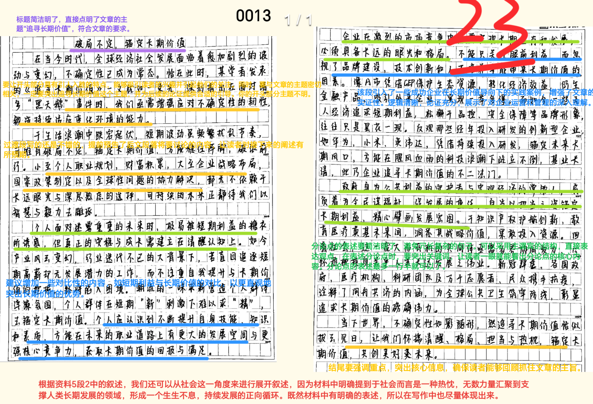
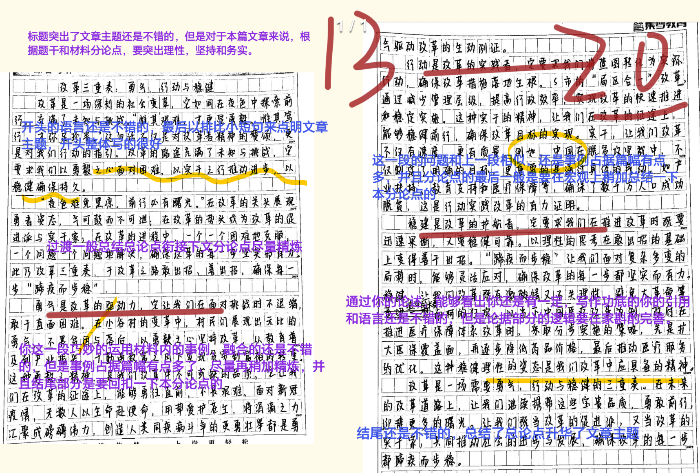
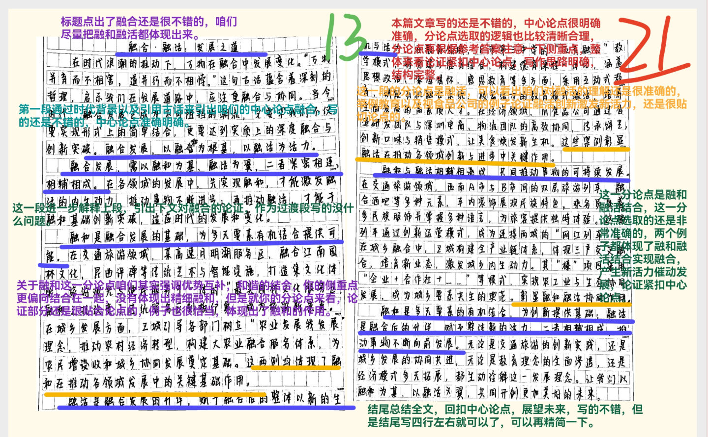
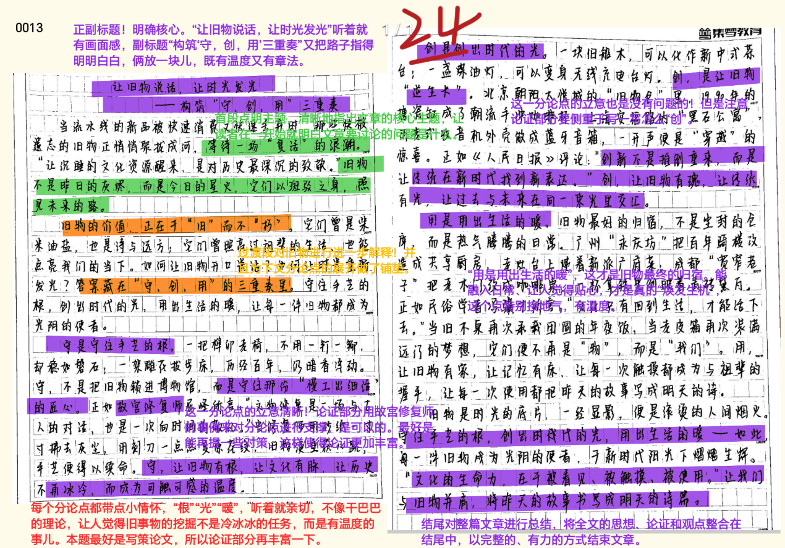

### **作文1**

本次最高分25，平均分21各位同学要继续加油哦❤

::: card title="答题" icon="twemoji:astonished-face"
<Badge type="info" text="作文" />

:::

::: card title="答案" icon="typcn:tick-outline"

  <h4>追寻长期价值，绘就发展蓝图</h4>

“泰山半腰有段平路叫‘快活三里’，若在此久歇，再上‘十八盘’便难如登天。” 这一现象恰似当下社会的真实写照：有人考取大学便疏懒学业，有人求得安稳工作便贪图安逸，有人取得些许成就便故步自封。这些短视之举，只会消磨斗志、遗忘初心。在全球经济社会充满不确定性的今天，唯有坚守长期价值，方能跨越发展路上的 “十八盘”，抵达成功的顶峰。

  

当下，全球经济社会发展面临着更加复杂的变化和更多的不确定性。面对 “未知的未知”，我们必须增加应对不确定性的韧性，增强适应持续变化的环境的能力。这就要求我们不惧短期挫折，抵御短期诱惑，心怀信念，坚持把时间和精力投入到能够产生长期价值的事上。追寻长期价值，意味着在发展中会遭遇种种挫折，需要一次又一次的奋进，承受一次又一次的外压。越是长久基业、长远大计，越呼唤一批批 “拓荒人” 前赴后继，用 “化作春泥更护花” 的大局意识，为后人作铺垫、打基础、利长远；用 “不畏浮云遮望眼” 的恒心定力，沉潜蓄势，埋头苦干，甘当无名英雄。

  

==于个人而言，追寻长期价值是一种清醒，要求人们建立理性的认知框架，不受繁杂噪声的影响==。人生路上，质疑与否定如影随形，若被其左右，便易迷失方向、半途而废。塞罕坝人三代接力，在荒漠之上书写绿色传奇，从茫茫荒原到 “绿色明珠” 的蜕变，是他们抵御外界质疑、坚守种树初心的明证；老一辈航天人扎根戈壁荒滩，在 “一无所有” 中开启中国航天的 “拓荒” 之旅，用埋头苦干的执着，实现了国家航天事业零的突破。他们的经历告诉我们，唯有保持独立思考、理性分析，才能在纷繁世事中坚守初心，于正确的道路上行稳致远。

  

==于企业而言，追寻长期价值是一种格局，要求企业不断进化、不断创造价值==。习近平总书记强调：“高质量发展是‘十四五’乃至更长时期我国经济社会发展的主题。” 企业作为经济发展的主力军，必须主动适应并引领高质量发展。在激烈的市场竞争中，唯有以创新为驱动，才能获得持久的竞争优势；在社会发展的大格局里，唯有兼顾价值共享，才能实现经济效益与社会效益的统一。越来越多的企业深耕核心技术、践行社会责任，向着高质量发展稳步迈进，这不仅为企业自身注入了生机，更让中国经济的内生活力持续增强，为经济稳中求进提供了坚实支撑。

  

==于政府而言，追寻长期价值是一种担当，必须立足长期利益，致力长远发展==。“干事担事，是干部的职责所在，也是价值所在。” 政府的一切工作，终究是为了人民的幸福。人民对美好生活的向往不会停滞，政府的奋斗便不能停歇。从脱贫攻坚的全面胜利到乡村振兴的深入推进，从基础设施的持续完善到公共服务的均等化发展，各级政府始终以 “时时放心不下” 的责任感，在务实中求变，在求变中创新。牢记全心全意为人民服务的宗旨，立足新起点、践行新发展理念、探索新方法，方能不断拓展人民群众的幸福之路。

  

==于社会而言，追寻长期价值是一种热忱，无数力量汇聚到支撑人类长期发展的领域，形成生生不息、持续发展的正向循环==。人类是休戚与共的命运共同体，共同的利益呼唤共同的长期价值。这种价值凝聚着全人类的基本共识，超越了地域与分歧，勾勒出惠及各国人民的 “价值同心圆”。从应对气候变化的全球协作到推动公共卫生安全的国际合作，从促进文化交流互鉴到助力减贫事业发展，全人类在追求共同长期价值的过程中，为构建人类命运共同体筑牢了根基，为文明进步注入了动力，为美好世界的建设指明了方向。

  

追寻长期价值，考验的是定力，彰显的是智慧。越是接近目标，越不能有 “一篙松劲” 的懈怠；越是爬坡过坎，越要保持 “咬定青山” 的执着。让我们以燕子垒窝的恒劲、蚂蚁啃骨的韧劲、老牛爬坡的拼劲，在追寻长期价值的道路上不停步、永向前，终能登顶干事创业的 “十八盘”，迎来海晏河清的美好未来。

:::

### 作文2

本次最高分24，平均分19.5各位同学要继续加油哦❤

::: card title="答题" icon="twemoji:astonished-face"

:::

::: card title="答案" icon="typcn:tick-outline"

  <h4>向前，向前，改革重塑正当时</h4>

四十载惊涛拍岸，九万里风鹏正举。当今世界正处于百年未有之大变局，中国进入实现 “两个一百年” 奋斗目标的历史交汇期，站在新起点上的中国面临多重考验。所谓 “万物皆有裂痕，那是光照进来的地方”，这些考验也意味着世界发展出现新趋势、面临新机遇，我们要顺应发展大势，推进深化改革，让更多的光照进现实。

  

==知困难，抓机遇，善于转危为机，在新时代再出发==。“夜色难免黑凉，前行必有曙光”，困难不是改革的麻醉药，相反恰是改革的催化剂。正如大航海时代的风暴从未阻挡人类探索海洋的步伐，反而铸就了连接世界的贸易网络；石油危机的风暴虽冲击世界经济，却加速了新能源技术的革命性突破。历史一再证明，危机与机遇总是相伴而生，正如冬日的寒冷孕育着春天的生机，暂时的困境往往为突破性创新提供了最肥沃的土壤。面对世界百年未有之大变局，唯有坚持 “不畏浮云遮望眼” 的战略定力和 “风物长宜放眼量” 的历史胸怀，方能在危机中育新机、于变局中开新局，赢得主动、赢得优势、赢得未来。

  

==明目标、重务实，勇于担当作为，在新时代再出发==。伟大事业，成于实干。是科研人员日夜兼程的攻关，让我们实现了嫦娥探月、天问探火、北斗组网的航天壮举；是教育工作者默默无闻的耕耘，让义务教育巩固率达到 95.4%，让知识改变命运的梦想照进现实；是基层干部风雨无阻的坚守，让我们建成了覆盖 10 亿人的全民医保体系…… 回首来时路，中国号巨轮一路经风历雨、劈波斩浪，离不开筚路蓝缕、以启山林那么一种精神，离不开空谈误国、实干兴邦那么一种警醒。社会主义是干出来的，新时代也是干出来的，唯有以 “功成不必在我” 的精神境界和 “功成必定有我” 的历史担当，一锤接着一锤敲，一棒接着一棒跑，才能把宏伟蓝图变为美好现实。

  

==勤思考、悟思想，培养理性思维，在新时代再出发==。理性思维如同灯塔，照亮前行的道路，让我们在面对各种思潮激荡时保持清醒，在应对各类风险挑战时不失定力。从 “拍脑袋决策” 到 “系统化思考”，从 “经验主义” 到 “科学研判”，这种思维方式的转变正是个人成长与国家进步的内在要求。我们要善于在理论学习中汲取智慧，在实践锻炼中增长才干，在比较鉴别中明晰方向，把感性认识上升为理性认识，把零散经验整合为系统思维。唯有如此，才能在百年未有之大变局中找准历史方位，在新时代新征程上作出正确抉择，以思想的清醒引领行动的坚定，以理性的光芒照亮复兴之路。

  

哲人说：“任何通往光明未来的道路都不是笔直的”，但美好愿景终归会照入现实，我们比谁都有这个自信。深化改革过程中肯定会伴随阵痛，但在新时代要坚定进行这场伟大革命，展现思考改革的 “全视角”、拿出务实担当的 “铁肩膀”，我们一定可以开启伟大复兴新征程。

:::

### 作文3

本次最高分25，平均分21各位同学要继续加油哦❤

::: card title="答题" icon="twemoji:astonished-face"

:::

::: card title="答案" icon="typcn:tick-outline"

  
<h4>天地合和 生之大经——构筑“融和”与“融活”的双螺旋结构</h4>  

《吕氏春秋・有始》有云：“天地合和，生之大经也。” 天地交合是万物诞生的根本，融合发展则是万物演进的规律。世间万物并非孤立存在，而是在相互关联中融合变化。“融合” 既是经济社会发展的重要法则，也是推动时代进步的核心思想。当下，我们身处 “危” 与 “机” 并存的时代，唯有深刻领悟 “融合” 的时代内涵，实现 “融和” 与 “融活” 的有机统一，才能顺应发展大势。

融合不是简单嫁接，而是精细 “融和”。“简单嫁接” 仅停留在事物的表面拼凑，难以形成持久的发展活力与动力；而精细 “融和” 强调优势互补、和谐统一，追求深层次的有机结合。我国秉持的 “新发展理念” 便是典型例证：新时代的发展绝非单一领域的片面推进，那样只会沦为低效的 “嫁接”。相反，创新、绿色、协调、开放、共享的理念相互渗透、深度融和，才能推动社会向更高质量、更有效率、更加公平、更可持续的方向迈进。由此可见，摒弃简单嫁接，践行精细融和，才是事物发展的正确路径。

融合不是削足适履，而是精巧 “融活”。真正的融合绝非生硬捆绑，而是 “你中有我、我中有你” 的共生状态，更需通过精巧 “融活” 激发持久动力，从根本上推动发展。当前，许多城市治理实践彰显了融活的智慧：城乡一体化发展打破了 “农村装着精神，城市装着物质” 的固有困境，让乡村文明与城市文明互补共进。Z 城的蜕变便是生动案例 —— 通过城乡要素的深度融和，大批工业资本反哺农业，新型农村社区周边的现代农业产业园与生态景区成为要素共生共融的典范，不仅改变了城乡生产关系，更让这片土地在同频共振中焕发新活力。显然，精巧 “融活” 是打破发展桎梏、释放内生动力的关键。

  

实现万物融合，必须让 “融和” 与 “融活” 有机结合。知易行难，并非所有事物的组合都能产生共振、放大优势。在文旅融合的浪潮中，一些地方急于求成，或 “烧钱” 打造豪华景区，或照搬国外项目，沦为 “东施效颦”，最终难以为继。这提醒我们：万物融合不是简单的物理相加，而是要通过理念与模式创新，在要素整合中做深功夫，在产品打磨上倾注心力，实现从 “物理反应” 到 “化学反应” 的质变。唯有让 “融和” 奠定坚实基础，让 “融活” 激发持续动能，才能让融合真正成为发展的助推器。

  

“物无妄然，必由其理。” 站在新的历史起点，只要我们把握融合发展的规律，在 “融和” 上铆足干劲，在 “融活” 上下足功夫，以同心同德的信念顽强奋斗，夯实融合之基，就一定能凝聚起强大的奋进力量，实现更高质量、更富活力的全面发展。

:::

### 作文4

==最高分！==

本次最高分24，平均分20.5各位同学要继续加油哦❤

::: card title="答题" icon="twemoji:astonished-face"

:::

::: card title="答案" icon="typcn:tick-outline"

  
<h4>让旧事物焕发新生机</h4>  

在大众观念里，旧事物往往与 “过时”“淘汰”“破烂儿” 等标签挂钩。当岁月的巨刃划分出时间的界限，事物便有了新旧之分，但旧事物仅是时间维度上的概念，绝不等于无用之物。事实上，每一件旧物都蕴含着无尽的价值 —— 经济的、历史的、文化的、艺术的、情感的…… 唯有认识到这些丰富价值，并以积极态度深入挖掘，才能让旧事物在新时代重焕生机，为发展助力、为生活添彩。

  

==融入现代生活，是旧事物持续发展的根基==。许多旧事物之所以被束之高阁、弃于角落，正是因为脱离了日常生活的土壤。当它们不再被想见、被看见、被使用，便会渐渐褪去光泽，沦为时代的弃物。要让旧事物 “活” 下去，必须使其融入现代生活，适应大众的生活方式。从文化领域来看，文化遗产一旦走进日常生活，便会变得鲜活立体。譬如京剧，作为国粹曾因脱离大众视野而式微，而当新时代青年用京剧唱腔演绎流行内容，并借助抖音等自媒体融入人们的休闲生活后，越来越多的年轻人开始感受其魅力。可见，旧事物与现代生活的结合，不仅能让其重获新生，更能为人们的精神世界增添独特韵味。

  

==理性分析形势，为旧事物拓展更广阔的发展空间==。旧事物的存续，不能仅靠时间的自然延续，更需主动开辟新赛道。这就需要对旧事物的特质与市场需求进行理性研判，明确发展方向与路径，方能在变局中破局、于危机中寻机。以传统燃油车为例，在新能源汽车迅猛发展的冲击下，其市场空间虽被挤压，但并非无路可走。理性分析可见，燃油车在技术成熟度、能源补给便利性、动力输出稳定性等方面仍具不可替代性，且在商用车等领域需求旺盛。只要看清形势、选对赛道，旧事物依然能展现勃勃生机。

  

==创新发展方式，为旧事物注入持久动力==。“穷则变，变则通，通则久”，这一古老智慧同样适用于旧事物的复兴。若一味因循守旧，旧事物只会僵化至死；唯有顺势而变，才能绝处逢生。旧事物的创新，可从三方面着手：一是内容创新，让自身内核反映时代、适应时代甚至引领时代，新民乐将传统旋律与现代节奏结合后走红，便是生动例证；二是科技赋能，借助科技为旧事物拓展可能性，如传统灯饰企业通过技术革新实现产品迭代，既领跑行业，又满足了大众对高品质生活的需求；三是精准调研，深入了解实际需求，让创新真正服务于生活，避免闭门造车。

旧事物是一座待发掘的宝藏，需要我们以积极态度挖掘价值，以前瞻眼光引领发展。在使用中感受其温度，在创新中激活其能量，方能让旧事物成为时代前进的双轮、人民瞭望未来的肩膀，在岁月流转中始终焕发独特光彩。

:::