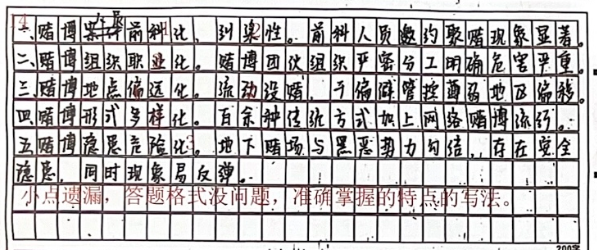

| 昵称         | Y0ungK1ng |
| ---------- | --------- |
| Q1得分       | 14        |
| Q2得分       | 13        |
| Q3得分       | 15        |
| Q4得分       | 30        |
| 8.1 申论成绩   | 72        |
| 8.1 申论成绩排名 | 3         |
| 申论平均分      | 54.86     |

###  **一、特点概括题**::noto:banana::

| 得分  | 总分  |
| --- | --- |
| 14  | 15  |

::: card title="题干" icon="noto:backhand-index-pointing-right-dark-skin-tone"

**（一）根据“给定资料 1”，概括自“清风 2023”专项行动开展以来农村赌博案件呈现出来的主要特点。（15 分）**

要求：

（1）全面、准确，简明；

（2）字数不超过 150 字。

:::

::: card title="答题" icon="twemoji:astonished-face"

:::

::: card title="答案" icon="typcn:tick-outline"

1. ==参赌人员本土化==，本地“纠集性”聚赌案件占比高（`3`）
2. ==“职业化”赌博团伙组织严密==，分工明确，危害严重(`3`)
3. ==赌博团队位置隐蔽性强==，流动大（`3`）
4. ==赌博玩法多样化==，出现新型赌博刑事，网络赌博流行，辐射面广，诱惑性强，欺骗性大（`3`）
5. ==地下赌场易与黑恶势力勾结==，治安隐患大（`3`）

:::

###  **二、对策题**::noto:banana::

| 得分  | 总分  |
| --- | --- |
| 13  | 20  |

::: danger
薄弱
:::

::: card title="题干" icon="noto:backhand-index-pointing-right-dark-skin-tone"

**（二）“给定资料 2”反映了近年来在交通执法管理中为人们诟病的诸多问题。请根据“给定资料 2”，对这些问题进行梳理，并提出对策建议。（20 分）**

要求：（1）问题准确全面；（2）对策建议合理可行；（3）字数不超过 400 字。

:::

::: card title="答题" icon="twemoji:astonished-face"

:::

::: card title="答案" icon="typcn:tick-outline"

问题：
1. 部分交通标识施划不合理，导致驾驶员违章。（`2分`✔）
2. 一些“电子警察”抓拍点存在逐利执法嫌疑，企业为达指标雇人违章；（`1分`✔）BOT 模式扩大了企业主动寻租空间，行政执法权被滥用。（`1分`）
3. 行政执法领域缺乏有效的监督机制，对不合理处罚缺乏投诉渠道。（`2分`✔）

对策建议：
1. 完善交通标识。（`1分`1✔）加强交通标识设计与施划的审核，确保合理、清晰、准确，便于驾驶员遵循。（`2分`1/2）
2. 把握执法尺度。（`1分`）深化为民理念，坚持宽严相济，规范交警执法处罚，严禁过度执法、逐利执法；（`1分`✔）规范合理设置道路交通技术监控设备，确保公正合理。（`1分`✔）
3. 优化运营模式。（`1分`）取消或限制 BOT 模式，（`1分`）实行“收支两条线”管理，防止交管部门设置使用“电子警察”目标偏移，避免滥用行政执法权。（`2分`✔）
4. 健全监督机制。（`1分`）拓宽车主投诉渠道，增大司法干预的空间；（`1分`）积极回应群众意见，主动征求社会意见，对设置、使用中存在的问题进行排查整改。（`2分`✔）

:::

::: warning
有些对策在问题中，没有在对策中说明
:::

###  **三、公文写作题**::noto:banana::

| 得分  | 总分  |
| --- | --- |
| 15  | 25  |

::: danger
也很薄弱
:::

::: card title="题干" icon="noto:backhand-index-pointing-right-dark-skin-tone"

三、区里拟将高岗村校地合作建设乡村振兴工作站推动乡村振兴的情况，作

为典型案例上报市里。根据“给定资料3” ，请撰写一份案例介绍材料。(25分)

要求：

（1）紧扣资料，内容全面，结构完整；

（2）条理清晰，语言流畅；

（3）不超过500字。

:::

::: card title="答题" icon="twemoji:astonished-face"

:::

::: card title="答案" icon="typcn:tick-outline"

一、格式（`1分`）。符合应用文写作的格式规范，酌情给分。

二、结构（`2分`）。正文部分按照“开头—主体—结尾”的结构书写答案，缺一项则不得分。

三、内容（`20分`）。

（一）标题 `2分`：写出恰当标题酌情给 1—2 分。

（二）开头 `2分`：写出 A 寨交警三中队的职责和担当等恰当开头，酌情给 1—2 分。

（三）主体 `14分`。按点给分，同义表达亦可得分，具体采分点如下：

  <h4>守护天险路——走进 A 寨交警三中队</h4>

A 寨盘山公路坡度大、急弯多、路面窄，地势险峻，是湘川公路上最险的一个关卡。A寨交警三中队是这段“天险”盘山路的守护者。他们临渊搭建值勤岗亭、徒步巡逻、彻夜疏导交通。他们扎根大山，尽责值守，是“天险”路上流动的“红绿灯”，被称为“天路卫士”。`2分`✔

他们在悬崖旁搭建起“云中岗亭”，（`1分`✔）在疏导交通的同时，为过路的车辆提供帮助。（`1分`✔）他们为滞留的乘客送上热水和食品，（`1分`✔）护送生病的游客就医，（`1分`✔）铲冰除雪，分流车辆，（`1分`✔）遇到驾龄少的新手不敢通行，还化身“代驾司机”帮忙解困。（`1分`✔）

山路沿途，他们细心张贴了许多报警求助电话。（`1分`✔）遇到过往车辆司机和群众遇困，他们总会倾力相助。（`1分`✔）他们的坚守与付出，换来了群众的暖心回应，警民之间的温暖互动，令人记忆犹新。（`1分`✔）

山乡巨变，A 寨交警是见证人，更是建设者、参与者。（`1分`✔）2012 年 12 月，A 寨特大悬索桥建成通车，A 寨公路通行压力大大缓解，（`1分`）曾经在绝壁旁搭建执勤岗亭的地方，也已被改造为“最牛交警岗亭”景点。（`1分`）如今，A 寨交警三中队的执勤营房里有了硕大的监控屏，（`1分`）可以观测各个重点路段、弯道的实时路况，遇到突发状况，能够第一时间发现并处置。（`1分`）

这支光荣而优秀的队伍，用青春和汗水，书写着天险路上的壮丽篇章，用责任和坚守，诠释着交警的使命与荣耀。

格式`1`✔
结构`2`✔

（四）结尾 2 分：写出对 A 寨交警三中队事迹的肯定及宣扬等恰当结尾，酌情给 1—2

分。

四、语言表达（2分）。根据语言表达水平酌情给1—2分

:::

::: warning
标题缺成分
露要点
:::

###  **三、大写作**::noto:banana::

| 得分  | 总分  |
| --- | --- |
| 30  | 40  |

::: card title="题干" icon="noto:backhand-index-pointing-right-dark-skin-tone"

**（四）结合“给定资料 4”，围绕“网络暴力”这一主题，联系社会实际，自拟题目，写一篇文章。（40 分）**

要求：

（1）自选角度，观点明确；

（2）参考“给定资料”，但不拘泥于“给定资料”；

（3）思路清晰，语言流畅；

（4）总字数 1000—1200 字。

:::

::: warning

这篇抓的还是很到位的

:::

::: card title="答题" icon="twemoji:astonished-face"

:::

::: card title="答案" icon="typcn:tick-outline"

  <h4>整治网络暴力势在必行</h4>

习近平总书记强调，“网络空间是亿万民众共同的精神家园。网络空间天朗气清、生态良好，符合人民利益。网络空间乌烟瘴气、生态恶化，不符合人民利益。” 当前，网络暴力事件层出不穷，严重威胁到风清气正的网络环境。由此可见，整治网络暴力势在必行。

网暴不除，人心难安。在网络暴力的恶劣行径中，参与者凭借非理性的攻击行为，给当事人的身心健康带来了极为严重的创伤，同时也对当事人正常的现实生活造成了直接且强烈的侵扰。当下，网络暴力的手段已远非仅仅局限于在网络空间内通过文字或图像对当事人展开攻击讨伐。他们借助人肉搜索这一极具侵犯性的手段，突破虚拟社会与现实社会的界限，将恶意直接延伸至当事人的现实生活领域。在众多网络暴力事件里，受害人身份明确、有名有姓，然而令人无奈的是，那些具体实施伤害行为的人却如同隐匿在黑暗中的影子，难以被精准锁定。网络暴力毒瘤一日不除，善良的网民人心难安。

网暴不除，社会不宁。某大学法学院诉讼与司法制度研究中心陈主任指出，个人或群体有意识地通过网络传播攻击性言论，以针对某一明确的个人或团体反复、持续实施侵害的行为，就是网络暴力行为。在现实中，网络暴力施害者通常会形成一个群体，他们没有固定的组织，但常常闻风而动，倾巢而出。如今，网络已经深度融入人们的生活，网络暴力施害者发表的，基本是侮辱谩骂、造谣滋事等不符合社会主流价值观的言论，从 “上海姑娘打赏外卖员 200 元被网暴跳楼自杀” 到 “15 岁寻亲少年被网暴海边吞药身亡”，桩桩件件不仅是当事人的血泪，每次也都搅扰得网络世界不得安宁。如若网络暴力得不到遏制，无形中会带坏社会风气，传递错误的价值观，贻害无穷。

遏制网络暴力，必须筑牢法治 “铜墙铁壁”。法律是治国重器，良法是善治前提。仔细审视每一起网络暴力事件，不难发现，施暴者之所以如此肆意妄为、嚣张至极，法律追责的乏力难辞其咎。鉴于此，持续推动网络暴力相关法律法规不断完善是重中之重。这不仅能有力惩治已然发生的恶行，更能对潜在的不良行为起到有效震慑。与此同时，还需进一步完善配套制度，压实平台责任，使其严格审核流程、加强监管。对于施暴者，依法严肃惩处，以法律的威严守护网络空间，切实回应群众对清朗网络环境的期盼。

  

“网络暴力何时休？” 这是广大网友的期盼，也是网络治理的目标。在这网络依赖度极高的时代，网络空间不仅不是法外之地，反而应该更高程度的法治化，成为社会文明的示范窗口，和美好温暖的精神家园。

:::