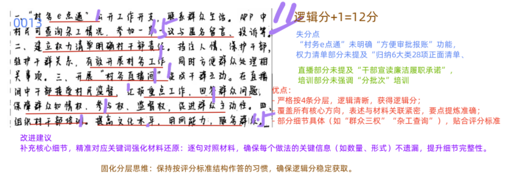
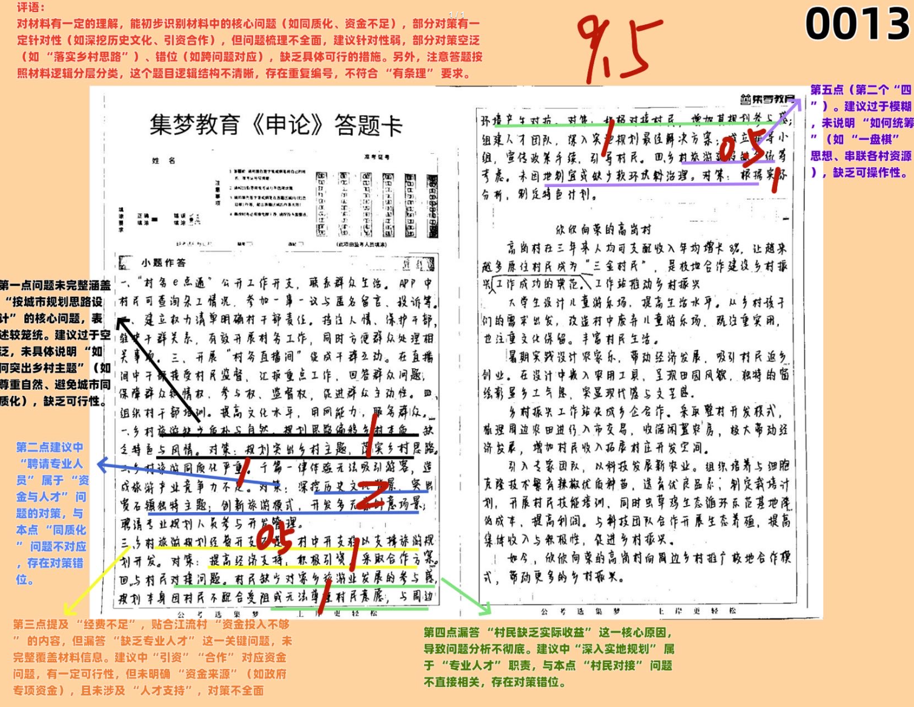
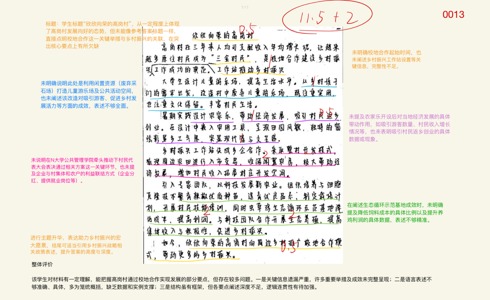
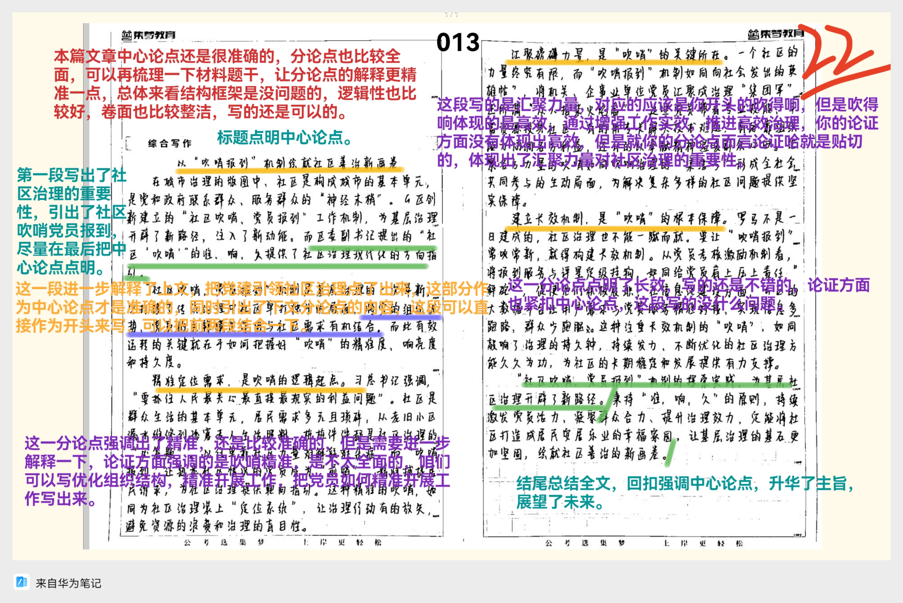

| 昵称    | Y0ungK1ng |
| ----- | --------- |
| Q1得分  | 12        |
| Q2得分  | 9.5       |
| Q3得分  | 13.5      |
| Q4得分  | 22        |
| 总分    | 57        |
| 平均分   | 56        |
| 排名    | 328       |
| 总提交人数 | 551       |

###  **一、做法概括题**::noto:banana::

| 得分  | 总分  |
| --- | --- |
| 12  | 15  |

::: card title="题干" icon="noto:backhand-index-pointing-right-dark-skin-tone"

**一、根据“给定资料1” ，请说说E县在规范村级小微权力运行方面有哪些做法？（15分）**

要求：

（1）全面、准确、有条理；

（2）不超过200字。

:::

::: card title="答题" icon="twemoji:astonished-face"

:::

::: card title="答案" icon="typcn:tick-outline"

1. ==借助平台建设，创新公开方式==。通过“村务e点通”，公开村务信息，==维护干群关系=={.info},开展村务工作。
2. ==建立权利清单，干部规范履职==。针对村两委职责权限和服务事项，全面梳理村级小微权力，形成正面清单，绘制流程图，明确具体责任。
3. ==定期直播村务，发挥群众监督==。线上公开村务程序、过程和结果，汇报重点工作，村民参与管理，加强互动交流
4. ==加强培训教育，完善队伍建设==。分批次培训，提高干部文化水平、用网能力。

:::

###  **二、对策题**::noto:banana::

| 得分  | 总分  |
| --- | --- |
| 8.5 | 20  |

::: danger
非常薄弱
:::

::: card title="题干" icon="noto:backhand-index-pointing-right-dark-skin-tone"

**二、根据“给定资料2” ，请梳理当前宽石镇乡村旅游规划中的问题，并提出相应的改进建议。（20分）**

要求：

（1）问题梳理全面、准确、有条理；

（2）所提建议与问题相对应，具体明确，切实可行；

（3）不超过350字。

:::

::: card title="答题" icon="twemoji:astonished-face"

:::

::: card title="答案" icon="typcn:tick-outline"

1. ==缺乏调研/忽略民意==，村民缺乏收益、不配合。建议：①创新发展模式。充分调研，征集意见；建立利益联结机制，引导村民入股，共同开发旅游项目，提升村民收益。②加强乡风文明建设。成立村民自治委员会，制定村规民约，明确畜禽养殖、环境保护等规章制度，引入奖惩机制，规范村民行为。
2. ==同质化严重，核心竞争力、历史文化深度挖掘不足==。建议：创新主题内容。尊重乡村质朴与自然，挖掘地方特色农业和文化，差异化发展，开发各类创意场景。
3. ==支持力度不足，缺少建设资金及专业人才==。建议：加大扶持力度。县政府设置专项资金，引入社会资本，培养、引进专业规划管理人才，深入乡村实地体验。
4. ==缺乏统筹规划，脱离实际情况==。建议：加强统筹规划。树立“一盘棋”思想，根据各村实际情况指定规划，加强串联整合，形成全镇特色旅游项目。

:::

###  **三、公文写作题**::noto:banana::

| 得分   | 总分  |
| ---- | --- |
| 13.5 | 25  |

::: danger
也很薄弱
:::

::: card title="题干" icon="noto:backhand-index-pointing-right-dark-skin-tone"

**三、区里拟将高岗村校地合作建设乡村振兴工作站推动乡村振兴的情况，作为典型案例上报市里。根据“给定资料3” ，请撰写一份案例介绍材料。(25分)**

要求：

（1）紧扣资料，内容全面，结构完整；

（2）条理清晰，语言流畅；

（3）不超过500字。

:::

::: card title="答题" icon="twemoji:astonished-face"

:::

::: card title="答案" icon="typcn:tick-outline"

  <h4>推进校地合作 打造乡村振兴新样板</h4>

2018年，N大学加强校地合作建设，在高岗村设置乡村振兴工作站，让原住村民成了“三金农民”，收入持续增长。具体情况如下：

一、==合作设计改造，提升发展活力==。利用社会实践，设计细节==注重实用与文化保留=={.info}，带来人文气息。盘活闲置资源，从孩子们需求出发，打造儿童游乐场，提供趣味公共空间；改造农房，打造农家乐，乡土气息、现代感、文艺范兼顾，赢得群众满意，吸引游客体验，促进人才返乡。

二、==创新开发模式，拓展开发空间==。梳理村庄周边农田，收储闲置农房，将集体建设用地进入入市交易试点；村民代表大会表决通过方案，加强土地流转，实现农企利益联结，企业分期分红，提供就业岗位，增加村民收入。

三、==推动农学联动，激发发展潜力==。专家团队实地调研，因地制宜，利用先进技术，选育优良品系，指定栽培计划，开展技能培训，为村民带来先进技术；打造生态循环示范基地，发展生态农业，降本增效，激发农户积极性。

在高岗实践基础上，我们向周边乡村推广校地合作模式，未来还会出现更多地“高冈村”，助力乡村振兴！

:::

###  **四、大写作**::noto:banana::

| 得分  | 总分  |
| --- | --- |
| 22  | 40  |

::: card title="题干" icon="noto:backhand-index-pointing-right-dark-skin-tone"

**四、请深入理解“给定资料4”划线句子“社区‘吹哨’ ，既要吹得‘准’，还要吹得‘响’ 、吹得‘久’” ，联系社区治理实际，自选角度，自拟题目，写一篇文章。(40分)**

要求：

（1）观点明确，见解深刻；

（2）思路清晰，论证充分，语言流畅；

（3）参考“给定资料4” ，但不拘泥于给定资料；

（4）1000-1200字。

:::

::: warning

点没抓牢

:::

::: card title="答题" icon="twemoji:astonished-face"

:::

::: card title="答案" icon="typcn:tick-outline"

- 总论点
	- 党建+社会治理
- 分论点
	- 吹得“准”\==》精准---优化组织结构，精准开展工作  
	- 吹得“响”\==》高效---增强工作实效，推进高效治理  
	- 吹得“久”\==》长效---突出全面进步，坚持长效发展

  <h4>吹好社区治理 “集合哨”—— 以党建引领社区治理创新</h4>

在抗击新冠肺炎疫情斗争中，全国 3900 多万名党员、干部战斗在抗疫一线；在脱贫攻坚战中，300 多万名第一书记和驻村干部，同近 200 万名乡镇干部和数百万村干部一道奋战在扶贫一线。以党建引领社区治理创新，有助于激励基层党组织和广大党员牢记初心、忠诚担当，以热血赴使命、以行动践诺言，促进党群关系、干群关系得到巩固和发展。(==开头示例1==)

  

湖南长沙芙蓉区大力实施 “党建聚合力” 工程，充分激发新经济组织、新社会组织活力；浙江嘉兴南湖区选优配强基层党组织带头人，基层党建堡垒不断建强；江西新余高新区在非公企业联合党支部建立 “一心三园四联” 工作机制…… 近年来，各地加强党建引领社区治理创新，一系列好经验好做法不断提升着基层治理的水平。(==开头示例2==)

  

习近平总书记强调：“把加强基层党的建设、巩固党的执政基础作为贯穿社会治理和基层建设的一条红线”。党建做得好，可以将组织优势转化为治理优势，有助于社区治理提质增效。把党的组织链条延伸到城乡生产生活的各领域各环节，打造联系群众、服务群众的坚强堡垒，才能更好促进社区治理。(==开头示例3==)

  

“集合哨” 吹得 “准”，要优化组织结构，精准开展工作。基层是国家治理的最末端、服务群众的最前沿，各类矛盾问题往往较为复杂。如何做到收集问题更精准、解决问题更及时？例如浙江嘉兴以村民小组、居民楼道、商务楼宇、企业等为单位细分出 9.2 万个微网格，党员干部在微网格中着重收集群众的操心事、烦心事、揪心事，并现场解决问题或上报相关机构统筹处理，实现了将矛盾化解在源头、问题处理在基层。由此可见，优化组织结构，让社区干部各守其责、轻装上阵，将更好促进社区治理提质增效。

  

“集合哨” 吹得 “响”，要增强工作实效，推进高效治理。以党建引领社区治理的效能如何，关键要看有没有解决实际问题，要看人民群众是否满意。村口安装路灯，老旧公园修整改造，健身广场的设施更换升级…… 社区治理面临的事情看起来很小，却是关系城乡居民生活品质的大事。每一位社区党员干部都要锚定人民群众对美好生活的向往，增强暖民心、纾民困、解民忧的紧迫感，提高破解难题的本领，下足绣花功夫、做好精细文章，让群众的获得感、幸福感、安全感更加充实、更有保障、更可持续。

  

“集合哨” 吹得 “久”，要突出全面进步，坚持长效发展。以党建引领社区治理，贵在持之以恒、久久为功，建立行之有效的机制。“群众说事、干部解题”，既要有一事一议、办好个案的耐心，也要有以点带面、举一反三、坚持到底的恒心。以党建引领社区治理，必须从大处着眼、小处入手，让群众在每一件小事中收获满意，也督促党员干部能够多角度、深层次地思考问题成因。只有通过解决实际问题带动地方发展，在 “群众说事、干部解题” 中不断补短板、强弱项，推动基层社会治理走向善治。

  

社区工作是一门学问，要积极探索创新，通过多种形式延伸管理链条，提高服务水平。面向未来，更加注重以社区党建带动小区党建，进而打通联系、服务居民群众的 “最后一公里”，构建起精准化、精细化、专业化的服务体系，就能有效增强基层服务和管理能力，夯实社会治理的基础，更好满足人民日益增长的美好生活需要。
:::