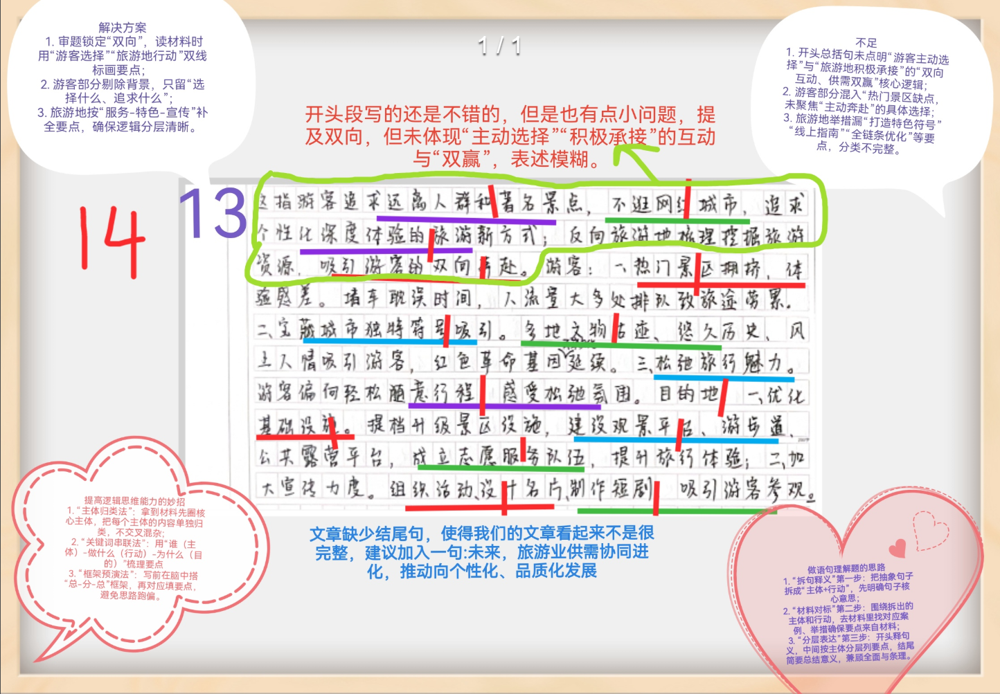
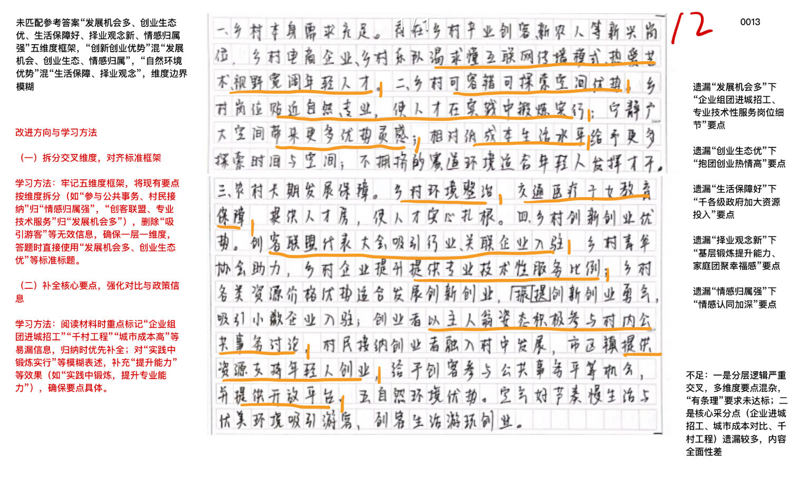
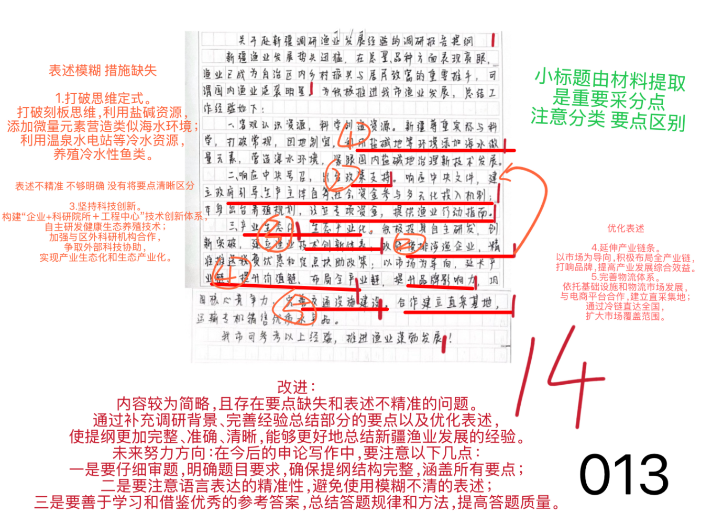
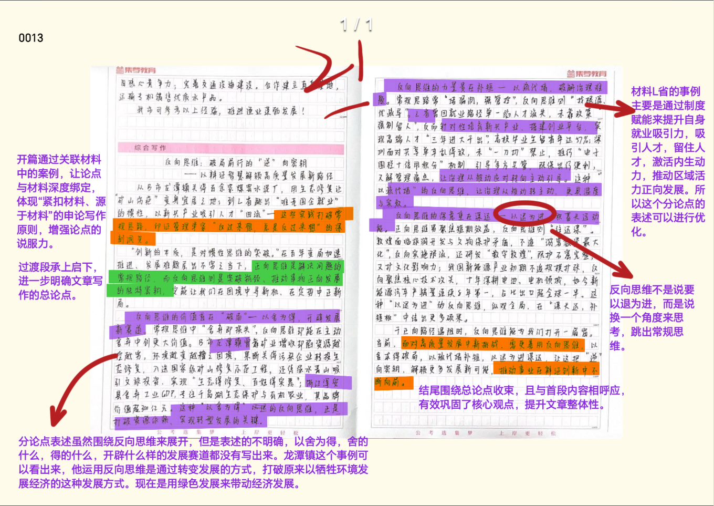

| 昵称    | Y0ungK1ng |
| ----- | --------- |
| Q1得分  | 14        |
| Q2得分  | 12        |
| Q3得分  | 14        |
| Q4得分  | 21        |
| 总分    | 61        |
| 平均分   | 59        |
| 排名    | 241       |
| 总提交人数 | 777       |

###  **一、综合分析题**::noto:banana::

| 得分  | 总分  | 区间  |
| --- | --- | --- |
| 14  | 15  | 高   |

::: tip

总分总结构

:::

::: note

总分15分。要点分13分，逻辑分2分。开头解释没有这么详细但能体现出游客和旅游地两个主体的互动，可以得1分。中间分层必须是两个层级，逻辑分2分就在这里进行赋分即可。结尾合理即可。

:::

::: card title="题干" icon="noto:backhand-index-pointing-right-dark-skin-tone"

**一、 “给定资料1” 中提到“反向旅游，成为了一场双向奔赴” ，请谈谈你对这句话的理解。 （15分）**

要求：全面、准确、简明、有条理；不超过250字。

:::

::: card title="答题" icon="twemoji:astonished-face"

:::

::: card title="答案" icon="typcn:tick-outline"

这句话是指**游客**主动选择（1分）小众目的地，**旅游地**积极提升服务（1分）==承接客流=={.warning}，两者良性互动，实现供需==双赢==。

一、游客的奔赴（1分）：
1. 远离人群、著名景点和网红城市，追求个性化深度体验（1分）；
2. 追求兴趣（1分）；选择拥有独特符号的旅游地（ 1分）；
3. 追求轻松、随意，松弛（1分）。

二、旅游地的奔赴（1分）：
1. ==优化服务==。完善基础设施，成立党员志愿服务队伍（1分），提供线上数字参观指南，优化全链条服务（1分）。
2. ==打造特色==。挖掘本地旅游资源，丰富文旅活动，打造特色旅游名片（1分）。
3. ==加强宣传==。梳理旅游资源，制作宣传资料（1分），吸引游客。

未来，旅游业供需协同进化，推动向个性化、品质化发展（1分）。

:::

::: card title="反思与建议" icon="line-md:compass-loop"

**一、答题内容**

理解句子含义时，注意“双向奔赴”所涉及到的游客和旅游地两个主体
分析论证要分两个层面去进一步解释，游客怎么奔赴的？旅游地怎么奔赴的？ 
- 游客“奔赴”旅游地【侧重意识层面】 【宏观】
- 旅游地“奔赴”游客【侧重行动层面】 【微观】

**二、答题逻辑**

1、开头解释含义，中间多角度分析，结尾总结或提对策。

2、分类是否清晰。

本题按照两个方向进行分类，其实就是一个游客怎么奔赴的，一个旅游地怎么奔赴的，进而佐证“双向奔赴”。

:::

###  **二、原因概括题**::noto:banana::

| 得分  | 总分  | 区间  |
| --- | --- | --- |
| 12  | 20  | 中   |

::: card title="题干" icon="noto:backhand-index-pointing-right-dark-skin-tone"

**二、近年来，年轻人从城市到乡村就业的现象逐渐增多。请根据“给定资料2” ，分析这种现象出现的原因。 （20分）**

要求：理解准确，内容全面，逻辑清晰；不超过400字。

要求：理解准确，分析透彻，条理清晰；不超过300字。

:::

::: danger

提炼的很烂,很难的分类概括题，值得多次复盘

:::

::: card title="答题" icon="twemoji:astonished-face"

:::

::: card title="答案" icon="typcn:tick-outline"

一、==发展机会多=={.warning}（1分）。

乡村企业==主动进城招工==，重点==吸纳==新媒体、电商运营等==新兴领域人才==（1分）；==吸引创客联盟、小微企业入驻==（1分），==提供专业技术性服务岗位==（1分），为青年提供大量专业对口机会，满足实践与成长需求。

二、==创业生态优=={.warning}（1分）。

城市企业探索的时间机会少成本高；==乡村资源成本低==，创客抱团==创业热情高==（ 1分）；在乡村能够==获得灵感、积累经验==（ 1分） ，为年轻人提供==容错探索空间，赛道广阔大有可为==（1分）。

三、==生活保障好=={.warning}（1分）。

各级政府==加大资源投入==（1分） ，完善交通、医疗、教育等==基础保障==（1分）；乡村==环境整治成效显著，民居整洁、生态优美==（1分），公共服务水平整体提升。

四、==择业观念新=={.warning}（1分）。

部分人==倾向选择专业对口、实践性强的岗位==（1分），==通过基层锻炼提升能力==（1分）；部分年轻人==主动选择慢节奏的乡村生活，更看重家庭团聚与生活幸福感==（1分）。

五、==情感归属强=={.warning}（1分）。

乡村为创业者提供开放平台（1分），共同参与乡村建设，认可年轻人价值（1分）；乡村赋予青年平等参与公共事务的机会，归属感与主人翁意识增强，情感认同加深（ 1分）。

:::

::: card title="反思与建议" icon="line-md:compass-loop"

**一、答题内容**

年轻人从城市到乡村就业的现象逐渐增多，分析原因。
注意寻找因果关系。注意不要陷入原因=对策的误区。复盘参考前文【分析原因技巧】

**二、答题逻辑**

1、解释含义的问题要注意，当题干描述非常直白且很难再进行解释时【近年来，年轻  人从城市到乡村就业的现象逐渐增多，分析这种现象出现的原因】，可省略。

2、因果关系的验证方法，因为XXXXXX所以年轻人从城市到乡村就业，不断脑海中重复。

3、分点是否合理。要点划分上，分了5个点，如果碰到这种不好分类的，先把好归类    的，独立性很强的要点圈出来，再找剩下的点的共性，进而帮助分点。

:::

###  **三、公文写作题**::noto:banana::

| 得分  | 总分  | 区间  |
| --- | --- | --- |
| 14  | 25  | 低   |

::: warning

背景写太多了。

提纲小标题太重要了！

:::

::: tip

总分25分。要点分23分，逻辑分2分。本题两种写法都可以，只要有总分结构能形成提纲即可。主要经验的5个帽子几乎都是来自于材料原文，赋分会高一些，打分也可以严一些。开头介绍和结尾总结合理即可。

:::

::: card title="题干" icon="noto:backhand-index-pointing-right-dark-skin-tone"

**三、近期，S市将评选全市社会治理创新典型案例。请根据“给定资料4” ，撰写一篇关于“滨海模式”的案例摘要，参加评选。（25分）**

要求：紧扣材料，内容全面，重点突出，结构完整；不超过400字。

:::

::: card title="答题" icon="twemoji:astonished-face"

:::

::: card title="答案" icon="typcn:tick-outline"

关于新疆渔业发展经验的调研报告提纲（1分）

一、**调研背景**：新疆渔业发展势头迅猛，总量、品种表现亮眼，成为乡村振兴重要推手，是渔业“逆袭明星”（1分）。

二、**主要经验**：
1. ==打破思维定式==（2分）。打破刻板思维，利用盐碱资源，添加微量元素营造类似海水环境（1分）；利用温泉水电站等冷水资源，养殖冷水性鱼类（1分）。
2. ==强化政策支持==（2分）。借力中央政策，设立专项资金，编制养殖规划，指导渔业发展（1分）；摸排涉渔企业， 精准推送优惠扶助政策（1分）。
3. ==坚持科技创新==（2分）。构建“==企业+科研院所+工程中心=={.info}”技术创新体系，自主研发健康生态养殖技术（1分）；加强与区外科研机构合作，争取外部科技协助，实现产业生态化和生态产业化（1分）。
4. ==延伸产业链条==（2分）。以市场为导向，积极布局全产业链（1分），打响品牌，提高产业发展综合效益（1分）。
5. ==完善物流体系==（2分）。依托基础设施和物流市场发展，与电商平台合作，建立直采集地（1分）；通过冷链直达全国，扩大市场覆盖范围（1分）。

三、**调研建议**：学习新疆经验，打破刻板思维，不墨守成规，推动本地渔业高质量发展（1分）。

:::

::: card title="反思与建议" icon="line-md:compass-loop"

**一、答题内容**

- 提纲特性：
	- 纲要性：纲目，要点
	- 条理性：分条书写

为学习新疆积极推进渔业发展的经验，某市组团赴新疆调研考察。核心要素为【经验】

关键词：打破思维定式、政策支持、科技创新、延伸产业链、完善物流体系

**二、答题逻辑**

1、格式：标题+正文；

2、内容：

- 开头简述背景；
- 中间描述经验；
- 结尾总结评价。

3.常见类型：

- 汇报提纲：用于向上级汇报工作，包含基本情况、问题及对策；
- 讲话提纲：辅助演讲，列出要点或分阶段内容；
- 写作提纲：规划文章结构，如开头、主体、结尾及核心论点；

4.注意调研报告提纲和调研提纲的区别【见前文】

:::

###  **四、大写作**::noto:banana::

| 得分  | 总分  | 区间  |
| --- | --- | --- |
| 21  | 40  | 中   |

::: tip

- 本题写作核心是反向思维，只要全篇都在论证“反向思维 ”的，不可判为跑题文章。分论点书写是本题难点，部分学生可能把握不好方向，有的可能仅仅参考材料4进行书写，有的可能理解不够深入。
	- 总分论点切入精准，得分24-26；
	- 如果分论点为坚持“破旧立新 ”、聚焦“供需错位 ”、善用“制度赋能 ”任意两个，得分22-24；
	- 如果分论点写政论文，即3个分论点都是反向思维的好处和重要性，得分20-22；
	- 如果分论点写策论文中的应创新、借力、试错、跨界、优化资源配置等，得分20-22.
	- 若以上分论点皆未涉及，考虑偏题文章，得分18-20；

以上只是论点基准分参考，最终得分要根据论证内容、文章结构、书写卷面进行调整。

评分档次：  高 24-26  中20-24  低16-20   跑题10-12

:::

::: card title="题干" icon="noto:backhand-index-pointing-right-dark-skin-tone"

**四、“给定资料4” 中提到“一定程度上，反向思维，也能推动事物的正向前行” ，请你深入理解这句话，联系实际，自选角度， 自拟题目，写一篇议论性文章。 （40分）**

要求：

（1）参考“给定资料” ，但不拘泥于“给定资料”；

（2）观点明确，内容充实，结构完整；

（3）语言流畅，书写清晰；

（4）字数在1000字左右。

:::

::: card title="答题" icon="twemoji:astonished-face"

:::

::: card title="答案" icon="typcn:tick-outline"

- 总论点：反向思维推动事物正向前行。
	- 过渡段：强调反向思维的重要性
	- 分论点1：反向思维需坚持“破旧立新 ”，打破路径依赖，推动经济发展模式正向转型。
	- 分论点2：反向思维应聚焦“供需错位 ”，重视需求导向，推动产业供需结构正向升级。
	- 分论点3：反向思维要善用“制度赋能 ”，激活内生动力，推动区域创新活力正向迸发。

  <h4>反向思维：解锁正向发展的密钥
</h4>

爱默生曾说：“逆向思维，是天才的标志。”当我们目睹众人挤破头涌向热门景点时，有人选择“反向旅游”寻一方静谧；当传统渔业困于“靠海吃海”的惯性，新疆在内陆养出占全国15%产量的三文鱼；当资源型城镇陷入“挖矿—污染”的死循环，龙潭镇关闭矿山变身生态景区……这些鲜活案例揭示一个真理：反向思维不是标新立异，而是跳出“顺流而下”的惯性，
以“逆向叩问”破解困局，最终推动事物向正向跃升。

在这个“唯一不变的是变化”的时代，正向思维或许能解一时之题，却难破长期之局。正如管理学家德鲁克所言：“预测未来的最好方式，就是创造未来。”而创造未来的密钥，往往藏在“反过来想”的智慧里。从个人选择到区域发展，从产业转型到社会治理，反向思维正以“破局者”的姿态，重塑着我们对“发展”的认知。

==反向思维需坚持“破旧立新” ，打破路径依赖，推动经济发展模式正向转型==。路径依赖是
发展的最大陷阱——当“挖矿=赚钱”“热门=成功”成为集体认知，往往陷入“越依赖越脆弱”  的怪圈。龙潭镇曾因矿产陷入“污水横流、塌陷频发”危机，若“边污染边治”必入死胡同。
镇党委反向决策：关矿山、修生态，废坑变湿地，发展文旅。新疆渔业亦破“内陆不养海鱼” 刻板印象，科研反向思考盐碱地模拟海水，终成全国最大内陆三文鱼基地。反向思维，破旧立新，方启新局。旧模式的“舒适区”，往往是发展的“危险区”。反向思维的本质，是跳出“路径依赖”的舒适圈，用“破坏式创新”激活新动能，才能推动经济发展模式正向转型。

==反向思维应聚焦“供需错位” ，重视需求导向，推动产业供需结构正向升级==。反向思维的智慧，在于跳出“我有什么卖什么”的惯性，以“需求倒推”实现精准供给。材料中的贾女士放弃“出国游”选择小众院落，胡先生拒绝“景点打卡”拥抱露营公园；新疆反向利用盐碱地模拟海水，满足市场对优质海鱼的需求；当饮料市场被“高糖”包围，元气森林反向洞察“无糖健康”需求，用赤藓糖醇打开千亿市场；拼多多则瞄准“下沉市场”未被满足的性价比需求，从“农村包围城市”。反向思维要求我们“从需求端出发” ，将“劣势”转化为“长板” ，反向思维的关键，是“把准需求的脉” ，让供给与需求同频共振，这样才会推动产业供需结构正向升级。

==反向思维要善用“制度赋能” ，激活内生动力，推动区域创新活力正向迸发==。反向探索往往伴随风险——人才顾虑“农村条件差” ，企业担心“试错成本高” ，创新害怕“失败被问责”。此时，反向思维要求我们“从制度端发力” ，用政策红利化解后顾之忧。蓟州区提供“人才房” 、连村打造“创客联盟” ，让城市青年“融得进、留得住” ；深圳早期通过“孔雀计划”吸引海外人才，用“宽容失败”的创新文化激活创造力；杭州为电商创业者提供“无票免税”政策，让“敢为人先”的种子生根发芽。制度的本质，是为“反向探索”提供“安全网”与“助推器”，有了制度保障，才能推动区域创新活力正向迸发。

管理学家彼得 ·德鲁克曾说：“如果你不能改变风向，那就调整船帆。”反向思维不是“反着干”，而是“逆着问题找解法”；不是“标新立异”，而是“跳出惯性开新局” 。反向思维始终是解锁正向发展的密钥，在这个充满不确定性的时代，唯有以反向思维破局，方能锚定正向未来。

:::

# 反向思维：破局前行的 “逆” 向密钥

—— 以辩证智慧解锁高质量发展新路径

  

从 B 市龙潭镇关停百余家煤窑水泥厂，用生态修复让 “矿山伤疤” 变身宜居之地；到 L 省跳出 “唯老国企就业” 的惯性，以新兴产业吸引人才 “回流”—— 这些实践打破常规思路，印证了管理学家 “反过来想，总是反过来想” 的深刻洞见。

“创新的本质，是对惯性思维的突破。” 在百年变局加速演进、发展难题层出不穷的当下，正向思维是解决问题的常规路径，而反向思维则是突破瓶颈、推动事物正向发展的独特密钥，它能让我们在困境中寻新机、在定势中开新局。

反向思维的价值首在 “破局”—— 以 “舍” 为 “得”，开辟发展新赛道。常规思维中 “舍弃即损失”，反向思维却能在主动舍弃中创更大价值。B 市龙潭镇曾靠矿业增收却陷 “资源越挖越穷、环境越变越糟” 困境，果断关停污染企业转投生态修复，入选国家级矿山修复示范工程，还凭绿水青山吸引文旅投资，实现 “生态得修复、百姓得实惠”；浙江淳安县舍弃工业 GDP，专注千岛湖生态保护与有机农业，如今 “淳安千岛湖” 品牌价值超 300 亿元，农民人均收入年均增长超 10%，“以舍换得” 正是打破资源依赖的关键。

  

反向思维的力量贵在 “补短”—— 以 “疏” 代 “堵”，破解治理难题。常规思路常 “堵漏洞、强管控”，反向思维则 “找根源、优疏导”。L 省曾因就业路径单一陷人才流失，未靠政策 “强制留人”，反而针对性培育新兴产业、搭建创业平台，实现高端人才 “三年进大于出”，高校毕业生留省率达 57%；深圳面对共享单车乱停放，未 “一刀切” 禁止，推出 “电子围栏 + 信用积分” 机制，引导多方共管，既保出行便利，又解管理痛点，让治理从 “被动应对” 转向 “主动引导”。

  

反向思维的深意重在 “谋远”—— 以 “退” 为 “进”，积蓄长远动能。正向思维易聚焦短期效益，反向思维则 “往远谋”。敦煌面临旅游开发与文物保护矛盾，不追 “游客数量最大化”，反向实施限流，还研发 “数字敦煌”，既护石窟完整，又扩文化影响力；我国新能源产业初期不追规模扩张，反向聚焦核心技术攻关，十年深耕电池、电机领域，如今新能源汽车产销量连续 8 年全球第一，出口占比超全球一半，正是 “谋长远” 反向思维的成果。

  

“道在日新，艺亦须日新。” 反向思维不是对正向思维的否定，而是对常规思路的补充与升华。从 B 市的生态修复到 L 省的人才回流，从淳安的 “舍工业” 到敦煌的 “限游客”，这些实践无不证明：在正向路径遇阻时，反向思维能为我们打开 “另一扇窗”。当前，面对高质量发展中的新挑战，我们更需善用反向思维，以 “舍” 求 “得” 破局、以 “疏” 代 “堵” 补短、以 “退” 为 “进” 谋远，让这把 “逆” 向密钥，解锁更多发展新可能，推动事业在辩证创新中不断向前。