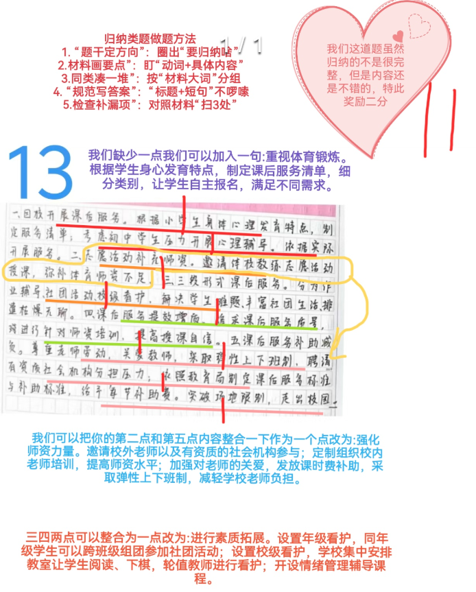
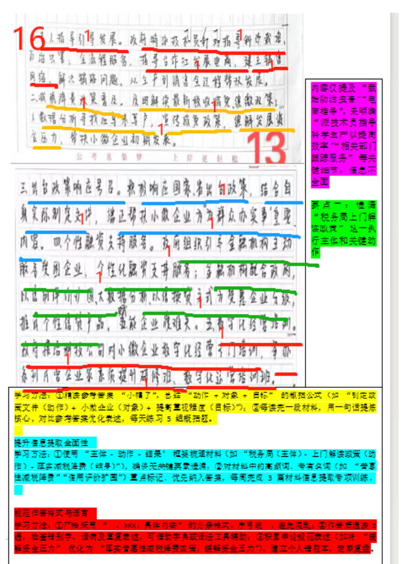
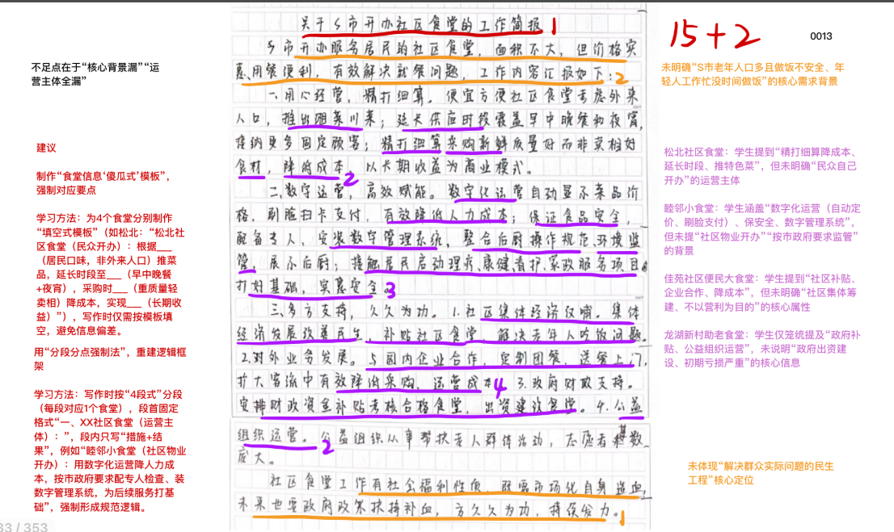
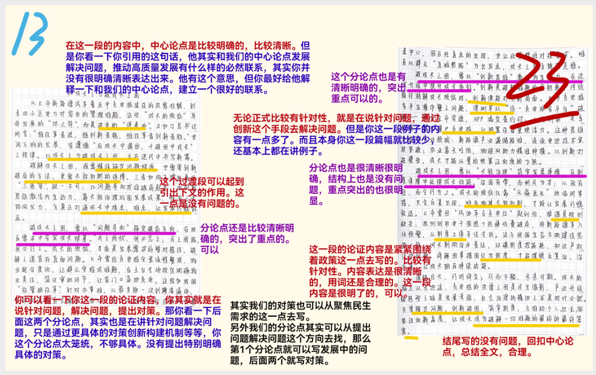

| 昵称    | Y0ungK1ng |
| ----- | --------- |
| Q1得分  | 11        |
| Q2得分  | 16        |
| Q3得分  | 17        |
| Q4得分  | 23        |
| 总分    | 67        |
| 平均分   | 58        |
| 排名    | 166       |
| 总提交人数 | 811       |

###  **一、举措概括题**::noto:banana::

| 得分  | 总分  | 区间  |
| --- | --- | --- |
| 11  | 15  | 中   |

::: tip

总分总结构

:::

::: note 

总分15分。归纳分3分，未归纳0分，归纳得不是很好酌情1-3分。归纳如参
考答案一、二形式均可。要点分12分。

:::

::: card title="题干" icon="noto:backhand-index-pointing-right-dark-skin-tone"

**一、根据给定资料1，归纳H市的中小学校在开展课后服务方面的主要举措。（15分）**

要求： 

（1）准确全面； 

（2）==分条列出==； 

（3）不超过250字。

:::

::: card title="答题" icon="twemoji:astonished-face"

:::

::: card title="答案" icon="typcn:tick-outline"

一、**学生方面**。
1. 课业辅导。设置班级看护，学生在教室写作业，轮值教师辅导。 （2分）
2. 体育锻炼。根据学生身心发育特点，制定课后服务清单，细分类别，让学生自主报名，满足不同需求（1.5分）。
3. 素质拓展。设置年级看护，同年级学生可以跨班级组团参加社团活动（2分）；设置校级看护，学校集中安排教室让学生阅读、下棋（2分），轮值教师进行看护；开设情绪管理辅导课程（1分）。

二、**教师方面**。
1. 减轻负担。邀请校外老师以及有资质的社会机构参与（1 分）。
2. 组织培训。定制组织校内老师培训，提高师资水平（0.5分）；
3. 加强关爱。发放课时费补助，采取弹性上下班制（2分）。

:::

::: card title="反思与建议" icon="line-md:compass-loop"

**普通型**：

一、宏观概括词。1、要点。2、要点。3、要点。

二、宏观概括词。1、要点。2、要点。3、要点。

**进阶型**：（不强求使用，有时候会很浪费格子；若使用，小帽子尽量用4字的，节省格子。）	

一、宏观概括词。1、小帽子：要点。2、小帽子：要点。3、小帽子：要点。

二、宏观概括词。1、小帽子：要点。2、小帽子：要点。3、小帽子：要点。

【注意】如果考试实在不会归纳，那么提炼小帽子则是底线！	

1、小帽子：要点。2、小帽子：要点。3、小帽子：要点。4、小帽子：要点。

1）==主体法==

- 个人：如群众层面、网民层面、消费者层面、
- 家庭：如家庭观念层面、家风层面
- 组织：如企业层面、学校层面、媒体层面、政府层面
- 社会：社会层面
- 国家：国家层面

【举例】

一、群众层面。1、要点。2、要点。3、要点。

二、政府层面。1、要点。2、要点。3、要点。

三、社会层面。1、要点。2、要点。3、要点。

2）==因素法==

- 人：人才、人员（人力）
- 财：资金（资金短缺、资金扶持、社会资金注入）
- 物：设施（教育设施、文化设施、执法装备、交通设施）
- 地：土地（土地撂荒、土地资源、盘活土地资源、利用闲置土地） 
- 时：时间（反应迅速、及时响应、注重时效）
- 意：观念（增强法律意识、改变落后理念、强化法制观念）      
- 技：技术（打破技术壁垒、加大技术创新、引进高新技术）      
- 法：法律（完善法律法规、顺应民意，完善法规）
- 制：制度（加强制度建设、加大制度宣传、完善制度）
- 宣：宣传（加大宣传力度、创新宣传方式、丰富宣传内容）

【举例】

一、人才方面。1、要点。2、要点。3、要点。

二、设施方面。1、要点。2、要点。3、要点。

三、制度方面。1、要点。2、要点。3、要点。

3）==辩证思维法==（不仅是归纳方法，也是分析方法的一种、尤其是原因分析） 

- 主观因素
- 客观因素

【举例】

一、主观因素。1、要点。2、要点。3、要点。

二、客观因素。1、要点。2、要点。3、要点。

:::

###  **二、经验概括题**::noto:banana::

| 得分  | 总分  | 区间  |
| --- | --- | --- |
| 16  | 20  | 高   |

::: card title="题干" icon="noto:backhand-index-pointing-right-dark-skin-tone"

**二、给定资料2介绍了F县帮扶小微企业的具体做法，请概括其主要经验，供F县在市政府召开的帮扶小微企业经验交流会上介绍。（20分）**

要求： 
（1）准确全面，普适性强； 

（2）分条列出，简洁明了； 

（3）不超过350字。

:::

::: danger

普适性

:::

::: card title="答题" icon="twemoji:astonished-face"

:::

::: card title="答案" icon="typcn:tick-outline"

一、==制定政策文件，提高重视程度==。（1分）结合上级政策，==因地制宜==制定文件，把帮扶小微企业当作为群众办实事的重要内容来抓。（3分）

二、==特派专人服务，提供专业指导==。（1分）派技术员==指导民众科学生产==（==普适化=={.info}），提高生产效率；相关部门跟踪服务，派人指导电商工作，建立销售网络，解决销售难题。（3分）

三、==积极主动作为，落实减税降费==。（1分）税务局及时上门解读最新税收减免和缓缴政策，并通过大数据分析，发现应享未享户，切实落实普惠性减税降费政策。（3分）

四、==针对生产难题，提供融资支持==。（1分）组织金融机构主动服务受困企业，进行信用评价扩围，运用大数据技术、以信换贷，扩大受惠企业范围，推出个性化信贷产品，解决融资难题。（3分）

五、==定位群众需求，提供专门培训==。（1分）主动接洽科技公司，选在小微企业集聚地，开展数字化经营培训，教授软件操作技能，并举办系列民营企业家素质提升研修班。（3分）

:::

::: card title="反思与建议" icon="line-md:compass-loop"

**一、答题内容**

注意题干中的描述：“概括其主要经验” 。找核心做法。只要是“F县帮扶小微企业的具体做法”，都可以写。要求“普适性强” ，但这里并不是【启示】类题目，没有变换主体，是给“市政府召开的帮扶小微企业经验交流会”上使用，仍然是“小微企业”，所有普适到全部小微企业即可，不要过于宏观。

**二、答题逻辑**

1、分条罗列即可。总分明晰写帽子。

2、5个要点【政策、专业指导、减税降费、融资支持、专门培训】缺一不可，且要点节点明显，不能随便乱分。

:::

###  **三、公文写作题**::noto:banana::

| 得分  | 总分  | 区间  |
| --- | --- | --- |
| 17  | 25  | 中   |

::: warning

建议：格子足够的情况下，500+100字左右

:::

::: tip

本题的分类是最难的，也是最迷惑人的地方，直接给出了4个食堂作为例子，彼此不交叉，侧重点又有所不同的情况下，可以直接用各个食堂的名字当大帽子。也可以突出各个食堂的核心，当做小帽子。

:::

::: card title="题干" icon="noto:backhand-index-pointing-right-dark-skin-tone"

**三、根据给定资料3，就S市开办社区食堂的情况拟写一份工作简报。 （25分）**

要求：

（1）紧扣资料，内容完整； 

（2）条理清晰，语言准确； 

（3）不少于500字。

:::

::: card title="答题" icon="twemoji:astonished-face"

:::

::: card title="答案" icon="typcn:tick-outline"

关于S市开办社区食堂的工作简报（1分， 自拟标题合理也可给分）

如今，S市==老年人口占比大，而老人自己做饭麻烦且不安全，年轻人工作压力大、生活节奏快==，往往没空进厨房，物美价廉的社区食堂应运而生。==以下是S市开办社区食堂情况==。 （3分）

一、松北社区食堂：==由民众自己开办==，根据居民的饮食习惯，增加菜品，还根据需求延长供应时段，采购食材方面精打细算，降低成本，经过用心经营，销量不断增加，收益也在提升。（3分）

二、睦邻小食堂：==由社区物业开办==，按照市政府要求，配备工作人员加强日常检查。同时，安装数字管理系统，监管食堂后厨，让顾客放心。其采用数字化运营，降低了人力成本，保证了食品安全，也通过食堂近距离接触居民，为后续其他服务项目打下了基础。（4分）

三、佳苑社区便民大食堂：==由社区集体筹建==，不以营利为目的，为的是解决老年人吃饭问题。社区以集体经济收入补贴食堂，还与附近企业合作，提供定制团餐、送餐上门等服务，扩大客流，降低各环节成本，切实让居民受益。 （4分）

四、龙湖新村助老食堂：==由政府部门出资建设==，公益组织负责运营。由于价格便宜，成本较高，亏损严重，食堂运营压力大，政府安排财政资金，考核合格后给予了社区食堂补贴，缓解了经营困难。 （3分）

社区食堂是==解决群众实际问题==的一个重要途径。但是，不少社区食堂在初期单凭自身运营很难做到盈亏平衡，社区食堂既是商业机构，也带有社会福利性质，要走市场化道路，需要提升自身造血能力，也需要政府部门、社区及社会力量的支持。 （3分）

如今，S市老年人口占比大，而老人自己做饭麻烦且不安全，年轻人工作压力大、生活节奏快，往往没空进厨房，物美价廉的社区食堂应运而生。以下是S市开办社区食堂情况。

一、群众自办，精打细算。松北社区食堂由民众自己开办，根据居民的饮食习惯，增加菜品，还根据需求延长供应时段，采购食材方面精打细算，降低成本，经过用心经营，销量不断增加，收益也在提升。

二、物业开办，科学管理。睦邻小食堂由社区物业开办，按照市政府要求，配备工作人员加强日常检查。同时，安装数字管理系统，监管食堂后厨，让顾客放心。其采用数字化运营，降低了人力成本，保证了食品安全，也通过食堂近距离接触居民，为后续其他服务项目打下了基础。

三、集体筹建，加大补贴。佳苑社区便民大食堂由社区集体筹建，不以营利为目的，为的是解决老年人吃饭问题。社区以集体经济收入补贴食堂，还与附近企业合作，提供定制团餐、送餐上门等服务，扩大客流，降低各环节成本，切实让居民受益。

四、政府出资，解决困难。龙湖新村助老食堂由政府部门出资建设，公益组织负责运营。由于价格便宜，成本较高，亏损严重，食堂运营压力大，政府安排财政资金，考核合格后给予了社区食堂补贴，缓解了经营困难。

社区食堂是解决群众实际问题的一个重要途径。但是，不少社区食堂在初期单凭自身运营很难做到盈亏平衡，社区食堂既是商业机构，也带有社会福利性质，要走市场化道路，需要提升自身造血能力，也需要政府部门、社区及社会力量的支持。

:::

::: card title="反思与建议" icon="line-md:compass-loop"

**一、答题内容**

【就S市开办社区食堂的情况拟写一份工作简报】，情况二字最是迷惑人的地
方，包含内容太多，需要认真读材料查看到底写哪些要素。

**二、答题逻辑**

1、格式：标题+正文；标题建议书写自拟作文式标题。

2、内容：

- 开头简述背景；
- 中间描述材料给予的内容，即“情况”；
- 结尾可做总结，可省略。本题字数足够，且有可当结尾的总结性材料素材，有必要书写。

:::

###  **四、大写作**::noto:banana::

| 得分  | 总分  | 区间  |
| --- | --- | --- |
| 21  | 40  | 中   |

::: tip

- 材料1:没有课后服务--有了课后服务--做得很好--进一步解决“假期看护”问题

- 材料2:小微企业的发展烦恼：技术、资金、数字化经营--政府不断帮助解决   

- 材料3:没有社区食堂--有了社区食堂--出现问题：经营困难--需要解决

- 材料4:没有路--修了路--出现问题：路太窄--道路升级更宽阔了

- 材料5:没有充电桩--设置了充电桩--出现问题：设备维修等等--需要解决     

- 都在成长，也都有烦恼，但都在不断解决

都在发展，也都有问题，但都在不断解决

:::

::: card title="题干" icon="noto:backhand-index-pointing-right-dark-skin-tone"

**四、给定资料5中画线句子写道： “成长的烦恼总是在成长中化解的” ，请结合你对这句话的思考，联系实际，自选角度，自拟题目，写一篇议论文。（40分）**

要求： 

（1）立意明确，观点正确； 

（2）思路清晰，语言流畅； 

（3）参考给定资料，但不拘泥于给定资料； 

（4）1000-1200字。

:::

::: card title="答题" icon="twemoji:astonished-face"

:::

::: card title="答案" icon="typcn:tick-outline"

正视成长中的烦恼，正面发展中的问题，成长中化解烦恼，发展中解决问题，助力社会高质量发展。

分论点

1、成长的过程中总是会面临一些成长的烦恼。【问题】

2、精准定位民生需求是化解烦恼的前提。【对策】

3、政府伸出有为之手是解决问题的关键。【对策】

  <h4>成长中化解烦恼 发展中解决问题
</h4>

成长中必然会出现烦恼，发展过中必然会存在问题，这是事物发展的必然规律。但是人们不会因为害怕问题而止步不前，事物发展也不会因为害怕挑战而畏手畏脚。改革开放、“一国两制” 、脱贫攻坚……哪一个不是在发展中发现问题，进而逐步解决问题。新时代下，新兴事物层出不穷，百姓的需求也随着时代变化逐渐提高，“烦恼”必然会有，但解决“烦恼”才是根本。因此，必须正视成长中的烦恼，正面发展中的问题，成长中化解烦恼，发展中解决问题，助力社会高质量发展。

==诚然，成长的过程中总是会面临一些成长的烦恼==。改革开放以来，高速的发展带来了强劲的经济增长，但同时，也产生了一系列的问题，诸如管理水平低、制度建设滞后、服务水平不高等，这不但阻碍着产业向更高质量的方向发展，也影响着民生质量，百姓获得感、幸福感难以进一步提高。但是我们要正视这些烦恼的出现，问题也倒逼着发展的继续推进，这就需要各方面齐心协力，在成长中化解烦恼。

==精准定位民生需求是化解烦恼的前提==。百姓诉求是随着时代变化而不断变化的，这就要求我们必须精准定位民生需求，了解百姓所思所想，才能进而提升民众的生活质量。李家村一直致力于改善基础设施建设，从泥土路到水泥路，再到宽阔的沥青路，最后成为乡亲们的“致富路”，这正是在百姓不断变化的需求中找到发展的答案。因此，应该以问题为导向，深度了解百姓诉求，提前预判发展中可能存在的问题，及时解决群众难题，推动产业进一步发展，促进民生改善，这样才能助力社会高质量发展。

==政府伸出有为之手是解决问题的关键==。在明确民生需求之后，政府制定合理的政策进行引导，在很大程度上决定了能否高效解决问题。有些社区食堂运营困难、资金压力大的烦恼，政府的财政帮扶助其度过困难；k市出台相关规定，要求物业配合充电桩的建设，这只有为之手让 充电桩顺利走进小区；小微企业发展中遇到困难，政府的各项技术支持、融资政策，帮助小微企业重现活力……凡此种种，无不体现政府有为之手的重要性。因此，政府要及时针对群众问题，实施政策、采取措施、开展行动，以此来推动问题的解决。

出现烦恼，化解烦恼；出现问题，解决问题。在新时代下，各行各业都迸发出前所未有的活力，也遇到了百年不遇的问题和挑战，风险与机遇并存的时代里，必须努力前进，不惧困难， 推动产业进一步发展，促进民生改善，助力社会高质量发展。

:::

# 反向思维：破局前行的 “逆” 向密钥

—— 以辩证智慧解锁高质量发展新路径

  

从 B 市龙潭镇关停百余家煤窑水泥厂，用生态修复让 “矿山伤疤” 变身宜居之地；到 L 省跳出 “唯老国企就业” 的惯性，以新兴产业吸引人才 “回流”—— 这些实践打破常规思路，印证了管理学家 “反过来想，总是反过来想” 的深刻洞见。

“创新的本质，是对惯性思维的突破。” 在百年变局加速演进、发展难题层出不穷的当下，正向思维是解决问题的常规路径，而反向思维则是突破瓶颈、推动事物正向发展的独特密钥，它能让我们在困境中寻新机、在定势中开新局。

反向思维的价值首在 “破局”—— 以 “舍” 为 “得”，开辟发展新赛道。常规思维中 “舍弃即损失”，反向思维却能在主动舍弃中创更大价值。B 市龙潭镇曾靠矿业增收却陷 “资源越挖越穷、环境越变越糟” 困境，果断关停污染企业转投生态修复，入选国家级矿山修复示范工程，还凭绿水青山吸引文旅投资，实现 “生态得修复、百姓得实惠”；浙江淳安县舍弃工业 GDP，专注千岛湖生态保护与有机农业，如今 “淳安千岛湖” 品牌价值超 300 亿元，农民人均收入年均增长超 10%，“以舍换得” 正是打破资源依赖的关键。

  

反向思维的力量贵在 “补短”—— 以 “疏” 代 “堵”，破解治理难题。常规思路常 “堵漏洞、强管控”，反向思维则 “找根源、优疏导”。L 省曾因就业路径单一陷人才流失，未靠政策 “强制留人”，反而针对性培育新兴产业、搭建创业平台，实现高端人才 “三年进大于出”，高校毕业生留省率达 57%；深圳面对共享单车乱停放，未 “一刀切” 禁止，推出 “电子围栏 + 信用积分” 机制，引导多方共管，既保出行便利，又解管理痛点，让治理从 “被动应对” 转向 “主动引导”。

  

反向思维的深意重在 “谋远”—— 以 “退” 为 “进”，积蓄长远动能。正向思维易聚焦短期效益，反向思维则 “往远谋”。敦煌面临旅游开发与文物保护矛盾，不追 “游客数量最大化”，反向实施限流，还研发 “数字敦煌”，既护石窟完整，又扩文化影响力；我国新能源产业初期不追规模扩张，反向聚焦核心技术攻关，十年深耕电池、电机领域，如今新能源汽车产销量连续 8 年全球第一，出口占比超全球一半，正是 “谋长远” 反向思维的成果。

  

“道在日新，艺亦须日新。” 反向思维不是对正向思维的否定，而是对常规思路的补充与升华。从 B 市的生态修复到 L 省的人才回流，从淳安的 “舍工业” 到敦煌的 “限游客”，这些实践无不证明：在正向路径遇阻时，反向思维能为我们打开 “另一扇窗”。当前，面对高质量发展中的新挑战，我们更需善用反向思维，以 “舍” 求 “得” 破局、以 “疏” 代 “堵” 补短、以 “退” 为 “进” 谋远，让这把 “逆” 向密钥，解锁更多发展新可能，推动事业在辩证创新中不断向前。

# 以成长之力破成长之困 —— 在迭代中书写发展新篇

从 K 市新能源汽车普及中充电桩建设的 “供需拉锯”，到老旧小区电力扩容后的 “管理难题”，这些 “成长的烦恼” 并非发展的 “休止符”，而是进步的 “伴奏曲”。正如习总书记所言：“惟改革者进，惟创新者强，惟改革创新者胜。” 世间万物的发展，皆遵循 “在成长中遇困，于破困中成长” 的规律。以成长之力破成长之困，方在迭代中书写发展新篇。

  
破解成长之困，既需精准锚定问题根源，也需创新破局的方法，更需长效机制的保障。三者如同支撑发展的 “三角架”，缺一不可：以问题导向找准破局起点，用创新思维激活内生动力，靠长效治理巩固发展成果，唯有三者协同发力，才能真正打通成长中的堵点、难点，让发展行稳致远。

破成长之困，需以 “问题导向” 锚定破局方向，在回应需求中夯实成长根基。“民之所忧，我必念之；民之所盼，我必行之。” 成长的烦恼，本质是发展与需求的暂时错位，破解之道首在直面问题。K 市曾因充电桩安装流程繁琐、物业配合度低，让群众 “安桩” 成难题，后出台专项规定明确物业责任、简化审批环节，让 “家门口充电” 落地。这恰如我国 “放管服” 改革：针对 “办事难”，从 “最多跑一次” 到 “跨省通办”，每步改革都直击痛点。面对 “一老一小” 难题，社区嵌入式养老中心、园区托育点的出现，也让政策精准对接需求。唯有以群众 “急难愁盼” 为出发点，成长之路才能踩实走稳。

破成长之困，需以 “创新思维” 激活内生动力，在迭代升级中提升成长质效。“创新是破解发展难题的‘金钥匙’。” 传统路径难解成长烦恼时，创新便能打开新局面。K 市充电桩 “多平台操作繁” 的问题，深圳早以 “统一充电服务平台” 破解 —— 整合全市资源，一个 APP 搞定查、约、付；上海则用 “共享租赁” 盘活 “僵尸充电桩”，让闲置设备重焕活力。这种思维也适用于产业领域：新能源产业遇 “储能难”，液流电池技术实现突破；农业 “靠天吃饭”，物联网助力精准种植。以创新打破壁垒，成长才能从 “量的积累” 迈向 “质的飞跃”。

破成长之困，需以 “长效治理” 筑牢发展屏障，在制度保障中延续成长动能。“治国有常，而利民为本；从政有经，而令行为上。” 成长的烦恼若仅靠 “头痛医头” 的临时举措，只会反复出现，唯有构建长效机制，才能让发展行稳致远。K 市曾因 “汽油车占充电位” 起纠纷，根源是规则缺失；杭州则用 “电子围栏 + 阶梯收费” 破局 —— 非新能源车入位预警，高峰占用高额收费，从制度上保车位专用。这与我国生态文明建设思路一致：“河长制” 明治水责任，“双碳” 制度控能耗，知识产权法护创新。将解困举措固化为制度，才能摆脱 “反复治、治反复”，让成长拥有持续动能。

“道阻且长，行则将至；行而不辍，未来可期。” 成长的路上从无坦途，充电桩的 “供需之困” 是民生缩影，产业升级的 “转型之难” 是发展考验，社会治理的 “精细之求” 是时代必然。但正如 K 市从 “被动应对” 到 “主动破局” 的转变，只要我们锚定问题、创新破局、筑牢制度，就一定能在化解 “成长的烦恼” 中，推动个人、社会、国家迈向新高度，让 “成长” 成为破解一切难题的最终答案。