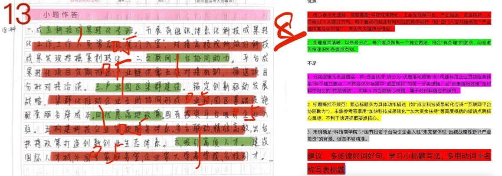
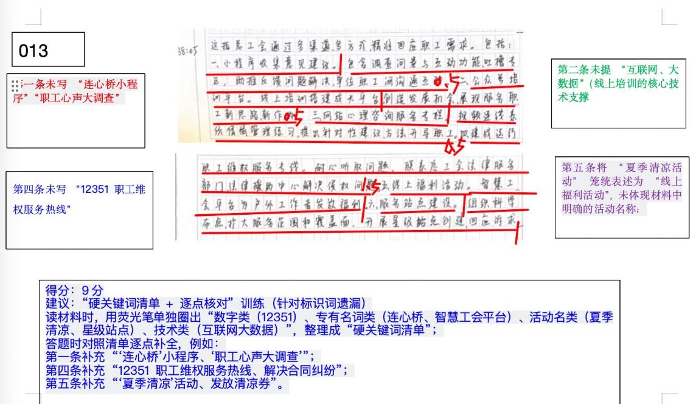
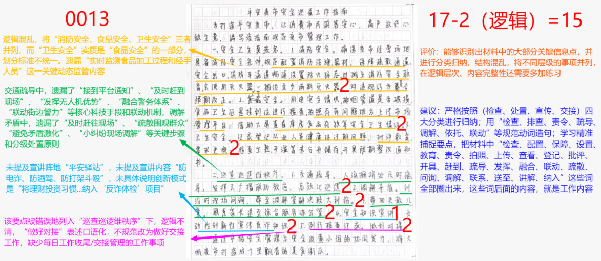
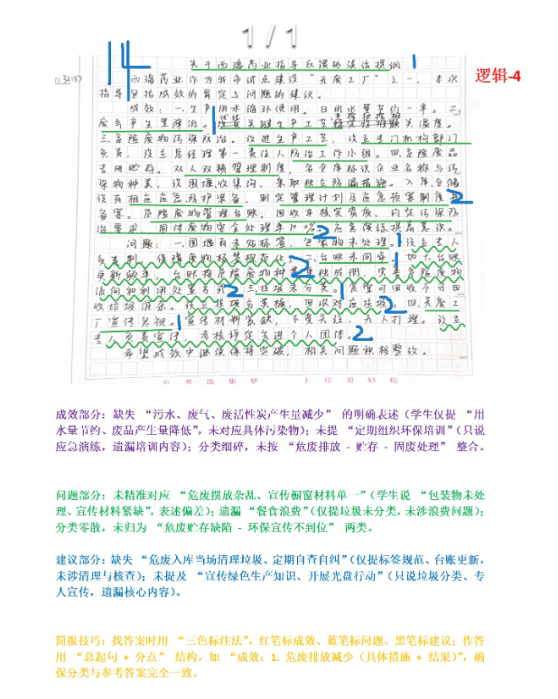
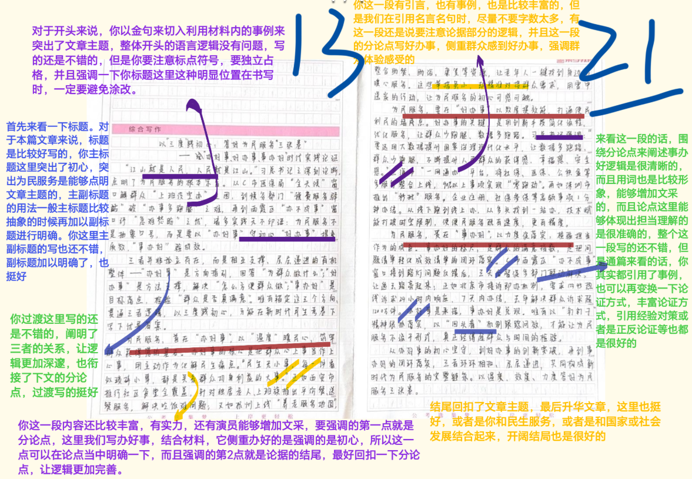

| 昵称    | Y0ungK1ng |
| ----- | --------- |
| Q1得分  | 8         |
| Q2得分  | 9         |
| Q3得分  | 15        |
| Q4得分  | 14        |
| Q5得分  | 21        |
| 总分    | 67        |
| 平均分   | 59.5      |
| 排名    | 170       |
| 总提交人数 | 949       |

###  **一、做法概括题**::noto:banana::

| 得分  | 总分  | 区间  |
| --- | --- | --- |
| 8   | 10  | 高   |

::: tip

总分总结构

:::

::: note

总分15分。要点分13分，逻辑分2分。开头解释没有这么详细但能体现出游客和旅游地两个主体的互动，可以得1分。中间分层必须是两个层级，逻辑分2分就在这里进行赋分即可。结尾合理即可。

:::

::: card title="题干" icon="noto:backhand-index-pointing-right-dark-skin-tone"

**一、请根据“给定资料1” ，概括A市积极促进高科技企业和新兴产业发展的主要做法。（10分）**

要求：全面、准确、有条理，不超过250字。

:::

::: card title="答题" icon="twemoji:astonished-face"

:::

::: card title="答案" icon="typcn:tick-outline"

1. ==加快科技成果转化==(2)。成立专班，常态化“登门入室”，对接高校院所, 做好科技成果发现、挖掘、策划、转化工作；搭建工业互联网平台(2)，建立成果转化项目定期推送、产业链供需互促对接机制。
2. ==建设产业园区集群==(2)。加强企业间互助协同，形成产业链；提供完善的基础设施和配套服务。
3. ==加大资金扶持/发展科技金融==(2)。国有投资平台投资；构建科技企业贷款服务体系；出台扶持政策，形成“基金丛林”。
4. ==汇聚全球人才==(2)。建设国际人才城，设立“外国专家服务之家”“企业家大学”，打造名校引才品牌；成立科技商学院，培养复合型人才。

评分说明：

1. 关键词每个2分，后续必须有对应的具体做法，否则只给1分；

2. 条理分1分，按上述两个参考答案分类皆可。

:::

::: card title="反思与建议" icon="line-md:compass-loop"

**一、答题内容**

5大关键词：加快科技成果转化、搭建工业互联网平台、建设产业园区集群、发  展科技金融、汇聚全球人才

**二、答题逻辑**

1. 每条要点衔接（帽子-拓展）是否自然流畅。
2. 不同要点的逻辑结构是否清晰合理。本题为“并列”关系，复盘时可思考这种逻辑顺序是否符合认知规律，是否可以有更优的排列方式；

:::

###  **二、做法概括题**::noto:banana::

| 得分  | 总分  | 区间  |
| --- | --- | --- |
| 9   | 15  | 低   |

::: card title="题干" icon="noto:backhand-index-pointing-right-dark-skin-tone"

**二、 “给定资料2” 中提到“S市总工会工作的优化，真正实现了以职工需求推动服务的新格局” ，请说明S市总工会是如何实现这种新格局的。（15分）**

要求：理解准确，内容全面，逻辑清晰。不超过250字。

:::

::: danger

提炼的很烂,很难的分类概括题，值得多次复盘

:::

::: card title="答题" icon="twemoji:astonished-face"

:::

::: card title="答案" icon="typcn:tick-outline"

1. ==倾听职工心声==(1)。开展“职工心声大调查” (1)，收集意见建议助推单位改进，增强与职工沟通互动(0.5)。
2. ==助力职工成长==(1)。依托互联网、大数据的线上培训模式(1)，为职工搭建成长平台, 创造发展机会(0.5)。
3. ==关注心理健康==(1)。提供线上心理咨询服务(1)，咨询师专业指导，帮职工从容面对压力(0.5)。
4. ==依法依规维权==(1)。运行12351职工维权服务热线(1)，对接法律服务部门，帮职工化解法律纠纷(0.5)。
5. ==提升福利体验==(1)。智慧工会平台推出“夏季清凉”活动(1)，发放清凉券，户外工作者及时获得清凉福利(0.5)。
6. ==精准回应诉求==(1)。创建“星级”站点(1)，通过特色化运营，打造服务阵地(0.5)，筑起温馨港湾。

评分说明：

1. 要点分15分，每条2.5分，不需要盖帽，写出关键词即可赋分；

2. 条理分1分，分5-6条皆可，分类混乱在要点分基础上倒扣1分。

:::

::: card title="反思与建议" icon="line-md:compass-loop"

**一、答题内容**

6大关键词：倾听职工心声、助力职工成长、关注心理健康、依法依规维权、提升福利体验、精准回应诉求

**二、答题逻辑**

1. 核心任务：说明“==如何实现==”新格局，不能单纯列举“做了什么”，而要重点概括具体措施及逻辑（其实就是==做法+效果==）；

2. 关键限定词：以“职工需求”为出发点，所有做法紧扣“职工需求” ，即措施是为了解决职工在工作、生活、技能、权益等方面的具体诉求。如：“职工心声大调查”是为了收集职工对工作环境、食堂伙食的需求；“线上培训”是为了满足职工适应数字时代的需求等。

:::

###  **三、公文写作题**::noto:banana::

| 得分  | 总分  | 区间  |
| --- | --- | --- |
| 15  | 20  | 中   |

::: warning

:::

::: card title="题干" icon="noto:backhand-index-pointing-right-dark-skin-tone"

**三、为使夜市管理工作更加规范，B市大帆夜市综合服务办公室计划编写一份“平安夜市安全巡查工作指南” ，供工作人员使用。根据“给定资料3”，请你草拟该指南中的工作事项及其相应工作内容。（20分）**

要求：
（1）紧扣资料，内容全面；

（2）工作事项明确，工作内容具体；

（3）层次分明，条目清晰，语言简洁；

（4）不超过500字。

:::

::: card title="答题" icon="twemoji:astonished-face"

:::

::: card title="答案" icon="typcn:tick-outline"

一、==消防及食品安全检查==(1)。
1. 检查经营场地配置消防设施、器材，保障疏散通道、安全出口、消防车通道畅通，设置防火标志；排查商铺用电安全、烟管道破损情况等。(2)
2. 检查食品卫生许可证、从业人员健康证合格情况，实时监测食品存放、加工过程和经手人员等情况。(2)
3. 发现问题及时记录登记、拍照上传管理平台，对违规商家进行批评教育，责令限期整改。(2)

二、==治安警情/突发事件现场处置==(1)。
1. 借助显示屏、“云”广播、口哨等工具，实现群防群治；发挥警用无人机优势，融合警务指挥体系，实时联动街边警力开展路面巡控。 (2)
2. 遇到矛盾纠纷及时赶往现场，疏散围观群众，问询当事人，避免矛盾激化，小纠纷现场调解，较大纠纷带至调解室解决。 (2)
3. 针对走散众，送往综合服务办公室，及时联系家属。 (2)

三、==组织安全知识宣讲==(1)。依托“平安驿站”讲解防电诈、防酒驾、防打架斗殴等安全常识，创新宣传模式，将理财投资习惯、金融知识测试、常用社交软件等纳入“反诈体检”项目。 (2)

四、==每日工作收尾/交接管理==(1)。例行巡查结束后，完成巡查记录(2)，做好交接工作。

:::

::: card title="反思与建议" icon="line-md:compass-loop"

**一、答题内容**

4大关键词：消防及食品安全检查、治安警情/突发事件现场处置、组织安全知识 宣讲、每日工作收尾/交接管理

**二、答题逻辑**

1. 工作事项的写法：明确、互斥、概括
工作事项是对巡查内容的大类划分，需做到“明确”（如“消防及食品安全检查 ”“组织安全知识宣讲” ）、 “互斥”（不重叠，如“安全检查”与“知识宣讲”分开） 、 “概括”（涵盖下属具体动作）。

2. 工作内容的写法：具体、可操作、有针对性
工作内容是对“工作事项”的细化说明，需结合材料中的具体场景，用“动词+宾语+要求”的结构表述（如“检查经营场地配置消防设施、器材，保障疏散通道、安全 出口、消防车通道畅通，设置防火标志” ），避免笼统表述（如“加强消防安全”）
, 需体现“怎么做”“做到什么程度”。

3. 结构要求：层次分明、条目清晰
答案需采用总分结构，先列出“工作事项” ，再分点列出“工作内容”；每个工作事项下的内容需分条列点，避免段落式冗长表述，确保阅卷人能快速抓住重点。

4. 语言风格：简洁、规范、符合公文要求
语言需简洁（避免修饰性词语，如“认真”“仔细” ），规范（使用“摊主”“巡查小组”等中性术语，避免使用“老板”等词汇） ，符合“工作指南”的公文属性。

:::

###  **四、公文写作题**::noto:banana::

| 得分  | 总分  | 区间  |
| --- | --- | --- |
| 14  | 20  | 中   |

::: warning

:::

::: tip

:::

::: card title="题干" icon="noto:backhand-index-pointing-right-dark-skin-tone"

**四、 “给定资料4” 中的指导组完成现场指导后，拟向西瑞药业负责人当面谈话反馈。请你根据“给定资料4” ，拟写一份谈话内容提纲。（20分）**

要求：

（1）成效和问题梳理全面、准确；

（2）所提改进建议具体明确，切实可行；

（3）语言简明，条理清晰；

（4）不超过450字。

:::

::: card title="答题" icon="twemoji:astonished-face"

:::

::: card title="答案" icon="typcn:tick-outline"

关于西瑞药业建设“无废工厂”的谈话提纲(1)

**一、成效：**
1. 危废排放减少。改进生产工艺，污水、废气、废活性炭产生量减少(2)；
2. 危废贮存管理规范。设立管理部门及工作小组负责；仓库各类标识清晰、设备设施完善，危废分类存放；管理制度、应急预案完善， (2)定期组织应急演练与环保培训；台账登记信息较为全面。
3. 工业固废安全处理。委托专业处置单位，约定污染防治要求。 (2)

**二、问题：**

1. 危废贮存出现管理缺陷。部分危废未贴标签、摆放杂乱；管理台账未按种类单独成册, 信息登记不全，电子版未更新、与纸质版不符。 (2)
2. 环保宣传不到位。餐食浪费、就餐垃圾未分类投放；宣传橱窗宣传材料单一，无人打理。 (2)

**三、建议：**

1. 加强危废贮存管理/严格落实危废管理制度。危废入库当场粘贴标签、清理垃圾； (2) 管理台账分类成册，完整登记信息，电子版与纸质版信息匹配、实时更新； (2)定期开展自查自纠，违者纳入考核。 (1)

2. ==强化环保宣传==。定期打理宣传橱窗，丰富宣传材料，宣传绿色生产、节约粮食、垃圾分类等知识； (2)开展光盘行动，落实生活垃圾分类。 (2)

评分说明：
1. 成效、问题要求“梳理” ，分类必须完全和答案一致，成效、问题分类不一致的每个分别扣2分逻辑分，合计4分。
2. 建议具有一定开放性，根据具体、可行等酌情赋分。

:::

::: card title="反思与建议" icon="line-md:compass-loop"

**一、核心任务：拟写谈话内容提纲**

明确提纲的实用性与针对性——它是指导组向西瑞药业负责人反馈现场指导情况 的“核心框架” ， 目的是梳理指导中发现的关键信息（成效、问题、建议） ，而非撰 写正式公文。

**二、内容结构：成效、问题、建议的逻辑闭环**

提纲需围绕“成效总结—问题指出—建议提出”三大板块展开，形成“肯定成绩 —指出不足—指引方向”的逻辑闭环。
三、特殊要求：梳理

成效和问题严格按照“参考答案”给出的层次进行分类！

:::

###  **五、大写作**::noto:banana::

| 得分  | 总分  | 区间  |
| --- | --- | --- |
| 21  | 40  | 高   |

::: tip

- 本题写作核心是反向思维，只要全篇都在论证“反向思维 ”的，不可判为跑题文章。分论点书写是本题难点，部分学生可能把握不好方向，有的可能仅仅参考材料4进行书写，有的可能理解不够深入。
	- 总分论点切入精准，得分24-26；
	- 如果分论点为坚持“破旧立新 ”、聚焦“供需错位 ”、善用“制度赋能 ”任意两个，得分22-24；
	- 如果分论点写政论文，即3个分论点都是反向思维的好处和重要性，得分20-22；
	- 如果分论点写策论文中的应创新、借力、试错、跨界、优化资源配置等，得分20-22.
	- 若以上分论点皆未涉及，考虑偏题文章，得分18-20；

以上只是论点基准分参考，最终得分要根据论证内容、文章结构、书写卷面进行调整。

评分档次：  高 24-26  中20-24  低16-20   跑题10-12

:::

::: card title="题干" icon="noto:backhand-index-pointing-right-dark-skin-tone"

**五、请你对“给定资料5” 中提到的“为群众办好事”“让群众感到好办事”“把群众的事办好”进行深入系统的思考，联系实际， 自拟题目，写一篇文章。 （35分）**

要求：

（1）观点明确，见解深刻，内容充实；

（2）参考给定资料，但不拘泥于给定资料；

（3）思想清晰、语言流畅；

（4）1000-1200字。

:::

::: card title="答题" icon="twemoji:astonished-face"

:::

::: card title="答案" icon="typcn:tick-outline"

  <h4>利民之事，丝发必兴 
——为老百姓真心办事

</h4>

“明者因时而变，知者随时而制” 。从“跑断腿”到“指尖办” ，从“盖章跑多地”到“一窗通办”……多年来，我国政务服务在改革深化中持续推进，服务模式不断创新、办事效能持续提升，使人民群众在民生事项办理中拥有更多的幸福感 、获得感、安全感。为进一步提升政务服务水平，我们应持续为群众办好事、让群众感到好办事、把群众的事办好，切实增强便民利民的精准性和实效性。

让人民生活日日向好、年年向暖，是我们矢志不渝的追求。“为群众办好事”是初心所系，“让群众感到好办事”是服务所向，“把群众的事办好”是责任所担。这些朴实无华的话语，深刻揭示了一个颠扑不破的真理：==用心用情用力解决好群众的操心事、烦心事、揪心事，是每一名共产党人共同的心愿与担当==。

==为群众办好事，就要把好事实事办到老百姓心坎上==。让人民生活幸福是“国之大者”。食品安全监管、清洁取暖、保护学生视力、提高养老院服务质量 、“厕所革命”、垃圾分类……各地党员干部倾听百姓心声，摸清实际需要，把点滴小事当成“心头大事”去做，把好事实事做到点子上、做到群众心坎上 。“我将无我，不负人民”的深厚情怀，体现在“江山就是人民，人民就是江 山”的立场中，镌刻在“让全体中国人都过上更好的日子”的行动中，贯注在“不断实现人民对美好生活的向往”的追求中。

==让群众感到好办事，就要让群众少操心，增强办事获得感==。 “办事方便吗? ”“一站式做到了吗？ ”“居民们平时都反映哪些问题比较多？ ”……新时代以来，习近平总书记在地方考察时多次走进当地的政务服务中心或便民服务大厅，察民情、听民声。 “只进一扇门”“最多跑一次”“一网通办”……近年来，各地不断推进政务服务提质增效， “办事越来越方便”成为人们的真切体验。只有持续推动政务服务焕新升级，从环节到内容都“尽精微” ，才能让群众幸福更“有感”。

==把群众的事办好，就要提高治理能力，善于集聚合力、攻坚克难==。妥善处理和解决群众的事，既是一种担当作为，又是一种能力水平。针对群众的急难愁盼，不等不推不拖、马上就办，让大家感受到困难有人帮、难题有人解。比如，一些地方开设“办不成事”窗口服务并不断优化升级，实行特事特办、急事急办，力争让难办的事情办好，尽量让“办不成的事情”也办好。实践表明, 办法总比困难多。我们要坚持主动服务、靠前服务，事不避难、义不逃责，一抓到底，就一定能造福于民，赢得信任。

习近平总书记强调：“我们的目标很宏伟，也很朴素，归根到底就是让老百姓过上更好的日子。”新征程上，以百姓心为心，切实为群众办好事、让群众感到好办事、把群众的事办好，这是共产党人应有的使命担当。

:::

# 反向思维：破局前行的 “逆” 向密钥

—— 以辩证智慧解锁高质量发展新路径

  

从 B 市龙潭镇关停百余家煤窑水泥厂，用生态修复让 “矿山伤疤” 变身宜居之地；到 L 省跳出 “唯老国企就业” 的惯性，以新兴产业吸引人才 “回流”—— 这些实践打破常规思路，印证了管理学家 “反过来想，总是反过来想” 的深刻洞见。

“创新的本质，是对惯性思维的突破。” 在百年变局加速演进、发展难题层出不穷的当下，正向思维是解决问题的常规路径，而反向思维则是突破瓶颈、推动事物正向发展的独特密钥，它能让我们在困境中寻新机、在定势中开新局。

反向思维的价值首在 “破局”—— 以 “舍” 为 “得”，开辟发展新赛道。常规思维中 “舍弃即损失”，反向思维却能在主动舍弃中创更大价值。B 市龙潭镇曾靠矿业增收却陷 “资源越挖越穷、环境越变越糟” 困境，果断关停污染企业转投生态修复，入选国家级矿山修复示范工程，还凭绿水青山吸引文旅投资，实现 “生态得修复、百姓得实惠”；浙江淳安县舍弃工业 GDP，专注千岛湖生态保护与有机农业，如今 “淳安千岛湖” 品牌价值超 300 亿元，农民人均收入年均增长超 10%，“以舍换得” 正是打破资源依赖的关键。

  

反向思维的力量贵在 “补短”—— 以 “疏” 代 “堵”，破解治理难题。常规思路常 “堵漏洞、强管控”，反向思维则 “找根源、优疏导”。L 省曾因就业路径单一陷人才流失，未靠政策 “强制留人”，反而针对性培育新兴产业、搭建创业平台，实现高端人才 “三年进大于出”，高校毕业生留省率达 57%；深圳面对共享单车乱停放，未 “一刀切” 禁止，推出 “电子围栏 + 信用积分” 机制，引导多方共管，既保出行便利，又解管理痛点，让治理从 “被动应对” 转向 “主动引导”。

  

反向思维的深意重在 “谋远”—— 以 “退” 为 “进”，积蓄长远动能。正向思维易聚焦短期效益，反向思维则 “往远谋”。敦煌面临旅游开发与文物保护矛盾，不追 “游客数量最大化”，反向实施限流，还研发 “数字敦煌”，既护石窟完整，又扩文化影响力；我国新能源产业初期不追规模扩张，反向聚焦核心技术攻关，十年深耕电池、电机领域，如今新能源汽车产销量连续 8 年全球第一，出口占比超全球一半，正是 “谋长远” 反向思维的成果。

  

“道在日新，艺亦须日新。” 反向思维不是对正向思维的否定，而是对常规思路的补充与升华。从 B 市的生态修复到 L 省的人才回流，从淳安的 “舍工业” 到敦煌的 “限游客”，这些实践无不证明：在正向路径遇阻时，反向思维能为我们打开 “另一扇窗”。当前，面对高质量发展中的新挑战，我们更需善用反向思维，以 “舍” 求 “得” 破局、以 “疏” 代 “堵” 补短、以 “退” 为 “进” 谋远，让这把 “逆” 向密钥，解锁更多发展新可能，推动事业在辩证创新中不断向前。

# 以成长之力破成长之困 —— 在迭代中书写发展新篇

从 K 市新能源汽车普及中充电桩建设的 “供需拉锯”，到老旧小区电力扩容后的 “管理难题”，这些 “成长的烦恼” 并非发展的 “休止符”，而是进步的 “伴奏曲”。正如习总书记所言：“惟改革者进，惟创新者强，惟改革创新者胜。” 世间万物的发展，皆遵循 “在成长中遇困，于破困中成长” 的规律。以成长之力破成长之困，方在迭代中书写发展新篇。

  
破解成长之困，既需精准锚定问题根源，也需创新破局的方法，更需长效机制的保障。三者如同支撑发展的 “三角架”，缺一不可：以问题导向找准破局起点，用创新思维激活内生动力，靠长效治理巩固发展成果，唯有三者协同发力，才能真正打通成长中的堵点、难点，让发展行稳致远。

破成长之困，需以 “问题导向” 锚定破局方向，在回应需求中夯实成长根基。“民之所忧，我必念之；民之所盼，我必行之。” 成长的烦恼，本质是发展与需求的暂时错位，破解之道首在直面问题。K 市曾因充电桩安装流程繁琐、物业配合度低，让群众 “安桩” 成难题，后出台专项规定明确物业责任、简化审批环节，让 “家门口充电” 落地。这恰如我国 “放管服” 改革：针对 “办事难”，从 “最多跑一次” 到 “跨省通办”，每步改革都直击痛点。面对 “一老一小” 难题，社区嵌入式养老中心、园区托育点的出现，也让政策精准对接需求。唯有以群众 “急难愁盼” 为出发点，成长之路才能踩实走稳。

破成长之困，需以 “创新思维” 激活内生动力，在迭代升级中提升成长质效。“创新是破解发展难题的‘金钥匙’。” 传统路径难解成长烦恼时，创新便能打开新局面。K 市充电桩 “多平台操作繁” 的问题，深圳早以 “统一充电服务平台” 破解 —— 整合全市资源，一个 APP 搞定查、约、付；上海则用 “共享租赁” 盘活 “僵尸充电桩”，让闲置设备重焕活力。这种思维也适用于产业领域：新能源产业遇 “储能难”，液流电池技术实现突破；农业 “靠天吃饭”，物联网助力精准种植。以创新打破壁垒，成长才能从 “量的积累” 迈向 “质的飞跃”。

破成长之困，需以 “长效治理” 筑牢发展屏障，在制度保障中延续成长动能。“治国有常，而利民为本；从政有经，而令行为上。” 成长的烦恼若仅靠 “头痛医头” 的临时举措，只会反复出现，唯有构建长效机制，才能让发展行稳致远。K 市曾因 “汽油车占充电位” 起纠纷，根源是规则缺失；杭州则用 “电子围栏 + 阶梯收费” 破局 —— 非新能源车入位预警，高峰占用高额收费，从制度上保车位专用。这与我国生态文明建设思路一致：“河长制” 明治水责任，“双碳” 制度控能耗，知识产权法护创新。将解困举措固化为制度，才能摆脱 “反复治、治反复”，让成长拥有持续动能。

“道阻且长，行则将至；行而不辍，未来可期。” 成长的路上从无坦途，充电桩的 “供需之困” 是民生缩影，产业升级的 “转型之难” 是发展考验，社会治理的 “精细之求” 是时代必然。但正如 K 市从 “被动应对” 到 “主动破局” 的转变，只要我们锚定问题、创新破局、筑牢制度，就一定能在化解 “成长的烦恼” 中，推动个人、社会、国家迈向新高度，让 “成长” 成为破解一切难题的最终答案。

# 以 “三度” 践初心：答好为民服务 “三张卷”

## —— 论 “办好事、好办事、事办好” 的时代实践路径

“江山就是人民，人民就是江山。” 习总书记的深刻论断，点明了为民服务的根本宗旨。从 C 市医保局 “全天候” 窗口解群众 “上班没空办” 之困，到税务部门 “税费服务驿站” 破 “办事多跑腿” 之难，再到雨霞区 “办不成事” 窗口纾 “急难愁盼” 之忧，诸多实践无不印证：为民服务不是抽象口号，而是要以 “办好事” 守初心、“好办事” 提质效、“事办好” 验成效。

三者并非孤立存在，而是相互支撑、层层递进的有机整体 ——“办好事” 是方向指引，回答 “为群众做什么”；“好办事” 是方法支撑，解决 “怎么方便群众做”；“事办好” 是目标落点，检验 “群众是否真满意”。唯有锚定这三个方向、贯通三者逻辑，方能在新时代的民生考卷上写下优异答案。

为民服务，首在 “办好事”，以 “温度” 暖民心，筑牢群众获得感的基石。“办好事” 的核心，是把群众的 “心上事” 当作 “上心事”，用主动作为化解民生痛点。《人民日报》曾评论：“民生无小事，每一件看似琐碎的‘小事’，都是关系群众切身利益的‘大事’。”C 市医保局党员干部带头轮岗，周末坚守窗口，对未办结业务主动跟进，让群众在 “不跑空” 中感受到政策温度；正如西安市推行 “社区食堂” 全覆盖，针对独居老人、上班族推出平价餐、送餐服务，解决 “吃饭难” 问题；又如杭州上线 “养老服务地图”，整合助餐、助浴、康复等资源，让老年人一键找到身边的暖心服务。这些举措虽小，却精准对接群众需求，用 “雪中送炭” 的行动，让为民服务的初心可感可触。

为民服务，要在 “好办事”，以 “效度” 提效能，打通便民利民的堵点。“好办事” 的关键，是用创新手段简化流程、优化服务，让群众少跑腿、数据多跑路。习近平总书记强调：“要运用大数据提升国家治理现代化水平，让数据多跑路、群众少跑腿，不断提升人民群众的获得感、幸福感、安全感。”C 市税务部门将 “税费服务驿站” 建到街道便民中心，通过远程虚拟窗口实现 “一站式” 办税，办理时间缩短至十几分钟；这让人想到上海市 “一网通办” 平台，将社保、医保、公积金等 2000 余项服务整合上线，90% 以上事项实现 “零跑动”；再如深圳市推出 “秒批” 服务，企业注册、社保参保等高频事项最快 1 分钟办结。从 “线下跑” 到 “线上办”，从 “多头找” 到 “一站办”，这些创新以技术赋能打破时空限制，让便民服务既有 “速度”，更有 “精度”。

为民服务，贵在 “事办好”，以 “力度” 促落实，检验担当作为的成色。“事办好” 的标尺，是群众的 “满意指数”，是把 “问题清单” 转化为 “成效清单” 的闭环落实。C 市雨霞区 “办不成事” 窗口接到路灯问题反馈后，三天内督促多部门联动解决，让逸云路 “亮起来”；正如北京市 “接诉即办” 机制，要求 12345 热线诉求 24 小时内响应、7 天内办结，去年解决群众诉求超 1200 万件；又如四川省推行 “民生实事项目人大代表票决制”，从项目征集到落地验收全程让群众参与，确保每一件实事都办在群众心坎上。“办好事” 是承诺，“事办好” 才是兑现。唯有以 “钉钉子” 精神狠抓落实，以 “回头看” 机制跟踪问效，才能让为民服务不流于形式，真正经得起群众和时间的检验。

从 “办好事” 的初心坚守，到 “好办事” 的创新突破，再到 “事办好” 的闭环落实，三者环环相扣、层层递进，共同构成新时代为民服务的完整链条。踏上全面建设社会主义现代化国家新征程，唯有始终把人民放在心中最高位置，以温度、效度、力度答好为民服务 “三张卷”，方能不断密切党群干群关系，凝聚起奋进新征程的磅礴力量，让现代化建设成果更多更公平惠及全体人民。