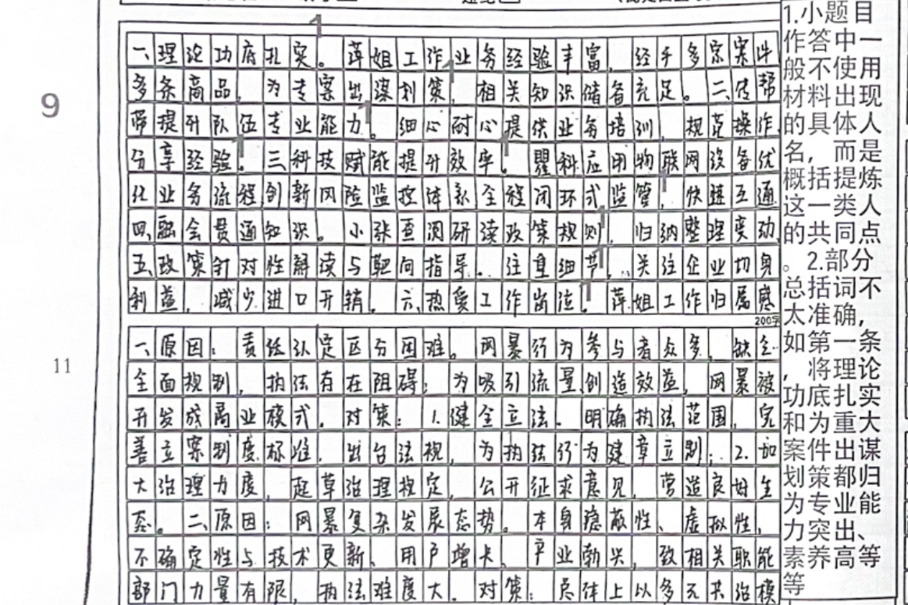
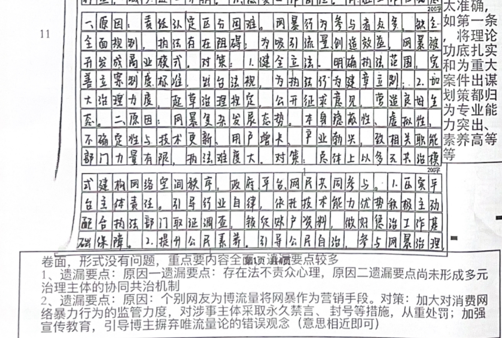
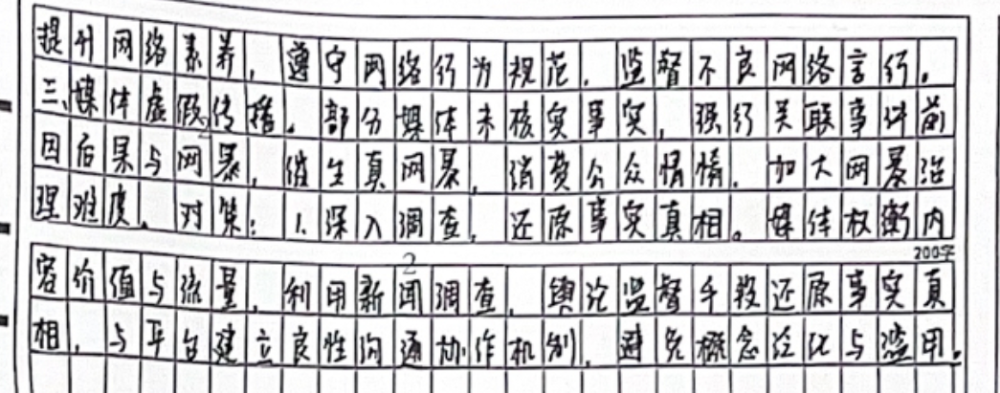
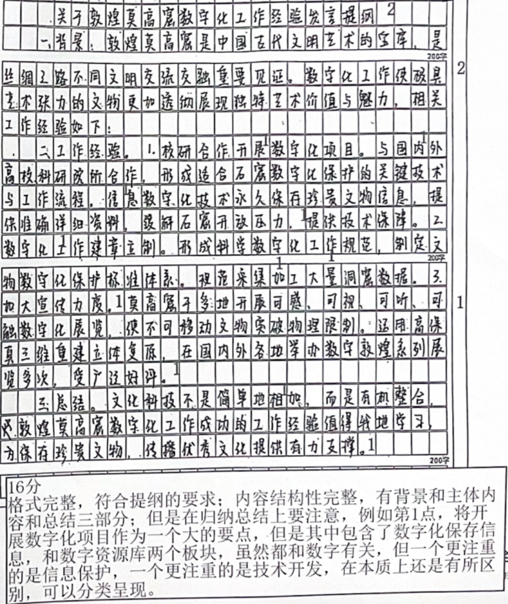
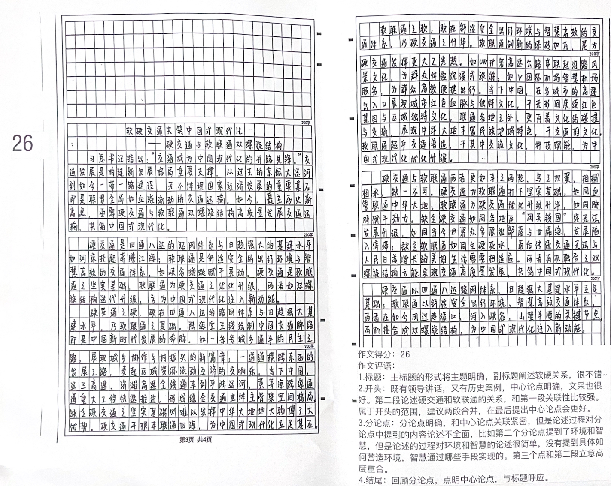

| 昵称   | Y0ungK1ng |
| ---- | --------- |
| Q1得分 | 9         |
| Q2得分 | 12        |
| Q3得分 | 12.5      |
| Q4得分 | 25        |
| 总分   | 62        |
| 平均分  | -         |
| 排名   | 255       |

::: danger

按照材料分，不要自行分点

:::

###  **一、现象概括题**::noto:banana::

| 得分  | 总分  | 区间  |
| --- | --- | --- |
| 9   | 15  | 中   |

::: danger

不够简练概括

:::

::: card title="题干" icon="noto:backhand-index-pointing-right-dark-skin-tone"

**（一）根据“给定资料 1”，归纳概括这些“守门员”能做好“国门安全小卫士”的主要原因。（15 分）**

要求：（1）全面、准确，条理清楚；（2）字数不超过 200 字。

:::

::: card title="答题" icon="twemoji:astonished-face"

:::

::: card title="答案" icon="typcn:tick-outline"

按点给分，同义表达亦可得分。总分共 15 分，具体采分点如下：

1. ==专业能力过硬==。（1 分）理论功底扎实，帮助同事解决工作问题；（1 分）为重大案件出谋划策。（1 分）

2. ==重视团队合作==。（1 分）善于分享，（1 分）通过培训开展传帮带活动，（1 分）对疑难问题进行共同研究，提升队伍专业能力和综合素质。（1 分）

3. ==极具创新思维==。（1 分）坚持科技研究，（1 分）提升海关物流智能化、自动化水平，（1 分）优化业务流程，提高工作效率，（1 分）建立起途中风险监控体系。（1 分）

4. ==工作态度勤恳==。（1 分）坚持学习最新政策文件和规则标准，（1 分）重视细节工作，引导企业合规贸易。（1 分）

:::

::: card title="反思与建议" icon="line-md:compass-loop"

:::

###  **二、综合分析题**::noto:banana::

| 得分  | 总分  | 区间  |
| --- | --- | --- |
| 11  | 20  | 中   |

::: card title="题干" icon="noto:backhand-index-pointing-right-dark-skin-tone"

**（二）请根据“给定资料 2”中提到的网络暴力乱象，梳理网络暴力执法难的主要原因，并提出相应建议。（20 分）**

要求：（1）内容全面，条理清晰；（2）建议可行、有针对性；（3）字数不超过 450字。

:::

::: danger

不要写废话

:::

::: card title="答题" icon="twemoji:astonished-face"

:::

::: card title="答案" icon="typcn:tick-outline"

**原因**：
1. “法不责众”现象的客观存在，责任认定和区分困难。（2 分）
2. 个别网友为博流量将网暴作为营销手段。（2 分）
3. 网络暴力具有隐蔽性、虚拟性、不确定性等特点，呈复杂的发展态势，尚未形成多元治理主体的协同共治机制。（2 分）
4. 部分媒体将未核实事实与网暴关联，以“假网暴”催生“真网暴”。（2 分）

**建议**：
1. ==完善法律法规==。（1 分）明确施暴者的法律责任认定和区分，（1 分）明确惩处方式，加大违法成本（1 分）。
2. ==加强管理与引导==。（1 分）加大对消费网络暴力行为的监管力度，对涉事主体采取永久禁言、封号等措施，从重处罚（1 分）；加强宣传教育，引导博主摒弃唯流量论的错误观念（1 分）。
3. ==探索政府与平台、网民的多元协同共治机制==（1 分）。科学划分治理主体权责（1 分）；压实网络平台责任，利用其技术优势配合执法部门开展取证调查等工作（1 分）；引导网民自觉维护网络文明，提升网络素养（1 分）。
4. ==媒体发挥正确导向作用==（1 分）。媒体做好内容价值和流量间的平衡，深入调查还原事实，与互联网平台建立良性沟通协作机制（1 分）。

:::

::: card title="反思与建议" icon="line-md:compass-loop"

废话连篇

:::

###  **三、公文写作题**::noto:banana::

| 得分  | 总分  | 区间  |
| --- | --- | --- |
| 16  | 25  | 中   |

::: tip

数字化

:::

::: card title="题干" icon="noto:backhand-index-pointing-right-dark-skin-tone"

**（三）外地有关部门专程到敦煌学习考察敦煌莫高窟的数字化工作经验，假如你是分享工作经验的一名工作人员，请根据“给定资料 3”，写一份发言提纲。（25 分）**

要求：

（1）内容全面，条理清晰；

（2）语言流畅，结构完整；

（3）字数不超过 450字。

:::

::: card title="答题" icon="twemoji:astonished-face"

:::

::: card title="答案" icon="typcn:tick-outline"

关于敦煌莫高窟数字化经验分享的发言提纲

一、格式（1 分）。符合应用文写作的格式规范，酌情给分。

二、结构（2 分）。正文部分按照“开头—内容”的结构书写答案，缺一项则不得分。

三、内容（20 分）。

（一）标题 2 分：写出恰当标题酌情给 1—2 分。

（二）开头 2 分：写出敦煌莫高窟开展数字化工作的背景等恰当开头，酌情给 1—2 分。

（三）主体 16 分。按点给分，同义表达亦可得分，具体采分点如下：

1. ==数字化保存信息==。（1 分）与高校和科研院所合作，形成数字化保护的关键技术和工作流程，（1 分）全面开展“数字敦煌”项目；（1 分）将文化信息数字化，进行永久存储，（1分）为学术研究和壁画保护提供助力。（1 分）
2. ==上线数字资源库==。（1 分）上线“数字敦煌”虚拟工程，（1 分）提供线上虚拟漫游体验，（1 分）打破时间、空间限制，满足人们游览、欣赏、研究等需求。（1 分）
3. ==制定数字化规范==。（1 分）形成了一套科学的敦煌壁画数字化工作规范，（1 分）制定了文物数字化保护标准体系，精准采集数据。（1 分）
4. ==举办数字化展览==。（1 分）运用模型三维重建及壁画高保真复制技术，（1 分）经过精心策划和艺术设计，实现了敦煌石窟原大高保真三维重建立体复原；（1 分）在世界各地举办展览，带给观众可感、可视、可听、可触的观展体验。（1 分）

四、语言表达（2分）。根据语言表达水平酌情给1—2分。

:::

::: card title="反思与建议" icon="line-md:compass-loop"

格式错误，给改卷造成印象差，有些采分点就会被遗漏！！

:::

###  **四、大写作**::noto:banana::

| 得分  | 总分  | 区间  |
| --- | --- | --- |
| 26  | 40  | 中   |

::: danger

:::

::: card title="题干" icon="noto:backhand-index-pointing-right-dark-skin-tone"

**（四）“给定资料 4”提到：“从‘硬交通’到‘软联通’，高质量发展的交通运输正为中国式现代化注入新动能”。请你结合对这句话的理解，参考“给定资料”，联系实际，自选角度，自拟题目，写一篇文章。（40 分）**

要求：

（1）观点明确，见解深刻；

（2）参考“给定资料”，但不拘泥于“给定资料”；

（3）思路清晰，语言流畅；

（4）字数不少于 1000 字。

:::

::: card title="答题" icon="twemoji:astonished-face"

:::

::: card title="答案" icon="typcn:tick-outline"

  <h4>“软”“硬”结合，激发交通高质量发展新动能
</h4>

“从‘硬交通’到‘软联通’，高质量发展的交通运输正为中国式现代化注入新动能。”这一说法着重强调了交通运输的重要性，交通运输作为国民经济中具有基础性、先导性、战略性的产业，其发展水平直接影响着中国现代化进程，已成为国家现代化的重要标志。而实现交通运输高质量发展的成功密码，则是中国交通运输业正在逐步从“硬交通”向“软联通”转变。“软”与“硬”的结合，推动交通运输实现高质量发展，从而为中国式现代化注入新动能。

“硬交通”为交通运输的发展提供坚实的基础。顾名思义，“硬交通”更多指的是在交通运输方面的硬件建设，包括道路、桥梁、隧道、交通枢纽等一系列基础设施。因此，铁路、公路、机场、港口等基础设施的建设是“硬交通”的主要内容。这些设施的有与无，品质的好与坏，设计的科学性与否直接决定了交通运输的发展水平。例如，铁路作为国家重要的运输方式，其基础设施的建设对国家经济发展和国防建设至关重要。港口作为水路运输的枢纽，是海上贸易和物流的重要环节，其设施的完善与否直接影响到国家的贸易往来和经济发展。从假期出行来看，铁路、公路、水路、民航发送旅客数量逐年增加。人享其行、物畅其流的背后，是日趋完善的路网体系和更加强大的基建水平。正是有了坚实的基础设施，我国交通运输业才能飞速发展，让出行“一日千里”、旅游“说走就走”成为可能。

“软联通”是保障交通运输可持续发展的重要条件。与“硬交通”相反，“软联通”指的是除却硬件设施以外的，在交通运输中起重要作用的政策制度、标准规则和管理服务等环节。随着信息技术的迅猛发展，人们对于交通运输的需求已经不再仅仅是物理空间的移动，更多地关注出行过程中是否拥有良好的出行体验。而“软联通”就是基于此，通过数字化、智能化手段提高交通运输的管理效能和服务品质。例如：铁路部门“一日一图”精准调配，动态满足短途旅客出行需求；V 国际机场通过行李智能测量机、线上注册认证等智慧服务有效助推旅客高效出行。J 省交控更是完成服务区转型升级工作，打造出一批小而美的特色主题服务区，通过运旅融合，增强特色体验。因此来看，交通运输发展到一定阶段，只有重视软联通”的提升，才能满足群众高层次的出行需求。

在交通发展中，既需要“硬交通”这一前提和基础来搭建交通骨架，也需要“软联通”这一重要条件保障交通运输可持续发展。两者相互促进，相互影响。我们应当紧密结合时代发展趋势，不断创新和发展，积极推进中国式现代化进程中高质量交通运输的建设和发展。

:::

