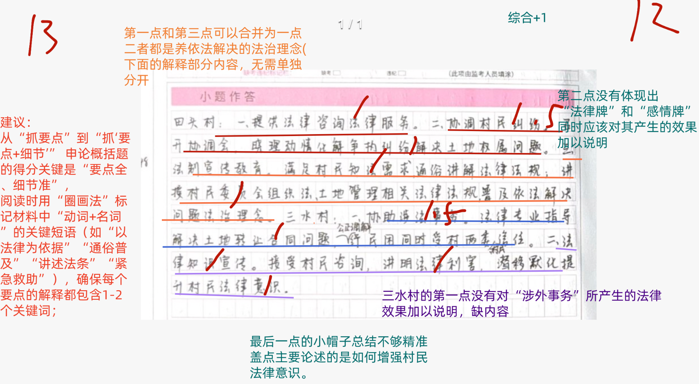
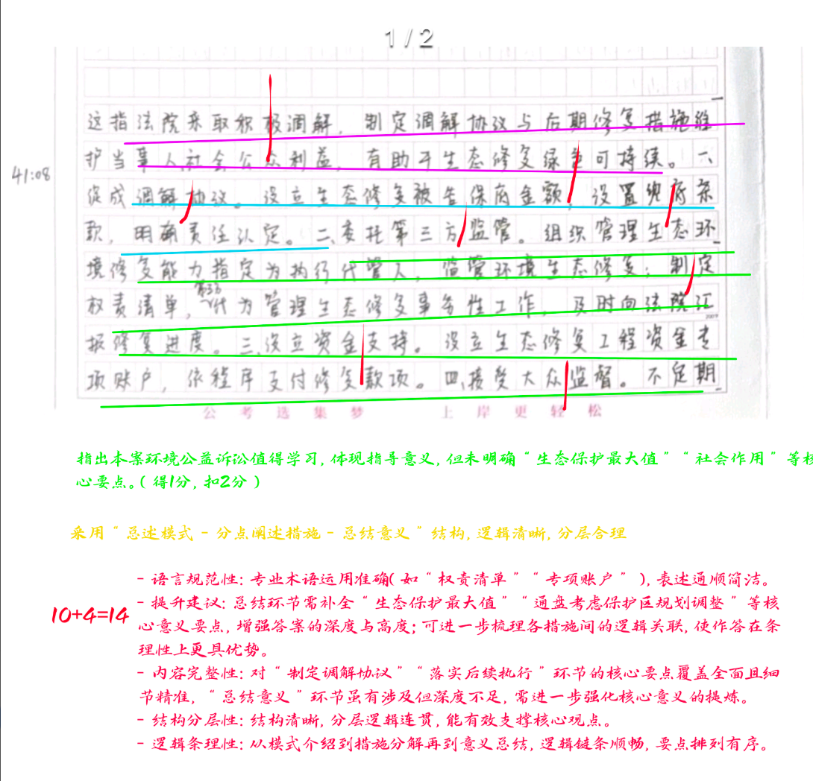
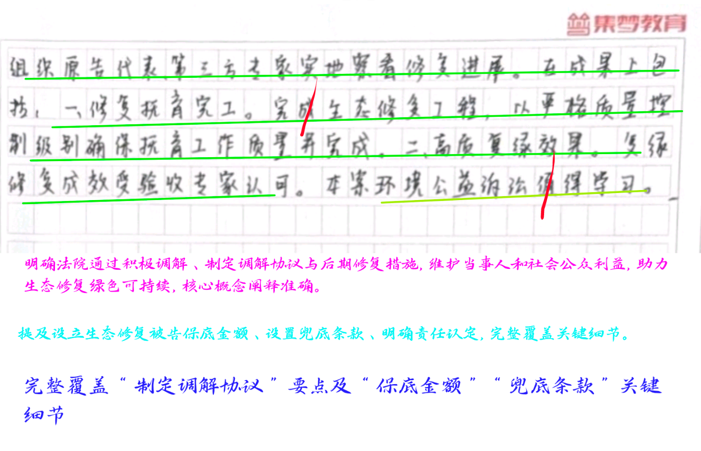
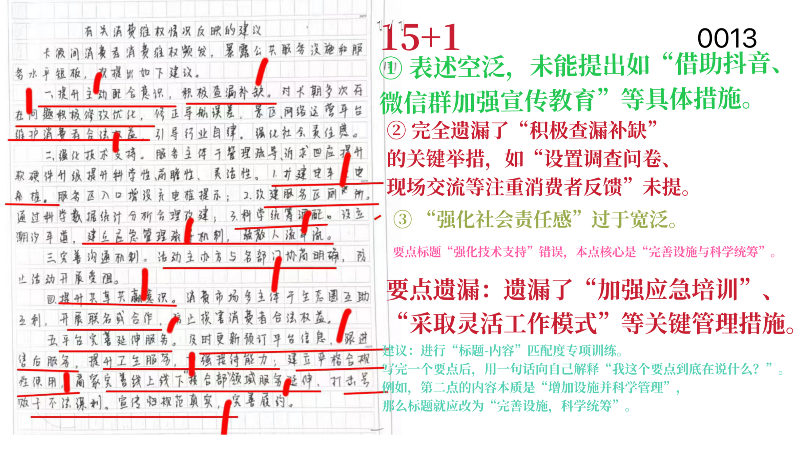
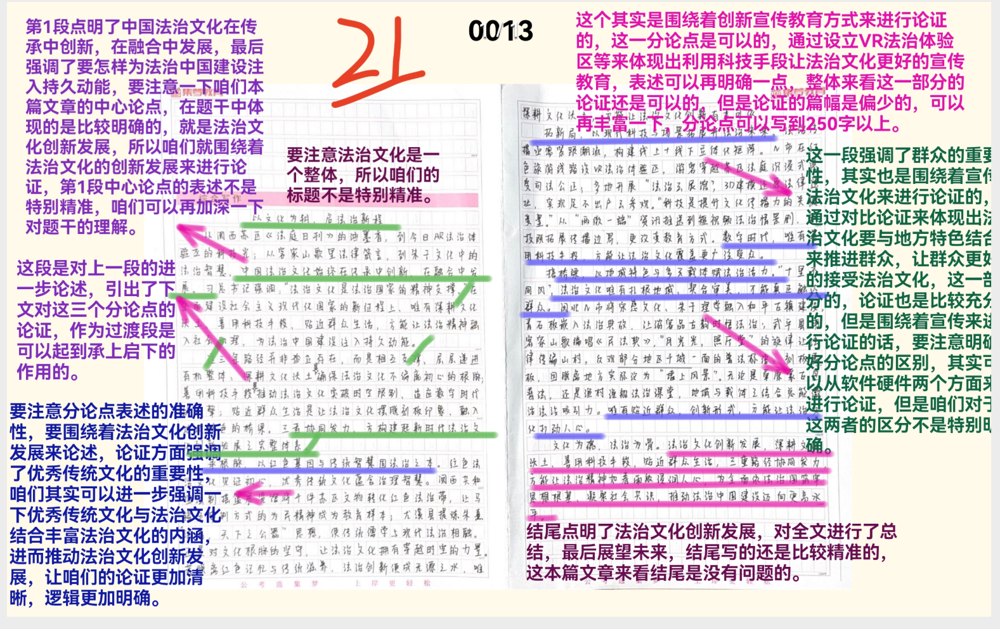

[试卷详情 | 囊中对比](https://www.srnz.net/community/studyRoom/paper/detail/556)

| 昵称    | Y0ungK1ng |
| ----- | --------- |
| Q1得分  | 12        |
| Q2得分  | 14        |
| Q3得分  | 16        |
| Q4得分  | 21        |
| 总分    | 63        |
| 平均分   | 59.5      |
| 排名    | 244       |
| 总提交人数 | 1036      |

###  **一、作用概括题**::noto:banana::

| 得分  | 总分  | 区间  |
| --- | --- | --- |
| 12  | 15  | 高   |

::: tip

总分总结构

:::

::: card title="题干" icon="noto:backhand-index-pointing-right-dark-skin-tone"

**一.根据给定资料1，请你概括法律顾问在田头村和三水村发挥的作用。（15分）**

要求：全面、准确、简明、有条理，不超过250字。

:::

::: card title="答题" icon="twemoji:astonished-face"

:::

::: card title="答案" icon="typcn:tick-outline"

**中公**：

要点分14分，综合分1分

1. ==解决矛盾纠纷、协调争执==(1.5)。打好“法律牌” ，以法律为依据公平处理法律纠纷(1)；打好“感情牌” ，促进村民和谐谦让。 (1)
2. ==培养依法解决的法治理念==(1.5)。打造法制课堂，通俗普及法律知识(1)；针对特定人群和特殊事件，针对性讲解相关法律法规(1)。
3. ==把关处理涉法事务==(1.5)。紧急救助涉及村集体和村民的重大合同问题(1)，赢得村干部与村民信任，改进治理方式和工作态度(1)。
4. ==增强村民法律意识==(1.5)。耐心给村民做工作，宣传法律知识(1)，讲述法条，讲明利害，公正调解(1)，转变对法律顾问的态度。

**白鹭**：

1. 提供法律援助。提供法律咨询和服务，帮助村民避免因不懂法而造成的土地流转与房屋租赁的损失。

2. 化解土地纠纷。召开协调会，通过“法律牌”和“感情牌”，使村民以和为贵、互相谦让化解矛盾。

3. 提升法治理念。开展法制课，满足村民的普法和咨询需求，带来遇到问题依法解决的法治理念。

4. 提供紧急救助。针对突发情况提供专业指导，优化治理方式与工作方法，赢得村两委信任处理涉法事务。

5. 增强法律意识。对村民违法行为深入交流讲明利害，公正调解赢得信任，靠普法增强村民法律意识。

:::

::: card title="反思与建议" icon="line-md:compass-loop"

**一、答题内容**

4大关键词：解决矛盾纠纷、树立法治理念、把关涉法事务、增强法律意识

**二、答题逻辑**

1. 每条要点衔接（帽子-拓展）是否自然流畅。
2. 不同要点的逻辑结构是否清晰合理。本题为“并列”关系，复盘时可思考这种逻辑顺序是否符合认知规律，是否可以有更优的排列方式；
3. 语言风格：简洁规范、符合概括类题目要求。语言需简洁（避免修饰性词语，如“兢兢业业”“卓有成效” ），规范（使用“公平处理矛盾”“普及法律知识”等中性术语）等。

:::

::: card title="总结答案" icon="typcn:tick-outline"

**Y0ungK1ng**：

1. 提供法律咨询法律服务。
2. 解决矛盾纠纷。召开调节会，通过“法律牌”和“感情牌”，公平解决纠纷，促进村民和谐谦让。
3. 宣传法治理念。开展法制课，通俗易懂讲解满足村民的普法和咨询需求；针对性讲授法律法规。
4. 把关涉法事务。紧急救助，专业指导解决合同问题，赢得村两委和村民信任，优化治理方式和工作方法。
5. 提升法律意识。接受村民咨询，讲明法律利害，公正调解赢得信任，转变村民态度。

:::

###  **二、综合分析题**::noto:banana::

| 得分  | 总分  | 区间  |
| --- | --- | --- |
| 14  | 20  | 中   |

::: card title="题干" icon="noto:backhand-index-pointing-right-dark-skin-tone"

**二.给定资料2中提到“这种解决方式不仅能保障当事人和社会公众的利益, 而且也实现了生态修复的可持续性。 ”请你谈谈对这句话的理解。 （20分）**

要求：准确、全面，有逻辑性，不超过300字。

:::

::: danger

:::

::: card title="答题" icon="twemoji:astonished-face"

:::

::: card title="答案" icon="typcn:tick-outline"

**集梦**：

这指法院处理环境公益诉讼时执行代管人模式(1)，积极调解，制定调解协议(1), 落实后期修复措施(1)，推进绿色司法，兼顾利益保障与生态修复可持续性(1)。表现为： (两条分层3分，综合分---逻辑、条理1分)

1. 制定调解协议。设置“保底金额”“兜底条款”，支付费用。 (2)
2. 落实后续执行：①==专业主体代管==(1)。制定权责清单，委托专业第三方管理实施事务性工作，及时汇报进度。(1) ②==资金落实到位==(1)。设立专项账户，按程序支付修复款。(1) ③==接受大众监督==(1)。不定期组织原告代表、第三方专家实地察看进度。(1) ④==确保施工质量==(1)。严控质量级别，符合设计要求；组织多方参与工程验收，一致认定合格。 (1)

因此，该方式实现了生态保护最大值(1)，通盘考虑、规划调整，发挥社会作用, (1)具有指导意义。

**私域**：

这句话是指法院在处置生态环境公益诉讼过程中不是简单的判罚了事，而是采取积极的调解。这种方式有效发挥了环境公益诉讼的社会作用，具有较强的指导意义。

在保障利益方面：一是公益组织负起责任，提起公益诉讼保障公众权益。二是法院制定调解协议，保障资金到位。促成权责双方达成协议，明确保底金额，设置兜底条款，确保修复费用充足。

在生态修复可持续性方面：一是强化执行，推进修复，执行代管人模式，委托有修复能力的第三方负责监管和实施修复工作：制定权责清单，汇报进度。二是加强质量监督，抚育管护。接受大众监督，设立专项资金账户按程序支付，严格质量控制级别，不定期组织专家实地检查，组织多方主体参与工程验收，一致认定合格。

:::

::: card title="反思与建议" icon="line-md:compass-loop"

**一、答题内容**

侧重于句子 本意解释 + 分析论证（两大层次） ，关键词要提炼精准、规范

**二、答题逻辑**

1. 作答思路： 解释（2-3行） - 分析（主体） - 评价（1-2行、分情况省略）
2. 技巧点拨：

1） “总分总”结构：开头点明核心观点（解释/判断） ，中间多角度分析（可按主 体、时间、空间等维度） ，结尾总结或提对策。但个别题目可省略结尾，按“总-分” 结构呈现答案。

2）规范表述：语言简洁，避免口语化；200字以上题目建议分条呈现，层次清晰。

3）结合材料：以材料为依据，避免主观臆断，适当引用原文关键词句。

:::

::: card title="总结答案" icon="typcn:tick-outline"

**Y0ungK1ng**：

这指法院采取积极调解，制定调解协议，落实后期修复措施，推进绿色司法，兼顾维护公众利益与生态修复可持续性。

一、保障公众利益

1. 提出公益诉讼。环保工艺组织提起诉讼保障公众利益。
2. 促成调解协议。设置“保底金额”，“兜底条款”，支付修复费用。

二、落实后续执行。

1. 专业主体代管。制定权责清单，委托有能力第三方实施事务性工作，及时汇报修复进度。
2. 资金落实到位。设立专项账户，按程序支付修复款项。
3. 接受大众监督。不定期组织原告代表、第三方专家实地察看修复进展。
4. 确保施工质量。严控质量级别，符合设计要求；结合验收意见，认定工程质量合格。

因此，该方式实现生态保护最大值，发挥环境公益诉讼社会作用，通盘考虑规划调整，具有指导意义。

:::

###  **三、公文写作题**::noto:banana::

| 得分  | 总分  | 区间  |
| --- | --- | --- |
| 16  | 25  | 中   |

::: warning

可背诵的对策大题

:::

::: tip

对策切勿空泛

:::

::: card title="题干" icon="noto:backhand-index-pointing-right-dark-skin-tone"

**三、根据给定资料3，针对S省消费市场在长假期间存在的部分问题，请拟写《消费维权情况反映》中的建议部分。 （25分）**

要求：

（1）紧扣资料，内容完整；

（2）所提建议有针对性，切实可行；

（3）不超过500字。

:::

::: card title="答题" icon="twemoji:astonished-face"

:::

::: card title="答案" icon="typcn:tick-outline"

**集梦**：

要点24分/建议偏开放，合理、具体、可行酌情赋分；综合分1分

1. ==加强配合，维护权益==。
	- ①提高主动配合意识。 (1)借助抖音、微信群、海报等加强宣传教育(1)，提升经营主体服务意识； (1)
	- ②积极查漏补缺。 (1)设置调查问卷、现场交流等，注重消费者反馈(1)，及时沟通、整改(1)。

2. ==完善设施，科学统筹==。
	- ①完善公共服务设施(1)。增加充电桩、推广错峰出行、潮汐公共厕所等设施(1)；
	- ②加强管理疏导和诉求回应(1)。参考以往节假日服务经历，预估消费者活动形势(1)；听取专家建议，科学研判实际情况，制定管理方案及应急预案； (1)加强应急培训, 采取灵活工作模式，及时应对突发状况。 (1)

3. ==深化合作，共享共赢==。
	- ①强化沟通(1)。事前沟通细致、到位(1)，妥善协商突发问题，化解矛盾冲突(1)；
	- ②==公平竞争==(1)。==尊重消费者自主选择权==(1)，==提高产品质量促进良性竞争==(1)，==净化消费生态==。

4. ==完善服务，保障质量==。
	- ①及时更新平台信息，跟进售后服务(1)；
	- ②加强业务培训，提高卫生条件、接待水平(1)；
	- ③诚信经营，秉持契约精神(1)，避免过度营销、虚假宣传(1)；
	- ④平台合规经营(1)，延伸服务，加强技术研发(1)，打击抢号行为，维护公平消费秩序。

**华图**：

1. 加强配合，协调推进。要强化相关主体的主动配合意识，充分发挥主观能动性，积极协作，查缺补漏，及时更新信息，做好事前防范，事中应对，事后改进工作。

2. 完善设施，科学统筹。要完善公共服务设施，科学统筹调配，如增加充电桩、推广错峰出行、潮汐公共厕所等灵活管理措施，同时制订好应急预案，根据出行动态图随时调整工作安排。

3. 考虑大局，共享共赢。要大力宣传共享共赢理念，引导商家平台树立积极参与国内大循环的主动责任担当意识，明确自我角色定位认识，合力提振消费信心。

4. 正确认识，科学应对。要强化商家与软件开发商的责任担当意识和可持续发展理念，积极考虑节假日消费高峰特点，积极缜密做好预案、提高运营服务的技术保障和机制保障。

5. 加强监管，提升技术。要加大监管力度，及时解决消费者诉求，严查宣传与实际不符、履约存在瑕疵问题，并加大处罚力度，对违法违规使用软件的行为加以处罚，并提升商家的技术研发能力，打通线上线下相关服务节点，加强对“接合部”领域的服务延伸，让消费生态环境在新科技的参与下充满温度。
        
:::

::: card title="反思与建议" icon="line-md:compass-loop"

**一、 核心任务：**

拟写《消费维权情况反映》中的建议部分。答案要聚焦于给出解  决问题的具体办法，且这些办法是放在《消费维权情况反映》这个特定文件语境中的， 语言风格和内容侧重点要符合该文件的要求，具有针对性和实用性。但不需要书写公文 格式。

**二、 问题来源：**

针对给定资料3中S省消费市场长假期间的部分问题。所有建议都  必须紧密围绕材料3中的问题提出，不能脱离资料自行编造问题及建议。

**三、建议对象：**

可能涉及多方主体。题干没有明确指出建议是针对哪些对象的，但 从消费市场问题的普遍性来看，建议对象可能包括商家、监管部门、消费者自身等。

:::

::: card title="总结答案" icon="typcn:tick-outline"

**Y0ungK1ng**：

1. 提升主动配合意识。借助“三微一端“加强宣传教育，提升经营主体主动服务意识；积极查漏补缺，设置调查问卷，现场交流，注重消费者反馈，及时沟通整改。
2. 完善设施科学统筹。完善公共服务设施，科学统筹调配，增加充电桩，推广错峰出行、潮汐厕所等灵活管理措施；同时听取专家意见，制定应急预防，采取灵活工作模式，及时应对突发状况。
3. 深化合作共享共赢。强化沟通，事前沟通细致到位，妥善协商突发问题，化解矛盾冲突；公平竞争，尊重消费者自主选择权，提高产品质量促进良性竞争，净化消费生态。
4. 完善服务保障质量。及时更新平台信息，跟进售后服务；加强业务培训，提高卫生条件、接待水平；诚信经营，秉持契约精神，避免过度营销、虚假宣传；平台合规经营，延申服务，加强技术研发，打击抢号行为，维护公平消费秩序。

:::

###  **四、大写作**::noto:banana::

| 得分  | 总分  | 区间  |
| --- | --- | --- |
| 21  | 40  | 中   |

::: tip

:::

::: card title="题干" icon="noto:backhand-index-pointing-right-dark-skin-tone"

**四.根据给定资料4，请以“法治文化创新发展”为主题，自拟题目，联系实际，写一篇议论性文章。 （40分）**

要求：
（1）观点明确，见解深刻；
（2）给定资料仅供参考，不得抄袭；
（3）思路清晰，语言流畅；

（4）字数在1000字左右。

:::

::: card title="答题" icon="twemoji:astonished-face"

:::

::: card title="答案" icon="typcn:tick-outline"

- 总论点：反向思维推动事物正向前行。
	- 过渡段：强调反向思维的重要性
	- 分论点1：反向思维需坚持“破旧立新 ”，打破路径依赖，推动经济发展模式正向转型。
	- 分论点2：反向思维应聚焦“供需错位 ”，重视需求导向，推动产业供需结构正向升级。
	- 分论点3：反向思维要善用“制度赋能 ”，激活内生动力，推动区域创新活力正向迸发。

  <h4>向前，向前，法治文化创新发展正当时
</h4>

四十年风雷激荡，九万里风鹏正举，法治文化在岁月流转中也迎来新的发展。曾经，一些领域法治文化氛围不浓，“信关系不信法、信人情不信法、信闹不信法”的现象普遍存在；所谓“新故相推，日生不滞” ，正如新时代“枫桥经验”依靠群众就地化解矛盾，实现自治、法治、德治相结合，焕发出新的生机活力。这让我们有足够的理由相信，法治文化创新发展的时刻到了。

社会主义法治文化是中国特色社会主义文化的重要组成部分，坚持创新发展法治文化，让人民群众在法治进步中感受更多温暖、收获更多红利，才能为完善中国特色社会主义法治体系、建设社会主义法治国家提供有力理论支撑。

==创新发展法治文化，要推陈出新，丰富法治文化内涵，实现传统文化、（区域文化）与现代文化有机融合==。法治也是一种文化，有着重如山、坚如石、明如镜、平如水的文化内涵。不久前，最高人民法院印发指导意见，要求各级人民法院深入推进社会主义核心价值观融入裁判文书释法说理，体现了中华优秀传统文化与现代法治文化的有机结合，以文化人、以文育人。再比如，在日常调解家庭伦理、邻里纠纷等案件中，往往体现传统文化与法治文化的有机结合。这既坚定了我们的文化自信，又彰显了社会主义法治文化的丰富内涵。

==创新发展法治文化需要与时偕行，探索宣传教育方式，实现法治宣传教育与群众休闲娱乐有机结合==。在==陕西咸阳，通过将法律知识、法治故事与社区秦腔表演、文艺演出等相结合，法治文化氛围更加浓厚；在广西宁明，法院开设“大榕树”普法课堂，法官深入田间地头讲解法律知识；在福建福州鼓楼区, 检察机关开设的“云课堂”覆盖辖区全部学校，通过一块块屏幕传播法治理念=={.warning}……借助多种形式和渠道，让宣传教育方式与教育对象休闲与娱乐密切相关, 社会主义法治文化正在广袤的中国大地上生根发芽、开花结果。

==创新发展法治文化需要以人为本，因地制宜解决基层事务，实现依法治理与社会和谐有机结合==。创新发展法治文化，是涉及亿万人民切身利益的伟大事业 , 人民群众是社会主义法治文化建设的主体力量和最终受益者，建设和发展什么样的法治文化，最终要看人民是否满意。我们要充分调动人民的积极性、主动性 、创造性，依法保证人民通过各种途径和形式广泛持续深入参与国家治理和社会 治理，充分激发蕴藏在人民之中的创造伟力，使全体人民都成为社会主义法治的忠实崇尚者、自觉遵守者、坚定捍卫者。

哲人石头说：“任何通往光明未来的道路都不是笔直的” ，但美好愿景终归会照入现实，我们比谁都有这个自信。法治文化创新发展肯定会伴随阵痛，但在新时代要坚定进行这场伟大革命，展现谋划改革的“全视角”、拿出担当责任的“铁肩膀”、用好具体落实的“绣花针”，我们一定可以开启法治建设新征程！

:::

