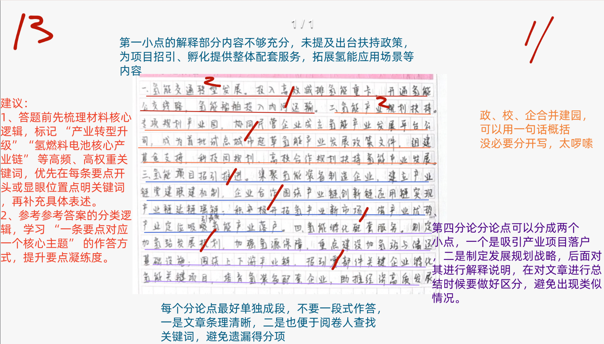
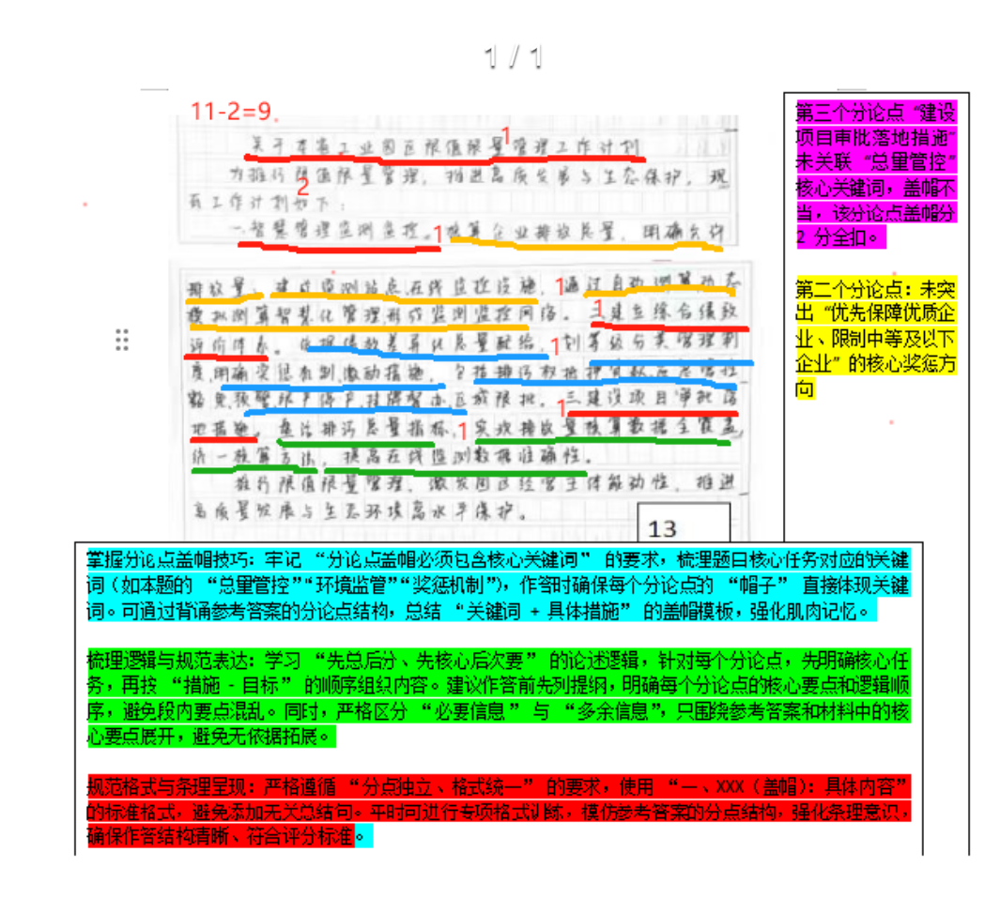
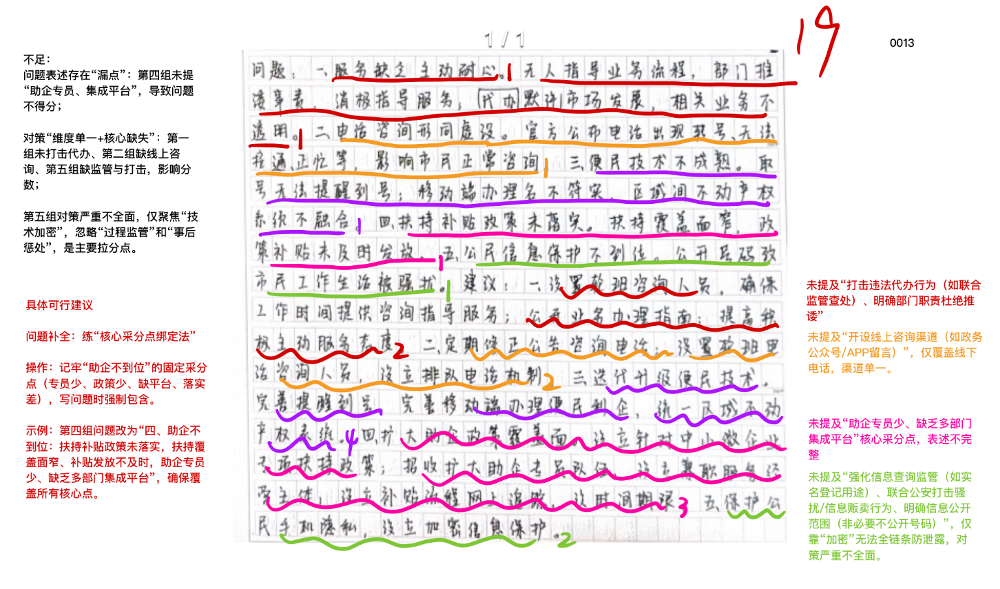
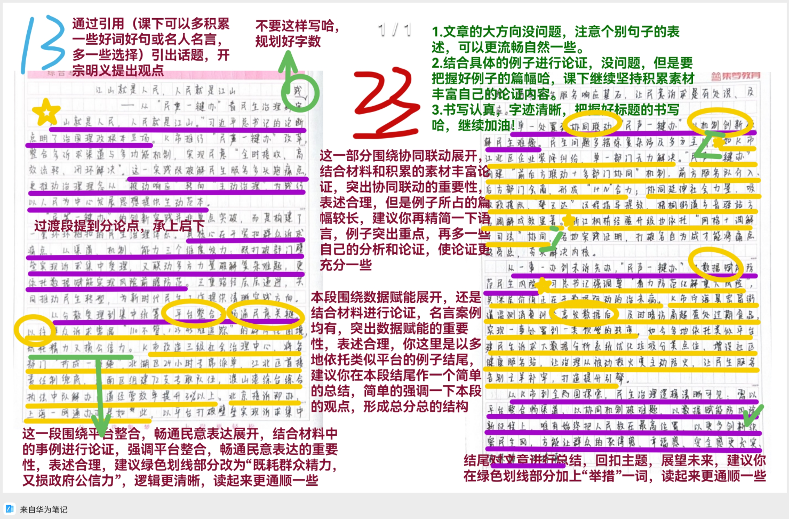

| 昵称    | Y0ungK1ng |
| ----- | --------- |
| Q1得分  | 11        |
| Q2得分  | 9         |
| Q3得分  | 19        |
| Q4得分  | 23        |
| 总分    | 62        |
| 平均分   | 56.5      |
| 排名    | 185       |
| 总提交人数 | 1354      |

###  **一、措施概括题**::noto:banana::

| 得分  | 总分  | 区间  |
| --- | --- | --- |
| 11  | 15  | 中   |

::: tip

总分总结构

:::

::: card title="题干" icon="noto:backhand-index-pointing-right-dark-skin-tone"

**一、请根据“给定资料1” ，谈谈A市是如何“氢”装前行的。（15分）**

要求：全面、准确、有条理，不超过300字。

:::

::: card title="答题" icon="twemoji:astonished-face"

:::

::: card title="答案" icon="typcn:tick-outline"

**集梦**：

1. ==推进产业转型升级==(2)。发展氢能产业/抢抓氢能发展窗口期，出台扶持政策，为项目招引、孵化提供整体配套服务，拓展氢能应用场景。 (1)
2. ==保障氢能产业落地==(2)。规划产业园，引入民间资本共建发展平台公司，参与起草产业发展相关政策文件，==政、校、企合作共建科技园=={.warning}。 (1)
3. ==深化氢能应用场景==(2)。招引推进氢能项目，推动氢能装备制造企业集聚；创新产业链党建联建机制，实现产业链延链强链。 (1)
4. ==吸引产业项目落户==(2)。产业优势深厚、产业定位清晰，吸引行业龙头企业、高端制造业外资企业等项目落户，生产车间投产使用，开展综合利用项目。 (1)
5. ==制定发展规划战略==(2)。多部门联合制定规划，提出多项重点建设任务，打造氢燃料电池核心产业链。 (1)

**评分说明**：

1. 关键词2分可不通过“小帽子”形式体现，出现在该条其他位置也可给分；
2. 除关键词外，每条具体表述1分，可根据要点数量酌情给0.5或1分；
3. 条理分1分，分类错误或整合混乱倒扣1分。

**华图**：

1. 拓展氢能应用场景。开通全市首条跨行政区域氢能公交线路，投入使用氢能重卡、氢能船舶。

2. 做好政策服务。出台产业规划、产业发展扶持政策，为产业项目招引、孵化提供整体配套服务。

3. 开展系列专项工作。完成产业园专项规划，成立产业发展平台公司，成为首批试点城市，参与起草政策文件、组建产业培育基金，共建安全和运用研究中心。

4. 招引推进氢能项目。围绕产业链、创新链、应用链，推动企业集聚；建立产业链党建联建机制，促成企业合作，实现氢能产业链的延链强链。

5. 孵化培育配套企业。将围绕上下游产业链，孵化关键项目，培育配套企业。

:::

::: card title="总结答案" icon="typcn:tick-outline"

**Y0ungK1ng**：

1. ==推进氢能转型升级==。抢抓氢能发展窗口期，开通首条跨行政区域氢能公交线路，投入使用氢能重卡、氢能船舶。
2. ==出台氢能产业规划==。规划产业园，引入民间资本共建平台公司，参与起草氢能产业发展政策文件，成立基金支持，政、校、企合作共建科技园。
3. ==招引氢能项目发展==。推动产业集聚，深化应用场景；创新产业链党建联建机制，实现产业链延链强链；开拓氢能新市场。
4. ==吸引氢能产业落户==。产业优势深厚、产业定位清晰，吸引行业龙头企业、高端制造业外资项目落户，开展综合利用项目。
5. ==孵化氢能配套服务==。多部门联合制定发展规划，提出多项重点建设任务，打造氢燃料电池核心产业链，孵化关键项目，培育配套企业。

:::

::: card title="反思与建议" icon="line-md:compass-loop"

**一、作答任务**

明确对象与主题：围绕A市推进氢能产业的做法展开，核心是概括“怎么干”的举措与路径，避免写成意义、成效或单纯定义“氢装上阵”。

**二、作答类型与表达方式**

1. 题干中的“谈谈……是如何……”强调对做法的概括+提炼，以事实性举措为主，语言要概括、凝练、条理化。
2. 表达聚焦“举措本身” ，如出台政策、搭建平台、招引项目、规划引领等，用动宾或名词化短语呈现，便于阅卷识别要点。

**三、作答形式**

分条列点或短句并列，使用简洁规范的动词与名词结构（如“出台扶持政策”“ 拓展应用场景” ），便于快速采点给分。

:::

###  **二、公文写作题**::noto:banana::

| 得分  | 总分  | 区间  |
| --- | --- | --- |
| 9   | 15  | 低   |

::: card title="题干" icon="noto:backhand-index-pointing-right-dark-skin-tone"

**二、L省打算借鉴J省工业园区限值限量管理工作做法，假如你是L省生态环境厅工作人员，请根据“给定资料2” ，拟写一份推进本省工业园区限值限量管理的工作计划。（15分）**

要求：内容全面，条理清晰，不超过300字。

:::

::: danger

:::

::: card title="答题" icon="twemoji:astonished-face"

:::

::: card title="答案" icon="typcn:tick-outline"

**集梦**：

关于推进L省工业园区限值限量管理的工作计划(1)

为打好污染防治攻坚战，推进工业园区经济高质量发展和生态环境高水平保护，制定如下方案。 (2)

一、==加强总量管控==。(2)建设大气、水环境监测站点，安装在线监控设施(1)，实现“应联尽联”智慧化管理，摸清污染物排放和碳排放总量；推进建设项目审批落地(1)，根据环境质量变化，动态调整企业允许排放量。

二、==严格环境监管==。 (2)安装自动监控检测设备(1)，在线监控数据覆盖全部企业排放口和无组织排放，并完成省级联网，统一核算方法(1)，动态模拟测算排放量。

三、==明确奖惩机制==。 (2)建立综合绩效评价体系(1)，实行划等级分类管理制度(1)，优先保障优质企业总量需求，对考核成绩中等及以下的企业进行限制。

**评分说明**：

1. 分论点关键词2分必须通过“帽子”呈现，不盖帽或者盖帽不准的2分一概不给；
2. 条理分/层次分2分，中间3条分条错误扣2分，每段段内要点混乱扣1分，两项封顶扣2分。

**华图**：

关于推进L省工业园区限值限量管理的工作计划

为协调推进我省园区经济高质量发展和生态环境高水平保护，我省拟在全省工业园推行限值限量管理，具体工作计划如下：

一、完善监控设施。建设监测站点，安装在线监控设施，实现智慧化管理，形成园区监测监控网络。

二、开展测算工作。开展基于在线监控数据的自动测算和基于自动检测数据的动态模拟测算。

三、建立考核机制。建立了一套综合绩效评价体系，实行划等级分类管理制度，明确奖惩机制。

四、严格项目审批。要在保证区域环境质量改善情况下，审批落地新项目。

五、提高数据准确性。确保在线数据全覆盖，统一核算方法。

:::

::: card title="总结答案" icon="typcn:tick-outline"

**Y0ungK1ng**：

关于推进L省工业园区限值限量管理的工作计划

为推行限值限量管理，推进高质发展和生态保护，制定方案如下。

一、建立监测监控网络。建设监测站点，安装监控设施，建成智慧环保管理平台；建成自动监控监测设备，完成省级联网。

二、开展总量核算工作。基于在线监控数据开展自动测算、动态模拟测算。

三、建立绩效考核体系。依据绩效差异化总量配给，实行划等级分类管理制度，明确奖惩机制，完善激励措施。

四、盘活排污总量指标。建设项目审批落地措施；提高在线监测数据准确性，实现核算数据全覆盖，统一核算方法。

:::

::: card title="反思与建议" icon="line-md:compass-loop"

**一、作答身份与立场**

**身份明确**：你是L省生态环境厅工作人员，这意味着工作计划需站在L省生态环境管理部门的角度来撰写，语言风格和措辞要符合政府部门工作计划的规范和专业性，体现官方、严谨、务实的特点。

**立场清晰**：要以推动L省工业园区限值限量管理工作为目标，借鉴J省经验时要结合L省实际情况，确保计划具有针对性和可操作性，能够切实解决L省工业园区在环境管理方面可能存在的问题。

**二、核心任务**

1. **任务本质**：拟写一份推进本省（L省）工业园区限值限量管理的工作计划。重点在于“推进” ，即详细规划如何开展这项工作，而不是单纯介绍J省的做法或者对限值限量管理进行理论探讨。

2. **借鉴要求**：要依据“给定资料2” 中J省工业园区限值限量管理工作的做法，从中提取适合L省的经验和做法，将其融入到L省的工作计划中，但绝不是照搬照抄，需结合L省实际情况进行调整和完善。

**三、语言表达**

1. **规范准确**：使用规范、准确、简洁的语言表达工作计划的内容。

2. **条理清晰**：内容组织要有条理，各部分之间逻辑连贯，可以采用分点、分段的方式进行表述，使计划层次分明。

:::

###  **三、对策建议题**::noto:banana::

| 得分  | 总分  | 区间  |
| --- | --- | --- |
| 19  | 25  | 中   |

::: warning

可背诵的对策大题

:::

::: card title="题干" icon="noto:backhand-index-pointing-right-dark-skin-tone"

**三、根据“给定资料3” ，梳理H市营商环境存在的问题，并提出解决建议。（30分）**

要求：

（1）全面、准确；

（2）所提建议与问题相对应，具体明确，切实可行；

（3）字数不超过400字。

:::

::: card title="答题" icon="twemoji:astonished-face"

:::

::: card title="答案" icon="typcn:tick-outline"

**集梦**：

1. ==服务缺失==(1)：无专职窗口和专人指导申报；态度差，诱骗群众购买代办服务。(1)

**建议**：提升服务质量。设置综合窗口，安排专人指导申报；将网上办理流程公示并拍摄视频指导；加强内部管理与培训，加大监督调查力度，对诱骗群众购买代办服务的工作人员进行处罚。 (4)

2. ==咨询困难==：高层次人才认定公示咨询电话无法联系。 (1)

**建议**：畅通沟通渠道。开设线上线下渠道并设置专员及时接听，建立监督机制，对投诉及时处理并反馈。 (4)

3. ==智能服务弱==：无叫号提醒功能，不动产抵押登记系统不兼容。 (1)

**建议**：更新智能设施。配置取号提醒系统；加快区和市不动产系统融合，落实抵押登记移动端办理。 (4)

4. ==助企不到位==：助企专员少，中小微企业扶持政策少；缺乏集成平台，工作人员业务不熟。 (1)

**建议**：完善助企政策。添置助企专员，完善中小微企业扶持政策并落实；搭建多部门集成平台，开展业务培训，提升办事效率。 (4)

5. ==个人信息泄露==：信息公开影响工作和生活。(1)

**建议**：加强信息保护。强化信息查询追踪，联合公安部门打击非法贩卖个人信息的黑色产业链；升级技术手段，加密储存个人信息，从源头上防止信息泄露。(4)

评分说明：

1. 问题要求“梳理”正确，必须严格按照答案进行分条、分类；分条错误直接扣5分；

2. “相对应”问题与对策必须一一对应，可以和答案一样也可以分开-上下对应，对应错误扣5分；
3. 问题每条1分、 对策每条4分，有一定开放性，根据对策的全面、操作性等酌情给分。

**中公**：

问题:
1. 服务不贴心。线下缺少业务办理窗口，流程复杂;工作人员未提供帮助指导服务意识不足，助长代办风气。
2. 咨询不通畅。官网公布的咨询电话转号或改号，无法接通或无人接听。
3. 技术不成熟。市民服务中心缺少提醒到号技术;上下级系统不融合，移动端办理不便民利企。
4. 助企服务少。助企专员覆盖面小，业务不熟、培训欠缺，缺少集成管理平台;政策落实不到位。
5. 信息被泄法人的信息网上公开后被电话短信骚扰。

建议:
1. 提升服务质量。线下开设窗口方便受理业务；简化流程，网上申报入口提供详细的办理流程温馨提示；增设贴心服务岗位，提升服务意识和能力，端正态度为市民提供帮忙指导，严禁代办行为。
2. 畅通咨询渠道。官网及时公布和更新真实有效的咨询电话号码；安排专人接听咨询电话。
3. 提升技术水平。引进先进的提醒到号技术；加速上下级系统融合，互联互通确保移动端办理便民利企
4. 增加助企服务。为中小微企业出台专门扶持政策，并督促尽快落实：匹配经营主体，适当增加助企专员数量，扩大服务覆盖面；搭建集成管理平台，加强业务培训，提高业务熟练度。
5. 保护信息安全对公开的法人信息进行脱敏处理避免泄露；健全信息泄露的追责机制。

:::

::: card title="总结答案" icon="typcn:tick-outline"

**Y0ungK1ng**：

**问题**：

1. ==服务不贴心==(1)：无专职窗口和专人指导申报；态度差，助长代办风气。(1)
2. ==咨询不通畅==：高层次人才认定公示咨询电话无法联系。 (1)
3. ==技术不成熟==：无叫号提醒功能，不动产抵押登记系统不兼容。 (1)
4. ==助企不到位==：助企专员少，中小微企业扶持政策少；缺乏集成平台，工作人员业务不熟。 (1)
5. ==个人信息泄露==：信息公开影响工作和生活。(1)

**建议**：

1. ==提升服务质量==。设置综合窗口，安排专人指导申报；将网上办理流程公示并拍摄视频指导；加强内部管理与培训，加大监督调查力度，对诱骗群众购买代办服务的工作人员进行处罚。 (4)
2. ==畅通沟通渠道==。开设线上线下渠道并设置专员及时接听，建立监督机制，对投诉及时处理并反馈。 (4)
3. ==更新智能设施==。配置取号提醒系统；加快区和市不动产系统融合，落实抵押登记移动端办理。 (4)
4. ==完善助企政策==。添置助企专员，完善中小微企业扶持政策并落实；搭建多部门集成平台，开展业务培训，提升办事效率。 (4)
5. ==加强信息保护==。升级手段加密储存个人信息；联合公安打击贩卖个人信息黑产；(4)

:::

::: card title="反思与建议" icon="line-md:compass-loop"

**一、答题内容**

关键词：服务缺失、咨询困难、智能服务弱、助企不到位、个人信息泄露

**二、答题逻辑**

1. 重要考点：梳理！--确保问题分类层次必须完全与参考答案一致。
2. 对策来源：

①直接对策：留意材料中专家、学者、政府官员的建议，政策文件的规定，以及 成功案例的经验。

②间接对策：从问题、原因反推对策。

③拓展对策：根据个人积累，对策表述要具体，具有实际可操作性，少用抽象、 笼统的语言。

:::

###  **四、大写作**::noto:banana::

| 得分  | 总分  | 区间  |
| --- | --- | --- |
| 23  | 40  | 中   |

::: tip

:::

::: card title="题干" icon="noto:backhand-index-pointing-right-dark-skin-tone"

**四、“给定资料4”提到：“‘民声一键办’接听的是民意，解决的是民生，体现的是民本，凝聚的是民心，提高的是我们服务人民的水平。”请深入思考这句话，参考给定资料，自选角度，自拟题目，写一篇文章。（45分）**

要求：

（1）观点明确，见解深刻；

（2）参考给定资料，但不拘泥于给定资料；

（3）思路清晰，语言流畅；

（4）字数1000字左右。

:::

::: card title="答题" icon="twemoji:astonished-face"

:::

::: card title="答案" icon="typcn:tick-outline"

- 总论点：反向思维推动事物正向前行。
	- 过渡段：强调反向思维的重要性
	- 分论点1：反向思维需坚持“破旧立新 ”，打破路径依赖，推动经济发展模式正向转型。
	- 分论点2：反向思维应聚焦“供需错位 ”，重视需求导向，推动产业供需结构正向升级。
	- 分论点3：反向思维要善用“制度赋能 ”，激活内生动力，推动区域创新活力正向迸发。

  <h4>千年民本意 一键总关情
</h4>

从大禹“解民之愠”到商汤“ 网开三面” ，从周公告诫“敬天保民 ”到孔子倡导“仁者爱人” ，民本思想始终是中华文明的精神基因。在数字时代的今天，“民声一键办”这一服务机制的创新实践，既是对传统民本思想的时代诠释，更开辟了数字治理的新境界。这个小小的民生服务窗口，折射出古老东方智慧与现代治理理念的深度融合。

==创新服务机制，让民意接听更高效，民生解决更精准==。 “ 民声一键办通过整合政务资源，运用现代信息技术，实现了民意的快速收集与高效处理。民众只需一键操作，便能将自身的需求与诉求直接传达至相关部门，大大缩短了政府与民众之间的距离。这种即时响应的机制，不仅提高了政府的工作效率，更确保了民生问题的及时解决。通过数据分析与智能匹配，平台能够精准识别问题的性质与紧急程度，为政府部门提供科学的决策依据，使得解决方案更加贴合民众的实际需求，实现了从“被动服务”向“主动作为”的转变。

==创新服务机制，让民本体现更显著，民心凝聚更牢固==。 “ 民声一键办”不仅是一个服务窗口，更是民本思想的生动体现。它强调了以人民为中心的服务理念，将民众的需求放在首位，通过不断优化服务流程、提升服务质量, 确保每一位民众的声音都能被听到、被重视。这种以人为本的服务态度，不仅增强了民众的获得感与满意度，更在无形中凝聚了民心，提升了政府的公信力与形象。民众在参与社会治理的过程中，感受到了自身的价值与力量, 从而更加积极地支持政府的工作，形成了政府与民众之间的良性互动。

==创新服务机制，让服务水平更高质，为民服务更有品==。 “ 民声一键办”的创新实践，不仅提高了政府的服务效率，更提升了服务的质量与品味。通过引入智能化、个性化的服务手段，平台能够根据民众的需求与偏好，提供  定制化、差异化的服务方案。这种精准化的服务模式，不仅满足了民众的多元化需求，更体现了政府对民众个体差异的尊重与关怀。同时，平台还通过  定期收集民众反馈、持续优化服务流程，确保服务品质的不断提升，为民众  提供更加优质、便捷的服务体验。

“民声一键办”的创新实践，不仅是对传统民本思想的一次深刻诠释，更是数字治理理念的一次生动实践。它以高效、精准、以人为本的服务机制 , 不仅解决了民众的燃眉之急，更在无形中凝聚了民心、提升了政府的公信力与形象。未来，相信数字技术将持续赋能社会治理，成为连接政府与民众 、传统与现代、东方与西方的重要桥梁，为全球数字治理提供宝贵的经验与 启示。

:::

# “江山就是人民，人民就是江山”：从K市“民声一键办”看民生治理创新实践

“江山就是人民，人民就是江山。”习近平总书记的论断点明了治国理政根本立场。K市推行的“民声一键办”改革，整合110非警务事项、12345热线等诉求渠道，通过7×24小时值守、分级处置、协同响应机制，实现民意“全时接收、高效流转、闭环解决”。这一实践既破解了民生服务“多头跑”痛点，更推动治理理念从“被动响应”转向“主动治理”，为践行以人民为中心的发展思想提供了生动范本。

“民声一键办”的创新实践并非单点突破，而是构建了一套环环相扣的民生治理体系。其核心在于紧扣群众诉求痛点，从渠道、机制、能力三个维度发力：既要打破部门壁垒实现诉求集中受理，又要联动多方力量破解复杂难题，更要依托数据赋能实现风险前瞻防范。这三重路径层层递进，共同推动民生治理从“被动应对”向“主动服务”转型，为新时代民生工作提供了清晰的实践方向。

从“分散受理”到“集中统筹”，平台整合是畅通民意的关键。以往群众诉求常遇“110不管、12345难追踪”的碎片化困境，既耗精力又损公信力。K市改造三级社会治理中心，将各部门渠道“拧成一股绳”，北湖区24小时专席“派单”、江北区首接责任制“兜底”，江南区组建72支专职队伍，渡山港综合执法中队解决占道经营效率提升30%以上。北京“接诉即办”、上海“一网通办”亦如此，以平台打破壁垒，筑牢民生服务“响应基石”。

从“单一处置”到“协同联动”，机制创新是破解难题的核心。民生问题多涉及多方主体，如K市江北区企业装修纠纷，单一部门无力解决。“民声一键办”构建“前后方联动+多部门协同”机制，前方服务队介入、后方部门会商，形成“1+N”合力；同时吸纳“蓝天救援队”“民声大姐”等社会力量，梧桐街道“乡音驿站”方言调解成效显著。浙江“枫桥经验”升级也依托“网格+调解+司法”协同，各地实践证明，打破“各自为战”才能将“痛点”转“亮点”，夯实“解决内核”。

从“一事一办”到“未诉先办”，数据赋能是防范风险的抓手。习近平总书记强调要“着力防范化解重大风险”，“民声一键办”的深层价值正在于数据驱动的“治未病”。K市宁海县宏昌街道监测消费纠纷高发数据后，及时暗访商超查处过期食品，实现“从一事处置到一类预警”转变。多地依托类似平台建大数据分析系统，如依据投诉热点优化垃圾分类点位、增设社区健康服务站，让治理从“被动救火”变“主动防火”，打造民生服务“提升引擎”。

从K市实践到全国探索，民生治理的逻辑清晰可见：需以平台整合畅渠道、以协同机制破难题、以数据赋能防风险。“接听民意、解决民生、体现民本、凝聚民心”，这是对“民声一键办”的诠释，更是民生工作的准则。新征程上，唯有始终把人民放在最高位置，以更多此类创新织密民生网，才能让群众的获得感、幸福感、安全感更充实、有保障、可持续。