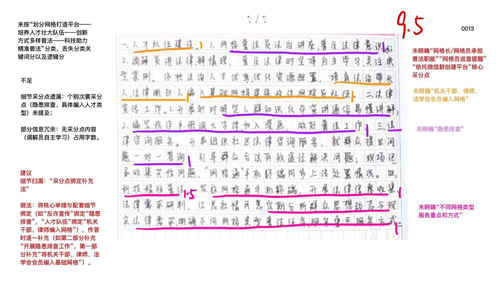
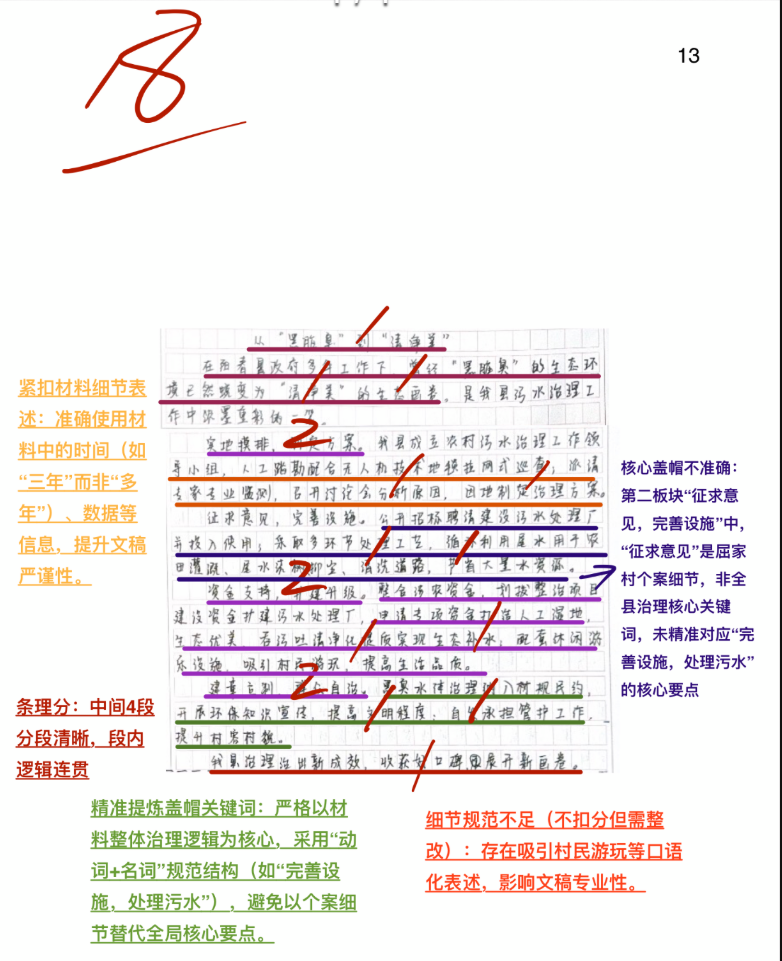
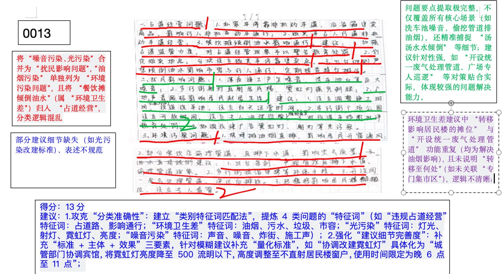
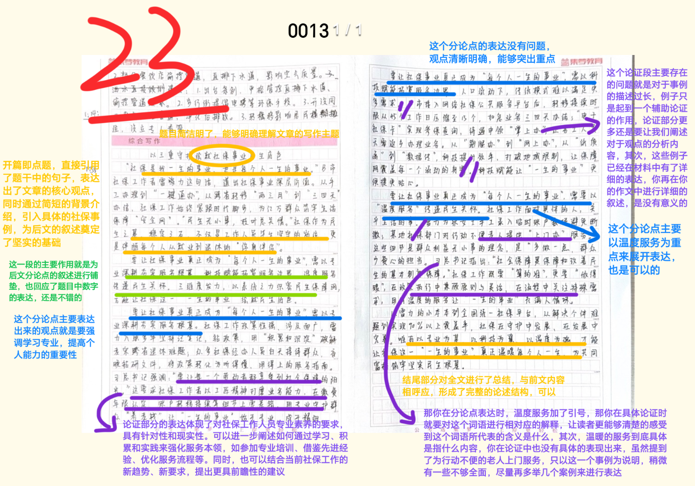

| 昵称    | Y0ungK1ng |
| ----- | --------- |
| Q1得分  | 9.5       |
| Q2得分  | 18        |
| Q3得分  | 13        |
| Q4得分  | 23        |
| 总分    | 63.5      |
| 平均分   | 58        |
| 排名    | 239       |
| 总提交人数 | 1259      |

###  **一、措施概括题**::noto:banana::

| 得分  | 总分  | 区间  |
| --- | --- | --- |
| 9.5 | 15  | 低   |

::: tip

总分总结构

:::

::: card title="题干" icon="noto:backhand-index-pointing-right-dark-skin-tone"

**一、根据“给定资料1” ，请你概括N市采取了哪些措施推进基层普法工作。（15分）**

要求：全面、准确、简明、有条理，字数不超过300字。

:::

::: card title="答题" icon="twemoji:astonished-face"

:::

::: card title="答案" icon="typcn:tick-outline"

**集梦**:

1、==划分网格，打造平台==。由网格长、网格员承担普法职能，网格员巡查提醒；依托微信群，延伸管理和服务，打造普法工作平台。

2、==培养人才，壮大队伍==。培育‘法治带头人’‘法律明白人’，==推动普法下沉=={.info}，解决法律问题；依托人才优势，优化资源配置，将干部、律师、法学会会员等编入基础网格。

3、==创新方式，多样普法==。编写发放手册，开展反诈宣传、隐患排查，通俗易懂地讲解；并开展法律大讲堂活动；“一对一”答询，引导群众合法、有效解决问题。

4、==科技助力，精准普法==。配发‘网格通’手机，现场收集记录问题，同步上传处置情况；定期分析群众思想动态和法律需求，明确不同网格类型的普法任务、服务重点和服务方式。

**中公**：

==N市实施网格化普法，将网格打造成普法工作平台==:

1. 建强网格员队伍。培育以村干部、人民调解员为重点的“法治带头人”和“法律明白人”，下沉普法职责、力量、资源;依托法治人才优势，优化资源配置，将全市各类法治人才编入基础网格。

2. 法律宣传进网格。设立网格服务驿站，开展法律大讲堂活动;网格员承担普法职能，日常巡查提醒、作法治讲座;网格民警开展知识宣传和隐患排査，编写宣传手册，讲解通俗易懂;网格调解员讲法律、释情理，解决法律问题。

3. 法律咨询零距离。配发“网格通”手机，收集汇总社情民意，定期分析群众思想动态和现实法律需求，明确不同网格普法任务，由网格律师进行“一对一”答询。

:::

::: card title="总结答案" icon="typcn:tick-outline"

**Y0ungK1ng**：

1. 打造普法工作平台。实施社区网格化工程，划分网格；依托微信群，延伸管理与服务。
2. 法治人才队伍建设。培育以村干部、人民调解员为重点的法治带头人和法律明白人，下沉普法职责、力量、资源；依托法治人才优势，优化资源配置，将全市各类法治人才编入基础网格。
3. 创新法律宣传方式。设立服务驿站，开展法律大讲堂；编写宣传手册，开展反诈宣传和隐患排查工作，通俗易懂讲解；“一对一”法律咨询，引导群众合法有效解决问题。
4. 科技手段精准普法。配发“网格通”手机，现场收集记录问题，同步上传处置情况；收集社情民意定期分析群众思想动态和现实法律需求，明确不同网格类型普法任务、服务重点和服务方式。

:::

::: card title="反思与建议" icon="line-md:compass-loop"

**一、答题内容和逻辑**

注意审题干，题型是概括题。要点寻找方向：（采取了的）措施。

条理：分条书写，总分结构，注意帽子提炼。字数：300字。

本题第一点容易遗漏：1、划分网格，打造平台。由网格长、网格员承担普法职能，网格员巡查提醒；依托微信群，延伸管理和服务，打造普法工作平台。‘法治带头人’‘法律明白人’这种描述会有疑惑，带引号的这种描述，已经无法精简或者改变说法的情况下，可适当抄写。

:::

###  **二、公文写作题**::noto:banana::

| 得分  | 总分  | 区间  |
| --- | --- | --- |
| 18  | 20  | 高   |

::: card title="题干" icon="noto:backhand-index-pointing-right-dark-skin-tone"

**二、假如你是阳春县宣传部门工作人员，请你根据“给定资料2”以“从‘黑脏臭’到‘清净美’”为题目，撰写一篇新闻宣传稿。（20分)**

要求：

(1)紧扣资料，内容完整；

(2)重点突出，语言流畅；

(3)字数不超过400字。

:::

::: danger

:::

::: card title="答题" icon="twemoji:astonished-face"

:::

::: card title="答案" icon="typcn:tick-outline"

**集梦**：

从“黑脏臭”到“清净美”

阳春县的黑臭水体专项治理交出了最佳答卷，把过去蚊蝇乱飞的臭水坑，改变为一幅美丽的生态画卷，唤回了碧水清流，实现了“黑脏臭”到“清净美”的转变。

排查摸底，制定方案。成立领导小组，对全县黑臭水体进行初步排查、无人机巡查；专家现场做监测，邀请专家召开讨论会分析原因，分类制定方案。

完善设施，处理污水。公开招标，聘请有资质的公司建设污水处理厂，采取先进处理工艺，尾水直接用来种花养鱼、灌溉等；后续整合划拨资金，扩建污水处理厂。

打造湿地，生态发展。打造人工湿地，栽种水生植物净化提质尾水；配套彩虹桥等设施，栽种花草树木，提升公园“颜值”。

提升素质，切断根源。将黑臭水体治理要求纳入村规民约，积极宜传；在村两委的带动下，村民们自发轮流承担管护工作。

阳春县对农村黑臭水体的治理，治出了新成效，收获了好口碑，让美不胜收的美丽乡村新画卷徐徐展开。

**华图**：

从“黑脏臭”到“清净美”

阳春县的黑臭水体专项治理交出了最佳答卷，把过去蚊蝇乱飞的臭水坑，改变为一幅美丽的生态画卷，唤回了碧水清流，实现了“黑脏臭”到“清净美”的转变。

一、开展专项治理。成立农村污水治理工作领导小组，完成对黑臭水体的排查摸底。还邀请专家召开讨论会，分类制定治理方案。

二、完善基础设施。公开招标,聘请有建设和环保工程资质的公司建设污水处理厂。采取先进工艺,尾水用来种花、养鱼、灌溉等。

三、打造人工湿地。整合资金，将污水处理厂附近的80亩荒滩打造成人工湿地，又配套了彩虹桥等设施，栽种了花草树木,公园成了“打卡”胜地。

四、提升乡风文明。村“两委”将黑臭水体治理要求纳入村规民约，挨家挨户进行环保知识宣传，积极引导村民改变不良习惯。村民们自发轮流承担了治理后的日常管护工作，有效提升村容村貌。

从“黑脏臭”到“清净美”，阳春县对农村黑臭水体的治理，让美不胜收的美丽乡村新画卷徐徐展开。

**超格**：

从“黑脏臭”到“清净美”

从过去的臭水沟，到今日的一汪池水，阳春县通过黑臭水体专项治理，绘成了一幅美丽的生态画卷。

排查摸底，确定治理方案。政府成立治污工作领导小组，通过多方式、全范围多次排查摸底，同时邀请专家召开讨论会分析成因，综合分类制定治理方案。

完善设施，建厂处理污水。面向社会公开招标，聘请有建设和环保工程资质的公司，建设污水处理厂，通过专业处理工艺，让尾水既无臭味，又可用于生产生活。

打造人工湿地，丰富公共空间。整合划拨涉农资金，扩建污水处理厂，建设湿地公园，净化提质尾水，实现治理与湿地结合；配套休闲健身设施，高颜值打造打卡胜地。

干群参与，提升文明程度。将治理要求纳入村规民约，宣传环保知识，引导村民改变不良习惯；村民自发轮流承担日常管护工作，提升村容村貌。

黑水治理，治出了阳春县的人居和谐与人民好口碑。

:::

::: card title="总结答案" icon="typcn:tick-outline"

**Y0ungK1ng**：

从“黑脏臭”到“清净美”

阳春县的黑臭水体专项治理交出最佳答卷，把过去蚊蝇乱飞的臭水坑，改变为一幅美丽的生态画卷，实现“黑脏臭”到“清净美”的转变。

排查摸排，制定方案。成立农村污水治理工作小组，人工踏勘配合无人机巡查；专家现场做监测，召开讨论会分析原因，因地制定治理方案。

完善设施，处理污水。公开招标、聘请有资质的公司建设污水处理厂，采取多环节处理工艺，尾水循环利用农业灌溉、种花养鱼、浇树、抑尘、清洗道路。

资金支持，扩建升级。整合划拨资金，打造人工湿地，吞污吐清净化提质实现生态补水；配套休闲游乐设施，提升公园“颜值”，吸引周边村民打卡。

建章立制，群众自治。黑臭水体治理纳入村规民约，开展环保知识宣传，提升文明程度；村两委带头，村民自发承担管护工作，提升村容村貌，切断黑臭水体根源。

阳春县黑臭水体治理，治出新成效，收获好口碑，展开新画卷。

:::

::: card title="反思与建议" icon="line-md:compass-loop"

:::

###  **三、对策建议题**::noto:banana::

| 得分  | 总分  | 区间  |
| --- | --- | --- |
| 13  | 25  | 低   |

::: warning

:::

::: card title="题干" icon="noto:backhand-index-pointing-right-dark-skin-tone"

**三、假如你是蓝阳区城管部门的一名工作人员，请根据“给定资料3” ，对步行街周边的**
**问题进行分类汇总，并分别提出解决建议。（25分）**

要求：

（1）问题梳理全面、准确，有条理；

（2）所提建议有针对性，具体明确、切实可行；

（3）字数不超过450字。

:::

::: card title="答题" icon="twemoji:astonished-face"

:::

::: card title="答案" icon="typcn:tick-outline"

**集梦**：

**一、问题**：

1、==违规占道经营==。私家车、商贩停靠在非机动车道上售卖商品，影响通行。

2、==环境卫生差==。商家违规排放油烟、污水，影响市容和通行。

3、==光污染严重==。违规使用灯具；广告灯位置、亮度使用不合规。

4、==噪音污染多==。工地施工、装修、公园聚会、摩托车深夜“炸街” 、小广场放音乐等产生一系列噪音。

**二、建议**：

1、联合交警等相关部门进行集中整治，制止违规行为；向商户宣传合规经营地点，==引导商户到专门集市区内规范经营==。

2、采取明察暗访等形式进行检查，==严厉处罚违规排放行为==；加大污染处置设备检查力度，引导门店及时安装；设立厨余垃圾收集点，定时收集清运。

3、全面检查周边灯光使用情况，督促更换不合规灯具；规范管理。==明确广告灯的高度、亮度，规定广告灯使用时间==。

4、联合开展整治活动，==强化宣传普法和警示曝光==；约谈施工、装修单位责令整改，明确施工时间；加强对公共场所的巡逻管控，限定播放音量和时段。

**中公**：

问题:
1. 占道经营。私家车、摊贩占人行道和非机动车道经营。
2. 噪声扰民。施工、洗车噪声大;法定时间外，装修、公园聚会、摩托车行驶、广场娱乐声大。
3. 环境污染。烧烤摊等违规排放油烟，餐饮摊将厨余垃圾随意倾倒在人行道上;光污染严重，光源亮度超标。

建议:
1. 整治占道经营。联合城管、交警等进行集中整治，明确告知占道经营属违法行为，及时制止占道经营行为，引导商户到专门集市区内规范经营;成立巡查执法队伍，加强路段巡查，依法处理违反规定的商户。
2. 防治噪声污染。开展专项整治，约谈施工单位责令整改，督促施工方在法定时间内作业;加强对公共场所的巡逻管控，要求公园履行管理职责，限定播放音量和时段;联合交管部门专项查处，强化宣传普法和警示曝光。
3. 治理街区环境。开展联合执法，提高巡查频次，处置违规排放行为，取缔露天烧烤摊点;对门店加大油烟设备安装检查力度，对拒不改正的依法实施行政处罚;设立厨余垃圾收集点，定时收集、统清运;拆除不符合光源使用规定的照明灯、广告灯，并规定广告灯使用时间。

:::

::: card title="总结答案" icon="typcn:tick-outline"

**Y0ungK1ng**：

问题：

1. 占道经营。私家车、商贩停靠非机动车道售卖商品，影响通行。
2. 噪声扰民。施工、洗车噪音大；法定时间外，装修、公园聚会、摩托车行驶、广场娱乐声大，影响居民生活。
3. 环境污染。违规直排油烟，倾倒污水，影响市容和通行；光污染严重，广告灯位置、亮度使用不合规。

对策：

1. 整治占道经营。联合城管、交警集中整治，制止违规行为；向商户宣传合规经营地点，引导商户到专门集市区内规范经营；成立巡查执法队伍，加强路段巡查，依法处理违规商户。
2. 防止噪音污染。开展专项整治，约谈施工单位责令整改，督促施工方在法定时间内作业；加强对公共场所的巡逻管控，要求公园履行管理职责，限定播放音量和时段；联合交管部门专项查处炸街行为，强化普法和警示曝光。
3. 治理街区环境。开展联合执法，采取明察暗访等形式，严厉处罚违规排放问题，取缔露天烧烤摊点；对门店加大油烟设备安装检查力度，对拒不改正的依法实施行政处罚；设立厨余垃圾收集点，定期收集清运；拆除不符合光源使用规定的照明灯，广告灯，并规定广告灯使用时间。

:::

::: card title="反思与建议" icon="line-md:compass-loop"

概括问题！

:::

###  **四、大写作**::noto:banana::

| 得分  | 总分  | 区间  |
| --- | --- | --- |
| 23  | 40  | 中   |

::: tip

:::

::: card title="题干" icon="noto:backhand-index-pointing-right-dark-skin-tone"

**四、“给定资料4” 中提到“社保是我一生的事业，也是每个人一生的事业” ，请你深入思**
**考这句话，联系实际，自选角度，自拟题目，写一篇议论性文章。 (40分)**

要求：

（1）观点明确，见解深刻；

（2）参考“给定资料” ，不拘泥于“给定资料”；

（3）思路清晰，语言流畅；

（4）字数在1000字左右。

:::

::: card title="答题" icon="twemoji:astonished-face"

:::

::: card title="答案" icon="typcn:tick-outline"

- 总论点：做好社保工作
	- 分论点1：社保是每个人一生的事业，关乎群众未来的幸福生活。
	- 分论点2：做好社保工作，需要不断学习，积累沉淀，强化服务本领。
	- 分论点3：做好社保工作，需要依托平台，创新方式，提高服务效率。

1、题干明显给出一个意义方向分论点，即社保工作的重要性：社保是每个人一生的事业。

2、材料4明显给出两个对策分论点方向：积累沉淀、创新方式，其他类似词汇也可。比如：积累沉淀（学习提高、认真负责、艰苦奋斗、迎难而上）创新方式（信息化赋能、借力科技手段）

3、该题的易错点：认为“社保”是一个很具象化的东西，不敢写，于是结合其他材料瞎写。
题干中的这句话已经将写作方向固定了，不可杜撰其他层面，否则视为跑题。

  <h4>社保用心 生活安心 
----做好社保工作，稳定百姓生活
</h4>

社保，是关乎每个人一生的事业，宛如一座坚固的大厦，给每一个人提供保障，记录一生、服务一生，保障一生，为群众未来的幸福生活遮风挡雨。在社会发展的进程中，社保不仅是民生保障的关键环节，更是衡量社会进步的重要尺度。因此，应做好社保工作，筑牢民生之基，助推我们的社会向着更加公平、和谐、美好的方向不断迈进。

社保是每个人一生的事业，关乎群众未来的幸福生活。从呱呱坠地的婴儿到垂垂老矣的长者，社保贯穿生命的始终。对于年轻人而言，社保中的医疗保险能在他们患病时减轻医疗负担，养老保险则为他们的老年生活提供了基本的经济保障，失业者可通过失业保险维持基本生活，残疾人等特殊群体也能在社保体系中获得相应的支持和帮助。社保它就像一张无形的安全网，涵盖了人们生活的方方面面。对于整个社会而言，完善的社保体系能减少贫困、缓解社会矛盾，促进社会公平正义。可以说，社保是幸福生活的稳定器，是社会和谐发展的基石。

做好社保工作，需要不断学习，积累沉淀，强化服务本领。随着社会发展，医保报销范围和比例的调整、养老保险制度的改革等内容不断出台，社保工作面对的又是形形色色的群众，每个个体的情况都不尽相同，这更加要求社保工作者不断学习，加强积累沉淀。社保工作者雷力工作中不惜力，业务上肯下苦功夫，跟着老同事边干边学，下班后仍经常在办公室钻研政策，遇到的问题，他都记在笔记本上，解决着一个又一个社保难题。社保政策不是一成不变的，它随着社会经济的发展而不断调整和完善，只有深入钻研，才能准确理解和把握。通过不断地学习和实践，社保工作者才能在复杂的工作环境中从容应对，提升服务质量。

做好社保工作，还需要依托平台，创新方式，提高服务效率。在信息化时代，传统的社保服务模式已难以满足群众的需求。利用互联网平台，打造便捷的社保服务系统是大势所趋。通过建立完善的社保信息系统，实现数据的互联互通，群众可以在网上便捷地查询社保信息、办理社保业务。比如，很多地区已经实现了网上缴纳社保费用、申请社保补贴等功能，大大节省了群众的时间和精力。同时，利用大数据分析，可以更精准地了解群众的社保需求和问题所在，为政策的制定和调整提供依据。未来，做好社保工作必须依托已有的平台，利用好大数据分析，精准地了解群众的需求，提前做好风险预警和资源调配，提高工作效率，才能让社保工作更加贴近群众，深入人心。

社保宛如一把坚实的保护伞，庇佑着群众未来的幸福生活。社保工作者要以不断学习为桨，以创新服务为帆，在社保这片广阔的海洋里破浪前行，为群众撑起幸福生活的蓝天，为社会的繁荣发展筑牢坚实的民生之基，让每一个公民都能在其庇护下，无惧风雨，向着幸福生活稳步前行，让社保真正成为人民幸福生活的坚实后盾。

:::

