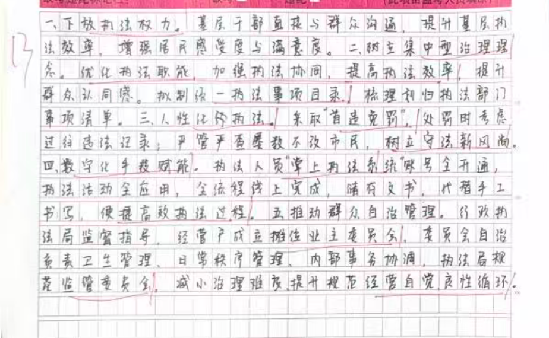
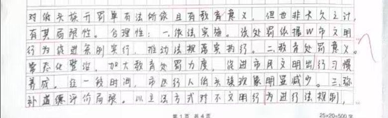
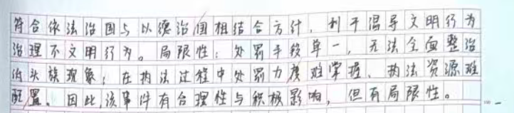
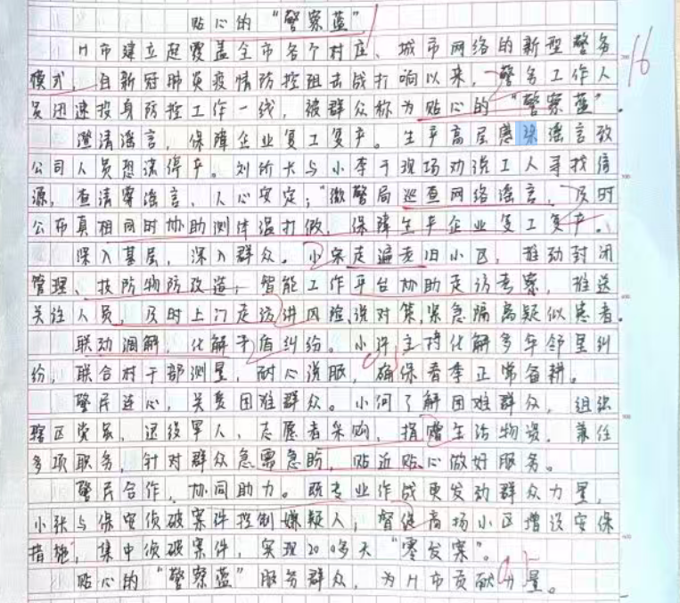
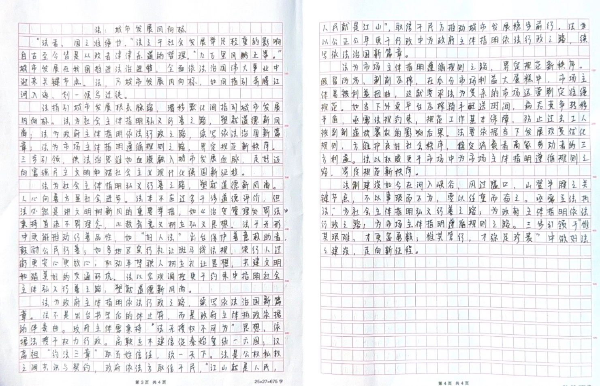

| 昵称    | Y0ungK1ng |
| ----- | --------- |
| Q1得分  | 13        |
| Q2得分  | 7         |
| Q3得分  | 16        |
| Q4得分  | 22        |
| 总分    | 58        |
| 平均分   | 54.5      |
| 排名    | 516       |
| 总提交人数 | -         |

###  **一、表现概括题**::noto:banana::

| 得分  | 总分  | 区间  |
| --- | --- | --- |
| 13  | 20  | 低   |

::: tip

总分总结构

:::

::: card title="题干" icon="noto:backhand-index-pointing-right-dark-skin-tone"

**一 、根据“给定资料1”,请谈谈F市综合行政执法改革由“城市管理”变身“综合执法”的具体体现。(20分)**

要求：全面、准确、简明、有条理，字数不超过300字。

:::

::: card title="答题" icon="twemoji:astonished-face"

:::

::: card title="答案" icon="typcn:tick-outline"

1. ==机制变/执法更体系==（1分）。设立指导办公室/设立新机构（1分），执法队伍专业集中/组建专业执法队伍（1分），履行多部门、多领域（多方）执法职能（1分）。

2. ==理念变/权利更下沉==（1分）。以百姓为中心（1分），执法权力下放，从部门碎片式管理到集中型治理转变（1分），优化执法职能，加强执法协同，提高执法效率（1分：写全1分，任写1个0.5分），拟制执法事项目录（1分）。

3. ==方式变/执法更人性==（1分）。首违免罚（1分），树立守法意识/有意识遵守社会秩序和法律法规（1分）。

4. ==手段变/执法科技化==（数字化/信息化）（1分）。推出掌上执法平台（1分），执法过程便捷高效（1分）。

5. ==角色变/执法更多元==（1分）。成立业主委员会（1分），提高商贩自觉性（1分），执法部门规范监管（1分），两者关系和谐，良性循环（1分）。

:::

::: card title="反思与建议" icon="line-md:compass-loop"

:::

###  **二、综合分析题**::noto:banana::

| 得分  | 总分  | 区间  |
| --- | --- | --- |
| 7   | 15  | 低   |

::: card title="题干" icon="noto:backhand-index-pointing-right-dark-skin-tone"

**二 、请对“给定资料2”中执法部门对斑马线上的“低头族”开罚单一事进行评析。** (15分) 

要求：全面准确，分析透彻，观点正确。250字左右。

:::

::: danger

:::

::: card title="答题" icon="twemoji:astonished-face"

:::

::: card title="答案" icon="typcn:tick-outline"

1. **评论**：针对斑马线上的“低头族”开罚单是常态化整治行动，值得肯定/点赞/推广/提倡。(2分)

2. **分析**：

（1）背景：斑马线上的“低头族”存在闯红灯、走上机动车道等违法交通行为（1分），威胁自身和他人安全（1分），但对“低头族”开罚单一事，引发网友质疑。

（2）意义：

① 处罚数额虽然不高，但目的是起到警示作用，引起行人重视（1分），文明、安全通过斑马线（1分），让人们逐步养成文明出行习惯（1分）。② 通过地方立法可以对不文明行为进行法律规制（1分），符合依法治国与以德治国相结合的大方向（1分），引导公众加强自律（1分）。

（3）问题：光靠罚款整治相形见绌（1分），面临处罚力度不好掌握、执法资源难以配置（2分）等问题。

3. **结论**：

通过立法对斑马线上“低头族”予以整治这一做法极为必要的（再次认可）/要继续推进“低头族”整治工作（1分），同时应当注意政策的完善与落实/掌握出发力度，合理配置执法资源（1分）。(2分，意思相近即可给分)。

:::

::: card title="反思与建议" icon="line-md:compass-loop"

:::

###  **三、公文写作题**::noto:banana::

| 得分  | 总分  | 区间  |
| --- | --- | --- |
| 13  | 25  | 低   |

::: warning

:::

::: card title="题干" icon="noto:backhand-index-pointing-right-dark-skin-tone"

**三、假如你是H市公安局宣传处工作人员，请你根据“给定资料3”,以“贴心的'警察蓝’”为题目，撰写一篇新闻宣传提纲。(25分)**

要求：

(1) 内容全面，重点突出；

(2) 条理清楚，有逻辑性；

(3) 不超过500字。

:::

::: card title="答题" icon="twemoji:astonished-face"

:::

::: card title="答案" icon="typcn:tick-outline"

- **标题**——1分

- **发文事由**——2分

- **主体内容**——21分（四个点，前置词单独给分，没有写/写错/位置没在开头不给分，子要点只要写到即可给分。）

- **结尾**——1分

1. 标题：==贴心的“警察蓝”==（1分）命题抄错不给分

2. 发文事由：2014年以来，我市全面推行“一村(格)一警”工作，建立新型警务模式（1分）。 自新冠肺炎疫情暴发以来，我市社区民警和辅警投身防控一线，被群众称为贴心的“警察蓝”（1分）。

3. 主体内容：

(1) ==练就“脚板”/迈开腿（2分），提升防控能力==。

① “微警局”及时通报案件，加强巡查网络谣言（0.5分），实地了解调查，助力民警及时公布真相、处理结果（0.5分）；协助测控体温、打击制假售假（0.5分），保障防疫企业复工复产（0.5分），走遍辖区了解情况（0.5分），推动小区管理改造（0.5分）。

(2) ==科技赋能（2分），精准推送信息==。

② 安装智能工作平台（0.5分），提醒民警任务清单（0.5分），及时推送信息（0.5分），便于及时上门走访（0.5分）。

(3) ==联动调解/群防群治/多元治理（2分），化解矛盾纠纷==。

①民警与村(居)法律顾问、人民调解委员会联动调解（1分），及时发现并解决问题/及时发现苗头，化解矛盾纠纷（1分）。

②社区民警要专业作战，也要发动物业保安员等群众力量（1分），形成合力高效办案（1分）。或者具体写出督促增加保安力量，协同警力侦破疑难案件也可得2分。

(4) ==党员先 ”班子兼任==（0.5分），直接参与基层社区治理（0.5分），将党组织设在警务室、警务工作站（0.5分），贴近贴心做好服务（0.5分）。

②及时了解困难群众生活，组织辖区党员、退役军人、志愿者组成“暖心小分队”（1分）, 给困难群众“送温暖”（1分）。

4. 结尾、呼吁：投身防控一线，做好贴心“警察蓝”（1分）,我们一直在路上!(意思相近即给分)

:::

::: card title="反思与建议" icon="line-md:compass-loop"

:::

###  **四、大写作**::noto:banana::

| 得分  | 总分  | 区间  |
| --- | --- | --- |
| 23  | 40  | 中   |

::: tip

**一、立意：**

观点明确，且能紧扣主题词

**二、开头：**

能结合引言引出话题，但分析较空，建议进一步联系现实背景分析对社会、对城市的影响等，再引出观点。过渡段大部分都在重复分论点句子，不够有新意，建议要么选择其他分析角度，如结合法治背景、改革背景或城市高质量发展等谈必要性，要么去掉过渡段。

**三、论证：**

有个人思路，但衔接表述及个别用词建议调整。如分1段总结句与前文缺少合理衔接，可以考虑加金句短语过渡。另外整体分析角度比较单一，建议多角度灵活分析，如假设、原因分析等，也可以对比分析、排比等

**四、结尾：**

能总结全文，但建议联系城市话题。

**五、其他：**

注意行文表述要流畅，注意个性化表述积累等"

:::

::: card title="题干" icon="noto:backhand-index-pointing-right-dark-skin-tone"

**四、“给定资料4” 中提到“社保是我一生的事业，也是每个人一生的事业” ，请你深入思**
**考这句话，联系实际，自选角度，自拟题目，写一篇议论性文章。 (40分)**

要求：

（1）观点明确，见解深刻；

（2）参考“给定资料” ，不拘泥于“给定资料”；

（3）思路清晰，语言流畅；

（4）字数在1000字左右。

:::

::: card title="答题" icon="twemoji:astonished-face"

:::

::: card title="答案" icon="typcn:tick-outline"

:::

