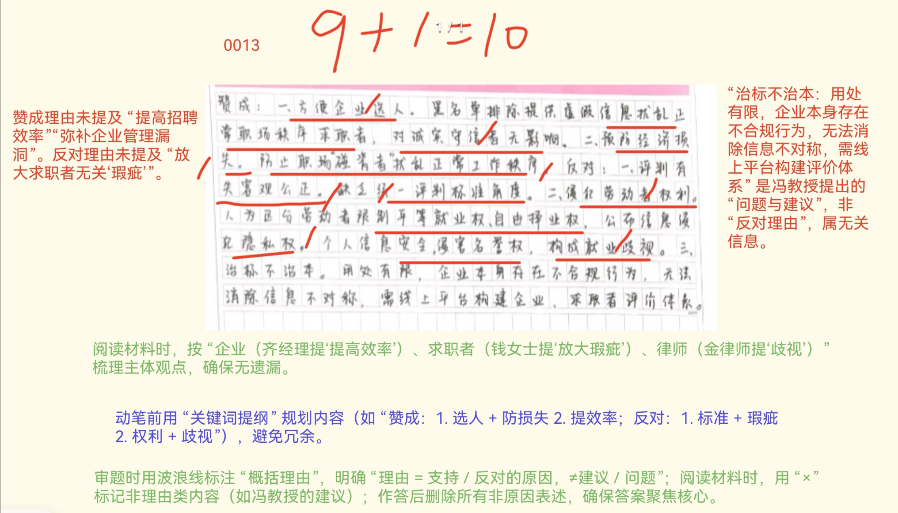
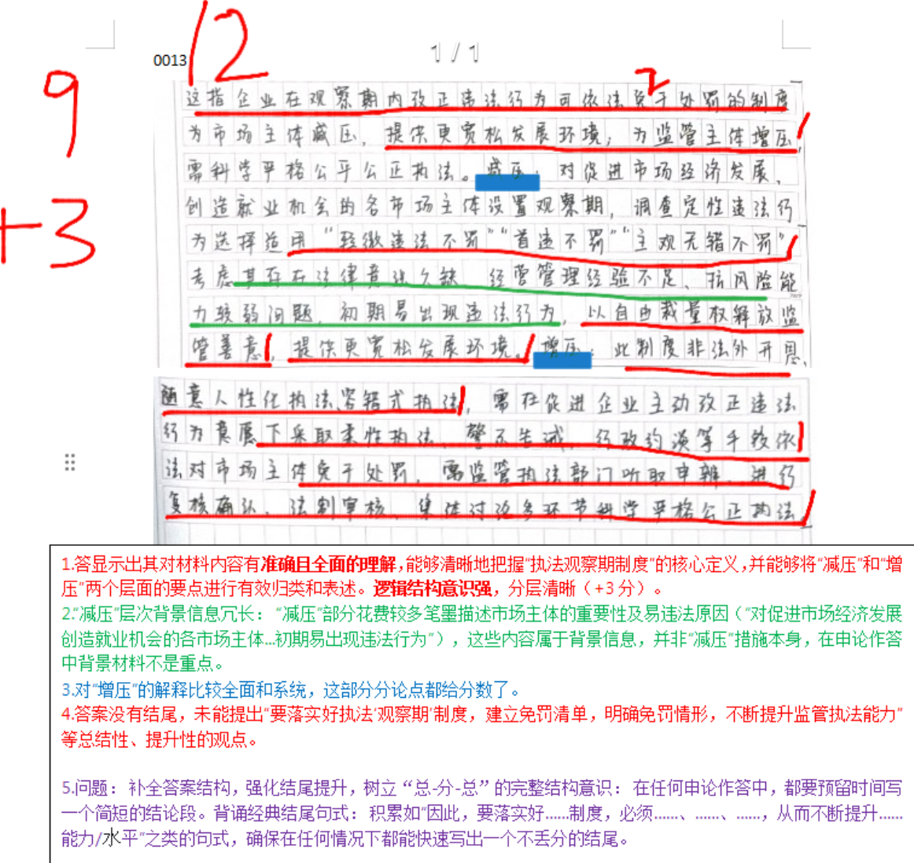
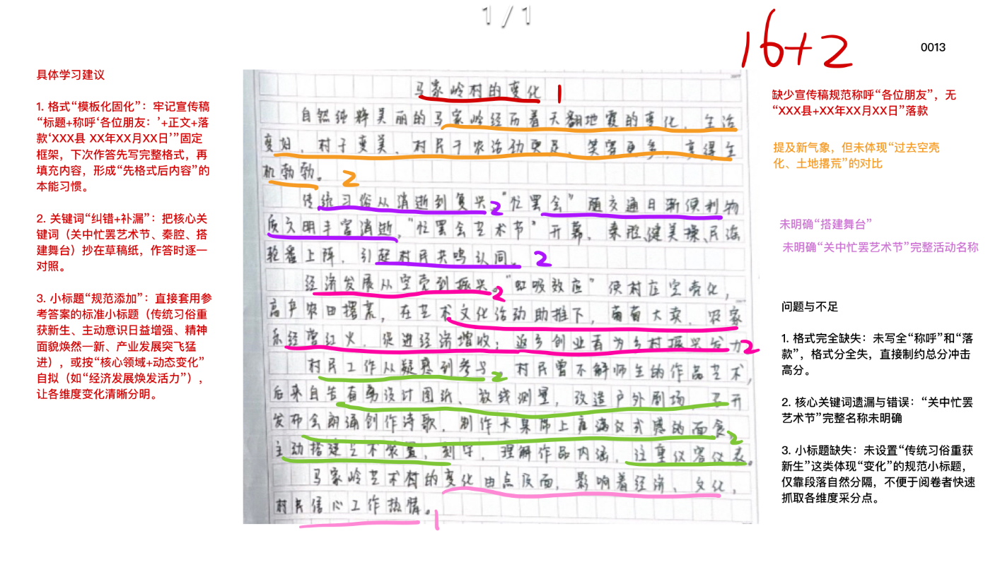

| 昵称    | Y0ungK1ng |
| ----- | --------- |
| Q1得分  | 10        |
| Q2得分  | 12        |
| Q3得分  | 18        |
| Q4得分  | 22        |
| 总分    | 62        |
| 平均分   | 58        |
| 排名    | 424       |
| 总提交人数 | 1238      |

###  **一、理由概括题**::noto:banana::

| 得分  | 总分  | 区间  |
| --- | --- | --- |
| 10  | 15  | 中   |

::: tip

遗漏了各主体的意见

阅读材料时，按“企业(齐经理提“提高效率”)、求职者(钱女士提'放大瑕疵”)、律师(金律师提“歧视’)”梳理主体观点，确保无遗漏。

赞成理由未提及“提高招聘效率”“弥补企业管理漏洞”。反对理由未提及“放大求职者无关'瑕疵””。

从材料中解决的问题反推理由（->优势）

:::

::: card title="题干" icon="noto:backhand-index-pointing-right-dark-skin-tone"

**一、根据“给定资料1” ，请概括社会上赞成和反对P市部分企业招聘设立共享“黑名单”的理由有哪些。（15分）**

要求：

（1）表述准确、全面、有条理；

（2）不超过200字。

:::

::: card title="答题" icon="twemoji:astonished-face"

:::

::: card title="答案" icon="typcn:tick-outline"

**集梦**：

一、赞成的理由：
1. 此举有助于弥补企业管理漏洞，维护扰乱职场正常秩序，减少企业经济损失。
2. 避免用人不慎风险，提高招聘效率。
3. 不影响诚实守信的求职者，能让企业更好地选人。

二、反对的理由：
1. 问题被人为放大，有失客观公正，缺乏统一评判标准。
2. 对劳动者进行人为区分，限制劳动者平等就业权和自由择业权，侵犯个人信息安全，侵害劳动者名誉权、隐私权，构成就业歧视。

**半月谈**：

赞成：
1. 弥补企业人事管理漏洞，规范正常职场秩序。
2. 避免用人不慎风险，提高招聘效率，减少经济损失。

反对：
1. 企业自身存在违规行为。
2. 缺乏统一评判标准。人为放大瑕疵，角度不一，有失客观公正。
3. 造成就业歧视。限制求职者平等就业权、自由择业权，侵犯求职者个人信息安全。
4. 信息不对称，企业与求职者维权难。

**中公**：

赞成理由：
1. 提高招聘效率。快速过滤求职者，减少招聘干扰。
2. 避免用人风险。防范求职者违反诚信原则，钻企业漏洞，伪造学历或工作经历等。
3. 维护职场秩序。提醒同行企业，避免经济损失，但不影响诚信求职者。

反对理由：
1. 有失客观公正。评判员工标准不统一，可能人为放大瑕疵。
2. 侵犯劳动者权益。限制平等就业权、自由择业权，侵犯名誉权、隐私权和个人信息安全，构成就业歧视。
3. 企业自身不合规。对员工入职核实不仔细。

:::

::: card title="总结答案" icon="typcn:tick-outline"

**Y0ungK1ng**：

赞成：
1. 维护职场秩序。弥补企业管理漏洞，预防经济损失。
2. ==避免用人不慎==。提高招聘效率，方便企业选人，不影响诚信守信求职者。

反对：
1. 评判有失公正。评判员工标准不统一，可能==人为放大瑕疵==。
2. 侵犯劳动者权益。限制平等就业权、自由择业权，侵犯名誉权、隐私权和个人信息安全，构成就业歧视。
3. 企业自身违规。信息不对称导致企业与求职者维权难。

:::

::: card title="反思与建议" icon="line-md:compass-loop"

:::

###  **二、综合分析题**::noto:banana::

| 得分  | 总分  | 区间  |
| --- | --- | --- |
| 12  | 20  | 低   |

::: card title="题干" icon="noto:backhand-index-pointing-right-dark-skin-tone"

**请根据“给定资料2”，谈谈你对“执法观察期制度，是‘减压’，也是‘增压’”这句话的理解。（20分）**

要求：

（1）理解准确，分析透彻，条理清晰；

（2）不超过300字。

:::

::: danger

缺少结尾！！

解释含义（两行，简单解释）

分析论证

评价收尾

:::

::: card title="答题" icon="twemoji:astonished-face"

:::

::: card title="答案" icon="typcn:tick-outline"

**集梦**：

这句话是指，企业在观察期内改正违法行为的可依法免于处罚的制度，给市场主体带来了便利，也给监管部门带来了挑战。

==对市场主体“减压”==：针对某些违法行为，采取‘首违不罚’等处置措施，释放了监管善意，为企业提供更宽松的发展环境，助力企业安心经营发展。

==对监管部门“增压”==：因为该制度并不是法外开恩，这要求执法人员必须遵循科学执法、严格执法、公平公正执法的原则；更要充分调查定性后选择符合的法定情形，合理使用自由裁量权；还应采用柔性执法、警示告诫、行政约谈等多种手段，促进企业主动改正违法行为。

因此，要落实好执法“观察期”制度，建立免罚清单，明确免罚情形，不断提升监管执法能力。

**中公**：

执法观察期制度，让在观察期内改正违法行为的企业可依法免于处罚，是对企业“减压”，对执法者“增压”，彰显了生态环境执法的“力度”和“温度”。

一方面，它能助力企业安心经营发展。
1. 市场主体法律意识欠缺、经营管理经验不足、抗风险能力较弱，容易在经营初期出现违法行为。
2. 对市场主体设置观察期，在调查定性后选择适用处置措施，属于自由裁量权的范畴，释放了监管善意，提供了更宽松的发展环境。

另一方面，它对监管执法能力提出了新挑战。
1. 执法部门要经法制审核集体讨论，复核确认。
2. 要采用柔性执法、警示告诫、行政约谈等手段，促进企业主动改正违法行为。

总之，它体现了科学执法、严格执法、公平公正执法。

:::

::: card title="总结答案" icon="typcn:tick-outline"

**Y0ungK1ng**：

这指企业在观察期内改正违法行为可依法免于处罚的制度为市场主体提供便利，为监管主体带来挑战。推动生态环境执法既有力度又有温度。

==减压==：在法律法规框架内，监管部门对市场主体设置一段观察期，针对市场主体的违法行为，在调查定性之后选择适用轻微违法不罚、首违不罚、主观无错不罚等处置措施，释放监管善意，为企业提供更宽松的发展环境，助力企业安心经营发展。

==加压==：此制度非法外开恩、随意人性化执法、容错式执法，需在促进企业主动改正违法行为意愿下采用柔性执法、警示告诫、行政约谈等多种手段。需监管执法部门听取申辩，进行复核确认，法制审核、集体讨论多环节科学严格公正执法。

因此，要落实好执法“观察期”制度，建立免罚清单，明确免罚情形。

:::

::: card title="反思与建议" icon="line-md:compass-loop"

经典框架不要忘，背景废话不要写。

:::

###  **三、对策建议题**::noto:banana::

| 得分  | 总分  | 区间  |
| --- | --- | --- |
| 18  | 25  | 中   |

::: warning

:::

::: card title="题干" icon="noto:backhand-index-pointing-right-dark-skin-tone"

**三、县里准备宣传马家岭村，请根据“给定资料3” ，以“马家岭村的变化”为题，写一篇宣传稿。（25分）**

要求：

（1）紧扣资料，内容全面；

（2）条理清晰，语言生动；

（3）不超过400字。

:::

::: card title="答题" icon="twemoji:astonished-face"

:::

::: card title="答案" icon="typcn:tick-outline"

**集梦**：

马家岭村的变化

各位朋友：

过去，马家岭村空壳化严重，土地撂荒，传统习俗消逝；如今，当地开展“关中忙罢艺术节”活动，生活变好了，村子变美了，一片生机勃勃。

一、传统习俗重获新生。乡间搭起了舞台，开展各类艺术表演，恢复了“忙罢会”的传统，给村民带来了欢乐。

二、主动意识日益增强。村民主动参与演出剧场设计和建设，改造环境，与艺术家共同创作诗歌等文艺作品。

三、精神面貌焕然一新。村民对艺术作品内涵有了更深的理解，也让村民更加热爱家乡，养成了良好的生活习惯，干劲增强。

四、产业发展突飞猛进。 游客增多，带动了农产品销售、农家乐等产业发展，村民收入增加，吸引了更多年轻人才返乡创业。

现在的马家岭村充满了生机与活力！

XXX县

XX年XX月XX日

**中公**：

马家岭村的变化

曾经，马家岭村是个传统农业村，村庄呈空壳化趋势，传统习俗逐渐消逝。但如今，持续上演的艺术活动，让它蝶变成为生机勃勃的艺术村，展现出乡村振兴新风貌。

乡村文化绽芳华。美术学院师生创办的艺术节，让传统习俗重现光彩，激发了村民创作热情。村民们积极参与各项艺术活动，创作诗歌、搭建艺术装置、雕刻艺术字，挖掘出麦田里的艺术形式，艺术认知和素养也不断提升。

乡村经济涌新潮。艺术节吸引了附近村庄和城区的游客，红火了餐饮、农家乐，提高了农作物价格，增加了村民收入。年轻人也返乡创业，共建家乡。

乡村环境焕新颜。曾经堆满垃圾的涝池，变成了漂亮的户外剧场。村民们也更加注重环境卫生，村庄变得干净整洁。

艺术与生活的交融，让马家岭村焕发出前所未有的活力与魅力，村民干农活劲更足、笑容更多，精神面貌积极向上，绘就了新时代乡村的美好画卷

:::

::: card title="总结答案" icon="typcn:tick-outline"

**Y0ungK1ng**：

马家岭村的变化

各位朋友：

曾经，马家岭村是个传统农业村，村庄呈空壳化趋势，传统习俗逐渐消逝。但如今，持续上演的艺术活动，让它蝶变成为生机勃勃的艺术村，展现出乡村振兴新风貌。

乡村文化绽芳华。美术学院师生创办的艺术节，让传统习俗重现光彩，激发村民创作热情。村民们积极参与各项艺术活动，创作诗歌、搭建艺术装置、雕刻艺术字，挖掘出麦田里的艺术形式，艺术认知和素养也不断提升。

乡村经济涌新潮。艺术节吸引了附近村庄和城区的游客，带动餐饮、农家乐产业发展，提高农作物价格，增加村民收入。年轻人也返乡创业，共建家乡。

乡村环境焕新颜。曾经堆满垃圾的涝池，变成了漂亮的户外剧场。村民们也更加注重环境卫生，村庄变得干净整洁。

艺术与生活的交融，让马家岭村焕发出前所未有的活力与魅力，村民干农活劲更足、笑容更多，精神面貌积极向上，绘就了新时代乡村的美好画卷

XXX县

XX年XX月XX日

:::

::: card title="反思与建议" icon="line-md:compass-loop"

变化：

==日新月异、翻天覆地、焕然一新、推陈出新、突飞猛进、蒸蒸日上==

:::

###  **四、大写作**::noto:banana::

| 得分  | 总分  | 区间  |
| --- | --- | --- |
| 22  | 40  | 中   |

::: tip

:::

::: card title="题干" icon="noto:backhand-index-pointing-right-dark-skin-tone"

**四、请深入思考“给定资料4”中J市新区行政审批局邢局长说的话，以“无感与有感”为话题，联系实际，自拟题目，写一篇文章。（40分）**

要求：

（1）观点明确，见解深刻；

（2）思路清晰，语言流畅；

（3）参考“给定资料”，但不拘泥于“给定资料”；

（4）字数800-1000字。

:::

::: card title="答题" icon="twemoji:astonished-face"

:::

::: card title="答案" icon="typcn:tick-outline"

- 总论点：做好社保工作
	- 分论点1：社保是每个人一生的事业，关乎群众未来的幸福生活。
	- 分论点2：做好社保工作，需要不断学习，积累沉淀，强化服务本领。
	- 分论点3：做好社保工作，需要依托平台，创新方式，提高服务效率。

1、题干明显给出一个意义方向分论点，即社保工作的重要性：社保是每个人一生的事业。

2、材料4明显给出两个对策分论点方向：积累沉淀、创新方式，其他类似词汇也可。比如：积累沉淀（学习提高、认真负责、艰苦奋斗、迎难而上）创新方式（信息化赋能、借力科技手段）

3、该题的易错点：认为“社保”是一个很具象化的东西，不敢写，于是结合其他材料瞎写。
题干中的这句话已经将写作方向固定了，不可杜撰其他层面，否则视为跑题。

  <h4>政府谋“有感努力” 群众享“无感服务” 

</h4>

“鱼得水逝而相忘乎水，鸟乘风飞而不知有风”，J市新区行政审批局邢局长这句话生动形象指出政府服务无形却又无处不在，像水和风一样，为企业提供了自由发展的环境。海阔任鱼跃，天高任鸟飞。政府部门要通过“有感努力”提升服务质量和效率，让企业和群众享受“无感服务”，激发社会发展活力。

政府谋“有感努力”，提升服务水平。近年来，为了解决“门难进、脸难看、话难听、事难办”的衙门作风，从中央到地方，各级政府以刀刃向内的决心、壮士断腕的勇气不断简化行政审批流程，推出各种便民措施方便群众办事，打造更加宽松的营商环境为企业减负。职能部门以实实在在的努力，实现了自身改革，提升了服务水平。例如，J市主动担当作为，实行“无感续证”改革，通过职能部门政务信息数据共享、互认互用等诸多“有感努力”，为企业办证提供了便利。未来，各级政府要进一步深刻洞察群众需求，借由数字化发展的东风，不断加强内部改革，打破信息孤岛效应，让信息“多跑路”，群众“少跑腿”，切实提升政务服务质量和效率。

群众享“无感服务”，激荡发展活力。群众办事全程“无感”，“无”的是麻烦感、烦恼感、郁闷感。“无感服务”通过全程“零接触““零跑腿”，实现了减时限、减材料、减环节，呼应了经济发展需要和社会群众诉求与期待，是政府职能部门服务理念质的改变和工作作风的一次飞跃。J市让企业不用跑办、不用准备材料、不用操心地办理经营许可，给企业带来了极大便利，减轻了经营过程中的负担和压力，保障了生产经营的合理延续性。打通服务“最后一公里”，各级政府亟需要突破传统做法，让服务越来越细致，也越来越人性化，如此，方能提升群众的方便感、获得感和满意度。

政府“有感努力”，让企业享受无感服务，是行政审批改革的进一步深化，此举不仅提高了政务服务的质量和效率，也彰显了政府对于优化政务服务的坚决决心和不懈努力。各级政府要有咬住青山不放松的韧劲、抓铁留痕踏石留印的狠劲和四两拨千斤的巧劲，不断探索、实践和改进，让群众在“无感”办事的过程中，真切体验政务服务提质升级“有感”努力的成效。

:::

# 有感深耕处，无感惠泽时

“鱼得水逝而相忘乎水，鸟乘风飞而不知有风。”J市新区行政审批局邢局长的话语，道出了政务服务的至高境界——以政府的“有感努力”成就企业群众的“无感服务”。当奶牛养殖公司的段经理在许可证到期前收到续证确认通知，无需奔波填表便能顺利换证时，“无感续证”改革正生动诠释着：最贴心的服务，是让受惠者感受不到流程的繁琐，却能触摸到治理的温度。这种“无感”与“有感”的辩证统一，正是新时代政务服务转型升级的生动注脚。

实现从“有感付出”到“无感受惠”的跨越，并非一蹴而就，而是需要在数据、担当、创新三个维度持续发力。唯有打破数据壁垒筑牢服务基座，秉持主动担当激活服务引擎，深化改革创新拓展服务空间，才能让“无感服务”从个别试点走向普遍常态，真正把治理温度传递到群众心坎上。

从“群众跑腿”到“数据跑路”，政务数据的“有感整合”是实现“无感服务”的坚实基座。习近平总书记强调，“要运用大数据提升国家治理现代化水平”。过去企业续证需“多头跑、反复交”，根源在于部门数据壁垒导致的服务碎片化。如今J市新区依托行政许可信息数据库，实现9类事项“无感续证”，17家企业率先受益；浙江“浙里办”整合28个部门数据，让“出生一件事”从跑6个窗口变为“掌上点一点”；深圳“秒批”系统凭借数据互认，使企业开办时间压缩至0.5个工作日。这些实践印证：唯有打破“数据孤岛”的“有感攻坚”，才能铺就“无感服务”的便捷之路。

从“被动响应”到“主动预判”，政府担当的“有感作为”是推动“无感服务”的核心引擎。政务服务的温度，藏在“未诉先办”的主动里。以往企业因疏忽导致许可证失效的案例屡见不鲜，本质是治理理念停留在“坐等申请”的被动阶段。而J市新区提前核实企业资质、主动推送续证通知，将服务“窗口”前移至需求“源头”；北京“接诉即办”升级为“未诉先办”，通过大数据预判养老、物业等高频问题；成都推行“企业服务专员”制度，主动上门解决政策落地难题。正如人民日报所言，“治理的精度，源于为民的温度”，政府多一份“想在前、干在先”的担当，群众企业便多一分“无感”的便利。

从“单点突破”到“长效延伸”，改革创新的“有感深耕”是拓展“无感服务”的广阔空间。“无感服务”不是一劳永逸的终点，而是持续精进的起点。邢局长提出“探索更多低风险事项纳入改革范围”，正是改革深化的必然要求。上海从“一网通办”到“一网统管”，将“无感服务”延伸至城市治理；苏州推出“无感监管”模式，对诚信企业“无事不扰”；杭州把“无感支付”融入交通、医疗等场景。这些探索表明，只有保持“永远在路上”的创新韧劲，才能让“无感”红利覆盖更多领域。

“无感”是服务的表象，背后是“有感”的深耕细作；“便利”是群众的体验，内核是“为民”的初心使命。当政府把功夫下在数据整合、主动担当、改革创新上，“无感服务”便会从偶然试点变为日常。让我们以“有感”付出浇灌“无感”硕果，在治理现代化征程中，书写更多“鱼水相忘”的温暖篇章。