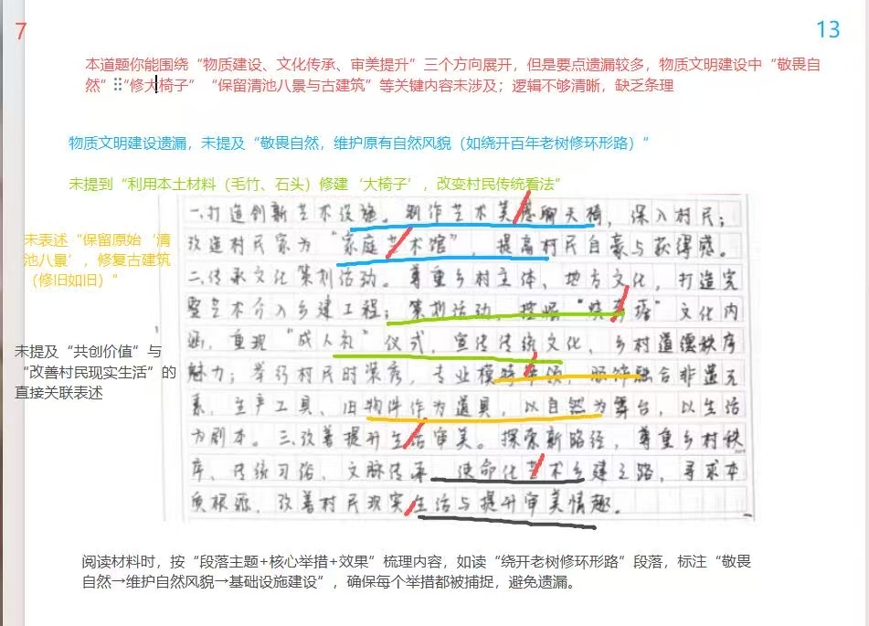
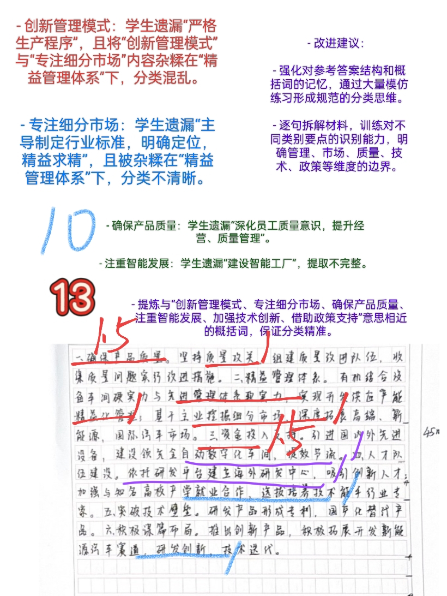
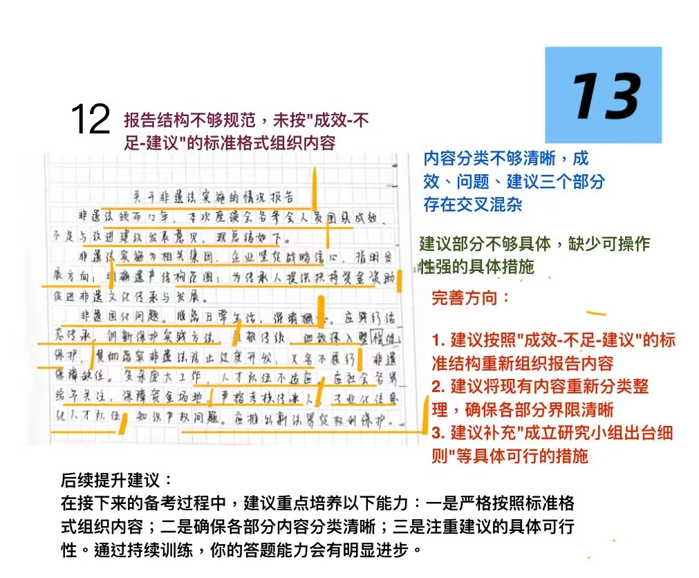
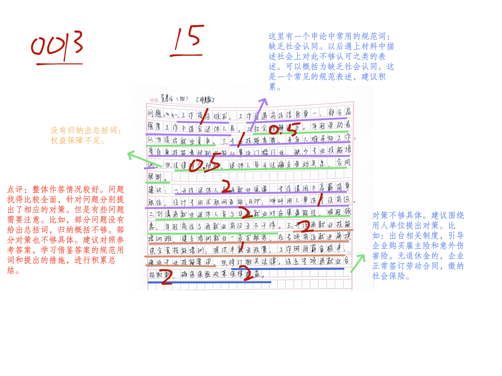

| 昵称    | Y0ungK1ng |
| ----- | --------- |
| Q1得分  | 7         |
| Q2得分  | 10        |
| Q3得分  | 12        |
| Q4得分  | 15        |
| Q5得分  | 22        |
| 总分    | 66        |
| 平均分   | 56        |
| 排名    | 251       |
| 总提交人数 | 1379      |

###  **一、做法概括题**::noto:banana::

| 得分  | 总分  | 区间  |
| --- | --- | --- |
| 7   | 10  | 中   |

::: tip

:::

::: note

:::

::: card title="题干" icon="noto:backhand-index-pointing-right-dark-skin-tone"

**一、“给定资料1” 中提到：“乡村需要的不仅仅是艺术家，更是对乡村有感情并能挖掘本土文化特色的运营官。”请根据“给定资料1”谈谈冯教授团队是怎样当好这个“运营官”的。 (10分)**

要求：全面、准确、有条理。不超过250字。

:::

::: card title="答题" icon="twemoji:astonished-face"

:::

::: card title="答案" icon="typcn:tick-outline"

**集梦**：

尊重乡村主体和地方文化特色，通过艺术乡建，引导村民认识乡村价值，回归、共建家园，打造“清池范式”，体现在：

一、加强物质文明建设，提升村容村貌：

1. 敬畏自然(1)。维护原有自然风貌(1)，修建基础设施。
2. 启发村民。利用本土材料，修建“大椅子” (1)，改变传统看法(1），启发村民也可得分)；开放宅院，改造“家庭美术馆” (1)，合理利用老物件(1)，吸引他人参观；
3. 保留原貌。保留原始“清池八景” (1)，修复古建筑(1)。

二、注重精神文明建设，提升审美情趣：

1. 传承/繁荣乡村文化。挖掘“烧奔塔”文化内涵(1)，重现“成人礼”仪式，重新认识乡村文化独特魅力；
2. 共创价值(1)。开展多样活动，展现村民艺术才能。

尊重乡村主体和地方文化特色，通过艺术乡建，引导村民认识乡村价值，回归、共建家园，打造“清池范式”：

1. 敬畏自然(1)。维护原有自然风貌(1)，修建基础设施。
2. 启发村民。①利用本土材料，修建“大椅子” (1)，改变传统看法(1，启发村民也可得分)。②开放宅院，改造“家庭美术馆” (1)，合理利用老物件(1)，吸引他人参观，提升自豪感；
3. 保留原貌。保留原始“清池八景” (1)，修复古建筑(1)。
4. 传承文化。挖掘“烧奔塔”文化内涵(1)，重现“成人礼”仪式，重新认识乡村文化独特魅力；
5. 共创价值(1)。开展多样活动，展现村民艺术才能。

**白鹭**：

1、情感融入。改善形式，融入村民生活，建设共享设施，接近启发村民。因地制宜改造家庭美术馆，提升村民自豪感和满足感，

2、超越艺术。尊重乡村秩序，传统习俗和文脉传承，以在乡村巡回质朴精神家园为使命。保留原始景观，修旧如旧，尊重自然显性与隐性价值相结合。

3、挖掘遗存以艺术介入相间，引导村民价值判断与回归共建，挖掘传统习俗文化内涵。重现传统仪式，彰显传统文化和乡村社会道德独特魅力。

4、共创价值。开展群众活动，融合非遗与生产生活元素，增强自信，发现美创造美，改善现实生活，提升审美情趣

:::

::: card title="总结答案" icon="typcn:tick-outline"

**Y0ungK1ng**：

1. 接近启发村民。改善形式，就地取材制作大椅子、建设家庭美术馆，提升村民自豪感与获得感。
2. 超越艺术路径。尊重乡村秩序、传统习俗和文脉传承，使命化艺术乡建之路，修旧如旧，尊重自然。
3. 挖掘历史遗存。引导村民价值判断和回归共建，挖掘传统习俗文化内涵，重现传统仪式，彰显传统文化和乡村社会道德秩序独特魅力。
4. 村民共创价值。开展融合非遗元素和乡村特色的时装秀，发现美创造美，增强村民认同感，改善现实生活，提升审美情趣。

:::

::: card title="反思与建议" icon="line-md:compass-loop"

:::

###  **二、原因概括题**::noto:banana::

| 得分  | 总分  | 区间  |
| --- | --- | --- |
| 10  | 15  | 中   |

::: card title="题干" icon="noto:backhand-index-pointing-right-dark-skin-tone"

**二、 “给定资料2” 中，隆金公司虽然做的是配件，但也成为了市场中的主角。请你谈谈隆金公司为什么能成为“市场中的主角” 。 (15分)**

要求： (1)紧扣资料，归纳准确； (2)内容全面，条理清晰； (3)不超过300字。

:::

::: danger

:::

::: card title="答题" icon="twemoji:astonished-face"

:::

::: card title="答案" icon="typcn:tick-outline"

**集梦**：

1. 创新管理模式。严格生产程序，结合软、硬实力，实现精益化管理。
2. 专注细分市场。深度拓展，主导制定行业标准，明确定位，精益求精。
3. 确保产品质量。推进产品质量攻关，深化员工质量意识，提升经营、质量管理。
4. 注重智能发展。投入资金引进先进设备，建设智能工厂、数字化车间等。
5. 加强技术创新。建立研发中心，加强与高校产学和就业合作，引进、培养创新人才。
6. 借助政策支持。政府建立企业培育库，出台促进企业发展相关文件，扶持重点企业。

**白鹭**：

1、做好管理运营。以严格程序保障技术安全，将自身硬实力与各大整车厂商管理软实力结合，同步实现精益化管理；挖掘细分市场，进行深度拓展。【3】

2、确保产品质量。建团队、集问题、促改进，进行质量攻关，通过研发创新与技术迭代做大做强；深化认识，推动经营和质量管理提升，保持专注，明确定位。【6】

3、推动创新发展。坚持投入引进，进行数字化智能化建设；依托研发平台，建立海外研发中心，吸引创新人才；加强与高校产学和就业合作，选拔培养技术能手和行业专家，通过研发实现国产化替代，布局新赛道。【10】

4、政府政策扶持。政府完善产业体系，建设产业集群与企业培育库，出台政策助力企业高质量发展。【12】

:::

::: card title="总结答案" icon="typcn:tick-outline"

**Y0ungK1ng**：

1. 精细管理体系。严格程序保障技术安全，有机结合设备车间硬实力与先进管理体系软实力；挖掘主业细分市场。
2. 确保产品质量。坚持质量攻关，组建质量改进团队，收集质量问题实行改进措施；深化认识，提升公司经营和质量管理。
3. 推动创新发展。投入资金引进先进设备，建设全自动数字化车间、智慧工厂；建立海外研发中心，吸引创新人才，加强与高校产学和就业合作，选拔培养技术能手和行业专家；研发产品形成专利，国产化替代产品，布局新赛道。
4. 政府政策支持。完善产业体系，建设产业集群和企业培育库，出台政策助力企业高质量发展，

:::

::: card title="反思与建议" icon="line-md:compass-loop"

**一、答题内容**

6大关键词：倾听职工心声、助力职工成长、关注心理健康、依法依规维权、提升福利体验、精准回应诉求

**二、答题逻辑**

1. 核心任务：说明“==如何实现==”新格局，不能单纯列举“做了什么”，而要重点概括具体措施及逻辑（其实就是==做法+效果==）；

2. 关键限定词：以“职工需求”为出发点，所有做法紧扣“职工需求” ，即措施是为了解决职工在工作、生活、技能、权益等方面的具体诉求。如：“职工心声大调查”是为了收集职工对工作环境、食堂伙食的需求；“线上培训”是为了满足职工适应数字时代的需求等。

:::

###  **三、公文写作题**::noto:banana::

| 得分  | 总分  | 区间  |
| --- | --- | --- |
| 12  | 20  | 低   |

::: warning

:::

::: card title="题干" icon="noto:backhand-index-pointing-right-dark-skin-tone"

**三、如果你是“给定资料3” 中有关部门的工作人员，请根据座谈会参会人员的发言内容，围绕非遗法实施的成效、不足和改进建议，写一份情况报告 。 (20分)**

要求：

(1)紧扣资料，内容全面； 

(2)要点突出，条理清晰，语言准确；

(3)不超过400字。

:::

::: card title="答题" icon="twemoji:astonished-face"

:::

::: card title="答案" icon="typcn:tick-outline"

**集梦**：

关于非遗法实施的情况报告(1)

非遗法已颁布12年(1)，为进一步了解实施情况，特召开座谈会，相关情况如下(1)：

一、成效显著：
1. 完善政务服务。整体性保护成效显著(1)创新管理办法，创设特色管理体系等；政府关心支持传承人(1)，给予场地、资金等支持。
2. 促进企业发展。指明方向，注入动力，坚定战略信心(1)。
3. 形成社会共识。认识民间文化价值(1)。

二、存在不足：人才队伍不适应专业化、信息化要求(1)，混淆非遗概念(1)，知识产权认定复杂(1)，非遗法落实不到位(1)。

三、改进建议：

1. 加强队伍建设。社会各界多加关注，提供资金、场地保障(1)；严格审核传承人，规范有序带徒授艺(1)。
2. 正视非遗概念。正视活态传承，遵循文化演化规律(1)，创新活化方式(1)，确保原真性。
3. 明确产权认定(1)。求助专家、学者，明晰认定标准，兼顾各方利益(1)。
4. 强化贯彻落实(1)。成立研究小组，因地制宜出台相关落实细则(1)，明确工作要求。

**白鹭**：

关于非遗法实施的情况报告(1)

为进一步了解非遗法实施情况，近期有关部门召开座谈会，现将情况报告如下：【3】

成效：

1、坚定信心，形成非遗传承与市场运作体系。

2、创新办法，创设制度体系，完善软硬件建设。

3、指明方向，以跨界合作助力文化交流。

4、落实支持，为企业提供场地和资金。

5、认识价值，形成保护共识。【7】

不足：

1、人才队伍不适应更高的工作要求。

2、混淆概念，误判、错误认定非遗。

3、非遗传承知识产权认定仍较复杂。

4、地方对非遗法落实没有完全到位。【10】

改进建议：

1、整体保护，重视非遗及其环境的整体性保护。

2、争取关注，动员社会在资金、场地上提供保障。

3、严格考核，严把入口关，加强专业与信息化培训。

4、原真保护，活态传承中礼敬传统，合理延展。

5、保护产权，对再次创作加强知识产权认定与保护。

6、强化落实，研究方法督促履行法定义务、避免过度开发。【16】

:::

::: card title="总结答案" icon="typcn:tick-outline"

**Y0ungK1ng**：

关于非遗法实施的情况报告(1)

非遗法颁布12年，为进一步了解非遗法实施情况，近期有关部门召开座谈会，现将情况报告如下：

成效：1. 坚定信心。形成非遗传承与市场运作体系。2. 创新办法。创设特色制度体系；制定意见办法，开展非遗保护活动。3. 指明方向。跨界活动助力文化活动。4. 落实支持。为企业提供资金、保障。5. 认识价值。形成保护共识。

不足：1. 人才队伍不适应更高工作要求。2. 混淆概念，误判、错误认定非遗。3. 非遗传承知识产权认定仍较复杂。4.地方对非遗法落实没有完全到位。

建议：1. 整体保护，重视非遗及其环境的整体保护。2.争取关注。动员社会在资金、场地上提供保障。3. 严格考核。严把入口关，加强专业与信息化培训。4. 原真保护。活态传承中礼敬传统，合理延展。5. 保护产权。对再次创作加强知识产权的认定与保护。6.强化落实。研究方法督促履行法定业务、避免过度开发。

:::

::: card title="反思与建议" icon="line-md:compass-loop"

:::

###  **四、公文写作题**::noto:banana::

| 得分  | 总分  | 区间  |
| --- | --- | --- |
| 14  | 20  | 中   |

::: warning

:::

::: tip

:::

::: card title="题干" icon="noto:backhand-index-pointing-right-dark-skin-tone"

**四、请根据“给定资料4” ，对退休人员再就业面临的问题进行梳理，并提出解决建议。 (20分)**

要求：

(1)问题梳理全面、准确； 

(2)所提建议具体明确、有针对性、切实可行； 

(3)不超过400字。

:::

::: card title="答题" icon="twemoji:astonished-face"

:::

::: card title="答案" icon="typcn:tick-outline"

**集梦**：

问题：

1.求职难度大(1)：渠道少，岗位信息单一，工作强度大。

2.缺乏社会认同(1) ：年轻人不理解，子女不支持，希望父母帮忙带娃。 

3.从事低门槛行业(1)：缺乏专业技能。

4.权益保障不足(1)：无法签订劳动合同。

建议：

1. 拓展求职渠道。多平台发布求职信息，社区、协会加强与企业对接，提供全面、多样岗位信息；企业人性化管理，设置老年人专职岗位，结合老年人特点优化工作内容 , 降低工作强度。
2. 转变社会观念。媒体加大宣传，引导年轻人正确看待老年人再就业；注重沟通，引导子女支持，打造个人空间。
3. 加强就业帮扶。开设老年人技能培训班，针对热门岗位或兴趣特长展开针对性培训，提供多样化课堂，提升专业性；政企合作，根据企业需求定向培养，提供就业岗位。
4. 完善权益保障。有退休金的老人，企业购买雇主险和意外伤害险。无退休金的，企业正常签订劳动合同，缴纳社会保险。 (每条4分、酌情给分)

**白鹭**：

问题：

1、就业渠道少，岗位信息单一，工作强度偏高。

2、年轻人不理解，认为老年人就业没必要、“抢饭碗”，更应居家帮助子女育儿。

3、老年人能力不足，多低门槛就业，针对性就业技能培训少。

4、缺少法律保障，无法与用人单位确立劳动关系，基本权益无法保障。【5】

建议：

1、拓宽就业渠道。建立健全针对退休人员在就业的社会化用工平台，线上线下多渠道发布信息，通过优惠政策鼓励企业设岗招聘，鼓励社区提供公益性岗位。【8】

2、加强宣传引导。引导形成支持、鼓励退休老年人再就业的舆论氛围，使年轻人正确认识老年人就业价值，尊重老年人人生选择。【11】

3、提升职业能力。鼓励老年大学增设相关课程，引导形成专项培训市场，完善老年人职业技能培训体系。【13】

4、保障基本权益。协调完善现行法律法规与鼓励老年人就业方向差异，完善社保体系，消除雇佣方顾虑；鼓励劳资协商，明确权责，如为老人购买雇主险和意外伤害险。【16】

:::

::: card title="总结答案" icon="typcn:tick-outline"

**Y0ungK1ng**：

问题：

1. 工作岗位难求。岗位渠道信息单一，工作强度偏高。
2. 缺乏社会认同。年轻人认为造成就业竞争，子女希望父母带娃。
3. 专业技能劣势。老年人能力不足，多低门槛就业，针对性就业技能培训少。
4. 缺乏法律保障。无法与用人单位确立劳动关系，基本权益无法保障。

建议：

1. 拓宽就业渠道。建立健全针对退休人员再就业的社会化用工平台，线上线下多渠道发布信息，通过优惠政策鼓励企业设岗招聘，鼓励社区提供公益性岗位。
2. 加强宣传引导。引导形成支持、鼓励退休老年人再就业的舆论氛围，使年轻人正确认识老年人就业价值，尊重老年人人生选择。
3. 加强就业帮扶。开设再就业技能培训班，完善老年人职业培训体系。
4. 保障基本权益。协调完善现行法律法规与鼓励老年人就业方向差异，完善社保体系，消除雇佣放顾虑；鼓励劳资协商，明确权责，如为老人购买雇主险和意外伤害险。

:::

::: card title="反思与建议" icon="line-md:compass-loop"

:::

###  **五、大写作**::noto:banana::

| 得分  | 总分  | 区间  |
| --- | --- | --- |
| 21  | 40  | 高   |

::: tip

- 本题写作核心是反向思维，只要全篇都在论证“反向思维 ”的，不可判为跑题文章。分论点书写是本题难点，部分学生可能把握不好方向，有的可能仅仅参考材料4进行书写，有的可能理解不够深入。
	- 总分论点切入精准，得分24-26；
	- 如果分论点为坚持“破旧立新 ”、聚焦“供需错位 ”、善用“制度赋能 ”任意两个，得分22-24；
	- 如果分论点写政论文，即3个分论点都是反向思维的好处和重要性，得分20-22；
	- 如果分论点写策论文中的应创新、借力、试错、跨界、优化资源配置等，得分20-22.
	- 若以上分论点皆未涉及，考虑偏题文章，得分18-20；

以上只是论点基准分参考，最终得分要根据论证内容、文章结构、书写卷面进行调整。

评分档次：  高 24-26  中20-24  低16-20   跑题10-12

:::

::: card title="题干" icon="noto:backhand-index-pointing-right-dark-skin-tone"

**五、请结合“给定资料5” ，围绕行政执法工作中的“力” 、 “理” 、 “利”进行深入思考，联系实际， 自拟题目，写一篇文章。 (35分)**

要求： 

(1)观点明确，理解深刻；

(2)参考给定资料，但不拘泥于给定资料；

(3)思路清晰，语言流畅； 

(4)字数1000~1200字。

:::

::: card title="答题" icon="twemoji:astonished-face"

:::

::: card title="答案" icon="typcn:tick-outline"

  <h4>谋求“力”“理”利” 提高行政执法质量 

</h4>

“法者,治之端也。”行政执法作为把“纸上的法治”变为“行动中的法治”的重要方式，是实现良法善治的关键;同时,由于行政执法工作面广量大,其执法成效关系国之安泰、民之福祉,因此,在执法过程中,要做到规范执法、精确执法,并不断创新执法方式,谋求执法有力、释法明理、群众获利,从而全面提升行政执法质量和效能。

规范执法,执法有力。“精公无私而赏罚信,所以治也。”在行政执法实践中,人情、关系等因素常常影响执法的公正性,容易产生处罚畸轻畸重的乱象。而规范执法能够防止行政执法不作为、乱作为,让法治权威和法治信仰在全社会形成。近年来,不少地方和领域开展统一执法证件、统一执法标识、统一执法制式服装等改革,保障和监督各级行政执法机关和行政执法人员依法履责,严格规范公正文明执法,切实提高行政执法公信力。未来,要进一步加大执法的监督检查力度,坚决纠正执法不规范问题,从而让执法更有力度。

精确执法,释法明理。曾经,“一刀切”的粗放式执法让群众苦不堪言。而将“释法明理、法理相融”执法理念贯穿执法全过程、各环节,实现“认定讲证据、裁量讲道理、决定讲法律”的精确执法,不仅能够增强执法效果,还能提高群众的法律遵从度,从而实现全民守法的社会治理目标。M 市税务局在执法过程中进行查前政策辅导,解读和剖析税收风险点,不仅让征纳关系融洽,还促进了企业长远发展。可见,只有加强精确执法,在执法过程中讲清事理、法理、情理,才能维护公平竞争的市场秩序和社会秩序,加快推进法治政府建设。

创新执法,群众获利。推进全面依法治国,根本目的是依法保障人民权益,维护人民群众的利益。我国的行政执法工作,主体多、范围领域广、行为数量大,且与广大人民群众的切身利益关系密切,直接关系群众对党和政府的信任、对法治的信心。但目前,仍存在个别执法人员执法简单粗暴、以权压人的现象。为此,必须创新行政执法方式,在推进执法行为全过程记录的同时,接受社会监督,促进全过程阳光执法,做到“利民之事,丝发必兴;厉民之事,毫末必去”,从而让人民群众从每一次执法中感受到公平正义,增强群众法治获得感。

法剑不利,律秤失衡,社会必乱,民必遭殃。法治社会的良好运行,离不开公民对法律的敬畏和遵守,也离不开执法者对法律的规范执行。在行政执法过程中,不仅要“有力”“明理”,更要让群众“获利”,如此才能真正提升执法质量和效能,在全社会形成办事依法,遇事找法、解决问题用法的良好法治氛围。

:::

以“力”“理”“利”共绘行政执法新图景

习近平总书记强调“法治政府建设是全面依法治国的重点任务和主体工程”，行政执法作为连接政府与群众的桥梁，其“力”的边界、“理”的温度、“利”的导向，直接关系法治权威的树立与民生福祉的保障。唯有将“力”“理”“利”有机融合，才能让行政执法既有雷霆之势，又含春风化雨之情，真正成为推进国家治理现代化的坚实支撑。

然而，行政执法在实践中曾面临诸多挑战：部分执法行为存在“重处罚轻教育”的刚性有余而柔性不足，有的因边界模糊导致权力运行失范，还有的脱离群众利益导向引发信任隔阂。这些问题既制约法治政府建设效能，也影响群众获得感。要破解困局，需从“力”“理”“利”三个维度精准发力——以“力”划定执法边界，以“理”传递法治温度，以“利”锚定价值导向，三者协同构建行政执法新范式。

行政执法的“力”，是依规而为的刚性约束，是守护公平正义的制度底气。“法者，治之端也”，执法权的行使必须以法律为标尺，既不能缺位失责，也不可越界滥用。过去部分领域存在的“以罚代管”“裁量畸轻畸重”等问题，根源在于执法力度的失衡与边界的模糊。如今，N省推行“一人一号、人号对应”的执法证件管理，某市市场监管部门建立“天价罚款”“畸轻处罚”双轨整治机制，正是通过规范执法流程、强化全过程监督，让执法权在制度笼子里运行。这种“力”的校准，确保每一次执法都经得起法律检验与时间推敲。

行政执法的“理”，是释法明理的柔性表达，是化解矛盾纠纷的人文密钥。摒弃“重处罚、轻教育”的传统思维，“以理服人”成为新时代执法的鲜明特质。M市税务局在查处企业税收问题时，通过座谈辅导、政策解读、证据出示等环节，让企业从“被动抵触”转为“主动整改”；某地生态环境部门协助制定超标企业整改方案、提供技术指导，实现环保与发展的双赢。这些实践印证了“理”的力量——当执法者将法律条文转化为群众听得懂的“家常话”，将刚性规定融入耐心细致的沟通，减少行政争议，更能让法治理念深入人心。执法中的“理”，正是法治温度的生动体现。

行政执法的“利”，是为民利民的价值导向，是检验执法成效的根本标尺。“政之所兴在顺民心”，行政执法的最终目标不是惩罚惩戒，而是维护群众合法权益、增进公共利益。从行政执法公示平台上线保障群众知情权，到重大执法决定邀请群众代表监督提升参与度无不彰显“以人民为中心”的执法理念。过去“简单粗暴、脱离群众”的执法方式之所以引发反感，正是因为背离了“利”的导向。如今，将群众利益作为执法的出发点与落脚点，才能赢得群众的理解与支持，筑牢政府公信力的根基。

“力”是执法的骨骼，“理”是执法的血脉，“利”是执法的灵魂。当执法既有雷霆万钧的力度，又有春风化雨的温度，更有为民谋利的准度，法治政府的建设便会迈出坚实步伐，而这正是推进国家治理体系和治理能力现代化的生动注脚，也是新时代赋予行政执法工作的光荣使命。