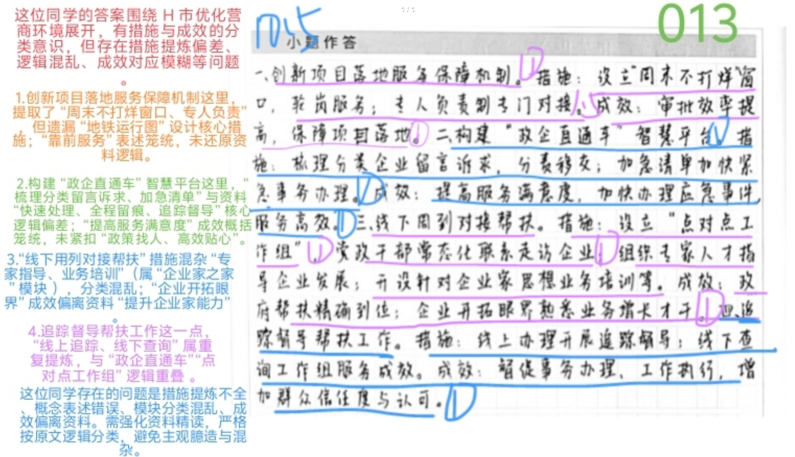
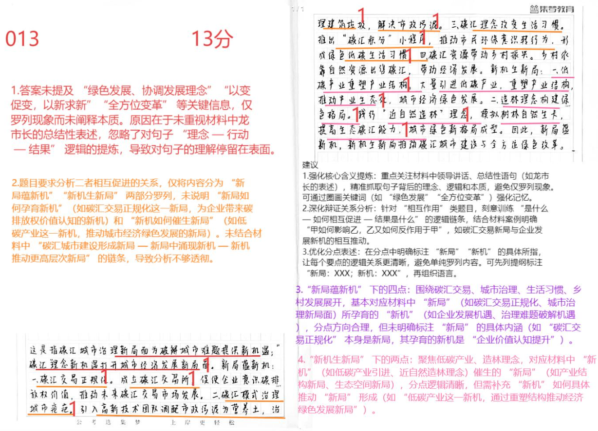
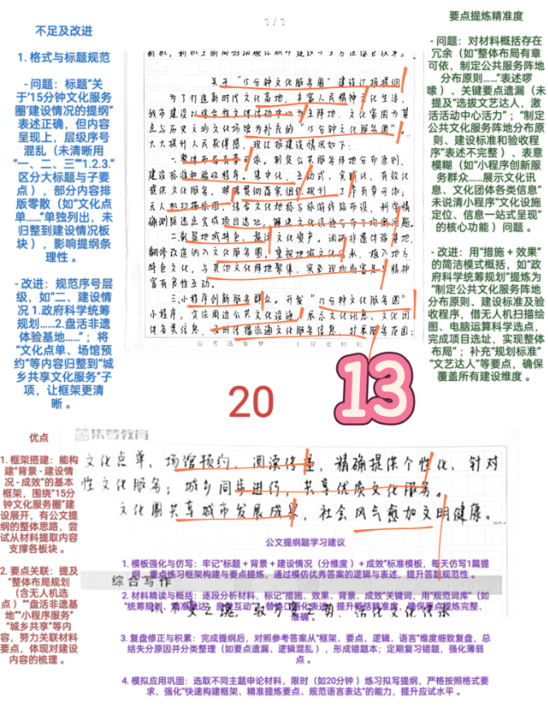
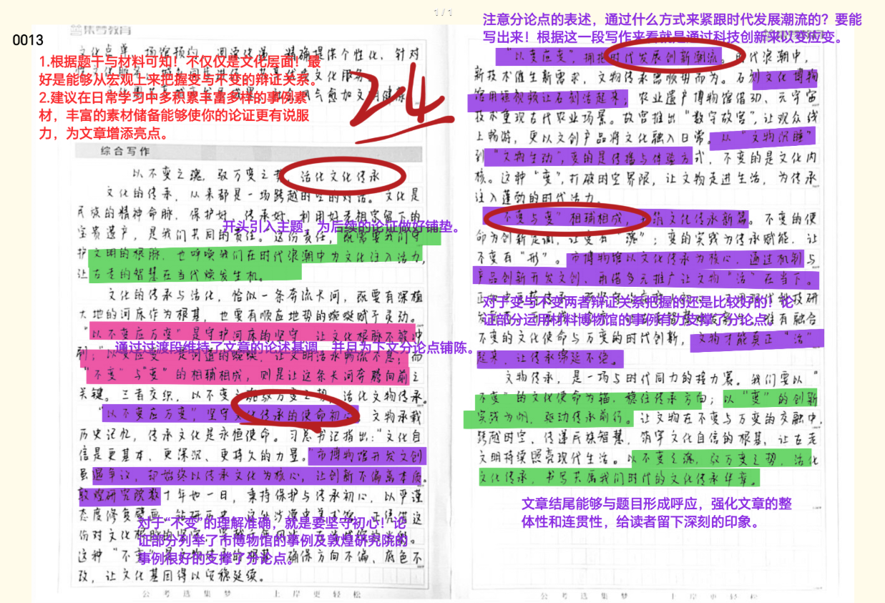

| 昵称    | Y0ungK1ng |
| ----- | --------- |
| Q1得分  | 10.5      |
| Q2得分  | 13        |
| Q3得分  | 20        |
| Q4得分  | 24        |
| 总分    | 67.5      |
| 平均分   | 59        |
| 排名    | 141       |
| 总提交人数 | 572       |

###  **一、措施+成效概括题**::noto:banana::

| 得分   | 总分  | 区间  |
| ---- | --- | --- |
| 10.5 | 15  | 中   |

::: danger
切忌混乱，措施与成效混杂！！
:::

::: card title="题干" icon="noto:backhand-index-pointing-right-dark-skin-tone"

**一、根据“给定资料1” ，请概括H市为优化营商环境采取了哪些措施，取得了哪些成效。（15分）**

要求：全面、准确、有条理，不超过350字。

:::

::: card title="答题" icon="twemoji:astonished-face"

:::

::: card title="答案" icon="typcn:tick-outline"

1. ==创新项目落地服务保障机制==：（1）
	- ① 将项目建设各环节设计为“地铁==运行图==”，明确标识；
	- ② 设立“==周末不打烊==”窗口，实行轮岗制；
	- ③ 采取==专人负责==制，对接全环节。 
	- （1.5）
	- ==成效=={.warning}:项目早落地，办理过程清晰，审批效率提升（1）
2. ==开启“政企直通车”智慧平台==（1）
	- ① 快速==处理企业诉求==，全程留痕，追踪督导办理结果、时限。
	- ② ==解读政策==，发布、更新、推送最新政策，搭配讲解视频。
	- （1.5）
	- ==成效=={.warning}:政策找人，服务快速高效贴心。（1）
3. ==建立“点对点工作组”制度==（1）
	- 党政干部==常态化==联系企业，督导组查询服务成效。（1.5）
	- ==成效=={.warning}:政府更加了解企业，帮扶周到细致精准。（1）
4. ==打造“企业家之家”==（1）
	- ① ==开设“商务大讲堂”“民营企业家学院”==，免费培训企业家；
	- ② ==选派企业高管==到经济管理部门学习。
	- （1.5）
	- ==成效=={.warning}:促进企业家成长，提升其思想、业务水平，实现企业健康成长。（1）

逻辑分（1）

:::

::: card title="反思与建议" icon="line-md:compass-loop"

该同学答案围绕 H 市优化营商环境展开，有措施与成效的分类意识，但存在措施提炼偏差、逻辑混乱、成效对应模糊等问题 。

1. **创新项目落地服务保障机制方面**：提取了 “周末不打烊窗口、专人负责”，但遗漏 “地铁运行图” 设计核心措施；“靠前服务” 表述笼统，未还原资料逻辑 。
2. **构建 “政企直通车” 智慧平台方面**：“梳理分类留言诉求、加急清单” 与资料 “快速处理、全程跟踪、适度督导” 核心逻辑偏差；“提高服务满意度” 成效概括笼统，未紧扣 “政策找人、高效贴心” 。
3. **“线下用列对接帮扶” 方面**：措施混杂 “专家指导、业务培训（属‘企业家之家’模块 ）、分类混乱；‘企业开拓眼界’成效偏离资料‘提升企业家能力’” 。
4. **追踪督导帮扶工作方面**：“线上追踪、线下查询” 属重复提炼，与 “政企直通车”“点对点工作 组” 逻辑重叠 。

该同学存在的问题是措施提炼不全、概念表述错误、模块分类混乱、成效偏离资料。需强化资料精读，严格按原文逻辑分类，避免主观臆造与混杂 。

:::

###  **二、综合分析题**::noto:banana::

| 得分  | 总分  | 区间  |
| --- | --- | --- |
| 13  | 20  | 中   |

::: card title="题干" icon="noto:backhand-index-pointing-right-dark-skin-tone"

**二、 “给定资料2”中画线部分提到， “新局蕴新机，新机生新局。 ”请你谈谈对这句话的理解。（20分）**

要求：（1）紧扣资料，分析透彻；（2）条理清晰，逻辑性强；（3）不超过350字。

:::

::: card title="答题" icon="twemoji:astonished-face"

:::

::: card title="答案" icon="typcn:tick-outline"

这指我们正以绿色发展、协调发展（1）的新理念推动碳汇城市建设（1），以变促变，以新求新（1），带来从个人到城市，从观念到行为的全方位变革（1）。体现在：

1. ==促进经济发展==（1）。重塑产业结构，推动产业生态化，成立碳交易所（1），推进碳汇交易正规化（1），促使企业意识到碳排放权价值，偏远地区出售碳汇资源促进增收。
2. ==优化城市空间==（1）。践行“近自然造林”理念（1），模拟自然界森林生长环境（1），实现个性生长、自然演替，形成生命力和包容性极强的生态系统（1）。
3. ==创新城市治理==（1）。引入高新技术团队，制作营养土，播种花草，变“城市疮疤”为新的风景线（1），治理建筑垃圾，解决市政污泥（1）。
4. ==形成全面风尚==（1）。设置“碳汇积分”（1），量化记录市民减排行为（1），推动环保意识向环保行为转化（1），实现绿色低碳。

因此，碳汇城市建设带来新机遇，各地应持续提升碳汇能力的新路径。

:::

::: card title="反思与建议" icon="line-md:compass-loop"

1. 答案未提及 “绿色发展、协调发展理念”“以变促变，以求新新”“全方位变革” 等关键信息，仅罗列现象而未阐释本质。原因在于未重视材料中龙市长的总结性表述，忽略了对==句子 “理念 — 行动 — 结果” 逻辑的提炼==，导致对句子的理解停留在表面。

2. 题目要求分析二者相互促进的关系，仅将内容分为 “新局蕴新机”“新机生新局” 两部分罗列，未说明 “新局如何孕育新机”（如碳汇交易正规化这一新局，为企业带来碳排产权价值认知的新机 ）和 “新机如何催生新局”（如低碳产业这一新机，推动城市经济绿色发展的新局 ）。未结合材料中 “碳汇城市建设形成新局 — 新局中涌现新机 — 新机推动更高层次新局” 的链条，导致分析不够透彻。

3. “新局蕴新机” 下的四点：围绕碳汇交易、城市治理、生活习惯、乡村发展展开，基本对应材料中 “新局”（如碳汇交易正规化、城市治理新局面 ）所孕育的 “新机”（如企业发展机遇、治理难题破解机遇 ），分点方向合理，但未明确标注 “新局” 的具体内涵（如 “碳汇交易正规化” 本身是新局，其孕育的新机是 “企业价值认知提升” ）。
4. “新机生新局” 下的两点：聚焦低碳产业、造林理念，对应材料中 “新机”（如低碳产业引进、近自然造林理念催生的 “新机” ）（如产业结构新局、生态空间新局 ），分点逻辑清晰，但需补充 “新机” 如何具体推动 “新局” 形成（如 “低碳产业这一新机，通过重塑结构推动经济绿色发展新局” ）。

**建议**
1. ==强化核心含义提炼==：重点关注材料中领导讲话、总结性语句（如龙市长的表述 ），精准抓取句子背后的理念、逻辑和本质，避免仅罗列现象。可通过圈画关键词（如 “绿色发展”“全方位变革” ）强化记忆。
2. ==深化辩证关系分析==：针对 “相互作用” 类题目，刻意训练 “是什么 — 如何相互促进 — 结果是什么” 的逻辑链条，结合材料案例明确 “甲如何影响乙，乙又如何反作用于甲”，如碳汇交易新局与企业发展新机的相互推动。
3. ==优化分点表述==：在分点中明确标注 “新局”“新机” 的具体所指，让每个要点的逻辑关系更清晰，避免单纯罗列内容。可先列提纲标注 “新局：XXX；新机：XXX”，再组织语言。
:::

###  **三、公文写作题**::noto:banana::

| 得分  | 总分  | 区间  |
| --- | --- | --- |
| 20  | 25  | 中上  |

::: tip
有很大进步
:::

::: card title="题干" icon="noto:backhand-index-pointing-right-dark-skin-tone"

**三、邻市有关部门拟到W市考察“15分钟文化服务圈”建设问题。假如你是W市政府工作人员，请根据“给定资料3”拟写一份介绍“15分钟文化服务圈”建设情况的提纲。（25分）**

要求：

（1）紧扣资料，要点完整；

（2）条理清晰，语言流畅；

（3）不超过500字。

:::

::: card title="答题" icon="twemoji:astonished-face"

:::

::: card title="答案" icon="typcn:tick-outline"

  <h4>关于“15分钟文化服务圈”建设情况的介绍提纲（1）</h4>

**一、背景**：为打造新时代文化高地，丰富人民精神文化生活（1），我市建设以综合性文体活动中心为主阵地、以文化家园为基点、以其他不可移动文物和历史文化场馆为补充（1）的“15分钟文化服务圈”（1） ，为周边社区提供文化服务，提升群众获得感（1）。

**二、建设情况**：
1. ==科学统筹规划==（1）。制定公共文化服务阵地分布原则、建设标准和验收程序（1）；整体布局，提供集中、互动、适应实际需求的文化服务（1）；科学精确测距、选点，均衡分布文化设施，完成项目选址（1）。
2. ==盘活非遗体验基地==（1）。重新装修和改造基地（1），产生集聚效应（1），形成新旅游带，彰显文化特色，盘活文化资产，实现物质精神良性互动（1）。
3. ==保障服务信息流通==（1）。树立指示牌（1），标注公共文化设施位置（1），方便群众找到目的地；开发小程序（1），及时传播文化服务信息。
4. ==城乡共享文化服务==（1）。定期组织文艺活动，提供服务项目（1）；借助小程序推出“文化点单”“场馆预约”“阅读传递”等精准服务（1），灵活满足群众需求，提供个性化服务（1）

**三、成效**："15分钟文化服务圈"让城市社会风气更加文明健康（1），让所有人共享城市发展成果（1）。

:::

::: card title="反思与建议" icon="line-md:compass-loop"
- **不足及改进** 
	- **1.格式与标题规范改进**： 
		- **问题**：标题 “关于 15 分钟文化服务圈 ' 建设情况的提报” 表述正确，但内容呈现上，层级序号混乱 (未清晰用 "一、二、(三)"1.2.3."区分大标题与内容要点)，部分内容排版零散 (如" 文化点单 "…" 建设情况，未归整到单独列出板块)，影响提报条理性。  
		- **改进**：规范序号层级，如政府科学统筹规划→1. 政府一、建设情况规划…2. 盘活非遗体验基地…"; 将" 共享文化服务 "板块下内容归整到" 城乡均等化 " 等专门化服务子项，让框架更清晰。
	- **2.要点提炼精准度问题**：
		- **问题**：对材料概括存在冗余（如 "整体布局有章可循，制定公共服务阵地分布原则…" 表述啰嗦）、关键要点遗漏（未提及 "建设文化馆总分馆制"）、表述宽泛（如 "制定公共文化服务阵地分布原则、建设标准和验收规则" 表述笼统）、表意模糊（如 "展示文化新服务"" 小橙序创新展播群众…"未清晰说明" 文化点单 ""文化馆总分馆" 等信息）、逻辑混乱（"一站式呈现" 核心功能未说清）问题。  
		- **改进**：用 "措施 + 效果" 精准概括，如政府构建文化服务阵地为 "制定科学规划（如 ' 政府科学统筹规划 ' 提炼为 ' 制定科学规划 ' ）"" 限定次序、建设标准和验收规则（如 ' 制定公共文化服务阵地分布原则、建设标准和验收规则 ' 提炼为 ' 规范建设标准与验收流程 ' ）"；补充" 建设文化馆总分馆制（如 ' 集约化图书馆群 ' ）""无人机柜及检索屏（如 ' 无人配送站点布局 ' ）"" 建设标准和验收规则（如 ' 培育集约化图书馆群，工作有声有色 ' ）""精准投放（如 ' 结合文化标签与路线科学设置 ' ）" 等要点，确保覆盖所有建设维度。
- **优点相关**：
    - 1. **框架搭建**：能构建 "背景 - 建设情况 - 成效" 的基本框架，围绕 "15 分钟文化服务圈" 建设的整体布局、实践路径、成效展开，有公文提报的材料选取意识，尝试从各村镇内容支撑各板块。  
	- 2. **要点关联**：提及 "整合布有机动 (含无人配送站点)" 小橙序服务 ""盘活非遗基地"" 建设文化圈共享优质资源 " 等小服务惠内容，体现建设要点，努力关联材料要实现对文化圈建设内容的梳理。
- **公文提报学习建议相关**：
    - 1. **模板深化与仿写**：牢记 "标题 + 背景 + 措施 + 建设情况（分维度）+ 成效" 标准模板，每天仿写 1 篇提纲，重点练习框架构建与要点提炼，通过模仿优秀答案的逻辑与表述，提升答案规范性。  
	- 2. **材料精读与概括**：逐段分析材料，标记措施、效果、背景、成效关键词，用 "规范词库"（如 "统筹规划、激发文化活力、数字赋能、精准滴灌、提升效能" ）转化表述，确保要点完整、逻辑清晰。  
	- 3. **复盘修正与积累**：完成提报后，对照参考答案从框架、要点、逻辑、语言维度细致复盘，总结失分原因并分类整理（如要点遗漏、逻辑混乱 ），形成错题本；定期复习错题，强化薄弱点。  
	- 4. **模拟应用巩固**：选取不同主题申论材料，限时（如 20 分钟 ）练习拟写提报，严格按照格式要求，强化 "快速构建框架、精准提炼要点、规范语言表达" 的能力，提升应试水平。
:::

###  **四、大写作**::noto:banana::

| 得分  | 总分  | 区间  |
| --- | --- | --- |
| 24  | 40  | 中   |

::: danger
审题！不要限制在文化中。
:::

::: card title="题干" icon="noto:backhand-index-pointing-right-dark-skin-tone"

**四、“给定资料 4”中，两处画线部分先后提到，“我们要以不变应万变”，“我们要以变应变”。请你深入思考这两句话之间的关系，参考给定资料，联系实际，自选角度，自拟题目，写一篇议论文。（40 分）** 

要求：

（1）观点明确，见解深刻；

（2）内容全面，结构完整；

（3）思路清晰，语言流畅；

（4）总字数 1000-1200 字。

:::

::: warning

点没抓牢

:::

::: card title="答题" icon="twemoji:astonished-face"

:::

::: card title="答案" icon="typcn:tick-outline"

- 立意：深刻把握“变”与“不变”的辩证法

	- 注意：写文化传承变与不变也可以

- 分论点：

	- 不变 ==》不忘初心，砥砺前行

	- 变 ==》与时俱进，勇于创新

	- 变与不变 ==》深刻把握，互相促进

  <h4>深刻把握“变”与“不变”的辩证法</h4>

变与不变，本身就是一对哲学命题。唯物辩证法认为，事物处于不断运动变化发展中，变是无条件的、绝对的；同时又认为，事物的变化不是杂乱无章的，而是有其相对的稳定性。中国特色社会主义进入新时代，与改革开放 40 年来的发展既一脉相承又与时俱进，既坚持发展道路又不断推动变革。在新时代开启的伟大征程中，深刻把握 “变” 与 “不变” 的辩证法，对开启新征程具有重大的现实意义和深远的历史意义。(==开头示例1==)

  

事物是不断变化的，社会是在变化中前进和发展的。凡是适应这个时代的潮流，引领这个时代的发展，那么，这个变化就是积极的、向上的、蓬勃的；反之，则是消极的、没落的、萎缩的。辩证法认为，变是永恒的不变。同时，事物本质的内在规定性是不变的，是具有稳定性、长期性和坚韧性的。在新时代开启的伟大征程中，深刻把握 “变” 与 “不变” 的辩证法，对开启新征程具有重大的现实意义和深远的历史意义。(==开头示例2==)

  

不变意味着不忘初心，砥砺前行。中国特色社会主义进入新时代，理论和实践的主题没有变，马克思主义理论指导没有变，人民对美好生活的向往是我们的奋斗目标没有变…… 这些都表明了中国共产党人的初心和使命始终没变，那就是为中国人民谋幸福，为中华民族谋复兴。初心使命，从来不是空泛的，而是始终根植于人民群众的切身利益之中。检验初心使命，衡量工作成效，最终都要看群众难题是否真正得到解决，人民权益是否真正得到保障。因此，广大党员干部牢牢把握 “守初心” 的核心内涵，坚定不移践行党的宗旨。

  
变意味着与时俱进，勇于创新。（鲧因循故而成毁，蜂缘脱壳而新生）蛹因褪茧而成蝶，蝉缘脱壳而新生。君可见，宜兴非遗传承人鲍杏娣在坚守青瓷技艺的同时，善于变通，敢于打破常规，将青瓷独家釉料配方无偿捐出，开启了非遗项目的现代化传承之路，让青瓷重新焕发出夺目的光泽；著名作家白先勇先生创新打造青春版《牡丹亭》，在尊重古典的基础上寻求新的变化，谨慎加入现代元素，使《牡丹亭》这一古老戏曲能够符合当代人的审美趣味，在当代舞台上大放光彩；2017 年，一群富有青春活力的艺术生把白居易的《琵琶行》改编成流行歌曲，不仅旋律动听、朗朗上口，而且还在副歌部分用上了戏曲腔，便于记忆，深受中学生的喜爱。由此观之，善变者因时、因地、因人、因材而变。

  

“集合哨” 吹得 “响”，要增强工作实效，推进高效治理。以党建引领社区治理的效能如何，关键要看有没有解决实际问题，要看人民群众是否满意。村口安装路灯，老旧公园修整改造，健身广场的设施更换升级…… 社区治理面临的事情看起来很小，却是关系城乡居民生活品质的大事。每一位社区党员干部都要锚定人民群众对美好生活的向往，增强暖民心、纾民困、解民忧的紧迫感，提高破解难题的本领，下足绣花功夫、做好精细文章，让群众的获得感、幸福感、安全感更加充实、更有保障、更可持续。

  

深刻把握变与不变互相促进的辩证关系。当不变居于主导地位时，事物处于相对的稳定、平衡、静止状态；当变居于主导地位时，事物则处于运动、量变到质变乃至发展状态。变与不变两者相互依赖、相互包含，并在一定条件下相互转化、相互促进。正如苏轼说：“自其变者而观之，天地曾不能以一瞬。”而他又说：“自其不变者而观之，物与我皆无尽也。”可见，变与不变是相对的，世界就是在变与不变中不断发展演化的。要把变与不变有机统一起来，认识与把握不变中有变，变中有不变。

  

“无端忽作太平梦，放眼昆仑绝顶来” 。在新中国经济高速发展腾飞的当下，理当响应时代号召，顺应局势变幻，履职尽责，积极作为，同时在中国特色社会主义进入发展关键时期的重要节点，用好变与不变的辩证法，牢牢把握我国社会发展的阶段性特征，在新的伟大斗争中赢得胜利。
:::