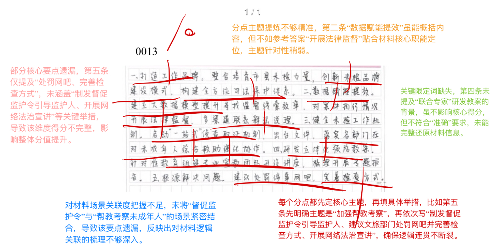
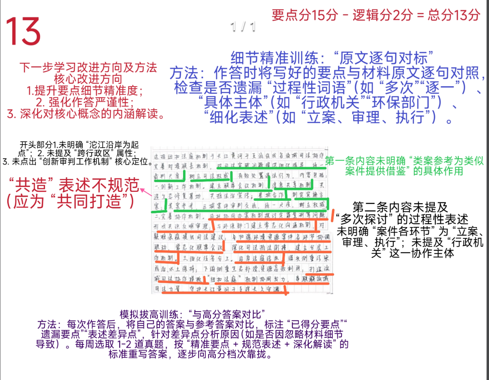
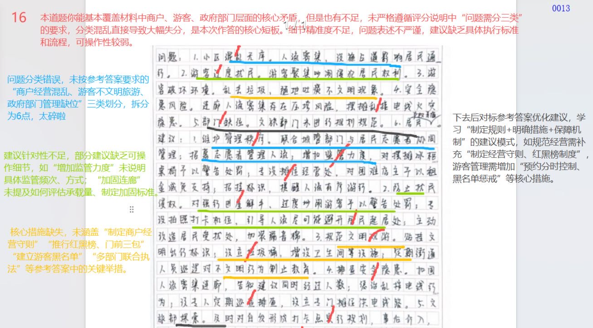

[试卷详情 | 囊中对比](https://www.srnz.net/community/studyRoom/paper/detail/863)

| 昵称    | Y0ungK1ng |
| ----- | --------- |
| Q1得分  | 10        |
| Q2得分  | 12        |
| Q3得分  | 18        |
| Q4得分  | 22        |
| 总分    | 62        |
| 平均分   | 58        |
| 排名    | 424       |
| 总提交人数 | 1238      |

###  **一、理由概括题**::noto:banana::

| 得分  | 总分  | 区间  |
| --- | --- | --- |
| 10  | 15  | 中   |

::: warning

字数极限！

:::

::: tip

第五个点由于字数问题少点严重！

后面两点漏点严重，注重字数控制。

:::

::: card title="题干" icon="noto:backhand-index-pointing-right-dark-skin-tone"

**一、请根据“给定资料1”。概括“亮晶晶”未检团队在保护未成年工作方面的举措。（15分）**

要求：全面、准确、有条理，不超过200字。

:::

::: card title="答题" icon="twemoji:astonished-face"

:::

::: card title="答案" icon="typcn:tick-outline"

**集梦**：

1. 打造工作品牌。创新建设模式，构建全方位司法保护体系。

2. 开展法律监督。借助大数据模型寻找线索，发出检察建议；联系被执行人，开展释放说理。

3. 强化“一站式”保护。启动侦查取证机制，收集证据指控犯罪；多部门协作开展综合救助。

4. 注重预防。梳理汇报案件；联合专家研发立体化预防教案，组建宣教队伍开设讲座；

5. 加强帮教考察。制发督促监护令，正向引导监护人；建议相关部门完善执法工作；开展网络法治宣讲。

**中公**：

1. 品牌建设。打造未检品牌,构建全方位司法保护体系。

2. 数字监督。借助大数据模型开展法律监督,释法说理。

3. 完善机制。启动“一站式”侦査取证机制;出台政策,规范工作流程,强化部门协作。

4. 加强预防。梳理汇报犯罪案件,部署开展专项行动;联合专家研发预案、开展团队培训,组建专业宣教队伍并开设专题讲座。

5. 帮教考察。制发督促监护令,联合多方力量,为未成年人提供全方位帮助;发出检察建议,完善网吧监管,依托法治副校长开展网络法治宣讲。

:::

::: card title="反思与建议" icon="line-md:compass-loop"

1. 主题提炼  
     • 问题：第二条“数据赋能提效”未直击“法律监督”核心。  
     • 建议：改为“开展法律监督”。
    
2. 要点遗漏  
     • 问题：第五条缺“制发督促监护令、网络法治宣讲”等关键举措。  
     • 建议：补全“制发督促监护令→引导监护人；开展网络法治宣讲”。
    
3. 限定词缺失  
     • 问题：第四条未提“联合专家”研发背景。  
     • 建议：加“联合专家研发教案”。
    
4. 场景关联  
     • 问题：未把“督促监护令”与“帮教考察”场景挂钩。  
     • 建议：先定主题“加强帮教考察”，再列举措，逻辑闭环。

:::

::: card title="总结答案" icon="typcn:tick-outline"

**Y0ungK1ng**：

1. 品牌建设。创新未检品牌建设模式，构建全方位司法保护体系。
2. 数字监督。借助大模型开展法律监督，发出检察建议；多渠道联系开展释法说理。
3. 健全机制。启动“一站式”侦查取证机制；出台政策，强化部门协作。
4. 注重预防。梳理汇报案件；联合专家研发立体化预防教案，开展教学培训，组建专业宣教团队并开设专题讲座。
5. 帮教考察。制定监督监护令，正向引导监护人；建议相关部门完善执法工作；开展网络法治宣讲。

:::

###  **二、综合分析题**::noto:banana::

| 得分  | 总分  | 区间  |
| --- | --- | --- |
| 13  | 20  | 中   |

::: card title="题干" icon="noto:backhand-index-pointing-right-dark-skin-tone"

**二、请根据“给定资料2”，谈谈你对“纽扣法庭”为守护长江黄河干支流长久安澜扣好“同心扣”的理解。（20分）**

要求：分析全面，理解透彻，条理清晰，不超过350字。

:::

::: tip

句子分析题

解释-分析-评价

:::

::: card title="答题" icon="twemoji:astonished-face"

:::

::: card title="答案" icon="typcn:tick-outline"

**集梦**：

这指以沱江沿岸(1)多个法庭跨行政区(1)推广建立“纽扣法庭”(1)，加强司法协作/创新审判工作机制，守护长江黄河干支流生态环境(1)。体现在：

1. 提供类案参考(1)。互通审判结果(1)，为类似案例提供借鉴参考，助力统一裁判尺度(1)，树立司法权威(1)。

2. 提升办案智慧(1)。依托协同办案机制(1)，多次探讨案件细节(1)，形成共识(1)，用于案件审理。

3. 注重部门合作(1)。与环保部门建立常态化沟通机制，针对行政执法工作中的难题提出司法建议(1)；在环境资源案件立案、审理、执行等环节加强协调联动(1)，常态化开展联席会议，深化环境司法与环境执法衔接，与行政机关共同探索建立分层工作机制(1)。

4. 持续推广复制(1)。沿岸法庭结对(1)，明确任务分工(1)，推广“纽扣法庭”机制，打造可复制的流域司法协作四川样板(1)。

因此，要持续完善“纽扣法庭”机制，筑牢长江黄河的生态司法屏障。（省略）

评分说明：1.关键词每个1分，不需“盖帽” ； 2.逻辑分3分，根据分析题思路、中间部分分条酌情倒扣1-3分。

**JBC**：

这句话指沱江沿岸法庭跨行政区域结对建立"纽扣法庭"，各有分工，相互协作，形成守护沱江保护合力。

1. 丰富工作机制。突破地域限制，联合制定"纽扣法庭"工作机制，联席会议机制，信息共享机制，打造生态修复基地，推进法治宣传。

2. 加强类案参考。联合审理案件，互通审判结果，为类案提供借鉴参考，助力统一裁判尺度，树立司法权威。

3. 凝聚办案智慧。共同探讨，形成共识，用于案件审理，办案各环节加强协调联动，常态化召开联席会议。

4. 加强部门合作。与环保部门建立常态化沟通机制，为行政执法工作提出司法建议；深化环境司法与执法衔接，与行政机关共同探索建立分层工作机制。

5. 拓展实施范围。推广机制，打造可复制的流域司法协作四川样板，造就更多"纽扣法庭"同向发力。

:::

::: card title="反思与建议" icon="line-md:compass-loop"

1. 细节精准  
     • 问题：缺“沱江沿岸起点”“跨行政区”“创新审判机制”关键词。  
     • 改法：首句补“以沱江沿岸为起点，跨省级行政区，创新审判工作机制”。
    
2. 过程/主体遗漏  
     • 问题：未写“多次探讨”“行政机关”“立案审理执行”。  
     • 改法：加“多次联合行政机关对立案、审理、执行各环节进行探讨”。
    
3. 表述规范  
     • 问题：“共造”应为“共同打造”；缺“类案参考”作用。  
     • 改法：改“共造”为“共同打造”，补“为类案提供借鉴，统一裁判尺度”。
    
4. 训练方法  
     • 对标：写完逐句核对原文，圈出缺的过程词、主体、细化概念。  
     • 拔高：每周1-2题，对照高分答案，标“已得/遗漏/差异”，按“精准+规范+深化”重写。

:::

::: card title="总结答案" icon="typcn:tick-outline"

**Y0ungK1ng**：

这指以沱江沿岸多个法庭跨行政区推广建立“纽扣法庭”，加强司法协作/创新审判工作机制，守护长江黄河干支流生态环境。体现在：

1. 丰富工作机制。联合制定工作机制，联席会议机制、信息共享机制、打造生态修复基地，推进法治宣传。
2. 加强类案参考。互通审判结果，未类案提供借鉴参考，统一裁判尺度，树立司法权威。
3. 凝聚办案智慧。依托协同办案机制，探讨问题形成共识，反哺审理。
4. 加强部门合作。建立常态化沟通机制，为执法工作难题提出司法建议；常态化开展联席会议，深化衔接，与行政机关共同探索建立分层工作机制。
5. 持续推广复制。沿岸法庭结对，明确任务分工，推广结对机制，打造可复制流域司法协作四川样板。

因此，要持续完善“纽扣法庭”机制，筑牢长江黄河的生态司法屏障。

:::

###  **三、对策建议题**::noto:banana::

| 得分  | 总分  | 区间  |
| --- | --- | --- |
| 16  | 25  | 低   |

::: warning

1. 分类硬伤  
     • 问题：未按“商户-游客-政府”3类归并，拆6点太碎。  
     • 改法：一律重排→  
      ①商户经营混乱：占道、噪音、无照  
      ②游客不文明：乱丢垃圾、吐痰、聚集拍照  
      ③政府管理缺位：缺预约机制、承载量评估、联合执法
    
2. 细节/标准缺失  
     • 问题：仅写“增加监管力度”“加固连廊”，无频次、标准。  
     • 改法：补“城管每日2次巡查；住建按《景区廊桥荷载规范》C级标准加固”。
    
3. 建议缺抓手  
     • 问题：无“红黑榜、门前三包、分时预约、黑名单”等硬核措施。  
     • 改法：  
      商户→“制定经营守则+红黑榜+门前三包”  
      游客→“预约分时+黑名单+即时劝导队”  
      政府→“文旅牵头，市监、城管、消防月度联合执法”

:::

::: card title="题干" icon="noto:backhand-index-pointing-right-dark-skin-tone"

**三、假如你是华林坝街道办工作人员小谢，请根据“给定资料3”，就如何平衡好家和苑小区的文旅发展与居民日常生活，提出工作建议。（25分）**

要求：

（1）先梳理所有问题，再提出建议；

（2）问题梳理全面准确，建议针对性强、切实可行；

（3）不超过500字。

:::

::: card title="答题" icon="twemoji:astonished-face"

:::

::: card title="答案" icon="typcn:tick-outline"

**集梦**：

问题：

1. 商户经营混乱(1)。占道经营，影响出行；乱接电线，存安全隐患。(1)
2. 游客不文明旅游/参观(1)。噪音扰民、破坏环境、私闯民宅，大量聚集在连廊、村楼体倒塌隐患。(1)
3. 政府部门管理缺位(1)。文旅部门缺少相关规范的规划；相关部门没有提前预案，介入管理不及时。(1)

建议：(每点6分，酌情赋分）

1. 规范经营秩序。制定并执行“商户经营守则”，聚焦占道经营、乱拉电线等高频问题，明确红线与处罚标准；划定经营区域、设置固定摊位，完善给排水、电力、消防等基础设施；引导居民组建志愿者服务队，动员商户成立自治商会，推行“红黑榜”、门前“三包”；

2. 引导游客文明参观。完善垃圾桶、公共厕所等配套设施，设置文明旅游提示牌与“随手拍”奖励；建立“黑名单”，对破坏文物、私闯民宅等行为实施记录、曝光、限入等联合惩戒；对连廊、楼体等脆弱部位开展承载量评估，实行预约分时与现场总量控制；

3. 政府加强管理。完善顶层设计与标准规范，由文旅部门牵头制定街区业态布局、营业时段、噪音控制、消防疏散等标准；常态开展多部门联席会议与联合执法，高峰期启动应急值守、快速处置与信息发布机制，线上线下协同指挥，提升跨部门响应速度与办案质效。

**评分说明**：

1. 要求梳理完问题再写建议，必须先写完所有问题再写建议，否则扣3分； 
2. 要求问题梳理准确，问题必须分成答案中的这三条，否则扣6分。

**小新**：

**一、问题** 

1. 通行安全受威胁：游客聚集导致拥堵；连廊超负荷承载，存在结构安全隐患。

2. 居住环境遭破坏：游客喧哗扰民；不文明行为频发，部分游客强行入户使用设施。
3. 经营秩序较混乱：商户占道经营，楼道内摆放桌椅、乱接电线；业态缺乏规范引导。
4. 管理机制不健全：小区非正规景区，文旅部门无专项规划，街道与社区协调力度不足，缺乏多方联动管理预案。5.利益平衡难实现：居民居住权益与商户经营需求矛盾突出。

**二、建议**

1. 保障居民通行安全：划定游客参观路线与时段，避开居民出行高峰；对空中连廊实施人流管控，委托专业机构检测结构安全。
2. 规范游客行为举止：设置醒目标识提醒文明参观，安排志愿者巡逻劝导；联合执法部门查处扰民、侵权行为。、
3. 整治商户经营乱象：清理占道经营与违规设施，规范电线铺设；引导商户集中经营，给予低收入商户适当租金减免或帮扶。
4. 建立多方联动机制：联合文旅、城管等部门制定管理细则，明确职责分工；组建居民、商户、社区三方协商小组，及时化解矛盾。
5. 探索可持续发展模式：对接文旅部门挖掘小区特色，打造合规打卡点；通过收取小额参观管理费等方式，用于小区环境维护与居民补偿。

:::

::: card title="总结答案" icon="typcn:tick-outline"

**Y0ungK1ng**：

问题：

1. 商户经营混乱。占道经营，影响出行；乱接电线，存安全隐患。
2. 游客不文明旅游/参观。噪音扰民、破坏环境、私闯民宅，大量聚集在连廊、村楼体倒塌隐患。
3. 政府部门管理缺位。文旅部门缺少相关规范的规划；相关部门没有提前预案，介入管理不及时。

建议：

1. 规范经营秩序。制定并执行“商户经营守则”，聚焦占道经营、乱拉电线等高频问题，明确红线与处罚标准；划定经营区域、设置固定摊位，完善给排水、电力、消防等基础设施；引导居民组建志愿者服务队，动员商户成立自治商会，推行“红黑榜”、门前“三包”；

2. 引导游客文明参观。完善垃圾桶、公共厕所等配套设施，设置文明旅游提示牌与“随手拍”奖励；建立“黑名单”，对破坏文物、私闯民宅等行为实施记录、曝光、限入等联合惩戒；对连廊、楼体等脆弱部位开展承载量评估，实行预约分时与现场总量控制；

3. 政府加强管理。完善顶层设计与标准规范，由文旅部门牵头制定街区业态布局、营业时段、噪音控制、消防疏散等标准；常态开展多部门联席会议与联合执法，高峰期启动应急值守、快速处置与信息发布机制，线上线下协同指挥，提升跨部门响应速度与办案质效。协同居民自治小组开展协调工作，，如文旅收益由居民共享。

:::

::: card title="反思与建议" icon="line-md:compass-loop"

变化：

==日新月异、翻天覆地、焕然一新、推陈出新、突飞猛进、蒸蒸日上==

:::

###  **四、大写作**::noto:banana::

| 得分  | 总分  | 区间  |
| --- | --- | --- |
| 22  | 40  | 中   |

::: tip

:::

::: card title="题干" icon="noto:backhand-index-pointing-right-dark-skin-tone"

**四、“给定资料4”中的划线句子提到“中国法治的根基在人民，只有让法治在广大人民的心中落地生根，才能实现全面依法治国”。请你深入思考这句话，参考“给定资料4”，联系实际，自选角度，自拟题目，撰写一篇文章。（40分）**

要求：

（1）观点明确，见解深刻；

（2）思路清晰，语言流畅；

（3）限800-1000字。

:::

::: card title="答题" icon="twemoji:astonished-face"

:::

::: card title="答案" icon="typcn:tick-outline"

**中公**：

坚定法治信仰 筑牢法治基石

卢梭曾说:“规章只不过是穹隆顶上的拱梁,而唯有慢慢诞生的风尚才最后构成那个穹隆顶上的不可动摇的拱心石。”法治的根基在于人民发自内心的拥护,法治的伟力在于人民真诚的信仰。党的十八大以来,我国法治建设取得一定成就,但人民尊法学法守法用法意识仍有不足。为此,必须强化法治观念,夯实法治中国建设的根基。

==深入基层一线,厚植法治思维==。当前,部分公民法治观念淡薄,缺乏基本的法律知识和维权意识,甚至将不知法、不懂法、不守法当作理所应当的事情,究其原因在于未深入基层一线做法治工作,法治观念未深入人心要利用自身优势深入群众,以亲民方式宣传法律政策,使法律深入人心;“法律明白人”用群众语言给村民普及政策法规,方做通产业发展工作。因此,要深入群众,将法治思维植入人心,提升公民法律素养,从而维护社会公平正义、推动法治社会建设。

==创新宣传模式,融入文化特色==。习近平总书记强调，“普法工作要紧跟时代,在针对性和实效性上下功夫”倘若普法工作不能与时俱进,则无法满足人民群众对法治的新期待也就无法让法治在广大人民的心中落地生根。合江县将当地的茶馆文化融入普法宣传、法治服务中,创新打造“法治茶馆”普法模式,用“茶香”传"法韵”,受到群众欢迎。未来,各地要继续积极探索普法新路径,因地制宜闯出一条特色化、接地气的普法“新路子”,让法律知识及时有效地“飞”入寻常百姓家。

==加强人才建设,形成示范带动==。“法律明白人”是基层法治建设的重要力量。针对村民对入股合作社政策法规不理解,明月村“法律明白人”联合法律顾问,和村干部一起给村民普及政策法规,把法言法语转化为百姓们听得懂、记得住的大白话,最终做通了工作。“法律明白人”日益成为群众身边的政策法律宣传员、矛盾纠纷化解员、法治实践引导员。基于此,我们要持续深化“法律明白人”培养工程,切实做好动态管理和常态化培训,充分发挥“法律明白人”纽带作用,做好法治中国建设的基层法治保障。

总书记指出:“只有内心尊崇法治,才能行为遵守法律。只有铭刻在人们心中的法治,才是真正牢不可破的法治。” 要做到内心尊崇法治,必须认同法治的价值,这就需要我们深入基层一线、创新宣传形式、加强人才建设,让法治观念深入人心,如此才能更大程度发挥法律的价值，为法治中国建设提供不竭能量。

**粉笔**：

**法治如树，民心为根**

纵观人类法治史，从《汉谟拉比法典》的石柱到英国《大宪章》的法治雏形再到《中华人民共和国宪法》的宣誓，法治从君权走向民权，从野蛮报复转向程序正义，赢得人民的真心拥护。今天的法治建设，要回答好“如何让14亿人民信仰法治”这一时代命题，实现“法治中国”的宏伟蓝图。

**让法治深入人心，要建强法治工作队伍，推动法律服务下沉，让法治信仰扎根基层。** 法治工作队伍是法治建设的主力军，其专业素养与职业操守决定着法治化水平。法律明白人在基层开展法治宣传和纠纷调解，激活基层法治神经末梢；法官走出法庭，到纠纷发生地就地开庭、调解，实现“审理一案、教育一片”的效果……他们都提升了法律服务的可及性和实效性，让群众切实感受到法治的温暖与力量。未来，不只要让法律走出书本、走进生活，让群众从“知法”到“信法”，还要进一步扩大覆盖范围、提升服务精度，让法治成为每个人触手可及的“日用必需品”。

**让法治深入人心，创新普法手段，让法律知识听得懂、记得住，提升法治宣传感染力。** 传统“填鸭式”的普法方式已难以满足当今时代需求，唯有将晦涩难懂的法条转化为生活化、形象化的表达，才能实现入脑入心的传播效果。法治宣传员在解决群众纠纷的过程中充分尊重民俗风俗，既维护法律尊严又守住乡情纽带；法治茶馆在茶香氤氲中演绎法律条文，将法律知识编织进市井烟火，使普法宣传从单向灌输变为双向共鸣……这些将法律精神与地域文化相融合的创新举措，正悄然改变着普法工作的温度与质感，让群众既能“听得见”又能“听得懂”。

**让法治深入人心，以司法实践，筑牢司法公信力，引领法治风尚，增强法治自觉。** 只有筑牢司法公信力，才能“赢得”民心，增强社会法治自觉性、主动性、坚定性。而公开、公平、公正的司法实践是筑牢司法公信力的有利抓手。在司法过程中要让群众看得见执法的过程，遵循法治规律，变“口头执法”“随意执法”为“依法执法”“规范执法”，要用现代的法治理念解决人民群众面临的各类难题，更要让人民群众在解纠止纷过程中感受到法律的规范、严谨、公平，潜移默化中引导群众在今后的生活工作中自觉守法、用法。

古语所云：“法者，国之权衡也。”只有当法治精神真正融入百姓的日常生活，成为人们自觉遵守的行为准则，全面依法治国的目标才能从蓝图变为现实。
       
:::