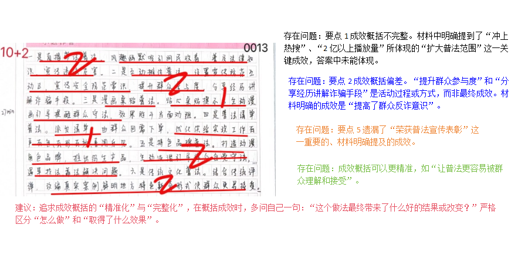
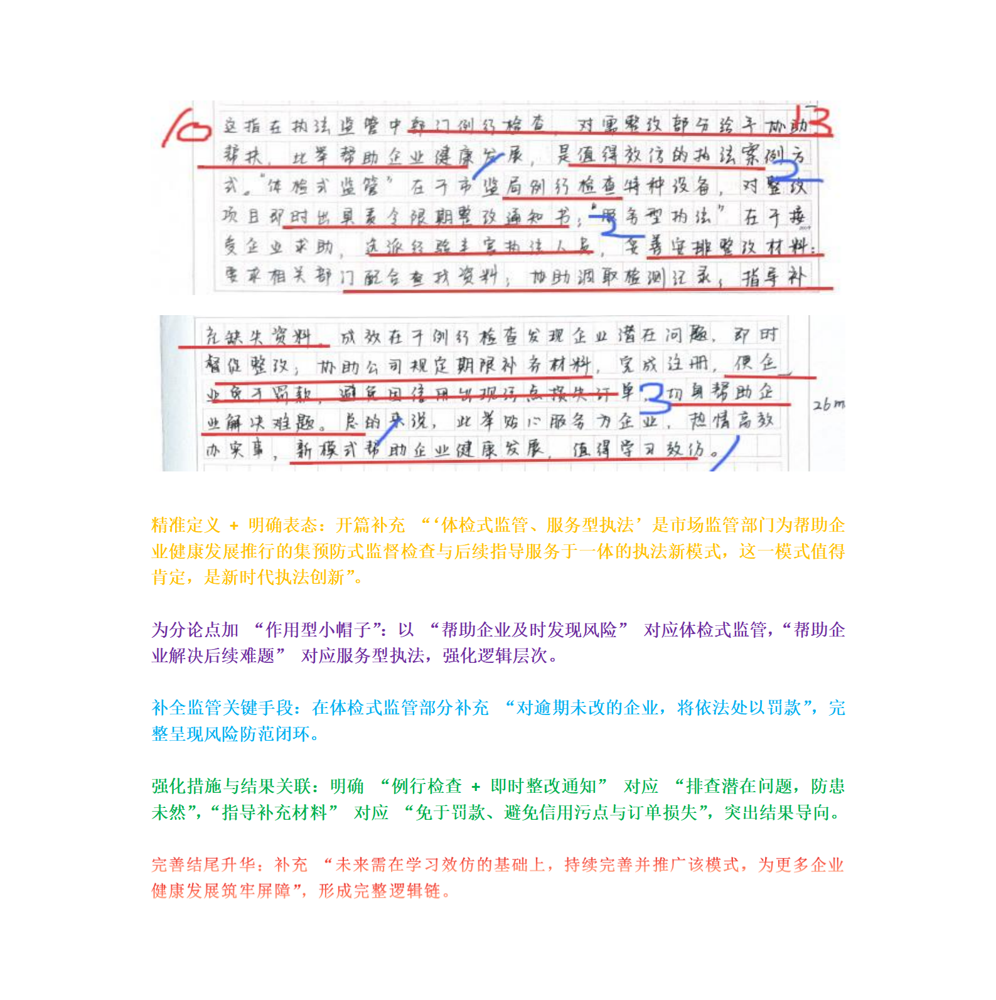
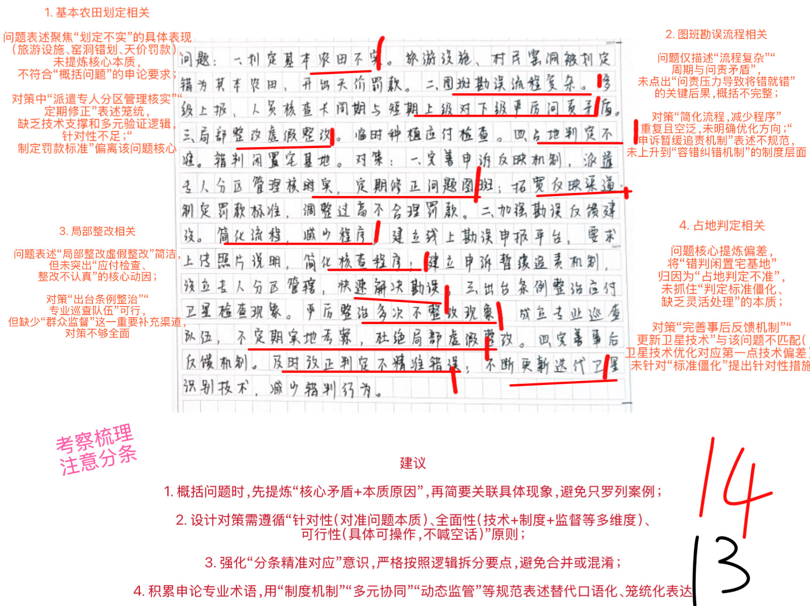
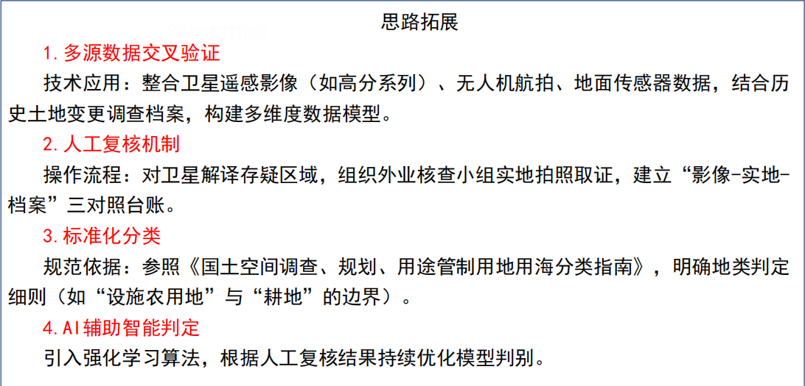
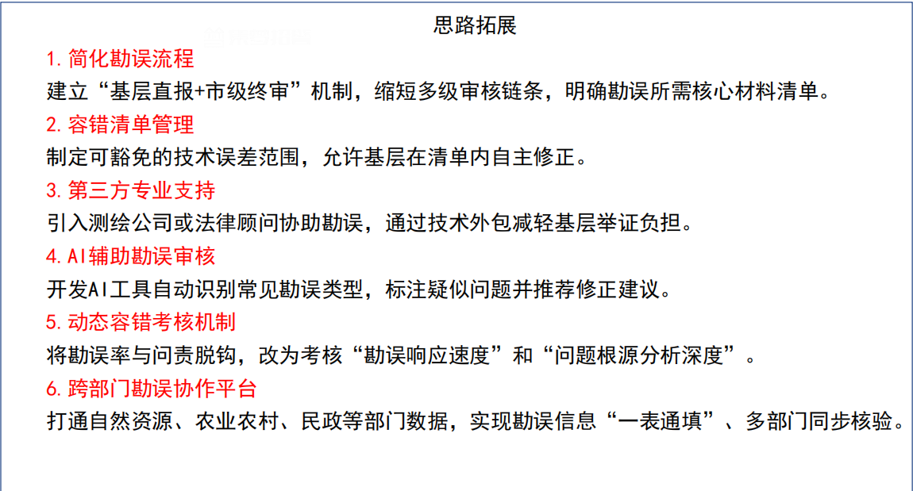
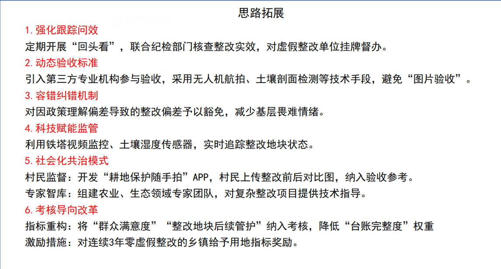
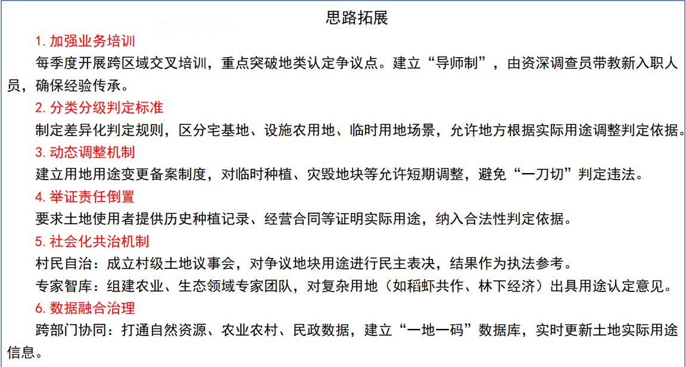
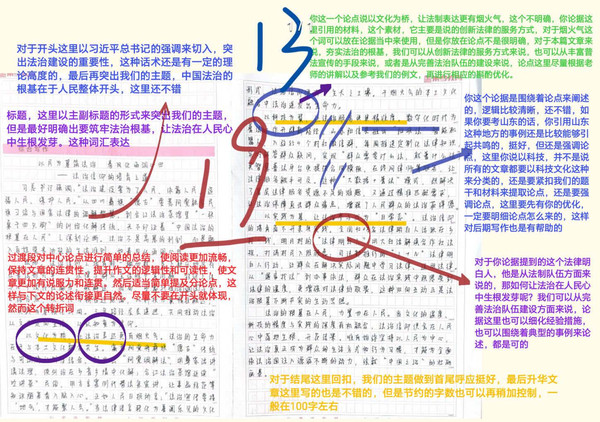

| 昵称    | Y0ungK1ng |
| ----- | --------- |
| Q1得分  | 12        |
| Q2得分  | 10        |
| Q3得分  | 14        |
| Q4得分  | 19        |
| 总分    | 55        |
| 平均分   | 57        |
| 排名    | 734       |
| 总提交人数 | 1430      |

###  **一、理由概括题**::noto:banana::

| 得分  | 总分  | 区间  |
| --- | --- | --- |
| 12  | 20  | 中   |

::: tip

成效不明确！！基本都没提取到要点！！

:::

::: card title="题干" icon="noto:backhand-index-pointing-right-dark-skin-tone"

**一、“给定资料1-3”列举了一些地方“花式”普法的做法及其成效，请用一段话对此加以归纳概括。（20分）**

要求：紧扣给定资料，全面、准确。篇幅不超过250字。

:::

::: card title="答题" icon="twemoji:astonished-face"

:::

::: card title="答案" icon="typcn:tick-outline"

**集梦**：

“直播带货式”普法用诙谐话术吸引群众观看，增长了群众法律知识，冲上热搜，扩大了普法范围；警营开放日活动以流动集市的形式，设置宣传防范互动区，宣传安全防范常识，提高了群众反诈意识；用系列桌贴和宣传画引导和提醒群众遵法守法，治安环境得到改善，商家生意更好； “订单式”普法派发清单，根据群众需求开展针对性普法，实现普法工作有声有色、有形有效；打造动漫普法项目，用生动幽默和深入浅出的表达，引导群众守法用法，荣获普法宣传表彰；以评弹形式展现典型案例，收获好评，让普法更容易被群众理解和接受。

**白鹭**：

**一是直播带货式普法**，风趣幽默，吸引网民围观，增长群众的法律知识。**二是以流动集市进行普法**，设置宣传防范互动区，宣传安全防范常识，提高反诈防骗意识。**三是以温馨提示进行普法**，张贴桌贴和宣传画，发挥引导提醒效果，减少酗酒闹事，店铺生意更好。**四是订单式普法**，派发普法清单，根据群众需求送法上门，实现普法工作有声有色有形有效，树立群众共识。**五是打造动漫项目普法**，设计动漫原型并制作衍生品，引导群众自觉守法，遇事找法，解决问题靠法。**六是以弹评形式普法**，改编典型案例，联合作剧，让群众对法律更易理解和接受。

:::

::: card title="反思与建议" icon="line-md:compass-loop"

- 成效缺漏：未写“冲上热搜、2亿播放”→补“普法覆盖面扩大”；未写“荣获表彰”→补“获得普法宣传表彰”。
    
- 成效偏差：把“群众分享经历”当成效→改为“群众反诈意识提升”。
    
- 方法：每见句号搜“了、荣获、实现”等结果词，区分“做法—效果”。

:::

::: card title="总结答案" icon="typcn:tick-outline"

**Y0ungK1ng**：

**一是直播带货式普法**，风趣幽默吸引网民收看，增长法律知识，冲上热搜，扩大普法范围；**二是流动集市普法**，设置宣传防范互动区，宣传安全防范意识，提高群众反诈意识；**三是温馨提示普法**，张贴桌贴漫画，发挥引导提醒效果，减少酗酒闹事，店铺生意更好；**四是订单式普法**，派发普法清单，根据群众需求开展针对性普法，实现普法工作有声有色有形有效，树立群众共识；**五是动漫项目普法**，打造动漫角色品牌，推出衍生产品，引导群众自觉守法，找法，靠法，获得普法宣传表彰；**六是评弹形式普法**，改编典型案例，联合创作，让群众对法律更易理解和接受。

:::

###  **二、综合分析题**::noto:banana::

| 得分  | 总分  | 区间  |
| --- | --- | --- |
| 10  | 15  | 中   |

::: card title="题干" icon="noto:backhand-index-pointing-right-dark-skin-tone"

**二、请根据“给定资料4”，谈谈你对“体检式监管、服务型执法”这一执法新模式的理解和认识。（15分）**

要求：观点正确，分析透彻。篇幅300字左右。

:::

::: tip

结构非常不清晰！

:::

::: card title="答题" icon="twemoji:astonished-face"

:::

::: card title="答案" icon="typcn:tick-outline"

**集梦**：

“体检式监管、服务型执法”指的是市场监管部门为了更好地帮助企业健康发展推行的执法新模式，它强调执法过程中既要做到预防式的监督检查，还要做到后续的指导服务工作。这一模式值得肯定。

1. 帮助企业及时发现风险。企业生产经营过程中，容易出现不易察觉的风险隐患，通过定期对企业进行例行检查，出具责令限期整改通知书，对逾期未改的企业处以罚款，及时发现潜在的问题，查处违规行为，有效防范风险。

2. 帮助企业解决后续难题。企业在问题整改中遇到困难，会通过选派有经验的执法人员，及时作出妥善安排，协调相关部门配合查找资料，协助企业调取、补充材料，帮助企业解决难题，免于罚款，避免出现信用污点。

该模式是适应新时代发展需求的执法创新，要继续完善该执法方式，更好地助企健康发展。

**kiwi**：

该模式做到精细化执法和柔性化执法服务统一，值得广泛推广。具体而言：

“体检式监管”前置预防：例行检查中发现企业并未知道问题，当场出具责令限期整改通知书，明确逾期未改处以罚款。而非等问题恶化后再追责，从源头降低企业违法风险。

“服务型执法”及时帮扶：得知企业情况后，立即选派有经验的执法人员前往企业，根据完善整改所需的材料作出妥善安排：给相关施工单位发函，要求全力配合找出当时施工资料；和企业人员共同到相关检测机构调取检测记录；指导补充丢失材料。企业在规定期限内补齐材料，完成注册，免于罚款，避免因信用出现污点而损失订单。

因此，推行该模式既能贴心服务为企业，又能热情高效办实事，从而帮助企业健康发展。

:::

::: card title="反思与建议" icon="line-md:compass-loop"

- 开篇缺“定义＋表态”→补“‘体检式监管、服务型执法’是集预防检查与后续指导于一体的新模式，值得肯定”。
    
- 措施-结果脱节→补“发整改通知→排查隐患；指导补件→免于罚款、保订单”。
    
- 结尾升华→补“持续完善并推广，为企业健康筑牢屏障”。

:::

::: card title="总结答案" icon="typcn:tick-outline"

**Y0ungK1ng**：

这指的是市场监管部门为了帮助企业健康发展推行的执法新模式，强调执法中既要做到预防式的监督检查，还要做到后续的指导服务工作。这一模式值得肯定。

“体检式监管”前置预防：例行检查企业不易察觉风险隐患，当场出具责令限期整改通知书，明确逾期未改处以罚款，查处违规行为，从源头降低企业违法风险。

“服务型执法”及时帮扶：接受企业求助，选派有经验执法人员，妥善安排完善整改所需材料：给相关施工单位发函，要求配合找出施工资料；和企业人员共同到相关检测机构调取检测记录；指导补充丢失材料。企业在规定期限内补齐材料，完成注册，免于罚款，避免信用出现污点而损失订单。

因此，推行该模式既能贴心服务为企业，又能热情高效办实事，从而帮助企业健康发展。

:::

###  **三、对策建议题**::noto:banana::

| 得分  | 总分  | 区间  |
| --- | --- | --- |
| 14  | 25  | 低   |

::: warning

:::

::: card title="题干" icon="noto:backhand-index-pointing-right-dark-skin-tone"

**三、请对“给定资料5”中“卫片执法”存在的问题进行梳理并提出相应的解决对策。（25分）**

要求：条理清晰，有针对性、可行性。篇幅350字左右。

:::

::: card title="答题" icon="twemoji:astonished-face"

:::

::: card title="答案" icon="typcn:tick-outline"

**集梦**：

1. 问题：技术判定偏差。无法精准识别土地实际性质，划定基本农田不实。对策：优化卫星技术手段，提高监测精度；结合实地核查、无人机航拍、历史用地档案等多元数据，对卫星发现的疑似图斑进行二次甄别。

2. 问题：勘误程序繁琐。上报错误时程序复杂费时，且问责压力大导致将错就错。对策：简化勘误程序，优化工作流程，缩短勘误时间；==完善问责制度，明确免责条款，建立容错纠错机制，减轻问责压力==。

3. 问题：整改流于形式。地方应付检查，整改不认真，存在局部、虚假整改。对策：严查违规整改行为，通报批评并追责，限期改正；畅通群众举报投诉渠道，对有效线索进行奖励。

4. 问题：判定标准僵化。对土地现状与实际用途差异缺乏灵活处理，判定不精准。对策：加强工作人员业务培训，提升土地认定精准度；允许地方举证实际用途，灵活处理，及时进行动态纠正。

**唐棣**：

问题:
1. 划定基本农田不实;
2. 图斑勘误程序繁琐，周期较长，迫于整改期限，只能将错就错或荒唐处理;
3. 地方通过变通手段应付卫星检查，整改不认真，存在局部整改甚至虚假整改的情况;
4. 工作人员对违法占地的判定不精准。 

对策:
1. 优化卫星技术手段，提高土地监测精度，准确圈注问题图斑；畅通反馈渠道，鼓励地方及时统计上报不实情况。
2. 简化勘误程序，优化工作流程，提高工作效能；完善问责制度，对整改工作进行动态调整；建立纠错机制，主动修复因技术差错导致的图斑。
3. 改进基层执法方式，坚持技术赋能与常规监察手段相结合，定期安排工作人员实地检查；加大政策法律宣传力度，健全基层考核体系，督促地方严格落实整改要求，确保整改到位，严肃处理弄虚作假行为。
4. 加强执法队伍建设，开展业务培训，提升工作人员耕地认定能力和水平

:::

::: card title="反思与建议" icon="line-md:compass-loop"

- 问题概括：只列“旅游设施错划”现象→改为“问责压力导致将错就错，基本农田划定不实”。
    
- 对策空泛：“简化流程”无支撑→改为“遥感＋大数据交叉验证＋容错纠错机制＋群众扫码监督”。
    
- 口诀：问题=“本质原因＋现象”，对策=“技术＋制度＋监督”三件套。

:::

::: card title="总结答案" icon="typcn:tick-outline"

**Y0ungK1ng**：

问题：

1. 划定基本农田不实。技术判定偏差，无法精准能识别土地实际性质。
2. 图斑勘误流程繁琐。上报周期长，问责压力大导致将错就错。
3. 整改流于形式。地方通过变通手段应付卫星检查，存在局部整改甚至虚假整改的情况。
4. 判定标准僵化。占地判定不精准。

对策：

1. 优化卫星技术手段，提高监测精度，准确圈注问题图斑；畅通反馈渠道，鼓励地方及时统计上报不实情况；结合实地核查、无人机航拍、历史用地档案等多元数据，对卫星发现的疑似图斑进行二次甄别。
2. 简化勘误程序，优化工作流程，提高工作效能；完善问责制度，对整改工作进行动态调整；建立纠错机制，主动修复因技术差错导致的图斑。
3. 改进基层执法方式，坚持技术赋能与常规监察手段相结合，定期安排工作人员实地检查；加大政策法律宣传力度，健全基层考核体系，督促地方严格落实整改要求，确保整改到位，严肃处理弄虚作假行为。
4. 加强工作人员业务培训，提升土地认定精准度；允许地方举证实际用途，灵活处理，及时进行动态纠正。

:::

###  **四、大写作**::noto:banana::

| 得分  | 总分  | 区间  |
| --- | --- | --- |
| 19  | 40  | 中   |

::: tip

:::

::: card title="题干" icon="noto:backhand-index-pointing-right-dark-skin-tone"

**四、请根据“给定资料7”中党的二十届三中全会关于“深入推进依法行政”方面的要求，围绕“贴心服务提升行政执法质效 为民理念激发社会发展活力”这一主题，联系实际，写一篇文章。（40分）**

要求：

（1）自选角度，自拟标题；

（2）参考给定资料，不拘于给定资料；

（3）观点明确，内容充实，结构完整；

（4）篇幅1000字左右。

:::

::: card title="答题" icon="twemoji:astonished-face"

:::

::: card title="答案" icon="typcn:tick-outline"

**千寻**：

深入推进依法行政绘就依法治国新图景

“法者，天下之程式也，万事之仪表也。”在经济社会发展中，“法治”维护着公序良俗，关乎着民生万象，更是中国式现代化建设的重要一环。为此，要以为民服务理念为指引，从政务服务优化与行政执法体制改革切入，深入推进依法行政，绘就全面依法治国的新图景。

深入推进依法行政，要以服务意识、为民理念为引领，不断创新执法工作。思想是行动的先导，是指引前行的灯塔，唯有树立正确的理念，方能推动各项工作走上正确的轨道，行政执法工作亦是如此。在为民服务的意识和理念引领下，行政执法工作才能够不断满足人民群众对美好生活的需求，激发整个社会的发展活力。以普法工作为例，从“直播带货式”普法吸引群众眼球到“流动集市”式普法提升普法覆盖面再到“小叽说法”提升群众守法、找法、靠法意识，层出不穷的“花式”普法正印证着服务意识、为民理念在法治领域的不断深化。未来，还要继续创新执法方式，让法律的温度触手可及

知行合一，方能行稳致远。在以为民服务的理念指引下，还要以政务服务优化和行政执法体制改革为抓手，助推依法行政不断深化。

深入推进依法行政，要在政务服务优化上下功夫，促进服务标准化、规范化、便利化。党的二十大报告中强调，政务服务优化是深入推进依法行政的关键一环。促进政务服务更加标准、规范、便利化，是指办理流程的统一、程序依规依法，且聚焦程序简化与效率提升。以“三书同运”为例，企业信用修复从过去收到《行政处罚决定书》不知如何整改到如今《行政处罚决定书》《信用修复告知书》《行政合规建议书》三书同达，让企业明明明白白、清清楚楚解决问题。可见，只有将服务标准化、规范化、便利化落到实处，才能真正让依法行政成果惠及全体人民

深入推进依法行政，要在执法体制改革上做文章，完善基层综合执法与执法监督体制机制。行政执法体制改革是深入推进依法行政的一项重要工作，同时包含两方面内涵，即执法与监督，这两方面工作必须同步推进，相互促进。以“综合查一次”联合执法机制为例，执法方面进行合并，减轻企业负担，同时又需要创新监管方式，引导企业规范经营，如此才能保障企业行稳致远。为此，在行政执法体制改革领域，一方面需要为企业“减负松绑”，降低检查频次、简化相关程序：另一方面，需要借力现代化信息技术，创新智慧化监管

征途漫漫，使命在肩。我们要步履不停，不断深入推进依法行政，让法治之光普照大地，为绘就依法治国的宏伟新图景添上浓墨重彩的一笔，向着法治强国的日标稳步迈进。
       
:::

以服务之笔绘就行政执法新图景——让法治温度与治理效能同频共振

从北京“接诉即办”将群众诉求化解在基层，到浙江“大综合一体化”执法为企业松绑减负，新时代行政执法正褪去“冰冷刻板”的标签，以服务为内核书写法治新篇章。党的二十届三中全会明确提出“坚持执法为民、服务为民”，行政执法作为联系群众与政府的纽带，其温度与效能直接关乎治理现代化成色。

对照“深入推进依法行政，健全公正执法司法体制机制”的改革要求需破解。需传统执法中“重处罚轻引导”的问题仍需破解，锚定“服务型执法”核心，需走好三路径：场景化普法让法治入脑入心，智慧化流程让监管提质增效，共情式帮扶让服务浸润民生。这正是执法兼具力度与温度的关键所在。

以场景化普法为引，让执法宣传从“灌输式”转向“沉浸式”。法律的生命力在于被群众理解认同，单纯的条文宣讲难以抵达人心。武侯区打造“法治剧本杀”，将消费者权益保护法融入剧情互动，参与群众超2万人次；滨江区推出“法治脱口秀”，用幽默段子解读劳动合同法，短视频播放量破千万。这些创新跳出“我说你听”的窠臼，把法律知识植入生活场景。当普法变成“有趣的体验”，群众才能真正将法治精神内化于心，为行政执法筑牢思想根基，实现从“被动遵守”到“主动认同”的转变。

以智慧化流程为翼，让执法监管从“粗放化”迈向“精准化”。“数据多跑路，群众少跑腿”是政务服务的要求，更是执法改革的方向。深圳推行“无感执法”，通过物联网设备实时监测餐饮企业油烟排放；济南建立“执法数据中台”，整合12个部门检查事项，实现“一次检查、多证联办”。相较于过去“多头执法、重复检查”的乱象，智慧赋能让执法更精准高效。既守住了监管底线，又为市场主体减负松绑，真正实现治理效能与发展活力的双赢。

以共情式帮扶为魂，让执法服务从“管理型”升级“伙伴型”。习总书记强调“要坚持法治和德治相结合”。执法的终极目标不是惩罚，而是引导规范。青山区市场监管局发现小微企业年报遗漏后，派专员上门指导填报，避免企业信用受损；高新区城管对占道经营商户，先帮其联系便民疏导点再规范经营，实现“整改零冲突”。这些实践打破“一罚了之”的思维定式，将刚性法律与柔性关怀结合。当执法者变身“发展伙伴”，既维护了市场秩序，又传递了法治温度，凝聚起共建共治共享的强大治理合力。

服务为笔，民生为纸，法治为墨。行政执法的服务转型，是国家治理现代化的生动缩影。从场景化普法到智慧化监管，再到共情式帮扶，每一次创新都是对“执法为民”初心的践行。当法治温度与治理效能同频共振，行政执法必将绘就更加绚丽的图景，为中国式现代化注入源源不断的法治动能。

:::