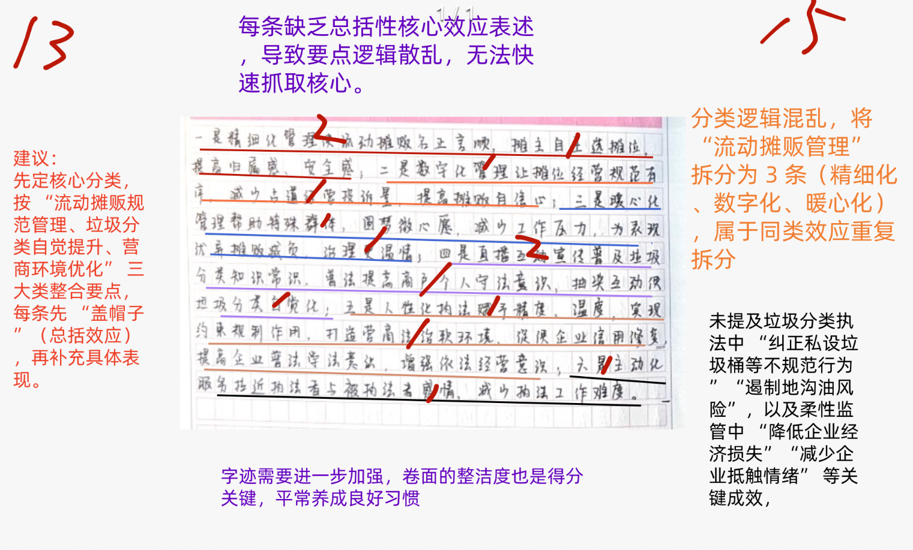
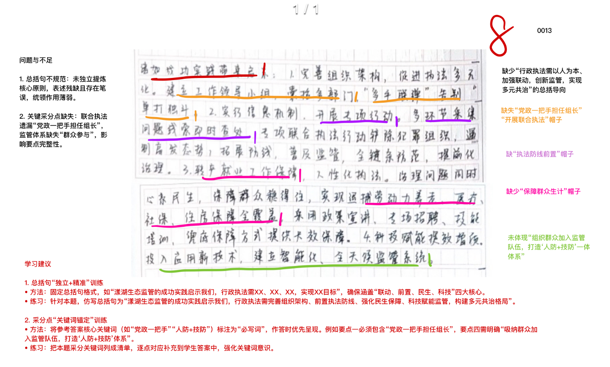
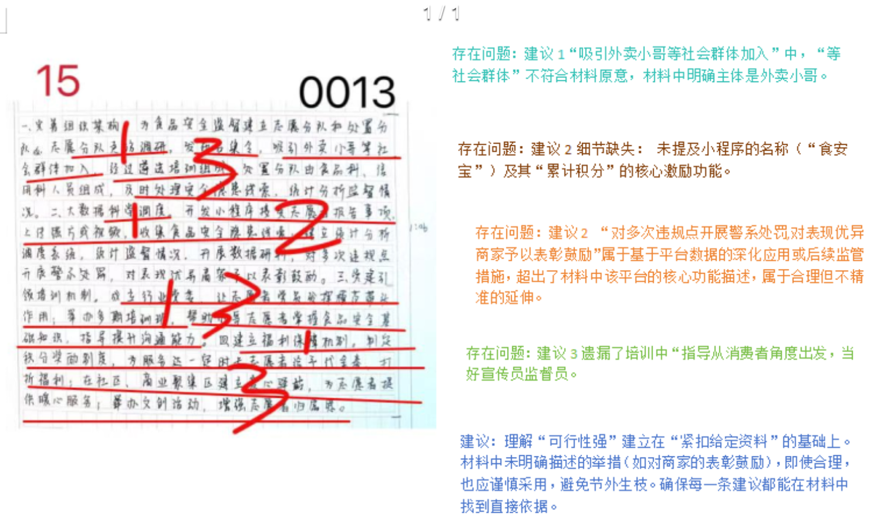
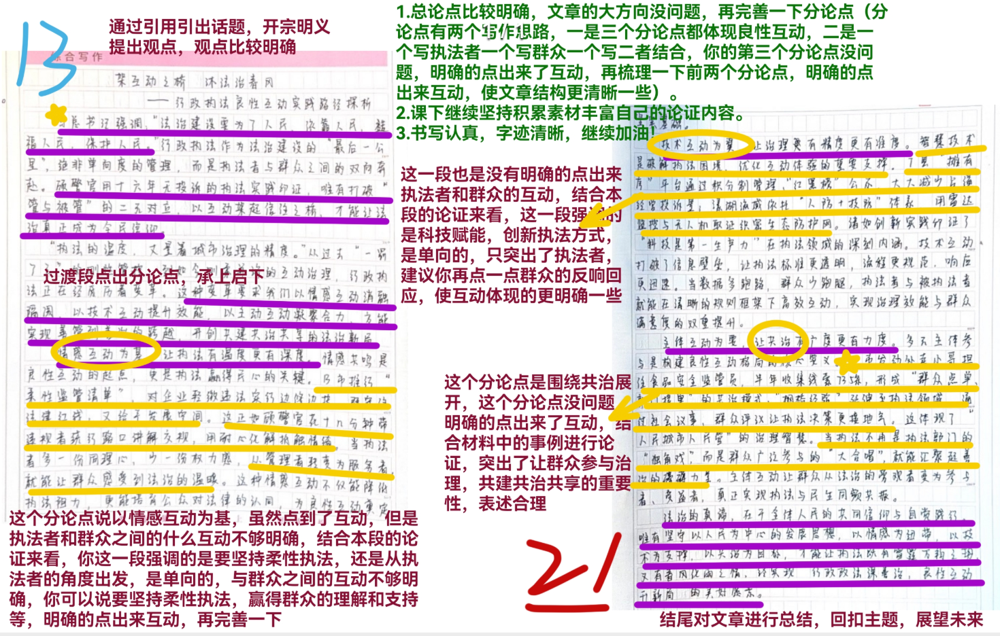

| 昵称    | Y0ungK1ng |
| ----- | --------- |
| Q1得分  | 15        |
| Q2得分  | 8         |
| Q3得分  | 15        |
| Q4得分  | 21        |
| 总分    | 59        |
| 平均分   | 58        |
| 排名    | 542       |
| 总提交人数 | 1386      |

###  **一、效应概括题**::noto:banana::

| 得分  | 总分  | 区间  |
| --- | --- | --- |
| 15  | 20  | 中   |

::: tip

:::

::: card title="题干" icon="noto:backhand-index-pointing-right-dark-skin-tone"

**一、“给定资料1-3”中，列举了执法工作的一些好做法所产生的积极效应，请用一段话对此加以归纳概括。（20分）**

要求：紧扣给定资料，准确全面，条理清晰。篇幅不超过250字。

:::

::: card title="答题" icon="twemoji:astonished-face"

:::

::: card title="答案" icon="typcn:tick-outline"

**集梦**：

**第一，促进了流动摊贩管理**。商户拥有了发言权，实现摊位固定，商户间和谐相处，减少了占道经营等违规行为，经营更加规范有序，满足了群众需求，实现精细化管理；解决了群众困难，提升治理温情。**第二，提升了垃圾分类自觉**。吸引网友，收获点赞；增长了民众垃圾分类、处罚规定等知识；纠正了不规范行为；获得百姓认可，提升了行动自觉。**第三，优化了营商环境**。降低企业经济损失和经营风险，提升执法精度温度，更有利于实现约束和规制作用；助推普法学法，为企业争取了发展机会，增强了企业依法经营意识；拉进了政府和企业的关系，降低了执法难度。

**白鹭**：

好做法带来好效果：**一是对摊贩实行精细化管理**，定制专属市场，让其安稳经营，邻里关系改善。**二是实行摊有序数字化应用场景**，实行积分制管理，降低投诉量；设置暖心摊位，提供贷款和保险，改善干群关系，治理更具温情。**三是开展直播式垃圾分类执法行动**，明确垃圾危害；设立垃圾收运特许经营企业，遏制地沟油上餐桌，防止潜在污染；设置互动环节，提高人们自觉意识。**四是实行柔性监管**，让执法有精度有温度，利于约束和规制，助力优化营商环境。**五是代办信用修复**，为企业争取机会，增强依法经营意识，拉近政企感情，降低执法工作难度。

:::

::: card title="反思与建议" icon="line-md:compass-loop"

1. 缺“总括效应”→每条先盖帽：  
    　①“精细化效应”→规范摊位、减少占道  
    　②“数字化效应”→摊位经营可视、合规  
    　③“暖心化效应”→帮扶特殊群体、降低执法冲突
    
2. 关键成效遗漏→补“纠正私设垃圾桶、遏制地沟油、降低经济损失、减少抵触情绪”
    
3. 逻辑乱→把6点按“规范管理-垃圾分类-营商环境”3大类归并，再填具体表现
    
4. 卷面→每天10分钟楷体速练，答题前打0.5cm微横线防歪斜

:::

::: card title="总结答案" icon="typcn:tick-outline"

**Y0ungK1ng**：

**一是对摊贩实行精细化管理**，商户拥有发言权，实现摊位固定，提高商户安全感归属感，改善商户间关系。**二是对摊贩实行数字化管理**，经营更加规范有序，减少占道经营投诉量
；设置暖心摊位，改善干群关系，治理更加温情。**三是直播互动宣传垃圾分类**，吸引网友，收获点赞，增长民众垃圾分类知识，明确垃圾危害，纠正违法行为；互动环节提高群众自觉意识。**四是柔性执法**，降低企业经济损失和经营风险，提升执法精度、温度，实现约束规制作用，优化营商环境。五是代办信用修复，助推企业普法学法，增强依法经营意识，拉近政企感情，降低执法工作难度。

:::

###  **二、启示分析题**::noto:banana::

| 得分  | 总分  | 区间  |
| --- | --- | --- |
| 8   | 15  | 低   |

::: card title="题干" icon="noto:backhand-index-pointing-right-dark-skin-tone"

**二、根据“给定资料4”，请你就漾湖生态监管的成功实践，谈谈对做好行政执法工作的启示。（15分）**

要求：观点正确，分析透彻，针对性强。篇幅250字左右。

:::

::: tip

:::

::: card title="答题" icon="twemoji:astonished-face"

:::

::: card title="答案" icon="typcn:tick-outline"

**集梦**：

行政执法工作要以人为本，加强联动，创新监管，实现多元共治。

1、开展联合执法。党政一把手担任组长，成立工作领导小组，多个职能部门联合参与执法。

2、执法防线前置。改变被动执法方式，将防线前移，从根本上解决问题；实行信息线索通报机制，将问题线索迅速交付相关职能部门查处；开展一系列专项联合执法行动，打击违法犯罪行为。

3、保障群众生计。对受执法工作影响生计的群众，针对性做好转产就业工作，保障群众长远生计，实现养老等社会保障全覆盖。

4、完善监管体系。应用新技术装备，建立智能化、全天候监管系统；组织群众加入监管队伍，打造“人防+技防”一体监管体系。

**单淑玲**：

1. 加强组织领导。成立工作领导小组，由党政一把手担任组长，小组成员囊括多个职能部门，设办公室，联合监管。

2. 创新工作方式。实行信息线索通报机制，各类线索都可迅速交付相关职能部门查处；开展专项联合执法行动，打击违法犯罪行，将执法防线提前。

3. 做好后续保障工作。帮助因执法工作影响生计的群众解决就业问题和公共服务全覆盖，结合实际做好转产就业工作，多种方式保障群众长远生计，让群众过上新生活。

4. 完善监管体系。应用新技术装备，建立智能化、全天候监管系统，吸纳周围群众加入监管队伍，建立“人防+技防”巡护管理体系。

**白鹭**：

执法工作压力大，要坚持推动执法工作迈上新台阶，为此：

**一是开展联合执法**。成立工作领导小组，囊括多个职能部门，告别单打独斗。

**二是创新工作方式**。根据实际情况改变以往工作方式，防线提前，实行信息线索通报机制，开展专项联合执法行动，遏制违法行为。

**三是保障群众长远生计**。安排专家指导受波及群众转型，做好转产就业工作，实现保障全覆盖。

**四是完善监管体系**。投入新技术新装备建立智能化、全天候监管系统；发挥群众力量，形成人防+技防的完整一体巡护管理体系。

:::

::: card title="反思与建议" icon="line-md:compass-loop"

1. 总括句残→独立一句：“漾湖实践启示：行政执法需以人为本、联动前置、科技赋能、多元共治”
    
2. 必写关键词锚定→  
    　①“党政一把手任组长”  
    　②“执法防线前置”  
    　③“保障群众生计”  
    　④“吸纳群众加入监管队伍，打造人防+技防”

:::

::: card title="总结答案" icon="typcn:tick-outline"

**Y0ungK1ng**：

执法工作压力大，要坚持推动执法工作迈上新台阶，为此：

1. 开展联合执法。党政一把手担任组长，成立工作领导小组，囊括多个职能部门，告别单打独斗。
2. 创新工作方式。联系实际改变以往工作方式，提前执法防线，根本解决问题，实行信息线索通报机制，开展专项联合执法行动，遏制违法行为。
3. 保障群众生计。组织专家指导群众转型，做好转产就业工作，实现养老等保障全覆盖。
4. 完善监管体系。应用新技术装备，建立智能化、全天候监管系统；发挥群众力量，形成人防+技防的巡护管理体系。

:::

###  **三、对策建议题**::noto:banana::

| 得分  | 总分  | 区间  |
| --- | --- | --- |
| 15  | 25  | 中   |

::: warning

:::

::: card title="题干" icon="noto:backhand-index-pointing-right-dark-skin-tone"

**三、假如你是“给定资料5”中的小曹，请就如何在Z市K区借力外卖小哥助力食品安全监管提出建议，供领导决策参考。（25分）**

要求：紧扣给定资料，切合实际，可行性强，条理清楚。篇幅350字左右。

:::

::: card title="答题" icon="twemoji:astonished-face"

:::

::: card title="答案" icon="typcn:tick-outline"

**集梦**：

1、做好调查研究。对外卖配送站点等情况开展走访调研，召开会议进行专题研究，讨论可行性。

2、组建工作队伍。发布“召集令” ，邀请小哥们自愿加入；经过遴选、培训，组成志愿者队伍；负责报告食品安全问题，拍摄照片或视频，及时上传。

3、搭建系统平台。开发专门小程序，以便外卖小哥上传信息、累计积分等操作，提升效率；搭建调度系统，植入报送模板，实时反馈现场图文信息，及时匹配执法力量，实现科学调度，快速协同处置。

4、加强党建引领。成立外卖配送行业党委、流动党员党支部，发挥其模范带头作用。

5、强化能力提升。举办培训班，帮助其掌握食品安全监管基础知识，强化沟通技巧，当好食品安全“宣传员”“监督员” 。

6、调动积极性。制定积分奖励制度，按服务时长给予相应福利；建立爱心驿站，提供各种暖心服务；开展多类特色活动，颁发活动奖品，增强志愿者的荣誉感和归属感。

**半月谈**：

1. 组建志愿者队伍。开展走访调研，做好专题研究，明确需求数量、选拔标准、激励措施等。发布“召集令”，邀请、遴选外卖小哥自愿加入组成食品安全监管志愿者队伍，负责报告食品安全问题，拍摄照片或视频、上传信息化平台。

2. 建立信息化平台。开发食品安全小程序，引导外卖员拍摄照片或视频，上传食品安全问题。

3. 加强党建引领。成立外卖配送行业党委，发挥小哥党员们模范带头作用，让小哥助力食品安全监管行稳致远。

4. 组织业务培训。举办培训班，提升责任意识，帮助掌握监管知识、沟通技巧等技能，提升队伍专业性。

5. 健全激励机制。协调多部门给予积分打折、餐饮代金券、景区门票等福利；建立城市小哥爱心驿站、举办随手拍作品展、食品安全找茬等活动，调动小哥积极性，增强获得感、归属感。

**白鹭**：

**组建监管志愿队伍**。邀请小哥加入，遴选、培训小哥组成志愿分队，报告食安问题；由处置分队根据线索做出处理并统计分析；加强推广吸引更多群众加入。

**打造小程序报送模板**。小哥通过报送模板实时反馈现场信息，系统后台结合现有资源，匹配力量，实现科学调度，快速协同处置，遏制食安隐患。

**加强小哥队伍建设**。成立行业党委，让小哥党员们发挥模范带头作用；举办培训班，提升小哥食安监管基础知识；指导小哥加强与商家沟通，当好食安的宣传员和监督员。

**增强小哥归属感**。通过小程序对达到一定服务时长者给予多种福利；制定积分奖励制度，建立驿站提供暖心服务；组织特色活动赠与小哥礼物、礼包等奖励。

:::

::: card title="反思与建议" icon="line-md:compass-loop"

1. 主体精准→“外卖小哥”勿扩成“社会群体”
    
2. 细节完整→补“小程序名称：食安宝；功能：累计积分兑换奖励”
    
3. 合理延伸≠给定功能→“表彰鼓励”材料未提，删！
    
4. 培训细节→补“指导小哥从消费者角度当好宣传员、监督员”
    
5. 原则：每条建议都能用“材料第×段”标回，禁止“我觉得”

:::

::: card title="总结答案" icon="typcn:tick-outline"

**Y0ungK1ng**：

1. 组建监管志愿队伍。开展走访调研，做好专题研究；发布召集令，邀请、遴选外卖小哥自愿加入组成食安监管志愿者队伍，报告食安问题，拍摄照片和视频及时上传。
2. 打造小程序报送模板。开发专门小程序，通过小哥报送模板实时反馈现场信息，系统后台结合现有资源，匹配力量，实现科学调度，快速协同处置，遏制食安隐患。
3. 加强小哥队伍建设。党建引领，成立党委，发挥小哥党员们模范带头作用；举办培训班，帮助掌握监管知识、沟通技巧等技能，提升队伍专业性。
4. 增强小哥归属感。完善福利保障机制，协调多部门给予多种福利；制定积分奖励制度；建立城市小哥爱心驿站，举办文创活动，调动积极性，增强获得感、归属感。

:::

###  **四、大写作**::noto:banana::

| 得分  | 总分  | 区间  |
| --- | --- | --- |
| 21  | 40  | 中   |

::: tip

:::

::: card title="题干" icon="noto:backhand-index-pointing-right-dark-skin-tone"

**四、请根据“给定资料7”中党的二十届三中全会关于“深入推进依法行政”方面的要求，围绕“贴心服务提升行政执法质效 为民理念激发社会发展活力”这一主题，联系实际，写一篇文章。（40分）**

要求：

（1）自选角度，自拟标题；

（2）参考给定资料，不拘于给定资料；

（3）观点明确，内容充实，结构完整；

（4）篇幅1000字左右。

:::

::: card title="答题" icon="twemoji:astonished-face"

:::

::: card title="答案" icon="typcn:tick-outline"

**袁东**：

坚持良性互动 开创善管善治新局面

“行政执法，不是简单的管与被管，执法者和被执法者只有相向而行，良性互动，才能不断开创善管善治的新局面。”做好行政执法工作，是保障群众利益的客观要求，是维护社会稳定的必要条件，是推进法治政府建设的核心要义。“日日行，不怕千万里；常常做，不怕千万事。”，唯有执法者与被执法者相向而行、良性互动，才能打破治理对立壁垒，凝聚共治合力，开创善管善治新局面。

执法者当以法为纲、以情为纬，在规范与关怀中彰显法治温度。执法者的执法方式直接影响群众对法治的感知，机械执法易激化矛盾，兼顾法理与情理才能让执法既有力度又有温度。顾警官面对因“看不清红绿灯”违规的市民，未简单开罚单，而是花十几分钟带其绕行路口、讲解规则，以善意化解抵触。反观部分执法场景，交警对轻微违章“一罚了之”、城管对小商贩“粗暴驱赶”，不仅未根治问题，还加剧群众抵触。新时代执法者当以顾警官为榜样，既要坚守法律底线，确保执法于法有据、流程规范；更要怀揣人文关怀，对初次轻微违法者多些教育引导，对困难群体多些柔性包容，用耐心沟通化解对立，以温度执法赢得信任。

被执法者当以遵为基、以协为行，在敬畏与参与中筑牢善治根基。被执法者不是治理旁观者，而是善治参与者，唯有敬畏规则、配合执法并主动参与治理，才能从被动“被管理”转向主动“共治理”。顾警官处罚过的群众中，有人暴雨中为他撑伞，有人邀请他进社区宣讲交通知识，有人主动担任交通协管员，这正是从“抵触”到“理解”再到“参与”的转变。反观部分群众，缺乏规则意识、抗拒执法，既危害自身权益也破坏公共秩序。新征程上被执法者当主动学习法律法规，以敬畏之心遵守规则、配合执法；更要像顾警官身边的群众那样，主动参与到法治建设中，通过担任协管员、参与法治宣讲等方式，成为善治的“同行者”，共同筑牢社会治理的群众根基。执法者与被执法者双向奔赴，以良性互动凝聚善治合力。

善治不是执法者的“独角戏”，而是二者的“协奏曲”。打破对立思维、实现双向互动，才能凝聚治理合力。顾警官16年执勤零投诉，处罚过的群众反而主动参与治理，正是良性互动的典范：他的耐心普法传递善意，群众的理解配合又激励他践行“温度执法”，形成“执法-理解-参与-共治”的良性循环。如如今，这样的治理实践在各地不断涌现：某地交警推出“违章者协助执勤”制度，让违章者亲身体验执法不易，既教育了当事人，也让其他群众更理解交警工作；部分城市城管部门建立“商贩议事会”，邀请商贩参与制定管理规则，实现了“城管与商贩和谐共处”。可见，当执法者放下“管理者”的架子，被执法者收起“对抗者”的戾气，二者相向而行、同频共振，就能将治理中的“矛盾点”转化为“合力点”，让善管善治在互动中不断深化。

“须与懈怠，或将停滞不前；半点停顿，或将前功尽弃。”行政执法谋善治，良性互动是核心。执法者以法为纲、以情为纬传递温度，被执法者以尊为基、以协为行贡献力量，二者双向奔赴凝聚合力，才能让“纸上的法治”变为“行动中的法治”，让善管善治在每一次执法互动中落地生根。
       
:::

# 架互动之桥 沐法治春风——行政执法良性互动的实践路径探析

习总书记强调：“法治建设要为了人民、依靠人民、造福人民、保护人民。”行政执法作为法治建设的“最后一公里”，绝非单向度的管理，而是执法者与群众之间的双向奔赴。C市交警顾警官用十六年无投诉的执法实践印证，唯有打破“管与被管”的二元对立，以互动架起信任之桥，才能让法治真正成为全民信仰。

“执法的温度，丈量着城市治理的精度。”从过去“一罚了之”的刚性管控，到如今“刚柔并济”的互动治理，行政执法正在经历深刻变革。这种变革要求我们以情感互动消融隔阂、以技术互动提升效能、以主体互动凝聚合力，方能实现从“善管”到“善治”的跨越，开创共建共治共享的法治新局。

情感互动为基，让执法有温度更有深度。情感共鸣是良性互动的起点，更是执法赢得民心的关键。B市推行“柔性监管清单”，对企业轻微违法实行“边修边扶”，既守住法律底线，又给予发展空间。这正如顾警官花十几分钟带违规者绕行路口讲解交规，用耐心化解抵触情绪。当执法者多一份同理心，少一份权力感，从“管理者”转变为“服务者”，就能让群众感受到法治的温暖。这种情感互动不仅能降低执法阻力，更能培育公众对法律的认同，为良性互动奠定坚实基础。

技术互动为翼，让治理有精度更有准度。智慧技术是破解执法困境、优化互动体验的重要支撑。T县“摊有序”平台通过积分制管理、“红黑榜”公示，大大减少占道经营投诉量；漾湖流域依托“人防+技防”体系，用雷达监控与无人机取证织密生态防护网。这些创新实践印证了“科技是第一生产力”在执法领域的深刻内涵。技术互动打破了信息壁垒，让执法标准更透明、流程更规范、响应更迅速。当数据多跑路、群众少跑腿，执法者与被执法者就能在清晰的规则框架下高效互动，实现治理效能与群众满意度的双重提升。

主体互动为要，让共治有广度更有力度。多元主体参与是构建良性互动格局的核心要义。N市发动外卖小哥担任食品安全监督员，半年收集线索735条，形成“群众点单、部门接单”的共治模式；“枫桥经验”延伸至执法领域，通过社区议事、群众评议让执法决策更接地气。这体现了“人民城市人民管”的治理智慧。当执法不再是执法部门的“独角戏”，而是群众广泛参与的“大合唱”，就能汇聚起善治的磅礴力量。主体互动让群众从法治的旁观者变为参与者、受益者，真正实现执法与民生同频共振。

法治的真谛，在于全体人民的共同信仰与自觉践行。唯有始终坚守以人民为中心的发展思想，以情感为纽带、以技术为支撑、以共治为目标，才能让执法既有雷霆万钧之势，又有春风化雨之情，最终实现“行政执法谋善治，良性互动开新局”的美好愿景。