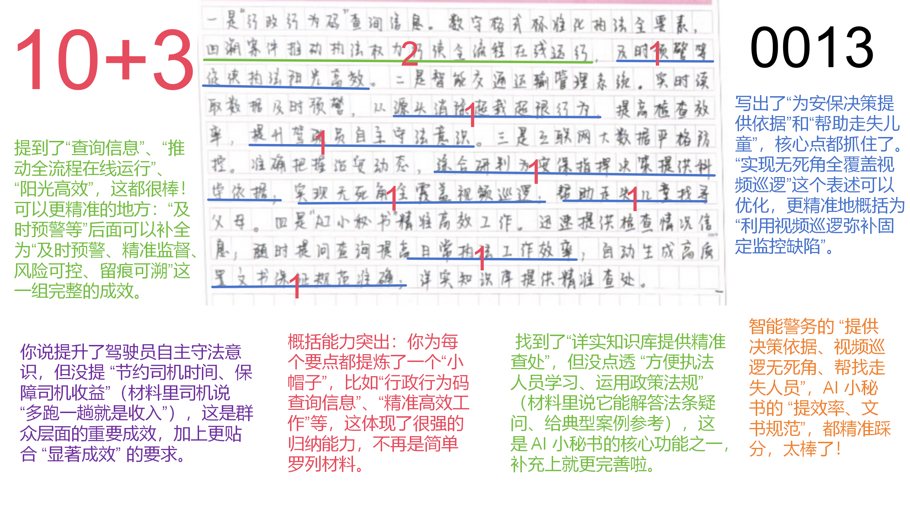
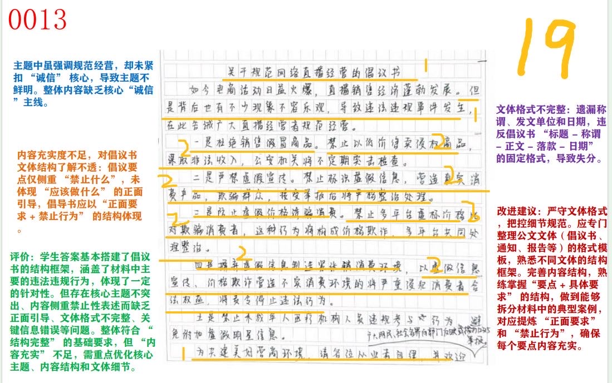

| 昵称    | Y0ungK1ng |
| ----- | --------- |
| Q1得分  | 13        |
| Q2得分  | 8         |
| Q3得分  | 19        |
| Q4得分  | 21        |
| 总分    | 61        |
| 平均分   | 57        |
| 排名    | 294       |
| 总提交人数 | 1285      |

###  **一、效应概括题**::noto:banana::

| 得分  | 总分  | 区间  |
| --- | --- | --- |
| 13  | 15  | 高   |

::: tip

:::

::: card title="题干" icon="noto:backhand-index-pointing-right-dark-skin-tone"

**一、“给定资料1-4”中，一些地方和部门在智慧执法方面的创新举措产生了显著成效，请用一段话对此进行归纳概括。（15分）**

要求：紧扣给定资料，全面、准确，篇幅不超过250字。

:::

::: card title="答题" icon="twemoji:astonished-face"

:::

::: card title="答案" icon="typcn:tick-outline"

**集梦**：

一是执法阳光高效。 “行政行为码”可以帮助查询回溯案件情况，推动执法权力行使全流程在线运行，及时预警、精准监督、风险可控、留痕可溯。二是提升管理效能。搭建智慧交通管理系统，实现统一管理、自动监管，从源头消除超限超载，节约司机时间，保障收益，提升群众守法意识。三是维护社会治安。 “智能警务”借用互联网大数据，实现对重点地区人流研判，为指挥决策提供依据，弥补固定监控缺陷，解决走失走散问题。四是助力移动执法。 “AI小秘书”整合数据，提高执法效率，保证执法记录规范性和准确性，方便执法人员学习、运用政策法规。

**唐棣**：

智慧执法新举措成效显著。一是让执法阳光高效，行政行为码快速查询、实时回溯案件办理情况，推动执法权力行使全流程在线运行，及时预警、精准监督、风险可控、留痕可溯： 二是提升管理效能，智慧交通运输管理系统提升执法能力，从源头上消除超载超限行为发生，节约检查时间，增加驾驶员收入；三是维护社会治安秩序 ，借用互联网、大数据技术防控为安保指挥、决策提供科学依据，弥补固定监控缺陷，找导走失儿童、走散游客；四是助力移动执法 AI小秘书提高日常执法工作效率，保证执法记录规范性和准确性，帮助执法人员学习、运用政策法规。

:::

::: card title="反思与建议" icon="line-md:compass-loop"

1. 成效补全→“及时预警、精准监督、风险可控、留痕可溯”
    
2. 群众成效→加“节约司机时间，保障司机收益”
    
3. 功能补漏→AI小秘书“法条答疑、典型案例推送”
    
4. 表述升级：视频巡逻→“弥补固定监控盲区

:::

::: card title="总结答案" icon="typcn:tick-outline"

**Y0ungK1ng**：

一是执法阳光高效。行政行为码快速查询、实时回溯案件办理情况，推动执法权力行使全流程在线运行，及时预警、精准监控、风险可控、留痕可溯。二是提升管理效能。智慧交通运输管理系统实时读取数据及时预警，从源头消除超载超限行为的发生；提高检查效率，保障司机收益；提升自主守法意识。三是维护社会治安。互联网、大数据实现重点地区人流综合研判，为安保指挥决策提供依据，弥补固定监控缺陷；解决走失走散问题。四是助力移动执法。“AI小秘书”整合数据，提高日常执法工作效率，保证执法规范性和准确性；方便执法人员学习、运用政策法规。

:::

###  **二、启示分析题**::noto:banana::

| 得分  | 总分  | 区间  |
| --- | --- | --- |
| 8   | 20  | 低   |

::: card title="题干" icon="noto:backhand-index-pointing-right-dark-skin-tone"

**二、“给定资料5”中的画线句说“使用‘如意棒’时不忘还有‘紧箍咒’，行政裁量才能宽严相济、令人信服”，请你谈谈对这句话的理解和认识。（20分）**

要求：观点正确，分析透彻，见解深刻，篇幅250字左右。

:::

::: tip

:::

::: card title="答题" icon="twemoji:astonished-face"

:::

::: card title="答案" icon="typcn:tick-outline"

**集梦**：

这指执法者在使用行政裁量权时，要严格落实行政裁量权基准制度，才能增强说服力。这是正确的工作思路。

1. 滥用“如意棒”易致执法失范。实践中，个别执法人员执法随心所欲，与利益挂钩，加之规范文件不完善，处罚种类、幅度、选择权等不明确，以及缺乏有效监督，导致执法宽严不济、畸轻畸重、类案不同罚，不能令人信服，群众有怨言。

2. 严用“紧箍咒”更促公平公正。通过出台政策，细化量化行政裁量权，颁行具体执法尺度和标准，接受社会监督和评议，能有效杜绝执法不公、任性执法，提升社会满意度，也能增强群众守法意识。

因此，应该加快建立健全并严格落实行政裁量权基准制度，强化监督，并刀刃向内，从严要求，提升执法水平。

**袁东**：

行政裁量权必须通过建立健全并严格落实行政裁量权基准制度进行约束，最大限度避免类案不同罚，提升公正性和公信力。此观点正确。

如意棒存在的问题和影响：个别执法机关或人员使用行政裁量权时随心所欲，或与利益挂钩，缺乏监督，自我裁决，该严不严，该宽不宽，畸轻畸重，类案不同罚，缺少公信力。

具体原因：规范性文件中处罚种类与幅度不明，处罚种类选择权完全交由处罚机关，处罚幅度过宽泛，情节定性缺乏指引等

紧箍咒对策：杜绝执法不公，任性执法，从严要求自己，贯彻上级精神，出台行政裁量权基准制定和管理办法，结合行业实际，细化量化原则性规定以及执法权限，裁量幅度，颁发行具体执法尺度和标准，向社会公布，接受监督和评议

:::

::: card title="反思与建议" icon="line-md:compass-loop"

1. 问题维度缺“制度漏洞”→补“处罚种类、选择权不明确”
    
2. 影响缺“类案不同罚→群众怨言”逻辑链→加“导致类案不同罚，引发群众质疑”
    
3. 价值缺“守法意识”→补“倒逼群众知法守法”
    
4. 训练：先列“问题-原因-影响-对策”四维表，再填关键词，确保全覆盖

:::

::: card title="总结答案" icon="typcn:tick-outline"

**Y0ungK1ng**：

这指行政裁量权必须通过建立健全并严格落实行政裁量权基准制度进行约束，最大限度避免类案不同罚，提升公正性和公信力。此观点正确。

1. 滥用如意棒易致执法失范。实践中，个别执法人员执法随心所欲，与利益挂钩，加之规范文件不完善，处罚种类、幅度、选择权等不明确，以及缺乏有效监督，导致执法宽严不济、畸轻畸重、类案不同罚，不能令人信服，群众有怨言。
2. 严用紧箍咒更促公平公正。通过出台政策，细化量化执法权限裁量限度，颁行具体执法尺度和标准，接受社会监督和评议，有效杜绝执法不公、任性执法，提升社会满意度，增强群众守法意识。

因此，应该加快建立健全并严格落实行政裁量权基准制度，强化监督，并刀刃向内，从严要求，提升执法水平。

:::

###  **三、对策建议题**::noto:banana::

| 得分  | 总分  | 区间  |
| --- | --- | --- |
| 19  | 25  | 中   |

::: warning

:::

::: card title="题干" icon="noto:backhand-index-pointing-right-dark-skin-tone"

**三、“给定资料6”中的D市市场监管局拟向全市网络直播从业人员发出倡议。假设你是该局的一名工作人员，请以D市市场监管局的名义，撰写一份倡议书。（25分）**

要求：内容充实，针对性强；结构完整，符合文体要求。篇幅400字左右。

:::

::: card title="答题" icon="twemoji:astonished-face"

:::

::: card title="答案" icon="typcn:tick-outline"

**集梦**：

诚信直播，让“流量”变“留量”

广大网络直播从业人员：

随着直播带货盛行， “泥沙俱下”现象屡见不鲜，部分从业者存在诚信意识淡薄等情况，不仅对消费者造成误导和损失，甚至违背公序良俗、背离社会主义核心价值观。为保证网络直播带货向好发展，现发出如下倡议：

第一，做到品牌诚信。如实说明带货品牌、产品来源，自觉抵制以超低价销售假冒注册商标的商品的违法行为。 第二，做到宣传诚信。严格确认产品实际效果，自觉抵制虚假宣传产品功能的违法行为。第三，做到价格诚信。诚信定价，自觉抵制通过虚假折价或比价手段诱骗消费者的违法行为。第四，做到信息诚信。销售话术应如实反映实时购买情况，自觉抵制以虚假信息制造紧张氛围诱导下单。

未来，我局将会加强引导宣传，并对违法违规等行为依法严厉打击，畅通社会举报渠道。希望广大从业者能诚信直播，规范经营。

D市市场监管局

XX年XX月XX日

**千寻申论**：

D市网络直播规范经营倡议书

广大网络直播从业人员:

当下，直播带货日益盛行，但部分从业者存在诚信意识淡薄、不法经营等问题，不仅对消费者造成误导和损失，甚至违背公序良俗、背离社会主义核心价值观，为规范经营行为、维护消费者合法权益，特发出如下倡议：

一、向销售假冒商品说“不”。自觉抵制以超低价销售假冒注册商标的商品的违法行为。二、向虚假宣传说“不”。自觉抵制虚假宣传产品功能的违法行为。三、向虚假价格说“不”。自觉抵制通过虚假折价或比价手段诱骗消费者的违法行为。四、向虚假促销说“不”。自觉抵制以虚假信息制造紧张销售氛围、邀请不合规人员参与直播、附加虚假明星信息等违法行为。

下一步，我局将加大法规政策宣传，对不法经营者依法督改与处罚，畅通社会举报渠道。希望广大从业者能够规范经营，加强自律，共建良好行业生态。

D市市场监管局

XXXX年X月X日

:::

::: card title="反思与建议" icon="line-md:compass-loop"

1. 主题聚焦→把“规范经营”改为“诚信经营”并贯穿全文
    
2. 格式补全→标题下加“各位网络直播经营者：”＋正文＋落款单位＋日期
    
3. 内容结构→“正面要求＋禁止行为”各半：  
    　正面：明码标价、真实宣传、主动售后  
    　禁止：售假、虚假宣传、价格欺诈
    
4. 细节来源→所有倡议点都能回溯到材料关键词，禁止“我觉得”式发挥

:::

::: card title="总结答案" icon="typcn:tick-outline"

**Y0ungK1ng**：

诚信直播，让“流量”变“留量”

广大网络直播从业人员：

随着直播带货盛行， “泥沙俱下”现象屡见不鲜，部分从业者存在诚信意识淡薄等情况，不仅对消费者造成误导和损失，甚至违背公序良俗、背离社会主义核心价值观。为保证网络直播带货向好发展，现发出如下倡议：

一、向销售假冒商品说“不”。自觉抵制以超低价销售假冒注册商标的商品的违法行为。二、向虚假宣传说“不”。自觉抵制虚假宣传产品功能的违法行为。三、向虚假价格说“不”。自觉抵制通过虚假折价或比价手段诱骗消费者的违法行为。四、向虚假促销说“不”。自觉抵制以虚假信息制造紧张销售氛围、邀请不合规人员参与直播、附加虚假明星信息等违法行为。

下一步，我局将加大法规政策宣传，对不法经营者依法督改与处罚，畅通社会举报渠道。希望广大从业者能够规范经营，加强自律，共建良好行业生态。

D市市场监管局

XXXX年X月X日

:::

###  **四、大写作**::noto:banana::

| 得分  | 总分  | 区间  |
| --- | --- | --- |
| 21  | 40  | 中   |

::: tip

:::

::: card title="题干" icon="noto:backhand-index-pointing-right-dark-skin-tone"

**四、请结合你对“给定资料7”中“用智慧给执法‘加分’，以创新促执法‘乘效’”这句话的理解，联系实际，写一篇文章。（40分）**

要求：

（1）自选角度，自拟标题；

（2）参考给定资料，不拘于给定资料；

（3）观点明确，内容充实，结构完整；

（4）篇幅1000字左右。

:::

::: card title="答题" icon="twemoji:astonished-face"

:::

::: card title="答案" icon="typcn:tick-outline"

**小马哥**：

推进新时代行政执法工作

行政执法一头连着各级政府，一头连着群众切身利益，每一次执法本身都关乎人民群众对党和政府的信任、对我国法治建设的信心，行政执法是法治建设的最后一公里。因此，我们要明确各部门职责，严格规范执法，要加强对执法规范的监督，通过考核培训的方式，全面提升执范人员的政治素养，过硬的业务能力，打造专业化现代化执法队伍。

推进新时代行政执法工作，要强基础给执法固本。当前，行政执法体制和执法监督还存在一些薄弱环节，比如行政执法体制不够完善，行政执法中的不作为、乱作为的问题仍然存在。这些问题不解决，提质增效难以发挥实效，甚至产生副作用。因此，必须持续建立健全行政执法机构运行规范，进一步提升执法人员全面素质，夯实行政执法工作基础。一方面要严格行政执法程序，全面落实各项执法规范与制度，完善行政执法监督机制，全面推进严格规范公正文明执法。另一方面要着力提高执法者政治能力与业务能力，切实加强全方位管理，提升行政执法队伍正规化、专业化、职业化水平。

推进新时代行政执法工作，要用智慧给执法“加分”。在当今时代科技与行政执法的深度融合，已成为执法工作发展的必然趋势，将科技手段融入执法工作，能压缩执法环节，提高执法效能，规范执法行为，提升社会治理智能化水平，因此要以行政执法改革、整体智治现代法制政府建设等一系列重点工作为抓手，充分利用新一轮科技革命和产业变革成果，促进行政执法工作，向科技执法智慧执法转变，让执法变得更加阳光高效。

推进新时代行政执法工作，要以创新促执法“乘效”。高水平高质量的行政执法不仅在于技术层面的革新，还在于理念与思维。治国无其法则乱，守法而不变则衰。推进新时代行政执法工作，以习近平法治思想为指导思想，坚持创新引领，将创新融入到推进行政执法工作各领域全过程，将创新落实到整治行政执法突出问题，完善行政执法工作体系，提升行政执法队伍素质，强化行政执法监督机制和能力建设，提升行政执法信息化数字化水平，提高行政执法质量和效能等各项重点任务与工作中。

行政执法是法治政府建设的最后一公里，只要推动行政执法提质增效，让人民群众从每一次执法中感受到规范文明，公平正义，必将提升政府部门公信力，提升人民群众的安全感，获得感和满意度，助力我国经济社会高质量发展。
       
:::

