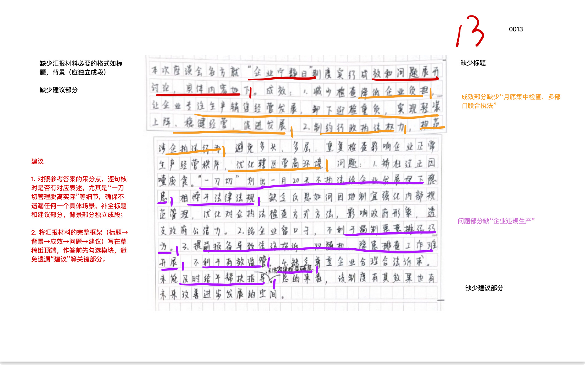
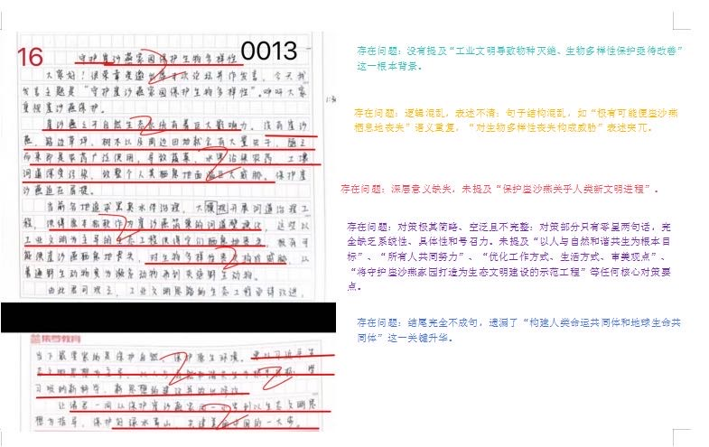
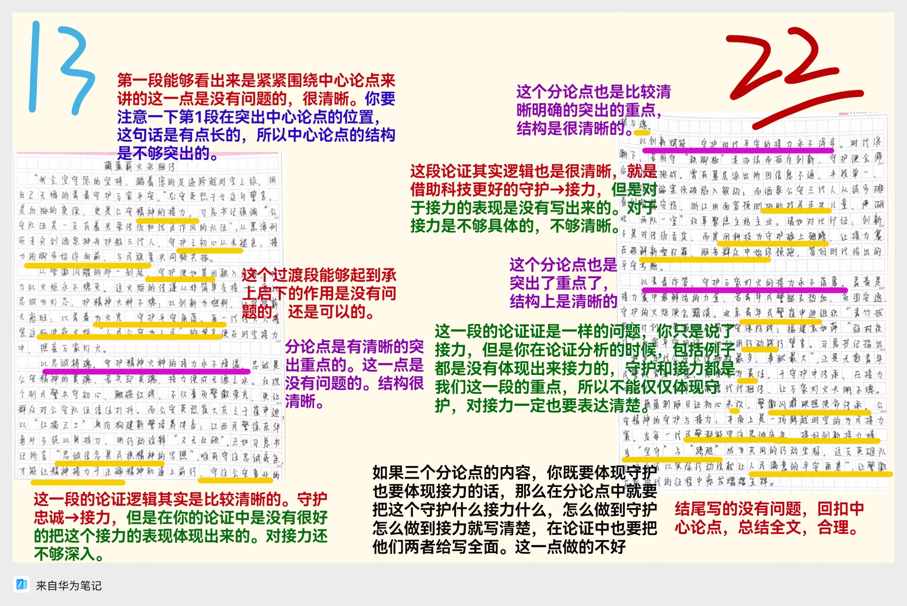

| 昵称    | Y0ungK1ng |
| ----- | --------- |
| Q1得分  | 11        |
| Q2得分  | 13        |
| Q3得分  | 16        |
| Q4得分  | 22        |
| 总分    | 62        |
| 平均分   | 57.5      |
| 排名    | 267       |
| 总提交人数 | 1500      |

###  **一、效应概括题**::noto:banana::

| 得分  | 总分  | 区间  |
| --- | --- | --- |
| 11  | 15  | 中   |

::: tip

:::

::: card title="题干" icon="noto:backhand-index-pointing-right-dark-skin-tone"

**一、根据给定材料1，谈谈红枫林警务室是如何服务易地搬迁群众的？（15分）**

要求：准确、全面、有条理，不超过250字。

:::

::: card title="答题" icon="twemoji:astonished-face"

:::

::: card title="答案" icon="typcn:tick-outline"

**集梦1**：

1. 科学合理选址。调研选取居民集中、交通便捷的区域设立警务室，方便专项服务。
2. 组建专业队伍。抽调经验丰富的警力入驻，以乡警融乡情。
3. 保障业务齐全。公安类业务功能完备，覆盖高频业务，便于群众就地办理，节省时间，提高效率。
4. 融合治理力量。与网格力量联系融合，开展巡逻排查等工作；与党群服务中心协调联合，融合各群体，组成警务团队。
5. 注重宣传预防。常态化反诈宣传，提升村民安全意识。
6. 借力线上渠道。建立微信群，宣传政策、回应关切，并开展预约服务。

**集梦2**：

1. 跨区选址/科学选址(2)，建警务室。党委班子调研选取移民集中度高、区位优势好、距离各移民点近(1)设立警务室(1)，抽调当地经验丰富、服务贴心的警力入驻(1)，以乡警融乡情、以乡音化乡愁。

2. 完善功能(1)，贴心服务(2)。设置专属服务窗口，分别办理各类公安类业务(1)，确保便捷高效；注重常态化反诈宣传(1)，提升村民安全意识。

3. 警网融合(1)，联动联治(2)。融合集中安置点的网格力量(警网融合)，开展日常工作；联合党群服务中心，组建警务团队(1)；组建微信群(1)，与搬迁群众建立联系，宣传相关政策，回应群众关切。

评分说明：1.核心词每个2分，其他踩分点每个1分，不需盖帽，答案中出现即可赋分；2.条理分1分，一般分3-5条，根据分条合理性酌情扣0-1分。

**郑岳峰**：

1. 物理距离上，选取移民集中度高、距离各移民点近的区域设点办公，专门服务易地搬迁群众。
2. 人员配置上，从移民原籍乡镇抽调经验丰富、服务贴心的民警辅警入驻，以乡警融乡情、以乡音化乡愁。
3. 打通服务群众的“最后一公里”。接入公安网专线，开设不同服务窗口:内容盖户口迁移、身份证办理等。
4. 普及防诈骗知识，帮助群众提高防诈意识和处理网贷事务，提醒注意事项。
5. 形成与社区党群服务中心及网格力量的协作配合。开展巡逻排查入户走访，调解纠纷，收集社情民意等工作组建公益警务团队。
6. 通过组建微信群等方式，与群众建立联系，宣传政策，回应关切。

:::

::: card title="反思与建议" icon="line-md:compass-loop"

优点解析：

- 材料细节梳理较好，体现了认真阅读的态度。

问题解析：

1. 对 “为什么建立警务室” 的背景信息提炼不足，忽略了选址科学性和警力配置的合理性；
2. 逻辑层次待优化：要点归类不够合理，对警室命名的深化含义和服务理念把握不到位；
3. 关键词提取需强化：材料中 “跨区出警”“多警种驻守” 等高频关键词，以及 “背景原因”“创新特点” 等类别表述，需更聚焦。

明确大哥要点，紧抓动词！

:::

::: card title="总结答案" icon="typcn:tick-outline"

**Y0ungK1ng**：

1. 科学选址，组建团队。选取移民集中度高、区位优势好、距离各移民点近区域设立警务室，专门服务易地搬迁群众；抽调经验丰富、服务贴心警力，以乡警融乡情，以乡音化乡愁。
2. 基础业务功能齐全。接入公安网专线，开设不同服务窗口，分别办理各类公安类业务，确保安全便捷高效；普及防诈知识，帮助处理网贷事务，宣传注意事项。
3. 警网融合，联动联治。融合集中安置点网格力量，开展日常工作；联系党群服务中心，组建警务团队，走访深入群众，化解矛盾纠纷；组建微信群，与群众建立联系，宣传政策，回应关切，全天候热情服务。

:::

###  **二、公文写作题**::noto:banana::

| 得分  | 总分  | 区间  |
| --- | --- | --- |
| 13  | 20  | 中   |

::: card title="题干" icon="noto:backhand-index-pointing-right-dark-skin-tone"

**二、假如你是D市营商办的参会人员，座谈会结束后将向领导汇报工作，请根据给定材料2就本市企业宁静日制度试行的成效和面临的问题，撰写一份汇报材料供领导审阅。（20分）**

要求：紧扣材料，内容全面，层次清楚，不超过350字。

:::

::: tip

:::

::: card title="答题" icon="twemoji:astonished-face"

:::

::: card title="答案" icon="typcn:tick-outline"

**集梦**：

关于企业宁静日制度试行汇报材料(2)

本次座谈会，收集了各方对于“企业宁静日”制度实行成效和问题的相关看法，汇报如下：(背景1分，酌情赋分)

成效：
1. 减轻企业负担(1)。月底集中、联合执法(1)，检查相对减少，让企业卸下迎检重负，专注发展、经营(1)。
2. 规范执法行为(1)。制约行政执法权力(1)，避免重复检查，维护经营秩序，优化营商环境(1)。

问题：
1. 一刀切管理脱离实际(1)。与法律法规要求相悖(1)，有损政府形象、公信力。
2. 企业行为难约束。宁静日期间不检查(1)，企业违规生产(1)。
3. 难以有效监管(1)。提前报备导致信访投诉、双随机、隐患排查等工作(1)难以开展。
4. 矛盾隐患突出。存在短期密集检查(1)、宁静日期间无帮扶指导(1)等问题。

建议：因地制宜地强化内部规范管理，因时制宜优化执法检查方式，及时给予企业帮扶指导，避免“一刀切”执法。(3分，建议合理即可，酌情赋1-3分)

**超格**：

“企业宁静日”制度实行的汇报材料

为了解“企业宁静日”制度实行成效和问题，市营商办召开座谈会，现将主要内容汇报如下:

制度实行带来的成效：
1. 规范涉企执法行为，降低检查次数，联合检查，避免多头、多层、重复检查影响企业正常生产经营秩序，让企业将时间和精力放在生产和销售上，实现轻装上阵、稳健经营，优化辖区营商环境。

制度存在的问题:

1. 一刀切，违背法律法规，会影响政府形象，透支政府公信力。
2. 不利于有效监管不利于遏制违法行为;导致信访投诉、双随机、隐患排查等工作难以开展。
3. 引发企业担忧。企业担忧短期密集检查，缺少监管部门支持帮扶指导。

**郑岳峰**：

“企业宁静日”制度实行的汇报材料

成效:一、多部门联合检查集中于某一固定时段，检查相对减少，使得企业能够将更多的时间的精力放在生产和销售上。二、通过对行政执法权力的制约，规范了涉企执法行为，避免了多头、多层，重复检查对企业经营秩序的影响，为尤化营商环境提供了重要抓手。三、压缩涉企检查事项，企业迎检频次下降，使得企业负担大幅度减轻，实现了轻装上阵、稳健经营。

问题:一、划出某些时间段不执法，存在矫枉过正和因废食问题，可能给企业发展埋下隐患，影响z府形象，透支Z府公信力。二、群众担忧企业在宁静日期间不抓环保不利于遏制恶意排污行为。三、监管部门担心提前报备会导致信访诉求、双随机、隐患排查等工作难以开展，不利于有效监管。四、企业顾及宁静期之外会迎来密集检查，而宁静期间监管部门不到企业，遇到问题难以寻求帮扶支持。

:::

::: card title="反思与建议" icon="line-md:compass-loop"

1. 格式不规范：缺少汇报材料必要的标题，背景未独立成段；
2. 内容不完整：
    - 成效部分缺失 “月度集中检查、多部门联合执法”；
    - 问题部分缺 “企业违规生产”；
    - 整体缺少建议部分；
3. 内容表述不足：未体现 “一刀切管理脱离实际” 等细节。

:::

::: card title="总结答案" icon="typcn:tick-outline"

**Y0ungK1ng**：

关于企业宁静日制度试行汇报材料

本次座谈会，各方就“企业宁静日”制度实行成效和问题展开讨论，汇报如下：

成效：
1. 减轻企业负担。降低检查次数，月底集中联合执法，企业专注生产销售经营发展，卸下迎检重负，实现轻装上阵，稳健经营。
2. 制约行政执法权力。规范涉企执法行为，避免多头多层重复检查影响企业正常生产经营，优化辖区营商环境。

问题：
1. 一刀切矫枉过正。埋下发展隐患，有悖法律法规，有损政府形象、公信力。
2. 企业行为难约束。宁静日不检查期间企业违规生产，不利于遏制恶意排污行为。
3. 不利于有效监管。提前报备导致信访投诉、双随机、隐患排查等工作难以开展。
4. 矛盾隐患突出。短期密集检查引发企业担忧；缺少监管部门及时帮扶指导。

总之，建议因地制宜强化内部规范管理，优化执法方式，及时帮扶指导。

:::

###  **三、公文写作题**::noto:banana::

| 得分  | 总分  | 区间  |
| --- | --- | --- |
| 16  | 25  | 中   |

::: warning

:::

::: card title="题干" icon="noto:backhand-index-pointing-right-dark-skin-tone"

**三、假如你是绿会的工作人员将受邀出席S市生态保护与绿色发展主题论坛并作发言，呼吁社会各界重视崖沙燕保护，请根据给定材料3，以“守护崖沙燕家园 保护生物多样性”为题撰写一篇发言稿。（25分）**

要求：内容全面，有逻辑性，语言流畅，不超过500字。

:::

::: card title="答题" icon="twemoji:astonished-face"

:::

::: card title="答案" icon="typcn:tick-outline"

**集梦**：

守护崖沙燕家园，保护生物多样性（给定标题，2分）

社会各界人士/各位来宾/各位朋友：（称谓1分，合理即可）

大家好！工业文明迅速发展，人类对土地、海洋的改变，导致了物种的大量灭绝，人类对于栖息地的保护和对整个生物多样性的保护亟待改善(2)。崖沙燕对栖息地的要求十分苛刻，当前对崖沙燕的保护取得阶段性进展，但仍需努力(2)。

守护崖沙燕家园意义重大。崖沙燕对自然生态系统有着巨大影响力(2)，保护崖沙燕关乎人类新文明进程(2)。如果没有崖沙燕，会使得周边环境虫害加剧，随后带来农药的广泛使用，威胁到整个人类栖息地(2)。而且，受工业文明思路影响，河道整治类工程项目加速河道硬化，使崖沙燕栖息地逐渐丧失，有可能导致它们成为灭绝野生动物(2)。

保护崖沙燕迫在眉睫。我们要坚持以习近平生态文明思想为主导、以人与自然和谐共生为根本目标(2)，所有人共同努力，学习吸纳新科学、新思想的建议(2)，优化工作方式、生活方式、审美观点(2)，将守护崖沙燕家园打造为生态文明建设的示范工程(2)！

绿水青山就是金山银山。在此我呼吁大家共同参与到构建人类命运共同体和地球生命共同体的事业中去，共建美丽中国！(2)

评分说明：1.要点分25分； 2.逻辑分3分，根据“背景-原因-做法”思路组织答案，逻辑错误扣2分；分段混乱扣

1分。

**超格**：

守护崖沙燕家园保护生物多样性

各与会人员:

当前，人类对于栖息地和生物多样性的保护亟待改善。人类要开启新文明认识到崖沙燕和其他主体密切相关。

首先，河道整治类工程项目对生态环境有负面影响，使崖沙燕栖息地丧失导致它们变为濒危野生动物、再到灭绝野生动物。我们要保护自然、保护原生环境。

其次，崖沙燕对于自然生态系统有巨大影响力。没有崖沙燕，会有大量的虫子，导致农药广泛使用，污染蔬菜水果、土壤河道和海岸，威胁人类栖息地。

此外，感谢有关人员，在大家努力下，完成了一项生态文明建设的示范工程崖沙燕保护，是新文明的典型案例。在河道治理中群众发现问题并主动和我们联系各部门领导以习近平生态文明思想为主导、以人与自然和谐共生为根本目标，学习吸纳新科学、新思想的建议并做出修改。

在生态文明的今天，我们应该更注重人与自然和谐共生，以生态文明思想为指导，保护好绿水青山，共同参与到构建人类命运共同体和地球生命共同体的事业中去，共建美丽中国。

**郑岳峰**：

守护崖沙燕家园保护生物多样性

各位嘉宾、各位领导、各位同行:

我是中国生物多样性保护与绿色发展基金会工作人员小S，很荣幸在这里分享心得看法。在生态文明的背景下，我们应该更注重人与自然的和谐共生;崖沙燕保护问题，其本质是生物多样性保护的一个环节，它们对于构建地球生命共同体、共建美丽中国有着重要价值。

在崖沙燕和生物多样性保护问题上，我们存在一些误区和缺失:一。各地的各种生态工程，其实属于工业文明思路，会对生物多样性丧失造成威胁。二。当前国内城市追求黑臭水体的治理，但是河道的大规模整治和硬化，使得岩沙燕无处筑巢。

我们需要持续接力努力，守护崖沙燕家园，保护生物多样性。一、要让生态文明思想深入民心，提升全社会的认知水平。调动群众积ji性创造力，引导鼓励人M群众成立志愿者团体。二、地方z府的领导水平高，在此表示敬意。但是，地方z府还需要进一步促进部门之间的沟通协作，涵盖多个相关单位，形成良好的协调联动机制。三、打破工业文明思路的观念误区。保护自然、保护原生环境，而不是单纯地开展各种人工生态工程:吸纳新科学、新思想，不能简单地以工业文明作为尺度。四、打造共建共享地社会治理格局，大家共同参与，在生态文明建设中，实现z府治理和社会调节、居民自治良性互动。

共建人类命运共同体和地球生命共同体，让我们携手，彼此接力!谢谢对大
家!

:::

::: card title="反思与建议" icon="line-md:compass-loop"

1. 核心要点缺失：未提及 “工业文明导致物种灭绝、生物多样性保护亟待改善”“保护母亲河关乎人类文明进程” 等关键内容；
2. 表述问题：逻辑混乱、语义不清（如 “极有可能减少断流是损失” 语义重复，“对生物多样性丧失构成威胁” 表述冗余）；
3. 内容单薄：对部分内容仅寥寥几句，缺乏系统性、具体性，未提及 “人与自然和谐共生”“全民共同努力” 等核心要素；
4. 升华不足：遗漏 “构建人类命运共同体和地球生命共同体” 的关键升华点。

:::

::: card title="总结答案" icon="typcn:tick-outline"

**Y0ungK1ng**：

守护崖沙燕家园保护生物多样性

各位来宾：

大家好！当前工业文明迅速发展的同时，导致了大量物种灭绝。人类对于栖息地的保护和对整个生物多样性的保护亟待改善。人类要开启一个新的文明，这与崖沙燕和其他主体密切相关。

如今，以工业文明为主导的生态工程持续开展，河道整治类工程项目使得崖沙燕栖息地丧失，极有可能导致他们成为灭绝野生动物，对生物多样性丧失构成威胁。守护崖沙燕家园意义重大，崖沙燕之于自然生态系统有着巨大影响力。没有崖沙燕使得周边环境虫害加剧，随后带来农药的广泛使用，进而污染蔬菜水果、土壤河道，对整个人类栖息地造成巨大威胁。

君可观之，保护崖沙燕迫在眉睫。以工业文明思路为主导的生态工程亟待改进。需要以习近平生态文明思想为主导、以人与自然和谐共生为根本目标，学习吸纳新科学、新思想建议，优化工作方式、生活方式、审美观点，将守护崖沙燕家园打造为生态文明建设的示范工程！

绿水青山就是金山银山。在此我呼吁诸君注重人与自然和谐共生，共同参与构建人类命运共同体，共建美丽中国！

:::

###  **四、大写作**::noto:banana::

| 得分  | 总分  | 区间  |
| --- | --- | --- |
| 22  | 40  | 中   |

::: tip

:::

::: card title="题干" icon="noto:backhand-index-pointing-right-dark-skin-tone"

**四、请结合你对“给定资料7”中“用智慧给执法‘加分’，以创新促执法‘乘效’”这句话的理解，联系实际，写一篇文章。（40分）**

要求：

（1）自选角度，自拟标题；

（2）参考给定资料，不拘于给定资料；

（3）观点明确，内容充实，结构完整；

（4）篇幅1000字左右。

:::

::: card title="答题" icon="twemoji:astonished-face"

  

:::

::: card title="答案" icon="typcn:tick-outline"

**集梦1——思辨文**：

守护英烈精神，接力未竟事业

在历史的长河中，英烈们以其崇高的精神境界、无畏的牺牲精神和坚定的理想信念，铸就了一座座不朽的丰碑。他们的事迹激励着一代又一代中华儿女，不断前行，不断奋斗。作为新时代的青年，我们应当守护英烈所秉持的崇高精神，接力英烈未竟的事业，无怨无悔地用青春的热烈换取万家平安。

守护，意味着不忘初心，牢记使命，坚守梦想。英烈精神是民族的精神脊梁，凝结着忠诚报国的赤胆忠心、舍生取义的高尚气节与矢志奋斗的坚定信念，是穿越时空、历久弥新的精神财富。这份精神价值，在于为后人筑牢信仰根基。英烈用热血践行初心，以生命诠释使命，让我们在纷繁世事中明确前行方向，在面对诱惑时坚守精神坐标。它唤醒人们对家国的责任担当，激励个体将个人梦想融入民族复兴伟业，凝聚起攻坚克难的磅礴力量。同时，守护英烈精神是对历史的敬畏、对英雄的告慰，更能为社会注入正能量。它抵御虚无历史、诋毁英雄的错误思潮，培育崇尚英雄、学习英雄的社会风尚，让初心不褪色、使命不缺位、梦想不折翼，为国家发展、民族进步提供不竭的精神滋养与动力支撑。

接力，意味着接力奋斗，无私奉献，英勇无畏。英烈们用生命铺就的道路，承载着民族独立、人民幸福的未竟理想，接力这份事业，是对英烈遗志的传承，更是时代赋予我们的责任与使命。这份接力的价值，在于延续奋斗的火种。英烈们以英勇无畏冲破艰难险阻，以无私奉献诠释家国大义，如今的接力，便是要传承这份精神内核，在新时代的征程中勇挑重担。同时，接力未竟事业能淬炼担当品格、凝聚民族共识。它让个体在奉献中实现人生价值，让社会在接续奋斗中破除发展阻碍，更让民族在传承中保持昂扬姿态。这份接力不分岗位、无关强弱，却能汇聚成推动国家进步的磅礴动能，让未竟的事业在代代相传中走向圆满，让英烈精神在实践中永葆生机。

坚持守护与接力，继承英烈精神，砥砺奋进力量。落实这份责任，需将精神传承融入日常、落到实处，让英模精神成为行动指南而非口号。首先要筑牢思想根基，通过课堂教学、红色宣讲、英烈纪念馆研学等形式，让英模事迹进校园、进社区、进企业，让人们在耳濡目染中感悟精神内核。其次要健全保障机制，完善英烈保护法律法规，严厉打击诋毁英烈的行为，为守护英烈精神筑牢制度防线。更要鼓励实践践行，将英模精神转化为岗位担当。在工作中秉持敬业奉献的态度，在生活中坚守诚信友善的底线，在危难时展现英勇无畏的担当，让每一个人都成为英模精神的传承者、践行者。唯有思想与行动同向发力，才能让守护不流于形式、接力不中断传承，让英模精神在新时代绽放持久光芒。

守护英烈精神、接力未竟事业是我们作为新时代青年的责任和使命。我们要以英烈为榜样，铭记他们的英勇事迹和高尚品质，让这些精神成为我们接力前行的动力源泉。我们要深刻认识到接力未竟事业的重要性，用实际行动去践行英烈精神，为实现中华民族伟大复兴的中国梦贡献自己的力量。

**集梦2——策论文**：

> 考场难发挥，但高分推荐

藏蓝的传承 青春的奔赴

守护是风雪夜归的逆行，是灯火阑珊处的坚守；接力是警徽闪耀的传承，是誓言不改的赓续。从手电筒到智能警务，从纸质台账到云端平台，从父辈的足迹到吾辈的脚步，不变的是对人民的赤诚。让忠诚在岗位上闪光，让青春在赛道上燃烧，让守护与接力在代际之间薪火相传、越燃越旺。

我们将沿着公安英模的岁月足迹，砥砺前行，用风雨无阻的坚守、用乘风破浪的勇气和永不退色的忠诚，坚决完成党和人民赋予的使命。在风雪里站岗、在酷暑中奔走，用风雨无阻的坚守托起万家灯火；在危难前逆行、在博弈中亮剑，以乘风破浪的勇气攻坚急难险重；在诱惑前自持、在得失间取舍，把永不褪色的忠诚写进每一次出警、每一份笔录、每一米巡线。以人民为中心，以法治为底线，以科技为引擎，锻造专业、协同、过硬的本领，提升预警、处置、服务的质效。让警徽在岗位上闪光，让青春在赛道上燃烧，用担当兑现誓言，用实绩回应期待，以实际行动兑现党和人民的重托。

我们将带着公安英模的拳拳嘱托，牢记初心，用时不待我的精神、舍我其谁的担当、无畏生死的气魄来捍卫人民警察的荣光。在矛盾调处中耐心细致，在窗口服务中温暖周到，在执法办案中秉公持正，把“人民公安为人民”落到每一次接处警、每一张证件、每一句叮嘱上。以时不我待的精神提升能力，以舍我其谁的担当扛起责任，以无畏生死的气魄守住底线，既当平安建设的“排头兵” ，又做群众贴心的“暖心人”。在关键时刻冲得上、在危急关头顶得住、在平常时候干得好，让公平正义可感可触，让人民警察的荣光在新时代熠熠生辉。

我们将向着公安英模的崇高理想，接力奋斗，用每一起案件的告破、每一次无畏的冲锋、每一项服务的落实，为平安安康的建设贡献自己的力量。用每一起案件的告破回应群众期盼，用每一次无畏的冲锋守护社会安宁，用每一项服务的落实厚植民生温度，把小案侦防、反诈预警、交通治理、社区警务做细做实。坚持问题导向、目标导向、结果导向，以数据赋能提升预测预警预防能力，以机制重塑推动共建共治共享，以过硬作风锻造忠诚干净担当的公安铁军。在平凡岗位书写不凡业绩，在接续奔跑中把平安中国的蓝图化为现实图景。

坚持守护与接力，需要我们一代代公安干警勇敢地担起时代赋予的责任和使命，要对得起这身警服；也要刻苦钻研，在工作中多学多问；更要细心，体现执法工作的公正公平。唯有如此，才能成为忠诚警魂的实践者、继承者和守护者，推动法治工作的良性和有序发展，建设法治中国。

:::

::: card title="总结答案" icon="typcn:tick-outline"

**Y0ungK1ng**：
  

藏蓝薪火映初心 青春接力护平安

守护是风雪夜归的逆行背影，是灯火阑珊处的执着坚守；接力是警徽闪耀的精神赓续，是誓言不改的使命传递。从父辈手中的手电筒到吾辈指尖的智能警务，从泛黄的纸质台账到云端的数据平台，变的是警务手段的迭代升级，不变的是“人民公安为人民”的赤胆忠诚。正如习近平总书记所言“公安队伍是英雄辈出、正气浩然的队伍”，藏蓝传承的本质，正是一场跨越时空的“守护接力赛”，需以忠诚为锚、创新为翼、青春为炬，方能让平安之光薪火永燃。

这场接力赛，首在守护忠诚根基，接力精神火种不偏航。忠诚是公安传承的“压舱石”，守护这份精神内核，是接力的前提与底色。若失却对忠诚的坚守，接力便会沦为无源之水——个别民警在诱惑前失守底线、在责任前推诿退缩，不仅玷污藏蓝荣光，更让精神传承断档。而公安英烈崔大庆之子崔申迪，既守护父亲“惩恶扬善”的精神遗产，又以“红墙卫士”身份将其融入新警培养；江西瑞金民警徐东华守护烈士父辈的担当本色，面对歹徒挺身而出诠释“义无反顾”。他们以守护筑牢根基，以接力延续荣光，印证了唯有守住“对党忠诚、服务人民”的初心，藏蓝接力才能在正确轨道上行稳致远。

这场接力赛，要在守护经验智慧，接力创新实践不止步。父辈积累的“铁脚板”经验、群众工作智慧，是公安传承的宝贵财富，守护这些实践根基，才能让创新接力有方向、不盲目。若固守经验而拒斥创新，守护便会滞后于时代——曾有基层派出所因依赖纸质台账、信息不通，让电信诈骗案侦破陷入被动；而酒泉公安三代人既守护老赵徒步排查的严谨态度，又接力发展智慧安防；天津民警守护“为民服务”的初心，接力运用大数据1小时找回走失老人。守护经验不是守旧，接力创新不是冒进，唯有将二者融合，才能在打击犯罪、服务群众的新考题中交出合格答卷，让接力赛兼具厚度与速度。

这场接力赛，贵在守护责任担当，接力青春使命不落幕。“守护万家平安”的责任担当，是公安精神的血脉，守护这份沉甸甸的承诺，是青春接力的核心要义。若青年民警褪去担当热血，守护便会失去活力——而北京青年民警崔申迪既守护父辈“对得起这身警服”的嘱托，又以“青竹拔节”计划带领战友坚守安保一线；福建袁如萍守护“人民公安为人民”的宗旨，以“驻村夜访”接力做好群众贴心人。正如习近平总书记强调“和平年代，公安队伍是牺牲最多、奉献最大的队伍”，青年民警唯有守护好前辈的责任担当，才能在接力中书写青春答卷，让平安承诺在代际传递中愈发厚重坚实。

藏蓝制服见证初心不改，警徽闪耀映照使命传承。从黑航刑侦老兵的早出晚归，到新时代民警的数据流淌；从风雪里的站岗执勤，到云端上的反诈预警，这场“守护接力赛”从未停歇。当每一代公安人都握紧忠诚之锚、扬起创新之翼、点燃青春之炬，必将如《人民日报》所赞颂的那样，“以实际行动绘就让人民满意的平安画卷”，让藏蓝薪火在新时代的征程中熠熠生辉，照亮万家灯火长明。

:::