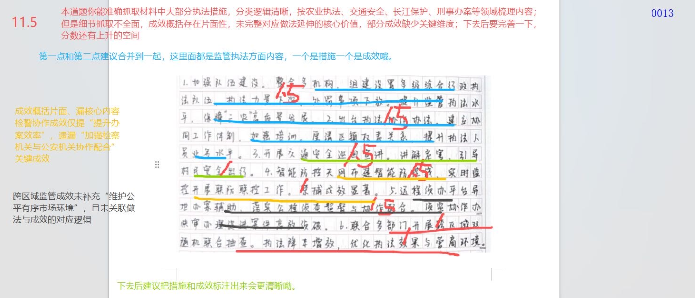
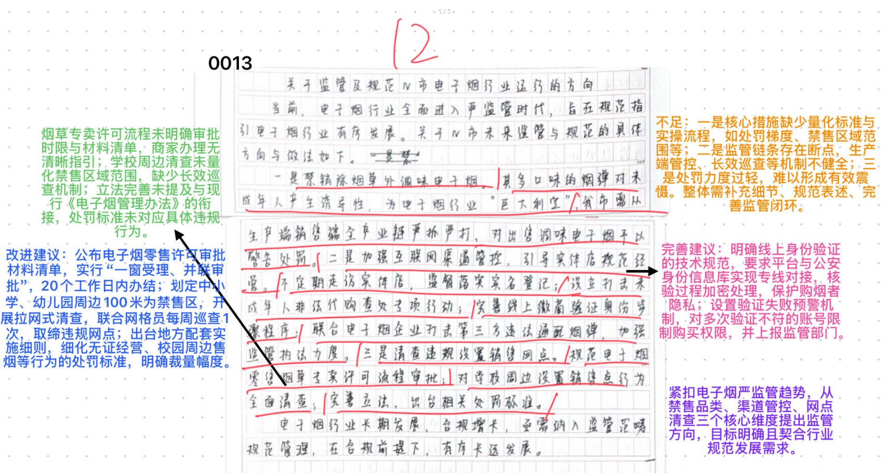
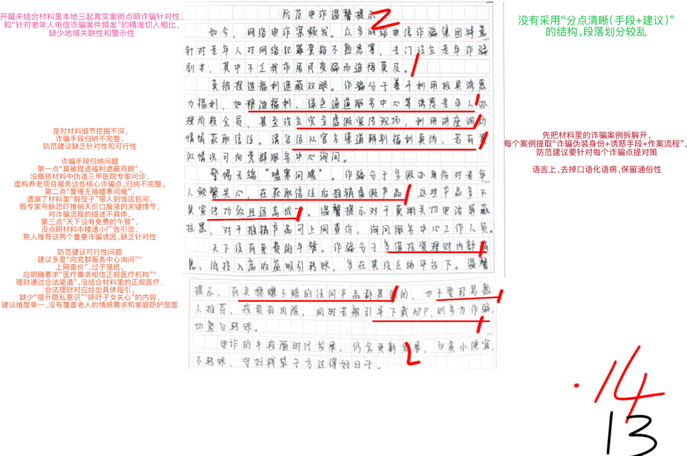
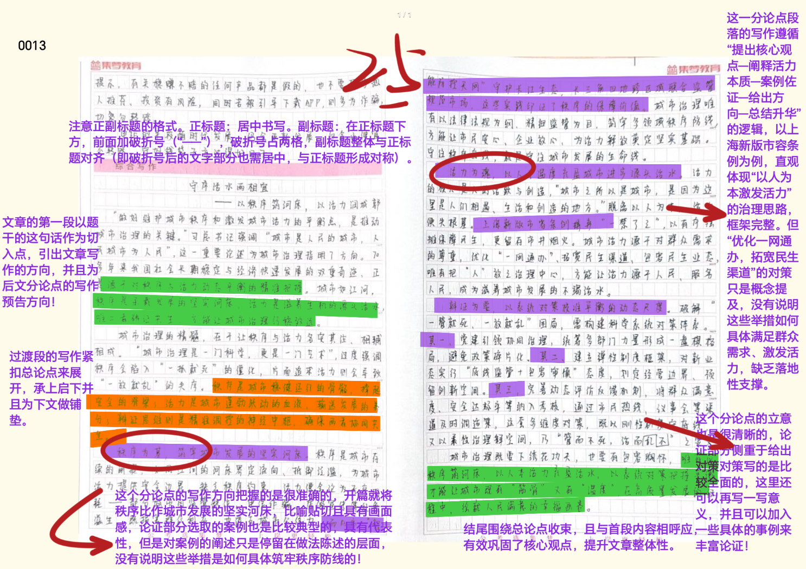

| 昵称    | Y0ungK1ng |
| ----- | --------- |
| Q1得分  | 11.5      |
| Q2得分  | 12        |
| Q3得分  | 14        |
| Q4得分  | 25        |
| 总分    | 62.5      |
| 平均分   | 59        |
| 排名    | 466       |
| 总提交人数 | 1537      |

###  **一、效应概括题**::noto:banana::

| 得分   | 总分  | 区间  |
| ---- | --- | --- |
| 11.5 | 15  | 中   |

::: tip

:::

::: card title="题干" icon="noto:backhand-index-pointing-right-dark-skin-tone"

**一、根据给定材料 1，概括 A 市在为推进执法规范化采取的措施及取得的成效。（15分）**

要求：准确全面，语言简练，字数不超过 250 字。

:::

::: card title="答题" icon="twemoji:astonished-face"

:::

::: card title="答案" icon="typcn:tick-outline"

**集梦1**：

1. 整合组建执法队伍，整合机构，下放行政处罚事项，编制手册及指引，建立协同机制，加强培训指导。(1.5)成效：优化体制机制，提升监管执法水平；执法过程标准化，厘清权责，提升执法人员业务水平。(1.5)

2. 组织交通安全宣讲，讲解违法行为危害及法律成本。(1.5)成效：提升群众安全意识/保障安全出行。(1.5)

3. 搭建“智能防控天网” ，布建“智能防控线”。(1.5)成效：实时监控，禁捕成效明显/改善生态环境。(1.5)

4. 侦监协作，轻罪案件快审办理。(1.5)成效：加强协作配合，提升办案效率。(1.5)

5. 完善信用监管制度，双随机联动抽查。(1.5)成效：加强信用监管，优化营商环境。(1.5)

评分说明：1.做法每条1.5分，成效1.5分，根据要点数量按0.5梯度给分；2.条理分1分，分类错误/每条要点混乱 倒扣1分。

**中公**：

1. 建立综合执法体系。(2分)优化执法体制机制，整合机构，建立综合执法大队，执法人员下沉，编制综合执法手册，出台协作办法，加强培训指导。成效：提升监管执法水平(1分)，保障三农高质量发展。
2. 加强普法宣传。(2分)组织交通安全巡回宣讲，多形式宣传。成效：保障安全出行，(1分)建设美丽乡村。
3. 智能防控体系。(2分)积极谋划，布局智能防控线，搭建智能防控天网。成效：提升禁捕成效，(1分)落实国家战略。
4. 侦查监督协作机制。(2分)成效：提升案件审办效率。(1分)
5. 加强跨区域综合监管。(2分)建立综合信用监管制度，开展双随机联动抽查，推动联合执法。成效：提升执法效果，优化营商环境。(1分)

:::

::: card title="反思与建议" icon="line-md:compass-loop"

优点解析：

- 能准确抓取材料中大部分执法措施，分类逻辑清晰（按农业执法、交通安全等领域梳理）。

问题解析：

1. 细节抓取不全面：成效概括存在片面性，未完整对应做法延伸的核心价值，部分成效缺少关键维度；
2. 内容关联不足：跨区域监管成效未补充 “维护公平有序市场环境”，且未关联做法与成效的对应逻辑；
3. 分类合理性待优化：部分监管执法内容（措施 + 成效）可合并，无需拆分。
4. 这里可以敏锐感知按照各地区来分点

改进建议：

- 完善细节，补充做法对应的核心成效；
- 明确标注 “措施” 与 “成效”，强化内容对应关系。

:::

::: card title="总结答案" icon="typcn:tick-outline"

**Y0ungK1ng**：

1. 建立综合执法体系。整合机构，下放行政处罚事项，执法力量下沉，编制综合行政执法手册，出台协作办法，加强培训指导。成效：提升监管执法水平，厘清权责，提升执法业务水平，保障三农高质量发展。
2. 开展交通安全巡回宣讲，讲解违法危害及法律成本。成效：提升群众安全意识，引导安全出行。
3. 布建智能防控线，搭建智能防控天网。成效：禁捕成效显著，落实国家战略。
4. 建立侦查监督协作机制，轻罪案件快审办理。成效：加强协作配合，提升办案效率。
5. 健全信用监管制度，双随机联合抽查。成效：加强跨区域跨部门信用监管，提升执法效果，优化营商环境。

:::

###  **二、对策建议题**::noto:banana::

| 得分  | 总分  | 区间  |
| --- | --- | --- |
| 12  | 20  | 中   |

::: card title="题干" icon="noto:backhand-index-pointing-right-dark-skin-tone"

**二、阅读给定材料 2，为促进《电子烟管理办法》的快速落地，N 市强化了本市电子烟行业的管理，你作为监管部门发言人，请你谈谈以后将在哪些方面进行监管及规范 N 市电子烟行业运行。（20 分）**

要求：分析合理，条理清晰，语言简练，字数不超过 400 字。

:::

::: tip

:::

::: card title="答题" icon="twemoji:astonished-face"

:::

::: card title="答案" icon="typcn:tick-outline"

**集梦**：

1. 从严监管电子烟经营行为(1)。①明确管理细则，严格落实管理办法，设置调味电子烟销售截止日期，向各类商家下发详细通知(2.5)；②加大监管执法力度，出台处罚标准，全面清查未成年人学校等重点区域，禁止设置销售网点(2.5)。

2. 加强互联网渠道管控(1)。①联合平台加强网店管理，完善身份信息验证步骤和程序，落实实名购买，利用大数据监管商家行为(2.5)；②联合电子烟企业、警方，畅通举报渠道，收集违规线索，加大违规销售的打击力度，打击“代购”等黑色产业(2.5)。

3. 引导实体店合规经营(1)。①店铺张贴提示语，销售人员严格检查消费者身份信息、核实年龄，禁止未成年人购买(2)；②变更营业执照经营范围，增加电子烟零售业务，向烟草专卖部门提交材料审批(2)；③签订行业自律公约，发挥行业规范、自律、协调作用，守法经营、诚信服务(2)。

评分说明：1.满分20分，要点分19分；条理分1分，分类错误/每条要点混分不给分。2.对策为半开放性，可根据对策的全面、针对、具体、可行等酌情给分。

**中公**：

从严监管电子烟经营行为。(2分)
1. 加强诱导性销售监管，对电子烟口味进行限制，严禁向未成年人出售电子烟。(2分)

持续加强互联网渠道管控。(2分)
1. 加大对微商的代购、广告促销、非法销售的黑色产业打击监管。(2分)
2. 要求微商店铺完善验证消费者身份信息的具体步骤和程序;(2分)
3. 加强警企合作，对第三方生产企业生产行为进行打击。(2分)

引导电子烟实体店合法规范经营。(2分)
1. 办理专卖许可。要求商家及时变更营业执法的经营范围，增强电子烟零售业务，提交审批。(2分)
2. 对校园周边开展全面清查，为未成年人创造无烟环境。(2分)
3. 制定完善电子烟市场规范和市场标准及相关处罚标准，引导行业自律，实现合规增长(2分)

:::

::: card title="反思与建议" icon="line-md:compass-loop"

不足解析：

1. 措施不具体：核心措施缺少量化标准与实操流程（如处罚梯度、禁售区域范围等）；
2. 机制不健全：监管链条存在断点（生产端、长效巡查等）；
3. 处罚力度弱：处罚过轻，难以形成有效震慑；
4. 流程不清晰：烟草专卖许可流程、商家清理等无明确指引，立法未衔接现行办法。

改进建议：

1. 明确审批流程：公布材料清单，实行 “一窗受理、并联审批”；
2. 细化禁售规则：划定中小学 / 幼儿园周边 100 米为禁售区，开展网格巡查；
3. 完善配套细则：细化无证经营、校园周边售烟等行为的处罚标准；
4. 强化技术监管：明确线上身份验证规范，设置验证失败预警机制。

签订行业自律公约，发挥行业规范、自律、协调作用，守法经营、诚信服务（==可背诵==）

:::

::: card title="总结答案" icon="typcn:tick-outline"

**Y0ungK1ng**：

一、从严监管电子烟经营行为

1. 明确禁止销售调味电子烟。严禁向未成年人售卖电子烟，向各类商家发放更详细通知

二、加强互联网渠道管控

1. 加大对微商代购、广告促销、非法销售的黑色产业打击监管力度，开展专项查处行动。
2. 联合平台加强微商管理，完善身份验证步骤和程序，落实实名购买，利用大数据监管商家行为。
3. 联合企业、警方、群众，畅通举报渠道，收集违法线索。

三、引导实体店合法规范经营

1. 店铺张贴提示语，严格落实销售人员检查消费者身份信息、核实年龄、禁止未成年人购买
2. 变更营业执照经营范围。增加电子烟零售业务，向烟草专卖部门提交材料审批。
3. 对校园周边设置销售点全面清查，为未成年人创造无烟环境。
4. 签订行业自律公约，发挥行业规范、自律、协调作用，守法经营、诚信服务。

:::

###  **三、公文写作题**::noto:banana::

| 得分  | 总分  | 区间  |
| --- | --- | --- |
| 16  | 25  | 中   |

::: warning

:::

::: card title="题干" icon="noto:backhand-index-pointing-right-dark-skin-tone"

**三、为提升社区老年人防骗意识，阅读给定材料 3 中的案情通报，你作为社区工作人员，在社区党群服务中心的微信公众号面向辖区老年人写一篇“防范电诈/诈骗温馨提示”的推文。（25 分）**

要求：建议合理可行，针对性强，条理清晰，语言简练，不超过 500字。

:::

::: card title="答题" icon="twemoji:astonished-face"

:::

::: card title="答案" icon="typcn:tick-outline"

**集梦**：

防范电诈温馨提示(2)

目前针对老年人电信诈骗案件频发，常见诈骗手段有(1)：一、购买会员服务诈骗。骗子谎称提供养老项目、医疗绿色通道等，诱骗老人购买会员(2)；二、冒充熟人诈骗。骗子伪造身份，诱骗老人购买“天价特效药”(2)；三、投资理财诈骗。骗子开设虚假投资平台，以高额回报为诱饵，诱骗受害人投资(2)。

为防范此类诈骗，在此给大家几个小提示(1)：

一、医疗需求要相信正规医疗机构(1)。不听信陌生人一面之词，不当场决定交易，咨询专业人士及正规机构(1)；多关注官方渠道有关惠民医疗方案及政策信息(1)；切莫相信“治病保健品”，如果生病请到医院或正规药店购药(1)。

二、感情需求要依托自己家人朋友(1)。提升个人隐私意识(1)，警惕个人信息泄露；主动多和子女亲友聊天，接触了解新鲜事物(1)，表达自身需求，保持健康快乐心态(1)。

三、理财需求要通过合法正规渠道(1)。理性分析，对“稳赚不赔”等高收益网络理财保持清醒头脑(1)；即使熟人介绍，也要保持谨慎，多做调查(1)；切勿相信引流小广告、不添加陌生人QQ、勿点击不明链接下载不明APP(1)。

请大家警惕“天上掉馅饼”，不贪小便宜，不盲目跟风。同时也呼吁子女们要多关心老人身心健康，织牢家庭的“防护网”(2)。

评分说明：1.满分25分，要点分24分；综合卷面分1分（卡分用，不给）；逻辑分3分，中间不分段、段落逻辑混乱酌情扣0-3分。2.结尾为半开放性，根据写作情况酌情给0-2分。

**中公**：

防范电诈温馨提示(1分)

为进一步加大防诈骗宣传力度，提高辖内居民群众的防诈意识，特此公布三起代表性的电诈案情和防范方法，提醒老年人注意防范:(1分)

一、虚假养老服务。(1分)诈骗分子以客服角色介绍养老服务项目以及福利，忽悠老年人办理会员缴纳费用。(1分)提示:1. 正规的医疗机构推出惠民医疗政策，一定是官方渠道发布，多去官网核实。(2分)2. 涉及资金交易，不要冲动消费，多跟子女沟通;(2分)3. 提高个人警惕，做好个人信息保护。(2分) 8分

二、保健品诈骗。(1分)诈骗分子通过嘘寒问暖推销“特效药”，招揽老人到现场，假专家看病谎称有病进行推销。(1分)提示:家中子女要抽出时间，多关心老人身心健康，切莫相信“特效药”，生病时要及时到医疗或者正规药店购药。(2分)2对于陌生人“关心”，提高警性，避免被骗取财产。(2分) 》6 分

三、投资理财诈骗。(1分)诈骗分子通过“熟人”推荐稳赚不赔”产品，引诱受害人下载app进行投资。(1分)提示:1.不要加入陌生人建立各种所谓“投资群”，相信有“稳赚不赔”投资。(2分)2不要轻易向陌生人转账，日遭遇诈骗，一时间报警。(2分)3下载国家反诈中心app，保护财产安全(2分) 》8分

希望广大老年人要提高自我防范意识，谨防电信诈骗。(1分)

:::

::: card title="反思与建议" icon="line-md:compass-loop"

问题解析：

1. 结构混乱：未采用 “分点清晰（手段 + 建议）” 的结构，段落划分杂乱；
2. 内容针对性弱：未结合真实案例点明诈骗针对性，对老年人案例高发的切入不足，措施缺少针对性与可行性；
3. 细节梳理不足：诈骗手段归纳不完整，防范建议未对应每个诈骗场景；
4. 语言不规范：存在口语化语病。

改进建议：

- 拆分材料案例，按 “诈骗伪装 + 诱惑手段 + 作案流程” 梳理，针对每个场景提对策；
- 优化语言，保留通俗性的同时避免口语化；
- 强化地域关联性与警示性，补充老年群体的情感需求、家庭防护等维度。

:::

::: card title="总结答案" icon="typcn:tick-outline"

**Y0ungK1ng**：

防范电诈温馨提示

为进一步加大防诈骗宣传力度，提高辖内居民群众的防诈意识，特此公布三起代表性的电诈案情和防范方法，提醒老年人注意防范:

一、虚假养老会员服务。诈骗分子以客服角色介绍养老服务项目以及福利，忽悠老年人办理会员缴纳费用。提示：1. 医疗需求要相信正规医疗机构正规的医疗机构，多关注官方渠道有关惠民医疗方案及政策信息。2. 涉及资金交易，不要冲动消费，多跟子女沟通；3. 提高个人警惕，做好个人信息保护。

二、冒充熟人保健品推销诈骗。诈骗分子通过嘘寒问暖推销“特效药”，招揽老人到现场，假专家看病谎称有病进行推销。提示：1. 感情需求要依托自己家人朋友，主动多和子女亲友聊天，接触了解新鲜事物。2. 提升个人隐私意识，切莫相信“特效药”，生病时要及时就医或者正规药店购药。3. 对于陌生人“关心”，提高警性，避免被骗取财产。 

三、投资理财诈骗。诈骗分子通过“熟人”推荐稳赚不赔”产品，引诱受害人下载app进行投资。提示：1. 不要加入陌生人建立各种所谓“投资群”，勿相信有“稳赚不赔”投资。2. 不要轻易向陌生人转账，如遭遇诈骗，第一时间报警。3. 下载国家反诈中心app，保护财产安全

希望广大老年人提高自我防范意识，谨防电信诈骗。(1分)

:::

###  **四、大写作**::noto:banana::

| 得分  | 总分  | 区间  |
| --- | --- | --- |
| 25  | 40  | 高   |

::: tip

:::

::: card title="题干" icon="noto:backhand-index-pointing-right-dark-skin-tone"

**四、请深入思考给定材料 4 中画横线句子“做好维护城市秩序和激发城市活力的平衡点，是推动城市治理的关键。” ，自选角度，自拟题目，写一篇文章。结合给定材料，自拟题目，自选角度，写一篇文章。（40 分）**

要求：观点鲜明、正确，分析深入、合理，语言流畅，字数控制在1000-1200字。

:::

::: card title="答题" icon="twemoji:astonished-face"

:::

::: card title="答案" icon="typcn:tick-outline"

**集梦——思辨文**：

平衡“秩序”与“活力”

——推动城市治理现代化的非凡智慧

秩序代表着城市的安定有序，是社会理性的表现；而活力则蕴含着城市发展创新的生命力和社会生活的丰富多样性，是城市社会各群体创造力的竞相迸发和个人潜力的充分发挥。习近平总书记强调，要“处理好活力和秩序的关系”。这为推动城市治理提供了重要遵循：建立科学有效的城市治理体制，找准活力与秩序的平衡点，既让社会充满活力，又要让社会稳定有序。

社会活力与秩序是辩证统一的，是城市治理的两个目标，从来就不是一对非此即彼或此消彼长的矛盾关系，而是有机的统一体。公平有序的管理不会导致活力的丧失，只有不合理的制度、不科学的管制才会导致活力的丧失。因此，要找到维护秩序和激发活力的平衡点，实现城市秩序与活力相统一，推动城市健康有序发展。

维护城市秩序需要完善制度建设，强化依法治理。习近平总书记强调：“要强化依法治理，善于运用法治思维和法治方式解决城市治理顽症难题，努力形成城市综合管理法治化新格局。”法治是国家治理体系和治理能力的重要依托，城市治理法治化为推进城市治理现代化提供保障。我们要利用法治的权威性、稳定性、程序性等优势，充分发挥法治对城市治理的引领、规范、保障作用，不断增强城市治理的系统性、规范性、协调性，让城市在深刻变革中既生机勃勃又井然有序。

激发城市活力需要推动社区自治，激发群众热情。人民城市人民建，人民城市为人民，社区自治是推动城市治理、提升城市温度的决定性因素。正如西安市碑林区大力培育和发展公益类、服务类、文化体育类等社会组织，加快构建“政府一社区一居民”良性互动机制，在承接政府服务、激发社会活力等方面发挥了积极作用。可以说，社区自治为城市治理提供了新的思路和方法，不同的社区可以根据自身的特点和需求，探索出适合自己的治理模式，为城市治理的整体创新提供了实践经验。

推动城市治理，要正确处理秩序与活力的关系，保持秩序与活力的动态平衡。社会治理现代化的重要价值就在于一方面要维护社会正常秩序、促进社会安定有序；另一方面要激发社会活力、促进经济社会多元发展。城市治理是一个系统工程，要顺应城市发展新形势、改革发展新要求、人民群众新期待，坚持以人民为中心的发展思想，坚持人民城市为人民。要在党的领导下，尽最大可能推动城市政府、社会市民形成城市治理共同体，通过各种方式参与城市建设和管理，真正实现城市共治共管、共建共享，实现城市治理秩序与活力相统一。

“城，所以盛民也。”习近平总书记强调： “推进城市治理，根本目的是提升人民群众获得感、幸福感、安全感。”保持秩序与活力的动态平衡，深入践行人民城市理念，更有效地动员更多社会力量参与社会治理，共促社会和谐稳定，我们的城市会更温暖、更有序。

:::

::: card title="总结答案" icon="typcn:tick-outline"

**Y0ungK1ng**：
  

守序活水两相宜

—— 以秩序筑河床 以活力润城郭​

“做好维护城市秩序和激发城市活力的平衡点，是推动城市治理的关键。” 习近平总书记强调 “城市是人民的城市，人民城市为人民”，这一重要论述为城市治理指明了方向。70 多年来我国社会长期稳定与经济快速发展的双重奇迹，正是源于对秩序与活力动态平衡的精准把握。城市如江河，秩序是承载发展的坚实河床，活力是滋养生机的源头活水，唯有二者辩证共生，方能让城市治理行稳致远。​

城市治理的精髓，在于让秩序与活力各安其位、相辅相成。《人民日报》评论指出 “城市治理是一门科学，更是一门艺术”，过度强调秩序会陷入 “一抓就死” 的僵化，片面追求活力则会导致 “一放就乱” 的失序。秩序是城市稳健运行的骨骼，撑起安全的脊梁；活力是城市蓬勃跃动的血液，输送发展的养分；辩证思维则是精准调控的神经中枢，确保两者协同共生。​

秩序为基，筑牢城市发展的坚实河床​。秩序是城市存续的前提，如同江河的河床界定流向、抵御泛滥，为城市活力提供安全边界。缺乏秩序约束，活力便会沦为无序内耗 —— 部分城市因监管缺位，电信诈骗、虚假宣传等乱象滋生，既损害群众利益，也透支城市公信力。而 A 市 “智能防控天网” 守护长江生态，长三角四地跨区域联合监管规范市场，这些实践印证了秩序的保障价值。城市治理唯有以法律法规为纲、精细监管为目，筑牢多领域秩序防线，才能让市民安心、企业放心，为活力释放奠定坚实基础。守住秩序底线，就是守住城市发展的生命线。​

活力为魂，以人本温度充盈城市进步的源头活水​。活力的核心是人的活跃与创造，“城市之所以是城市，是因为这里是人们相遇、生活和创造的地方”。脱离以人为本，活力便失根基。上海新版市容条例摒弃 “一禁了之”，通过多方商议实现 “有序设摊”，既保障民生，更留存市井烟火气；苏州高新区 “变堵为疏” 优化商圈停车，让市民 “车有位停”、商圈活力倍增。城市活力源于对群众需求的尊重，优化 “一网通办”、拓宽民意渠道、包容民生业态，唯有把 “人” 放在治理中心，才能让活力源于人民、服务人民，成为滋养城市发展的不竭活水。​

辩证为要，以系统对策校准平衡的动态尺度​。破解 “一管就死、一放就乱” 困局，需构建科学系统的对策体系。其一，党建引领协同治理，统筹多部门力量形成 “一盘棋” 格局，避免政策碎片化。其二，建立弹性制度框架，对新业态实行 “底线监管 + 包容审慎” 模式，划定经营边界、预留创新空间。其三，完善动态评价反馈机制，将群众满意度、安全达标率等纳入考核，通过市民热线、议事会等渠道及时调适策略。这套多维度对策，既以刚性制度守底线，又以柔性治理释空间，正是实现 “管而不死、活而不乱” 的核心密钥。​

“城市治理既要下‘绣花’功夫，也要有‘包容’胸怀”，唯有以秩序筑牢河床、以人本活力充盈活水、以系统对策把握平衡，才能让城市既有 “筋骨” 又有 “温度”，在高质量发展的征程中，绘就人民满意的幸福画卷。​

:::

