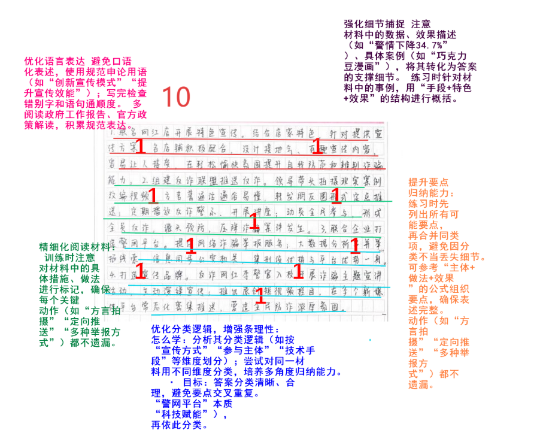
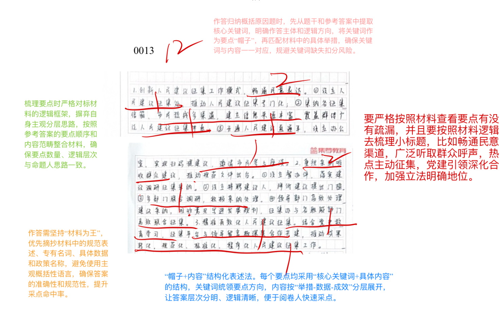
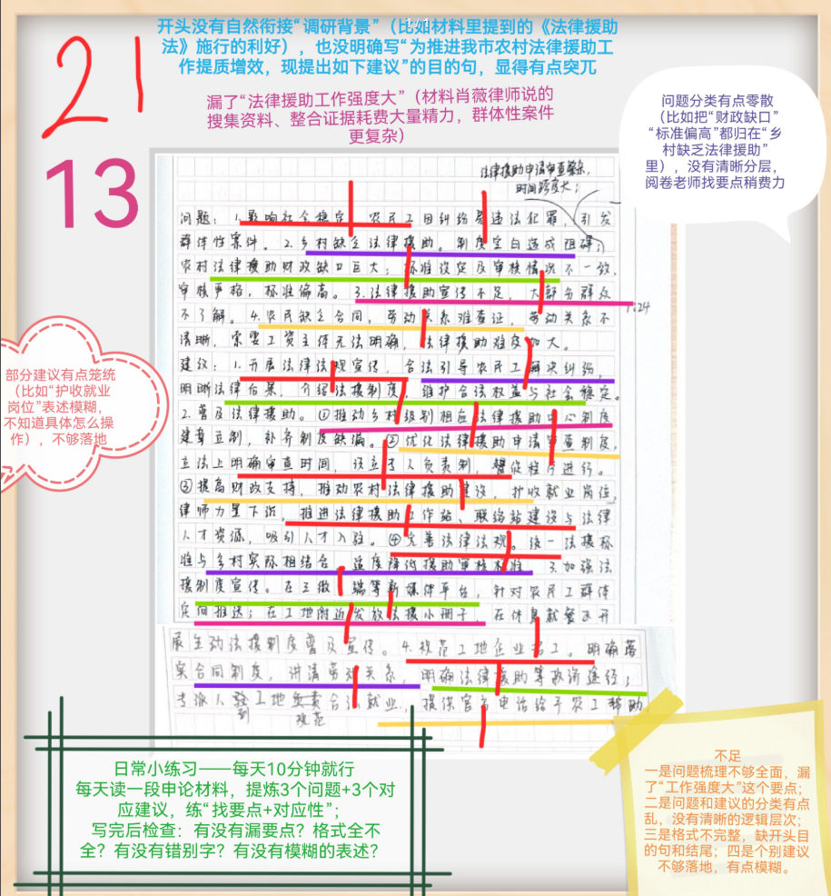

| 昵称    | Y0ungK1ng |
| ----- | --------- |
| Q1得分  | 10        |
| Q2得分  | 12        |
| Q3得分  | 21        |
| Q4得分  | 23        |
| 总分    | 66        |
| 平均分   | 58.5      |
| 排名    | 219       |
| 总提交人数 | 1581      |

###  **一、效应概括题**::noto:banana::

| 得分  | 总分  | 区间  |
| --- | --- | --- |
| 10  | 15  | 中   |

::: tip

:::

::: card title="题干" icon="noto:backhand-index-pointing-right-dark-skin-tone"

**一、根据“给定材料1” ，概括J市在反诈宣传方面有哪些特色。（15分）**

**要求∶全面、准确、有条理；不超过300字**

:::

::: card title="答题" icon="twemoji:astonished-face"

:::

::: card title="答案" icon="typcn:tick-outline"

**集梦1**：

1. **紧接地气、趣味十足**：“跨界联名” 网红店，店铺依自身特色设计反诈宣传内容；创新多样化方案，针对性宣传，营造轻松氛围。
2. **全民参与，源头预防**：组建反诈联盟，干群合力用方言或普通话拍宣传视频，转发朋友圈定向推送，形成全民反诈局面。
3. **科技注入，提升效能**：推出 “警网” 电诈举报平台，提供多种举报方式，收集犯罪信息同步公安机关。
4. **打造网红，同步推送**：线上线下同步，邀请明星警官宣讲以案释法、线上直播；推出原创短视频栏目常态化密集推送，提升群众反诈意识。

**中公杨凯旋**：

1. 激发店铺社会责任。/开展社会跨界合作【社会化】联名网红店，让其根据自身特色设计接地气、有趣、易让人接受的宣传内容，潜移默化影响消费者，提升防范意识和辨别诈骗的能力。
2. 形成全民反诈局面。【全民化】政府及干部组建反诈联盟，动员群众参与拍摄视频、音频等，并转发微信朋友圈，从源头上预防、压降诈骗类案件的发生。
3. 搭建信息举报平台。【平台化/信息化】集刑侦优势和互联网企业平台优势，面向网民提供多种网络诈骗举报方式，收集犯罪份子信息，利用大数据分析能力，串并举报线索，同步公安机关。
4. 打造反诈明星品牌。【品牌化】邀请明星警官进校园开展主题宣讲活动，线上线下同步直播：推出原创短视频栏目，并在多个平台密集推送，提醒人们谨防电信网络诈骗，菅造浓厚氛围、

:::

::: card title="反思与建议" icon="line-md:compass-loop"

- **答非所问**：未围绕 “J 市反诈宣传特色” 展开，却阐述 “执法队伍组建、交通安全宣讲” 等无关内容，偏离题干核心任务。
- **逻辑混乱**：分类未紧扣 “反诈宣传” 场景，将不同领域的执法措施混为一谈，未体现 “特色”（独特亮点 / 机制化做法）。

:::

::: card title="总结答案" icon="typcn:tick-outline"

**Y0ungK1ng**：

1. 紧接地气，有趣生动。跨界联名网红店，店铺依自身特色设计接地气、有趣、易让人接受宣传内容，激发社会责任感；创新多样化方案，针对性宣传，轻松氛围中提升防诈意识。
2. 全民参与，源头预防。干群合力组建反诈联盟，参与拍摄视频，转发朋友圈定向推送，从源头上预防、压降诈骗类案件发生。
3. 科技注入，提升效能。搭建信息举报平台，提供网络诈骗举报服务；大数据分析串并线索，同步公安机关。
4. 打造品牌，同步推送。邀请明星警官进校园宣传，线上线下同步；推出原创短视频栏目，常态化密集推送，营造反诈浓厚氛围。

:::

###  **二、分析原因题**::noto:banana::

| 得分  | 总分  | 区间  |
| --- | --- | --- |
| 12  | 20  | 中   |

::: card title="题干" icon="noto:backhand-index-pointing-right-dark-skin-tone"

**二、根据“给定资料2” ，分析S市人民群众的“金点子”能够成为城市治理“金钥匙”的原因。（20分）**

要求：全面、准确、有条理。不超过300字。

:::

::: tip

:::

::: card title="答题" icon="twemoji:astonished-face"

:::

::: card title="答案" icon="typcn:tick-outline"

**集梦**：

要点分20分，条理分2分--分类乱、不合理在要点分基础上倒扣0-2分；帽子形式不做强制要求，但是答案帽子中的关键词必须在作答中体现，缺的、表达不准的每条扣2分。

1. 畅通民意反馈渠道(2)：设立人民建议征集办(1)，专门处理群众反馈的意见建议，拓宽征集渠道，完善征集体系(1)。

2. 广泛听取群众呼声/尊重民意等(2)：开通人民建议“直通车”平台(1)，倾听人民心声；积极采纳群众建议，推动联合调研(1)，推动出台规范性文件。

3. 重大话题/热点主动征集(2)：邀请市民代表座谈收集建议(1)，纳入发展规划；聚焦民生热点(1)，开展联合征集，推动科学决策、民主决策。

4. 党建引领深化合作(2)： “人民建议征集”平台与人民网“领导留言板”合作(1)，推动建议成果转化(1)，从政策层面解决问题，加强规范化、标准化、程序化建设。

5. 加强立法明确地位(2)：人大常委会制定促进和规范人民建议征集工作的地方性法规(1)，推动民主立法、科学立法(1)。

**中公杨凯旋**：

1. ==创新人民建议征集工作模式==。建立一个信息来源丰富、覆盖群体广泛的人民建议征集体系;建立了人民建议信息直报机制，群众建议摆上领导案头并列为督办：制定专门法规，加强群众工作的规范化、标准化、程序化建设。
2. ==畅通民意表达渠道方式==。各区均设立人民建议征集办公室；村居实现“扫码提建议”；专门设置人民意见收集平台、网站，开通人民建议“直通车”。
3. ==推动人民建议征集的成果转化==。相关部门针对群众意见快速开展联合调研、落实；“人民建议征集与”平台人民网“领导留言板'开启深度合作共建；各职能部门积极采纳群众建议，推动出台规范性文件。

**华图**：

1. 建议征集专门化。设立人民建议征集处，集纳建议征集信箱、领导信箱、市民热线等多个渠道，建立起信息来源丰富、覆盖群体广泛的人民建议征集体系。
2. 建议落实高效化。开设人民建议信息直报机制，人民建议可直达领导，及时开展调研督办，高效落实。
3. 建议收集全面化。市民、游客的建议不计大小都可以提，内容涵盖经济社会发展的方方面面。
4. 建议提出便捷化。全市各区均设立人民建议征集办公室，村居实现"扫码提建议"，并聚焦民生热点职能部门开展联合征集。
5. 建议转化规范化。促进"人民建议征集"平台与人民网"领导留言板"开启合作共建，制定专门促进和规范人民建议征集工作的法规，推动人民建议征集的成果及时转化。

:::

::: card title="反思与建议" icon="line-md:compass-loop"

:::

::: card title="总结答案" icon="typcn:tick-outline"

**Y0ungK1ng**：

1. 人民建议征集专门化丰富化。设立人民建议征集办，专门处理信访意见建议；集纳多渠道人民建议，建立信息来源丰富、覆盖群体广泛人民建议征集机制，拓宽渠道。
2. 人民建议征集重视化便捷化。设立督办案，落实建议采纳；开通人民建议直通车，降低门槛；多部门联合调研，推动出台规范性文件；多地建立办公室，实现扫码提建议。
3. 人民建议征集重点领域参与化。邀请市民代表座谈收集建议，纳入发展规划；聚焦民生热点，高效联合征集，推动规范性文件出台。
4. 人民建议征集精准化有效化。党建引领，征集平台和领导留言板深度合作共建，推动建议成果转化，从政策解决问题，加强规范化、标准化、程序化建设。
5. 人民建议征集规范化科学化。人大常委会制定促进和规范人民建议征集工作的地方性法规，推动民主立法、科学立法。

:::

###  **三、公文写作题**::noto:banana::

| 得分  | 总分  | 区间  |
| --- | --- | --- |
| 21  | 25  | 高   |

::: warning

:::

::: card title="题干" icon="noto:backhand-index-pointing-right-dark-skin-tone"

**三、假如你是N市法律援助中心的工作人员小赵，根据“给定资料3” ，请针对此次调研中发现的主要问题，撰写一份工作建议。（25分）**

要求：

（1）问题梳理全面、准确；

（2）所提建议有针对性、切实可行；

（3）不超过500字。

:::

::: card title="答题" icon="twemoji:astonished-face"

:::

::: card title="答案" icon="typcn:tick-outline"

**集梦**：

关于N市农村优化法律援助的工作建议(1)

法律援助体现以人民为中心的发展思想(1)，维护人民群众合法权益(1)，贯彻法律面前一律平等的原则，保障社会公平正义(1)。

通过我市农村法律援助专题调研，发现诸多问题：1.工作强度大，搜集资料、整合证据耗费精力大；2.工作难度大，乡村等级未设置法律援助中心，程序繁杂、时间跨度长，群众不了解法律援助；3.财政缺口大，专业人员数量少；4.法律界定不合实际，援助标准偏高。(问题必须分4条且与答案分类一致：每条2分。任意问题分类错误，条理分扣4分）为提供更优质全面的法律援助，建议如下：(过渡1分)

一、降低工作强度(1)。增加人员数量，开展技能培训，提升信息处理效率；加强多部门间协作与沟通，确保信息通畅；实行灵活工作制度，合理安排休息时间。(0-2分：开放性，酌情给分)

二、降低援助难度(1)。设置村级法律援助中心，开通援助热线，安排人员值班，简化程序，缩短时间；借助讲座、短视频等开展法律援助及普法宣传，让群众了解法律援助，提升法治素质。(0-2分：开放性，酌情给分)

三、加大支持力度(1)。增加专项经费，加大政府购买法律援助服务的力度，提高办案补贴标准；设置法律援助工作站，培养或引进法律援助注册律师。(0-2分：开放性，酌情给分)

四、降低援助门槛(1)。更新现行法规，界定法律援助对象要符合经济发展需要；统一援助标准设定及审核情况，放宽审核、降低标准。(0-2分：开放性，酌情给分)

**站长**：

N市农村法律援助工作建议

农村法律援助意义重大。它促进了社会稳定，维护了人民群众合法权益，体现出以人民为中心的发展思想。然而，N市农村法律援助还存在短板。一是援助门槛高，案件适用范園小，审核过于严格、审核标准偏高：二是乡村未设置援助中心，申请、审查程序繁杂、时间长：三是农民不了解法律援助，法律意识淡薄：四是人员及经费不足。为此，特建议：

一，降低农民法律援助门槛。根据现实需要修订援助制度，扩大援助紧件适用范围，优化援助标准设定，随回低审核难度，让有需要农村群众能够得到援助。二、为农民法律援助提供便利。一是下沉机构设置，在乡村等级设置法律援助中心：二是在执行中简化法律援助程序，避免申请、审查程序繁杂、时间长。三、强化法律援助宣传，增强农民维权意识。一是向群众广泛宣传法律援助作用，让群众了解、会用。二是针对劳动权益保障加大宣传，养成合同意识，从源头上减轻法律援助难度。四、加大财政经费投入，缓解经费缺口。五、推动全社会共同参与。鼓励设立更多独立的法律援助机构，鼓励更多注册律师参与，鼓励公益捐助经费。（450字）

:::

::: card title="反思与建议" icon="line-md:compass-loop"

1. **开头 / 格式问题**：
    
    - 缺 “调研背景”（比如《法律援助法》施行的利好）；
    - 缺目的句（如 “为推进我市农村法律援助工作提质增效，现提出如下建议”），表述突兀；
    - 格式不完整（缺开头目的句）。
2. **要点遗漏**：
    
    - 漏 “法律援助工作强度大” 要点（材料体现：法律援助案件搜集资料、整合证据难度大，群体性案件更复杂）。
3. **分类 / 逻辑问题**：
    
    - 问题分类零散（比如 “财政缺口”“标准偏低” 都归在 “乡村缺乏法律援助” 类下），未清晰分层，增加阅卷老师找要点的难度。
4. **建议落地性问题**：
    
    - 部分建议表述笼统（如 “护收就业岗位”），操作模糊、不够落地。

:::

::: card title="总结答案" icon="typcn:tick-outline"

**Y0ungK1ng**：

关于N市农村优化法律援助的工作建议

农村法律援助体现以人民为中心的发展思想，能切实维护群众合法权益、贯彻法律面前人人平等原则、保障社会公平正义，但当前存在诸多短板：1. 工作强度大，资料搜集与证据整合耗力；2. 援助难度高，乡村缺乏援助机构、程序繁杂时限长、群众知晓率低，劳动关系取证难；3. 保障支撑弱，财政缺口大、专业人员短缺；4. 制度不适配，法律界定脱离实际、援助标准偏高。

建议如下：

1. 降低工作强度。扩收人员，开展技能培训，提升信息处理效率；加强多部门协作沟通，确保信息通畅；实行灵活工作制度，合理安排休息时间。
2. 降低援助难度。设置村级法律援助中心；优化法援申请审查制度，明确审查时限，设立专人负责制，督促程序进行；借助三微一端新媒体平台定向推送农民工群体，在工地发放小册子，提升法治素养。
3. 加大保障力度。增加专项经费，加大政府购买法援服务力度，提高办案补贴标准；设置法援工作站及联络站，培养引进律师人才。
4. 规范援助制度。完善法律法规，统一法援标准与乡村实际相结合，适度降低援助审核标准；规范工地企业招工，明确落实合同制度，讲清劳动关系，明确救济途径，开通农民工法律援助专线。

:::

###  **四、大写作**::noto:banana::

| 得分  | 总分  | 区间  |
| --- | --- | --- |
| 23  | 40  | 中1  |

::: tip

:::

::: card title="题干" icon="noto:backhand-index-pointing-right-dark-skin-tone"

**四、结合给定资料4，以处罚与教育为主题，联系实际，自拟题目，自选角度，写一篇文章。（40分）**

要求：（1）观点明确，见解深刻；（2）参考“给定资料” ，但不拘泥于“给定资料” ；（3）思路清晰，语言流畅；（4）字数1000-1200字。

:::

::: card title="答题" icon="twemoji:astonished-face"

:::

::: card title="答案" icon="typcn:tick-outline"

**集梦——思辨文**：

教育与处罚相结合 提升行政执法水平

重庆市某公司在巴南区开展市政施工时，损坏照明管线，该公司主动报告并如实陈述违法行为，后果轻微，执法人员予以从轻处罚；山东曲阜尼山镇鲁源新村发展乡村游，但流动摊贩占道经营成为一道执法难题，当地执法与服务并举，予以行政处罚的同时积极协调有关部门让商户“安家”……随着新修订的行政处罚法正式施行，各地区各部门坚持教育与处罚相结合，进一步提升依法行政水平。

如今，人民群众对美好生活的向往更多向民主、法治、公平、正义、安全、环境等方面延展。坚持教育与处罚相结合，着眼提高人民群众满意度，着力实现行政执法水平普遍提升，努力让人民群众在每一个执法行为中都能看到风清气正、从每一项执法决定中都能感受到公平正义，是法治政府建设的努力方向。

坚持教育，提升行政执法的温度，为人民群众带来更多获得感、幸福感和安全感。注重教育与执法权威并不矛盾，人文关怀蕴涵着独特的安全情怀。执法贵在暖心，而不能让群众雪上加霜。在行政执法中，坚持教育为本，这是一种人性化执法，可以将法律的教育功能与惩罚功能结合起来，体现了执法过程中的人文关怀，在法律容许的框架内，有利于调节人们的社会关系，促进社会和谐，实现执法公正与执法效果的统一，让群众感受到理解、尊重和关爱，切实提升群众的安全感。

注重处罚，加强行政执法的力度，让人民群众切实感受到公平正义就在身边。对于侵害妇女儿童、老年人、残疾人、中小学生等群体合法权益的违法犯罪，要用“硬的拳头”保护，突出“快、准、狠” ，坚决依法打击；对于黑恶势力团伙与“保护伞” ，始终保持“零容忍” ，坚持主动出击、除恶务尽；对于寻衅滋事、聚众斗殴、电信诈骗等违法犯罪，坚决依法从严打击。只有采取雷霆手段，发起凌厉攻势，坚持什么犯罪突出就重点打击什么犯罪，哪里治安混乱就重点整治哪里，才能更快破大案、更多破小案，打出声威、治出成效。

宽严相济，教育与处罚相结合，全面推进严格规范公正文明执法。涉及群众的问题，要准确把握社会心态和群众情绪，充分考虑执法对象的切身感受，可以广泛运用说服教育、劝导示范、警示告诫、指导约谈等柔性方式。但是，对食品药品、公共卫生、自然资源、生态环境、安全生产、劳动保障、城市管理、交通运输、金融服务、教育培训等关系群众切身利益的重点领域，则要加大执法力度。群众反映强烈的突出问题，还需开展集中专项整治。只有做到宽严相济、法理相融，才能让人心服口服。

善法良治，国泰民安。只有坚持教育与处罚相结合，持续规范执法行为，宽严相济、法理情相融，才能把严格规范公正文明执法的要求落到实处，才能树立法治权威和法治信仰，才能不断增强人民群众的法治获得感，形成法安天下、德润人心的良好局面。

:::

::: card title="总结答案" icon="typcn:tick-outline"

**Y0ungK1ng**：
  
# 罚育相济方为治

## —— 以鼓点定序 以和弦润心

“法不等于罚，而是罚与育的结合。” 行政执法的真谛不在于严苛惩戒，而在于通过刚柔并济的实践，让执法工作奏响和谐乐章。处罚是规范执法行为的 “铿锵鼓点”，教育是浸润群众心田的 “悠扬和弦”，二者辩证统一、相辅相成，方能走出一条既有力度又有温度的执法之路。

行政执法的精髓，在于让处罚与教育各展其长、协同发力。过度依赖处罚会陷入 “以罚代管” 的节奏紊乱，片面强调教育则会导致 “失管失序” 的旋律空洞。处罚如鼓点，击节定调、筑牢底线，让违法失范无隙可乘；教育似和弦，婉转入心、涵养自觉，让法治精神浸润灵魂；两者结合则是编排执法乐章的 “指挥艺术”，让鼓点与和弦张弛有度、和谐共鸣。

处罚为基，如鼓点铿锵定牢执法秩序节拍。缺乏处罚的震慑，行政执法便会沦为 “散乱节拍”，教育也失去锚定根基。执法部门对电信网络诈骗、恶意欠薪等严重违法行为重拳出击，如同重鼓落槌震慑乱象；而某地商家因售卖 17 份拍黄瓜未办许可证被罚款 5 万，这类 “小过大惩” 的过度执法，如同乱鼓扰拍引发反感，反而削弱执法公信力。行政执法唯有让处罚精准对接违法行为的性质与情节，对严重违法者 “重鼓警示”，对轻微违规者 “轻鼓提醒”，才能以刚性节拍守护公平正义，为教育和弦筑牢前提。敲准处罚这组鼓点，就是定牢行政执法的秩序节奏。

教育为魂，似和弦悠扬涵养全民守法自觉。脱离教育的处罚，只能治标不能治本，如同只有鼓点而无和弦，难成执法和谐乐章。“光头李讲反诈” 以幽默短视频形式科普，让反诈理念如流行和弦传唱，使电信诈骗警情同比下降 34.7%；N 市法律援助中心通过个案帮扶，既为农民工维权，更将劳动法知识谱成暖心和弦。这些实践印证，教育的力量在于唤醒自觉 —— 通过接地气的宣传、个性化的引导、常态化的普法，让人们从 “不敢违法” 的被动敬畏，转变为 “不想违法” 的主动认同。奏响教育这段和弦，就是培育了行政执法的精神内核。

辩证为要，以协同之策奏响执法和谐乐章。行政执法需以科学对策破解 “鼓点过刚” 或 “和弦过柔” 的困局，奏响法治乐章。其一，精准编排 “鼓点节奏”，健全分级分类执法机制，依据违法行为的危害程度、主观恶性、整改态度，明确 “首违不罚”“从轻处罚”“从重处罚” 的适用情形，让鼓点轻重有节。其二，精心谱写 “和弦旋律”，构建 “处罚 + 教育 + 修复” 闭环，对违法者既以处罚定调警示，更以教育润心引导，实现 “处罚一次、教育一片、规范一方”。这套协同对策，让罚育相济成为行政执法守护公平正义的核心密钥，让执法乐章在刚柔相济中彰显时代温度与文明高度。

法治的最高境界，是让处罚的铿锵鼓点与教育的悠扬和弦共振共鸣。唯有以鼓点定序、以和弦润心、以协同之策奏响和谐乐章，才能让行政执法既有力度又有温度，在推进平安中国、法治中国建设的征程中，奏响人民满意的公平正义之歌。

:::

