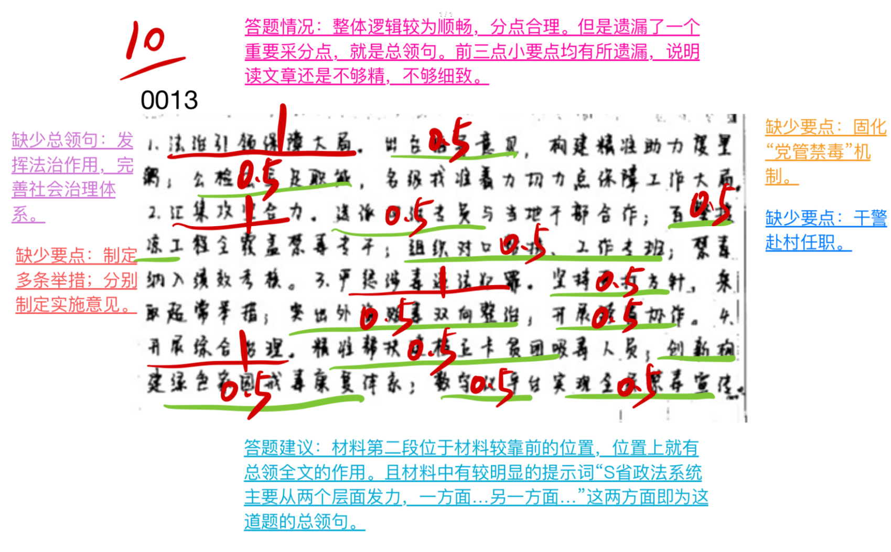
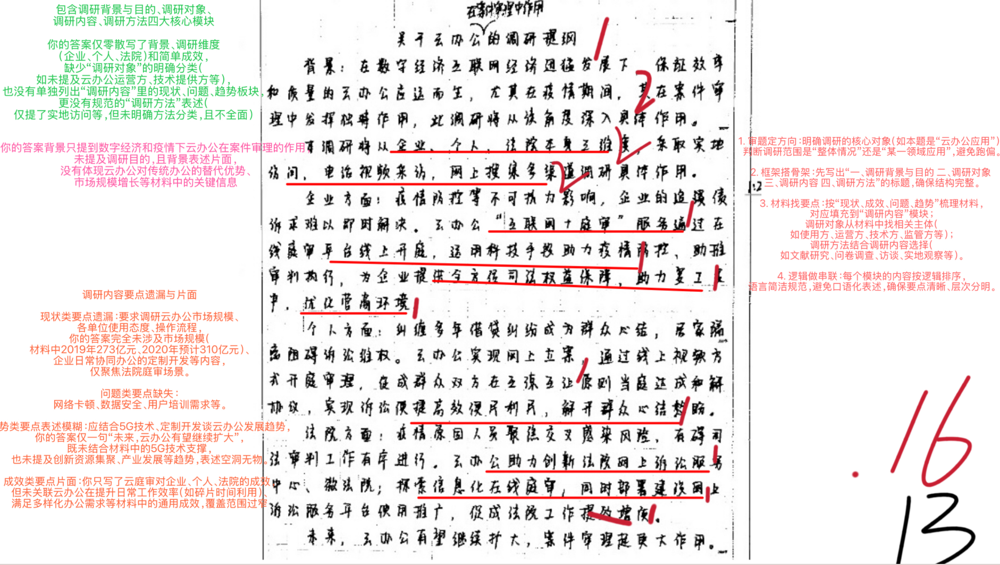
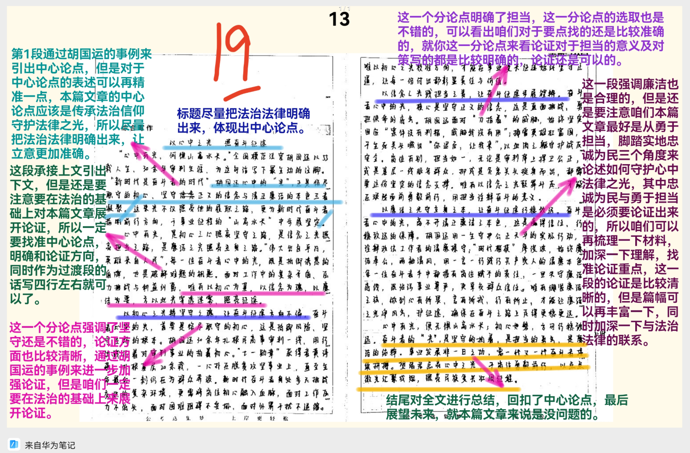

| 昵称    | Y0ungK1ng |
| ----- | --------- |
| Q1得分  | 10        |
| Q2得分  | 15        |
| Q3得分  | 16        |
| Q4得分  | 19        |
| 总分    | 60        |
| 平均分   | 56        |
| 排名    | 233       |
| 总提交人数 | 1354      |

###  **一、效应概括题**::noto:banana::

| 得分  | 总分  | 区间  |
| --- | --- | --- |
| 10  | 15  | 中   |

::: tip

:::

::: card title="题干" icon="noto:backhand-index-pointing-right-dark-skin-tone"

**一、请根据“给定资料1”，指出S省政法机关的扶贫措施办法(15分)。**

要求: (1) 全面、准确、有条理; (2) 不超过250字。
:::

::: card title="答题" icon="twemoji:astonished-face"

:::

::: card title="答案" icon="typcn:tick-outline"

**集梦**：

发挥法治作用，完善社会治理体系。1、制定意见。出台指导意见，制定多条举措；各部门立足职能职责，分别制定实施意见。2、汇集合力。开展“四治” ，实施百警援凉，对口帮扶，组成专班，固化“党管禁毒”机制。3、严惩犯罪。坚持严打，突出双向整治，干警赴村任职，开展跨省协作。4、综合治理。帮扶贫困吸毒人员，组织培训，安排就业；创新构建戒毒康复体系，树立正确理念；推行科学治理方式，建成线上平台，开展校园、农村禁毒宣传工程。

:::

::: card title="反思与建议" icon="line-md:compass-loop"

遗漏总领句

遇到字数紧张题，找重点具体措施，太宏观的不要浪费字数。

:::

::: card title="总结答案" icon="typcn:tick-outline"

**Y0ungK1ng**：

发挥法治引领，完善社会治理体系。
1、制定意见。出台指导意见，制定具体举措；公检法立足职能职责，分别制定实施意见。2、汇集合力。开展“四治”合作 ，实施百警援凉，对口帮扶，组成专班，固化“党管禁毒”机制。3、严惩犯罪。坚持严打，突出双向整治，干警赴村任职，开展跨省协作。4、开展综合治理。帮扶贫困吸毒人员，组织培训，安排就业；创新构建戒毒康复体系，树立正确理念；推行科学治理方式，建成数字化平台，开展禁毒宣传。

:::

###  **二、原因概括题**::noto:banana::

| 得分  | 总分  | 区间  |
| --- | --- | --- |
| 15  | 20  | 高   |

::: card title="题干" icon="noto:backhand-index-pointing-right-dark-skin-tone"

**二、根据“给定资料2”，试分析为什么说“国家安全教育不仅是每个人的必修课，也是每个人的常修课”?(20分)**

要求：(1)观点明确；(2)准确全面、条理清晰；(3)不超过300字。

:::

::: tip

:::

::: card title="答题" icon="twemoji:astonished-face"

:::

::: card title="答案" icon="typcn:tick-outline"

**集梦**：

加强国家安全教育关乎国家安全和每个个体利益，原因有：

1、事实情况复杂。当前我国国家安全内涵和外延更丰富，时空领域更宽广，内外因素更复杂。

2、利于国家治理。有利于我党治国理政、落实总体国家安全观，建立一体化的国家安全体系。

3、利益范围极广。国家安全是安邦定国的重要基石，关乎国家兴亡；且不只和安全部门有关，关系到每个个体利益。

4、增强民众意识。利于法律普及，增强全党全国人民国家安全意识，形成维护国家安全的强大合力。

:::

::: card title="反思与建议" icon="line-md:compass-loop"

:::

::: card title="总结答案" icon="typcn:tick-outline"

**Y0ungK1ng**：

加强国家安全教育关乎国家安全和每个个体利益，原因有：

1、事实情况复杂。当前我国国家安全内涵和外延更丰富，时空领域更宽广，内外因素更复杂。

2、利于国家治理。有利于我党治国理政、落实总体国家安全观，建立一体化的国家安全体系。

3、利益范围极广。国家安全是安邦定国的重要基石，关乎国家兴亡；且不只和安全部门有关，关系到每个个体利益。

4、增强民众意识。利于法律普及，增强全党全国人民国家安全意识，形成维护国家安全的强大合力。

:::

###  **三、公文写作题**::noto:banana::

| 得分  | 总分  | 区间  |
| --- | --- | --- |
| 16  | 25  | 中   |

::: warning

:::

::: card title="题干" icon="noto:backhand-index-pointing-right-dark-skin-tone"

**三、云办公发展迅速，现在计划对云办公的资料进行汇总整理。请根据“给定资料3”的调研资料，撰写一篇关于云办公的调研提纲。(25分)**

要求：(1)内容全面、具体可行、条理清晰；(2)不超过500字。

:::

::: card title="答题" icon="twemoji:astonished-face"

:::

::: card title="答案" icon="typcn:tick-outline"

**集梦**：

云办公应用调研提纲

一、调研背景与目的：云办公兴起，在多领域广泛应用，为深入了解其具体应用，开展此次调研，旨在明晰应用现状、成效、问题与趋势，为云办公的优化与推广提供支撑。

二、调研对象：1.H区、A县、C区人民法院等云办公技术使用方；2.云办公运营方及相关工作人员。

三、调研内容

（一）应用现状：1.了解云办公市场规模；2.了解各单位对云办公使用的态度；3.了解各部门使用云办公的具体操作流程和手段。（二）应用成效：1.了解云办公对工作效率的提升情况，如对比云办公前后案件审理时长的变化；2.调查当事人对云庭审公正性、便捷性的满意度；3.了解云庭审对企业营商方面的积极影响。（三）存在问题：1.了解网络卡顿、数据安全隐患、系统兼容等问题；2.掌握用户熟练程度与培训需求。（四）发展趋势：1.了解云办公在定制开发方面的技术创新；2.结合5G等技术，云办公在各领域的创新应用。

四、调研方法：1.文献研究梳理资料；2.问卷调查收集数据；3.访谈调研获取深度见解；4.实地观察提供实证。

**豆包**：

关于云办公发展情况的调研提纲

一、调研背景与目的

背景：云办公行业规模持续扩大，混合办公成主流趋势，同时面临模式转型与安全等挑战。目的：全面摸清云办公发展现状，找准痛点与短板，为行业高质量发展提供决策依据。

二、调研内容

1. 行业基础：云办公指数走势、总市值等核心数据；企业及员工对云办公的接纳度与依赖度。2. 应用现状：不同规模企业（重点中小企业）使用场景（如线上会议）、频次及核心需求；主流解决方案的应用效果。3. 趋势特征：混合办公推行情况及对企业管理、员工福利的影响；“超时空办公”相关技术（如机器人）应用进展。4. 问题瓶颈：企业成本控制、数据安全、员工协作效率等问题；政策与服务支撑短板。

三、调研对象

云办公服务提供商、大中小型企业（含专精特新企业）、职场员工（重点Z世代）、行业专家及相关政策制定部门。

四、调研方法

1. 文献研究：梳理云办公行业报告、指数数据及趋势白皮书等资料。2. 问卷调查：面向企业及员工设计问卷，收集使用情况、需求及痛点数据。3. 访谈调研：与企业负责人、员工、行业专家及服务商深度交流。4. 实地观察：走访企业办公现场，了解云办公实际落地情况。

五、调研步骤与要求

步骤：前期资料收集→问卷与访谈设计→开展实地调研→数据整理分析→形成调研报告。要求：内容真实准确，样本具代表性，重点突出，结论可行。

:::

::: card title="反思与建议" icon="line-md:compass-loop"

:::

::: card title="总结答案" icon="typcn:tick-outline"

**Y0ungK1ng**：

云办公应用调研提纲

一、调研背景与目的：云办公兴起，在多领域广泛应用，为深入了解其具体应用，开展此次调研，旨在明晰应用现状、成效、问题与趋势，为云办公的优化与推广提供支撑。

二、调研对象：1.H区、A县、C区人民法院等云办公技术使用方；2.云办公运营方及相关工作人员。

三、调研内容

（一）应用现状：1.了解云办公市场规模；2.了解各单位对云办公使用的态度；3.了解各部门使用云办公的具体操作流程和手段。（二）应用成效：1.了解云办公对工作效率的提升情况，如对比云办公前后案件审理时长的变化；2.调查当事人对云庭审公正性、便捷性的满意度；3.了解云庭审对企业营商方面的积极影响。（三）存在问题：1.了解网络卡顿、数据安全隐患、系统兼容等问题；2.掌握用户熟练程度与培训需求。（四）发展趋势：1.了解云办公在定制开发方面的技术创新；2.结合5G等技术，云办公在各领域的创新应用。

四、调研方法：1.文献研究梳理资料；2.问卷调查收集数据；3.访谈调研获取深度见解；4.实地观察提供实证。

:::

###  **四、大写作**::noto:banana::

| 得分  | 总分  | 区间  |
| --- | --- | --- |
| 19  | 40  | 中1  |

::: tip

:::

::: card title="题干" icon="noto:backhand-index-pointing-right-dark-skin-tone"

**四、胡国运同志的先进事迹感动了全国政法系统，他所说的“心中有光，何惧山高水长”意味深远。请根据“给定资料5”，结合对这句话的理解，联系实际，自选角度，自拟题目，写一篇文章。(40分)**

要求：(1)观点明确，见解深刻；(2)思路清晰，语言流畅；(3)结合“给定资料”，但不拘泥于“给定资料”; (4) 字数1000~1200字。

:::

::: card title="答题" icon="twemoji:astonished-face"

:::

::: card title="答案" icon="typcn:tick-outline"

**集梦**：

传承法治信仰 守护“法律”之光

他主审标的3亿余元的国有企业纠纷案时，面对各种关系施压，坚持顶住压力，秉公办案；他审理大气污染纠纷案时，面对“鉴定不能且不好处理” ，打开思路，敢想办法；他生命定格的刹那，仍然手抚案卷，心系群众，他就是始终一身正气、一尘不染的“铁面法官”胡国运。作为新时代下的公安干警，应该传承胡法官的法治信仰，用自身实际行动来守护“法律”之光。

传承法治信仰，用勇于担当守护心中“法律”之光。当前，百年变局和世纪疫情相互叠加，我国经济社会发展面临的环境复杂严峻，公安机关维护安全稳定的任务艰巨繁重，非常之时召唤非凡担当。疫情期间，公安民警将将遏制疫情蔓延扩散的责任担在肩上，主动要求到疫情防控一线工作，积极参与各项疫情防控工作，用实际行动扛起抗疫使命担当。勇于担当是一名公安干警干事创业的重要保障，是恪守为民初心的根基。在时代的召唤下，更应该压实工作责任，强化担当意识，这样才能传承好法治信仰，守护心中的“法律”之光。

传承法治信仰，用脚踏实地守护心中“法律”之光。习总书记曾说过： “只要有坚定的理想信念、不懈的奋斗精神，脚踏实地把每件平凡的事做好，一切平凡的人都可以获得不平凡的人生，一切平凡的工作都可以创造不平凡的成就。”作为一名公安干警，要想守护心中“法律”之光，必须要有脚踏实地、久久为功的精神，将法治信仰贯彻到实际工作中去。年轻一代警员不缺热情、不缺创造力，也不缺情怀，我们更应该学会的是深入基层，脚踏实地了解群众的诉求，让群众在家门口就能感受到安全感，用脚踏实地守护心中的“法律”之光。

传承法治信仰，用忠诚为民守护心中“法律”之光。儋州公安特警铁骑队员陶俊杰冒雨抵达孕妇家中，为正在隔离的孕妇取生活物资；河南省舞钢市公安局交警大队张卫东见一位老人晕倒在道路旁边，一直守护在老人身边并观察老人身体状况，直到120急救到来......像这样的好事每天都在上演着，无数公安干警赤胆忠诚、无私无畏、勇于奉献，用实际行动诠释了对党和人民群众的无限忠诚。新时代下，我们公安干警更应该以群众需求为导向，牢固树立群众利益无小事的理念，用心用情用力帮助群众解决实际困难，把新时代公安工作做到群众的心坎上。

凛然英雄气，激荡天地间。追随和传承是对楷模最好的致敬缅怀，胡法官用行动诠释了勇于担当的含义、对法治事业的无限热爱，守护了心中的“法律”之光。我们要深情传颂他的感人事迹，大力学习他的的崇高精神，勇于担当，脚踏实地，忠诚为民，不忘初心、踔厉奋发，让“法律”之光永远光芒四射！

:::

::: card title="总结答案" icon="typcn:tick-outline"

**Y0ungK1ng**：
  
# 以心中之光 照法治征途

## —— 解码胡国运精神的时代践行密码

“心中有光，何惧山高水长。” 全国模范法官胡国运用 55 载人生、30 余年司法生涯，为这句话写下最生动的注脚。他在威胁恐吓前坚守底线，在平凡岗位上守护公正，用生命诠释了政法工作者的忠诚与担当。习近平总书记强调 “法治建设需要一代又一代人接续奋斗”，胡国运心中的 “光”，正是法治信仰、为民初心与廉洁本色的凝聚。这束光不仅照亮了他的履职之路，更为新时代政法工作者指明了前行方向，让我们在法治建设的 “山高水长” 中步履坚定。

心中有光，是信仰之光照亮前行方向，是初心之光照暖群众心田，是廉洁之光照亮清白本色。 “法治的权威源自人民的内心拥护和真诚信仰”，政法工作者心中的 “光”，既是抵御诱惑的盾牌，也是破解难题的钥匙。面对司法实践中的复杂矛盾、利益纠葛与风险挑战，唯有以信仰为基、以民为本、以廉为要，才能让这束光穿透迷雾、照亮征途。具体而言，需从三个维度践行：以信仰之光铸忠诚之魂，以初心之光践为民之责，以廉洁之光守立身之本。

### 以信仰之光铸忠诚之魂，让法治征途方向不偏

政法工作者心中的光，首要是对法治的绝对信仰，这是抵御风险、坚守立场的根本。胡国运面对当事人 “用刀指着” 的威胁，始终坚定回应 “案件没判错，威胁我没有用”，正是源于对法律尊严的绝对忠诚。武汉交警蒋仲超在执法中为保护学生，被醉驾司机顶在引擎盖上冲行 600 余米仍坚守岗位，用生命诠释了对法治事业的信仰今日头条。新时代政法工作者身处多元利益交织的复杂环境，更需将法治信仰融入血脉，面对权钱诱惑不低头，面对人情干扰不妥协，面对威胁恐吓不退缩。唯有以信仰之光校准方向，才能在法治建设的漫长征途中始终坚守正道，让每一次执法司法都彰显法律权威。

### 以初心之光践为民之责，让法治征途暖意融融

政法工作者心中的光，核心是为民服务的赤子初心，这是司法工作的价值归宿。胡国运 30 余年如一日，在每起案件中都注重保护群众利益，让公平正义直达人心。山东检察官刘玲 23 年办理案件 2000 余件，通过 “绿色通道” 为农民工追回欠薪，用司法温情让群众感叹 “法律确实管用”人民网。政法工作本质上是群众工作，无论是化解邻里纠纷，还是守护公平正义，都要始终把群众利益放在首位。新时代政法工作者应主动延伸服务触角，像胡国运那样在细节中彰显公正，像刘玲那样在办案中传递温度，让群众在每一个司法案件中都感受到公平正义，让初心之光温暖法治征途的每一个角落。

### 以廉洁之光守立身之本，让法治征途行稳致远

政法工作者心中的光，离不开廉洁自律的清白本色，这是赢得信任、树立权威的保障。胡国运一生坚守清正廉洁，用 “一生守护公正天平” 的实际行动，诠释了政法工作者的清廉操守。银川民警杨春华从警 37 年，岗位辗转却始终生活极简、铁面无私，用一生践行 “为党的事业拼命” 的誓言今日头条。政法工作者手握司法权、执法权，一旦失守廉洁底线，不仅会玷污法治的尊严，更会伤害群众的信任。唯有像胡国运、杨春华那样，时刻绷紧廉洁之弦，做到心有所畏、言有所戒、行有所止，才能让廉洁之光净化风气、护航征途，确保权力始终在阳光下运行，让法治建设的根基更加牢固。

心中有光，便无惧山高水长；初心如磐，方可行稳致远。胡国运同志的先进事迹告诉我们，政法工作者的 “光”，是信仰的坚定、是为民的热忱、是廉洁的纯粹。习近平总书记强调 “遵道而行，但到半途须努力”，法治建设非一日之功，需要一代又一代政法工作者接续奋斗。让我们以胡国运为榜样，点亮心中的信仰之光、初心之光、廉洁之光，在法治建设的征途中勇毅前行，用忠诚、担当与奉献，让这束光汇聚成法治中国的璀璨星河，照亮民族复兴的壮阔征程。

:::

