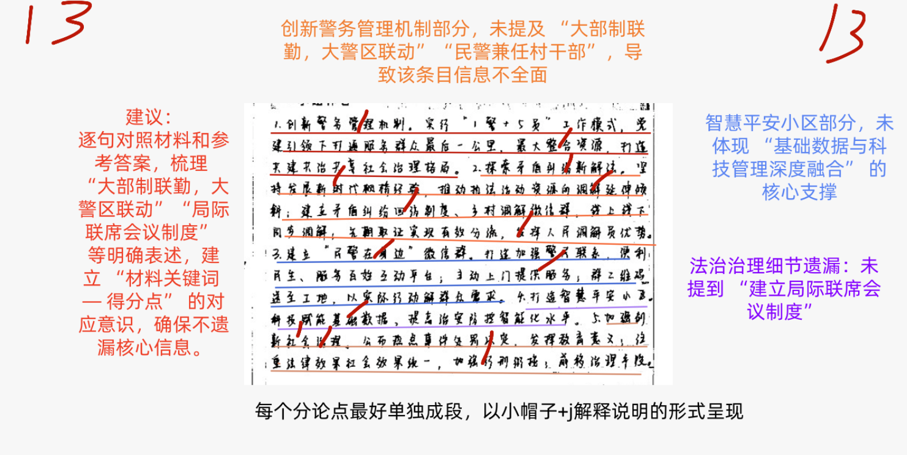
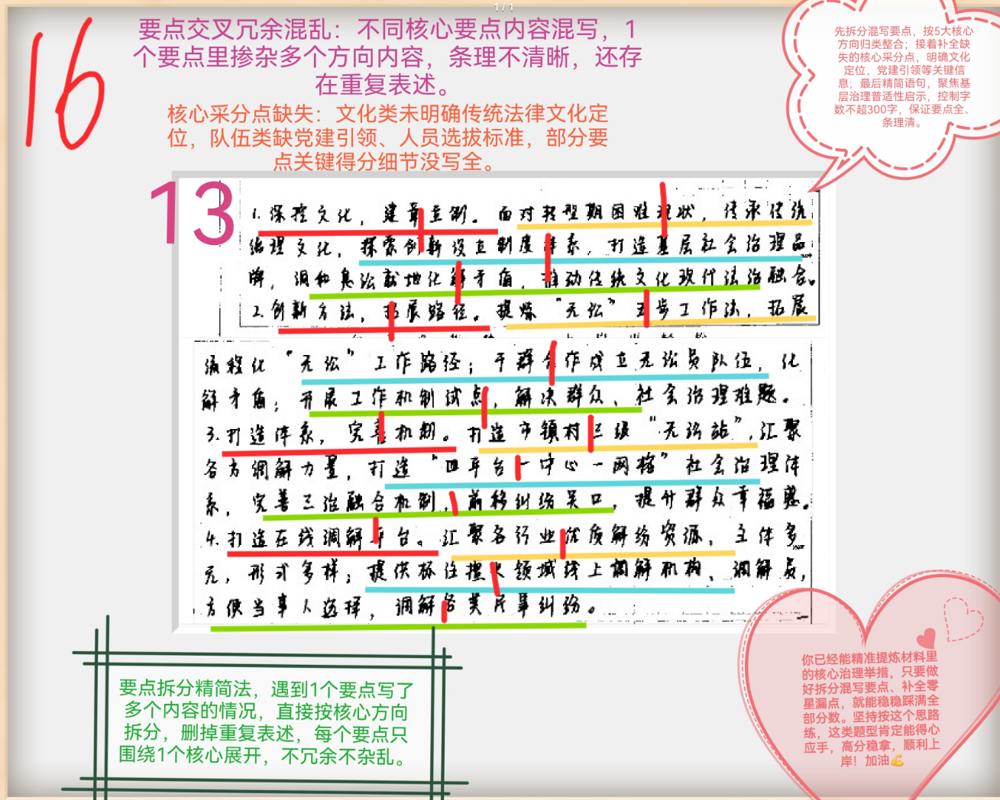
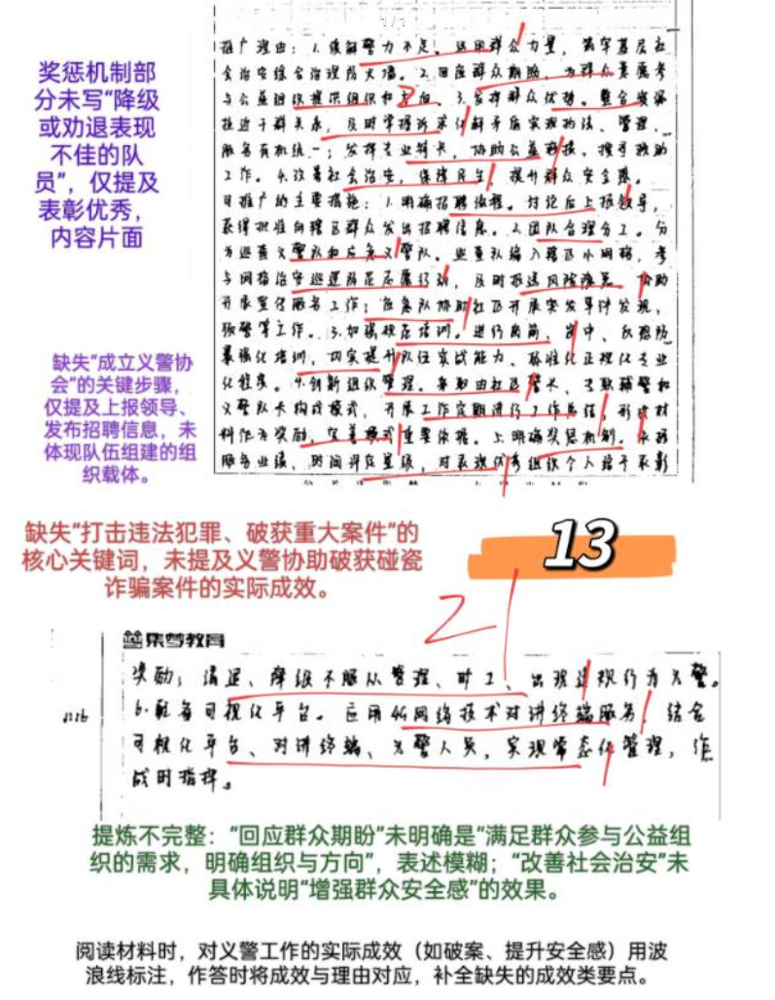
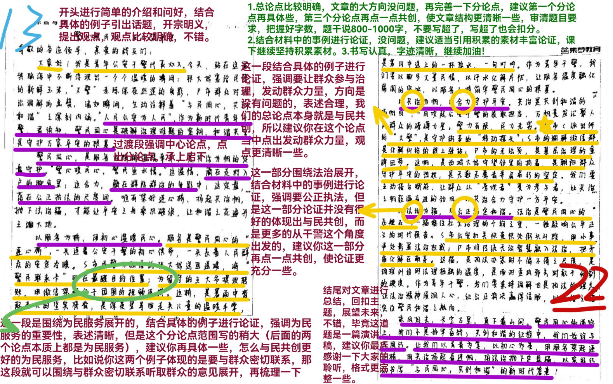

| 昵称    | Y0ungK1ng |
| ----- | --------- |
| Q1得分  | 13        |
| Q2得分  | 16        |
| Q3得分  | 21        |
| Q4得分  | 22        |
| 总分    | 72        |
| 平均分   | 57        |
| 排名    | 19        |
| 总提交人数 | 1160      |

###  **一、做法概括题**::noto:banana::

| 得分  | 总分  | 区间  |
| --- | --- | --- |
| 13  | 15  | 高   |

::: tip

:::

::: card title="题干" icon="noto:backhand-index-pointing-right-dark-skin-tone"

**（一）根据“给定资料1” ，概括S市公安机关在加强社会治安综合治理方面的主要做法。（15分）**

要求：全面、准确、有条理。不超过300字。

:::

::: card title="答题" icon="twemoji:astonished-face"

:::

::: card title="答案" icon="typcn:tick-outline"

**集梦**：

1. 创新管理机制。(1)实行“大部制联勤，大警区联动” 、 “1警+5员”模式/创新警务模式(1)，党建引领(1)，民警兼任村干部。

2. 注重矛盾调解。(1)践行“枫桥经验” ，树立调解理念(1)，推动执法活动、资源倾斜，利用接处警就地调解矛盾，建立回访制度；做“专”调解队伍，(1)建立微信群，线上线下调解。

3. 加强警民联系。(1)建立微信群，邀请住户入群，坚持“民需警应”(1)；为群众联系相关部门，上门为弱势群体服务(1)，为外来务工人员办理暂住登记。

4. 智能管理社区。(1)融合基础数据与科技管理(1)，建设智慧平安小区(1)，实现治安防控智能化。

5. 确立法治标准。(1)统一法律与社会效果，加强刑事、行政处罚衔接，依法处理违法“小事”(1)；建立局际联席会议制度(1)，就突出问题提出建议。

（每条3分，可不写“帽子”形式，但是关键词要踩分）

**忠政**：

1. 创新工作模式。建立“大部制联勤，大警区联动”警务管理机制，党建引领实行“1 警+5 员”工作模式，民警兼任村干部。
2. 发展枫桥经验，探索矛盾纠纷新解法。树立“调解也是执法”理念，矛盾纠纷化解在一线；建立回访制度；建立“调解微信群”，做“专”调解队伍。
3. 提供便民服务。建“民警在身边”微信群，民需警应，二维码送到工地；主动联系相关部门，上门为孤寡老人等提供服务。
4. 建设智慧平安小区。高清视频、智能门禁，人员信息全采集、平台数据全共享，治安防控智能化。
5. 坚持依法治理。加强刑行衔接，违法“小事”依法严肃处理；手段前移，多部门共建局际联席会议制度，及时提出建议。

:::

::: card title="反思与建议" icon="line-md:compass-loop"

抓动词，轻意义

:::

::: card title="总结答案" icon="typcn:tick-outline"

**Y0ungK1ng**：

1. 创新警务管理机制。实行“大部制联勤，大警区联动”、“1警+5员”模式，党建引领，民警兼任村干部。
2. 注重矛盾化解。践行“枫桥经验”，推动执法资源向调解倾斜，就地化解矛盾；建立矛盾纠纷回访机制，做专调解队伍，建立“调解”微信群，线上线下调解。
3. 加强警民联系。建立“民警在身边”微信群，做到”民需警应“；主动上门为弱势群体服务，群二维码送至工地，办理暂住登记。
4. 建设智慧平安小区。融合基础数据与科技管理，高清视频、智能门禁、人员信息全采集、平台数据全共享，提升治安防控智能化水平。
5. 坚持依法治理。统一法律与社会效果，加强行刑衔接，依法处理违法小事；建立局际联席会议制度，就突出问题提出建议。

:::

###  **二、原因概括题**::noto:banana::

| 得分  | 总分  | 区间  |
| --- | --- | --- |
| 16  | 20  | 高   |

::: card title="题干" icon="noto:backhand-index-pointing-right-dark-skin-tone"

**二、根据“给定资料2”，请你谈谈P市“无讼”实践为创新基层社会治理提供了哪些启示？（20分）**

要求：分析全面，条理清晰。不超过300字。

:::

::: tip

:::

::: card title="答题" icon="twemoji:astonished-face"

:::

::: card title="答案" icon="typcn:tick-outline"

**集梦**：

（每条4分，红色部分占2分，近似的表达酌情给分。具体要点要具有普适性，不要出现“无讼” ，也要把整个答案，集中在基层治理主题而不是矛盾调解，普适性出现错误的该条扣一半分）

1. “活用”/创新传统法律文化。以传统法律文化为工作理念和导向，创新制度体系及品牌，形成良好氛围，推动传统法律文化与现代法治精神融合。

2. 创新工作方法。创建工作村（社区）、工作室，提炼分步工作方法，拓展问题发现、讨论、处置、监督、评价的工作路径。

3. 加强党建引领。开展治理试点，加强队伍建设，选拔群众基础好、工作能力强的基层干部成立基层治理队伍，开展治理。

4. 创建综合治理体系。普及传统法治理念，打造“平台-中心-网格”体系，完善自治、法治、德治融合机制。

5. 借助科技手段。建设在线治理平台，汇聚各行业优质资源，确保主体多元、形式多样，透明公开、方便群众选择。

**华图**：

一、挖掘传统“无讼”文化精华，创设“调解优先、诉讼断后”制度体系,推广“息事无讼”。

二、推行多级工作制。

1. 市级设“无讼工作中心”,镇级建“无讼工作室”，村级设“无讼站”。
2. 构建整体性的社会治理体系，坚持自治、法治、德治“三治融合”。
3. 将矛盾纠纷预防和化解的关口前移，创建“无讼”村（社区）、成立“息事无讼”工作室，设立“无讼”五步工作法，第一时间化解矛盾纠纷。

三、建立矛盾纠纷多元化机制。

1. 调动党员，发动群众，组建无讼调解员队伍，参与无讼服务。
2. 大力推广运用在线矛盾纠纷多元化解平台，构建形式多样、快速便捷的网上调解。

:::

::: card title="反思与建议" icon="line-md:compass-loop"

:::

::: card title="总结答案" icon="typcn:tick-outline"

**Y0ungK1ng**：

1. 深挖文化，建章立制。传承传统治理文化，创新制度体系与品牌，形成良好氛围，就地调解化解矛盾纠纷，推动传统法律文化与现代法治精神融合。
2. 创新方法，拓展路径。提炼分布工作方法，拓展问题发现、协商、处置、监督、评价工作路径。
3. 党建引领，工作试点。开展治理试点，加强队伍建设，选拔群众基础好，工作能力强干部成立基层治理队伍。
4. 打造体系，完善机制。打造“平台-中心-网格”社会治理体系，完善自治、法治、德治三治融合机制。
5. 打造在线调解平台。汇聚优质资源，提供主体多元，形式多样服务；信息公开透明，方便群众选择。

:::

###  **三、公文写作题**::noto:banana::

| 得分  | 总分  | 区间  |
| --- | --- | --- |
| 21  | 25  | 高   |

::: warning

:::

::: card title="题干" icon="noto:backhand-index-pointing-right-dark-skin-tone"

**三、“给定资料3”中，C派出所的“义警”队伍创建工作成效显著，受到D市公安局的肯定。经研究后，D市公安局决定向全市推广，假设你是该局的一名工作人员，请拟写推广材料中的“推广理由”和“可推广的主要措施”这两部分内容。（25分）**

要求：

（1）紧扣资料，内容具体；

（2）理由充分，措施明确；

（3）条理清晰，语言通畅；

（4）不超过500字。

:::

:::

::: card title="答案" icon="typcn:tick-outline"

**集梦**：

推广理由：

1. 解决警力不足：①运用群众力量，提升基层社会治安综合治理，增强群众安全感；②打击违法犯罪，破获重大案件。（2）

2. 满足群众需求。参与公益组织，明确组织与方向。（2）

3. 整合资源。拉近警民距离，实现执法、管理、服务统一；发挥专业特长，开展公益救援等。（2）

推广措施：

1. 明确招聘流程(1)。商讨方案征得上级部门批准(1)，成立义警协会，向辖区发送招聘信息(1)。

2. 分类精准服务(1)。根据报名者特长及意愿分配至巡查、应急队。巡查队负责网格治安巡逻防范，及时报送问题，协助社区开展宣传服务(1)；应急队协助社区开展突发事件处置(1)。

3. 加强人员培训(1)。开展岗前、岗中、反恐防爆培训(1)，提升实战能力及标准化、正规化、专业化(1)。

4. 细化奖惩机制(1)。根据服务业绩、时间评定星级(1)，表彰优秀组织及个人，降级或劝退表现不佳、不合要求队员(1)。

5. 完善管理模式(1)。创建由社区警长、专职辅警和“义警”队长构成的“1+1+1”模式(1)，有序推进工作，定期进行工作总结(1)，形成材料作为奖励、优化依据。

6. 借助网络技术(1)。配备可视化调度平台(1)，实现“可视化平台、对讲终端、义警人员”有效结合(1)。

:::

::: card title="反思与建议" icon="line-md:compass-loop"

:::

::: card title="总结答案" icon="typcn:tick-outline"

**Y0ungK1ng**：

推广理由是：
1. 缓解警力不足。运用群众力量，筑牢基层治理防火墙。
2. 回应群众==需求==。为群众参与公益活动提供组织和方向。
3. 发挥群众优势。整合资源拉近干群关系，及时掌握群众诉求实现执法、管理、服务有机统一；发挥群众专业特长，协助完成公益救援、搜寻救助工作。
4. 改善社会治安。干群合作打击违法犯罪，保障民生，提升群众安全感。

可推广的主要措施：
1. 确定招聘流程。商讨方案上报领导，成立义警协会向辖区群众发招聘信息。
2. 团队合理分工。按群众意愿分为巡查队和应急队。巡查队编入辖区网格，参与治安巡逻防范志愿行动，协助社区开展宣传服务工作；应急队协助社区开展突发事件的发现、预警等工作。
3. 加强规范培训。进行岗前、岗中、反恐防暴强化培训，提升队伍的实战力及标准化、正规化、专业化程度。
4. 创新组织管理。采取由社区警长、专职辅警和“义警”队长构成的模式，进行工作总结，形成材料作为奖惩依据。
5. 加强网格服务。根据业绩和时间，降级、清退不服从管理、连续一个月不参加服务或违法违规人员；表彰、奖励优秀的组织和个人。
6. 配备可视化调度平台。利用网络技术，使“可视化平台、对讲终端、义警人员”结合，实现“常态化管理、作战时指挥”。

:::

###  **四、大写作**::noto:banana::

| 得分  | 总分  | 区间  |
| --- | --- | --- |
| 22  | 40  | 中1  |

::: tip

:::

::: card title="题干" icon="noto:backhand-index-pointing-right-dark-skin-tone"

**四、H省拟举行全省公安系统“与民同心 共创和谐”主题演讲比赛。假设你是参赛的“青年公安干警代表”，请你结合给定资料，自拟题目，撰写一份演讲稿。（40分）**

要求：

（1）角色定位准确；

（2）内容切合主题；

（3）语言流畅，有感染力；

（4）字数800～1000字。

:::

::: card title="答题" icon="twemoji:astonished-face"

:::

::: card title="答案" icon="typcn:tick-outline"

**集梦**：

# 一枝一叶总关情 一点一滴见初心

尊敬的领导、亲爱的同事们：

大家好！作为我省一名青年公安干警，非常荣幸能够参与到本次 “与民同心，共创和谐” 主题演讲比赛中。从北京街头的 “西城大妈”“朝阳群众”，到遍布全国各地的平安建设志愿者组织，正是我国 “坚持人民当家作主，发展人民民主，密切联系群众，紧紧依靠人民推动国家发展” 的优势体现。我们清楚地看到，民力无穷，人民群众是公安工作的深厚基础和力量源泉，和谐安全的社会环境需要每一个人来守护。

以民意为导向，把 “听取群众呼声” 作为最准确的 “风向标”。俗话说 “金杯银杯不如老百姓的口碑，金奖银奖不如老百姓的夸奖”，公安干警的初心和使命就是为中国人民谋幸福、为中华民族谋复兴，让人民过上幸福美好的生活。当然，要让老百姓过上幸福、美好的生活，绝不是一句空话，要体现在解决老百姓最关心、最现实、最实际的民生问题上，让老百姓能够得到更多的实惠，让老百姓感受到更多的获得感、安全感和幸福感。

以改革为动力，使 “创新群众服务方法” 成为最有力的 “助推器”。清代理学家提出 “动之以情、晓之以理、喻之以法” 的 “无讼” 理念，被 “活用” 于当下基层社会治理，通过积极探索创新，打造了 “息事无讼” 的基层社会治理品牌，有效解决了 “案多人少”“案结事不了” 等现实困境。“上面千条线，下面一根针”，公安基层工作纷繁复杂，作为新时代公安干警，我们要把握时代脉搏，不断创新工作方法，做好 “老树新枝” 的文章，为创新基层综合治理助力增效。

以民力为根基，用 “警民队伍建设” 编织最严密的 “防火网”。习总书记明确提出 “群众路线是我们党的生命线” 的重要论断，作为公安干警，我们的根基在人民、血脉在人民、力量在人民。一切依靠群众，是我们公安事业不断取得胜利的重要法宝，也是我们始终保持生机与活力的重要源泉。当下，群众参与公益组织愿望强烈，而我们公安工作也面临着警力不足的现实状况，正是通过运用群众的力量，发挥群众的专业特长，实现执法、管理、服务有机统一。

时代是出卷人，我们是答卷人，人民是阅卷人。把与民同心思想贯彻到我们公安工作的方方面面，要永远同人民群众同呼吸、共命运、心连心，欢乐着人民的欢乐，忧患着人民的忧患，向人民交出满意的答卷，谱写新时代人民美好生活的新篇章。我的演讲到此结束，感谢领导、同事们的聆听！

**华图：**

警民同心，其利断金
——“与民同心 共创和谐”主题演讲比赛演讲稿

尊敬的各位领导，亲爱的同事们：

你们好，我是来自XX的XX，很荣幸作为青年公安干警代表参加此次演讲比赛。

从宣誓成为一名人名警察的那一刻起，“服务人民”这四个字就已经深深刻入我们每一个人心中， “密切联系群众，紧紧依靠人民”既是一切工作的出发点和落脚点，也是践行公安责任使命、守护和谐安全社会环境的制胜法宝。

人民警察心系人民，守一方热土、护一方平安。“110”承载着人们心中最大的安全感，而所有公安干警也无愧于人民群众的这份信任：为了做到“民有所需，警有所应”，打开手机，S市每个派出所都建立了“民警在身边”微信群；为了打通服务群众的“最后一公里”，有的基层民警挂职兼任村干部，身兼民警、引导员、服务员、巡防员、调解员、联络员5个角色，既促进地方发展又延伸警务触角。在一言一行中，我们都始终践行着“为人民服务”的初心和使命。

警民同心共治理，凝聚群防群治新力量。人民群众是公安工作的深厚基础和力量源泉，警力有限，而民力无穷：在无讼调解平台、调解微信群中，既有熟悉辖区情况、在群众中有威望的离退休干部、平安书记；又有具备一定法律知识的专业法律工作者，主体多元，形式多样，最大限度把矛盾纠纷就地化解在一线；在日渐壮大的“义警”队伍中，既有热心志愿服务的居民，又有拥有一技之长的专业人士共同协助开展工作，成为我们的左膀右臂。有了群众的协力帮助，公安工作如虎添翼，不断创出新高。

展望明天，警民携手再出发，续写社会和谐新篇章。围绕构建共建共治共享的社会治理格局目标，我们当如何更加紧密地联系群众、更加全面地保护群众、更加周到地服务群众，是我一直思考的问题。随着科学技术的不断发展，公安工作也需要与时俱进，着力提升智能化水平。通过基础数据与科技管理的深度融合，打造智慧平安小区；通过可视化调度平台，迅速定位警情位置，调动周边支援力量……越来越先进智能的科学技术，将为警民携手、警为民需增添新动力。

相信在我们每一位公安干警的努力下，在广大人民群众的支持下，警民同心，汇聚澎湃合力，必将不断增强着人民群众的获得感、幸福感、安全感，助力社会和谐再上新台阶！

:::

::: card title="总结答案" icon="typcn:tick-outline"

**Y0ungK1ng**：
  

:::

# 警心映民心 同心筑平安

尊敬的各位领导、亲爱的战友们：

大家好！我是青年公安干警代表 XXX。今天，站在这里，我脑海中不断浮现出一个个温暖的画面：S 市张大妈塞给民警的新鲜玉米，D 市 “义警” 老陈深夜巡逻的身影，P 市群众对 “无讼” 调解的点赞。这些瞬间，生动诠释了 “与民同心，共创和谐” 的深刻内涵。“人民公安为人民”，作为新时代青年干警，君需知，警民同心是破解治理难题的密钥，和谐共生是守护万家平安的根基。

警民同心，是**服务为桥**的温情牵手，是**共治为帆**的合力远航，是**法治为锚**的定盘守护。“警心暖民心，警民鱼水情”。这温情，藏在走村入户的脚步里；这合力，聚在群防群治的身影中；这定盘，落在公正执法的尺度间。唯有架好连心桥、扬起共治帆、抛下法治锚，才能让平安之舟乘风破浪，让和谐之花遍开三湘大地。

以服务为桥，用初心温暖民心。服务是警民同心的 “连心桥”，一头连着公安干警的初心使命，一头系着人民群众的安危冷暖。S 市民警为独居的张大妈送医送暖，将 “警民联系卡” 贴在最醒目的位置；为留守的王大爷提现转账，用微信架起父子团圆的视频连线。这桥，是暴雨中背起老人的坚实脊背，是深夜里寻回走失儿童的温暖手掌，是寒风中送上的一杯热水、一句叮咛。作为青年干警，我们要以脚步丈量民情，以汗水化解民忧，让服务的温度融化隔阂的坚冰，以服务之桥筑牢警民同心的根基。

以共治为帆，用合力守护平安。共治是共创和谐的 “扬帆风”，一风吹起公安干警的履职担当，万帆竞发汇聚人民群众的磅礴力量。警力有限，民力无穷。D 市 C 派出所的 “义警” 队伍，是守护街巷的 “移动探头”；S 市的 “调解微信群”，是化解纠纷的 “线上驿站”；P 市的 “无讼员”，是基层治理的 “金牌纽带”。这帆，是 “西城大妈” 守望邻里的执着，是 “朝阳群众” 守护平安的热忱，是无数志愿者并肩前行的坚定。我们要主动搭台赋能，让群众从 “旁观者” 变为 “参与者”，让共治之帆鼓满奋进的劲风，以共治合力守护一方平安。

以法治为锚，用公正锚定和谐。法治是警民同心的 “压舱石”，一锚稳住社会治理的千钧之重，一锤敲响公平正义的时代强音。S 市公安机关对街头斗殴事件快查快处，用 “小事严处” 彰显法治权威；P 市将传统 “无讼” 智慧融入现代法治，把矛盾化解在萌芽。这锚，是执法办案时不偏不倚的尺度，是调解纠纷时法理相融的温度，是面对歪风邪气时敢于亮剑的硬度。作为青年干警，我们要秉持 “调解也是执法” 的理念，让法治精神浸润人心，让公正裁决赢得信服，以法治之锚定住警民和谐的航向。

“乘风好去，长空万里，直下看山河”。警民同心的道路上，我们不是孤军奋战；共创和谐的征程中，我们始终与民同行。让我们以青春为笔、以初心为墨，用服务架起连心桥，用共治扬起奋进帆，用法治抛下定盘锚，以实际行动书写 “与民同心，共创和谐” 的新时代答卷！

我的演讲完毕，谢谢大家！