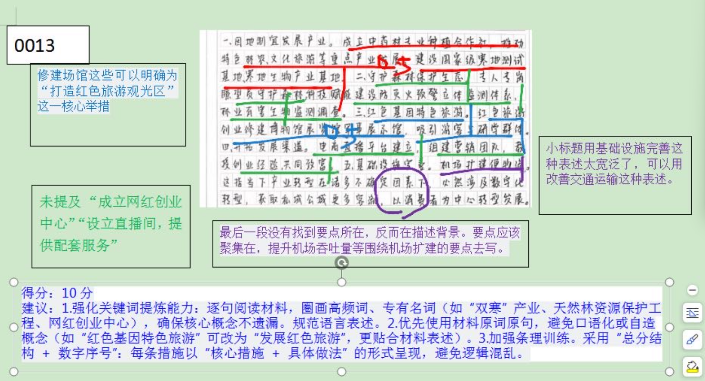
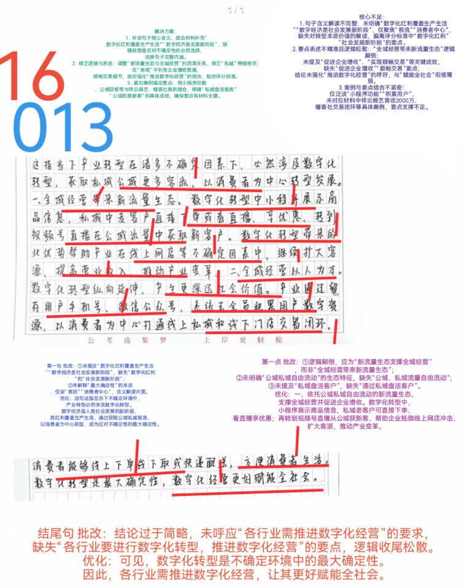
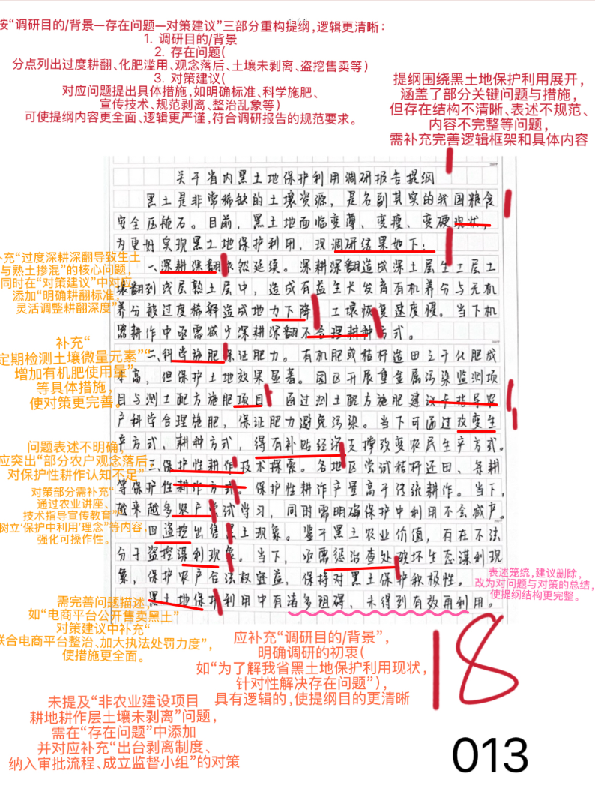
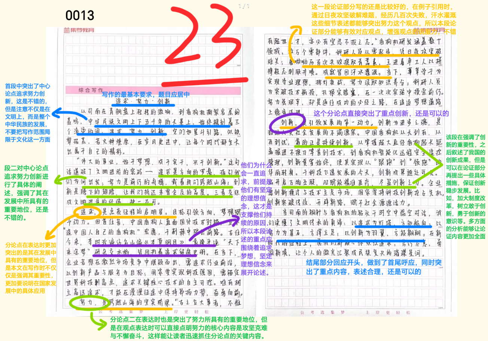

| 昵称    | Y0ungK1ng |
| ----- | --------- |
| Q1得分  | 10        |
| Q2得分  | 16        |
| Q3得分  | 18        |
| Q4得分  | 23        |
| 总分    | 67        |
| 平均分   | 58        |
| 排名    | 97        |
| 总提交人数 | 584       |

###  **一、措施概括题**::noto:banana::

| 得分  | 总分  | 区间  |
| --- | --- | --- |
| 10  | 15  | 中   |

::: danger

讲措施！！第一点明显太多！！

**一、答题内容**

概括安岭林区采取了哪些措施？

\=\=\=》措施：指为解决特定问题或达成目标而采取的具体行动、办法或方案。

技巧：重点抓动词，要点呈现以动宾结构为主！

思考？

发展“双寒”产业   or   发展特色产业  如何选择？理由？

重点记忆：==注重生态保护、完善交通运输==；

词汇拓展：==发展红色旅游、加强电商孵化==。

**二、答题逻辑**

1. 分类是否清晰。本题目作答中按照5条措施进行分类，保证条理清晰；

2. 每条要点衔接（帽子-拓展）是否自然流畅。本题可不写“帽子” ，但是参考答案中“帽子”体现的关键词（如“双寒”产业、红色旅游等）必须概括准确，且与该 条其他具体要点为同一分类。

3. 不同要点的逻辑结构是否清晰合理。本题为“并列”关系，复盘时可思考这种逻 辑顺序是否符合认知规律，是否可以有更优的排列方式；

:::

::: card title="题干" icon="noto:backhand-index-pointing-right-dark-skin-tone"

**一、请根据“给定资料1” ，概括安岭林区为更好实现转型发展采取了哪些措施？ （15分）**

要求：全面、准确、有条理；不超过200字。

:::

::: card title="答题" icon="twemoji:astonished-face"

:::

::: card title="答案" icon="typcn:tick-outline"

1. ==发展“双寒”产业==(1)。发展寒地生物、寒地测试产业(1)，建立基地、合作社，打造新兴产业形态(1)。
2. ==注重生态保护==(1)。实施天然林资源保护工程(1)，完善预警立体监测体系，历代林区人坚守尽责(1)。✔
3. ==发展红色旅游==(1)。打造红色旅游观光区(1)，吸引旅游、研学教育群体(1)。
4. ==加强电商孵化==(1)。成立网红创业中心(1)，设立直播间，提供配套服务，组建营销团队(1)，培训带动新人。✔
5. ==完善交通运输==(1)。扩建机场(1)，扩大吞吐量、起降量(1)，便利百姓出行，拓宽发展通道。

==条理分：1分；若分条混乱，在要点分基础上扣1分=={.warning}

:::

::: card title="反思与建议" icon="line-md:compass-loop"

建议:
1. 强化关键词提炼能力: 逐句阅读材料，圈画高频词、专有名词(如“双寒”产业、天然林资源保护工程、网红创业中心)，确保核心概念不遗漏。规范语言表述。
2. 优先使用材料原词原句，避免口语化或自造概念(如“红色基因特色旅游”可改为"发展红色旅游"，更贴合材料表述)。
3. 加强条理训练。采用"总分结构 +数字序号":每条措施以“核心措施 + 具体做法”的形式呈现，避免逻辑混乱。

:::

###  **二、综合分析**::noto:banana::

| 得分  | 总分  | 区间  |
| --- | --- | --- |
| 16  | 20  | 高   |

::: card title="题干" icon="noto:backhand-index-pointing-right-dark-skin-tone"

**二、 “给定资料2” 中提到“进行数字化转型正在成为不确定环境下的最大确定性” ，请根据“给定资料”谈谈你对这句话的理解。（20分）**

要求：分析全面，条理清晰；不超过300字。

:::

::: danger

首尾！结尾呼吁！

**一、答题内容**

侧重于句子 本意解释 + 分析论证（2个层次），关键词要提炼精准、规范

**二、答题逻辑**

1. 作答思路： 解释（2-3行） - 分析（主体） - 评价（1-2行、分情况省略）

2. 技巧点拨：

	- 1）“总分总”结构：开头点明核心观点（解释/判断），中间多角度分析（可按主  体、时间、空间等维度），结尾总结或提对策。但个别题目可省略结尾，按“总-分”  结构呈现答案。
	- 2）规范表述：语言简洁，避免口语化；200字以上题目建议分条呈现，层次清晰。
	- 3）结合材料：以材料为依据，避免主观臆断，适当引用原文关键词句。

:::

::: card title="答题" icon="twemoji:astonished-face"

:::

::: card title="答案" icon="typcn:tick-outline"

这指在不确定的当下，数字化红利(2)正覆盖我们生产生活，数字经济是社会发展的新阶段(2)，推动全域经营，产生深远社会价值，促进社会进步(2)。体现在：

1. 依托新流量生态(1)，促进企业增收。公域、私域流量自由流动(1)，借助视频号直播等从公域寻找新客户(1)，利用小程序、公众号等进行私域用户积累(1)，通 过私域带货(1)，盘活客户(1)。
2. 以人为本(1)，提升服务水平。小程序提供商品信息、展示视频、商品搭配(1)，客户看直播、享优惠(1)，线上下单(1)，打通线上私域和线下门店的交易闭环(1)，实现顺畅交易(1)。

因此，各行各业要进行数字化转型，推进数字化经营，更好赋能全社会(2)。

:::

::: card title="反思与建议" icon="line-md:compass-loop"

结尾句

**批改:**

结论过于简略，未呼应“各行业需推进数字化经营”的要求缺失“各行业要进行数字化转型，推进数字化经营”的要点，逻辑收尾松散。

**优化:**

可见，数字化转型是不确定环境中的最大确定性。因此，各行业需推进数字化经营，让其更好赋能全社会。

:::

###  **三、公文写作题**::noto:banana::

| 得分  | 总分  | 区间  |
| --- | --- | --- |
| 18  | 25  | 中   |

::: tip
一、答题内容

1. ==背景、问题、建议==  三部分、缺一不可
2. 建议具有一定的开放性，考生能根据问题提出行之有效的对策皆可酌情赋分，但 是要保证建议能解决所有问题、不得遗漏；

二、答题逻辑

1. 任务：提纲——概括性的结构框架或要点罗列，用于整理和呈现内容的核心脉络。
2. 格式：标题 + 正文，其中正文包含背景、问题、建议三部分，前缀词（背景、问 题、建议）可写可不写，不写的话需要用过渡句做好三部分内容的衔接。
3. 建议分类逻辑不唯一，保证分类清晰、层次清楚。
4. 格子紧张情况下，所有类型的提纲结尾均可省略（发言类提纲建议保留1-2行结尾）

:::

::: card title="题干" icon="noto:backhand-index-pointing-right-dark-skin-tone"

**三、假如你是省调研组成员，请根据“给定资料3”，撰写一份调研报告提纲。（25分）**

要求：

（1）符合调研报告的写作要求；

（2）准确简明，条理清晰；

（3）不超过500字。

:::

::: card title="答题" icon="twemoji:astonished-face"

:::

::: card title="答案" icon="typcn:tick-outline"

  <h4>关于M省黑土地保护利用情况的调研报告提纲（1）</h4>

**一、调研目的/背景**：黑土是非常稀缺的土壤资源，受各因素影响，部分地方的黑土地变薄、变瘦、变硬(2)。为了解我省各地对黑土地的保护利用情况，特派出调研组调研(2)。

**二、存在问题**：
1. 过度深耕深翻，造成地力下降，生土与浅层掺混(1)；
2. 过量使用化肥，加剧黑土地 退化，产生化肥污染(1)；
3. 部分农户不遵循保护性耕作原则，技术探索中观念落后(1)。
4. 大量非农业建设项目所占耕地的耕作层土壤未剥离(1)。
5. 不法分子盗挖黑土出售，电商公开售卖黑土(1)。

**三、对策建议：**
1. 明确耕翻标准。加大农机研发力度，借助剖面观察等实验，深耕深翻过程中针对不同土地灵活调整 耕翻深度。 (3)
2. 科学合理施肥。开展污染监测项目和测土配方施肥项目，定期检测微量元素，指导农户施肥；提供 专项补贴，增加有机肥使用量。 (3)
3. 注重保护性耕作。借助农业讲座、专业指导等方式进行宣传教育，提升农户保护性耕作技术，转变 传统观念，树立“在保护中利用”的理念。 (3)
4. 确保土壤剥离。出台耕作层土壤剥离制度，纳入用地审批流程；成立专项监督小组，定期剥离情况进行检查，督促施工方及时剥离，违者加大处罚力度。 (3)
5. 整治市场乱象。加大执法力度，联合相关部门，对接电商平台，对盗挖、售卖黑土的不法分子进行约谈，按规处罚。 (3)  

==注意：对策按照宣传/资金/执法/指导/制度等方面分类也可，酌情赋分==

:::

::: card title="反思与建议" icon="line-md:compass-loop"
- **不足及改进** 
	- **1.格式与标题规范改进**： 
		- **问题**：标题 “关于 15 分钟文化服务圈 ' 建设情况的提报” 表述正确，但内容呈现上，层级序号混乱 (未清晰用 "一、二、(三)"1.2.3."区分大标题与内容要点)，部分内容排版零散 (如" 文化点单 "…" 建设情况，未归整到单独列出板块)，影响提报条理性。  
		- **改进**：规范序号层级，如政府科学统筹规划→1. 政府一、建设情况规划…2. 盘活非遗体验基地…"; 将" 共享文化服务 "板块下内容归整到" 城乡均等化 " 等专门化服务子项，让框架更清晰。
	- **2.要点提炼精准度问题**：
		- **问题**：对材料概括存在冗余（如 "整体布局有章可循，制定公共服务阵地分布原则…" 表述啰嗦）、关键要点遗漏（未提及 "建设文化馆总分馆制"）、表述宽泛（如 "制定公共文化服务阵地分布原则、建设标准和验收规则" 表述笼统）、表意模糊（如 "展示文化新服务"" 小橙序创新展播群众…"未清晰说明" 文化点单 ""文化馆总分馆" 等信息）、逻辑混乱（"一站式呈现" 核心功能未说清）问题。  
		- **改进**：用 "措施 + 效果" 精准概括，如政府构建文化服务阵地为 "制定科学规划（如 ' 政府科学统筹规划 ' 提炼为 ' 制定科学规划 ' ）"" 限定次序、建设标准和验收规则（如 ' 制定公共文化服务阵地分布原则、建设标准和验收规则 ' 提炼为 ' 规范建设标准与验收流程 ' ）"；补充" 建设文化馆总分馆制（如 ' 集约化图书馆群 ' ）""无人机柜及检索屏（如 ' 无人配送站点布局 ' ）"" 建设标准和验收规则（如 ' 培育集约化图书馆群，工作有声有色 ' ）""精准投放（如 ' 结合文化标签与路线科学设置 ' ）" 等要点，确保覆盖所有建设维度。
- **优点相关**：
    - 1. **框架搭建**：能构建 "背景 - 建设情况 - 成效" 的基本框架，围绕 "15 分钟文化服务圈" 建设的整体布局、实践路径、成效展开，有公文提报的材料选取意识，尝试从各村镇内容支撑各板块。  
	- 2. **要点关联**：提及 "整合布有机动 (含无人配送站点)" 小橙序服务 ""盘活非遗基地"" 建设文化圈共享优质资源 " 等小服务惠内容，体现建设要点，努力关联材料要实现对文化圈建设内容的梳理。
- **公文提报学习建议相关**：
    - 1. **模板深化与仿写**：牢记 "标题 + 背景 + 措施 + 建设情况（分维度）+ 成效" 标准模板，每天仿写 1 篇提纲，重点练习框架构建与要点提炼，通过模仿优秀答案的逻辑与表述，提升答案规范性。  
	- 2. **材料精读与概括**：逐段分析材料，标记措施、效果、背景、成效关键词，用 "规范词库"（如 "统筹规划、激发文化活力、数字赋能、精准滴灌、提升效能" ）转化表述，确保要点完整、逻辑清晰。  
	- 3. **复盘修正与积累**：完成提报后，对照参考答案从框架、要点、逻辑、语言维度细致复盘，总结失分原因并分类整理（如要点遗漏、逻辑混乱 ），形成错题本；定期复习错题，强化薄弱点。  
	- 4. **模拟应用巩固**：选取不同主题申论材料，限时（如 20 分钟 ）练习拟写提报，严格按照格式要求，强化 "快速构建框架、精准提炼要点、规范语言表达" 的能力，提升应试水平。
:::

###  **四、大写作**::noto:banana::

| 得分  | 总分  | 区间  |
| --- | --- | --- |
| 23  | 40  | 中   |

::: danger

:::

::: card title="题干" icon="noto:backhand-index-pointing-right-dark-skin-tone"

**四、深刻理解“给定资料4” ，以“追求 ·努力 ·创新”为题目，联系实际自选角度写一篇文章。 （40分）**

要求：

（1）观点明确，见解深刻；

（2）思路清晰，语言流畅；

（3）1000-1200字。

:::

::: card title="答题" icon="twemoji:astonished-face"

:::

::: card title="答案" icon="typcn:tick-outline"

- 立意：中国制造=》追求 ·努力 ·创新

中国制造 上升到 国家发展、事物发展等话题也可以

分论点：

- 追求——追逐梦想、坚定信念
- 努力——攻坚克难、不懈奋斗
- 创新——勇于创新、敢为人先

  <h4>追求 ·努力 ·创新
</h4>

从载人航天到“蛟龙”入海，从C919国产大飞机到高铁复兴号，从华为的鸿蒙系统到小小圆珠笔尖，从仰望太空到俯瞰大地，从大型装备到核心零部件，我国制造业创新实现了从“跟跑”到“并跑”再到“领跑”的华丽转身。中国 制造，步履铿锵。制造业水平的高低是衡量一个国家综合实力的重要标志，是高质量发展的必然选择，唯有把握好追求、努力、创新三要素，方能助力中国制造向更高更强的新台阶迈进。

  

追求意味着追逐梦想、坚定信念。追求，能够照亮我们前行的路，引领我们前行。更为关键的是，追求梦想、坚定信念的过程，是一个漫长且艰难的过程，是披荆斩棘的过程。“造中国人自己的盾构机”这一梦想和追求，让我们 能够十年如一日探索与努力，不断突破核心技术，实现从无到有的转变；红军为什么能够在极其艰难的条件下胜利完成长征？一个至关重要的因素就在于红 军拥有解放全国人民的崇高理想信念，同时为了建立新中国这个伟大梦想，这是红军长征胜利的力量源泉。由此可见，坚持梦想和信念无论是对于个人还是国家都是至关重要的。

  

努力意味着攻坚克难、不懈奋斗。大江奔流永无止境，大浪淘沙沉者为金，
大道至简奋斗为先。社会主义是干出来的，更是不畏艰难、拼搏奋斗出来的。 比如，中国盾构机核心技术的突破，源于一代代科学技术专家不惧艰难，反复 研究盾构机改进的技术瓶颈并努力逐一突破，最终让我们成为国际盾构机的 “领路人”。新时代是奋斗者的时代。民族复兴行进至关键一程，犹如河入峡 谷、风过隘口、山登半腰，正值紧要之时，所以更要不驰于空想、不骛于虚声， 不以事艰而无为，只因任重而奋行。

  
创新意味着勇于开拓、敢为人先。党的二十大提到，创新是现如今社会发展的重要推动力，没有创新，一切发展都将失去生命力。马太效应告诉我们， 强者越强，弱者越弱。而当下制约我们发展的重要一环就是创新能力的缺少和 欠缺。创新是国家发展的动力与源泉，创新强则国家强，经济的腾飞离不开创 新。所以说，一方面国家必须要加大制度改革，营造良好的鼓励创新的社会氛围 ;另一方面，要积极的树立敢于创新，勇于创新的意识，能够积极的创新， 为个人进步和社会发展贡献自己的力量。
  

“弄潮儿勇向涛头立，手把红旗旗不湿。 ”当今世界处于百年未有之大变局，国际经济、政治等多领域交织让全球时刻面临风险挑战，制造业的发展强 大是我国经济健康平稳发展的基础，要以锐意进取、探索创新的姿态抓住机遇、 迎接挑战，更要在追求、努力、创新三方面下苦功夫，从而让中国制造走向世 界前列，让中国制造发出新时代的最强音。

  

深刻把握变与不变互相促进的辩证关系。当不变居于主导地位时，事物处于相对的稳定、平衡、静止状态；当变居于主导地位时，事物则处于运动、量变到质变乃至发展状态。变与不变两者相互依赖、相互包含，并在一定条件下相互转化、相互促进。正如苏轼说：“自其变者而观之，天地曾不能以一瞬。”而他又说：“自其不变者而观之，物与我皆无尽也。”可见，变与不变是相对的，世界就是在变与不变中不断发展演化的。要把变与不变有机统一起来，认识与把握不变中有变，变中有不变。

  

“无端忽作太平梦，放眼昆仑绝顶来” 。在新中国经济高速发展腾飞的当下，理当响应时代号召，顺应局势变幻，履职尽责，积极作为，同时在中国特色社会主义进入发展关键时期的重要节点，用好变与不变的辩证法，牢牢把握我国社会发展的阶段性特征，在新的伟大斗争中赢得胜利。
:::
