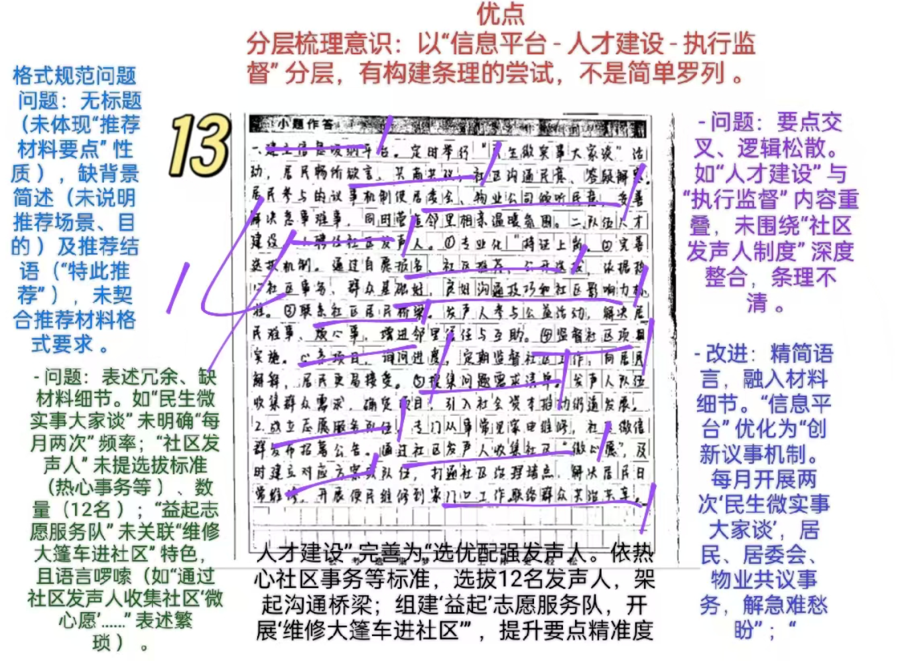
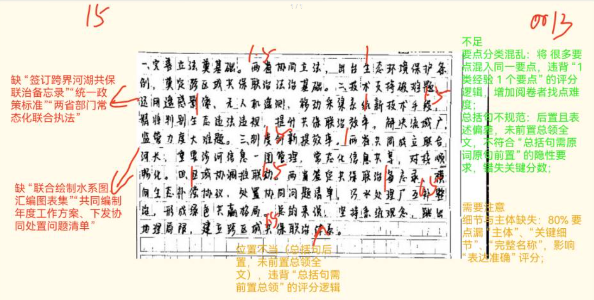
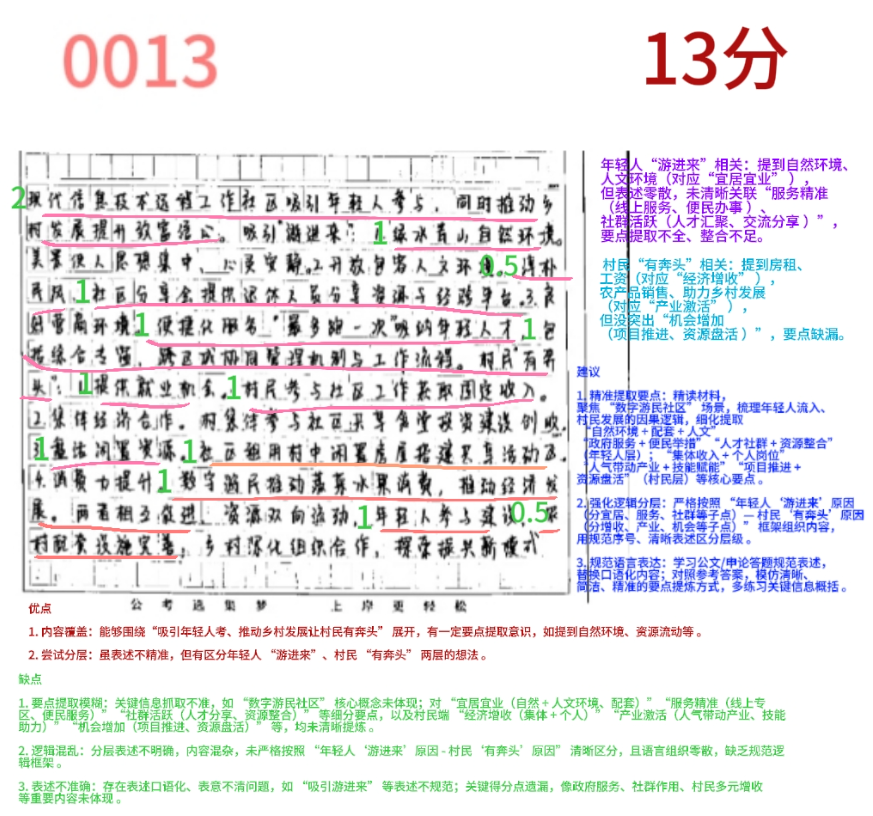
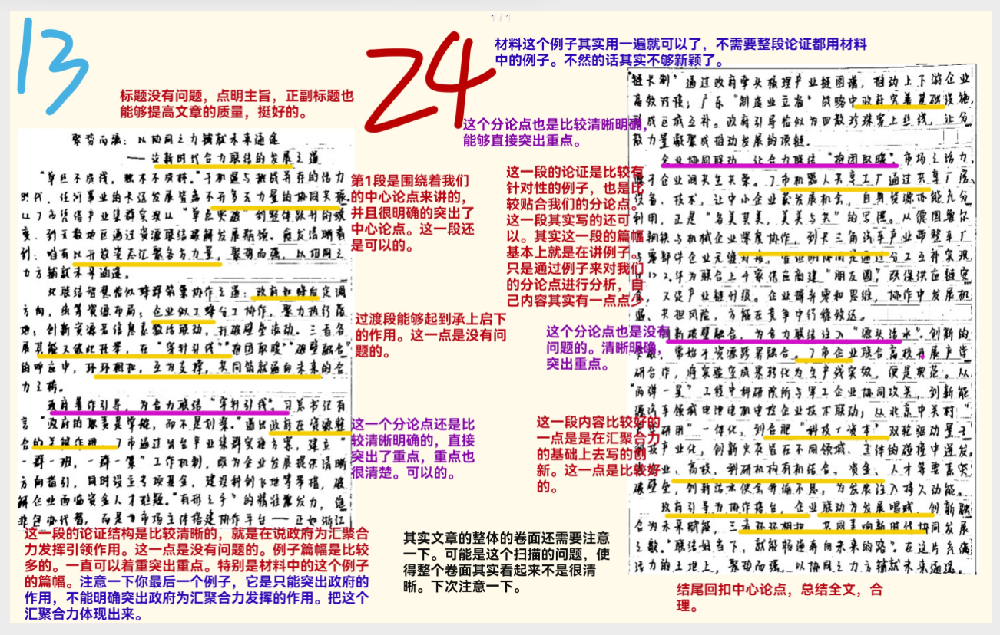

| 昵称    | Y0ungK1ng |
| ----- | --------- |
| Q1得分  | 14        |
| Q2得分  | 15        |
| Q3得分  | 13        |
| Q4得分  | 24        |
| 总分    | 66        |
| 平均分   | 57.5      |
| 排名    | 102       |
| 总提交人数 | 549       |

###  **一、公文写作题**::noto:banana::

| 得分  | 总分  | 区间  |
| --- | --- | --- |
| 14  | 20  | 中   |

::: danger

格式问题！！
:::

::: card title="题干" icon="noto:backhand-index-pointing-right-dark-skin-tone"

**一、省级组织社区治理优秀案例评选，S县拟推荐向阳街道社区的案例。假如你是S县政府办的工作人员，请根据“给定资料1” ，拟写这份推荐材料的主要内容要点。 （20分）**

要求： 

（1）紧扣资料、内容全面、重点突出； 

（2）条理清晰、有逻辑性；

（3）不超过400字。

:::

::: card title="答题" icon="twemoji:astonished-face"

:::

::: card title="答案" icon="typcn:tick-outline"

<h5>
向阳街道社区治理优秀案例推荐材料要点
</h5>

向阳街道创新推行社区发声人制度，充当社区和居民的桥梁，有效解决社区治理难题，提升了群众满意度（2分）。

1、选优配强发声人，架起沟通桥梁（1分）。根据热心于社区事务、群众基础好、社区影响力等标准，选拔出一批“社区发声人”（1分），为居民解决难事烦心事，增进了邻里信任（1分）。

2、创新议事机制，协商解决难题（1分）。开展“民生微实事大家谈”活动（ 1分），社区发声人提出大家关心的社区事务，居民共同讨论，提出初步解决建议，推动解决急事难事（1分）。

3、组建志愿队伍，打通治理堵点（1分）。社区发声人通过与邻居闲聊，==促成“益起”志愿服务队（1分）的成立，并开展“维修大篷车进社区”活动（1分）== ，服务到家门口。

4、监督社区工作，助力社区治理（1分）。发声人跟进社区工程，向居民解释进度（1分），==化解矛盾，提升了治理透明度（1分）==。

去年以来，向阳街道广泛搜集居民的问题和需求，推动项目落地，投入大量资金，联结了治理断层。特此推荐！（2分）

<h5>
向阳街道社区治理优秀案例推荐材料要点
</h5>

向阳街道根据热心于社区事务、群众基础好、社区影响力等标准，选拔出一批“社区发声人”，充当了社区和居民的桥梁，为居民解决难事烦心事，增进了邻里信任。

1、创新议事机制，协商解决难题。开展“民生微实事大家谈”活动，社区发声人提出大家关心的社区事务，居民共同讨论，提出初步解决建议，推动解决急事难事。

2、组建志愿队伍，打通治理堵点。社区发声人通过与邻居闲聊，促成“益起”志愿服务队的成立，并开展“维修大篷车进社区”活动，服务到家门口。

3、监督社区工作，助力社区治理。发声人跟进社区工程，向居民解释进度，化解矛盾，提升了治理透明度。

去年以来，向阳街道广泛搜集居民的问题和需求，推动项目落地，投入大量资金，有效联结  了治理断层，激发了共建共治共享活力。特此推荐参评！

:::

::: card title="反思与建议" icon="line-md:compass-loop"

总分20分。要点分17分。逻辑分3分。材料要点相当于提纲，总分结构很重要。两种参考答案，区别在于是否把“选优配强发声人”放在开头还是放在第一点，两者皆可。

**一、答题内容**

内容要点=提纲：
- 纲要性：纲目，要点
- 条理性：分条书写

400字=字数不算多，注意大体布局，开头结尾不要太多。

社区治理优秀案例=关于社区治理的做法，核心要素为【做法】

关键词：选优配强发声人；创新议事机制；组建志愿队伍；监督社区工作

**二、答题逻辑**

==推荐材料内容要点==

1、格式：标题+正文；

2、内容：
- 开头简述背景；
- 中间描述==被推荐对象的优势==或==其他推荐理由==；
- 结尾总结评价，表达推荐信心。

3.常见类型（内容要点＝提纲）：
- 汇报提纲：用于向上级汇报工作，包含基本情况、问题及对策；
- 讲话提纲：辅助演讲，列出要点或分阶段内容；
- 写作提纲：规划文章结构，如开头、主体、结尾及核心论点；

:::

###  **二、概括经验题**::noto:banana::

| 得分  | 总分  | 区间  |
| --- | --- | --- |
| 15  | 20  | 中   |

::: card title="题干" icon="noto:backhand-index-pointing-right-dark-skin-tone"

**二、根据“给定资料2” ，概括A、B两省共同治理向南河的经验。（20分）**

要求： 

（1）内容全面、表达准确、条理清晰； 

（2）不超过300字。

:::

::: danger

总分20分。要点分20分。分5条最恰当。最前边的总括句需要写出来，原词原句。

条理分2分，分类混乱的在要点分基础上倒扣分。

总括句一定前置！！

:::

::: card title="答题" icon="twemoji:astonished-face"

:::

::: card title="答案" icon="typcn:tick-outline"

两省坚持系统观念，建立跨区域共保联治体系（2.5分）。具体经验有：

1、==协同立法（1.5分）==。分别出台生态环境保护条例，为跨区域共保联治奠定法治基础.（2分）。

2、==联合执法（1.5分）==。签订跨界河湖共保联治备忘录（1分），统一政策、统一标  准，开展两省部门常态化联合执法；运用新技术手段，精准判别问题（1分），提升工作效率。

3、==生态补偿（1.5分）==。签订横向生态补偿协议（1分），投入资金对生态保护行为进行补偿（1分），形成绿色共赢格局，推动两地一体联动。

4、==创新制度（1.5分）==。成立联合河长办公室（1分），联合绘制水系图，汇编图表集，共同编制年度工作方案，下发协同处置问题清单（1分），实现了信息常态化共享。

5、==区域联动/共享资源（1.5分）==。通过污水跨区域处理（1分）、联合整治河道（1分）等举措，改善水质和居民生活环境。

:::

::: card title="反思与建议" icon="line-md:compass-loop"

**一、答题内容**

概括A、B两省共同治理向南河的经验
经验类题目：从给定材料中提炼出有关成功做法、有效措施等经验内容。
答案呈现：帽子+做法。

**二、答题逻辑**

1、总分结构。总括句的书写是根据材料来进行的，不是每道概括题都这么写。 这里要求大家在寻找要点时，认真揣摩个别要点是否具有“总括性” ，有的话可   作为总括句书写。

2、分类是否清晰。本题按照5个小要点进行分类，保证条理清晰。

3、第五点是易错点，很多同学直接漏点。帽子书写上，区域联动或者共享资  源可作为积累直接背诵。

:::

###  **三、综合分析题**::noto:banana::

| 得分  | 总分  | 区间  |
| --- | --- | --- |
| 13  | 20  | 中   |

::: tip

:::

::: card title="题干" icon="noto:backhand-index-pointing-right-dark-skin-tone"

**三、 “给定资料3” 中提到“建设数字游民社区，不仅吸引更多年轻人‘游进来’ ，也让村民‘有奔头’ 。 ”请分析沈书记这样说的原因。（20分）**

要求： 

（1）紧扣资料、分析全面、条理清晰； 

（2）不超过300字。

:::

::: card title="答题" icon="twemoji:astonished-face"

:::

::: card title="答案" icon="typcn:tick-outline"

该句是指数字游民社区吸引了年轻人，带富了乡亲们（2分）。

一、年轻人“游进来”原因：

1. 宜居宜业（1分）：自然环境宜人（1分），让人身心放松，配套设施齐全（0.5分），满足工作生活需求；村民淳朴热情（0.5分），相处融洽。
2. 服务精准（1分）：政府提供线上服务专区（1分）和“一件事一次办”便民服务（1分），优化创业环境。
3. 社群活跃（1分）：汇聚多元人才，通过分享会（1分）促进资源整合与灵感碰撞， 增强归属感认同感（1分）。

二、村民“有奔头”原因：

1. 经济增收（1分）：社区租金等增加村集体收入（1分）；村民通过保安等岗位获得工资收入（1分）。
2. 产业激活（1分）：数字游民带来人气，带动本地农产品销售、餐饮业发展（1分）；帮助村民开展设计、网络推广（1分）等，助力乡村发展。
3. 机会增加（1分）：二期项目加快推进（1分），进一步盘活乡村资源（1分），深化合作。

:::

::: card title="反思与建议" icon="line-md:compass-loop"

**一、答题内容**

“建设数字游民社区，不仅吸引更多年轻人‘游进来’，也让村民‘有奔头’。”请分析沈书记这样说的原因。

①年轻人‘游进来’

②村民‘有奔头’ ，两个都要进行分别分析原因，不能随意合并。

**二、答题逻辑**

1、本质是概括题，不是分析题，不用提对策。解释含义也是视情况而定，本题中‘游进来’和‘有奔头’都是带引号的特殊词汇，有解释必要，所以答案进行了大致解释，不用啰嗦。

2、分点是否合理。要点划分上，每个大点下分3个小点，用四字小帽子进行引领，节省格子。

3、分析原因类题目方法技巧

（1）本质是概括题，不是分析题，不用提对策，解释含义也是视情况而定

（2）材料挖掘

①定位重点句：抓取材料中表原因的词汇
（如“因为”“根源在于”“导致”）或负面描述（如“污染严重”“管理混乱”） 

②主体行为分析：明确“谁因何做/不做某事”
（如企业因“技术资金不足”未升级设备；游民社区因为环境好吸引外地年轻人）

（3）态度判定
积极现象：侧重优势或成功做法（如游民社区因“服务精准”让年轻人放手创业）

消极问题：聚焦缺陷或矛盾（如“地铁地陷”因地质勘察不严谨）

:::

###  **四、大写作**::noto:banana::

| 得分  | 总分  | 区间  |
| --- | --- | --- |
| 24  | 40  | 高   |

::: danger

:::

::: card title="题干" icon="noto:backhand-index-pointing-right-dark-skin-tone"

**四、“给定资料 4”中提到“在当今这个充满活力的时代，我们要善于汇聚各种力量形成合力。联结好当下，就能畅通奔向未来的路”，请对此进行深入思考，参考给定资料，联系实际，自选角度，自拟题目，写一篇文章。（40 分）**

要求：（1）观点明确，见解深刻，内容充实；（2）思路清晰，语言流畅；（3）参考给定资料，但不拘泥于给定资料；（4）不少于 1000 字。

:::

::: card title="答题" icon="twemoji:astonished-face"

:::

::: card title="答案" icon="typcn:tick-outline"

- 总论点：在当今这个充满活力的时代，要善于汇聚各种力量形成合力，联结
好当下，就能畅通奔向未来的路。
- 过渡段：汇聚力量的重要性；联结当下的重要性
- 分论点1：政府精准施策，汇聚制度合力。
- 分论点2：市场高效联动，汇聚要素合力。
- 分论点3：社会有机参与，汇聚基层合力。

  <h4>多元协同汇聚合力  畅通奔向未来之路
</h4>

在这个充满活力的时代背景下，发展早已突破单一主体独舞的局限，演变为多方力量共同演绎的协奏曲。从J市产业集群的快速成长到A、B两省跨界治理的创新实践，从向阳街道的社区精细管理到数字游民社区的城乡互动，都深刻揭示了一个重要启示：只有实现==政府、市场、社会的多元协同配合，汇聚力量，有效整合各类发展资源，才能在准确把握现实需求的前提下，切实打通未来发展的通道=={.warning}。

当今时代的发展已进入深水区，单一力量难以应对复杂的挑战。从产业升级的瓶颈到生态治理的困局，从基层治理的碎片化到城乡发展的不平衡，每一个问题的解决都呼唤着多方力量的精准对接与协同发力。联结当下，就是要以问题为导向，将政府的前瞻规划、市场的资源配  置与社会的创新活力紧密衔接，形成破解现实难题的"合力矩阵"，为未来发展开辟通途。

==政府精准施策，汇聚制度合力==。政府作为发展航船的"舵手"，其制度设计与政策引导具有"压舱石"般的稳定作用。惠民县行政审批服务局推行"一窗受理 ·一次办好"改革，实现无差别服务模式。这种精准施策不是简单的流程合并，而是通过制度创新实现行政资源的高效整合。浙江嘉善县与上海青浦、江苏吴江三地联合出台7项制度文件，建立标准适用统一机制和执法协 作配合机制。这种以法治为基础的跨域协同平台，不仅打破了行政壁垒，更凝聚起区域共治的强大合力。政府的制度合力，正是通过这种"顶层设计"与"基层创新"的有机结合，为多元协同奠定了坚实基础。

==市场高效联动，汇聚要素合力==。市场作为资源配置的决定性力量，其要素流动与协同效率直接影响发展质量。J市通过建设特色产业集群共享数据中心，实现大中小企业订单智能匹配，使中小企业订单处理效率提升40%，资源闲置率降低25%。这一实践表明，数字化平台通过打破信息孤岛，不仅优化了产业链上下游的资源配置，更形成了"大企业带动、中小企业协同"的共生生态。要素的高效联动，一方面激活了市场潜力，另一方面促进了创新融合。未来需进一步健全要素市场化配置机制，建立跨区域技术交易平台，如此才能充分发挥超大规模市场优势，促进市场高效联动，汇聚要素合力，为高质量发展注入强劲动能。

==社会有机参与，汇聚基层合力==。社会发展最深厚的根基在基层，最强大的力量在群众。向阳街道通过聘任社区发声人，收集居民诉求，将高压锅维修、停车位建设等"急难愁盼"转化为 共治项目。"这种"居民点单、社区派单、多方接单"的治理模式，不仅激活了社区自治动能，更将分散的"微需求"汇聚成改革的"强声量"。群众参与基层治理，既能夯实治理根基，又能促进  社会协同。未来需拓展“线上+线下”参与渠道，推动自治从“被动响应”转向“主动创造” ，如此才能将基层“神经末梢”转化为治理“前沿阵地”，实现共建共治共享的治理新格局。

“能用众力，则无敌于天下矣；能用众智，则无畏于圣人矣”。当制度设计的理性之光、市场要素的活力之源与基层智慧的创新之火相互交融，社会发展便如同三棱镜折射出的光谱，在多元协同的调色板上绘就绚烂图景。我们需要的不仅是汇聚力量的广度，更要追求联结当下的深度，唯有如此，才能汇聚起更为磅礴的发展合力，在准确把握当下机遇与挑战的基础上，真正畅通高质量发展的未来之路。