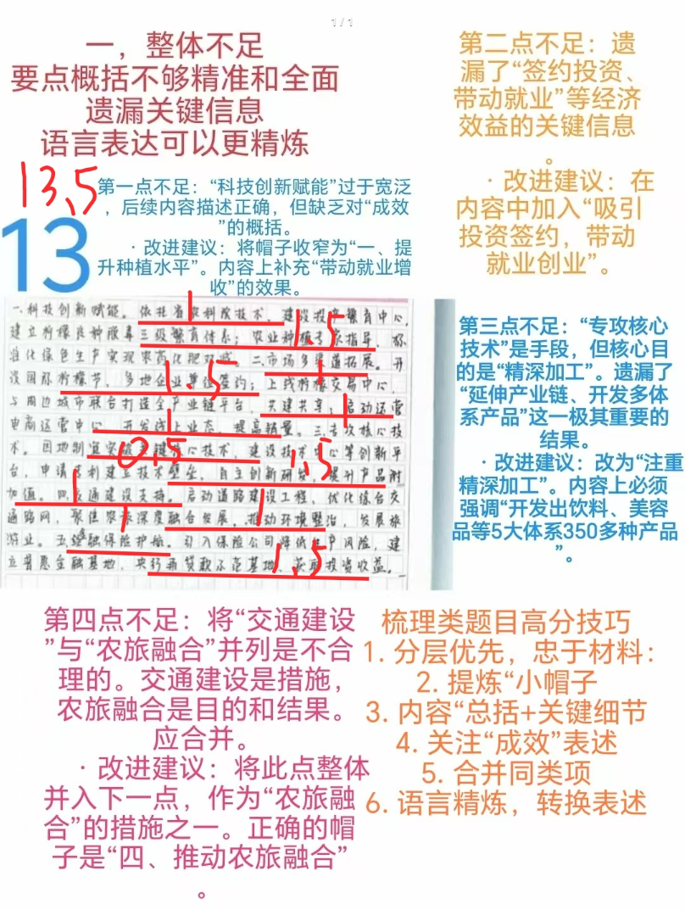
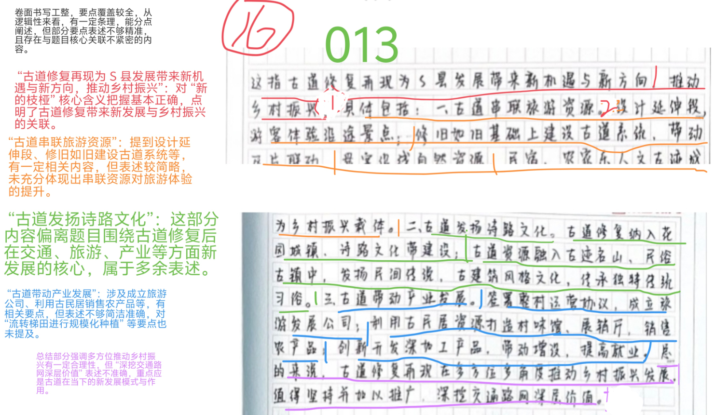
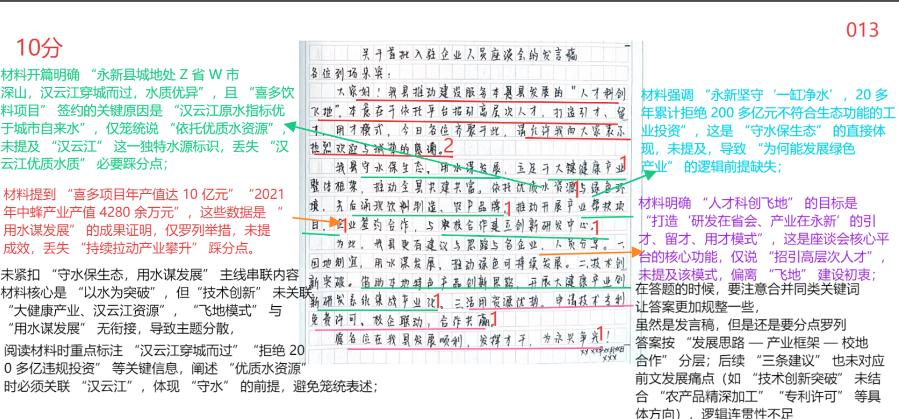
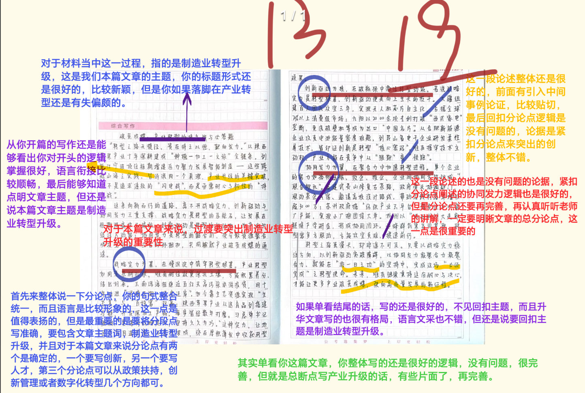

| 昵称    | Y0ungK1ng |
| ----- | --------- |
| Q1得分  | 13.5      |
| Q2得分  | 16        |
| Q3得分  | 10        |
| Q4得分  | 19        |
| 总分    | 58.5      |
| 平均分   | 57.5      |
| 排名    | 186       |
| 总提交人数 | 459       |

::: danger
值得好好思考的一套卷子
:::

###  **一、经验概括题**::noto:banana::

| 得分   | 总分  | 区间  |
| ---- | --- | --- |
| 13.5 | 20  | 中   |

::: danger

满分20分。【小帽子赋分区间3-5分，根据帽子数量以及准确程度灵活赋分】

注意：考梳理必须分层正确，如果答案分条不是这5条，最高分不超过15分。

:::

::: card title="题干" icon="noto:backhand-index-pointing-right-dark-skin-tone"

**1.请结合“给定资料1” ，梳理概括T市柠檬产业高质量发展的成功经验。（20分）**

要求：全面准确，条理清晰，有概括性。不超过300字。

:::

::: card title="答题" icon="twemoji:astonished-face"

:::

::: card title="答案" icon="typcn:tick-outline"

1. ==提升种植水平==（1分）。依托技术力量，投入资金建成种苗繁育中心，建立良种繁育体系（1.5分）；并借助专家指导，通过标准化示范，开展绿色防控，提高产量和品质（1.5分）。

2. ==对外合作交易==（1分）。举办柠檬节等活动吸引投资（0.5分）；上线交易中心促进交易（1分）； 联合周边地区打造全产业链服务平台，共建共享（1分）；启动电商运营中心，开发线上业态（1分）。✔

3. ==注重精深加工==（1分）。加工企业提升研发人员比重（0.5分），建设技术创新平台，突破关键核心技术，开发多体系多种类的产品（2分）。

4. ==农旅融合发展==（1分）。强化配套设施建设（0.5分），以柠檬产业为抓手（0.5分），打造特色小镇（1分），发展农旅深度融合项目（1分）。

5. ==加大金融保障==（1分）。引入保险公司，增加产品承保力度、品种，降低生产风险（1.5分）；广泛建立普惠金融基地，==试点=={.warning}再贷款示范基地（1.5分）。

:::

::: card title="反思与建议" icon="line-md:compass-loop"

**一、答题内容**

梳理概括：分层要尽可能谨慎准确，看清材料逻辑

成功经验：做法

**易错点**：误以为概括经验的题都必须普适性极强。其实应该注意题干的问法和区别经验题与
启示题。
- 1、题干问法的概括“柠檬产业发展的经验”而不是“产业发展的经验” ，因此在答题内 容上具有“柠檬”的例子无可厚非。
- 2、一般来说启示题较难，普适性也更强，经验题就题论题，普适性一般。

**二、答题逻辑**

1、总分结构。经验题一般都是有帽子+做法来构成的。

2、分类是否清晰。本题按照5个小要点进行分类，保证条理清晰。

:::

###  **二、综合分析题**::noto:banana::

| 得分  | 总分  | 区间  |
| --- | --- | --- |
| 16  | 20  | 中   |

::: card title="题干" icon="noto:backhand-index-pointing-right-dark-skin-tone"

**2.请结合“给定资料2” ，分析理解“新的枝桠”的含义。 （20分）**

要求：准确，深入，有条理。不超过300字。

:::

::: danger

找准核心，深挖价值

帽子提炼的不够好

:::

::: card title="答题" icon="twemoji:astonished-face"

:::

::: card title="答案" icon="typcn:tick-outline"

“新的枝桠”是指随着古道的修复、再现，不仅恢复其交通功能，还出现==新的发展方向，带动了乡村发展==。（3分）具体体现在：

1、==古道延伸，串联旅游资源==。（帽子2分）坚持“修旧如旧”的同时，建设具有带动意义的古道系统，打造延伸段，游客可体验沿途多个古迹景点，不走回头路；古道串联了沿途自然 景观、人文古迹、民间传说中的地点和民宿农家乐，提升旅游体验。（5分）

2、==依托旅游，创新发展模式==。（帽子2分）乡村以旅游资源入股，签署协议，成立旅游发展公司；利用古民居打造展销厅，销售特色农产品；==流转梯田进行规模化种植=={.warning}；保留传承传统习俗，开发系列深加工产品。（6分）

应继续依托这些新的发展模式，盘活资源，发挥古道的更大作用。（合理即可，2分）

:::

::: card title="反思与建议" icon="line-md:compass-loop"

**一、答题内容**

理解“新的枝桠”的表层含义，深层含义

枝桠=枝丫=枝杈：植物上分杈的小枝子

新的：新的变化、新的模式、新的做法

分析论证重在根据材料去书写古道修复后带来的新的发展方向，进而佐证“新的枝桠”的含义。

**二、答题逻辑**

1、开头解释含义，中间多角度分析，结尾总结或提对策。

2、分类是否清晰。本题按照两个方向进行分类，其实就是一个作为“表层含义”（带动交通）的古道的表现，一个作为“深层含义”（带动发展）的古道的表现。

:::

###  **三、公文写作题**::noto:banana::

| 得分  | 总分  | 区间  |
| --- | --- | --- |
| 10  | 20  | 低   |

::: tip

明确不要求格式！！！

要围绕材料

整体逻辑

:::

::: card title="题干" icon="noto:backhand-index-pointing-right-dark-skin-tone"

**3.永新县领导准备与第一批入驻“人才科创飞地”的企业和研发人员进行座谈。请结合“给定资料3” ，拟写一篇座谈会上县领导的发言稿。（20分）**

要求：主题突出，层次清晰，不要求格式。不超过400字。

:::

::: card title="答题" icon="twemoji:astonished-face"

:::

::: card title="答案" icon="typcn:tick-outline"

欢迎大家入驻“人才科创飞地” ，为我县产业发展贡献力量，下面我来介绍一下我县的发展情况和优势所在（打招呼2分，合理即可）：

==一、发展思路明确，以水为突破（1分）==。我县地处深山，汉云江穿城而过，水质优异，在发展过程中，坚决拒绝不符合生态功能的项目，走出了一条“守水保生态，用水谋发展”的新路。（2分）

==二、产业框架清晰，走共富之路（1分）==。我县确立起大健康产业框架，将目光放到共富赛道上。首先成立水经济产业园，然后依托县里众多成熟的农产品品牌，优先采购当地原料，精深加工，投产后销路稳定，持续拉动产业攀升，并且注重社会效益，开展帮扶项目，带动低收入农户致富。（6分）

==三、校地全面合作，科研实力强（1分）==。我县与省农林科技大学共同成立大健康联合研究中心，推进创新研发、系统集成、成果转移转化和产业化；学校专家给我县提出了宝贵的发展建议，也优选一批技术专利，向我县企业开放免费许可。（4分）

希望大家与我县共谋发展，共创美好未来！（1分）

:::

::: card title="反思与建议" icon="line-md:compass-loop"

**一、答题内容**

发言稿，但是要求中明确提出【不要求格式】于是格式问题直接省略不再考虑。

题干明确【企业和研发人员进行座谈】，这里两个主体，不要漏掉这个细节。

【县领导的发言稿】注意措辞口吻。

**二、答题逻辑**

无格式发言稿；

开头简述背景；

中间描述材料内容（本题为本县发展情况和优势所在）；

结尾总结呼吁，表明邀请诚意。

:::

###  **四、大写作**::noto:banana::

| 得分  | 总分  | 区间  |
| --- | --- | --- |
| 19  | 40  | 低   |

::: danger

切记观点片面，容易偏题

分论点严格把控材料

缺人才、创新、政策支持

:::

::: card title="题干" icon="noto:backhand-index-pointing-right-dark-skin-tone"

**4.“给定资料5” 中提到“这一过程决非一日之功，但必须完成”请结合你对这句话的理解，参考“给定资料” ，联系现实，自拟题目，写一篇文章。（40分）**

要求：观点明确，见解深刻；参考给定资料，但不拘泥于给定资料；思路清晰，语言流畅；总字数1000字左右。

:::

::: card title="答题" icon="twemoji:astonished-face"

:::

::: card title="答案" icon="typcn:tick-outline"

- 总论点：推动制造业转型升级不是一蹴而就的，必须久久为功；转型之路固然坎坷，但必须完成。
- 过渡段：强调制造业转型升级的重要性

- 分论点1：推动制造业转型升级，必须走好自主创新之路。
- 分论点2：推动制造业转型升级，必须走好人才建设之路。
- 分论点3：推动制造业转型升级，必须走好政策扶持之路。

评分：   档次：高24-27；中：21-24；低17-21；跑题10-12

总分论点准确，24基准分，根据文采、书写、结构等浮动；总论点不对，12分以下；总论 点正确，分论点不准，根据分论点的精准数量在16-22浮动

总论点必须是制造业转型升级。否则直接三类文。

转型升级的重要性可以写过渡段中，也可以写成一个分论点，但是无论如何需要写上，否
则视情况扣2-3分。

分论点中自主创新和人才建设为核心分论点，第三个分论点可以写政策扶持、创新管理、
数字化转型几个方向，不能算跑题。

总论点正确的前提下，有一个核心分论点可为二类下，两个核心分论点可为二类中，第三
个分论点如上文所说，可为二类上。

  <h4>不积跬步，无以至千里 
  
----久久为功推动制造业转型升级

</h4>

在推动制造业转型升级道路上，习近平总书记已经为我们指明了方向，他反复强调，“加
快传统产业高端化、智能化、绿色化升级改造”“积极培育未来产业，加快形成新质生产力，
增强发展新动能” 。如今，我国制造业规模已位居世界第一位，但技术水平与世界制造强国相比仍存在差距。不积跬步，无以至千里。推动制造业转型升级不是一蹴而就的，必须久久为功；转型之路固然坎坷，但必须完成。

几十年来，随着我国经济持续保持中高速增长，但随之而来的是劳动力成本的逐年提高，  依靠人口红利发展的时代已然过去，如果我们不改变传统的制造业发展模式，则势必会导致制造业的发展不稳定和不可持续。尤其是在疫情与国际局势的双重影响下，各种关键技术受制于国外企业的不利局面更为凸显。在未来，新动能制造业代表着产业的发展方向，拥有巨大的发展潜力，直接关系到一国未来的发展。

推动制造业转型升级，必须走好==自主创新之路==。创新是一个民族进步的灵魂，是一个国家
兴旺发达的不竭动力。推动我国制造业转型升级，建设制造强国，必须加强技术研发，提高国  产化替代率，把科技的命脉掌握在自己手中，国家才能真正强大起来。正如老张的企业，立足在细分领域以持续的技术创新打破西方垄断，打造高性价比产品，企业成立至今才三年多时间，每年都保持着翻倍式增长。因此，应该学会发挥我们自身优势，加大校地联合、校企联合，成立研发中心，产学研协同一体发展；同时也要学会引进先进的高新技术，取长补短。

推动制造业转型升级，必须走好==人才建设之路==。人才是发展的第一动力，习近平总书记在河北正定县工作期间，曾推出广纳贤才的“人才九条”，从奖励机制、生活待遇等方面，对各类人才提出有针对性的优惠政策，为当地发展破局开路，所谓“致天下之治者在人才”，在制造业转型升级过程中更是离不开人才。必须加强人才队伍建设，想方设法引进人才，千方百计留住人才，还要不断优化人才发展生态环境，做到“人尽其才”，大力培养引进“新动能”制造业急需的“高精尖缺”人才，这样才能为制造业转型升级提供源源不断的动力。

推动制造业转型升级，必须走好==政策扶持之路==。制造业转型升级过程中，大大小小的问题都会出现，国际环境不断变化，有的企业举步维艰，而国家则是最坚实的后盾。有时候政府及时出台的相关政策，就像是一剂强心针，让企业重新迸发活力。正如疫情期间国家出台的减税降费政策，无疑是及时雨，让无数企业熬过了寒冬。因此，政策的扶持是推动制造业转型升级的重要手段。政府可以联合银行出台金融支持政策，开发多种信贷产品，缩短信贷周期；还可以进一步优化审批流程，提供兜底服务，降低生产风险，让制造业在转型过程中没有后顾之忧。

合抱之木，生于毫末；九层之台，起于累土；千里之行，始于足下。推动制造业转型非一  日之功，必须咬紧牙关、步步为营，坚持自主创新、加强人才建设、做好政策帮扶，坚定不移  地建设制造强国，为建设社会主义现代化国家提供强劲动力！