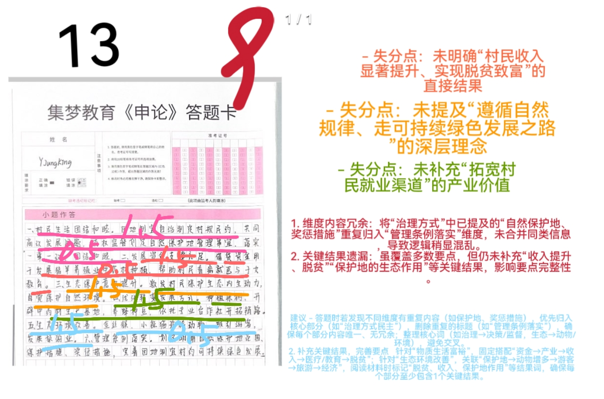
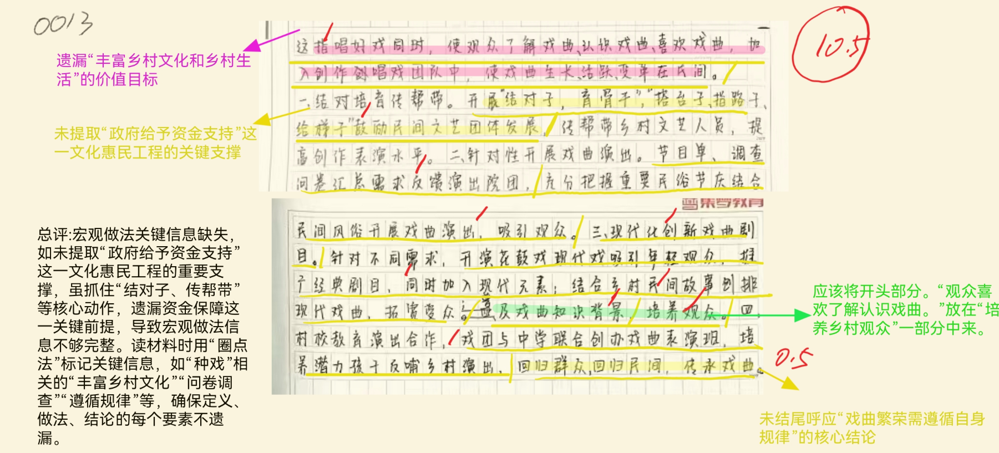
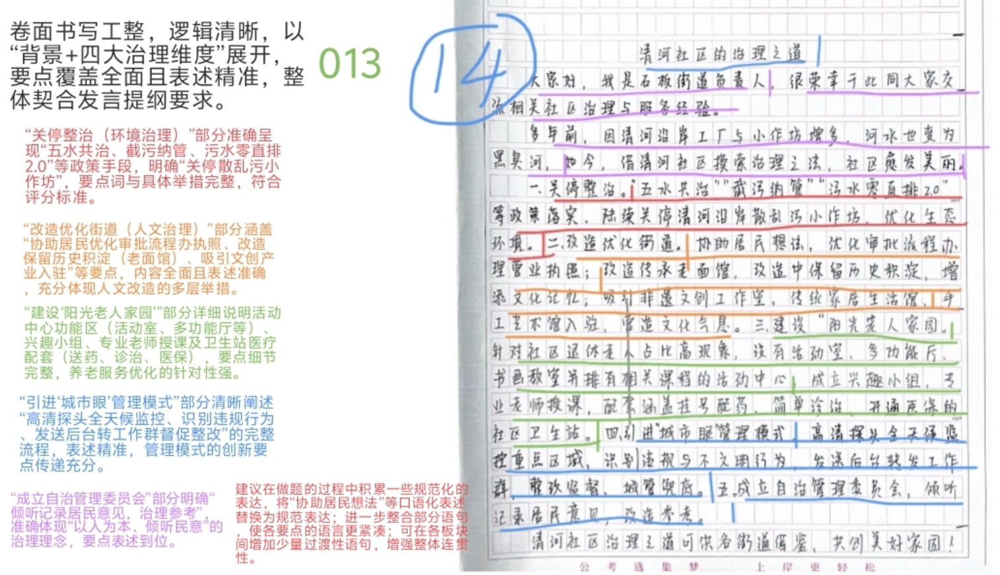
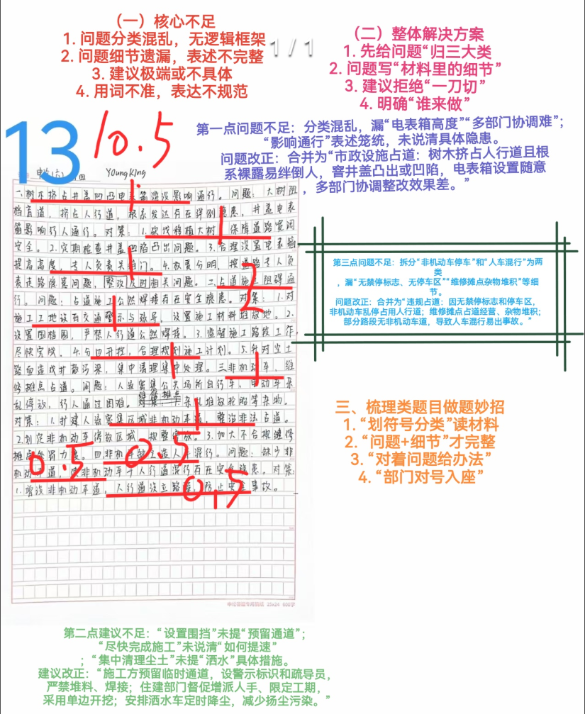
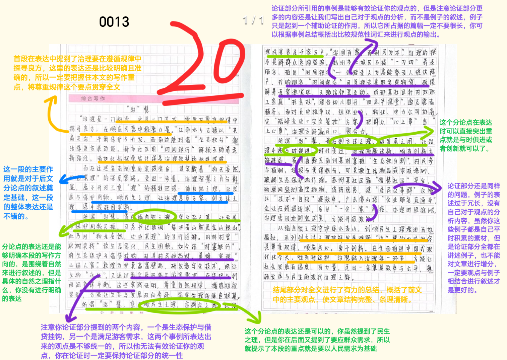

| 昵称    | Y0ungK1ng |
| ----- | --------- |
| Q1得分  | 9         |
| Q2得分  | 10.5      |
| Q3得分  | 14        |
| Q4得分  | 10.5      |
| Q5得分  | 20        |
| 总分    | 64        |
| 平均分   | 58        |
| 排名    | 187       |
| 总提交人数 | 663       |

::: danger
国考卷

:::

###  **一、现象概括题**::noto:banana::

| 得分  | 总分  | 区间  |
| --- | --- | --- |
| 9   | 10  | 高   |

::: danger

1.小帽子是重点。 
自治(治理民主）为主、发展观念（保护自然环境成为自觉） 、发展方式变化（多元生产） 、物质生活（生活水平） 、生态环境每点1.5分；具体描述每点0.5分，共2.5分，共10分；2.卷面与逻辑不清晰可扣1分)

:::

::: card title="题干" icon="noto:backhand-index-pointing-right-dark-skin-tone"

**一、“给定资料1” 中，风林村在实施“村寨银行”项目后，发生了巨大变化。请你谈谈风林村有了哪些变化。（10分）**

要求：全面、准确、有条理，不超过250字。

:::

::: card title="答题" icon="twemoji:astonished-face"

:::

::: card title="答案" icon="typcn:tick-outline"

1. ==治理方式民主==：由“各过各的”变为共同商量，“一事一议” ，凝聚力增强；

2. ==物质生活富裕==：由生活贫困变为解决医疗、教育问题，满足生产生活资金需求，收入 提升，实现脱贫致富；

3. ==发展观念转变==：由坐吃山空变为遵循自然规律，走绿色发展之路，实现人与自然平衡 发展；

4. ==生态环境改善==：由生态环境破坏严重变为生态环境改善，珍稀动物增多，吸引游客游 玩；

5. ==产业发展多元==：由砍树销售变为发展种植、旅游业等多元产业，拓宽村民就业渠道。

:::

::: card title="反思与建议" icon="line-md:compass-loop"

**一、答题内容**

注意积累：治理方式民主、物质生活富裕、发展观念转变、生态环境改善、多元 发展产业

**二、答题逻辑——变化类题目思考？**

1. 谈谈风林村有了哪些新变化。

答题结构：提炼变化（盖帽）+最新表现

2. 谈谈风林村有了哪些变化。

答题结构：提炼变化（盖帽）+之前表现（简写、可省略）+最新表现（重点写） 3.分析风林村有了哪些变化。

答题结构：提炼变化（盖帽）+之前表现+最新表现

:::

###  **二、综合分析题**::noto:banana::

| 得分   | 总分  | 区间  |
| ---- | --- | --- |
| 10.5 | 15  | 中   |

::: card title="题干" icon="noto:backhand-index-pointing-right-dark-skin-tone"

**二、 “给定资料2” 中说： “我们不仅仅是为乡村群众唱几场戏，更重要的是要‘种戏’” 。 请你根据“给定资料2”,谈谈对“种戏”的理解。 （15分）**

要求：分析全面，条理清晰。不超过300字。

:::

::: danger

找准核心，深挖价值

帽子提炼的不够好

:::

::: card title="答题" icon="twemoji:astonished-face"

:::

::: card title="答案" icon="typcn:tick-outline"

“种戏”指普及、传承、发展戏曲(1)，==丰富乡村文化和乡村生活==(1)。

政府通过文化惠民工程，给予资金，开展“结对子、育骨干”活动，鼓励民间团体发展，对 乡村文艺人才进行传帮带（==宏观做法2分==） 。表现为：（==具体做法每条2分，红色字1分，只要 出现就给分，不一定非写成帽子；具体描述1分==）

1. 借力==民间生活礼仪==。(1)把握重要民俗节庆，结合民间风俗和节庆文化开展演出。 (1)
2. ==精准群众需求==。(1)通过问卷调查，定时下发节目单，汇总反馈院团，安排演出。 (1)
3. 加强==现代化创新==。(1)丰富戏曲种类，加入现代元素，采集民间故事，创排现代作品。(1)
4. 培养==乡村观众==。(1)普及戏曲知识，让观众了解、认识、喜欢戏曲。(1)

5. 培育==戏曲人才==。(1)联合办学，挖掘潜力孩子培养，反哺乡村。(1)                

因此，繁荣戏曲要遵循生存与发展规律 (1)，回归民间、群众。

:::

::: card title="反思与建议" icon="line-md:compass-loop"

**一、答题内容**

侧重于句子 本意解释 + 分析论证（4大层面） ，关键词要提炼精准、规范

**二、答题逻辑**

1. 作答思路： ==解释（2-3行） - 分析（主体） - 评价==（1-2行、分情况省略）
2. 技巧点拨：
	- 1） “总分总”结构：开头点明核心观点（解释/判断） ，中间多角度分析（可按主 体、时间、空间等维度） ，结尾总结或提对策。但个别题目可省略结尾，按“总-分” 结构呈现答案。
	- 2）规范表述：语言简洁，避免口语化；200字以上题目建议分条呈现，层次清晰。
	- 3）结合材料：以材料为依据，避免主观臆断，适当引用原文关键词句。

**三、知识拓展**

发言提纲的5种类型

- 一、==表态发言型==：指在对会议的主题、意义、成果发表看法与观点，并阐明行动计划的文稿。其主要应用于各种主题会议，激发工作热情，推动工作进展。要注意，此类提纲要明确态度、决心以及做法。
- 二、==学习反思型==：指在各类主题学习会上，发表学习体会，以及自身的问题与不足，并提出改进措施或  反思的发言提纲。其主要是以与会者的角色进行发言。要注意，此类提纲关键要突出问题与整改措施。
- 三、==观点建议型==：指在各类主题学习会上，发表学习体会，不同于学习反思型，角色如果是会议主持或  参会领导，则以体会、观点、建议的形式发言。要注意，此类发言不是担当学习反思的角色，而是担当学习引导的角色，角色不同，则写作提纲的模式会有根本性差异。
- 四、==讨论总结型==：指在各类专题研讨会上，对会议的讨论情况，主持会议的相关领导做总结性发言。要注意，总结型的提纲要贯穿会议目标与取得的成果。
- 五、==评价审议型==：指在各类大会的报告审议时，进行审议性发言。一般采用“评价+建议”的提纲结构。

:::

###  **三、公文写作题**::noto:banana::

| 得分  | 总分  | 区间  |
| --- | --- | --- |
| 14  | 20  | 中   |

::: tip

标红每条要点（一定要严格卡词），只有要点词2分，只有扩展2分，概括和具体都有整体给3分。

:::

::: card title="题干" icon="noto:backhand-index-pointing-right-dark-skin-tone"

**三、H市近期准备召开“社区治理与服务经验交流座谈会” ，你作为石板街道负责人，将在座谈会上发言。请你根据“给定资料3” ，以“清河社区的 治理之道”为题，写一份发言提纲。 （20分）**

要求：

（1）内容全面、具体；

（2）有逻辑性，语言流畅；

（3）不超过450字。

:::

::: card title="答题" icon="twemoji:astonished-face"

:::

::: card title="答案" icon="typcn:tick-outline"

清河社区的治理之道(1)

大家好，我是石板街道负责人，非常荣幸在此发言(1)。清河社区作为老社区，曾经也饱受清河污染困扰，经过逐步蜕变，滋长出绵长的生命力(2)。治理经验如下：

一、==加强环境治理/解决环境污染==。

创新多元手段，关停沿岸“散乱污”小作坊，改善水质； (3)

二、==人文化改造街区==。
1. 社区帮助居民沟通，办理营业执照审批，改善环境；
2. 坚持“==历史文化保护/人文化保护=={.warning}”理念，分步推进老字号开发，打造特色品牌；
3. 吸引文创产业入驻，提升文化气息； (3)

三、==优化养老服务==。

高标准建设“阳光老人家园” ，成立兴趣小组，丰富功能区设置，邀请专业老师定期教学；搬迁卫生站至“家园”旁，涵盖基本医疗服务，开通医保卡功能； (3)

四、==创新管理模式==。
1. 引入“城市眼” ：接入高清探头，全天候监控重点区域，对比识别违规行为和不文明现象，实时发送相关信息至后台，监督商家整改(3)；
2. 以人为本/倾听民意：推进群众自治，成立自治管理委员会，共同协商社区事宜；充分参考群众意见，推进工程改造(3)。

:::

::: card title="反思与建议" icon="line-md:compass-loop"

**一、答题内容**

关键词：加强环境治理、人文化改造街区、优化民生服务、创新管理模式、以人为本/倾听民意

**二、答题逻辑**

1. 任务：提纲——特定案例的描述和分析，为读者提供引导和帮助，在申论中就 是提炼概括材料的主要内容。
2. 格式：标题+正文
3. 结构：引言（背景） + 主体 + 结语
4. 作答要素：经验---如何处理？

:::

###  **四、对策题**::noto:banana::

| 得分   | 总分  | 区间  |
| ---- | --- | --- |
| 10.5 | 20  | 低   |

::: tip

按点给分，分为问题、建议两个部分。问题5分，建议15分。问题每条2分，全部写全共5
分；问题未梳理为三个方面总分不超过12分，不及格。

:::

::: card title="题干" icon="noto:backhand-index-pointing-right-dark-skin-tone"

**四、请你根据“给定资料4” ，对Z市人行道存在的问题进行梳理，并提出解决建议。 （20分）**

要求：

（1）问题梳理全面、准确；

（2）所提建议与问题相对应，具体明确、切实可行；

（3）不超过450字。

:::

::: card title="答题" icon="twemoji:astonished-face"

:::

::: card title="答案" icon="typcn:tick-outline"

1. 市政设施占道：被树木挤占，窨井盖凸出或凹陷，电表箱随意设置。

建议：建立多部门联合整改机制，统一协商、执法，移植占道树木，平整井盖使之与路面
高度一致，提高电表箱安装高度，及时上锁管理。

2. 占道施工、行人绕行：施工现场没有预留人行通道，缺少交通警示，存安全隐患；工作效率低、方法不科学，尘土路面裸露造成空气污染。

建议：
- ①合理规划施工区域，预留行人通行空间，拉设施工警戒绳，设置警示及疏导标识, 严禁进行焊接等危险施工；
- ②增加施工人员，提高施工效率；
- ③科学施工，避免两边开挖；
- ④定期对尘土路面洒水，避免扬尘；

3. 违规占道现象频发：非机动车占道、占道经营、人车混行。

建议：
- ①安装禁停标志，开辟非机动车停车区域，加大乱停放处罚力度；
- ②设置固定经营摊位，引导摊主有序经营，加大对占道经营处罚力度。
- ③增设机动车道，加大宣传交通安全常识，培养市民安全出行意识。

:::

::: card title="反思与建议" icon="line-md:compass-loop"

**一、答题内容**

关键词：市政设施、工程施工、个人/市民违规行为

**二、答题逻辑**

1. 重要考点：梳理！--确保问题分类层次必须完全与参考答案一致。
2. 对策来源：

- ①直接对策：留意材料中专家、学者、政府官员的建议，政策文件的规定，以及 成功案例的经验。

- ②间接对策：从问题、原因反推对策。

- ③拓展对策：根据个人积累，对策表述要具体，具有实际可操作性，少用抽象、笼统的语言。

:::

###  **五、大写作**::noto:banana::

| 得分  | 总分  | 区间  |
| --- | --- | --- |
| 20  | 35  | 高   |

::: danger

总分35分。总分论点正确基准分为20；总论点正确、分论点部分正确基准分为17分；总论点跑题直接12分以下。 根据学生的文采、卷面等在基准分线 浮动1-2分；特别优秀的文章可多加分，但极少会出现这种情况

:::

::: card title="题干" icon="noto:backhand-index-pointing-right-dark-skin-tone"

**五、 “给定资料1” 中说“物无妄然，必由其理” ，这句话对提升治理效能有深刻的启示。请你参考给定资料，联系实际，以“‘治’慧”为题，写一篇文章。 （35分）**

要求：

（1）观点明确，见解深刻；

（2）参考“给定资料” ，但不拘泥于“给定资料”；

（3）思路清晰，语言流畅；

（4）字数1000～1200字。

:::

::: card title="答题" icon="twemoji:astonished-face"

:::

::: card title="答案" icon="typcn:tick-outline"

- 表达流畅性：语句是否通顺自然，有无语病、错别字和语序不当等问题。
- 语言准确性：用词是否准确恰当，避免词不达意或产生歧义。
- 语言生动性：语言是否生动形象，增强感染力。

  <h4>“治”慧 
  
——遵循规律 智慧治理

</h4>

魏晋哲学家王弼认为“物无妄然，必由其理” ，强调事情没有随意而为 的,必然会因循其理。在社会治理过程中，广大基层党员干部纷纷下沉一线， 让党旗高高飘扬；爱心企业、热心群众、网格员等多方参与，构建多元治理 格局；以科技为动力，构建数字化治理体系，跑出治理“加速度” 。可以说 , 正因遵循其理，持续推进智慧治理，实现治理效能提升，进一步构建社会 治理新格局。

因地制宜，迈出智慧治理“最先一公里” 。社会治理考验着我国民生建设的现代化程度，更与群众的获得感、幸福感、安全感密切相关。过去，风 林村靠山吃山、砍树卖钱，是当地人视为天经地义的生活逻辑。而当地党委和政府结合风林村的特点，因地制宜引入“村寨银行”项目，从坐吃山空到 山绿人富，走上了一条绿色发展之路，最终实现人与自然关系的平衡和发展。反观，部分地区在治理过程中简单粗暴、执政“一刀切” ，甚至以牺牲环 境为代价换取经济增长，或许能给他们带来些许安慰，但本质上却是一种让 人裹足不前，自我沉沦的“麻醉剂” ，与智慧治理背道而驰。

与时俱进，走好智慧治理“ 中间一公里” 。 “创新是从根本上打开增长之锁的钥匙。 ”在各类社会治理和公共服务的创新实践中，远程诊疗“数据 云” 、公共服务“云平台”等大数据与人工智能技术发挥了精准高效的支撑作用，显著提升了管理效能和服务水平，展现了科技创新与数字化转型的实践成果。 “纷繁世事多元应，击鼓催征稳驭舟” ，创新社会治理是时代课题 , 任重道远。面向未来，我们要主动作为、努力求变，时刻保持大战状态、 大考作风，又要总结经验、放眼长远，不断创新社会治理体系，提升社会治理能力，将社会治理的“最后一公里”变为服务群众的“最美零距离”

以人为本，跑完智慧治理“最后一公里” 。坚持以人民为中心的发展思想，是做好社会治理各项工作的基本要求。习近平总书记强调： “基层是社会和谐稳定的基础。 ”自治是基层社会运行的重要方式和依托，是基层社会 充满活力的重要源头。自治不但有利于激发群众的积极性主动性创造性、增强社会认同，还有利于减少矛盾冲突、增进社会和谐。在长期实践中，我们不断增强基层群众自治活力，探索创新基层群众自治实现途径，努力做到民 事民议、民事民办、民事民管。我们牢记初心使命，坚持把群众满意作为社 会治理的“标尺” ，不断增强群众获得感、幸福感、安全感。

“世界上有一种鸟是关不住的，因为它们的每一片羽毛都沾满了太阳的光辉！ ”的确，在“智慧治理”的道路上，我们决不能有松口气、歇歇 脚的念头，必须时刻遵循规律，坚持因地制宜、与时俱进、以人为本，就一定能 让“关不住”的鸟儿， “羽毛都沾满太阳的光辉” ，始终飞翔在希望的田野上。
