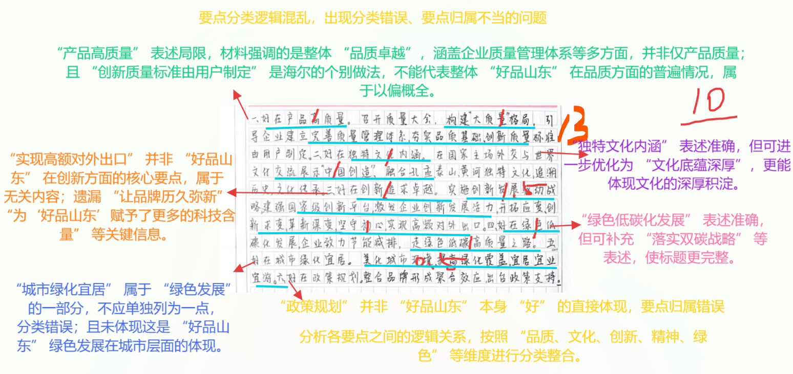
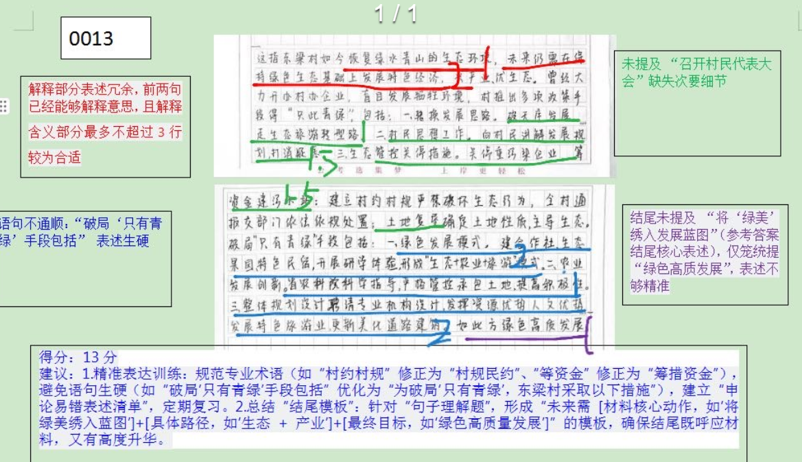
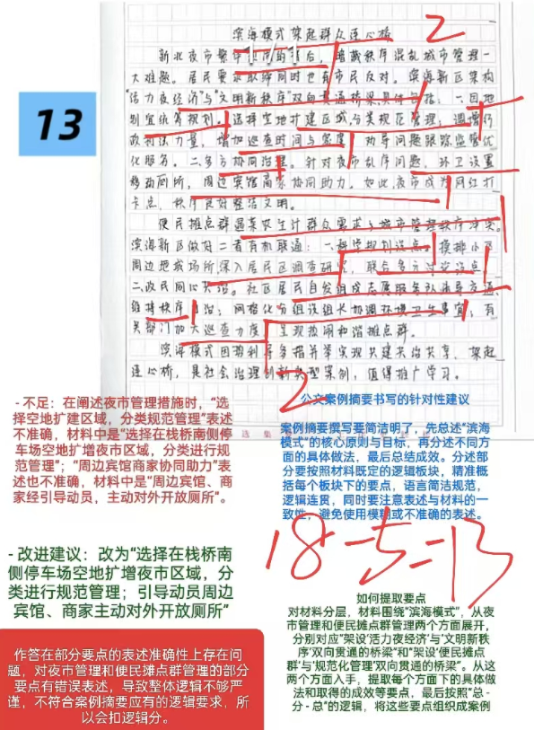
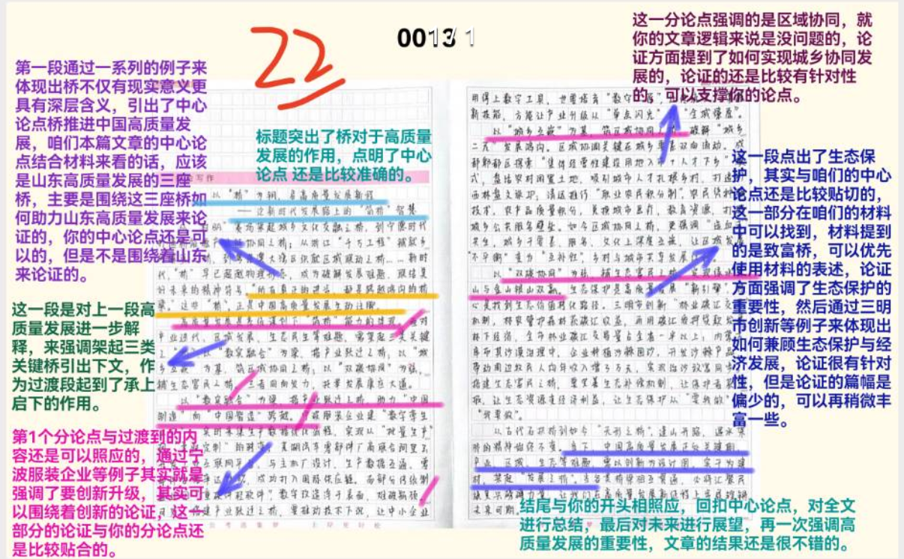

| 昵称    | Y0ungK1ng |
| ----- | --------- |
| Q1得分  | 10        |
| Q2得分  | 13        |
| Q3得分  | 13        |
| Q4得分  | 22        |
| 总分    | 58        |
| 平均分   | 58.5      |
| 排名    | 370       |
| 总提交人数 | 694       |

::: danger

出现多次要点混乱重复！

:::

###  **一、现象概括题**::noto:banana::

| 得分  | 总分  | 区间  |
| --- | --- | --- |
| 10  | 15  | 中   |

::: danger

概述：概括并描述

三级要点可以省略（写太多了！！）

:::

::: card title="题干" icon="noto:backhand-index-pointing-right-dark-skin-tone"

**一、请根据“给定资料1” ，概述“好品山东”好在哪里。（15分）**

要求：全面、准确、有条理，不超过250字。

:::

::: card title="答题" icon="twemoji:astonished-face"

:::

::: card title="答案" icon="typcn:tick-outline"

1. 好在==品质卓越==。召开全省质量大会，构建“大质量”格局，引导企业完善质量管理体系，夯实品质基础，打造过硬品牌。
2. 好在==文化底蕴==。“好品山东”拥有独特文化内涵，追溯历史，传承文化。
3. 好在==科技创新==。实施创新发展驱动战略，建强国家级创新平台，激发企业创新发展活力，更新品牌，提升市场份额和科技含量
4. 好在==坚守精神==。坚守工匠精神和企业家精神，坚守初心，追求卓越。
5. 好在==绿色发展==。落实双碳战略，促进节能减排；提高城市绿化覆盖率，打造宜居宜业宜游城市。

:::

::: card title="反思与建议" icon="line-md:compass-loop"

**一、答题内容**

注意积累：==品质卓越、文化底蕴、科技创新、精神品质、绿色发展==

**二、答题逻辑**

1.关于“概述”的理解：

基本含义：总结、概括事物的要点或内容。

详细解释：概述是指对一件事情或一段内容进行简要总结，提取出其要点和关键内容。

2.概述和概括的区别

1）含义上的区别：

概括，即简明扼要的介绍。是当事人全面而简洁地介绍情况的一种书面表达方式。

概述，大略地叙述，意思是对文章或事物进行概括表达。

2）强调方面的不同：

概括：重点是客观的，简明扼要的表述。

概述：归纳、总括，把事物的共同特点归结在一起加以简明地叙述，扼要重述。

即两者是同义词，在于后者必须注重归纳和扼要重述。

**三、答题技巧**

1.概括---侧重要点的精准度，要点表达清晰、直接、准确；

2.概述---重点在“述”上，==总结出的核心要点（关键词）要与其他要点有关联度、逻辑清晰==

:::

###  **二、综合分析题**::noto:banana::

| 得分  | 总分  | 区间  |
| --- | --- | --- |
| 13  | 20  | 中   |

::: card title="题干" icon="noto:backhand-index-pointing-right-dark-skin-tone"

**二、请根据“给定资料3” ，谈谈对划线句子“东梁村如今可谓‘只此青绿’ ，但未来不能‘只有青绿’”的理解。（20分）**

要求：理解准确，分析透彻，条理清晰；不超过300字。

:::

::: danger

解释含义不超过3行

:::

::: card title="答题" icon="twemoji:astonished-face"

:::

::: card title="答案" icon="typcn:tick-outline"

这指乡村建设/振兴不能局限于绿水青山，更要借助生态带动村民致富。体现在：

一、“只此青绿”指修复生态环境：
1. 村两委达成共识，坚持可持续发展；
2. 做村民思想工作，讲解发展规划，获取理解配合；
3. 关闭污染企业，==筹措资金==，开展土地复垦、生态修复，建设污水站；
4. 实行最严格生态管控措施，严控非必要开发活动。

二、不能“只有青绿”指发展绿色产业：
1. 因地制宜，建立合作社，形成 ==“生态+农业+旅游”== 绿色发展模式
2. 严格管控土地，统一安排种植物料，专家定期指导；
3. 聘请专业机构整体规划设计，发挥资源优势、人文特色，更新美化道路、建筑。

未来，要继续将“绿美”绣入发展蓝图，推动绿水青山变金山银山。

:::

::: card title="反思与建议" icon="line-md:compass-loop"

侧重于句子 本意解释 + 分析论证（4大层面），关键词要提炼精准、规范

切记少要点

:::

###  **三、公文写作题**::noto:banana::

| 得分   | 总分  | 区间  |
| ---- | --- | --- |
| 18-5 | 20  | 低   |

::: tip

下笔前分析文章结构

:::

::: card title="题干" icon="noto:backhand-index-pointing-right-dark-skin-tone"

**三、近期，S市将评选全市社会治理创新典型案例。请根据“给定资料4” ，撰写一篇关于“滨海模式”的案例摘要，参加评选。（25分）**

要求：紧扣材料，内容全面，重点突出，结构完整；不超过400字。

:::

::: card title="答题" icon="twemoji:astonished-face"

:::

::: card title="答案" icon="typcn:tick-outline"

滨海模式”，打造共建共治共享新范例

滨海新区秉持监管有力、执法有据的原则(1)，将早市、夜市的“零乱经营”有序打造成“活力经济”的“滨海模式”(1)，实现共建共治共享，架起了与群众间的“连心桥”(1)。

==一、架设“便民早经济”与“管理新规范”双向贯通的桥梁==。(3)
1. 加强调研，充分论证，多部门磋商，设立便民摊点群；(2)
2. 居民自发组成志愿者服务队，定时定点开展志愿服务。摊点群按区域分组，推选小组长牵头协调管理组内事宜；(2)
3. 有关部门加大巡查检查力度，打击违法行为。(2)

==二、架设“活力夜经济”与“文明新秩序”双向贯通的桥梁==。(3)
1. 统筹规划，因地制宜，扩增夜市区域，分类规范管理；(2)
2. 调增执法力量，增加巡查时间和密度，发现问题，耐心劝导，跟踪监管，优化服务；(2)
3. 设置移动厕所，及时保洁；动员周边宾馆、商家对外开放厕所。(2)

“滨海模式”的成功实践，为新时代社会治理写下了生动的注脚。(2)

:::

::: card title="反思与建议" icon="line-md:compass-loop"

**一、答题逻辑**

1. 任务：案例摘要≈案例介绍材料——特定案例的描述和分析，为读者提供引导和帮助，在申论中就是提炼概括材料的主要内容。

2. 格式：标题+正文

3. 结构：缘由（背景）+案例概述+结论或启示

**二、特殊要求**

1. 重点突出：建议设置“小帽子”来体现重点

2. 结构完整：开头-主体-结尾

:::

###  **四、大写作**::noto:banana::

| 得分  | 总分  | 区间  |
| --- | --- | --- |
| 22  | 40  | 中   |

::: danger

1. 总分论点正确基准分为23；

2. 总论点正确、分论点部分正确基准分为23分。分论点就是范文中这3个，写其他的也算合理，但不是最佳，酌情给分；

3. 根据学生的文采、卷面等在基准分线浮动1-2分；特别优秀的文章可多加分，但极少会出现这种情况；

4. 写得不错的作文控制在22-25；写得确实好的给25-26，最高分不得超过26分；写得比较差的给18-21；跑题的直接10分。

分论点抓准！！

:::

::: card title="题干" icon="noto:backhand-index-pointing-right-dark-skin-tone"

**四、请根据所有给定资料，以“桥”为主题，自拟题目，写一篇文章。（40分）**

要求：（1）观点明确，见解深刻；（2）参考给定资料，但不拘泥于给定

资料；（3）逻辑清晰，语言流畅；（4）字数1000-1200字。

:::

::: card title="答题" icon="twemoji:astonished-face"

:::

::: card title="答案" icon="typcn:tick-outline"

【总论点】

- 山东高质量发展的“三座桥”

【分论点】

- 品牌桥、致富桥、连心桥

  <h4>用“心”架好三座桥 助力山东高质量发展
</h4>

桥是什么？桥架在河流之上，连接河流两岸；桥更是连通两地的纽带，承载着“嫁接”两岸交通运输等多重功能。这个看似简单却承载着无数故事与情感的建筑，自古以来便是人类智慧与自然景观的完美结合。有了桥，促进了交通发达、经济发展，物质生活就会提高。当然，桥的意义并不仅仅局限于此。打头阵、当先锋的山东，唯有用“心”架好三座桥，方能在时代浪潮中奋勇搏击，不断开创高质量发展的新局面。

==追求品质、创新求变，架好当前挑战与未来发展的品牌桥==。放眼全球，高端市场的竞争，早已迈入“品牌时代”。当前，全国文旅行业有产品，但少品牌、缺标准，游客体验差。“好客山东·好品山东”的一炮打响，开创性的“联合推介，捆绑营销”模式，让人们看到了打造区域旅游品牌的可能，一举将全国文旅发展推进现代品牌时代，被誉为“山东首创，众省效仿”。由此可见，山东之所以走在前列，正是通过自主创新激发品牌活力，用过硬质量夯实品牌根基，才让金字招牌越擦越亮，让发展之路越走越坚实，从而成为山东高质量发展的亮丽名片。

==因地制宜、持续发展，架好生态保护与经济发展的致富桥==。长期以来，人类社会普遍认为经济增长是社会进步的唯一标准，而忽视了经济增长对生态环境的影响和依赖。这种发展观念和模式严重违背可持续发展的根本要求。事实充分说明，实现生态保护和民生保障相互促进与协调发展，就是要结合区域优势和资源禀赋，少建“盆景工程”“面子工程” ，尊重自然规律、经济发展规律，只有始终以人民对美好生活的期待为出发点，坚持在发展中保护、在保护中发展，才能走出一条经济与生态“两不误”的高质量发展道路。

==以民为本、共治共享，架好强化治理与服务民众的连心桥==。城市“烟火气” ，最抚凡人心。过去滨海新区人声嘈杂、秩序混乱，还差点被取缔，然而通过政府、社区、群众共同参与的力量，到现在能逛、能玩、能买还能“淘”的网红打卡地，实现了社会治理的创新与民生的改善。这背后坚持的是共建共享共治理念。只有让“烟火气”和城市秩序两者兼顾，让热闹繁华的夜市经济与干净整洁的文明风貌“双向奔赴” ，才能让烟火气”不失“文明风”。

齐鲁青未了，奋进正当时。==携泰山之地利，扼黄河之波涛==，山东的高质量发展，更新、更绿、更为民，正为中国式现代化的星辰大海踏出“走在前”的坚实足音。我相信，立足当下，锚定远方，山东定能架起更多链接未来的“桥梁” ，真正实现高质量发展。

:::