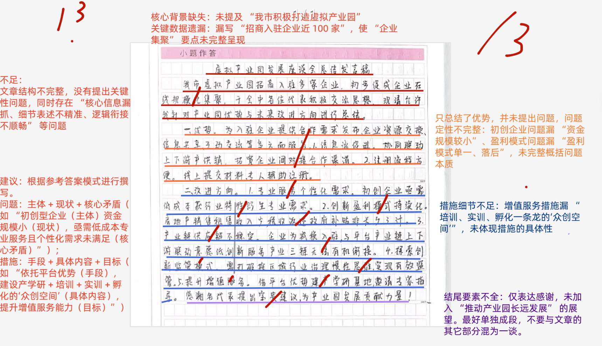
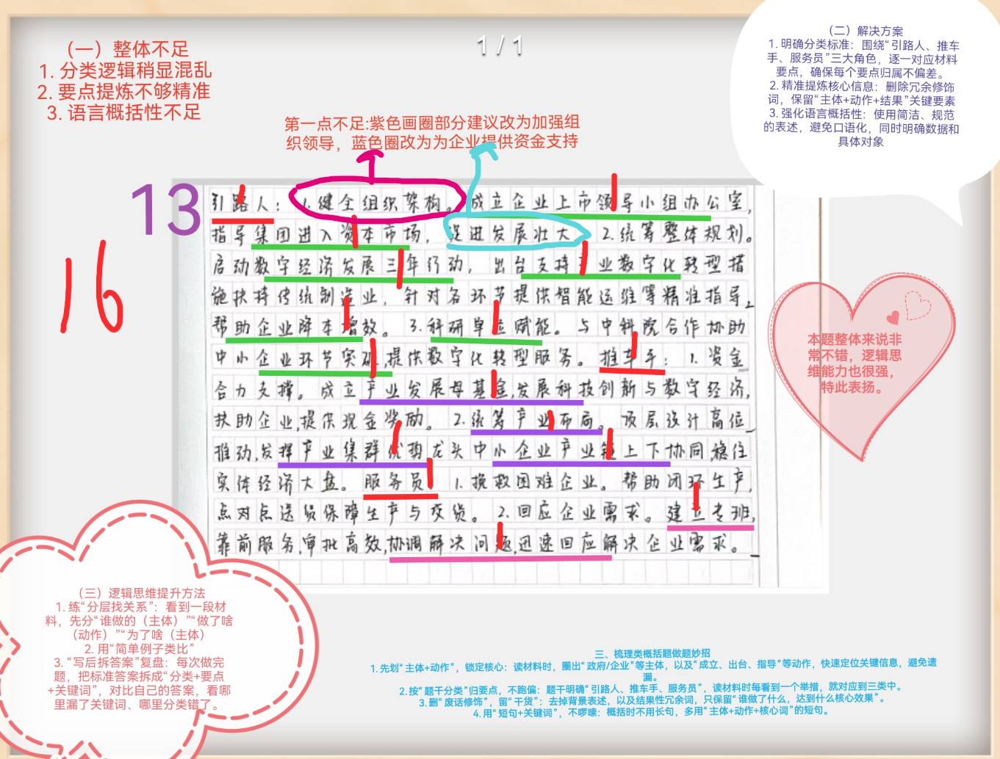
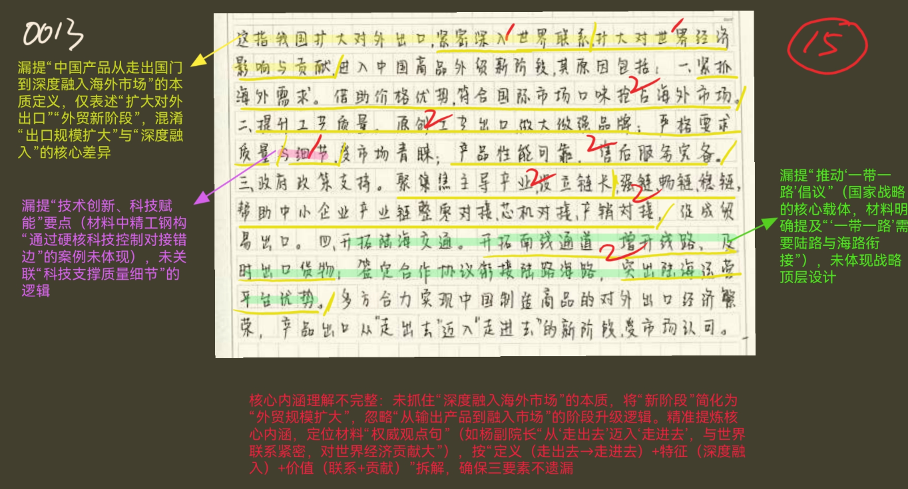
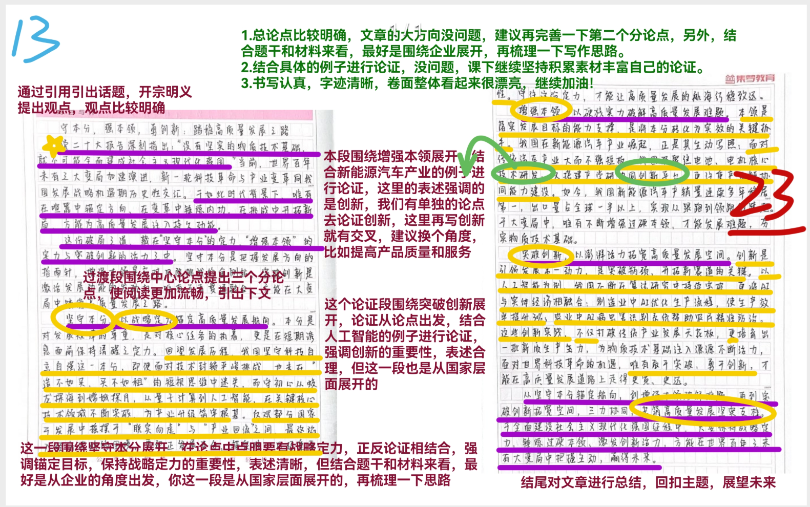

| 昵称    | Y0ungK1ng |
| ----- | --------- |
| Q1得分  | 13        |
| Q2得分  | 16        |
| Q3得分  | 15        |
| Q4得分  | 23        |
| 总分    | 67        |
| 平均分   | 59        |
| 排名    | 78        |
| 总提交人数 | 778       |

::: danger

出现多次要点混乱重复！

:::

###  **一、公文写作题**::noto:banana::

| 得分  | 总分  | 区间  |
| --- | --- | --- |
| 13  | 20  | 中   |

::: danger

1. 现状、背景、问题（3）
2. 原因、问题、危害
3. 对策、建议
4. 尾段

:::

::: card title="题干" icon="noto:backhand-index-pointing-right-dark-skin-tone"

**一、请结合“给定资料1” ，为参加座谈会的市领导拟写一份总结发言稿。（20分）**

要求：定位准确，内容全面，不考虑格式；不超过400字。

:::

::: card title="答题" icon="twemoji:astonished-face"

:::

::: card title="答案" icon="typcn:tick-outline"

打造虚拟产业园，开拓经济新蓝海---自拟，题目要求无格式，可省略

我市积极打造虚拟产业园(1)，提供企业对接合作等多方面服务，加强上下游、产供销协同联动(1)，目前招商入驻企业近100家，初步促成了企业在线规模化集聚(1)，但是也存在部分问题。

一是初创型企业资金规模较小，希望以较低成本获取法律、人力等专业服务，同时，部分企业个性化的需求未满足。(3)二是产业园盈利模式单一、落后，主要靠税收返还、政府补贴等渠道获取收入。(3)三是部分企业入驻的主要目的是减税，与平台产业链上下游联动的意愿不强，创新链、服务链与产业链之间的有机衔接未达到预期，产业链供应链缺乏稳定性。(3)

为更好促进虚拟产业园发展，要重点做好以下工作(1)：一是探索创新监管模式，打破传统业态按区域、按行业治理的惯性思维，实现有效监管； (3)二是优化增值服务，建设产学研一体化、培训、实训、孵化一条龙的“众创空间” ，邀请知名企业家、教授为创业团队提供专业意见和建议，最大化发挥平台优势。 (3)

未来，经过大家通力合作，产业园定能实现长远发展！ (合理即可，1)

:::

::: card title="反思与建议" icon="line-md:compass-loop"

**一是穿珠式**：与会人员的发言中，不乏闪光之处，但由于各人掌握的情况或认识水平的局限性，这些思想火花只是些“零珠碎玉” 。会议领导者应站在更高的层次上，用发展联系的观点，把这些“零珠碎玉”穿起来，形成有价值的会议总结。

**二是归纳式**：与会人员列举了许多互有联系的事实，但对这些事实仅处于感性认识阶段，会议领导者应运用归纳求证法，从中找出有规律性的东西。

**三是升华式**：与会人员都表述了自己的见解，但表述得都不够完善和深刻，这就需要会议领导者对众人的思想加以升华，将与会人员心中所有、口中所无的内本表达出来，使众人的认识水平上升到更高的层次。

**四是评论式**：这种方式一般用于策略性研究会议上。在与会人员充分地献计献策后，会议领导者要对这些意见作出评论，同时表明自己的态度。当然领导者在评论方案时要有分析，表态应注意方式，不要伤害与会人员的自尊心。

**五是拍板式**：当领导者做决策的各项客观因素，大家的态度已经明了时，领导者就应及时拍板定案，不可犹豫不决，丧失良机，不然就会给工作带来更大的损失。

:::

###  **二、梳理概括题**::noto:banana::

| 得分  | 总分  | 区间  |
| --- | --- | --- |
| 16  | 20  | 高   |

::: card title="题干" icon="noto:backhand-index-pointing-right-dark-skin-tone"

**二、多年来，为当好企业的“ 引路人、推车手、服务员” ，J市不断推出新举措，请根据“给定资料2” ，对此进行梳理概括。 （20分）**

要求：全面准确，条理清晰，有概括性；不超过300字。

:::

::: danger

必须按照以下3个层次进行要点划分，未划分为3个层次的或者3个层次里面的小要点对应错误的，直接扣5分！

梳理题——95% 不会整合，跳段

:::

::: card title="答题" icon="twemoji:astonished-face"

:::

::: card title="答案" icon="typcn:tick-outline"

**一、当好引路人**：
1. ==加强组织领导==(1)。成立企业上市领导小组办公室(1)，指导多家集团进入资本市场(1),为企业提供资本支持(1)；
2. ==引导企业数字化转型==(1)。启动数字经济发展三年行动，出台文件及措施，提供精准指导(1)，帮助企业降本增效(1)；共建科研单位，赋能中小企业环节突破(1)。

**二、当好推车手**：
1. ==加强资金扶持==(1)。成立产业发展母基金(1)，撬动社会资本(1)，投向科技创新和数字经济领域(1)；
2. ==发挥产业集群优势==(1)。持续产业布局(1)，龙头企业和中小企业同向发力，产业链上下游协同(1)；加强顶层设计，抢抓机遇，抢占价值链中高端(1)。

**三、当好服务员**：
1. ==提升服务效率==(1)。建立专班，靠前服务(1)，简化审批手续(1)，兑现人才补贴，及时解决企业需求(1)。

:::

::: card title="反思与建议" icon="line-md:compass-loop"

**一、答题内容**

高频规范词：加强组织领导、加强资金扶持、提升服务效率等；

**二、答题逻辑**

1.重要考点：梳理！--确保问题分类层次必须完全与参考答案一致。

:::

###  **三、综合分析题**::noto:banana::

| 得分  | 总分  | 区间  |
| --- | --- | --- |
| 15  | 20  | 中   |

::: tip

词语理解题

传统常规型（以==分析类要素==为主）
1. 含义（2行）
2. 分析——表现危害原因意义（60%以上）
3. 评价、对策（1、2行）

热门型（以==对策类要素==为主）
1. 含义（2行）
2. 分析（已经做完对策作为表现）（60%以上）
3. 评价（1、2行）

:::

::: card title="题干" icon="noto:backhand-index-pointing-right-dark-skin-tone"

**三、请结合“给定资料3” ，谈谈你对画线词语“新阶段”的理解。 （20分）**

要求：准确、深入、有条理；不超过300字。

:::

::: card title="答题" icon="twemoji:astonished-face"

:::

::: card title="答案" icon="typcn:tick-outline"

==要点分19分、逻辑分1分（分层、行文逻辑等）=={.info}

这指中国产品从走出国门，到深度融入海外市场的阶段(1)，与世界的联系更加  紧密深入(1)，对世界经济的影响和贡献巨大(1)。体现在：

1. 企业自身优势明显。价格优势明显，产品种类、品质符合国际市场需求(2)； 打造自主品牌，提升产品工艺、质量(2)；推动==技术创新==、==科技赋能==，注重细节(2)。 性能可靠、服务完备，完善公共服务。 (2)
2. 政府大力支持。完善产业链(2)，加强强链、畅链、稳链(2)，聚焦主导产业， 为产业链设立链长，助推上下游企业合作与对接。
3. 国家战略明确。推动“一带一路”倡议(2)，加强陆海运输衔接(2)，提升陆  海运营平台优势，助力企业开拓通道、增开线路，确保产品运送。

总之，中国产品出口从“走出去”迈入“走进去” ，让“ 中国制造”随处可见。

:::

::: card title="反思与建议" icon="line-md:compass-loop"

**一、答题内容**

侧重于句子 本意解释 + 分析论证（4大层面），关键词要提炼精准、规范

**二、答题逻辑**

1. 作答思路： 解释（2-3行） - 分析（主体） - 评价（1-2行、分情况省略）

2. 技巧点拨：

1） “总分总”结构：开头点明核心观点（解释/判断），中间多角度分析（可按主  体、时间、空间等维度），结尾总结或提对策。但个别题目可省略结尾，按“总-分”  结构呈现答案。

2）规范表述：语言简洁，避免口语化；200字以上题目建议分条呈现，层次清晰。

3）结合材料：以材料为依据，避免主观臆断，适当引用原文关键词句。

**三、作答技巧**——词句理解题3个考点--3种情况：

1. 传统型分析题 ---18年之前

划完要点后，要点以分析类要素（BX/T/Y/W/yy）为主

==》是什么-为什么-怎么办

2. 最新型分析题/热门型分析题---19年以后

划完要点后，要点以对策类要素为主

==》扩展    已经干完的对策--- 叫做 表现（BX）

当下及未来做的--- 叫做 做法/对策/建议

===》技巧:  对策前置当表现

3. 特殊型/小众型分析题---一般出现在“句子理解题” ，给定语句出现明显的分层

:::

###  **四、大写作**::noto:banana::

| 得分  | 总分  | 区间  |
| --- | --- | --- |
| 23  | 40  | 中   |

::: danger

1. 总分论点正确基准分为23；

2. 总论点正确、分论点部分正确基准分为23分。分论点就是范文中这3个，写其他的也算合理，但不是最佳，酌情给分；

3. 根据学生的文采、卷面等在基准分线浮动1-2分；特别优秀的文章可多加分，但极少会出现这种情况；

4. 写得不错的作文控制在22-25；写得确实好的给25-26，最高分不得超过26分；写得比较差的给18-21；跑题的直接10分。

分论点抓准！！

:::

::: card title="题干" icon="noto:backhand-index-pointing-right-dark-skin-tone"

**四、 “给定资料6”提到“在大变局的喧嚣中始终坚守住‘本分’ ，切实增强好‘本领’ ，不断突破创新，推动高质量发展的步伐就能坚实稳健，我们就能走向广阔的未来” ，请结合对这句话的理解，联系实际，自选角度，自拟题目，写一篇文章。（40分）**

s

要求：观点明确，见解深刻，思路清晰，结构完整，语言流畅；参考给定资
料，但不拘泥于给定资料；1000-1200字。

:::

::: card title="答题" icon="twemoji:astonished-face"

:::

::: card title="答案" icon="typcn:tick-outline"

结构1：

坚守“本分”——坚定目标，推进企业发展        

增强“本领”——改进质量和服务

突破创新

结构2：

坚守“本分”——坚定目标，推进企业发展

增强“本领”——改进质量和服务+突破创新

结构3：

坚守“本分”——坚定目标，推进企业发展        

增强“本领”——改进质量和服务+突破创新

推进高质量发展——坚守“本分”+ 增强“本领”  

结构4：

坚守“本分”——坚定目标，推进企业发展

增强“本领”1——改进质量和服务

增强“本领”2——突破创新

  <h4>推动高质量发展的三大路径 

——坚守本分 增强本领 突破创新
</h4>

十九大报告中提出，==高质量发展==，是新时代我国经济转型升级的综合体现， 是强国之基、立业之本和转型之要。然而，我国企业现实发展中，还有不少理念和思路不适应新的发展要求。一些企业出于自主创新费时费力的懒汉心理，不看长远、只顾眼前的短视思维，仍然沿袭简单模仿、低成本竞争的老套路。按照这种老套路走下去，企业最终难免被市场淘汰出局。新形势下，企业必须深刻把握高质量发展的新特征新要求，走好高质量发展的新路子。

守住“本分” ，意味着要坚定目标，推进企业发展。方向明，干劲足。习近
平总书记强调，做企业、做事业，不是仅仅赚几个钱的问题，要充分理解企业安身立命的诀窍是坚守本分。正如文中D集团始终立足实业，坚守本分，通过加大对主业投入、并且提高研发投入，最终成长为全球第三大体育用品集团。当然近年来，国际局势的不稳定性不确定性上升，致使一些制造业企业特别是出口企业遇到困难。但面对当前经济下行的压力，我们更要摒弃浮躁、杜绝盲目跟风，保持本色、锚定目标，坚守做实业这个“本分”。

增强“本领” ，意味着要改进质量和服务。打铁还需自身硬，企业发展靠品
质。我们处在前所未有的变革时代，也面临从未有过的新情况、新矛盾、新问 题。这就需要企业洞察经济运行之“形” ，精准判断经济发展之“势” 。正如航天科工集团，航天技术工人对专业技术的追求几近痴迷，夜以继日研究、总结出一套“绝活” ，练好航天人的看家本领，既成就了技术工人自己，也成就了行业，全厂关键工序质量合格率连续十年稳定保持在100%的水平，成为集团的质量名片。因此，增强好“本领”是高质量发展的压舱石。

突破创新，抢占引领未来发展的科技制高点。理念决定思路，思路引导行动。
正可谓科研创新是企业高质量发展的关键，从五粮液围绕高水平科研下功夫，
坚持传统工艺与科技创新相结合，以科研创新培育企业发展新动能到比亚迪坚  持加大研发投入，持续进行技术创新，推出了具有领先技术的新能源汽车产品， 让中国汽车品牌了成为世界舞台上的佼佼者。都深刻启示我们，抓创新就是抓  发展，谋创新就是谋未来，以科技创新引领产业变革、提升产业能级，高质量  发展的动能必将更加澎湃有力。

“知之非艰，行之惟难。 ”高质量发展是“ 中国号” 巨轮必须面对也一定要
驶过的关口。纵然时代喧嚣，变局复杂，只要以坚守“本分 ”为前提，增强 “本领”为保障，不断突破创新为动力，打好这一套高质量发展的组合拳，我们必定能够越激流、涉险滩，战胜一切艰难险阻，使经济高质量发展这艘巨轮，驶向更加宽广辽阔的水域。

:::

# 守本分 强本领 勇创新：踏稳高质量发展之路

党的二十大报告深刻指出：“没有坚实的物质技术基础，就不可能全面建成社会主义现代化强国。” 当前，世界百年未有之大变局加速演进，新一轮科技革命与产业变革同我国发展的战略机遇期历史性交汇。于如此时代背景下，唯有在喧嚣中锚定方向、在变革中锤炼内功、在挑战中开拓新局，方能为高质量发展注入持久动能。

这份破局之道，藏在 “坚守本分” 的定力、“增强本领” 的实力与 “突破创新” 的活力之中。坚守本分是把握发展方向的 “指南针”，确保在复杂环境中不偏航；增强本领是应对风险挑战的 “金刚钻”，为产业升级提供硬支撑；突破创新是激活发展动能的 “发动机”，推动生产力水平实现新跃升。唯有将三者贯通融合，才能在大变局中踏出稳健步伐，驶向社会主义现代化强国的广阔未来。

坚守本分，以战略定力锚定高质量发展航向。“本分”是对发展规律的尊重，是对核心任务的执着，更是在短期诱惑面前保持清醒的定力。回望十余年发展历程，我国始终坚守 “科技自立自强” 这一 “本分”，即便面对技术封锁的严峻挑战，也未在 “造不如买、买不如租” 的短视思维中迷失，而是持续加大基础研究投入，从 “蛟龙” 探海到 “嫦娥” 探月，从量子计算到人工智能，在关键核心技术领域不断突破，为产业升级筑牢根基。反观部分国家在发展中摇摆于 “脱实向虚” 与 “产业回流” 之间，最终陷入经济波动的困境，更印证坚守发展 “本分”、锚定核心目标的重要性。守住这份定力，才能让高质量发展的航船行稳致远。

增强本领，以硬核实力破解高质量发展难题。“本领” 是落实发展目标的能力支撑，是将 “本分” 转化为实效的关键抓手。我国在新能源汽车产业的崛起，正是 “增强本领” 的生动写照：面对传统汽车产业 “大而不强” 的短板，我国既聚焦电池、电机等核心技术研发，培育出一批掌握关键专利的企业；又搭建产学研协同创新平台，推动高校、科研院所与企业联合攻关，攻克续航里程、充电效率等痛点；更注重产业链协同能力建设，形成从上游材料到下游整车制造的完整产业链条。如今，我国新能源汽车产销量连续多年位居全球第一，出口量占全球一半以上，实现了从 “跟跑” 到 “领跑” 的跨越。在大变局中，唯有不断增强过硬本领，才能破解发展难题，夯实物质技术基础。

突破创新，以澎湃活力拓宽高质量发展空间。创新是引领发展的第一动力，是突破技术瓶颈、开辟产业新赛道的关键。以人工智能领域为例，我国不仅在算法研究上持续突破，更将 AI 技术与实体经济深度融合：在制造业，智能工厂通过 AI 优化生产流程，使生产效率提升 30% 以上；在农业，AI 病虫害识别系统帮助农民精准防治，减少农药使用量的同时提高作物产量。这些创新实践，不仅打破了传统产业发展的天花板，更培育出一批新质生产力，为物质技术基础注入源源不断的活力。面对世界科技革命的机遇，唯有敢于突破、勇于创新，才能在高质量发展的道路上走得更宽、更远。

从坚守本分锚定航向，到增强本领破解难题，再到突破创新拓宽空间，“三力” 协同发力，共同构筑起高质量发展的坚实支柱。在全面建设社会主义现代化强国的征程中，只要我们始终保持战略定力、锤炼过硬本领、激发创新活力，就一定能筑牢坚实的物质技术基础，在世界百年未有之大变局中把握主动、赢得未来，让社会主义现代化强国的宏伟蓝图变为美好现实。