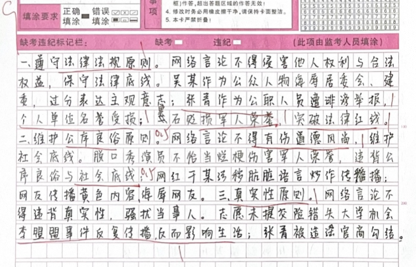
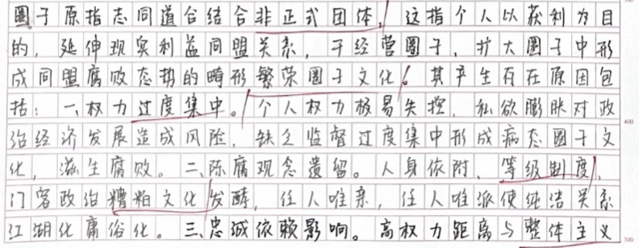
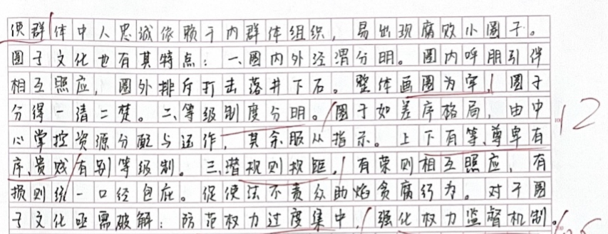
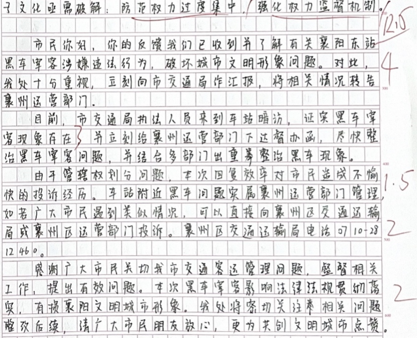
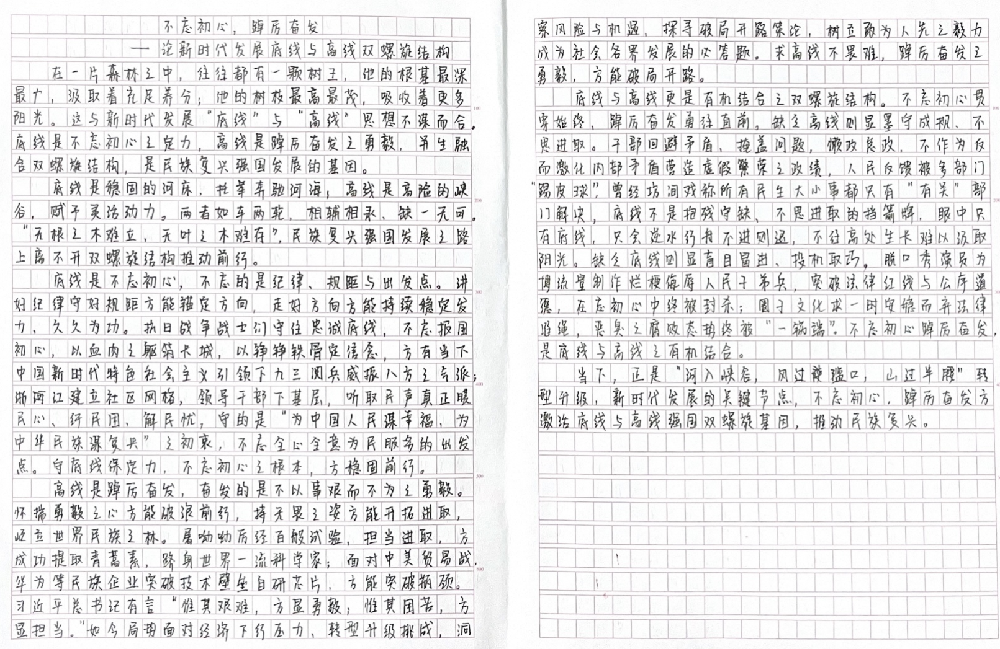

| 昵称    | Y0ungK1ng |
| ----- | --------- |
| Q1得分  | 9         |
| Q2得分  | 12        |
| Q3得分  | 12.5      |
| Q4得分  | 25        |
| 总分    | 58.5      |
| 平均分   | -         |
| 排名    | 513       |

::: danger

按照材料分，不要自行分点

:::

###  **一、现象概括题**::noto:banana::

| 得分  | 总分  | 区间  |
| --- | --- | --- |
| 9   | 15  | 中   |

::: danger

每段一点，想复杂了

:::

::: card title="题干" icon="noto:backhand-index-pointing-right-dark-skin-tone"

**一、请认真阅读“给定资料 1”，指出网络言论应该坚守哪些原则，并对相应的案例背景予以概括。（15 分）**

要求：准确、全面、简洁，不超过 250 字。

:::

::: card title="答题" icon="twemoji:astonished-face"

:::

::: card title="答案" icon="typcn:tick-outline"

1. ==尊重法律法规/尊重法律底线==（1 分）。女歌手吴某发布“炸建委”微博/不当言论（1 分），违反相关法律被依法追究责任（1 分，拘留 15 日/行政处罚给 0.5 分）。

2. ==尊重/维护公民合法权益==（1 分）。中部某地级市一名司法局局长张青被诬陷/举报澄清（1 分），个人/权益受侵害/公民名誉受损（1 分）。

3. ==遵守公序良俗、社会底线==（写全：1 分,只写其中一个 0.5 分）。脱口秀演员 house的言论贬损军人荣誉（1 分），突破公序良俗与社会底线，涉嫌突破法律红线问题（1分）。

4. ==遵守道德风尚/遵守道德原则==（1 分）。干某录制节目时谩骂观众/低俗用语（0.5分），虽未播出但却借助网络平台随意传播（0.5 分，强调平台造势或助推等意思才能得分），有损社会道德风尚（1 分）。

5. ==保证信息真实性/信息客观真实性==（1 分）。高考生李盟盟求助网友成功考入大学后，每逢高考季，该失去真实性的求助信息依然被疯狂转发/失真信息被大量转发和评论（1 分），干扰其正常生活/对当事人造成困扰（1 分）。

:::

::: card title="反思与建议" icon="line-md:compass-loop"

评分说明：每个原则 1 分【原则在案例后不给分】，案例和带来的影响各 1 分，考生将案例放一起写也可得分

:::

###  **二、综合分析题**::noto:banana::

| 得分  | 总分  | 区间  |
| --- | --- | --- |
| 12  | 20  | 中   |

::: card title="题干" icon="noto:backhand-index-pointing-right-dark-skin-tone"

**二、请结合“给定资料 2”，谈一谈对文中“圈子文化”的理解。（20 分）**

要求：全面准确，分析透彻，不超过 400 字。

:::

::: danger

不要写废话

:::

::: card title="答题" icon="twemoji:astonished-face"

:::

::: card title="答案" icon="typcn:tick-outline"

一、理解（共 3 分）：【理解有两层意思，分别给分】

1. 原义：人与人因为相同兴趣、经历或其他目的而结合成的非正式团体。（1 分）（原文意思相近，如“志趣相投的非正式团体”即可给分）

2. 本质是指：脱离了志趣的主题和情感的表达。（1 分）（原文原话，“脱离、志趣、情感”写到既可得分）；以及官官勾结、官商勾结，权力变现获利链条上的朋友圈/个人利益关系同盟【1 分，提到获利链条/利益同盟才能给分，只有这个点后面出现也可得分，不要重复给分！！】

二、分析（共 14 分）：

原因：

1. 存在“圈子文化”的地方或部门权力过度集中；（2 分，意思相近得 1 分）；
2. 从源头上看是专制主义糟粕的残留/源头是，专制主义未完全肃清，在今天仍有发酵/延续糟粕文化；（2 分，其中专制主义、糟粕文化各 1 分）；
3. 中国是个高权力距离国家（1分），整体主义思维文化（1 分）

特点（学生不一定理解的是特点，只要写到即可给分）：

1. 界限分明 / 画圈为牢 / 水泼不进、针插不入 / 圈内外是两重天。（2 分，任意抄到哪一种表达均可给分）；
2. 讲究中心/ 等级分明 /存在“上下有等、尊卑有序、贵贱有别”的等级制。（2 分，任意抄到哪一种表达均可给分）；
3. 强调规矩/潜规则（2 分，提到规矩即可给分）。

影响：

这样畸形的“圈子文化”如果任其发展，将是对组织纪律的严重挑战（1 分），将对党的事业和党的组织造成极大的伤害。（1 分）

三、结论（共 3 分）：

1. 防范权力过度集中（1 分），强化权力监督机制（1 分）；
2. 积极加强宣传教育，防微杜渐。（1 分，宣传引导/宣传教育，意思相近即可给分）

:::

::: card title="反思与建议" icon="line-md:compass-loop"

废话连篇

:::

###  **三、公文写作题**::noto:banana::

| 得分   | 总分  | 区间  |
| ---- | --- | --- |
| 12.5 | 20  | 低   |

::: tip

格式问题

:::

::: card title="题干" icon="noto:backhand-index-pointing-right-dark-skin-tone"

**三、“给定资料 3”中，政府工作人员的“神回复”被质疑是“踢皮球”，造成市民不满。假如你是襄阳市客运管理处的一名工作人员，请你对市民反映的问题进行回复。**（25 分）

要求：

（1）观点明确，内容合理；

（2）格式正确，条理清楚；

（3）结构完整，语言准确；

（4）不超过 450 字。

:::

::: card title="答题" icon="twemoji:astonished-face"

:::

::: card title="答案" icon="typcn:tick-outline"

标题： 关于“襄阳东站黑车宰客”问题的回复 （2 分：关于……的回复意思相近既可，只写回复/对 xxx 的回复这种表述给 1 分）

亲爱的市民朋友：（1 分：必须顶格书写，单独成行，否则不给分，将市民主体合理表达既可）

您好！关于您投诉的“襄阳东站黑车宰客”问题（1 分）我们==已收悉/已经了解/已经知晓/高度重视==（1 分），==现答复如下==（1 分，有衔接表述可得分）

（1）你反映的襄阳东站==黑车问题确实存在==。（3 分，黑车问题存在 3 分，问题存在/东站问题存在 1 分）

（2）我们会==尽快将此事汇报给市交通局==（1 分，体现汇报流程可得分），并将相关情况转告给==襄州运营部门==（1 分，体现转交流程可得分）。加大执法力度，==尽快给您一个满意的答复==。（1 分，交代答复可得分）

（3）关于投诉渠道，按照管辖权划分，襄阳东站的出租车由市客运管理处管理（1.5分），东站附近的黑车由襄州运管部门管理（1.5 分）

（4）万一以后再遇到类似情况，==为了让您可以更快捷地反映问题和解决问题==。【1分，“方便后续投诉 / 关注后续结果”，意思相似的目的可得分）==请下次直接向襄州区
交通运输局或襄州区运管部门进行投诉。襄州区交通运输局电话 0710-2812460==。（2 分，投诉部门 1 分，精准电话号码 1 分）

结尾：

襄阳东站是城市文明形象的窗口，黑车宰客有损襄阳形象。（1 分，提到“对城市形象影响”可得分）我们会加大执法力度，给乘客一个安心的乘车环境。（2 分，承诺加大执法可得分）；感谢您及时反映黑车宰客问题，也希望您对于政府相关工作给与理解和支持。（2 分—一般回复都会有感谢反馈问题或致歉，希望理解和支持）

襄阳市客运管理处（1 分）

XX 年 X 月 X 日（1 分）

:::

::: card title="反思与建议" icon="line-md:compass-loop"

格式错误，给改卷造成印象差，有些采分点就会被遗漏！！

:::

###  **四、大写作**::noto:banana::

| 得分  | 总分  | 区间  |
| --- | --- | --- |
| 25  | 40  | 中   |

::: danger

1. 总分论点正确基准分为23；

2. 总论点正确、分论点部分正确基准分为23分。分论点就是范文中这3个，写其他的也算合理，但不是最佳，酌情给分；

3. 根据学生的文采、卷面等在基准分线浮动1-2分；特别优秀的文章可多加分，但极少会出现这种情况；

4. 写得不错的作文控制在22-25；写得确实好的给25-26，最高分不得超过26分；写得比较差的给18-21；跑题的直接10分。

分论点抓准！！

:::

::: card title="题干" icon="noto:backhand-index-pointing-right-dark-skin-tone"

**四、请结合对全部给定资料的理解和思考，以“‘底线’与‘高线’”为话题，自选角度，自拟题目，写一篇文章。（40 分）**

要求：

（1）观点明确，立意深刻；

（2）思路清晰，语言流畅；

（3）结合“给定资料”，但不拘泥于“给定资料”；

（4）总字数 1000～1200 字。

:::

::: card title="答题" icon="twemoji:astonished-face"

:::

::: card title="答案" icon="typcn:tick-outline"

  <h4>底线思维内含高线追求
</h4>

每一个人，都有自己做人的标准，绝对不能做的，视为底线；要去追求达到的，视为高线。对于领导干部而言，底线和高线，外显于他们的言行举止，内化于他们的理想追求。每一位领导干部都应具有底线思维与高线追求，以此规范自身言行，在确保底线不触碰的前提下，不断追求高线标准。

当前，少数领导干部为官不作为、遇事“踢皮球”、搞“圈子文化”。实际上，这是对底线思维的极大误解。须知，底线思维是我们有条不紊地开展工作的重要思维方式，底线思维立足于守底线，但追求的是达高线。

底线思维包含对“担当精神”的高线追求。有人以为，守底线就是不犯错误，进而信奉宁可不做事也不能惹事。湖北襄阳市政府工作人员的“神回复”被质疑是“踢皮球”，造成市民不满，正是一种缺乏担当精神的表现。事实上，底线思维要求讲纪律、守规矩，为人做事不越红线，但并非让人不做事，而是应该在坚持原则的基础上勇于担当、甘于奉献。例如，全面建成小康社会推进过程中，确保农村贫困人口全部脱贫是最硬的底线。如果没有担当精神，不深入贫困地区，了解贫困原因，如何能实现足以载入史册的伟大成绩？因此，底线思维虽然立足于守底线，但追求的是高线，要求各级领导干部遇事不逃避，有作为。

底线思维包含对“进取意识”的高线追求。底线光靠守是守不住的，进攻是最好的防守。当前，官场“圈子文化”盛行，官商关系灰色化，如果任其发展，将对党的事业和党的组织造成极大伤害。因此，必须主动出击，强化权力监督机制，守住政治底线。在经济新常态下，必须贯彻新理念、运用借助互联网“下基层”，听取民意、接纳民怨，化解现实中的矛盾，不断提升社会治理能力的同时，坚守网络真实信息的发布者的严格标准，坚守网络的底线，为净化网络空间做好表率作用。

底线思维包含对“开放思维”的高线追求。有人以为，守底线就是只扫自家门前雪、种好自己的一亩三分地。底线思维要求明确警戒线，但并非闭关自守，而是要海纳百川，在开放包容中增强自身实力。全国互联网大会提出应该坚守的原则是底线，但也允许市民在这基础上畅所欲言。同理，在经济全球化深入发展、我国深度融入世界经济的大趋势下，我国必须提高对外开放水平、发展更高层次的开放型经济，才能建成经济强国。可见，底线思维正确的做法是在开放中增强自身实力和抵御风险能力。

道德“高线”和纪律“底线”划出了干部为官的“安全圈”，领导干部只要在确保底线不触碰的前提下，不断追求高线标准，就不会走上邪路。底线思维包含着高线追求，需要广大党员干部从自身做起，勇于自我磨砺、勤于耕耘心智，也需要严格的制度规则来规制和引导，在“圈”外的花花世界诱惑面前，守得住清贫，耐得住寂寞，做到坚决不越“线”！（计空格 1159 字）

:::

一、标题：主题词明确，采用主副标题的形式。但是注意破折号的位置不对；另外议论文，不出现“论”这些词。

二、开头：采用了比喻的修辞手法引出观点，总论点清晰明确，主题突出。

三、论证：分论点角度清晰，结构合理，能够从底线和高线，以及两者之间的辩证关系来进行阐述，且论据合理充分，能结合材料和生活实际两个角度进行论证。

注意：分论点3的结尾仓促，论据表述可以适当精简，结尾丰富一下，总结前文并回扣分论点。四、结尾：采用了引言式，总结全文，概括高线底线的重要性，有亮点。五、其他：无"