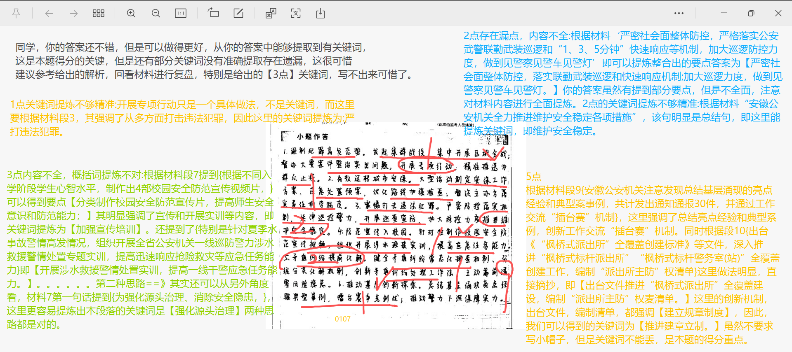
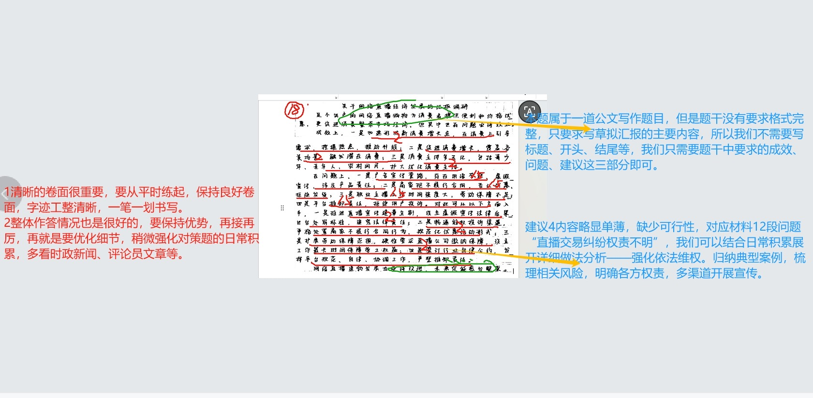
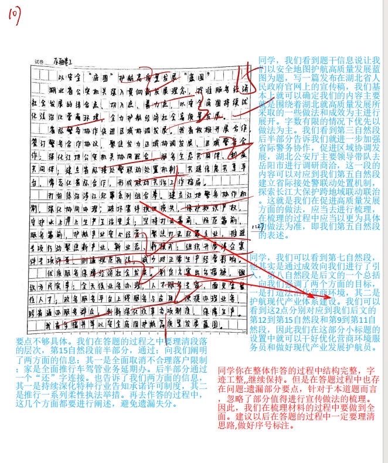
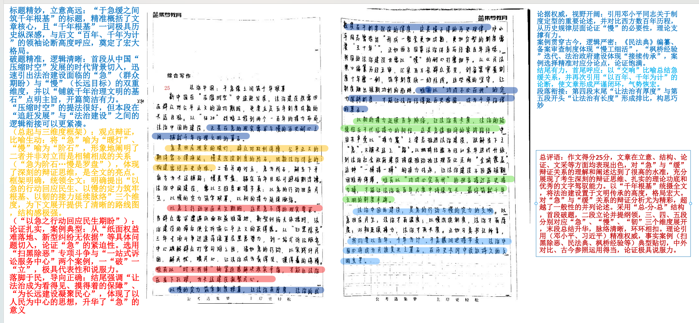

| 昵称    | Y0ungK1ng |
| ----- | --------- |
| Q1得分  | 9         |
| Q2得分  | 18        |
| Q3得分  | 15        |
| Q4得分  | 25        |
| 总分    | 67        |
| 平均分   | 55        |
| 排名    | 16        |
| 总提交人数 | 311       |

###  **一、做法概括题**::noto:banana::

| 得分  | 总分  | 区间  |
| --- | --- | --- |
| 9   | 15  | 低   |

::: tip

:::

::: card title="题干" icon="noto:backhand-index-pointing-right-dark-skin-tone"

**一、 “给定资料2”中提到“他们穿梭在摩肩接踵的人群中，用一串串脚步丈量着平安” ，请你谈谈他们是怎样用脚步丈量平安的。（15分）**

要求：全面、准确、有条理。不超过300字。

:::

::: card title="答题" icon="twemoji:astonished-face"

:::

::: card title="答案" icon="typcn:tick-outline"

**集梦1**：

1. 严打违法犯罪。统一集群战役、集中开展区域会战；督办大要案件，开展专项行动，抓获犯罪嫌疑人。

2. 维护安全稳定。严密社会面整体防控，落实联勤武装巡逻和快速响应机制；加大巡逻力度，做到见警察见警车见警灯/打造“三见警”巡防机制。

3. 加强宣传培训。分类制作校园安全防范宣传片，提高师生安全意识和防范能力；开展涉水救援警情处置实训，提高一线干警应急任务能力。

4. 调解矛盾纠纷。坚持发展“枫桥经验” 、 “六尺巷”经验，创新“五步五类”工作法，健全常态化排查和分级分类化解机制。

5. 推进建章立制。出台文件推进“枫桥式派出所”全覆盖建设，编制“派出所主防”权责清单；总结亮点经验和典型案例，创新工作交流“擂台赛”机制。

:::

::: card title="反思与建议" icon="line-md:compass-loop"

帽子分极其重要

:::       

::: card title="总结答案" icon="typcn:tick-outline"

**Y0ungK1ng**：

1. 严打违法犯罪。发起集群战役、集中开展区域会战；督办大要案件，开展专项行动，遏制犯罪高发态势；精准推送为群众止损。
2. 维护安全稳定。严密社会面整体防控，落实武装巡逻和快速响应机制，加大巡逻力度，打造“三见警”巡防机制。
3. 加强宣传培训。分类制作校园安全防范宣传片，提升安全防范意识；开展涉水救援警情处置实训，提高应急任务能力。
4. 化解矛盾纠纷。坚持发展“枫桥经验”、“六尺巷”经验，创新五步五类工作法，健全矛盾纠纷分类化解机制，主动靠前清零风险。
5. 推动建章立制。总结基层涌现亮点经验典型事例，擂台赛争先创优；出台文件推进枫桥派出所全覆盖，编制派出所主防权责清单，推进警力下沉。

:::

###  **二、分析原因题**::noto:banana::

| 得分  | 总分  | 区间  |
| --- | --- | --- |
| 18  | 20  | 高   |

::: card title="题干" icon="noto:backhand-index-pointing-right-dark-skin-tone"

**二、 “给定材料2”反映了网络直播经济发展的一些情况，调研结束后，督导调研组拟向局领导汇报调研情况，并提出改进建议。假如你是调研组成员，请草拟汇报的主要内容。（20分）**

要求：（1）成效和问题梳理全面、准确；（2）语言简洁，条理清晰；（3）不超过400字。

:::

::: tip

:::

::: card title="答题" icon="twemoji:astonished-face"

:::

::: card title="答案" icon="typcn:tick-outline"

**集梦**：

成效：
1. 新热潮，数字消费增长点不断涌现。引导消费需求、挖掘消费热点、推动消费级；
2. 新模式，数字消费场景持续拓展。覆盖各类消费场景，触发潜在消费；
3. 新势力，数字消费群体日益崛起。用户群体打破年龄、性别、地域等因素限制，消费用户基数扩大。

问题：
1. 套路营销、虚假宣传，实物与宣传不符；
2. 促销活动五花八门，优惠权益难以兑现，激化矛盾；
3. 从业者/主播工作强度高，劳动保障不足；
4. 直播交易权责归属不清晰，消费者维权难。

建议：
1. 保障商品质量。商家诚信经营，全面真实地披露商品信息；平台优化商品审核机制，落实主播带货监管。
2. 全力兑现权益。商家依法依约兑现售后承诺；平台推行优惠活动准入金机制，保障消费者信赖利益。
3. 完善劳动保障。完善社会保障体系，加强技能培养，优化绩效考核，激励主播人才健康发展。
4. 强化依法维权。归纳典型案例，梳理相关风险，明确各方权责，多渠道开展宣传。

:::

::: card title="反思与建议" icon="line-md:compass-loop"

草拟主要内容，就不需要格式了！！

:::

::: card title="总结答案" icon="typcn:tick-outline"

**Y0ungK1ng**：

成效：
1. 加速形成新消费增长点，引导需求、挖掘热点、推动升级。
2. 消费场景拓展化，触发潜在消费，促进消费增长。
3. 消费主体多元化，用户群体打破年龄、性别、地域限制，消费用户基数扩大。

问题：
1. 套路营销，存在用语夸张、虚假宣传，涉及产品责任。
2. 促销规则复杂，优惠权益兑现难，引发消费矛盾。
3. 从业者工作强度大，劳动保障不足。
4. 直播交易权责界定模糊，消费者维权阻碍多。

建议：
1. 严把质量与营销关。商家诚信经营，全面真实准确披露商品信息；平台优化商品审核机制，强化主播带货监管，明确主播连带责任，设立行业黑名单公开展示。
2. 规范促销行为。商家简化促销规则，严格依法兑现售后与优惠承诺；平台推行促销活动准入金与保证金制度，对违约商家用保证金划拨补偿消费者。
3. 完善劳动保障。相关部门出台劳动保障完善法规；搭建技能培养平台，提升从业者专业素养；督促机构缴纳社保，合理制定工作时长与绩效考核制度。
4. 强化依法维权。归纳典型案例，梳理风险，明确权责边界，多渠道开展宣传；建立多部门联动维权机制，简化维权流程，推行线上举证、快速调解模式。

:::

###  **三、公文写作题**::noto:banana::

| 得分  | 总分  | 区间  |
| --- | --- | --- |
| 15  | 25  | 低   |

::: warning

:::

::: card title="题干" icon="noto:backhand-index-pointing-right-dark-skin-tone"

**三、假如你是N市法律援助中心的工作人员小赵，根据“给定资料3” ，请针对此次调研中发现的主要问题，撰写一份工作建议。（25分）**

要求：

（1）问题梳理全面、准确；

（2）所提建议有针对性、切实可行；

（3）不超过500字。

:::

::: card title="答题" icon="twemoji:astonished-face"

:::

::: card title="答案" icon="typcn:tick-outline"

**集梦**：

以安全“底图”护航高质量发展“蓝图”

近年来，湖北省公安机关贯彻新发展理念，找准服务经济社会发展结合点、切入点、着力点，持续优化法治化营商环境，全力护航经济社会高质量发展。

当好区域协同联动“协调员” 。完善区域警务协作、江地公安机关协同配合等机制，促进区域协调发展，通过建立省际接处警联动处置机制，探索“长江大保护”跨地域联动联治，创新工作格局，更好服务生态共同体和利益共同体建设。

做好现代产业发展“护航员” 。聚焦打击犯罪主业，全面落实打击目标和侦办要求，推进专项行动，严厉打击突出犯罪活动；组织开展涉企案件专项评查，倒逼全警规范开展涉企案件执法；在重点企业、工业园区设立警务室，安排警力常态驻守，保障安全生产。

干好优化营商环境“服务员” 。出台政策，开展为民服务实事，打造市场化、法治化、国际化一流营商环境；打造线上政务服务平台，实现“一站式”网办、 “跨省通办” ；全面取消不合理落户限制、推行车驾管业务“延期办” 、深化特种行业告知承诺许可制度、推行柔性执法举措等举措，惠及全省企业和群众。

湖北公安向促进区域协调发展、保障现代化产业体系建设、优化营商环境等聚焦发力，正以安全“底图”保障经济社会发展“蓝图” 。

:::

::: card title="反思与建议" icon="line-md:compass-loop"

材料梳理能力欠缺！

:::

::: card title="总结答案" icon="typcn:tick-outline"

**Y0ungK1ng**：

以安全 “底图” 护航高质量发展 “蓝图”

湖北省公安机关深入贯彻新发展理念，找准服务经济社会发展结合点、切入点、着力点，以安全底图持续优化法治化营商环境，全力护航经济社会高质量发展。

深化协同联动，凝聚护发展合力。完善区域警务协作、江地公安机关协同配合机制，促进区域协调发展；建立省际接处警联动处置机制，探索长江大保护跨地域联动联治，创新工作格局，更好服务共同体建设。

筑牢安全屏障，护航产业发展。聚焦打击犯罪主业，全面落实打击目标和侦办要求，推进专项行动，严厉打击突出犯罪活动；组织开展涉企案件专项评查，倒逼全警规范开展涉企案件执法；在重点企业、工业园区设立警务室，保障安全生产。

优化服务举措，厚植营商沃土。出台政策，开展为民服务实事，打造市场化、法治化、国际化一流营商环境；全天候业务办理，人才服务专窗、面见室，留住高端人次；打造线上政务服务平台，实现“一站式”网办、跨省通办；全面取消不合理落户限制，多措并举惠及全省企业和群众。

湖北公安向深化协同联动，护航产业发展、厚植营商沃土等聚焦发力，正以安全底图保障经济社会发展蓝图。

:::

###  **四、大写作**::noto:banana::

| 得分  | 总分  | 区间  |
| --- | --- | --- |
| 25  | 40  | 高   |

::: tip

:::

::: card title="题干" icon="noto:backhand-index-pointing-right-dark-skin-tone"

**四、 “给定资料4”中，习近平主席道出了中国共产党人独特的的时间观：“我们对于时间的理解，不是以十年、百年为计，而是以百年、千年为计。 ”请深入思考这句话，结合给定资料，以“法治中国的建设急不得也慢不得”为主题，联系实际，自选角度，写一篇文章。（40分）**

要求：（1）观点明确，见解深刻；（2）思路清晰，语言流畅；（3）结合“给定资料” ，但不拘泥于“给定资料” ；（4）字数1000字左右。

:::

::: card title="答题" icon="twemoji:astonished-face"

:::

::: card title="答案" icon="typcn:tick-outline"

**集梦——思辨文**：

急不得也慢不得

习近平总书记指出： “一个现代化国家必然是法治国家” 。法治既是现代化进程中一个独立的构成因素，也为现代化的各领域各方面提供了制度基础和规则支撑。人类社会发展的事实证明，依法治理是最可靠、最稳定的治理，法治对于中国式现代化具有固根本、稳预期、利长远的保障作用。推动法治中国的建设，既是一场持久战，也是一场速度战，急不得也慢不得。

急不得要求我们保持千年大计的定力。法治建设是一个长期工程，需要在久久为功中实现春风化雨、润物无声。急不得，是因为法治的根基在于深入人心，它要求我们从制度设计到实践执行，每一步都需稳健而坚实。在江西， “法律明白人”阳昌绍调解起纠纷不偏不倚，村民喜欢围着听他讲法律常识、法律故事。截至目前，我国已培育420多万名“法律明白人” ，他们在基层播撒“法治的种子” 。我们每个人都要从自身做起，从小事做起，学法、知法、守法、尊法，做法律的忠实崇尚者、自觉遵守者、坚定捍卫者，定能共同谱写新时代中国法治建设新篇章。

慢不得要求我们拿出只争朝夕的干劲。然而，法治建设并非静态的完善过程，它同样需要紧跟时代的步伐，快速响应社会变革的需求。慢不得，是因为我们必须以时不我待的紧迫感，加快法治创新的步伐，用法治的力量解决新问题、应对新挑战。我们加强涉外法治建设，健全反制裁、反干涉、反“长臂管辖”机制，有效应对外部遏制打压；我们完善国家安全法治体系，在涉台、涉港、涉海等方面提升涉外法律斗争能力，有效维护国家主权、安全、发展利益等。中国式现代化要准备经受风高浪急甚至惊涛骇浪的重大考
验，离不开坚强的法治保障。

统筹好当前和长远，做到既久久为功又只争朝夕。我们既要保持定力，又要拿出干劲，这就要求我们统筹好当前和长远的关系。久久为功，意味着我们要将法治信仰融入精神世界、价值观念、生活方式，让法治成为规范行为的强大力量，成为我们的内在修养、自觉约束和生活方式，内化于心、外化于行，让法治真正落地生根。只争朝夕，则要求我们要顺应时代要求和人民意愿，在保持连续性、稳定性、权威性的前提下，推动法律不断适应新形势、吸纳新经验、确认新成果、作出新规范，以创造性的法治社会建设实践开创中国特色社会主义法治道路新境界。

法治中国的建设，既是一场持久战，需要我们保持千年大计的定力；又是一场速度战，需要我们拿出只争朝夕的干劲。以法治的力量激活新时代中国发展的活力，为中华民族的伟大复兴提供坚实的法治保障和澎湃的动能。

:::

::: card title="总结答案" icon="typcn:tick-outline"

:::

# 法治中国：于急缓之间筑千年根基

## —— 以百年尺度锚定法治建设的节奏

新中国在 “压缩时空” 中追赶发展，法治建设既需回应群众对公平正义的迫切期盼，更要立足百年制度成熟的长远目标。从 “3820” 战略工程的长远谋划，到 “两个一百年” 的接力布局，法治中国的建设，正是在 “急” 的现实需求与 “慢” 的历史耐心之间，铺就千年治理文明的基石。

“急” 是回应现实的暖灯,群众对权利保障、公平正义的期待容不得拖延；“慢” 是沉淀制度的阶石,成熟法治体系的构建需经历史淬炼。二者并非对立：“急” 是 “慢” 的基础，解当下矛盾方为长远铺路；“慢” 是 “急” 的方向，锚定百年目标可避短期浮躁。法治中国建设，需以三维度把握节奏：以 “急” 的行动回应民生，以 “慢” 的定力筑牢根基，以 “韧” 的接力延续脉络。

以 “急” 的行动回应民生期盼，让法治有温度.法治的生命力在于回应群众的 “急难愁盼”，这是 “急不得” 的现实要求。当群众遭遇 “纸面权益” 难落地、新型纠纷无依据时，法治建设的滞后便会折损公平正义的获得感。从 “扫黑除恶” 三年专项斗争迅速荡涤基层黑恶势力，到《个人信息保护法》及时回应数字时代的隐私焦虑，到 “一站式” 诉讼服务中心破解群众 “打官司难” 的痛点，这些 “急” 的行动，让法治成为群众看得见、摸得着的保障。唯有以 “时不我待” 的紧迫感解决现实矛盾，才能让法治在当下扎根，为长远建设凝聚民心。

以 “慢” 的定力筑牢制度根基，让法治有厚度.法治的成熟度在于制度沉淀的深度，这是 “慢不得” 的历史规律。邓小平同志曾指出 “形成一整套更加成熟、更加定型的制度需要三十年”，正如西方发达国家的法治体系历经数百年淬炼，我国的法治建设也需以 “慢” 的耐心打磨细节。从《民法典》编纂历经五审、汇集百万条群众意见，到备案审查制度十年磨一剑、筑牢 “制度统一的防线”.这些 “慢” 的坚守，让制度跳出 “短期功利” 的陷阱。唯有以 “功成不必在我” 的定力深耕制度，才能让法治经得起历史检验，成为千年治理的基石。

以 “韧” 的接力延续百年脉络，让法治有长度.法治的延续性在于代际接力的韧性，这是 “急缓相济” 的实践路径。中国共产党以 “接力赛” 的姿态推进法治建设，既解当下之 “急”，又铺长远之 “路”。从 “枫桥经验” 历经 60 余年迭代升级,到法治政府建设接续推动执法规范化走向 “全域覆盖”，这种 “一棒接一棒” 的传承，让法治建设既不因换一任领导而 “翻篇”，也不因遇短期困难而 “停滞”。唯有以 “功成必定有我” 的担当接过历史接力棒，才能让法治在百年尺度中持续生长，最终筑就千年文明的制度丰碑。

法治中国的建设，是 “急” 的行动与 “慢” 的定力的交响。以 “急” 回应民生，法治才有温度；以 “慢” 沉淀制度，法治才有厚度；以 “韧” 延续接力，法治才有长度。正如习近平总书记所言，“我们要以百年、千年为计”，在急缓之间把握节奏，法治中国必将成为民族复兴的坚固基石，在历史长河中绽放持久的文明光芒。