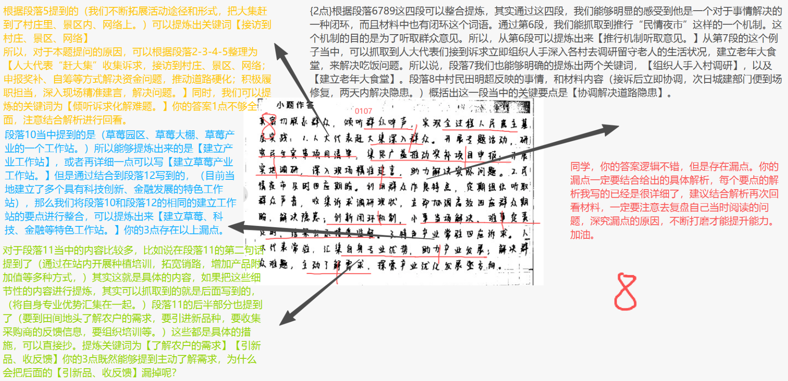
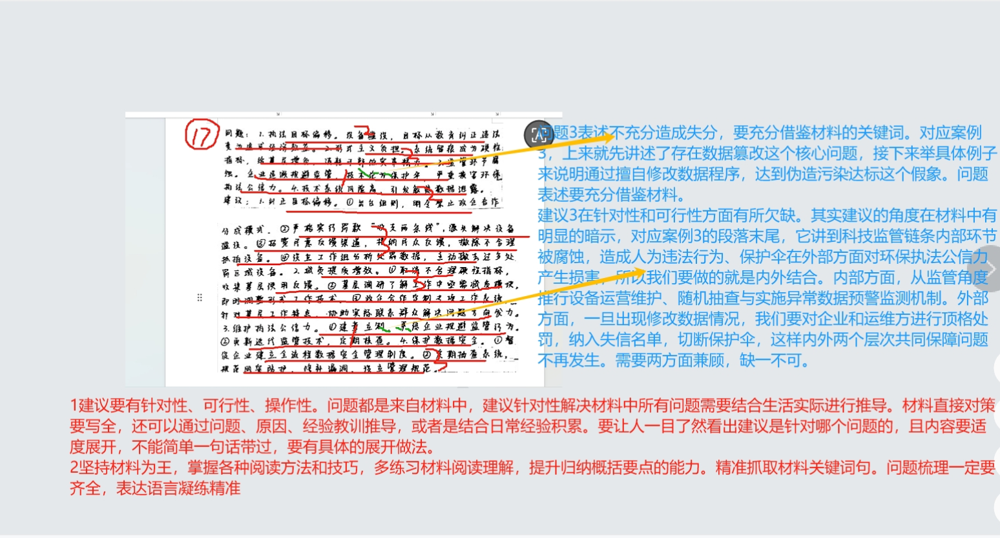
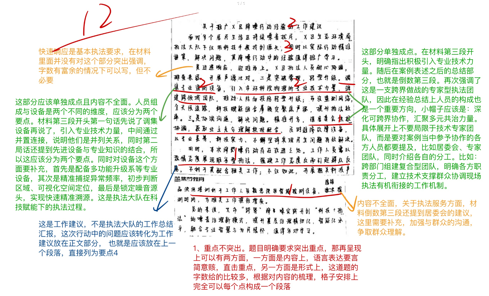
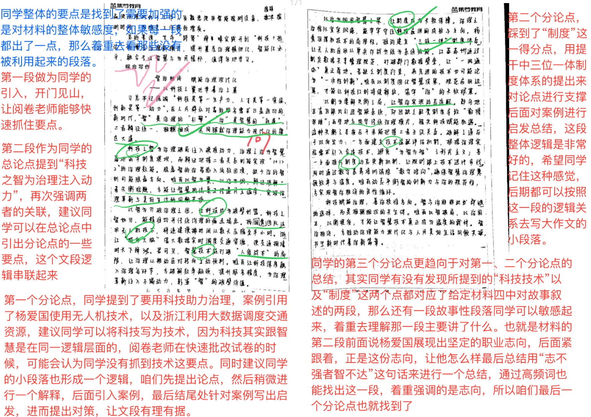

| 昵称    | Y0ungK1ng |
| ----- | --------- |
| Q1得分  | 8         |
| Q2得分  | 17        |
| Q3得分  | 12        |
| Q4得分  | 22        |
| 总分    | 59        |
| 平均分   | 57.5      |
| 排名    | 94        |
| 总提交人数 | 278       |

###  **一、原因概括题**::noto:banana::

| 得分  | 总分  | 区间  |
| --- | --- | --- |
| 8   | 15  | 低   |

::: tip

:::

::: card title="题干" icon="noto:backhand-index-pointing-right-dark-skin-tone"

**一、根据“给定资料1”，概括人大代表联络站成为人大代表联系人民群众**  
**“连心桥”的原因。（15分）**  

要求：全面，准确，条理清晰。不超过250字。

:::

::: card title="答题" icon="twemoji:astonished-face"

:::

::: card title="答案" icon="typcn:tick-outline"

**集梦1**：

1. 倾听诉求化解难题。人大代表“赶大集”收集诉求，接访到村庄、景区、网络；申报奖补、自筹等方式解决资金问题，推动道路硬化；积极履职担当，深入现场精准建言，解决问题。  
2. 建立闭环保证实效。推行“民情夜市”机制，听取群众声音；调研留守老人生活现状，推动建设老年食堂；协调解决道路隐患；建收集-交办-督办-反馈机制，小事即办、难事限时、结果公示。  
3. 发挥专长促进增收。建草莓、科技、金融等特色工作站，依托自身专业优势，开展种植培训、销路拓展、直播带货等；了解群众需求和发展方向，引新品、收反馈，助力产业发展。

:::

::: card title="反思与建议" icon="line-md:compass-loop"

找点很宽泛，要具体措施！！

:::       

::: card title="总结答案" icon="typcn:tick-outline"

**Y0ungK1ng**：

1. 倾听诉求化解难题。人民大会赶大集拓展活动途径和形式，服务延伸到村庄景区网格；专题活动研究民生实事，申报奖补项目，联动核算自筹资金补齐缺口；实地调研，精准建言，解决实际问题。
2. 及时回应落地诉求。民情夜市机制倾听群众声音，调研留守老人现状建设老年食堂，协助解决道路隐患；构建闭环机制，小事当场解决，难事定责定时，结果公示接受监督。
3. 发挥专长促进增收。建成具有专业特色的人大代表工作站，依托产业优势开展种植培训、销路拓展、直播带货；对接群众需求与发展方向，引进新品、收集反馈，助力产业发展。

:::

###  **二、分析原因题**::noto:banana::

| 得分  | 总分  | 区间  |
| --- | --- | --- |
| 17  | 20  | 高   |

::: card title="题干" icon="noto:backhand-index-pointing-right-dark-skin-tone"

**二、根据“给定资料2”，对科技应用实践中存在的问题进行梳理，并提出解决建议。（20分）** 

要求：（1）问题梳理全面、准确；（2）所提建议具体明确，有针对性，切实可行；（3）不超过400字。

:::

::: tip

:::

::: card title="答题" icon="twemoji:astonished-face"

:::

::: card title="答案" icon="typcn:tick-outline"

**集梦**：

问题1：逐利执法。企业逐利滥设设备，罚款变创收，冗余设备多。

建议：全面禁止罚款分成模式，严格执行“收支两条线”；建立设备设置合理性年度评估与动态清理制度，及时拆除冗余设备，防止执法目标异化。  

问题2：形式主义。技术成考核载体，基层摆拍应付，加重负担。

建议：取消“留痕式”硬性指标，以群众参与度、实际问题解决率为核心评价志愿服务成效，减少摆拍式任务，释放基层服务群众精力。  

问题3：伪造数据。企业篡改设备监测参数，伪造污染达标假象。

建议：推行设备运维随机抽查与实时异常数据预警，对篡改数据企业及运维方顶格处罚，并纳入失信名单，切断“保护伞”。  

问题4：安全漏洞。存在数据安全管理漏洞，导致数据泄露被窃取。

建议：出台公共数据安全管理细则，强制企业落实数据加密、分级访问控制、漏洞定期扫描等措施；开展年度安全审计，对泄露事件依法追责并公开曝光。

:::

::: card title="反思与建议" icon="line-md:compass-loop"

草拟主要内容，就不需要格式了！！

:::

::: card title="总结答案" icon="typcn:tick-outline"

**Y0ungK1ng**：

问题：1.逐利执法。企业逐利滥设设备，罚款变创收，冗余设备多。2.形式主义。技术成考核载体，基层摆拍应付，加重负担。3.伪造数据。企业篡改设备监测参数，伪造污染达标假象。4.安全漏洞。存在数据安全管理漏洞，导致数据泄露被窃取。

建议：
1. 全面禁止罚款分成模式，严格执行“收支两条线”；建立设备设置合理性年度评估与动态清理制度，及时拆除冗余设备，防止执法目标异化。  

2. 取消“留痕式”硬性指标，以群众参与度、实际问题解决率为核心评价志愿服务成效，减少摆拍式任务，释放基层服务群众精力。  

3. 推行设备运维随机抽查与实时异常数据预警，对篡改数据企业及运维方顶格处罚，并纳入失信名单，切断“保护伞”。  

4. 出台公共数据安全管理细则，强制企业落实数据加密、分级访问控制、漏洞定期扫描等措施；开展年度安全审计，对泄露事件依法追责并公开曝光。

:::

###  **三、公文写作题**::noto:banana::

| 得分  | 总分  | 区间  |
| --- | --- | --- |
| 12  | 25  | 低   |

::: warning

:::

::: card title="题干" icon="noto:backhand-index-pointing-right-dark-skin-tone"

**三、假设你是Z市生态环境局的一名工作人员，近期，你市X区执法大队成功处理了一起复杂的噪声投诉案件，其“科技+执法”的模式和成效获得了多方肯定。为推广相关经验，请你根据“给定资料3”，撰写一份推广该区“跨界”降噪行动经验的工作建议。（25分）**  

要求：（1）紧扣资料，内容完整；（2）重点突出，语言流畅；（3）字数  
不超过500字。

:::

:::

::: card title="答案" icon="typcn:tick-outline"

**集梦**：

关于推广X区“跨界”降噪工作经验的工作建议  

如今，城市噪声源隐蔽、传播复杂，传统执法难应对，X区执法大队创新“科技+执法”模式，成功破解复杂噪声溯源难题，为推广其经验，提出以下建议：  

一、强化科技赋能，精准锁定噪声源。配备多功能声级计、声学照相机等专业设备，精准捕捉异常频率、初步判断区域、可视化空间定位，锁定噪音源头，替代粗放排查，实现快速精准溯源，推动执法从“人防”向“技防”升级，提升执法效能。  

二、深化跨界协作，汇聚多元共治力量。加强与环境科研机构、街道社区、物业单位的联动协作，跨部门组建复合型团队，明确各方职责分工，建立技术支撑、群众协调、现场执法有机衔接的工作机制。  

三、优化执法服务，提升群众认同与配合。坚持为民宗旨，提前沟通争取群众理解；通过案例教学、实战演练等方式，加强执法人员设备操作培训，避免因操作生疏延长检测时间；注重柔性执法，减少入户强硬态度，提升群众配合度，促进问题顺利解决。  

建议各区结合实际，积极运用科技手段，不断创新噪声执法模式，切实解决群众身边的突出环境问题。（可省略）

:::

::: card title="反思与建议" icon="line-md:compass-loop"

:::

::: card title="总结答案" icon="typcn:tick-outline"

**Y0ungK1ng**：

:::

###  **四、大写作**::noto:banana::

| 得分  | 总分  | 区间  |
| --- | --- | --- |
| 22  | 40  | 中   |

::: tip

:::

::: card title="题干" icon="noto:backhand-index-pointing-right-dark-skin-tone"

**四、请结合“给定资料4”，根据对划线句子的理解，围绕“智与治”进行深入思考，联系实际，自拟题目，写一篇文章。（40分）**  

要求：（1）观点明确，见解深刻；（2）参考“给定资料”，但不拘泥于“给定资料”；（3）思路清晰，语言流畅；（4）字数1000～1200字。

:::

::: card title="答题" icon="twemoji:astonished-face"

:::

::: card title="答案" icon="typcn:tick-outline"

**集梦——思辨文**：

以智促治的三重逻辑——让智慧真正成为治理的引擎

古希腊哲学家亚里士多德曾言：“智慧不仅在于知道事实，更在于知道如何运用事实去实现善治。” 这句话深刻揭示了 “智” 与 “治” 的本质关联：智慧若无法转化为有序、公正、高效的治理实践，便只是闲置的潜能；而治理若缺少智慧的引领与支撑，极易陷入经验主义的桎梏与低效循环的困境。因此，唯有让 “智” 切实驱动 “治”，才能使智慧真正成为治理的持久引擎。

以智促治，驱动治理革新，当以初心锚定创新方向。治理创新始终离不开价值坐标的指引，若技术引入脱离为民服务的初心，便可能异化为 “炫技式治理”，甚至滋生新的不公与扰民问题。现代社会的治理对象是多元化、个性化的民生需求，单纯以效率为导向，难以回应群众的真实关切。例如，在城市规划与环境执法中，若仅依靠卫星影像识别违建，却忽视居民的实际安置需求与合理申诉渠道，不仅会引发群众对抗情绪，更会削弱治理的社会认同。可见，初心的核心作用在于划定技术创新的边界与优先级，让技术始终沿着增进公共利益、保障人的尊严与福祉的方向演进，从根本上避免 “智” 与 “治” 的脱节。

以智促治，驱动治理革新，当以技术重塑治理逻辑。传统治理模式多依赖人力巡查与经验判断，存在信息滞后、覆盖范围有限的短板，往往陷入 “发现晚、处置慢、成本高” 的被动循环。而智能技术的核心优势，正在于突破人力局限 —— 扩大治理感知范围、提升问题研判精度、加快响应处置速度。大数据分析能够整合多部门碎片化信息，挖掘潜在风险的时空分布规律，推动治理从 “事后补救” 转向 “事前干预”；人工智能视频分析可实现公共空间全天候监测，有效减少监管盲区与人为疏漏。这种技术嵌入并非简单的效率提升，而是对治理逻辑的系统性重构：治理不再是 “人盯人” 的体力竞赛，而是基于数据与算法的科学决策过程，为应对复杂多变的社会问题提供了全新路径。

以智促治，驱动治理革新，当以制度固化创新成果。技术创新与初心坚守若缺乏制度承接，往往只能停留在试点探索或个案突破层面，难以形成规模化效应与长效机制。制度的核心价值，在于将个体的智慧实践、局部的创新经验，转化为可复制、可评估、可持续的公共治理能力。一方面，制度能明确技术应用的标准与规范，防范技术滥用的随意性与数据安全风险；另一方面，制度可构建激励与约束并重的机制，通过培训、考核与绩效联动，让技术应用能力成为组织常态，而非依赖少数 “技术能人”。从治理现代化的视角看，制度既是技术平稳运行的 “轨道”，也是防范技术异化的 “护栏”，唯有通过制度固化，治理革新才能摆脱 “一阵风” 式的短期效应，沉淀为稳定、可信的治理能力。

“智” 与 “治” 的深度融合，本质上是一场从价值引领到工具革新，再到制度保障的渐进式跃迁。初心确保技术创新不偏航，技术为治理提供高效路径，制度则让创新成果得以延续。三者环环相扣，构成 “以智促治” 的完整逻辑链。未来，只有坚持价值理性与工具理性的统一，让智慧在制度轨道上稳定运行，治理才能真正实现从 “管得住” 到 “管得好”、从 “反应式” 到 “预见式” 的跨越，最终达成治理能力现代化与人民美好生活需求的同频共振。 |
:::

::: card title="总结答案" icon="typcn:tick-outline"

:::

# 法治中国：于急缓之间筑千年根基

## —— 以百年尺度锚定法治建设的节奏

新中国在 “压缩时空” 中追赶发展，法治建设既需回应群众对公平正义的迫切期盼，更要立足百年制度成熟的长远目标。从 “3820” 战略工程的长远谋划，到 “两个一百年” 的接力布局，法治中国的建设，正是在 “急” 的现实需求与 “慢” 的历史耐心之间，铺就千年治理文明的基石。

“急” 是回应现实的暖灯,群众对权利保障、公平正义的期待容不得拖延；“慢” 是沉淀制度的阶石,成熟法治体系的构建需经历史淬炼。二者并非对立：“急” 是 “慢” 的基础，解当下矛盾方为长远铺路；“慢” 是 “急” 的方向，锚定百年目标可避短期浮躁。法治中国建设，需以三维度把握节奏：以 “急” 的行动回应民生，以 “慢” 的定力筑牢根基，以 “韧” 的接力延续脉络。

以 “急” 的行动回应民生期盼，让法治有温度.法治的生命力在于回应群众的 “急难愁盼”，这是 “急不得” 的现实要求。当群众遭遇 “纸面权益” 难落地、新型纠纷无依据时，法治建设的滞后便会折损公平正义的获得感。从 “扫黑除恶” 三年专项斗争迅速荡涤基层黑恶势力，到《个人信息保护法》及时回应数字时代的隐私焦虑，到 “一站式” 诉讼服务中心破解群众 “打官司难” 的痛点，这些 “急” 的行动，让法治成为群众看得见、摸得着的保障。唯有以 “时不我待” 的紧迫感解决现实矛盾，才能让法治在当下扎根，为长远建设凝聚民心。

以 “慢” 的定力筑牢制度根基，让法治有厚度.法治的成熟度在于制度沉淀的深度，这是 “慢不得” 的历史规律。邓小平同志曾指出 “形成一整套更加成熟、更加定型的制度需要三十年”，正如西方发达国家的法治体系历经数百年淬炼，我国的法治建设也需以 “慢” 的耐心打磨细节。从《民法典》编纂历经五审、汇集百万条群众意见，到备案审查制度十年磨一剑、筑牢 “制度统一的防线”.这些 “慢” 的坚守，让制度跳出 “短期功利” 的陷阱。唯有以 “功成不必在我” 的定力深耕制度，才能让法治经得起历史检验，成为千年治理的基石。

以 “韧” 的接力延续百年脉络，让法治有长度.法治的延续性在于代际接力的韧性，这是 “急缓相济” 的实践路径。中国共产党以 “接力赛” 的姿态推进法治建设，既解当下之 “急”，又铺长远之 “路”。从 “枫桥经验” 历经 60 余年迭代升级,到法治政府建设接续推动执法规范化走向 “全域覆盖”，这种 “一棒接一棒” 的传承，让法治建设既不因换一任领导而 “翻篇”，也不因遇短期困难而 “停滞”。唯有以 “功成必定有我” 的担当接过历史接力棒，才能让法治在百年尺度中持续生长，最终筑就千年文明的制度丰碑。

法治中国的建设，是 “急” 的行动与 “慢” 的定力的交响。以 “急” 回应民生，法治才有温度；以 “慢” 沉淀制度，法治才有厚度；以 “韧” 延续接力，法治才有长度。正如习近平总书记所言，“我们要以百年、千年为计”，在急缓之间把握节奏，法治中国必将成为民族复兴的坚固基石，在历史长河中绽放持久的文明光芒。

# 智治相济 赋能治理现代化

## —— 以科技之翼托举善治之基

习总书记强调 “科技是第一生产力、人才是第一资源、创新是第一动力”，在人民群众对高效服务需求日益迫切的新时代，“智” 是治理的 “引擎”，“治” 是智慧的 “轨道”，二者辩证统一、相辅相成，共同铺就治理能力现代化的康庄大道。

科技之 “智” 为治理破局注入 “硬核动力”，治理之 “治” 为智慧落地筑牢 “制度堤坝”，而辩证把握二者关系则能实现 “1+1>2” 的治理效能。脱离 “智” 的 “治” 易陷入低效困境，缺少 “治” 的 “智” 则可能偏离方向。唯有以智为翼、以治为纲，辩证破解二者失衡难题，才能让智慧执法真正传递民生温度，实现治理革新与美好生活的同频共振。

以 “智” 为刃破治理之困，让科技成为破壁利器。科技之 “智” 如同锋利刀刃，能精准切开传统治理的痛点堵点。杨爱国团队运用无人机技术，将违建摸排时间从数天压缩至半小时。浙江 “城市大脑” 通过大数据实时调度交通资源，使高峰拥堵时长下降 30%。这些实践印证了，智慧技术能打破 “人海战术” 的局限，让治理从 “被动应对” 转向 “主动预判”。唯有让科技深度融入治理各环节，才能破解效率瓶颈、提升服务精度，为治理革新注入不竭动力，彰显 “智” 的破壁价值。

以 “治” 为纲固智慧之果，让制度成为长效保障。治理之 “治” 恰似坚实纲绳，能牢牢守住科技应用的成效与方向。杨爱国深知技术的局限性，推动建立 “三维一体” 制度体系，让无人机应用从单兵作战升级为系统效能。江苏苏州通过制定数据共享管理规范，打破部门数据壁垒，让 “一网通办” 真正落地。若缺乏制度约束，再先进的技术也可能沦为 “一次性创新”。唯有以制度固化智慧成果、规范应用边界，才能让科技红利持续释放，筑牢 “治” 的长效根基。

以 “衡” 为要解失衡之局，让智治实现动态适配。部分地区盲目跟风引入智能系统，却因缺乏配套制度导致 “数据沉睡”；有的地方固守传统治理模式，错失科技赋能机遇。这种失衡本质是未能把握二者互促关系。破解之道在于双向发力：一方面建立 “技术适配评估机制”，根据治理实际需求引入合适技术，避免 “为智而智”；另一方面推行 “制度动态更新机制”，让规则跟上技术迭代步伐。同时通过数字素养培训消除 “数字鸿沟”，确保智慧治理兼顾效率与温度。唯有动态平衡 “智” 的创新力与 “治” 的规范性，才能实现智治相济的良性循环。

科技赋能治理，善治校准方向。“智” 与 “治” 不是非此即彼的选择，而是相辅相成的共生体。唯有以 “智” 破局、以 “治” 固本、以 “衡” 提质，才能让智慧技术真正成为传递民生温度的载体。在科技创新中完善治理体系，在治理实践中优化科技应用，推动治理能力现代化与人民美好生活同频共振，书写新时代善治新篇章。