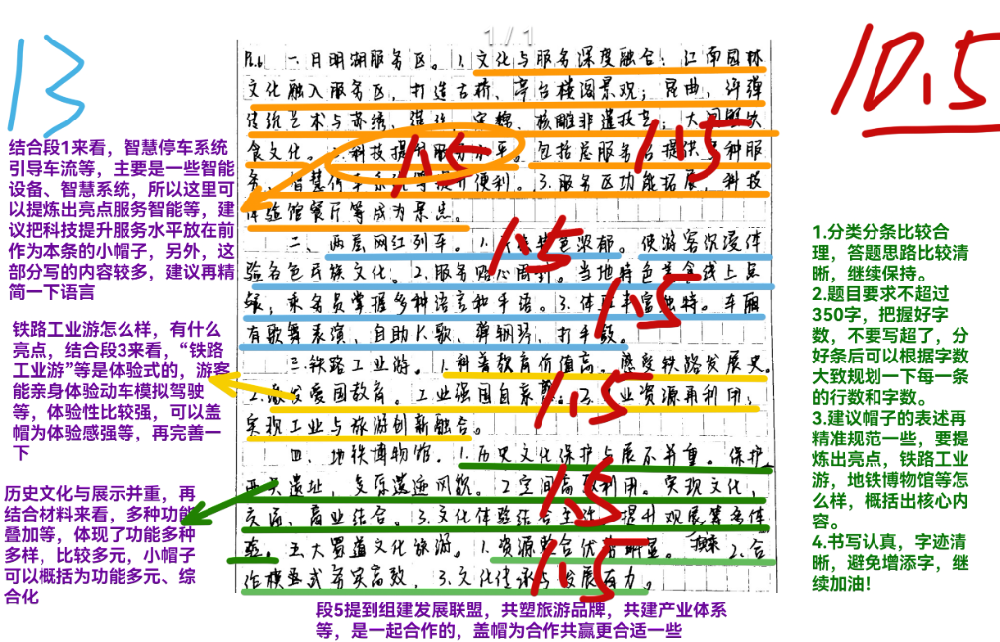
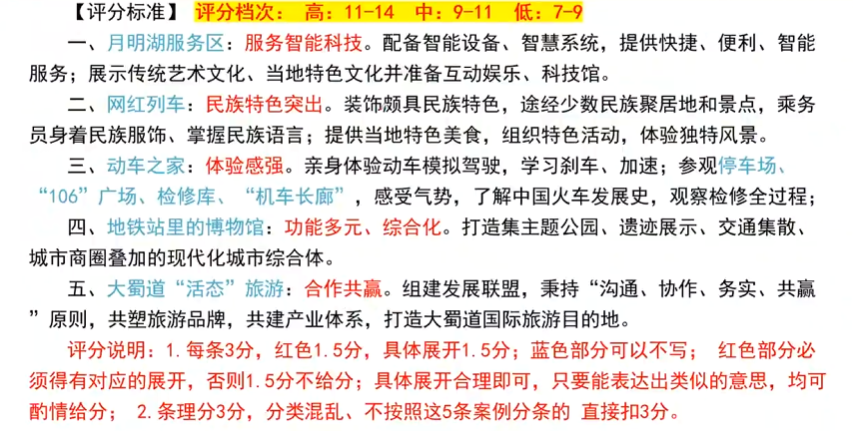
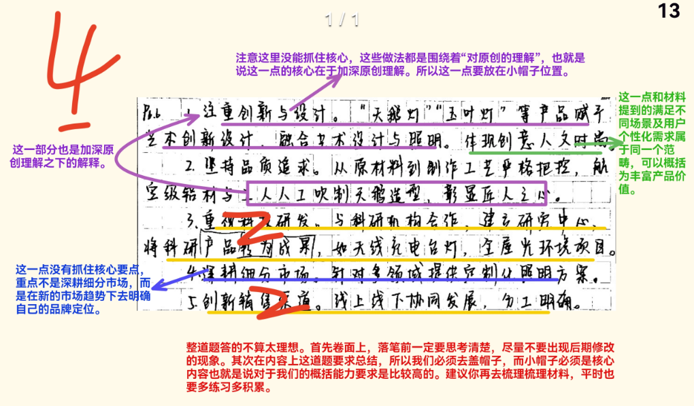
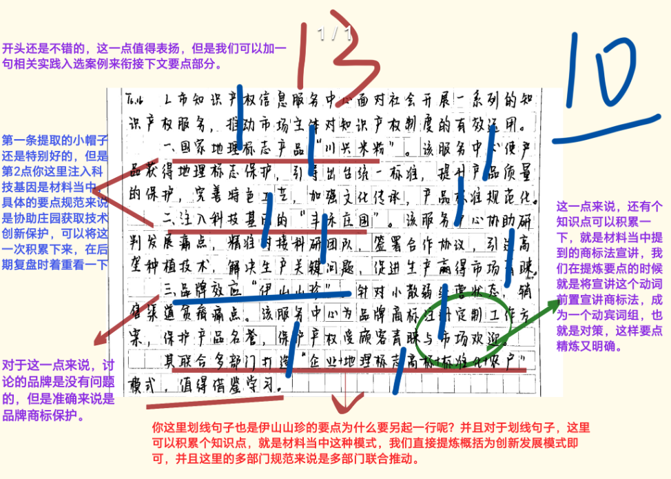
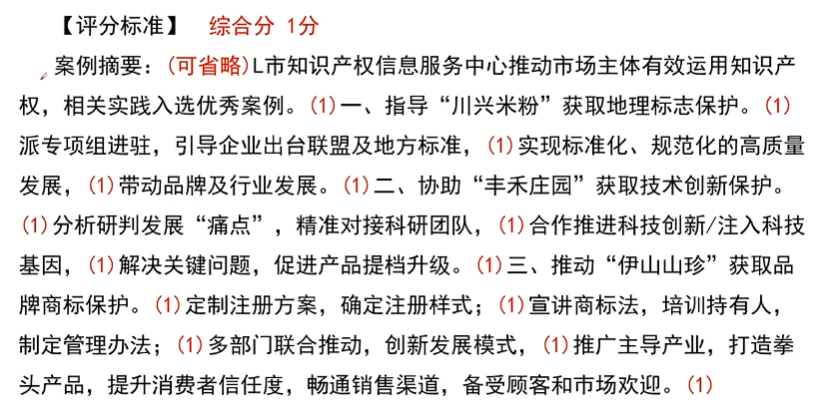
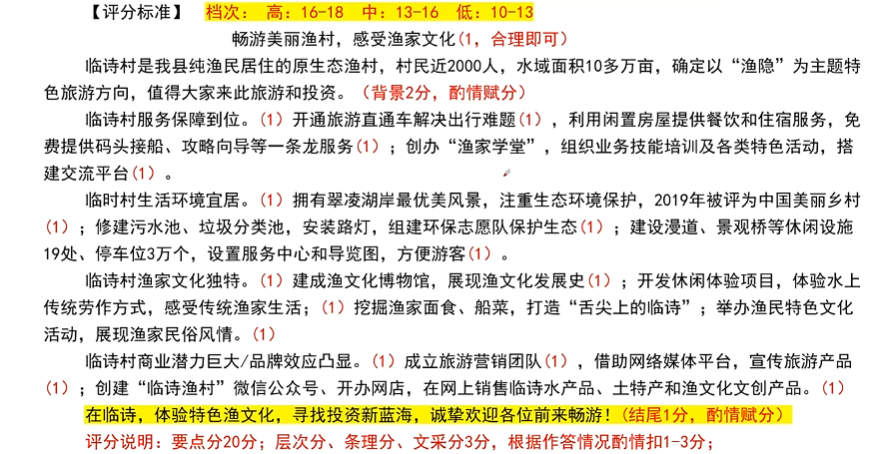
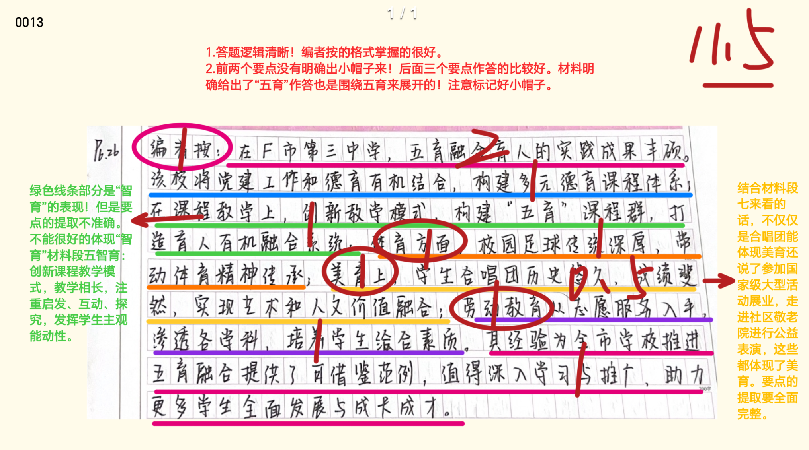
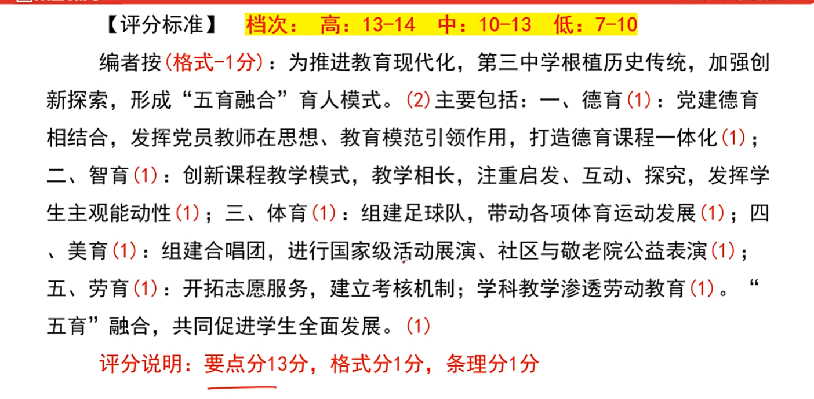
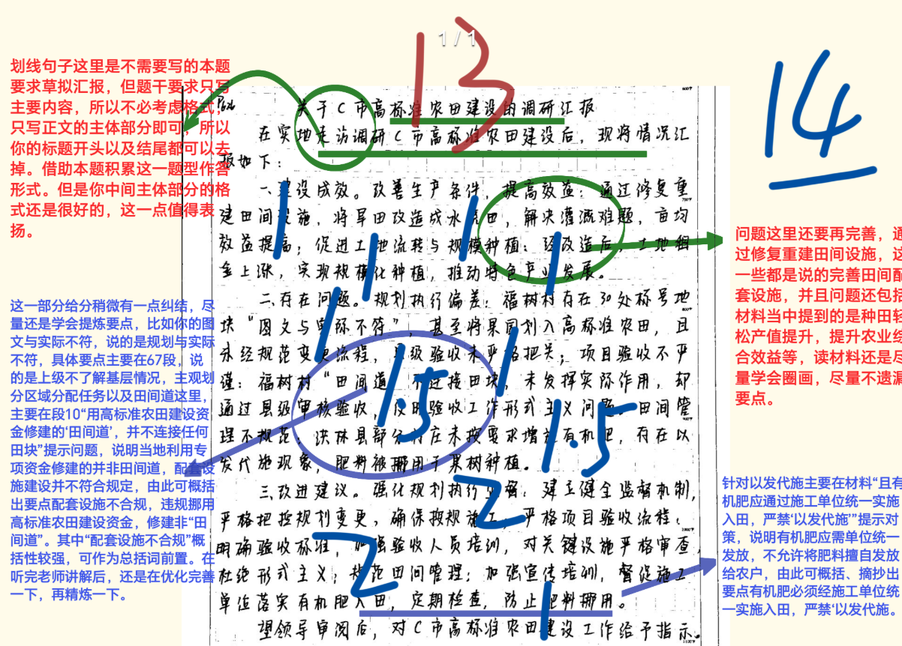

### 小题1

10.5/15
本次最高分15，平均分10

::noto:banana::概括题

:::: card-grid
::: card title="答题" icon="twemoji:astonished-face"

:::

::: card title="答案" icon="typcn:tick-outline"

:::
::::

::: card title="总结回顾" icon="noto:backhand-index-pointing-right-dark-skin-tone"

1. ==月明湖服务区=={.info}：==服务智能科技==。配备智能设备、智慧系统、提供快捷、便利、智能服务；展示传统艺术文化、当地特色文化并准备互动娱乐、科技馆。
2. ==网红列车=={.info}：==民族特色突出==。装饰颇具民族特色，途径少数民族聚居地和景点。乘务员身着民族服饰、掌握民族语言；提供当地特色美食，组织特色活动，体验独特风景。
3. ==动车之家=={.info}：==体验感强==。亲身体验动车模拟驾驶，学习刹车、加速；参观停车场、“106广场”、检修库、“机车长廊”，感受气势，了解中国火车发展史，观察检修全过程。
4. ==地铁站里的博物馆=={.info}：==功能多元、综合化==。打造集主题公园、遗迹展示、交通集散、城市商圈叠加的现代化城市综合体。
5. ==大蜀道“活态”旅游=={.info}：==合作共赢==。组建发展联盟，秉持“沟通、协作、务实、共赢”原则，共塑旅游品牌，共建产业体系，打造大蜀道国际旅游目的地。

==注意: 同样是用问句、“更”等分隔分论点，同时注意帽子的积累=={.danger}

:::

### 小题2

4/10
本次最高分10，平均分6.8

::noto:banana::概括题

:::: card-grid
::: card title="答题" icon="twemoji:astonished-face"

:::

::: card title="答案" icon="typcn:tick-outline"

:::
::::

::: card title="总结回顾" icon="noto:backhand-index-pointing-right-dark-skin-tone"

1. 加深==原创=={.info}理解。精进工艺，发挥匠人/工匠精神，满足基本雪球，体现艺术设计。
2. 丰富==产品价值=={.info}。体现创新、时尚和现代人文理念，满足不同场景及用户个性化需求。
3. 注重==产品研发=={.info}。聘请国内外专家作为顾问，与科研机构、大学加强科研合作，推动产学研深度融合，提升技术含量。
4. 明确==品牌定位=={.info}。把握全新趋势，深耕细分市场，完善产品体系。
5. ==创新=={.info}销售==渠道=={.info}。线上直播触达年轻消费者、销售单品；线下门店负责服务与体验。

==注意: 产品小帽子学习=={.danger}

:::

### 小题3

10/20
本次最高分20，平均分10.7

::noto:banana::概括题

:::: card-grid
::: card title="答题" icon="twemoji:astonished-face"

:::

::: card title="答案" icon="typcn:tick-outline"

:::
::::

::: card title="总结回顾" icon="noto:backhand-index-pointing-right-dark-skin-tone"

==一、价值评判==：

一方认为其走红反映文化自信和国力上升，促进音乐文化多样性发展，为民乐提供舞台和机会；让民乐更有生命力、活力、更好得传承、创新传统文化；推动民乐走出国门，成为世界潮流。一方认为其没有太大价值，不够成熟、完善，是迎合市场的举动，手法简单，热闹张扬有余、沉静不足，缺少传统文化的中正平和的韵味；

==二、发展道路/方向==：

一方认为守本最重要，要守住优秀传统音乐、民族民间音乐的根。一方认为从业者要提升审美和艺术修养，坚持引领民乐高质量发展；与时俱进，与不同的文化和科技碰撞；保持个性化/差异化，应百花齐放、百家争鸣；

==三、概念界定==：

一方认为其定义模糊，界限不明，名不正则言不顺。一方认为其代表民间传统音乐，太多太细的界定会使音乐门类产生排他性，不利于其繁荣发展；新民乐是民乐持续革新的体现，不需区分。

==注意: 好难=={.danger}

:::

### 小题4

10/20

::noto:banana::公文题+概括题

:::: card-grid
::: card title="答题" icon="twemoji:astonished-face"

:::

::: card title="答案" icon="typcn:tick-outline"

:::
::::

::: card title="总结回顾" icon="noto:backhand-index-pointing-right-dark-skin-tone"

  <h3>关于加强凤凰河流域文化建设的建议</h3>

==凤凰河哺育了两岸百姓，带来了数百年的繁华，也留下了宝贵的文化遗产==。加强凤凰河流域文化建设，可进一步承载文化交流、承载文明成果，促进沿岸经济发展。但目前存在==文化核心内容不清晰==、==尚未形成流域内文化保护合力==、==体制机制不健全==等问题。对此，建议如下：

==一、加强统筹规划=={.info}。树立“一盘棋”意识，成立文化领导小组，制定系统性保护战略规划，制定年度工作要点、严格监督检查，推进跨省城多部门协调；整体推进调查研究，提炼文化核心内容。

==二、“活用”文化资源=={.info}。恢复自然风光和生态环境，利用沿岸历史遗迹、红色文化资源，推动生态旅游和文化旅游融合发展；修建博物馆等现代化文化景观，开发“风河游”APP，让游客沉浸式体验数字凤凰河新景观。

==注意: 注意首段问题的精确提炼=={.danger}

:::

### 小题5

10/20

本次最高分20，平均分10.7

::noto:banana::公文题+概括题

:::: card-grid
::: card title="答题" icon="twemoji:astonished-face"

:::

::: card title="答案" icon="typcn:tick-outline"

:::
::::

::: card title="总结回顾" icon="noto:backhand-index-pointing-right-dark-skin-tone"

案例摘要：（可省略）L市知识产权信息服务中心推动市场主体有效运用知识产权，相关实践入选优秀案例。==一、指导“川兴米粉”获取地理标注保护=={.info}。派专项组进驻，引导企业出台联盟及地方标准，实现标准化、规范化的高质量发展，带动品牌及企业发展。==二、协助“丰禾庄园”获取技术创新保护=={.info}。分析研判发展“痛点”，精准对接科研团队，合作推进科技创新/注入科技基因，解决关键问题，精准对接科研团队。==三、推动“伊山山珍”获取品牌商标保护=={.info}。定制注册方案，确定注册样式；宣讲商标法，培训持有人，指定管理办法；多部门联合推动，创新发展模式，推广主导产业，打造拳头产品，提升消费者信任度，畅通销售渠道，备受顾客和市场欢迎。

:::

### 小题6

13/20

本次最高分19，平均分11

::noto:banana::公文题+概括题

:::: card-grid
::: card title="答题" icon="twemoji:astonished-face"

:::

::: card title="答案" icon="typcn:tick-outline"

:::
::::

::: card title="总结回顾" icon="noto:backhand-index-pointing-right-dark-skin-tone"

  <h3>畅游美丽渔村，感受渔家文化</h3>

临诗村是我县纯渔民居住的原生态渔村，村民近2000人，水域面积10多亩，确定以“渔隐”为主体特色旅游方向，值得大家来此旅游和投资。

临诗村==服务保障到位=={.info}。开通旅游直通车解决出行难题，利用限制房屋提供餐饮和住宿服务，免费提供码头接船、攻略向导等一条龙服务，创办“渔家学堂”，组织业务技能培训及各类特色活动，搭建交流平台。

临诗村==生活环境宜居=={.info}。拥有翠凌湖岸最优美风景，注重生态环境保护，2019年被评为中国美丽乡村；修建污水池、垃圾分类池，安装路灯，组建环保志愿队保护生态；建设漫道、景观桥等休闲设施19处、停车位3万个，设置服务中心和导览图，方便游客。

临诗村==渔家文化独特=={.info}。建成渔文化博物馆，展现渔文化发展史；开发休闲体验项目，体验水上传统劳作方式，感受传统渔家生活；挖掘渔家面食、船菜，打造“舌尖上的临诗”；举办渔民特色文化活动，展现渔家民俗风情。

临诗村==商业潜力巨大/品牌效应凸显=={.info}。成立旅游营销团队，借助网络媒体平台，宣传旅游产品；创建“临诗渔村”微信公众号、开办网店，在网上销售临诗水产品、土特产和渔文化文创产品。

在临诗，体验特色渔文化，寻找投资新蓝海，诚挚欢迎各位前来畅游

==注意: 当题干中出现“草拟”两个字，那么任何应用文的格式都可以按照“标题+正文”的形式来书写=={.danger}

:::

### 小题7

11.5/15
本次最高分15，平均分11

:::: card-grid
::: card title="答题" icon="twemoji:astonished-face"

:::

::: card title="答案" icon="typcn:tick-outline"

:::
::::

### 小题8

14/20

平均分:本次最高分20，平均分15.6

:::: card-grid
::: card title="答题" icon="twemoji:astonished-face"

:::

::: card title="答案" icon="typcn:tick-outline"

:::
::::
