### **小题1**

4/10

::noto:banana::综合分析题

:::: card-grid
::: card title="答题" icon="twemoji:astonished-face"

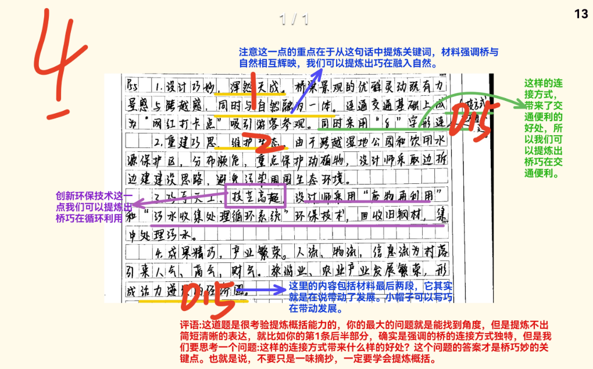

:::

::: card title="答案" icon="typcn:tick-outline"

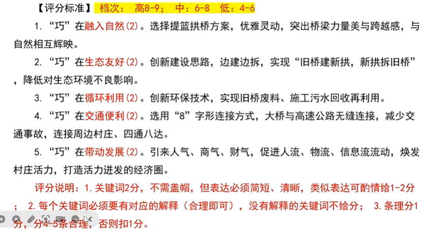

:::
::::

::: card title="总结回顾" icon="noto:backhand-index-pointing-right-dark-skin-tone"

1. “巧”在==融入自然=={.info}。选择提篮拱桥方案，优雅灵动，突出桥梁力量美与跨越感，与自然相互辉映。
2. “巧”在==生态友好=={.info}。创新建设思路，边建边拆，实现“旧桥建新拱，新拱拆旧桥”，降低对生态环境不良影响。
3. “巧”在==循环利用=={.info}。创新环保技术，实现旧桥肥料、施工污水回收再利用。
4. “巧”在==交通便利=={.info}。选用“8”字形连接方式，大桥与高速公路无缝连接，减少交通事故，连接周边村庄、四通八达。
5. “巧”在==带动发展=={.info}。引来人气、商气、财气，促进人流、物流、信息六流动，焕发村庄活力，打造活力迸发的经济圈。

==注意: 同样是用问句、“更”等分隔分论点，同时注意帽子的积累=={.danger}

:::

### 小题2

10/15

::noto:banana::综合分析题

:::: card-grid
::: card title="答题" icon="twemoji:astonished-face"

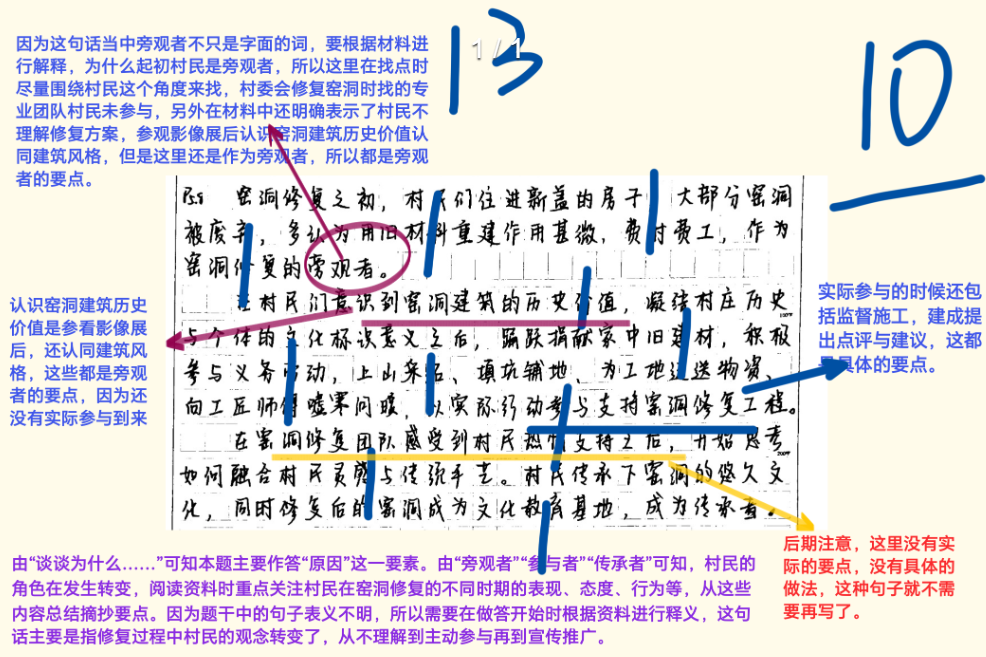

:::

::: card title="答案" icon="typcn:tick-outline"

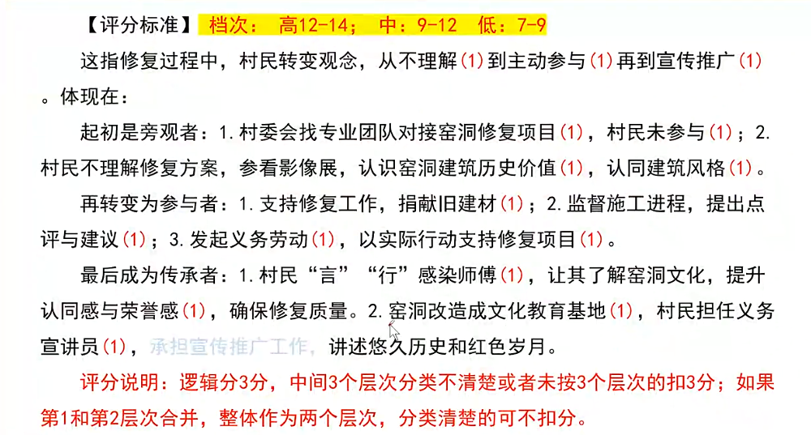

:::
::::

::: card title="总结回顾" icon="noto:backhand-index-pointing-right-dark-skin-tone"

这指修复过程中，村民转变观念，从==不理解==到==主动参与==再到==宣传推广==。体现在：

起初是旁观者：
1. 村委会找专业团队对接窑洞修复项目，村民未参与；
2. 村民不理解修复方案，参看影像展，认识窑洞建筑历史价值，认同建筑风格。

再转变为参与者：
1. 支持修复工作，捐献旧建材；
2. 监督施工进程，提出点评与建议；
3. 发起义务劳动，以实际行动支持修复项目。

最后成为传承者：
1. 村民“言”“行”感染师傅，让其了解窑洞文化，提升认同感与荣誉感，确保修复质量。
2. 窑洞改造成文化教育基地，村民担任义务宣讲员。承担宣传推广工作，讲述悠久历史和红色岁月。

==注意: 精简句子，注意对象主体=={.danger}

:::

### 小题3

14/20

::noto:banana::对策题

:::: card-grid
::: card title="答题" icon="twemoji:astonished-face"

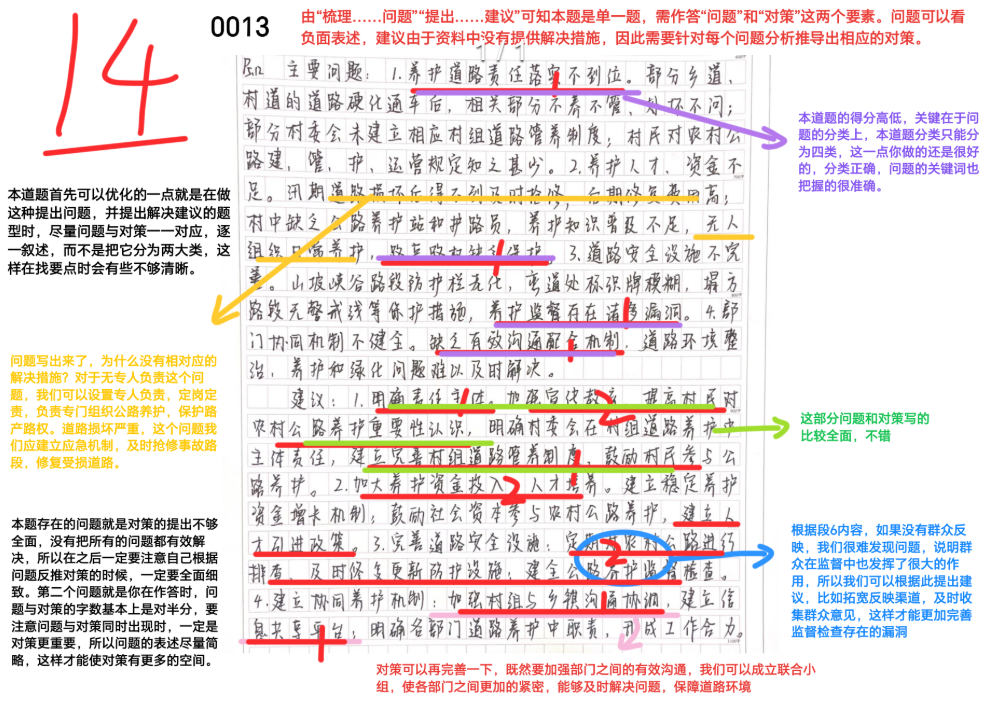

:::

::: card title="答案" icon="typcn:tick-outline"

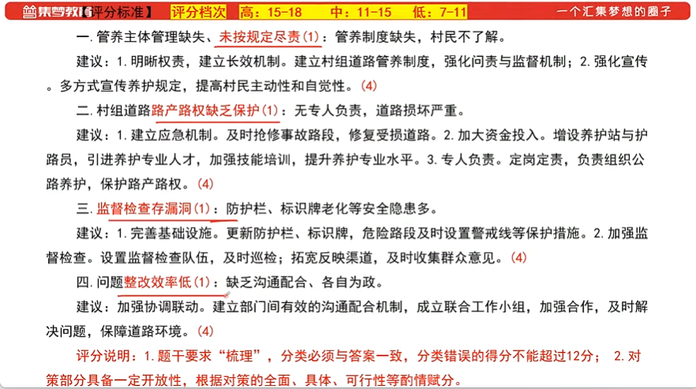

:::
::::

::: card title="总结回顾" icon="noto:backhand-index-pointing-right-dark-skin-tone"

一、管养主体管理缺失，==未按规定尽责==；管养制度缺失，村民不了解。

建议：

1. 明晰权责，建立长效机制。建立村组道路管养制度，强化问责和监督机制；
    
2. 强化宣传。多方式宣传养护规定，提高村民主动性和自觉性。
    

二、村组道路==路产路权缺乏保护==：无专人负责，道路损坏严重。

建议:

1. 建立应急机制。及时抢修事故路段，修复受损道路。
2. 加大资金投入。增设养护站与护路员，引进养护专业人才， 加强技能培训，提升养护专业水平。
3. 专人负责。定岗定责，负责组织公路养护，保护路产路权
    

三、==监督检查存漏洞==：防护栏、标识牌老化等安全隐患多。

建议：

1. 完善基础设施。更新防护栏、标识牌，危险路段及时设置警戒线等保护措施。
2. 加强监督检查。设置监督检查队伍，及时巡检；拓宽反映渠道，及时收集群众意见。
    

四、问题==整改效率低==：缺乏沟通配合、各自为证。

建议：

加强协调联动。建立部门间有效的沟通配合机制，成立联合工作小组，加强合作，及时解决问题，保障道路环境。

==注意: 学习对策题帽子=={.danger}

:::

### 小题4

10/15

::noto:banana::对策题

:::: card-grid
::: card title="答题" icon="twemoji:astonished-face"

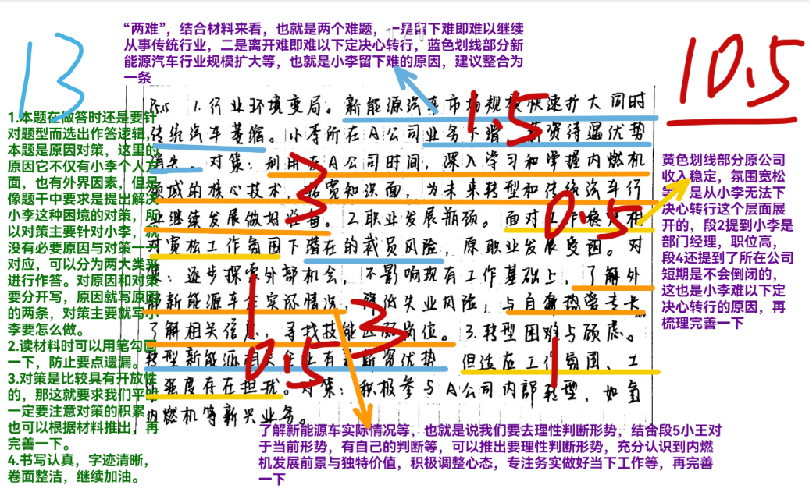

:::

::: card title="答案" icon="typcn:tick-outline"

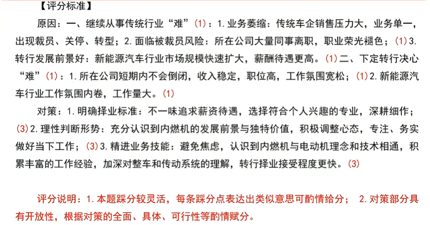

:::
::::

::: card title="总结回顾" icon="noto:backhand-index-pointing-right-dark-skin-tone"

原因：
一、继续从事传统行业“难”：
1. 业务萎缩：传统车企销售压力大，业务单一，出现裁员、关停、转型；
2. 面临被裁员风险：所在公司大量同事离职，职业荣光褪色；
3. 转业发展前景好：新能源汽车行业市场规模快速扩大，薪酬待遇更高。
    
二、下定转行决心“难”：
1. 所在公司短期内不会倒闭，收入稳定，职位高，工作氛围宽松；
2. 新能源汽车行业工作氛围内卷，工作量大。
    

对策：

1. ==明确择业标准=={.info}：不一味追求薪资待遇，选择符合个人兴趣的专业，深耕细作；
2. ==理性判断形势=={.info}：充分认识到内燃机的发展前进与独特价值，积极调整心态，专注、务实做好当下工作；
3. ==精进业务技能=={.info}：避免焦虑，认识到内燃机与电动机理念和技术相通，积累丰富的工作经验，加深对整车和传动系统的理解，转行择业接受程度更快。

==一个很值得背诵的大时代背景个人对策=={.danger}
:::

### 小题5

8.5/20

::noto:banana::综合分析题

:::: card-grid
::: card title="答题" icon="twemoji:astonished-face"

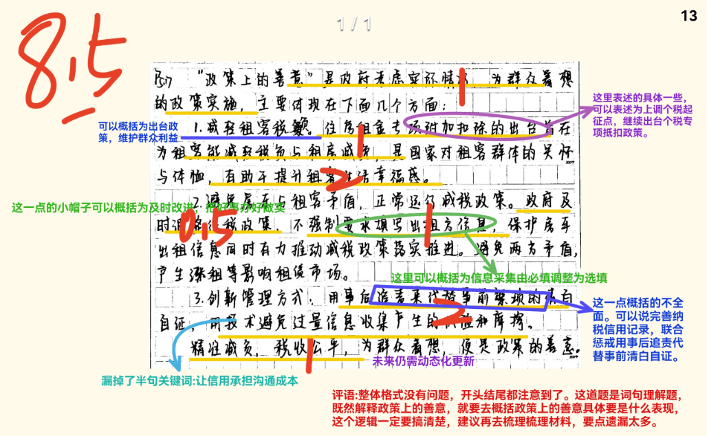

:::

::: card title="答案" icon="typcn:tick-outline"

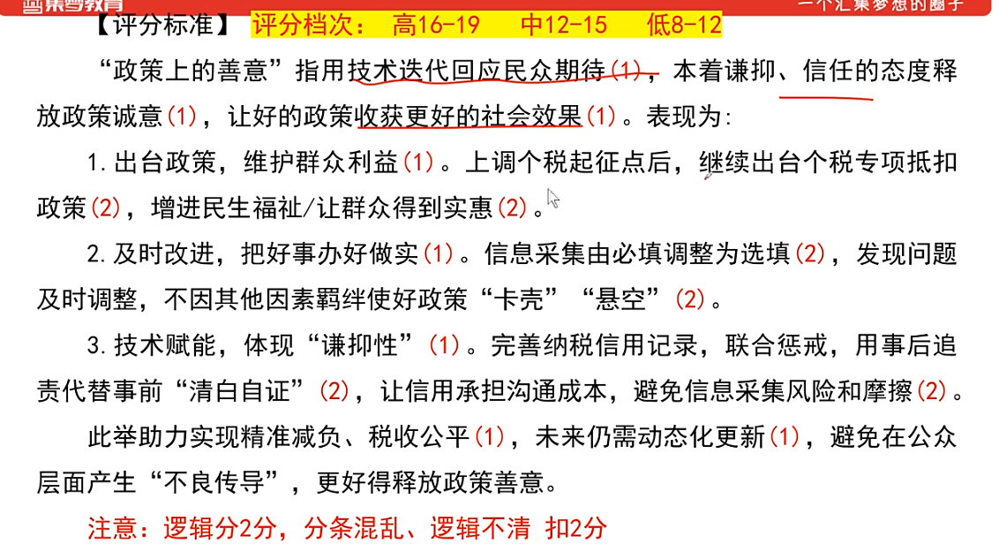

:::
::::

::: card title="总结回顾" icon="noto:backhand-index-pointing-right-dark-skin-tone"

这指的是用技术迭代回应民众期待，本着谦抑、信任的态度释放政策诚意，让好的政策收获更好的社会效果。表现为：

1. ==出台政策，维护群众利益=={.info}。上调个税起征点后，继续出台个税专项抵扣政策，增进民生福祉/让群众得到实惠。
    
2. ==及时改进，把好事办好做实=={.info}。信息采集由必填调整为选填，发现问题及时调整，不因其他因素羁绊使好政策“卡壳”“悬空”。
    
3. ==技术赋能，体现“谦抑性”=={.info}。完善纳税信用记录，联合惩戒，用事后追责代替事前“清白自证”，让信用承担沟通成本，避免信息采集风险和摩擦。
    

此举助力实现精准减负、税收公平，未来仍需动态化更新，避免在公众层面产生“不良传导”，更好得释放政策善意

:::

### 小题6

7/15

:::: card-grid
::: card title="答题" icon="twemoji:astonished-face"

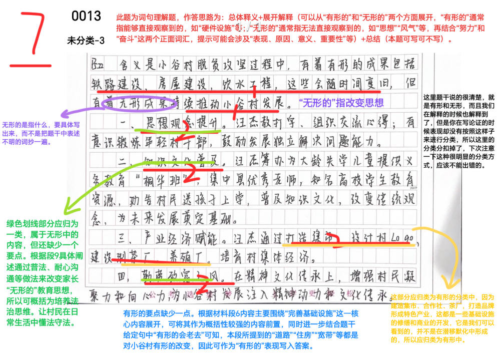

:::

::: card title="答案" icon="typcn:tick-outline"

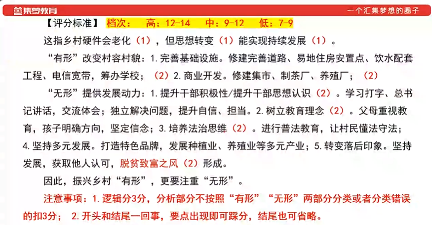

:::
::::

### 小题7

11/20

:::: card-grid
::: card title="答题" icon="twemoji:astonished-face"

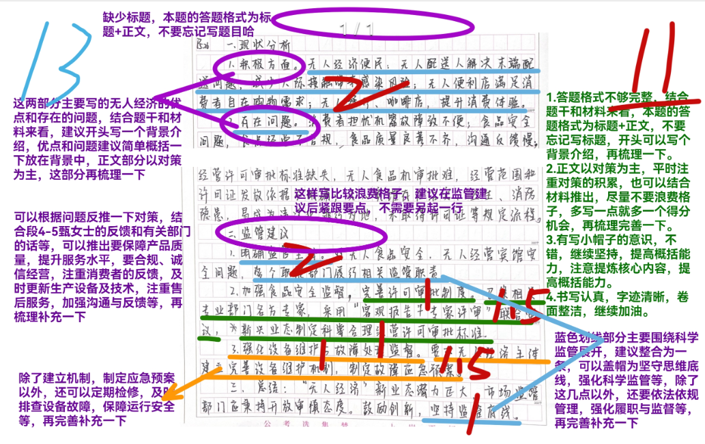

:::

::: card title="答案" icon="typcn:tick-outline"

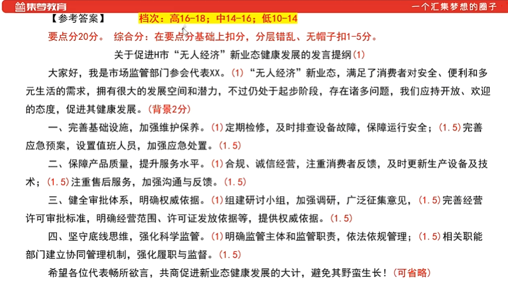

:::
::::

### 小题8

11/20

:::: card-grid
::: card title="答题" icon="twemoji:astonished-face"

:::

::: card title="答案" icon="typcn:tick-outline"

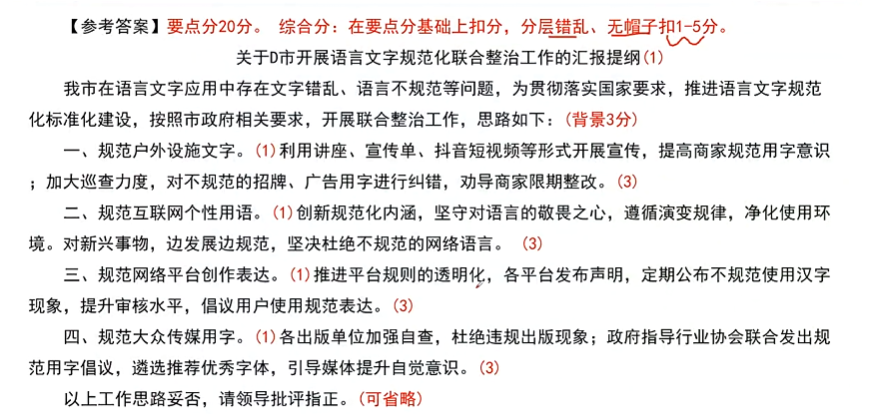

:::
::::