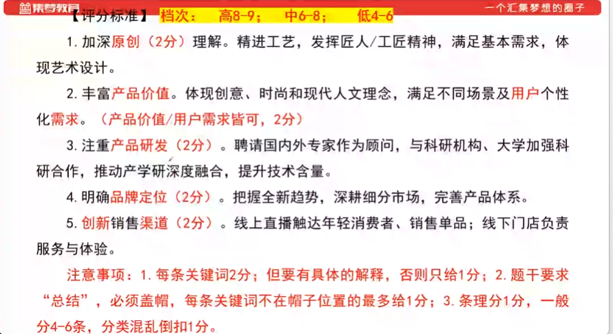
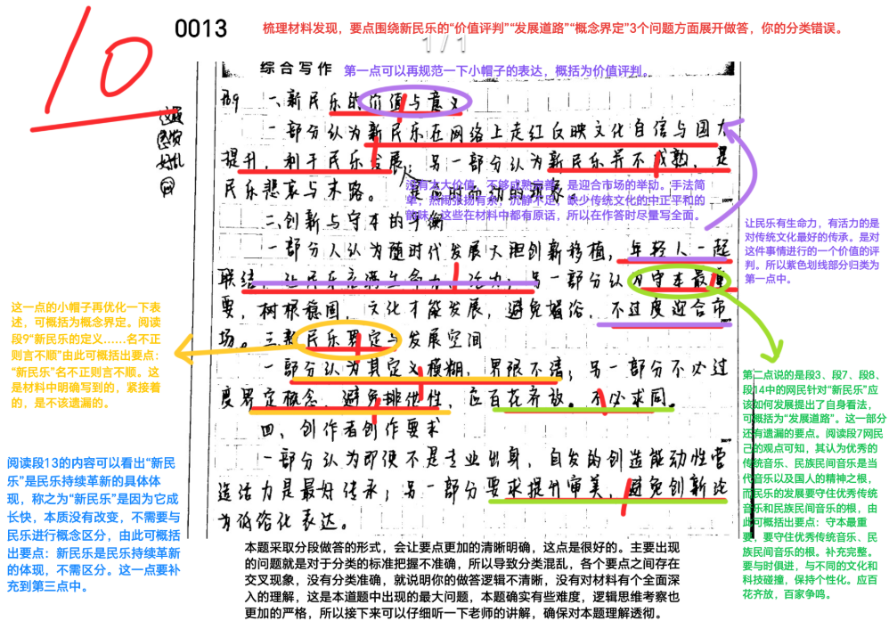
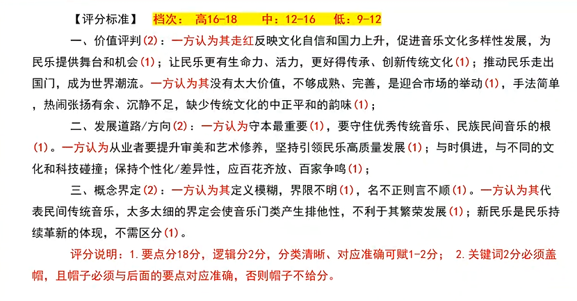
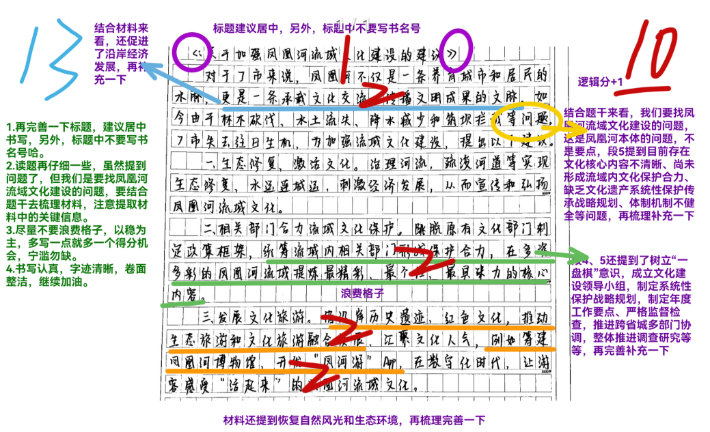
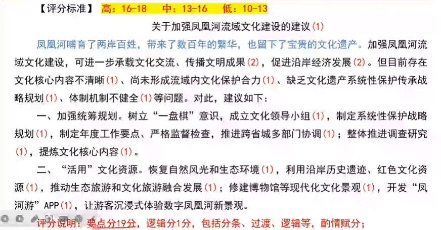
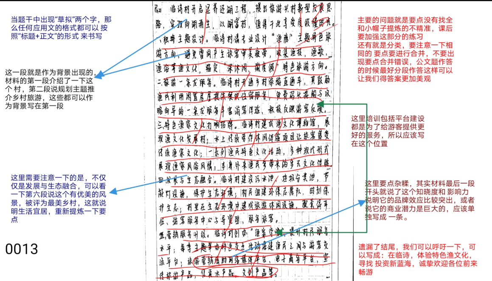
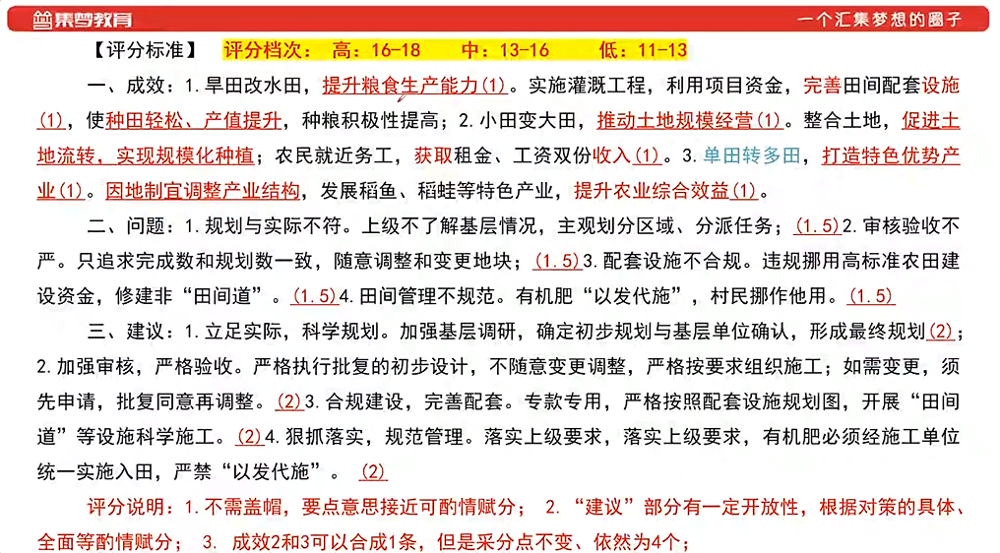

### 小题1

10.5/15
本次最高分15，平均分10

::noto:banana::概括题

:::: card-grid
::: card title="答题" icon="twemoji:astonished-face"

:::

::: card title="答案" icon="typcn:tick-outline"

:::
::::

::: card title="总结回顾" icon="noto:backhand-index-pointing-right-dark-skin-tone"

1. ==月明湖服务区=={.info}：==服务智能科技==。配备智能设备、智慧系统、提供快捷、便利、智能服务；展示传统艺术文化、当地特色文化并准备互动娱乐、科技馆。
2. ==网红列车=={.info}：==民族特色突出==。装饰颇具民族特色，途径少数民族聚居地和景点。乘务员身着民族服饰、掌握民族语言；提供当地特色美食，组织特色活动，体验独特风景。
3. ==动车之家=={.info}：==体验感强==。亲身体验动车模拟驾驶，学习刹车、加速；参观停车场、“106广场”、检修库、“机车长廊”，感受气势，了解中国火车发展史，观察检修全过程。
4. ==地铁站里的博物馆=={.info}：==功能多元、综合化==。打造集主题公园、遗迹展示、交通集散、城市商圈叠加的现代化城市综合体。
5. ==大蜀道“活态”旅游=={.info}：==合作共赢==。组建发展联盟，秉持“沟通、协作、务实、共赢”原则，共塑旅游品牌，共建产业体系，打造大蜀道国际旅游目的地。

==注意: 同样是用问句、“更”等分隔分论点，同时注意帽子的积累=={.danger}

:::

### 小题2

4/10
本次最高分10，平均分6.8

::noto:banana::概括题

:::: card-grid
::: card title="答题" icon="twemoji:astonished-face"

:::

::: card title="答案" icon="typcn:tick-outline"

:::
::::

::: card title="总结回顾" icon="noto:backhand-index-pointing-right-dark-skin-tone"

1. 加深==原创=={.info}理解。精进工艺，发挥匠人/工匠精神，满足基本雪球，体现艺术设计。
2. 丰富==产品价值=={.info}。体现创新、时尚和现代人文理念，满足不同场景及用户个性化需求。
3. 注重==产品研发=={.info}。聘请国内外专家作为顾问，与科研机构、大学加强科研合作，推动产学研深度融合，提升技术含量。
4. 明确==品牌定位=={.info}。把握全新趋势，深耕细分市场，完善产品体系。
5. ==创新=={.info}销售==渠道=={.info}。线上直播触达年轻消费者、销售单品；线下门店负责服务与体验。

==注意: 产品小帽子学习=={.danger}

:::

### 小题3

10/20
本次最高分20，平均分10.7

:::: card-grid
::: card title="答题" icon="twemoji:astonished-face"

:::

::: card title="答案" icon="typcn:tick-outline"

:::
::::

::: card title="总结回顾" icon="noto:backhand-index-pointing-right-dark-skin-tone"

==一、价值评判==：

一方认为其走红反映文化自信和国力上升，促进音乐文化多样性发展，为民乐提供舞台和机会；让民乐更有生命力、活力、更好得传承、创新传统文化；推动民乐走出国门，成为世界潮流。一方认为其没有太大价值，不够成熟、完善，是迎合市场的举动，手法简单，热闹张扬有余、沉静不足，缺少传统文化的中正平和的韵味；

==二、发展道路/方向==：

一方认为守本最重要，要守住优秀传统音乐、民族民间音乐的根。一方认为从业者要提升审美和艺术修养，坚持引领民乐高质量发展；与时俱进，与不同的文化和科技碰撞；保持个性化/差异化，应百花齐放、百家争鸣；

==三、概念界定==：

一方认为其定义模糊，界限不明，名不正则言不顺。一方认为其代表民间传统音乐，太多太细的界定会使音乐门类产生排他性，不利于其繁荣发展；新民乐是民乐持续革新的体现，不需区分。

==注意: 好难=={.danger}

:::

### 小题4

10/20

:::: card-grid
::: card title="答题" icon="twemoji:astonished-face"

:::

::: card title="答案" icon="typcn:tick-outline"

:::
::::

### 小题5

10/20
本次最高分20，平均分10.7

:::: card-grid
::: card title="答题" icon="twemoji:astonished-face"

:::

::: card title="答案" icon="typcn:tick-outline"

:::
::::

### 小题6

13/20

:::: card-grid
::: card title="答题" icon="twemoji:astonished-face"
本次最高分19，平均分11

:::

::: card title="答案" icon="typcn:tick-outline"

:::
::::

### 小题7

11.5/15
本次最高分15，平均分11

:::: card-grid
::: card title="答题" icon="twemoji:astonished-face"

:::

::: card title="答案" icon="typcn:tick-outline"

:::
::::

### 小题8

14/20

平均分:本次最高分20，平均分15.6

:::: card-grid
::: card title="答题" icon="twemoji:astonished-face"

:::

::: card title="答案" icon="typcn:tick-outline"

:::
::::
