### 作文1

本次最高分25，平均分21各位同学要继续加油哦❤

:::: card-grid
::: card title="答题" icon="twemoji:astonished-face"
<Badge type="info" text="作文" />

:::

::: card title="答案" icon="typcn:tick-outline"

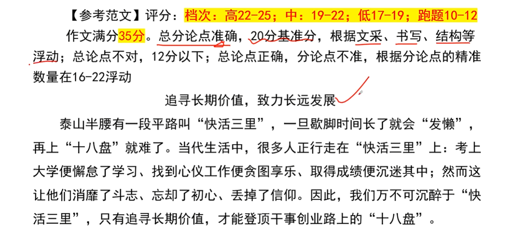

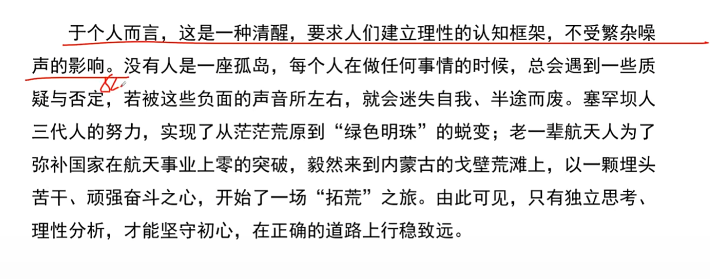

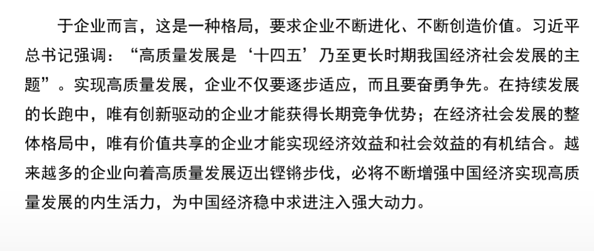

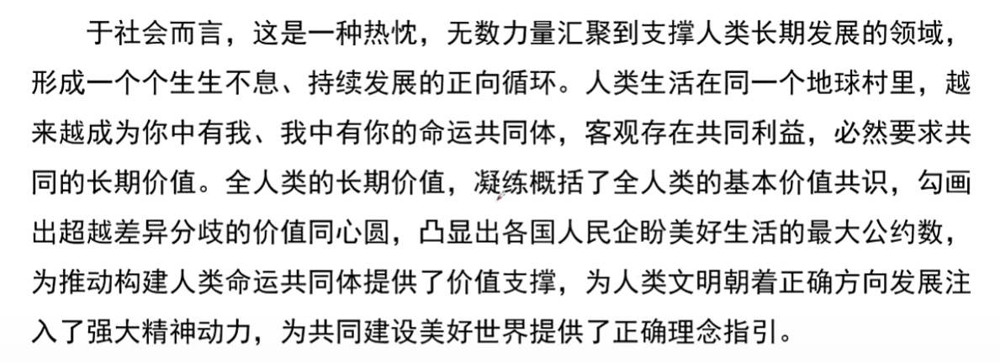

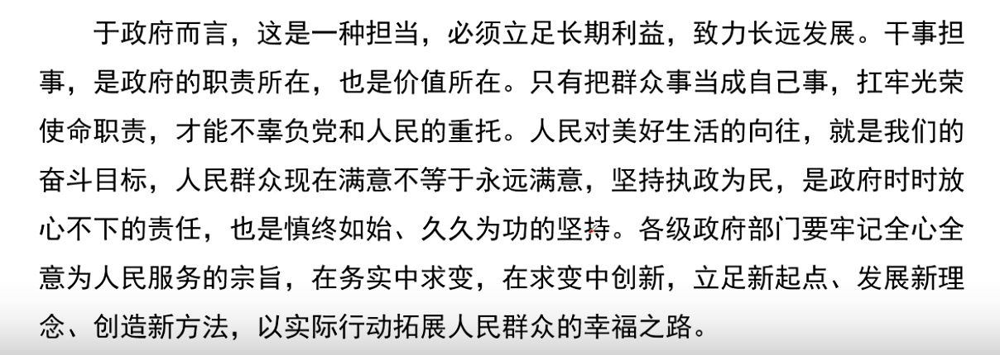

:::

::::

### 作文2

本次最高分24，平均分19.5各位同学要继续加油哦❤

:::: card-grid
::: card title="答题" icon="twemoji:astonished-face"

:::

::: card title="答案" icon="typcn:tick-outline"

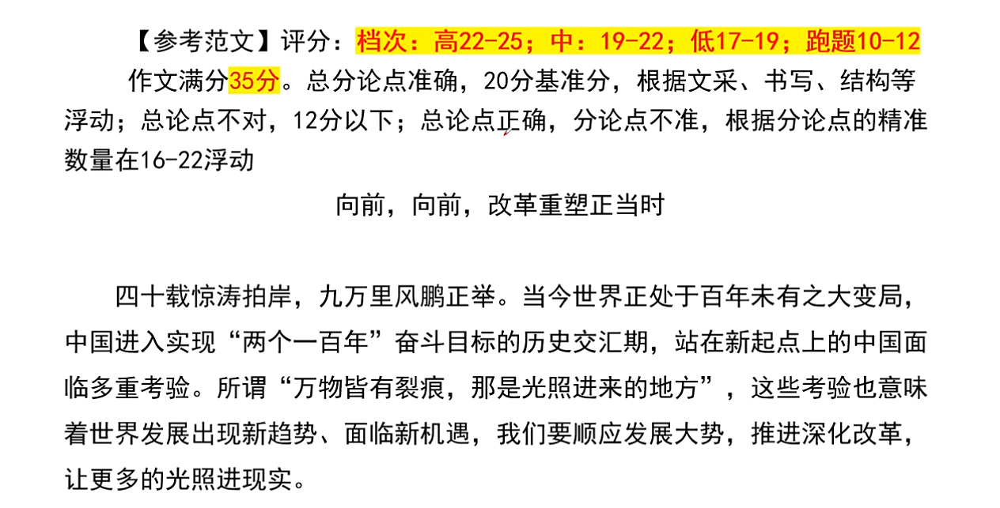

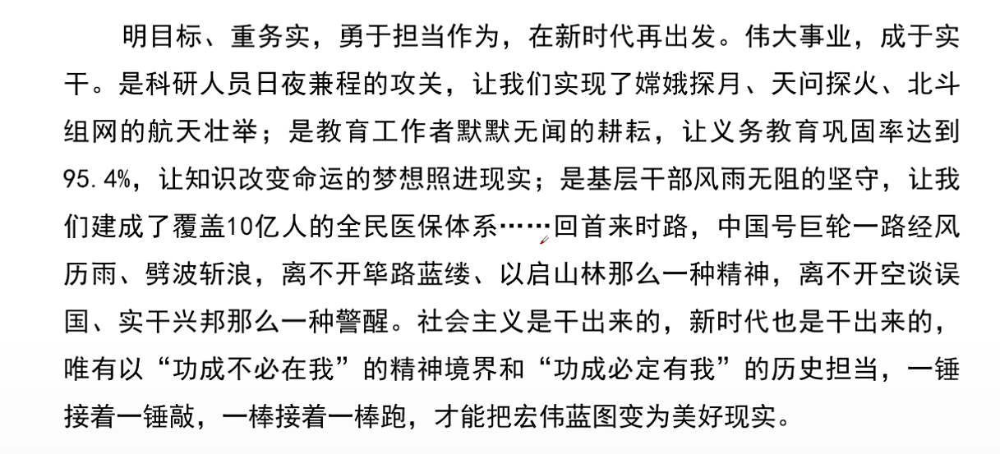

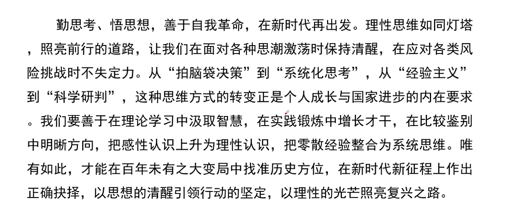

:::

::::

### 作文3

本次最高分25，平均分21各位同学要继续加油哦❤

:::: card-grid
::: card title="答题" icon="twemoji:astonished-face"

:::

::: card title="答案" icon="typcn:tick-outline"

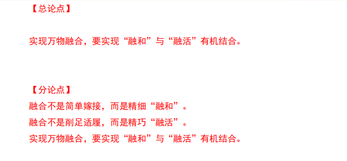

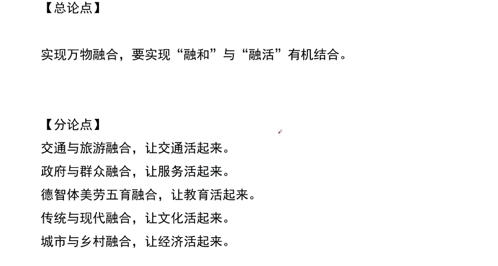

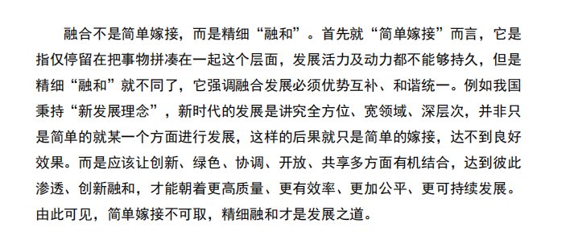

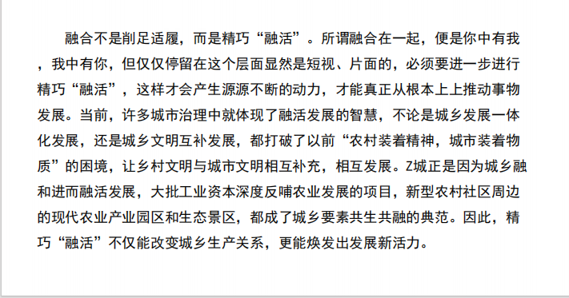

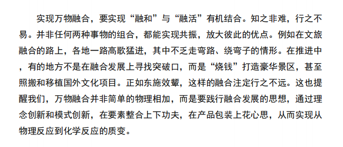

:::

### 作文4

《让旧物说话，让时光发光》
——构筑“守、创、用”的光阴三重奏

【开头】  
当流水线的新品被快速消费又快速丢弃时，那些被遗忘的旧物正悄悄聚拢成河，等待一场“复活”的浪潮。人民日报有言：“让沉睡的文化资源醒来，是对历史最深沉的致敬。”旧物不是昨日的灰烬，而是今日的星火，它们以斑驳之身，照见未来的路。

【过渡段】  
旧物的价值，正在于“旧”而不“朽”。它们曾是柴米油盐，也是诗与远方；它们曾照亮过祖辈的生活，也能点亮我们的当下。如何让旧物开口说话？如何让时光重新发光？答案藏在“守、创、用”的三重奏里。守住手艺的根，创出时代的光，用出生活的暖，让每一件旧物都成为光阴的使者。

【分论点一：守——守住手艺的根】  
一把榫卯老椅，不用一钉一铆，却稳如磐石；一架雕花拔步床，历经百年，仍暗香浮动。守，不是把旧物锁进博物馆，而是守住那份“慢工出细活”的匠心。正如故宫修复师屈峰所言：“文物修复是一场与古人的对话，也是一次向时间的敬礼。”当修复师用砂纸一寸寸拂去灰尘，用刻刀一点点复原花纹，旧物便重获心跳，手艺便得以续命。守，让旧物有根，让文化有脉，让历史不再冰冷，而成为可触可感的温度。

【分论点二：创——创出时代的光】
一块旧船木，可以化作新中式茶台；一盏煤油灯，可以变身无线充电台灯。创，是让旧物“逆生长”。北京朝阳大悦城的“旧物仓”里，1990 年的搪瓷缸成了潮流手冲咖啡杯；上海安福路的“黑石公寓”，用老式收音机外壳做成蓝牙音箱，一开声便是“穿越”的惊喜。正如《人民日报》评论：“创新不是推倒重来，而是让传统在新时代找到新表达。”创，让旧物有魂，让传统有光，让过去与未来在同一束光里交汇。

【分论点三：用——用出生活的暖】  
旧物最好的归宿，不是尘封的仓库，而是热气腾腾的日常。广州“永庆坊”把百年骑楼改造成共享厨房，老灶台上炖着新派广府菜；成都“宽窄巷子”把老木门改成咖啡桌，一杯拿铁里倒映着青砖黛瓦。正如民俗学者冯骥才所言：“文化只有回到生活，才能活下去。”当旧木桌再次承载团圆的年夜饭，当老皮箱再次装满远行的梦想，它们便不再是“物”，而是“我们”。用，让旧物有家，让记忆有床，让每一次触摸都成为与祖辈的握手，让每一次使用都把昨天的故事写成明天的诗。

【结尾】  
旧物是时光的底片，一经显影，便是滚烫的人间烟火。守住手艺的根，创出时代的光，用出生活的暖——如此，每一件旧物都能成为“光阴的使者”，在新时代的阳光下熠熠生辉。：“文化的生命力，在于被看见、被触摸、被使用。”让我们与旧物并肩，将昨天的故事书写成明天的诗。