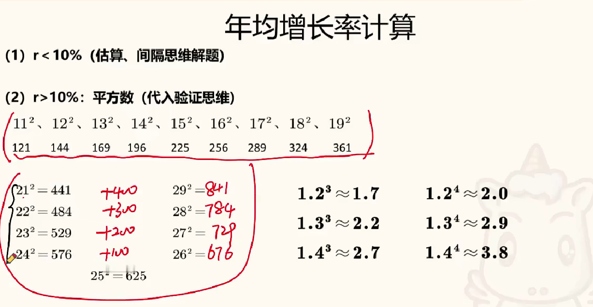

```markmap
---
markmap:
  colorFreezeLevel: 3
---


# 年均增长率
## 比较
### 识别
时间段 + 谁的年均增速最快 / 慢？
### 年份差相同
比较 “现期 ÷ 基期” 总增长率大，年均增长率大
### 年份差不同
一般不考，会考的逻辑：总增长率大，增长次数少，年均增长率大
## 计算
### 识别
时间段 + 谁的年均增速为多少？
### 公式
$(1 + 年均增长率)^n = \frac{现期}{基期}$
### 选项大部分在 10% 以内
#### 给出增长年份的增长率且为正
年均增长率 ≈ 增长率和 ÷ 年份差
#### 不给增长率
- 第一步：算总增长率
- 第二步：年均增长率 < 总增长率 ÷ 年份差
  - 经验：选略小
  - 精算：代入选项，验证间隔增长率
### 选项大部分在 10% 以上
居中代入，用平方数、立方数速算，验证公式


# 乘积增长率
## 识别
计算增长率，数据不全，主体可转化为乘积
## 公式
量的关系：A = B × C，增长率的关系：a = b + c + b × c
## 常考乘积
- 总额 = 单价 × 数量
- 部分 = 总体 × 比重
- 产量 = 单产 × 面积
- 城镇收入 = 农村收入 × 倍差


```