| 题目     | 正确率   | 时间   |
| ------ | ----- | ---- |
| 1-20   | 15/20 | 31'' |
| 21-40  | 15/20 | 28'' |
| 41-60  | 14/20 | 26'' |
| 61-80  | 17/20 | 38'' |
| 81-100 | 16/20 | 27'' |

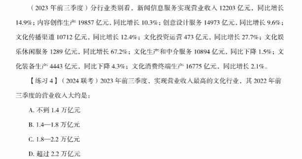
精算
C

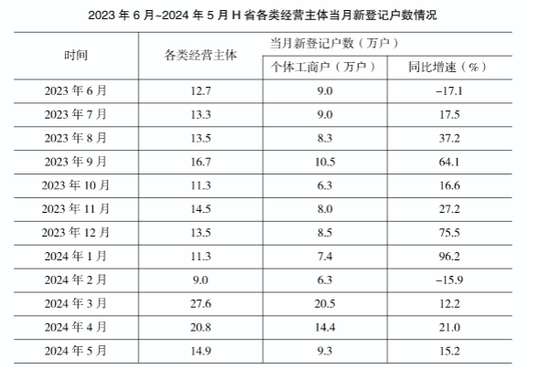

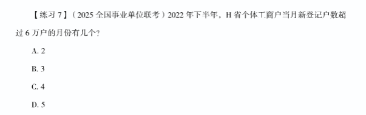

C

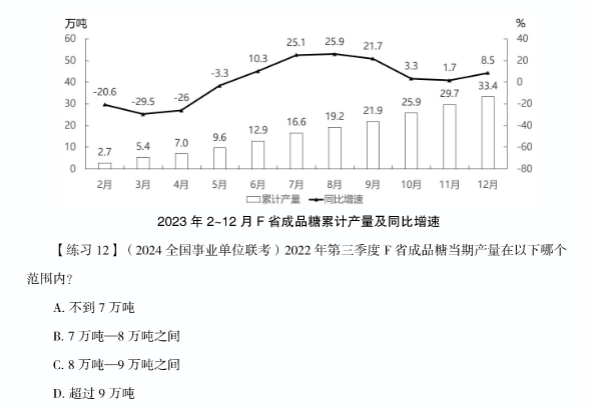

A

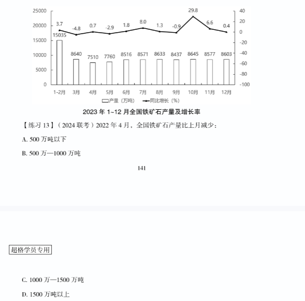

D

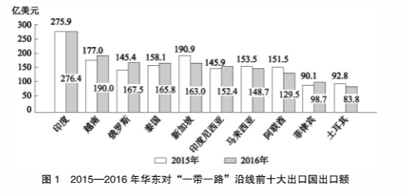

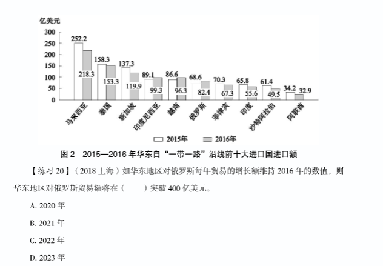

B

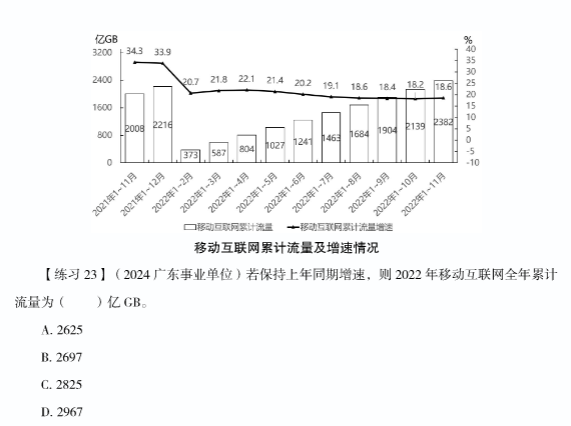

D

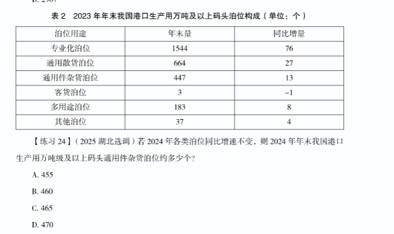
B

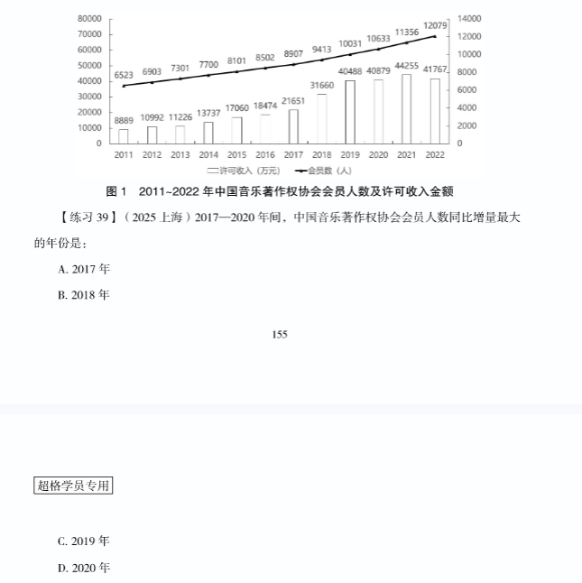

C

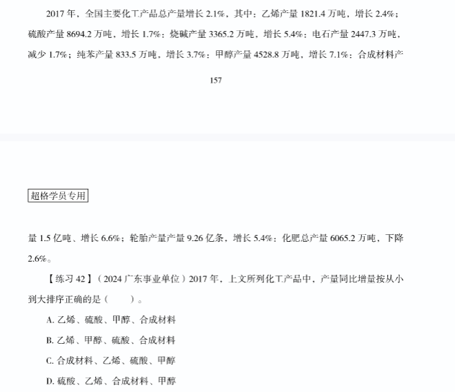

A

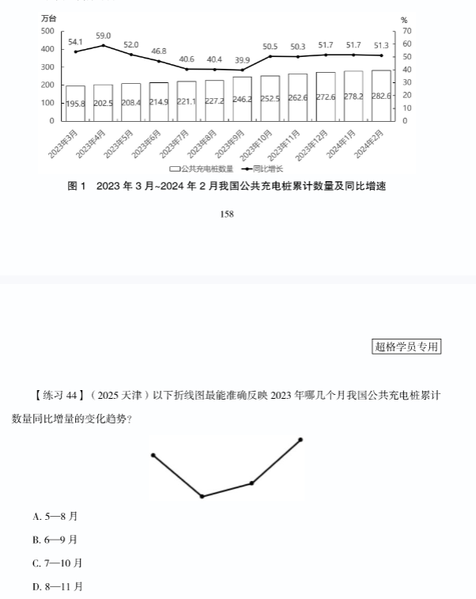

B

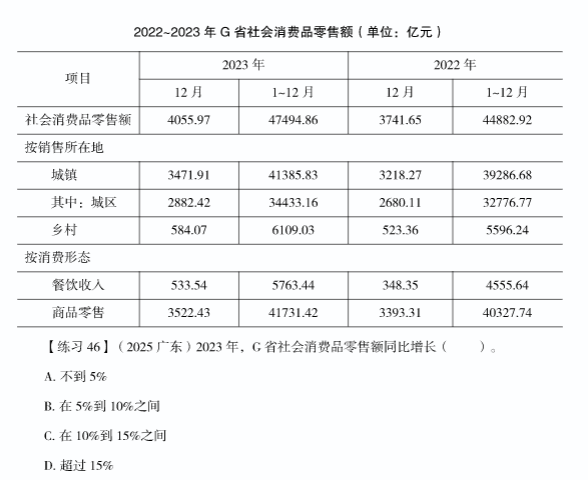

B

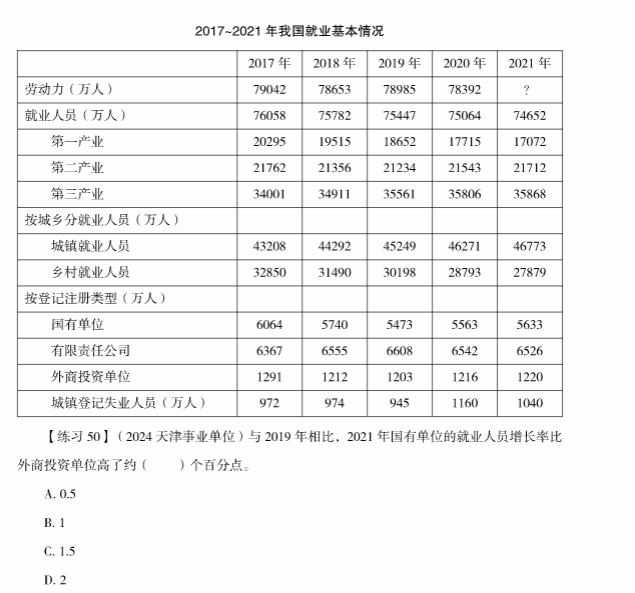
C

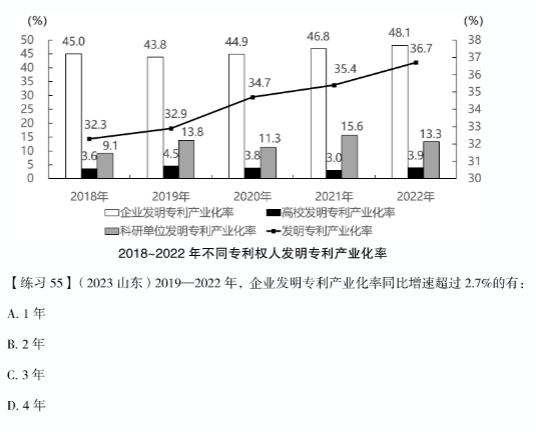

B

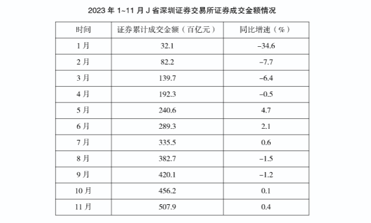

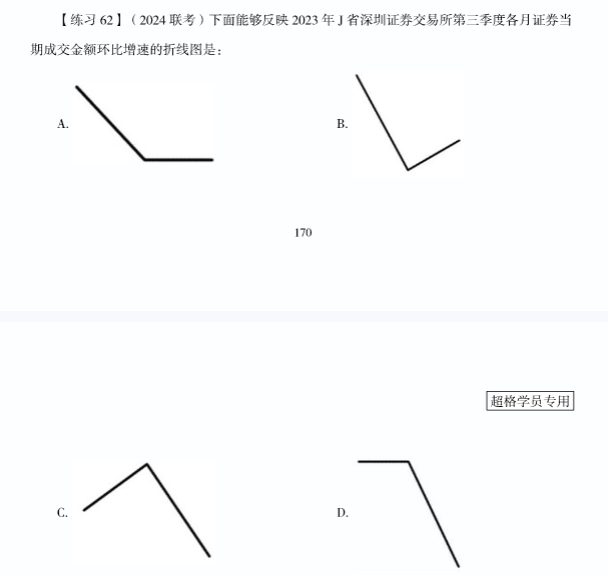

C

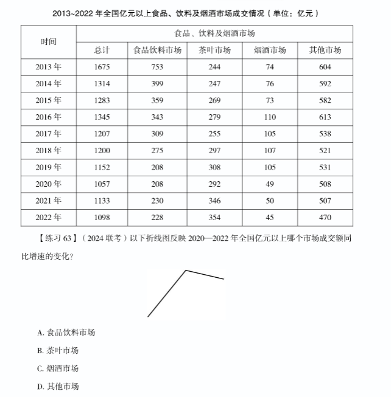

C

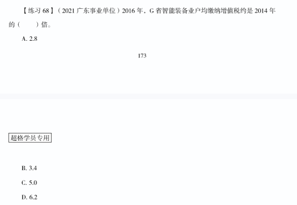
D

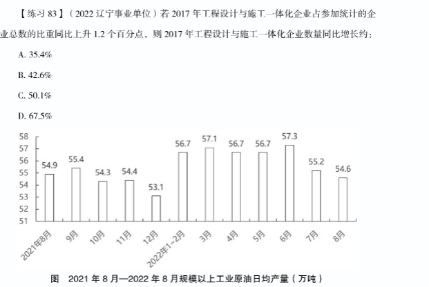
C

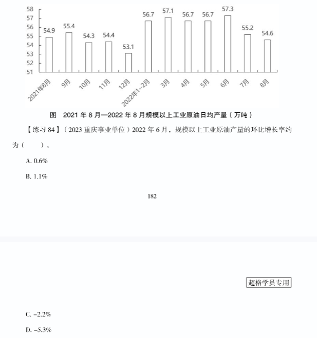
C

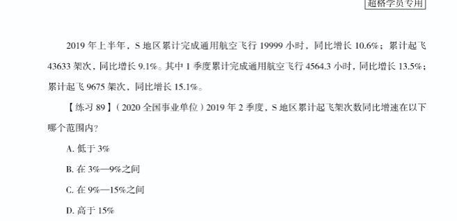

B
