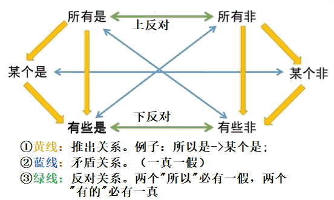

### **逻辑的精神**

**1.严谨性**

不轻易加入个人主观想法

> 有些——“存在”“至少有一个”

**2.形式推理**

不轻易加入客观常识

**3.非专业性**

不轻易加入个人专业知识

### **逻辑体系**

#### **一、必然性推理**

##### **（一）直言命题**

- 判断事物是否具有某种属性的句子
- **量项**：所有、有些、某个
- **联项**：是、非
  -  `所有是` `所有非` `有些是` `有些非` `某个是` `某个非`
- 矛盾关系
  - 矛盾：同一素材下，==两个==命题在==所有==情况下==永远一真一假==
  - 句首加`并非`
  - 实例见下表
  - 题型
    - 直接找矛盾
    - 真假话
      - 一找、二绕、三回
- 推出
  - 题型：已知真求必然为真

推出表

| 前提    | 符号  | 推出  |
| ----- | --- | --- |
| ==是== |     |     |
| 所有是   | \=> | 有些是 |
|       | \=> | 某个是 |
| 某个是   | \=> | 有些是 |
| ==非== |     |     |
| 所有非   | \=> | 有些非 |
|       | \=> | 某个是 |
| 某个非   | \=> | 有些非 |

矛盾表

| 矛盾A | 矛盾B |
| --- | --- |
| 所有是 | 有些非 |
| 所有非 | 有些是 |
| 某个是 | 某个非 |

##### **（二）联言命题**

- 若干个支命题同时成立的复言命题
- 并列词、转折词、递进词

- `p且q` -（矛盾）`非p或非q`

  - 一假即假，全真才真

- ==推出=={.danger}：已知联言命题为假的前提下，其中一个支命题为真，另一个支命题必定为假，即肯定式推理有效。

##### **（三）选言命题** 

- ==相容选言==`p或q`
  - 若干个支命题，至少有一个支命题成立的复言命题
  - 一真即真、全假才假
  - `p或q` 矛盾 `非p且非q`
  - ==推出=={.danger}：已知相容选言命题为真的前提下，其中一个支命题为假，则另外一个支命题必定为真，即否定式推理有效。
- ==不相容选言=={.info}`要么p要么q`
  - 若干个支命题，有且只有一个成立的复言命题
  - `要么p要么q` 矛盾 `要么p且q，要么非p且非q`
  - ==推出=={.danger}：已知不相容选言命题为真的前提下，其中一个支命题为假，则另外一个支命题必定为真，其中一个支命题为真，则另一个支命题必定为假，即肯定否定式推理有效。

- **题型**
  - 直接找矛盾
  - 真假话

##### **（四）假言命题**

判断支命题间条件关系的复言命题

- **充分**
  - 足够、有他就行
  - 可正推
- **必要**
  - 重要、没他不行
  - 可反推

- **规律**
  - 充分、必要条件成对出现
  - 充分-》必要 `p->q`

- 关系`p->q`
  - `p`是`q`的充分条件
  - `q`是`p`的必要条件
  - `p`源自、来自一、依赖于、离不开`q`
  - `q`是`p`的前提、基础、关键、重要、必须、必要、必不可少、不可或缺的条件

- 充分条件假言命题
  - 如果……那么/就/则……
  - 倘若……就会……
  - 假如……那么……
  - 若……则……
  - 只要……就会……
  - 一旦……就会……
  - 要想……必须……

- 必要条件假言命题
  - 只有……才……
  - 除非……否则不……
  - 没有……没有

- 推理
  - `p=>q` 可互推 `非q=>非p`。 逆否命题等价

- 传递性
  - A=>B=>C=>D=>E
  - 非E=>非D=>非C=>非B=>非A

- 矛盾命题
  - `p=>q` 矛盾 `p且非q`
  - `p=>q` 等价 `非p或q`

- 题型
  - 直接找矛盾
  - 真假话问题
  - 推出关系

|     | 矛盾                                                  | 推出                          |
| --- | --------------------------------------------------- | --------------------------- |
| 直言  | · 所有是-有些非 · 所有非-有些是 · 某个是-某个非                 | 六边形图                        |
| 联言  | `p且q` -（矛盾）`非p或非q`                                  | 假作真时真亦假                     |
| 选言  | · `p或q` 矛盾 `非p且非q` · `要么p要么q` 矛盾 `要么p且q，要么非p且非q` | 真作假时假亦真；                    |
| 假言  | · `p=>q` 矛盾 `p且非q`                                  | `p=>q` 可互推 `非q=>非p`。 逆否命题等价 |

##### **（五）朴素逻辑**

**※** 一般1道题

##### **1.方法**

- 代入排除`全面、一一对应`
- 图表📈法`多、间接`
  - 二维——表格
  - 三维——线
  - 相对位置（方位图）
- 假设法`少、直接`

##### **2.突破口**

- 确定
  - 绝对确定
  - 相对确定
- 关联
  - 多次
  - 多维
    ==选项==

#### **二、可能性推理**

> 常见因果关系

- 论据-》结论
    - 客观（论据）
    - 主观（观点结论）
        
- 位置
    - 尾句（首句）
        
- 词汇
    - 总结、因果词
        

1. 客观事实（论据）不可否定
2. 有理有据
    

- 无关项
    - 1. 话题无关
    - 2. 单因单果
    - 3. A-》B 选项 A-》C
    - 4. A-》B 选项 C-》A
    - 5. A-》B 选项 B-》C
    - 6. 另有共因
    - 7. 附加条件
            

##### **削弱**

**1、削弱强度**：因果倒置 > 否定论点 > 拆桥 > 否定论据 > 他因削弱 **2、常见提问方式**：问题包含“削弱”、“质疑”、“反驳”等字样

###### 否定论点（常考）

**1、选项特征**：与论点表述的意思相反。 **2、文段特征**： （1）文段只有论点、无论据。 （2）文段的论点和论据话题一致。

**3、解题步骤**：找出论点→预设答案→对比选项。否论点在考试中最常考，==在削弱方式中力度第二，第一是因果倒置==。

`例`：清华大学老师都爱发红包 。 `削弱论点`： ①清华大学的老师不爱发红包（是直接反着论点说，为否定论点） 。 ②清华大学的陈老师不爱发红包。（“陈老师不爱发红包”可以证明“清华的老师都爱发红包”不成立，因此是否论点。论点是“有的清华大学老师爱发红包”，那么“清华大学的陈老师不爱发红包”就不能削弱论点）

`注意`：论点绝大部分都是整体概念，也可以简单理解，整体可以否定论点，举例也可以否定论点，只不过相比较来看，从整体上否定论点的力度更强。
(整体＞部分；必然＞可能，即选项表述越绝对越可能是答案)

`错误选项`：

A. 清华大学的老师喜欢抢红包——话题不一致（“都爱发红包”和“都爱抢红包”是两回事，前者为是否出钱，后者为是否入钱。） 

B. 阳光小学的老师不爱发红包——主体不一致（论点讨论的是“清华大学老师”，选项讨论的是“阳光小学的老师”）

C. 没人知道清华大学的老师是否爱发红包——不明确选项（不知道清华大学老师喜欢发红包还是不喜欢发红包，为不明确选项，也是无关项的一种，属于逻辑中典型的错误或漏洞之一，即诉诸无知，用我的无知反驳你的观点。）

##### **加强**

**1、加强力度**：必要条件 = 搭桥 > 原因解释 > 举例子 

**2、加强定义**：顺着题干说，题干说啥就是啥。削弱可以针对论据、论点、“桥”削弱，加强也可以如此。 

（1）削弱论点就是反着论点说，但加强论点不能重复论点，如论点是“今天天气不错”，加强论点就是“今天天气确实不错”，这句话没有论证水平，而且不会这样设置选项，因为非常简单，所以不会考查加强论点。 

（2）削弱可以拆桥，加强可以搭桥。 

（3）加强论据如果重复论据就和重复论点一样，没有意义，所以加强论据不会重复论据，而是添加新论据。比如“小明是个好人”，选项是“他的学习成绩特别好、品德特别好”，补充了额外的支撑理由，补充论据是证明论点成立。

**3、常见提问方式**： 

（1）如果以下各项为真，最能加强/支持/赞同/证明上述论断的是？ 

（2）以下哪项为真，是上述论断成立的前提/假设/必要条件/加强论证

###### **补充论据**

**1、文段特征**：论点和论据话题一致。

**2、补充论据的方式**：

**（1）原因解释**：说明论点成立的原因——整体上解释。 

**（2）举例支持**：证明论点成立的例子——部分上证明。 `例如`：多吃芹菜有助于高血压患者控制血压。

A.芹菜中的丁基苯酞类物质能抑制血管平滑肌紧张，减少肾上腺素的分泌，从而降低和平稳血压——原因解释（为什么芹菜能控制血压） 

B.老明特别爱吃芹菜，困扰多年的高血压终于得到了控制——举例支持 解释原因力度更强，原因解释是解释论点为什么成立，举例子是证明论点为什么正确。

**3、做题注意**：

（1）专家说不一定对，“专家认为”是主观概念，属于诉诸权威，小道消息也不一定错，要具体分析。

（2）择优原则——以论点为核心，整体＞部分；必然＞可能；越接近论点越好

（3）往往有论点关键词或者进行同义替换。如论点是“减肥”，选项是“燃烧卡路里、减少能量”，这就是进行了同义替换，不是话题不一致喔！。

##### **常见论证模型**

###### **类比推理**

两个或两类食物在一系列属性上相同或相近，其中一个或一类事物具有某特定属性，由此推之另一个或另一类事物也具有该属性。

**加强**：本质相同

**削弱**：本质不同

###### **归纳推理**

一类事物中的某个或某些个体具有某特定属性，由此推之该类事物都具有该属性

**加强**：

1. 样本具有代表性
2. 样本数量充足
    

**削弱**：

1. 样本不具有代表性
2. 样本数量不足
    

###### **求异论证**

通过一组对照实验的差异性得出因果关系，A是B的原因。

**加强**：本质相同

- 解释因果
    

**削弱**：本质不同

- 因果倒置
    

###### **溯因推理**

若干个现象，由此推之，现象A是现象B的原因。

> 原观点：A->B 反对观点：C->B 削弱反对：A->C

###### **实践论证**

给出方案A，达到目的B

**加强**：

1. 方案可行（易行）
    
2. 能达成目的
    

**削弱**：

1. 方案不可行（难以推行）
    
2. 不能达成目的
    

###### **前提、解释、结论、评价型**

- 前提型
    
    - 加强、必要条件
        
- 解释型
    
    - **收敛思维**：客观事实不可否认
        
    - **常规思维**：兼顾矛盾双方
        
- 结论型
    
    - （==加强==）
        
    - 定位原文-比对选项
        
    - “从弱原则”
        
- 评价型
    
    - （==削弱==）
        
    - 归谬法
        
    - **一般评价**：
        
        - 1.偷换概念/混淆概念
        - 2.偷换话题/偷换论题
        - 3.自相矛盾/两可两不可
            
    - **相似结构型**
