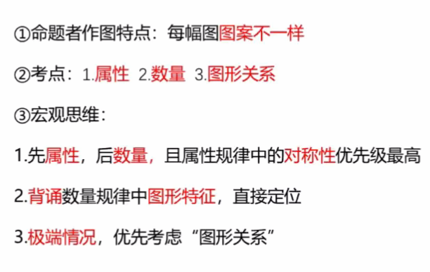
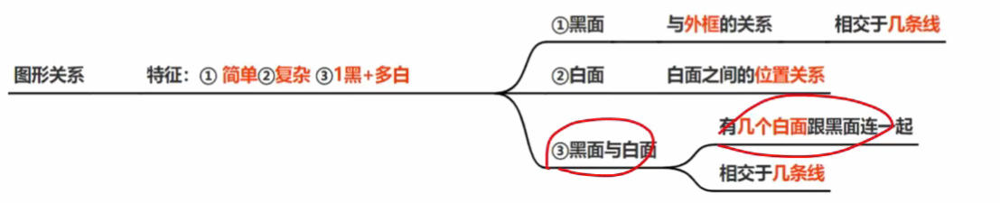

### **属性**
```markmap
---
markmap:
  colorFreezeLevel: 3
---

# 属性
## 1/2，1/3曲线
- 曲直性

## 生活化图形
- 开闭性
  - 拓展：【生活化思路】面、部分数、属性、笔画

## 规则、美观
- 对称性
  - 先识别-后细化
    - 一个规则图形
	    - 1条对称-方向
	    - 多条对称-数量
	    - 与原图形1.线2.面3.点的关系
	- 多个规则图形
		- 挨着
			- 平行、垂直、相交
		- 内外
			- 识别、运算 


```

### **图形间关系**
```markmap
---
markmap:
  colorFreezeLevel: 3
---

# 图形间关系
## 简单：2-4个图案
- 相离/包含
- 相交
  - 点
    - 切点/交点、曲直性
  - 线
    - 数量，长/短，整体/局部，曲线/直线、线的位置
  - 面
	- 形状、属性、面积

## 复杂图形：共同图案+复杂图案
- 考虑两者之间位置关系  


```